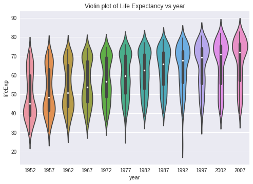

##  Part 1: Regression analysis of Gapmind Data


```python
#import all needed libraries for part 1
import random
import numpy as np
import pandas as pd
import matplotlib.pyplot as plt
#from ggplot import *
import scipy
import statsmodels
import seaborn as sns
import sklearn
from sklearn import datasets, linear_model, metrics
import statsmodels.formula.api as smf
```


```python
#extract the raw data
url = "https://raw.githubusercontent.com/jennybc/gapminder/master/data-raw/08_gap-every-five-years.tsv"
data = pd.read_csv(url, sep='\t')
data.sort_values (by = 'continent', inplace = True)
data.head()
```


<div>
<style>
    .dataframe thead tr:only-child th {
        text-align: right;
    }

    .dataframe thead th {
        text-align: left;
    }

    .dataframe tbody tr th {
        vertical-align: top;
    }
</style>
<table border="1" class="dataframe">
  <thead>
    <tr style="text-align: right;">
      <th></th>
      <th>country</th>
      <th>continent</th>
      <th>year</th>
      <th>lifeExp</th>
      <th>pop</th>
      <th>gdpPercap</th>
    </tr>
  </thead>
  <tbody>
    <tr>
      <th>1703</th>
      <td>Zimbabwe</td>
      <td>Africa</td>
      <td>2007</td>
      <td>43.487</td>
      <td>12311143</td>
      <td>469.709298</td>
    </tr>
    <tr>
      <th>1306</th>
      <td>Sao Tome and Principe</td>
      <td>Africa</td>
      <td>2002</td>
      <td>64.337</td>
      <td>170372</td>
      <td>1353.092390</td>
    </tr>
    <tr>
      <th>456</th>
      <td>Egypt</td>
      <td>Africa</td>
      <td>1952</td>
      <td>41.893</td>
      <td>22223309</td>
      <td>1418.822445</td>
    </tr>
    <tr>
      <th>457</th>
      <td>Egypt</td>
      <td>Africa</td>
      <td>1957</td>
      <td>44.444</td>
      <td>25009741</td>
      <td>1458.915272</td>
    </tr>
    <tr>
      <th>458</th>
      <td>Egypt</td>
      <td>Africa</td>
      <td>1962</td>
      <td>46.992</td>
      <td>28173309</td>
      <td>1693.335853</td>
    </tr>
  </tbody>
</table>
</div>


### Exercise 1
**Make a scatter plot of life expectancy across time**


```python
data['year'].unique()
```


    array([2007, 2002, 1952, 1957, 1962, 1967, 1972, 1977, 1982, 1987, 1992,
           1997])


```python
# scatter plot of life expectancy across time
plt.scatter(data['year'], data['lifeExp'])
plt.ylabel("Life expectancy")
plt.xlabel("Time in years")
plt.title("Life Expectancy over Time")
plt.show()

```


### Question 1
**Is there a general trend (e.g., increasing or decreasing) for life expectancy across time? **
It seems that there is a tendency of life expectancy to increase over time because if a line was to be drawn accross the bottom and top of the scatter plots for each year it would show a line with a positive slope. From the data life expectancy in the 1950s was aroung 29 to 70 while near 2010 life expectancy was aroung 40 to 80 which shows that there seems to be a general increase of life expectancy over the years from 1950 to 2010.

**Is this trend linear?** The trend seems somewhat linear because the life Expectancy seems to be slowly growing.


```python
sns.violinplot(x = 'year', y = 'lifeExp', data = data, bw =.3 )
plt.title("Violin plot of Life Expectancy vs year")
plt.show()
    
```





### Question 2
**How would you describe the distribution of life expectancy across countries for individual years? Is it skewed, or not? Unimodal or not? Symmetric around it’s center?**
1. The violin plots at the extreme ends of the x axis are unimodal.
2. The violin plots at the extreme ends are also non-symmetric around the centre.
3. Some of the violin plots have bimodal distributions especially those near the center of the x-axis such as around 1972.


### Question 3 
**Suppose I fit a linear regression model of life expectancy vs. year (treating it as a continuous variable), and test for a relationship between year and life expectancy, will you reject the null hypothesis of no relationship?**
I would reject the null hypothesis of no relationship because from the violin plots as the years increase the probability of having a higher life expectancy also increases showing that there is a clear relationship between life expectancy and years.

### Question 4 
**What would a violin plot of residuals from the linear model in Question 3 vs. year look like? **
The violin plot of residuals vs year would be almost similar to the violin plot of life expectancy vs year because the probabilities for life expectancy haven't changed. The residuals are just a transformation of life expectancy which shouldn't affect proability.

### Question 5
**According to the assumptions of the linear regression model, what should that violin plot look like?**
The violin plot should be unimodal and symmetric because the assumption that there is a linear relationship between the data, suggests that there is a higher probability of the scatter plot points being closer to the regression line than being far from the regression line. Therefore the scatter plot points should be symmetric about the regression line thus making the violin plot of residuals vs year to be symmetric too.

### Exercise 2
** Fit a linear regression model using, e.g., the LinearRegression function from Scikit-Learn or the closed-form solution we derived in class, for life expectancy vs. year **


```python
# Split the data into training/testing sets
data_train = data.sample(frac=0.66, replace=True,axis = 0)
data_test = data.sample(frac=0.46, replace=True,axis = 0)

data_x_train = data_train['year'].reshape(-1,1) 
data_x_test = data_test['year'].reshape(-1,1)

data_y_train = data_train['lifeExp'].reshape(-1,1)
data_y_test = data_test['lifeExp'].reshape(-1,1)

# Create linear regression object
regr1 = linear_model.LinearRegression()

# Train the model using the training sets
regr1.fit(data_x_train, data_y_train)

intercept = regr1.intercept_
co_eff = regr1.coef_
variance = regr1.score(data_x_test, data_y_test)
mean_sq_err1 = np.mean((regr1.predict(data_x_test) - data_y_test) ** 2)
intercept = regr1.intercept_

# The Intercept
print('Intercept: \n', intercept)
# The coefficients
print('Coefficients: \n', regr1.coef_)
# The mean squared error
print("Mean squared error: %.2f"
      % np.mean((regr1.predict(data_x_test) - data_y_test) ** 2))
# Explained variance score: 1 is perfect prediction
print('Variance score: %.2f' % regr1.score(data_x_test, data_y_test))

# Plot outputs
plt.scatter(data_x_test, data_y_test,  color='black')
plt.plot(data_x_test, regr1.predict(data_x_test), color='blue',
         linewidth=3)


plt.title("Scatter plot of Life Expectancy vs year")
plt.show()


```

    Intercept: 
     [-712.88320647]
    Coefficients: 
     [[ 0.39041244]]
    Mean squared error: 131.61
    Variance score: 0.17


### Question 6
**On average, by how much does life expectancy increase every year around the world?**
Based on the co-efficient of the linear regression, the life expectancy increases by **0.31361024 years** every year.


### Question 7
**Do you reject the null hypothesis of no relationship between year and life expectancy? Why?**

I reject the null hypothesis because there seems to exist a linear relationship between life expectancy and time in years because the regression line from exercise two has a significant positive slope.


```python
# Find the residuals and store them in the dataframe data
data['residues'] = data['lifeExp'] - (intercept[0] + co_eff[0,0]*data['year'] )
data.head()
```


<div>
<table border="1" class="dataframe">
  <thead>
    <tr style="text-align: right;">
      <th></th>
      <th>country</th>
      <th>continent</th>
      <th>year</th>
      <th>lifeExp</th>
      <th>pop</th>
      <th>gdpPercap</th>
      <th>residues</th>
    </tr>
  </thead>
  <tbody>
    <tr>
      <th>1703</th>
      <td>Zimbabwe</td>
      <td>Africa</td>
      <td>2007</td>
      <td>43.487</td>
      <td>12311143</td>
      <td>469.709298</td>
      <td>-25.914875</td>
    </tr>
    <tr>
      <th>1306</th>
      <td>Sao Tome and Principe</td>
      <td>Africa</td>
      <td>2002</td>
      <td>64.337</td>
      <td>170372</td>
      <td>1353.092390</td>
      <td>-3.229811</td>
    </tr>
    <tr>
      <th>456</th>
      <td>Egypt</td>
      <td>Africa</td>
      <td>1952</td>
      <td>41.893</td>
      <td>22223309</td>
      <td>1418.822445</td>
      <td>-7.323169</td>
    </tr>
    <tr>
      <th>457</th>
      <td>Egypt</td>
      <td>Africa</td>
      <td>1957</td>
      <td>44.444</td>
      <td>25009741</td>
      <td>1458.915272</td>
      <td>-6.607233</td>
    </tr>
    <tr>
      <th>458</th>
      <td>Egypt</td>
      <td>Africa</td>
      <td>1962</td>
      <td>46.992</td>
      <td>28173309</td>
      <td>1693.335853</td>
      <td>-5.894298</td>
    </tr>
  </tbody>
</table>
</div>


### Exercise 3
**Make a violin plot of residuals vs. year for the linear model from Exercise 2**


```python
#violin plot of residuals vs year
sns.violinplot(x = 'year', y = 'residues', data = data, bw =.3 )
plt.title("Violin plot of Residuals of life Expectancy vs year")
plt.show()
```


### Question 8 
**Does the plot of Exercise 3 match your expectations (as you answered Question 4)?**

The plot matched my expectations that the shape of the violin plots shouldn't be significantly different from those in exercise 2 because the probability distribution of life expectancy vs year hasn't change despite the transformation. 

 ### Exercise 4
 **Make a boxplot (or violin plot) of model residuals vs. continent.**


```python
#box ploy of residuals vs continent
sns.boxplot(y = 'residues', x = 'continent', data = data)
plt.title("Box Plot of Residuals of Life Expectancy vs Continents")
plt.show()
```


### Question 9
**Is there a dependence between model residual and continent?**

There is a dependence between life expectancy and continent with Africa having the lowest life expectancy and oceania having the highest life expectancy.

**what would that suggest when performing a regression analysis of life expectancy across time?**
Separate data by continent and determine the rate at which life expectancy increases. This will help you answer questions like:
1. Which countries have a greater increase of life expectancy and why?
2. It will also help us pin point out continents which may have a decreasing life expectancy.

### Exercise 5
Scatter plots of life expectancy vs year for each continent


```python
continents = data.continent.unique()

for c in continents:
    # Split the data into training/testing sets

    length =  len (data.loc[data['continent'] == c])
    data_train = data.loc[data['continent'] == c].sample(frac=0.66, replace=True,axis = 0)
    data_test = data.loc[data['continent'] == c].sample(frac=0.46, replace=True,axis = 0)

    data_x_train = data_train['year'].reshape(-1,1) 
    data_x_test = data_test['year'].reshape(-1,1)

    data_y_train = data_train['lifeExp'].reshape(-1,1)
    data_y_test = data_test['lifeExp'].reshape(-1,1)

    # Create linear regression object
    regr = linear_model.LinearRegression()

    # Train the model using the training sets
    regr.fit(data_x_train, data_y_train)

    co_eff = regr.coef_
    variance =  regr.score(data_x_test, data_y_test)
    mean_sq_err = np.mean((regr.predict(data_x_test) - data_y_test) ** 2)
    intercept = regr.intercept_

    # The coefficients
    print('Coefficients: \n', regr.coef_)
    # The mean squared error
    print("Mean squared error: %.2f"
          % np.mean((regr.predict(data_x_test) - data_y_test) ** 2))
    # Explained variance score: 1 is perfect prediction
    print('Variance score: %.2f' % regr.score(data_x_test, data_y_test))

    # Plot outputs
    plt.scatter(data_x_test, data_y_test,  color='black')
    plt.plot(data_x_test, regr.predict(data_x_test), color='blue',
             linewidth=3)

    plt.title("{} Life Expectancy vs Year".format(c))

    plt.show()
```

    Coefficients: 
     [[ 0.26869665]]
    Mean squared error: 59.35
    Variance score: 0.36


    Coefficients: 
     [[ 0.39472312]]
    Mean squared error: 48.99
    Variance score: 0.32


    Coefficients: 
     [[ 0.42482299]]
    Mean squared error: 76.13
    Variance score: 0.48


    Coefficients: 
     [[ 0.20114963]]
    Mean squared error: 15.61
    Variance score: 0.47


    Coefficients: 
     [[ 0.17000659]]
    Mean squared error: 2.41
    Variance score: 0.88


### Question 10
Since the slopes of linear regression lines differ significantly from continent to continent, you should introduce an interaction term.


```python
#get the mean life expectancy for each continent for eah year

years = data.year.unique()
cont = []
yearz = []
mean_c = []


for c in continents:
    for year in years:
        mean = data.loc[ (data['continent'] == c ) & (data['year'] == year )].lifeExp.mean(axis =0)
        mean_c.append(mean)
        cont.append(c)
        yearz.append(year)

#create dataframe that will be used to calculate the interaction term
d = {'continent': cont, 'year':yearz, 'mean': mean_c}
data_mean = pd.DataFrame(data = d)

#dataframe contains mean life expectancy for each continent for each year
data_mean.head()
        
```


<div>
<table border="1" class="dataframe">
  <thead>
    <tr style="text-align: right;">
      <th></th>
      <th>continent</th>
      <th>mean</th>
      <th>year</th>
    </tr>
  </thead>
  <tbody>
    <tr>
      <th>0</th>
      <td>Africa</td>
      <td>54.806038</td>
      <td>2007</td>
    </tr>
    <tr>
      <th>1</th>
      <td>Africa</td>
      <td>53.325231</td>
      <td>2002</td>
    </tr>
    <tr>
      <th>2</th>
      <td>Africa</td>
      <td>39.135500</td>
      <td>1952</td>
    </tr>
    <tr>
      <th>3</th>
      <td>Africa</td>
      <td>41.266346</td>
      <td>1957</td>
    </tr>
    <tr>
      <th>4</th>
      <td>Africa</td>
      <td>43.319442</td>
      <td>1962</td>
    </tr>
  </tbody>
</table>
</div>


```python
#inter_term contains the expected life_expectancy after including interaction term
inter_term = []
for index, row in data.iterrows():
    
    #m which is the mean is used as the interaction term
    m = data_mean.loc[ (data_mean['year'] == row['year']) & (data_mean['continent'] == row['continent'])]['mean']
  
    #y is the new expected y value
    y = 0.5 * (intercept[0] + co_eff[0,0]*row['year']) + (0.5 * float(m))
    inter_term.append(y )
    
    
data['continent year interaction'] = inter_term
data.head()

```


<div>
<table border="1" class="dataframe">
  <thead>
    <tr style="text-align: right;">
      <th></th>
      <th>country</th>
      <th>continent</th>
      <th>year</th>
      <th>lifeExp</th>
      <th>pop</th>
      <th>gdpPercap</th>
      <th>residues</th>
      <th>continent year interaction</th>
    </tr>
  </thead>
  <tbody>
    <tr>
      <th>1703</th>
      <td>Zimbabwe</td>
      <td>Africa</td>
      <td>2007</td>
      <td>43.487</td>
      <td>12311143</td>
      <td>469.709298</td>
      <td>-25.914875</td>
      <td>66.739695</td>
    </tr>
    <tr>
      <th>1306</th>
      <td>Sao Tome and Principe</td>
      <td>Africa</td>
      <td>2002</td>
      <td>64.337</td>
      <td>170372</td>
      <td>1353.092390</td>
      <td>-3.229811</td>
      <td>65.574275</td>
    </tr>
    <tr>
      <th>456</th>
      <td>Egypt</td>
      <td>Africa</td>
      <td>1952</td>
      <td>41.893</td>
      <td>22223309</td>
      <td>1418.822445</td>
      <td>-7.323169</td>
      <td>54.229245</td>
    </tr>
    <tr>
      <th>457</th>
      <td>Egypt</td>
      <td>Africa</td>
      <td>1957</td>
      <td>44.444</td>
      <td>25009741</td>
      <td>1458.915272</td>
      <td>-6.607233</td>
      <td>55.719684</td>
    </tr>
    <tr>
      <th>458</th>
      <td>Egypt</td>
      <td>Africa</td>
      <td>1962</td>
      <td>46.992</td>
      <td>28173309</td>
      <td>1693.335853</td>
      <td>-5.894298</td>
      <td>57.171249</td>
    </tr>
  </tbody>
</table>
</div>


### Exercise 6
**Fit a linear regression model for life expectancy including a term for an interaction between continent and year**


```python
# Split the data into training/testing sets
data_train = data.sample(frac=0.66, replace=True,axis = 0)
data_test = data.sample(frac=0.46, replace=True,axis = 0)

data_x_train = data_train['year'].reshape(-1,1) 
data_x_test = data_test['year'].reshape(-1,1)

data_y_train = data_train['continent year interaction'].reshape(-1,1)
data_y_test = data_test['continent year interaction'].reshape(-1,1)

# Create linear regression object
regr2 = linear_model.LinearRegression()

# Train the model using the training sets
regr2.fit(data_x_train, data_y_train)

co_eff = regr2.coef_
variance =  regr2.score(data_x_test, data_y_test)
mean_sq_err2 = np.mean((regr2.predict(data_x_test) - data_y_test) ** 2)
intercept = regr2.intercept_

# The coefficients
print('Coefficients: \n', regr2.coef_)
# The mean squared error
print("Mean squared error: %.2f"
      % np.mean((regr2.predict(data_x_test) - data_y_test) ** 2))
# Explained variance score: 1 is perfect prediction
print('Variance score: %.2f' % regr2.score(data_x_test, data_y_test))

# Plot outputs
plt.scatter(data_x_test, data_y_test,  color='black')
plt.plot(data_x_test, regr2.predict(data_x_test), color='blue',
         linewidth=3)


plt.title("Linear regression of Life Expectancy vs year")
plt.show()


```

    Coefficients: 
     [[ 0.2468623]]
    Mean squared error: 21.22
    Variance score: 0.44


### Question 11
**Are all parameters in the model significantly different from zero? If not, which are not significantly different from zero?**

No parameter is significantly different from zero. The life expectancy mean for each continent in each year is used as the interaction term

### Question 12
**On average, by how much does life expectancy increase each year for each continent? **
Based on the plots in Exercise 5(code is in exercise 5), life expectancy increase per year for each continent is:
1. Africa : 0.26775865
2. Americas : 0.374975
3. Asia : 0.39778701
4. Europe : 0.21389787
5. Oceania : 0.19851773


```python
variance_int_term
```


    0.45958703542340207


### Exercise 7
** Perform an F-test that compares how well two models fit your data: (a) the linear regression models from Exercise 2 (only including year as a covariate) and (b) Exercise 6 (including interaction between year and continent).**


```python
ls1 = smf.ols(formula = 'lifeExp ~ year', data = data).fit()
ls2 = smf.ols(formula = 'lifeExp ~ continent*year', data = data).fit()
```


```python
ls1.summary()
```


<table class="simpletable">
<caption>OLS Regression Results</caption>
<tr>
  <th>Dep. Variable:</th>         <td>lifeExp</td>     <th>  R-squared:         </th> <td>   0.190</td> 
</tr>
<tr>
  <th>Model:</th>                   <td>OLS</td>       <th>  Adj. R-squared:    </th> <td>   0.189</td> 
</tr>
<tr>
  <th>Method:</th>             <td>Least Squares</td>  <th>  F-statistic:       </th> <td>   398.6</td> 
</tr>
<tr>
  <th>Date:</th>             <td>Wed, 19 Apr 2017</td> <th>  Prob (F-statistic):</th> <td>7.55e-80</td> 
</tr>
<tr>
  <th>Time:</th>                 <td>15:08:03</td>     <th>  Log-Likelihood:    </th> <td> -6597.9</td> 
</tr>
<tr>
  <th>No. Observations:</th>      <td>  1704</td>      <th>  AIC:               </th> <td>1.320e+04</td>
</tr>
<tr>
  <th>Df Residuals:</th>          <td>  1702</td>      <th>  BIC:               </th> <td>1.321e+04</td>
</tr>
<tr>
  <th>Df Model:</th>              <td>     1</td>      <th>                     </th>     <td> </td>    
</tr>
<tr>
  <th>Covariance Type:</th>      <td>nonrobust</td>    <th>                     </th>     <td> </td>    
</tr>
</table>
<table class="simpletable">
<tr>
      <td></td>         <th>coef</th>     <th>std err</th>      <th>t</th>      <th>P>|t|</th> <th>[95.0% Conf. Int.]</th> 
</tr>
<tr>
  <th>Intercept</th> <td> -585.6522</td> <td>   32.314</td> <td>  -18.124</td> <td> 0.000</td> <td> -649.031  -522.273</td>
</tr>
<tr>
  <th>year</th>      <td>    0.3259</td> <td>    0.016</td> <td>   19.965</td> <td> 0.000</td> <td>    0.294     0.358</td>
</tr>
</table>
<table class="simpletable">
<tr>
  <th>Omnibus:</th>       <td>386.124</td> <th>  Durbin-Watson:     </th> <td>   0.262</td>
</tr>
<tr>
  <th>Prob(Omnibus):</th> <td> 0.000</td>  <th>  Jarque-Bera (JB):  </th> <td>  90.750</td>
</tr>
<tr>
  <th>Skew:</th>          <td>-0.268</td>  <th>  Prob(JB):          </th> <td>1.97e-20</td>
</tr>
<tr>
  <th>Kurtosis:</th>      <td> 2.004</td>  <th>  Cond. No.          </th> <td>2.27e+05</td>
</tr>
</table>


```python
ls2.summary()
```


<table class="simpletable">
<caption>OLS Regression Results</caption>
<tr>
  <th>Dep. Variable:</th>         <td>lifeExp</td>     <th>  R-squared:         </th> <td>   0.693</td> 
</tr>
<tr>
  <th>Model:</th>                   <td>OLS</td>       <th>  Adj. R-squared:    </th> <td>   0.691</td> 
</tr>
<tr>
  <th>Method:</th>             <td>Least Squares</td>  <th>  F-statistic:       </th> <td>   424.3</td> 
</tr>
<tr>
  <th>Date:</th>             <td>Wed, 19 Apr 2017</td> <th>  Prob (F-statistic):</th>  <td>  0.00</td>  
</tr>
<tr>
  <th>Time:</th>                 <td>15:08:11</td>     <th>  Log-Likelihood:    </th> <td> -5771.9</td> 
</tr>
<tr>
  <th>No. Observations:</th>      <td>  1704</td>      <th>  AIC:               </th> <td>1.156e+04</td>
</tr>
<tr>
  <th>Df Residuals:</th>          <td>  1694</td>      <th>  BIC:               </th> <td>1.162e+04</td>
</tr>
<tr>
  <th>Df Model:</th>              <td>     9</td>      <th>                     </th>     <td> </td>    
</tr>
<tr>
  <th>Covariance Type:</th>      <td>nonrobust</td>    <th>                     </th>     <td> </td>    
</tr>
</table>
<table class="simpletable">
<tr>
               <td></td>                 <th>coef</th>     <th>std err</th>      <th>t</th>      <th>P>|t|</th> <th>[95.0% Conf. Int.]</th> 
</tr>
<tr>
  <th>Intercept</th>                  <td> -524.2578</td> <td>   32.963</td> <td>  -15.904</td> <td> 0.000</td> <td> -588.911  -459.605</td>
</tr>
<tr>
  <th>continent[T.Americas]</th>      <td> -138.8484</td> <td>   57.851</td> <td>   -2.400</td> <td> 0.016</td> <td> -252.315   -25.382</td>
</tr>
<tr>
  <th>continent[T.Asia]</th>          <td> -312.6330</td> <td>   52.904</td> <td>   -5.909</td> <td> 0.000</td> <td> -416.396  -208.870</td>
</tr>
<tr>
  <th>continent[T.Europe]</th>        <td>  156.8469</td> <td>   54.498</td> <td>    2.878</td> <td> 0.004</td> <td>   49.957   263.737</td>
</tr>
<tr>
  <th>continent[T.Oceania]</th>       <td>  182.3499</td> <td>  171.283</td> <td>    1.065</td> <td> 0.287</td> <td> -153.599   518.298</td>
</tr>
<tr>
  <th>year</th>                       <td>    0.2895</td> <td>    0.017</td> <td>   17.387</td> <td> 0.000</td> <td>    0.257     0.322</td>
</tr>
<tr>
  <th>continent[T.Americas]:year</th> <td>    0.0781</td> <td>    0.029</td> <td>    2.673</td> <td> 0.008</td> <td>    0.021     0.135</td>
</tr>
<tr>
  <th>continent[T.Asia]:year</th>     <td>    0.1636</td> <td>    0.027</td> <td>    6.121</td> <td> 0.000</td> <td>    0.111     0.216</td>
</tr>
<tr>
  <th>continent[T.Europe]:year</th>   <td>   -0.0676</td> <td>    0.028</td> <td>   -2.455</td> <td> 0.014</td> <td>   -0.122    -0.014</td>
</tr>
<tr>
  <th>continent[T.Oceania]:year</th>  <td>   -0.0793</td> <td>    0.087</td> <td>   -0.916</td> <td> 0.360</td> <td>   -0.249     0.090</td>
</tr>
</table>
<table class="simpletable">
<tr>
  <th>Omnibus:</th>       <td>27.121</td> <th>  Durbin-Watson:     </th> <td>   0.636</td>
</tr>
<tr>
  <th>Prob(Omnibus):</th> <td> 0.000</td> <th>  Jarque-Bera (JB):  </th> <td>  44.106</td>
</tr>
<tr>
  <th>Skew:</th>          <td>-0.121</td> <th>  Prob(JB):          </th> <td>2.65e-10</td>
</tr>
<tr>
  <th>Kurtosis:</th>      <td> 3.750</td> <th>  Cond. No.          </th> <td>2.09e+06</td>
</tr>
</table>


### Question 13
**Is the interaction model significantly better than the year-only model? Why?**
F statistic for linear regression model is 398.6
F statistic for linear regression  that includes interaction term is  424.3

424.3 is greater than 398.6 which means that the interaction model is significantly better than the year-only model.

### Exercise 8
**Make a residuals vs. year violin plot for the interaction model. Comment on how well it matches assumptions of the linear regression model. Do the same for a residuals vs. fitted values model.**


```python
data['residual_term'] = data['continent year interaction'] - data['lifeExp']
data.head()
```


<div>
<table border="1" class="dataframe">
  <thead>
    <tr style="text-align: right;">
      <th></th>
      <th>country</th>
      <th>continent</th>
      <th>year</th>
      <th>lifeExp</th>
      <th>pop</th>
      <th>gdpPercap</th>
      <th>residues</th>
      <th>continent year interaction</th>
      <th>residual_term</th>
    </tr>
  </thead>
  <tbody>
    <tr>
      <th>1703</th>
      <td>Zimbabwe</td>
      <td>Africa</td>
      <td>2007</td>
      <td>43.487</td>
      <td>12311143</td>
      <td>469.709298</td>
      <td>-24.913649</td>
      <td>67.033994</td>
      <td>23.546994</td>
    </tr>
    <tr>
      <th>1306</th>
      <td>Sao Tome and Principe</td>
      <td>Africa</td>
      <td>2002</td>
      <td>64.337</td>
      <td>170372</td>
      <td>1353.092390</td>
      <td>-2.420393</td>
      <td>65.797296</td>
      <td>1.460296</td>
    </tr>
    <tr>
      <th>456</th>
      <td>Egypt</td>
      <td>Africa</td>
      <td>1952</td>
      <td>41.893</td>
      <td>22223309</td>
      <td>1418.822445</td>
      <td>-8.431833</td>
      <td>53.739488</td>
      <td>11.846488</td>
    </tr>
    <tr>
      <th>457</th>
      <td>Egypt</td>
      <td>Africa</td>
      <td>1957</td>
      <td>44.444</td>
      <td>25009741</td>
      <td>1458.915272</td>
      <td>-7.524089</td>
      <td>55.301205</td>
      <td>10.857205</td>
    </tr>
    <tr>
      <th>458</th>
      <td>Egypt</td>
      <td>Africa</td>
      <td>1962</td>
      <td>46.992</td>
      <td>28173309</td>
      <td>1693.335853</td>
      <td>-6.619345</td>
      <td>56.824047</td>
      <td>9.832047</td>
    </tr>
  </tbody>
</table>
</div>


```python
sns.violinplot(x = 'year', y = 'residual_term', data = data, bw =.3 )
plt.title("Violin plot of Residuals of life Expectancy vs Year for interaction model")
plt.show()
```


