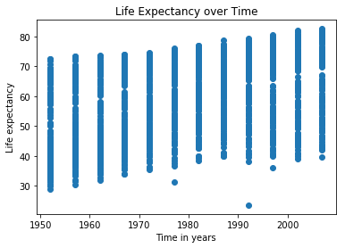
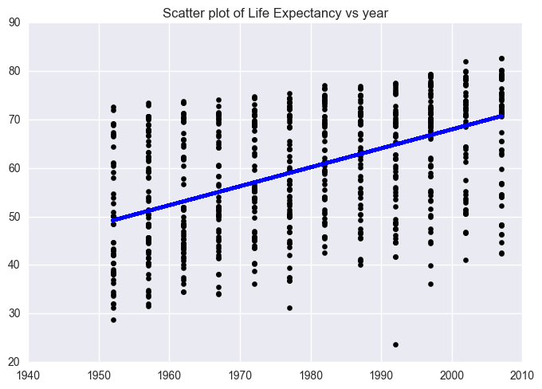
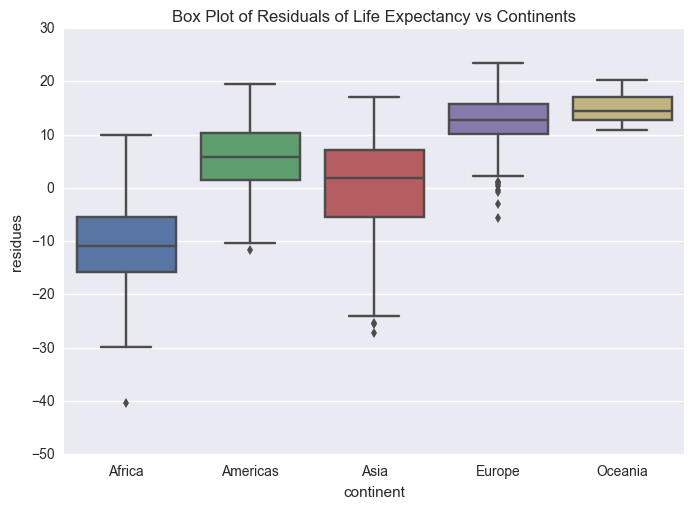
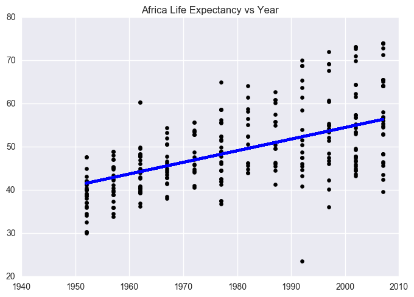
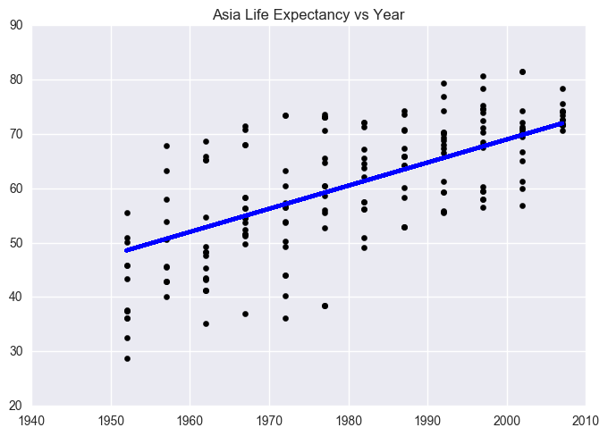
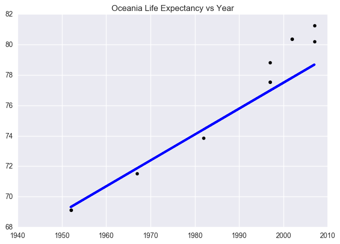
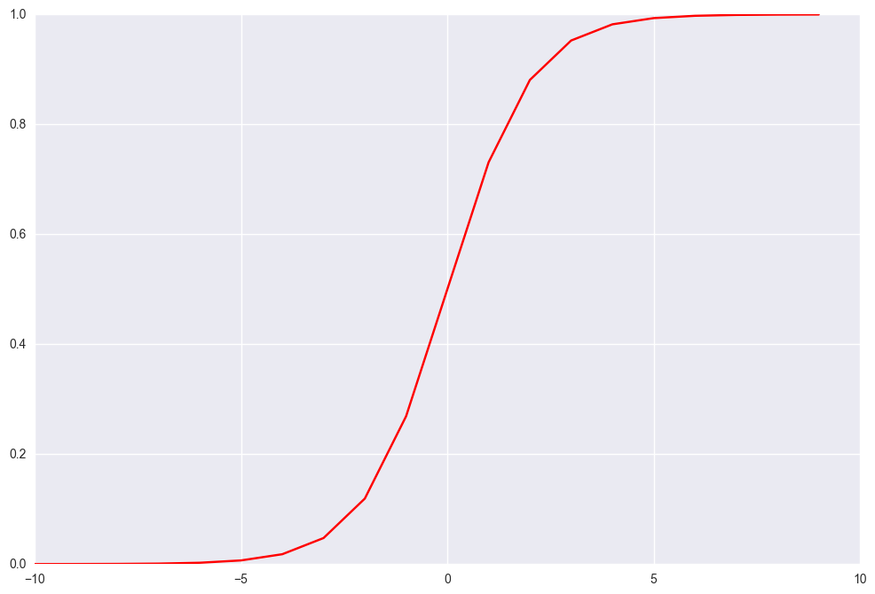
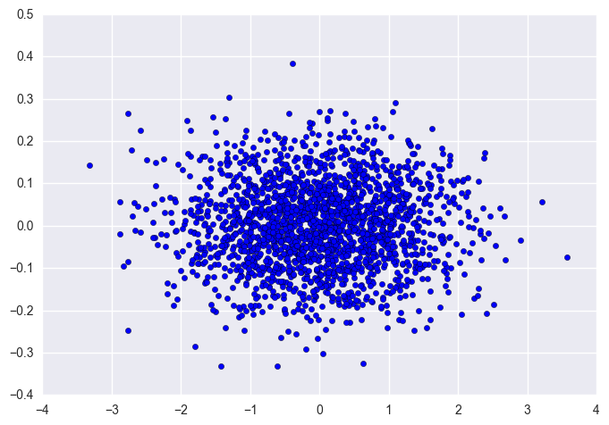

##  Part 1: Regression analysis of Gapmind Data


```python
#import all needed libraries for part 1
import random
import numpy as np
import pandas as pd
import matplotlib.pyplot as plt
#from ggplot import *
import scipy
import statsmodels
import seaborn as sns
import sklearn
from sklearn import datasets, linear_model, metrics
import statsmodels.formula.api as smf
```


```python
#extract the raw data
url = "https://raw.githubusercontent.com/jennybc/gapminder/master/data-raw/08_gap-every-five-years.tsv"
data = pd.read_csv(url, sep='\t')
data.sort_values (by = 'continent', inplace = True)
data.head()
```


<div>
<style>
    .dataframe thead tr:only-child th {
        text-align: right;
    }

    .dataframe thead th {
        text-align: left;
    }

    .dataframe tbody tr th {
        vertical-align: top;
    }
</style>
<table border="1" class="dataframe">
  <thead>
    <tr style="text-align: right;">
      <th></th>
      <th>country</th>
      <th>continent</th>
      <th>year</th>
      <th>lifeExp</th>
      <th>pop</th>
      <th>gdpPercap</th>
    </tr>
  </thead>
  <tbody>
    <tr>
      <th>1703</th>
      <td>Zimbabwe</td>
      <td>Africa</td>
      <td>2007</td>
      <td>43.487</td>
      <td>12311143</td>
      <td>469.709298</td>
    </tr>
    <tr>
      <th>1306</th>
      <td>Sao Tome and Principe</td>
      <td>Africa</td>
      <td>2002</td>
      <td>64.337</td>
      <td>170372</td>
      <td>1353.092390</td>
    </tr>
    <tr>
      <th>456</th>
      <td>Egypt</td>
      <td>Africa</td>
      <td>1952</td>
      <td>41.893</td>
      <td>22223309</td>
      <td>1418.822445</td>
    </tr>
    <tr>
      <th>457</th>
      <td>Egypt</td>
      <td>Africa</td>
      <td>1957</td>
      <td>44.444</td>
      <td>25009741</td>
      <td>1458.915272</td>
    </tr>
    <tr>
      <th>458</th>
      <td>Egypt</td>
      <td>Africa</td>
      <td>1962</td>
      <td>46.992</td>
      <td>28173309</td>
      <td>1693.335853</td>
    </tr>
  </tbody>
</table>
</div>


### Exercise 1
**Make a scatter plot of life expectancy across time**


```python
data['year'].unique()
```


    array([2007, 2002, 1952, 1957, 1962, 1967, 1972, 1977, 1982, 1987, 1992,
           1997])


```python
# scatter plot of life expectancy across time
plt.scatter(data['year'], data['lifeExp'])
plt.ylabel("Life expectancy")
plt.xlabel("Time in years")
plt.title("Life Expectancy over Time")
plt.show()

```





### Question 1
**Is there a general trend (e.g., increasing or decreasing) for life expectancy across time? **
It seems that there is a tendency of life expectancy to increase over time because if a line was to be drawn accross the bottom and top of the scatter plots for each year it would show a line with a positive slope. From the data life expectancy in the 1950s was aroung 29 to 70 while near 2010 life expectancy was aroung 40 to 80 which shows that there seems to be a general increase of life expectancy over the years from 1950 to 2010.

**Is this trend linear?** The trend seems somewhat linear because the life Expectancy seems to be slowly growing.


```python
sns.violinplot(x = 'year', y = 'lifeExp', data = data, bw =.3 )
plt.title("Violin plot of Life Expectancy vs year")
plt.show()
    
```


### Question 2
**How would you describe the distribution of life expectancy across countries for individual years? Is it skewed, or not? Unimodal or not? Symmetric around it’s center?**
1. The violin plots at the extreme ends of the x axis are unimodal.
2. The violin plots at the extreme ends are also non-symmetric around the centre.
3. Some of the violin plots have bimodal distributions especially those near the center of the x-axis such as around 1972.


### Question 3 
**Suppose I fit a linear regression model of life expectancy vs. year (treating it as a continuous variable), and test for a relationship between year and life expectancy, will you reject the null hypothesis of no relationship?**
I would reject the null hypothesis of no relationship because from the violin plots as the years increase the probability of having a higher life expectancy also increases showing that there is a clear relationship between life expectancy and years.

### Question 4 
**What would a violin plot of residuals from the linear model in Question 3 vs. year look like? **
The violin plot of residuals vs year would be almost similar to the violin plot of life expectancy vs year because the probabilities for life expectancy haven't changed. The residuals are just a transformation of life expectancy which shouldn't affect proability.

### Question 5
**According to the assumptions of the linear regression model, what should that violin plot look like?**
The violin plot should be unimodal and symmetric because the assumption that there is a linear relationship between the data, suggests that there is a higher probability of the scatter plot points being closer to the regression line than being far from the regression line. Therefore the scatter plot points should be symmetric about the regression line thus making the violin plot of residuals vs year to be symmetric too.

### Exercise 2
** Fit a linear regression model using, e.g., the LinearRegression function from Scikit-Learn or the closed-form solution we derived in class, for life expectancy vs. year **


```python
# Split the data into training/testing sets
data_train = data.sample(frac=0.66, replace=True,axis = 0)
data_test = data.sample(frac=0.46, replace=True,axis = 0)

data_x_train = data_train['year'].reshape(-1,1) 
data_x_test = data_test['year'].reshape(-1,1)

data_y_train = data_train['lifeExp'].reshape(-1,1)
data_y_test = data_test['lifeExp'].reshape(-1,1)

# Create linear regression object
regr1 = linear_model.LinearRegression()

# Train the model using the training sets
regr1.fit(data_x_train, data_y_train)

intercept = regr1.intercept_
co_eff = regr1.coef_
variance = regr1.score(data_x_test, data_y_test)
mean_sq_err1 = np.mean((regr1.predict(data_x_test) - data_y_test) ** 2)
intercept = regr1.intercept_

# The Intercept
print('Intercept: \n', intercept)
# The coefficients
print('Coefficients: \n', regr1.coef_)
# The mean squared error
print("Mean squared error: %.2f"
      % np.mean((regr1.predict(data_x_test) - data_y_test) ** 2))
# Explained variance score: 1 is perfect prediction
print('Variance score: %.2f' % regr1.score(data_x_test, data_y_test))

# Plot outputs
plt.scatter(data_x_test, data_y_test,  color='black')
plt.plot(data_x_test, regr1.predict(data_x_test), color='blue',
         linewidth=3)


plt.title("Scatter plot of Life Expectancy vs year")
plt.show()


```

    Intercept: 
     [-712.88320647]
    Coefficients: 
     [[ 0.39041244]]
    Mean squared error: 131.61
    Variance score: 0.17





### Question 6
**On average, by how much does life expectancy increase every year around the world?**
Based on the co-efficient of the linear regression, the life expectancy increases by **0.31361024 years** every year.


### Question 7
**Do you reject the null hypothesis of no relationship between year and life expectancy? Why?**

I reject the null hypothesis because there seems to exist a linear relationship between life expectancy and time in years because the regression line from exercise two has a significant positive slope.


```python
# Find the residuals and store them in the dataframe data
data['residues'] = data['lifeExp'] - (intercept[0] + co_eff[0,0]*data['year'] )
data.head()
```


<div>
<table border="1" class="dataframe">
  <thead>
    <tr style="text-align: right;">
      <th></th>
      <th>country</th>
      <th>continent</th>
      <th>year</th>
      <th>lifeExp</th>
      <th>pop</th>
      <th>gdpPercap</th>
      <th>residues</th>
    </tr>
  </thead>
  <tbody>
    <tr>
      <th>1703</th>
      <td>Zimbabwe</td>
      <td>Africa</td>
      <td>2007</td>
      <td>43.487</td>
      <td>12311143</td>
      <td>469.709298</td>
      <td>-25.914875</td>
    </tr>
    <tr>
      <th>1306</th>
      <td>Sao Tome and Principe</td>
      <td>Africa</td>
      <td>2002</td>
      <td>64.337</td>
      <td>170372</td>
      <td>1353.092390</td>
      <td>-3.229811</td>
    </tr>
    <tr>
      <th>456</th>
      <td>Egypt</td>
      <td>Africa</td>
      <td>1952</td>
      <td>41.893</td>
      <td>22223309</td>
      <td>1418.822445</td>
      <td>-7.323169</td>
    </tr>
    <tr>
      <th>457</th>
      <td>Egypt</td>
      <td>Africa</td>
      <td>1957</td>
      <td>44.444</td>
      <td>25009741</td>
      <td>1458.915272</td>
      <td>-6.607233</td>
    </tr>
    <tr>
      <th>458</th>
      <td>Egypt</td>
      <td>Africa</td>
      <td>1962</td>
      <td>46.992</td>
      <td>28173309</td>
      <td>1693.335853</td>
      <td>-5.894298</td>
    </tr>
  </tbody>
</table>
</div>


### Exercise 3
**Make a violin plot of residuals vs. year for the linear model from Exercise 2**


```python
#violin plot of residuals vs year
sns.violinplot(x = 'year', y = 'residues', data = data, bw =.3 )
plt.title("Violin plot of Residuals of life Expectancy vs year")
plt.show()
```


### Question 8 
**Does the plot of Exercise 3 match your expectations (as you answered Question 4)?**

The plot matched my expectations that the shape of the violin plots shouldn't be significantly different from those in exercise 2 because the probability distribution of life expectancy vs year hasn't change despite the transformation. 

 ### Exercise 4
 **Make a boxplot (or violin plot) of model residuals vs. continent.**


```python
#box ploy of residuals vs continent
sns.boxplot(y = 'residues', x = 'continent', data = data)
plt.title("Box Plot of Residuals of Life Expectancy vs Continents")
plt.show()
```





### Question 9
**Is there a dependence between model residual and continent?**

There is a dependence between life expectancy and continent with Africa having the lowest life expectancy and oceania having the highest life expectancy.

**what would that suggest when performing a regression analysis of life expectancy across time?**
Separate data by continent and determine the rate at which life expectancy increases. This will help you answer questions like:
1. Which countries have a greater increase of life expectancy and why?
2. It will also help us pin point out continents which may have a decreasing life expectancy.

### Exercise 5
Scatter plots of life expectancy vs year for each continent


```python
continents = data.continent.unique()

for c in continents:
    # Split the data into training/testing sets

    length =  len (data.loc[data['continent'] == c])
    data_train = data.loc[data['continent'] == c].sample(frac=0.66, replace=True,axis = 0)
    data_test = data.loc[data['continent'] == c].sample(frac=0.46, replace=True,axis = 0)

    data_x_train = data_train['year'].reshape(-1,1) 
    data_x_test = data_test['year'].reshape(-1,1)

    data_y_train = data_train['lifeExp'].reshape(-1,1)
    data_y_test = data_test['lifeExp'].reshape(-1,1)

    # Create linear regression object
    regr = linear_model.LinearRegression()

    # Train the model using the training sets
    regr.fit(data_x_train, data_y_train)

    co_eff = regr.coef_
    variance =  regr.score(data_x_test, data_y_test)
    mean_sq_err = np.mean((regr.predict(data_x_test) - data_y_test) ** 2)
    intercept = regr.intercept_

    # The coefficients
    print('Coefficients: \n', regr.coef_)
    # The mean squared error
    print("Mean squared error: %.2f"
          % np.mean((regr.predict(data_x_test) - data_y_test) ** 2))
    # Explained variance score: 1 is perfect prediction
    print('Variance score: %.2f' % regr.score(data_x_test, data_y_test))

    # Plot outputs
    plt.scatter(data_x_test, data_y_test,  color='black')
    plt.plot(data_x_test, regr.predict(data_x_test), color='blue',
             linewidth=3)

    plt.title("{} Life Expectancy vs Year".format(c))

    plt.show()
```

    Coefficients: 
     [[ 0.26869665]]
    Mean squared error: 59.35
    Variance score: 0.36





    Coefficients: 
     [[ 0.39472312]]
    Mean squared error: 48.99
    Variance score: 0.32


    Coefficients: 
     [[ 0.42482299]]
    Mean squared error: 76.13
    Variance score: 0.48





    Coefficients: 
     [[ 0.20114963]]
    Mean squared error: 15.61
    Variance score: 0.47


    Coefficients: 
     [[ 0.17000659]]
    Mean squared error: 2.41
    Variance score: 0.88





### Question 10
Since the slopes of linear regression lines differ significantly from continent to continent, you should introduce an interaction term.


```python
#get the mean life expectancy for each continent for eah year

years = data.year.unique()
cont = []
yearz = []
mean_c = []


for c in continents:
    for year in years:
        mean = data.loc[ (data['continent'] == c ) & (data['year'] == year )].lifeExp.mean(axis =0)
        mean_c.append(mean)
        cont.append(c)
        yearz.append(year)

#create dataframe that will be used to calculate the interaction term
d = {'continent': cont, 'year':yearz, 'mean': mean_c}
data_mean = pd.DataFrame(data = d)

#dataframe contains mean life expectancy for each continent for each year
data_mean.head()
        
```


<div>
<table border="1" class="dataframe">
  <thead>
    <tr style="text-align: right;">
      <th></th>
      <th>continent</th>
      <th>mean</th>
      <th>year</th>
    </tr>
  </thead>
  <tbody>
    <tr>
      <th>0</th>
      <td>Africa</td>
      <td>54.806038</td>
      <td>2007</td>
    </tr>
    <tr>
      <th>1</th>
      <td>Africa</td>
      <td>53.325231</td>
      <td>2002</td>
    </tr>
    <tr>
      <th>2</th>
      <td>Africa</td>
      <td>39.135500</td>
      <td>1952</td>
    </tr>
    <tr>
      <th>3</th>
      <td>Africa</td>
      <td>41.266346</td>
      <td>1957</td>
    </tr>
    <tr>
      <th>4</th>
      <td>Africa</td>
      <td>43.319442</td>
      <td>1962</td>
    </tr>
  </tbody>
</table>
</div>


```python
#inter_term contains the expected life_expectancy after including interaction term
inter_term = []
for index, row in data.iterrows():
    
    #m which is the mean is used as the interaction term
    m = data_mean.loc[ (data_mean['year'] == row['year']) & (data_mean['continent'] == row['continent'])]['mean']
  
    #y is the new expected y value
    y = 0.5 * (intercept[0] + co_eff[0,0]*row['year']) + (0.5 * float(m))
    inter_term.append(y )
    
    
data['continent year interaction'] = inter_term
data.head()

```


<div>
<table border="1" class="dataframe">
  <thead>
    <tr style="text-align: right;">
      <th></th>
      <th>country</th>
      <th>continent</th>
      <th>year</th>
      <th>lifeExp</th>
      <th>pop</th>
      <th>gdpPercap</th>
      <th>residues</th>
      <th>continent year interaction</th>
    </tr>
  </thead>
  <tbody>
    <tr>
      <th>1703</th>
      <td>Zimbabwe</td>
      <td>Africa</td>
      <td>2007</td>
      <td>43.487</td>
      <td>12311143</td>
      <td>469.709298</td>
      <td>-25.914875</td>
      <td>66.739695</td>
    </tr>
    <tr>
      <th>1306</th>
      <td>Sao Tome and Principe</td>
      <td>Africa</td>
      <td>2002</td>
      <td>64.337</td>
      <td>170372</td>
      <td>1353.092390</td>
      <td>-3.229811</td>
      <td>65.574275</td>
    </tr>
    <tr>
      <th>456</th>
      <td>Egypt</td>
      <td>Africa</td>
      <td>1952</td>
      <td>41.893</td>
      <td>22223309</td>
      <td>1418.822445</td>
      <td>-7.323169</td>
      <td>54.229245</td>
    </tr>
    <tr>
      <th>457</th>
      <td>Egypt</td>
      <td>Africa</td>
      <td>1957</td>
      <td>44.444</td>
      <td>25009741</td>
      <td>1458.915272</td>
      <td>-6.607233</td>
      <td>55.719684</td>
    </tr>
    <tr>
      <th>458</th>
      <td>Egypt</td>
      <td>Africa</td>
      <td>1962</td>
      <td>46.992</td>
      <td>28173309</td>
      <td>1693.335853</td>
      <td>-5.894298</td>
      <td>57.171249</td>
    </tr>
  </tbody>
</table>
</div>


### Exercise 6
**Fit a linear regression model for life expectancy including a term for an interaction between continent and year**


```python
# Split the data into training/testing sets
data_train = data.sample(frac=0.66, replace=True,axis = 0)
data_test = data.sample(frac=0.46, replace=True,axis = 0)

data_x_train = data_train['year'].reshape(-1,1) 
data_x_test = data_test['year'].reshape(-1,1)

data_y_train = data_train['continent year interaction'].reshape(-1,1)
data_y_test = data_test['continent year interaction'].reshape(-1,1)

# Create linear regression object
regr2 = linear_model.LinearRegression()

# Train the model using the training sets
regr2.fit(data_x_train, data_y_train)

co_eff = regr2.coef_
variance =  regr2.score(data_x_test, data_y_test)
mean_sq_err2 = np.mean((regr2.predict(data_x_test) - data_y_test) ** 2)
intercept = regr2.intercept_

# The coefficients
print('Coefficients: \n', regr2.coef_)
# The mean squared error
print("Mean squared error: %.2f"
      % np.mean((regr2.predict(data_x_test) - data_y_test) ** 2))
# Explained variance score: 1 is perfect prediction
print('Variance score: %.2f' % regr2.score(data_x_test, data_y_test))

# Plot outputs
plt.scatter(data_x_test, data_y_test,  color='black')
plt.plot(data_x_test, regr2.predict(data_x_test), color='blue',
         linewidth=3)


plt.title("Linear regression of Life Expectancy vs year")
plt.show()


```

    Coefficients: 
     [[ 0.2468623]]
    Mean squared error: 21.22
    Variance score: 0.44


### Question 11
**Are all parameters in the model significantly different from zero? If not, which are not significantly different from zero?**

No parameter is significantly different from zero. The life expectancy mean for each continent in each year is used as the interaction term

### Question 12
**On average, by how much does life expectancy increase each year for each continent? **
Based on the plots in Exercise 5(code is in exercise 5), life expectancy increase per year for each continent is:
1. Africa : 0.26775865
2. Americas : 0.374975
3. Asia : 0.39778701
4. Europe : 0.21389787
5. Oceania : 0.19851773


```python
variance_int_term
```


    0.45958703542340207


### Exercise 7
** Perform an F-test that compares how well two models fit your data: (a) the linear regression models from Exercise 2 (only including year as a covariate) and (b) Exercise 6 (including interaction between year and continent).**


```python
ls1 = smf.ols(formula = 'lifeExp ~ year', data = data).fit()
ls2 = smf.ols(formula = 'lifeExp ~ continent*year', data = data).fit()
```


```python
ls1.summary()
```


<table class="simpletable">
<caption>OLS Regression Results</caption>
<tr>
  <th>Dep. Variable:</th>         <td>lifeExp</td>     <th>  R-squared:         </th> <td>   0.190</td> 
</tr>
<tr>
  <th>Model:</th>                   <td>OLS</td>       <th>  Adj. R-squared:    </th> <td>   0.189</td> 
</tr>
<tr>
  <th>Method:</th>             <td>Least Squares</td>  <th>  F-statistic:       </th> <td>   398.6</td> 
</tr>
<tr>
  <th>Date:</th>             <td>Wed, 19 Apr 2017</td> <th>  Prob (F-statistic):</th> <td>7.55e-80</td> 
</tr>
<tr>
  <th>Time:</th>                 <td>15:08:03</td>     <th>  Log-Likelihood:    </th> <td> -6597.9</td> 
</tr>
<tr>
  <th>No. Observations:</th>      <td>  1704</td>      <th>  AIC:               </th> <td>1.320e+04</td>
</tr>
<tr>
  <th>Df Residuals:</th>          <td>  1702</td>      <th>  BIC:               </th> <td>1.321e+04</td>
</tr>
<tr>
  <th>Df Model:</th>              <td>     1</td>      <th>                     </th>     <td> </td>    
</tr>
<tr>
  <th>Covariance Type:</th>      <td>nonrobust</td>    <th>                     </th>     <td> </td>    
</tr>
</table>
<table class="simpletable">
<tr>
      <td></td>         <th>coef</th>     <th>std err</th>      <th>t</th>      <th>P>|t|</th> <th>[95.0% Conf. Int.]</th> 
</tr>
<tr>
  <th>Intercept</th> <td> -585.6522</td> <td>   32.314</td> <td>  -18.124</td> <td> 0.000</td> <td> -649.031  -522.273</td>
</tr>
<tr>
  <th>year</th>      <td>    0.3259</td> <td>    0.016</td> <td>   19.965</td> <td> 0.000</td> <td>    0.294     0.358</td>
</tr>
</table>
<table class="simpletable">
<tr>
  <th>Omnibus:</th>       <td>386.124</td> <th>  Durbin-Watson:     </th> <td>   0.262</td>
</tr>
<tr>
  <th>Prob(Omnibus):</th> <td> 0.000</td>  <th>  Jarque-Bera (JB):  </th> <td>  90.750</td>
</tr>
<tr>
  <th>Skew:</th>          <td>-0.268</td>  <th>  Prob(JB):          </th> <td>1.97e-20</td>
</tr>
<tr>
  <th>Kurtosis:</th>      <td> 2.004</td>  <th>  Cond. No.          </th> <td>2.27e+05</td>
</tr>
</table>


```python
ls2.summary()
```


<table class="simpletable">
<caption>OLS Regression Results</caption>
<tr>
  <th>Dep. Variable:</th>         <td>lifeExp</td>     <th>  R-squared:         </th> <td>   0.693</td> 
</tr>
<tr>
  <th>Model:</th>                   <td>OLS</td>       <th>  Adj. R-squared:    </th> <td>   0.691</td> 
</tr>
<tr>
  <th>Method:</th>             <td>Least Squares</td>  <th>  F-statistic:       </th> <td>   424.3</td> 
</tr>
<tr>
  <th>Date:</th>             <td>Wed, 19 Apr 2017</td> <th>  Prob (F-statistic):</th>  <td>  0.00</td>  
</tr>
<tr>
  <th>Time:</th>                 <td>15:08:11</td>     <th>  Log-Likelihood:    </th> <td> -5771.9</td> 
</tr>
<tr>
  <th>No. Observations:</th>      <td>  1704</td>      <th>  AIC:               </th> <td>1.156e+04</td>
</tr>
<tr>
  <th>Df Residuals:</th>          <td>  1694</td>      <th>  BIC:               </th> <td>1.162e+04</td>
</tr>
<tr>
  <th>Df Model:</th>              <td>     9</td>      <th>                     </th>     <td> </td>    
</tr>
<tr>
  <th>Covariance Type:</th>      <td>nonrobust</td>    <th>                     </th>     <td> </td>    
</tr>
</table>
<table class="simpletable">
<tr>
               <td></td>                 <th>coef</th>     <th>std err</th>      <th>t</th>      <th>P>|t|</th> <th>[95.0% Conf. Int.]</th> 
</tr>
<tr>
  <th>Intercept</th>                  <td> -524.2578</td> <td>   32.963</td> <td>  -15.904</td> <td> 0.000</td> <td> -588.911  -459.605</td>
</tr>
<tr>
  <th>continent[T.Americas]</th>      <td> -138.8484</td> <td>   57.851</td> <td>   -2.400</td> <td> 0.016</td> <td> -252.315   -25.382</td>
</tr>
<tr>
  <th>continent[T.Asia]</th>          <td> -312.6330</td> <td>   52.904</td> <td>   -5.909</td> <td> 0.000</td> <td> -416.396  -208.870</td>
</tr>
<tr>
  <th>continent[T.Europe]</th>        <td>  156.8469</td> <td>   54.498</td> <td>    2.878</td> <td> 0.004</td> <td>   49.957   263.737</td>
</tr>
<tr>
  <th>continent[T.Oceania]</th>       <td>  182.3499</td> <td>  171.283</td> <td>    1.065</td> <td> 0.287</td> <td> -153.599   518.298</td>
</tr>
<tr>
  <th>year</th>                       <td>    0.2895</td> <td>    0.017</td> <td>   17.387</td> <td> 0.000</td> <td>    0.257     0.322</td>
</tr>
<tr>
  <th>continent[T.Americas]:year</th> <td>    0.0781</td> <td>    0.029</td> <td>    2.673</td> <td> 0.008</td> <td>    0.021     0.135</td>
</tr>
<tr>
  <th>continent[T.Asia]:year</th>     <td>    0.1636</td> <td>    0.027</td> <td>    6.121</td> <td> 0.000</td> <td>    0.111     0.216</td>
</tr>
<tr>
  <th>continent[T.Europe]:year</th>   <td>   -0.0676</td> <td>    0.028</td> <td>   -2.455</td> <td> 0.014</td> <td>   -0.122    -0.014</td>
</tr>
<tr>
  <th>continent[T.Oceania]:year</th>  <td>   -0.0793</td> <td>    0.087</td> <td>   -0.916</td> <td> 0.360</td> <td>   -0.249     0.090</td>
</tr>
</table>
<table class="simpletable">
<tr>
  <th>Omnibus:</th>       <td>27.121</td> <th>  Durbin-Watson:     </th> <td>   0.636</td>
</tr>
<tr>
  <th>Prob(Omnibus):</th> <td> 0.000</td> <th>  Jarque-Bera (JB):  </th> <td>  44.106</td>
</tr>
<tr>
  <th>Skew:</th>          <td>-0.121</td> <th>  Prob(JB):          </th> <td>2.65e-10</td>
</tr>
<tr>
  <th>Kurtosis:</th>      <td> 3.750</td> <th>  Cond. No.          </th> <td>2.09e+06</td>
</tr>
</table>


### Question 13
**Is the interaction model significantly better than the year-only model? Why?**
F statistic for linear regression model is 398.6
F statistic for linear regression  that includes interaction term is  424.3

424.3 is greater than 398.6 which means that the interaction model is significantly better than the year-only model.

### Exercise 8
**Make a residuals vs. year violin plot for the interaction model. Comment on how well it matches assumptions of the linear regression model. Do the same for a residuals vs. fitted values model.**


```python
data['residual_term'] = data['continent year interaction'] - data['lifeExp']
data.head()
```


<div>
<table border="1" class="dataframe">
  <thead>
    <tr style="text-align: right;">
      <th></th>
      <th>country</th>
      <th>continent</th>
      <th>year</th>
      <th>lifeExp</th>
      <th>pop</th>
      <th>gdpPercap</th>
      <th>residues</th>
      <th>continent year interaction</th>
      <th>residual_term</th>
    </tr>
  </thead>
  <tbody>
    <tr>
      <th>1703</th>
      <td>Zimbabwe</td>
      <td>Africa</td>
      <td>2007</td>
      <td>43.487</td>
      <td>12311143</td>
      <td>469.709298</td>
      <td>-24.913649</td>
      <td>67.033994</td>
      <td>23.546994</td>
    </tr>
    <tr>
      <th>1306</th>
      <td>Sao Tome and Principe</td>
      <td>Africa</td>
      <td>2002</td>
      <td>64.337</td>
      <td>170372</td>
      <td>1353.092390</td>
      <td>-2.420393</td>
      <td>65.797296</td>
      <td>1.460296</td>
    </tr>
    <tr>
      <th>456</th>
      <td>Egypt</td>
      <td>Africa</td>
      <td>1952</td>
      <td>41.893</td>
      <td>22223309</td>
      <td>1418.822445</td>
      <td>-8.431833</td>
      <td>53.739488</td>
      <td>11.846488</td>
    </tr>
    <tr>
      <th>457</th>
      <td>Egypt</td>
      <td>Africa</td>
      <td>1957</td>
      <td>44.444</td>
      <td>25009741</td>
      <td>1458.915272</td>
      <td>-7.524089</td>
      <td>55.301205</td>
      <td>10.857205</td>
    </tr>
    <tr>
      <th>458</th>
      <td>Egypt</td>
      <td>Africa</td>
      <td>1962</td>
      <td>46.992</td>
      <td>28173309</td>
      <td>1693.335853</td>
      <td>-6.619345</td>
      <td>56.824047</td>
      <td>9.832047</td>
    </tr>
  </tbody>
</table>
</div>


```python
sns.violinplot(x = 'year', y = 'residual_term', data = data, bw =.3 )
plt.title("Violin plot of Residuals of life Expectancy vs Year for interaction model")
plt.show()
```


## Part 2: Classification
### Problem 1
below is an implementation of the gradient descent algorithm for multiple linear regression 


```python
import random

# m denotes the number of examples here, not the number of features
def gradientDescent(x, y, alpha, numIterations):
    xTrans = x.transpose()
    m, n = np.shape(x)
    theta = np.ones(n)
    
    for i in range(0, numIterations):
        hypothesis = np.dot(x, theta)
        loss = hypothesis - y
        # avg cost per example (the 2 in 2*m doesn't really matter here.
        # But to be consistent with the gradient, I include it)
        cost = np.sum(loss ** 2) / (2 * m)
        print("Iteration %d | Cost: %f" % (i, cost))
        # avg gradient per example
        gradient = np.dot(xTrans, loss) / m
        # update
        theta = theta - alpha * gradient
    return theta

#generate data to test our gradient descent algorithm
def genData(numPoints, bias, variance):
    x = np.zeros(shape=(numPoints, 2))
    y = np.zeros(shape=numPoints)
    # basically a straight line
    for i in range(0, numPoints):
        # bias feature
        x[i][0] = 1
        x[i][1] = i
        # our target variable
        y[i] = (i + bias) + random.uniform(0, 1) * variance
    return x, y

# gen 100 points with a bias of 25 and 10 variance as a bit of noise
x, y = genData(100, 25, 10)

numIterations= 10000
alpha = 0.0005

#theta represents the coefficients to our linear functioon
theta = gradientDescent(x, y, alpha, numIterations)
print(theta)
```

    Iteration 0 | Cost: 425.950360
    Iteration 1 | Cost: 245.153830
    Iteration 2 | Cost: 170.590411
    Iteration 3 | Cost: 139.829259
    Iteration 4 | Cost: 127.128756
    Iteration 5 | Cost: 121.875062
    Iteration 6 | Cost: 119.691856
    Iteration 7 | Cost: 118.774686
    Iteration 8 | Cost: 118.379534
    Iteration 9 | Cost: 118.199626
    Iteration 10 | Cost: 118.108472
    Iteration 11 | Cost: 118.053918
    Iteration 12 | Cost: 118.014459
    Iteration 13 | Cost: 117.981228
    Iteration 14 | Cost: 117.950570
    Iteration 15 | Cost: 117.920976
    Iteration 16 | Cost: 117.891826
    Iteration 17 | Cost: 117.862864
    Iteration 18 | Cost: 117.833982
    Iteration 19 | Cost: 117.805139
    Iteration 20 | Cost: 117.776315
    Iteration 21 | Cost: 117.747504
    Iteration 22 | Cost: 117.718703
    Iteration 23 | Cost: 117.689909
    Iteration 24 | Cost: 117.661123
    Iteration 25 | Cost: 117.632345
    Iteration 26 | Cost: 117.603574
    Iteration 27 | Cost: 117.574811
    Iteration 28 | Cost: 117.546054
    Iteration 29 | Cost: 117.517305
    Iteration 30 | Cost: 117.488564
    Iteration 31 | Cost: 117.459829
    Iteration 32 | Cost: 117.431102
    Iteration 33 | Cost: 117.402382
    Iteration 34 | Cost: 117.373670
    Iteration 35 | Cost: 117.344965
    Iteration 36 | Cost: 117.316267
    Iteration 37 | Cost: 117.287576
    Iteration 38 | Cost: 117.258893
    Iteration 39 | Cost: 117.230216
    Iteration 40 | Cost: 117.201548
    Iteration 41 | Cost: 117.172886
    Iteration 42 | Cost: 117.144232
    Iteration 43 | Cost: 117.115585
    Iteration 44 | Cost: 117.086945
    Iteration 45 | Cost: 117.058312
    Iteration 46 | Cost: 117.029687
    Iteration 47 | Cost: 117.001069
    Iteration 48 | Cost: 116.972458
    Iteration 49 | Cost: 116.943855
    Iteration 50 | Cost: 116.915259
    Iteration 51 | Cost: 116.886670
    Iteration 52 | Cost: 116.858088
    Iteration 53 | Cost: 116.829514
    Iteration 54 | Cost: 116.800946
    Iteration 55 | Cost: 116.772386
    Iteration 56 | Cost: 116.743834
    Iteration 57 | Cost: 116.715288
    Iteration 58 | Cost: 116.686750
    Iteration 59 | Cost: 116.658219
    Iteration 60 | Cost: 116.629695
    Iteration 61 | Cost: 116.601179
    Iteration 62 | Cost: 116.572670
    Iteration 63 | Cost: 116.544167
    Iteration 64 | Cost: 116.515673
    Iteration 65 | Cost: 116.487185
    Iteration 66 | Cost: 116.458705
    Iteration 67 | Cost: 116.430232
    Iteration 68 | Cost: 116.401766
    Iteration 69 | Cost: 116.373307
    Iteration 70 | Cost: 116.344856
    Iteration 71 | Cost: 116.316411
    Iteration 72 | Cost: 116.287974
    Iteration 73 | Cost: 116.259544
    Iteration 74 | Cost: 116.231122
    Iteration 75 | Cost: 116.202706
    Iteration 76 | Cost: 116.174298
    Iteration 77 | Cost: 116.145897
    Iteration 78 | Cost: 116.117504
    Iteration 79 | Cost: 116.089117
    Iteration 80 | Cost: 116.060738
    Iteration 81 | Cost: 116.032365
    Iteration 82 | Cost: 116.004000
    Iteration 83 | Cost: 115.975643
    Iteration 84 | Cost: 115.947292
    Iteration 85 | Cost: 115.918949
    Iteration 86 | Cost: 115.890613
    Iteration 87 | Cost: 115.862284
    Iteration 88 | Cost: 115.833962
    Iteration 89 | Cost: 115.805647
    Iteration 90 | Cost: 115.777340
    Iteration 91 | Cost: 115.749039
    Iteration 92 | Cost: 115.720746
    Iteration 93 | Cost: 115.692460
    Iteration 94 | Cost: 115.664182
    Iteration 95 | Cost: 115.635910
    Iteration 96 | Cost: 115.607646
    Iteration 97 | Cost: 115.579388
    Iteration 98 | Cost: 115.551138
    Iteration 99 | Cost: 115.522896
    Iteration 100 | Cost: 115.494660
    Iteration 101 | Cost: 115.466431
    Iteration 102 | Cost: 115.438210
    Iteration 103 | Cost: 115.409996
    Iteration 104 | Cost: 115.381789
    Iteration 105 | Cost: 115.353589
    Iteration 106 | Cost: 115.325396
    Iteration 107 | Cost: 115.297210
    Iteration 108 | Cost: 115.269032
    Iteration 109 | Cost: 115.240860
    Iteration 110 | Cost: 115.212696
    Iteration 111 | Cost: 115.184539
    Iteration 112 | Cost: 115.156389
    Iteration 113 | Cost: 115.128247
    Iteration 114 | Cost: 115.100111
    Iteration 115 | Cost: 115.071983
    Iteration 116 | Cost: 115.043861
    Iteration 117 | Cost: 115.015747
    Iteration 118 | Cost: 114.987640
    Iteration 119 | Cost: 114.959540
    Iteration 120 | Cost: 114.931447
    Iteration 121 | Cost: 114.903362
    Iteration 122 | Cost: 114.875283
    Iteration 123 | Cost: 114.847212
    Iteration 124 | Cost: 114.819147
    Iteration 125 | Cost: 114.791090
    Iteration 126 | Cost: 114.763040
    Iteration 127 | Cost: 114.734997
    Iteration 128 | Cost: 114.706961
    Iteration 129 | Cost: 114.678933
    Iteration 130 | Cost: 114.650911
    Iteration 131 | Cost: 114.622896
    Iteration 132 | Cost: 114.594889
    Iteration 133 | Cost: 114.566889
    Iteration 134 | Cost: 114.538896
    Iteration 135 | Cost: 114.510910
    Iteration 136 | Cost: 114.482931
    Iteration 137 | Cost: 114.454959
    Iteration 138 | Cost: 114.426994
    Iteration 139 | Cost: 114.399036
    Iteration 140 | Cost: 114.371086
    Iteration 141 | Cost: 114.343142
    Iteration 142 | Cost: 114.315206
    Iteration 143 | Cost: 114.287276
    Iteration 144 | Cost: 114.259354
    Iteration 145 | Cost: 114.231439
    Iteration 146 | Cost: 114.203531
    Iteration 147 | Cost: 114.175630
    Iteration 148 | Cost: 114.147736
    Iteration 149 | Cost: 114.119849
    Iteration 150 | Cost: 114.091969
    Iteration 151 | Cost: 114.064097
    Iteration 152 | Cost: 114.036231
    Iteration 153 | Cost: 114.008372
    Iteration 154 | Cost: 113.980521
    Iteration 155 | Cost: 113.952676
    Iteration 156 | Cost: 113.924839
    Iteration 157 | Cost: 113.897009
    Iteration 158 | Cost: 113.869186
    Iteration 159 | Cost: 113.841369
    Iteration 160 | Cost: 113.813560
    Iteration 161 | Cost: 113.785758
    Iteration 162 | Cost: 113.757963
    Iteration 163 | Cost: 113.730175
    Iteration 164 | Cost: 113.702394
    Iteration 165 | Cost: 113.674620
    Iteration 166 | Cost: 113.646854
    Iteration 167 | Cost: 113.619094
    Iteration 168 | Cost: 113.591341
    Iteration 169 | Cost: 113.563595
    Iteration 170 | Cost: 113.535857
    Iteration 171 | Cost: 113.508125
    Iteration 172 | Cost: 113.480401
    Iteration 173 | Cost: 113.452683
    Iteration 174 | Cost: 113.424972
    Iteration 175 | Cost: 113.397269
    Iteration 176 | Cost: 113.369573
    Iteration 177 | Cost: 113.341883
    Iteration 178 | Cost: 113.314201
    Iteration 179 | Cost: 113.286525
    Iteration 180 | Cost: 113.258857
    Iteration 181 | Cost: 113.231196
    Iteration 182 | Cost: 113.203541
    Iteration 183 | Cost: 113.175894
    Iteration 184 | Cost: 113.148254
    Iteration 185 | Cost: 113.120620
    Iteration 186 | Cost: 113.092994
    Iteration 187 | Cost: 113.065375
    Iteration 188 | Cost: 113.037763
    Iteration 189 | Cost: 113.010157
    Iteration 190 | Cost: 112.982559
    Iteration 191 | Cost: 112.954968
    Iteration 192 | Cost: 112.927384
    Iteration 193 | Cost: 112.899806
    Iteration 194 | Cost: 112.872236
    Iteration 195 | Cost: 112.844673
    Iteration 196 | Cost: 112.817117
    Iteration 197 | Cost: 112.789567
    Iteration 198 | Cost: 112.762025
    Iteration 199 | Cost: 112.734490
    Iteration 200 | Cost: 112.706961
    Iteration 201 | Cost: 112.679440
    Iteration 202 | Cost: 112.651926
    Iteration 203 | Cost: 112.624418
    Iteration 204 | Cost: 112.596918
    Iteration 205 | Cost: 112.569425
    Iteration 206 | Cost: 112.541938
    Iteration 207 | Cost: 112.514459
    Iteration 208 | Cost: 112.486986
    Iteration 209 | Cost: 112.459521
    Iteration 210 | Cost: 112.432062
    Iteration 211 | Cost: 112.404611
    Iteration 212 | Cost: 112.377166
    Iteration 213 | Cost: 112.349728
    Iteration 214 | Cost: 112.322298
    Iteration 215 | Cost: 112.294874
    Iteration 216 | Cost: 112.267457
    Iteration 217 | Cost: 112.240047
    Iteration 218 | Cost: 112.212644
    Iteration 219 | Cost: 112.185248
    Iteration 220 | Cost: 112.157859
    Iteration 221 | Cost: 112.130477
    Iteration 222 | Cost: 112.103102
    Iteration 223 | Cost: 112.075734
    Iteration 224 | Cost: 112.048373
    Iteration 225 | Cost: 112.021019
    Iteration 226 | Cost: 111.993671
    Iteration 227 | Cost: 111.966331
    Iteration 228 | Cost: 111.938998
    Iteration 229 | Cost: 111.911671
    Iteration 230 | Cost: 111.884352
    Iteration 231 | Cost: 111.857039
    Iteration 232 | Cost: 111.829733
    Iteration 233 | Cost: 111.802434
    Iteration 234 | Cost: 111.775143
    Iteration 235 | Cost: 111.747858
    Iteration 236 | Cost: 111.720580
    Iteration 237 | Cost: 111.693308
    Iteration 238 | Cost: 111.666044
    Iteration 239 | Cost: 111.638787
    Iteration 240 | Cost: 111.611537
    Iteration 241 | Cost: 111.584293
    Iteration 242 | Cost: 111.557057
    Iteration 243 | Cost: 111.529827
    Iteration 244 | Cost: 111.502604
    Iteration 245 | Cost: 111.475389
    Iteration 246 | Cost: 111.448180
    Iteration 247 | Cost: 111.420978
    Iteration 248 | Cost: 111.393783
    Iteration 249 | Cost: 111.366595
    Iteration 250 | Cost: 111.339413
    Iteration 251 | Cost: 111.312239
    Iteration 252 | Cost: 111.285071
    Iteration 253 | Cost: 111.257911
    Iteration 254 | Cost: 111.230757
    Iteration 255 | Cost: 111.203610
    Iteration 256 | Cost: 111.176470
    Iteration 257 | Cost: 111.149337
    Iteration 258 | Cost: 111.122211
    Iteration 259 | Cost: 111.095092
    Iteration 260 | Cost: 111.067979
    Iteration 261 | Cost: 111.040874
    Iteration 262 | Cost: 111.013775
    Iteration 263 | Cost: 110.986683
    Iteration 264 | Cost: 110.959599
    Iteration 265 | Cost: 110.932521
    Iteration 266 | Cost: 110.905449
    Iteration 267 | Cost: 110.878385
    Iteration 268 | Cost: 110.851328
    Iteration 269 | Cost: 110.824277
    Iteration 270 | Cost: 110.797233
    Iteration 271 | Cost: 110.770197
    Iteration 272 | Cost: 110.743167
    Iteration 273 | Cost: 110.716143
    Iteration 274 | Cost: 110.689127
    Iteration 275 | Cost: 110.662118
    Iteration 276 | Cost: 110.635115
    Iteration 277 | Cost: 110.608119
    Iteration 278 | Cost: 110.581131
    Iteration 279 | Cost: 110.554149
    Iteration 280 | Cost: 110.527173
    Iteration 281 | Cost: 110.500205
    Iteration 282 | Cost: 110.473244
    Iteration 283 | Cost: 110.446289
    Iteration 284 | Cost: 110.419341
    Iteration 285 | Cost: 110.392400
    Iteration 286 | Cost: 110.365466
    Iteration 287 | Cost: 110.338539
    Iteration 288 | Cost: 110.311618
    Iteration 289 | Cost: 110.284705
    Iteration 290 | Cost: 110.257798
    Iteration 291 | Cost: 110.230898
    Iteration 292 | Cost: 110.204005
    Iteration 293 | Cost: 110.177118
    Iteration 294 | Cost: 110.150239
    Iteration 295 | Cost: 110.123366
    Iteration 296 | Cost: 110.096500
    Iteration 297 | Cost: 110.069641
    Iteration 298 | Cost: 110.042789
    Iteration 299 | Cost: 110.015943
    Iteration 300 | Cost: 109.989105
    Iteration 301 | Cost: 109.962273
    Iteration 302 | Cost: 109.935448
    Iteration 303 | Cost: 109.908630
    Iteration 304 | Cost: 109.881818
    Iteration 305 | Cost: 109.855014
    Iteration 306 | Cost: 109.828216
    Iteration 307 | Cost: 109.801425
    Iteration 308 | Cost: 109.774641
    Iteration 309 | Cost: 109.747863
    Iteration 310 | Cost: 109.721093
    Iteration 311 | Cost: 109.694329
    Iteration 312 | Cost: 109.667572
    Iteration 313 | Cost: 109.640822
    Iteration 314 | Cost: 109.614078
    Iteration 315 | Cost: 109.587341
    Iteration 316 | Cost: 109.560611
    Iteration 317 | Cost: 109.533888
    Iteration 318 | Cost: 109.507172
    Iteration 319 | Cost: 109.480462
    Iteration 320 | Cost: 109.453760
    Iteration 321 | Cost: 109.427064
    Iteration 322 | Cost: 109.400374
    Iteration 323 | Cost: 109.373692
    Iteration 324 | Cost: 109.347016
    Iteration 325 | Cost: 109.320347
    Iteration 326 | Cost: 109.293685
    Iteration 327 | Cost: 109.267030
    Iteration 328 | Cost: 109.240381
    Iteration 329 | Cost: 109.213739
    Iteration 330 | Cost: 109.187104
    Iteration 331 | Cost: 109.160476
    Iteration 332 | Cost: 109.133854
    Iteration 333 | Cost: 109.107239
    Iteration 334 | Cost: 109.080631
    Iteration 335 | Cost: 109.054030
    Iteration 336 | Cost: 109.027435
    Iteration 337 | Cost: 109.000847
    Iteration 338 | Cost: 108.974266
    Iteration 339 | Cost: 108.947692
    Iteration 340 | Cost: 108.921124
    Iteration 341 | Cost: 108.894563
    Iteration 342 | Cost: 108.868009
    Iteration 343 | Cost: 108.841462
    Iteration 344 | Cost: 108.814921
    Iteration 345 | Cost: 108.788387
    Iteration 346 | Cost: 108.761860
    Iteration 347 | Cost: 108.735340
    Iteration 348 | Cost: 108.708826
    Iteration 349 | Cost: 108.682319
    Iteration 350 | Cost: 108.655819
    Iteration 351 | Cost: 108.629325
    Iteration 352 | Cost: 108.602838
    Iteration 353 | Cost: 108.576358
    Iteration 354 | Cost: 108.549885
    Iteration 355 | Cost: 108.523418
    Iteration 356 | Cost: 108.496958
    Iteration 357 | Cost: 108.470505
    Iteration 358 | Cost: 108.444058
    Iteration 359 | Cost: 108.417618
    Iteration 360 | Cost: 108.391185
    Iteration 361 | Cost: 108.364759
    Iteration 362 | Cost: 108.338339
    Iteration 363 | Cost: 108.311926
    Iteration 364 | Cost: 108.285520
    Iteration 365 | Cost: 108.259120
    Iteration 366 | Cost: 108.232727
    Iteration 367 | Cost: 108.206341
    Iteration 368 | Cost: 108.179961
    Iteration 369 | Cost: 108.153588
    Iteration 370 | Cost: 108.127222
    Iteration 371 | Cost: 108.100863
    Iteration 372 | Cost: 108.074510
    Iteration 373 | Cost: 108.048164
    Iteration 374 | Cost: 108.021824
    Iteration 375 | Cost: 107.995492
    Iteration 376 | Cost: 107.969166
    Iteration 377 | Cost: 107.942846
    Iteration 378 | Cost: 107.916534
    Iteration 379 | Cost: 107.890228
    Iteration 380 | Cost: 107.863928
    Iteration 381 | Cost: 107.837635
    Iteration 382 | Cost: 107.811349
    Iteration 383 | Cost: 107.785070
    Iteration 384 | Cost: 107.758797
    Iteration 385 | Cost: 107.732531
    Iteration 386 | Cost: 107.706272
    Iteration 387 | Cost: 107.680019
    Iteration 388 | Cost: 107.653773
    Iteration 389 | Cost: 107.627534
    Iteration 390 | Cost: 107.601301
    Iteration 391 | Cost: 107.575075
    Iteration 392 | Cost: 107.548856
    Iteration 393 | Cost: 107.522643
    Iteration 394 | Cost: 107.496437
    Iteration 395 | Cost: 107.470238
    Iteration 396 | Cost: 107.444045
    Iteration 397 | Cost: 107.417859
    Iteration 398 | Cost: 107.391679
    Iteration 399 | Cost: 107.365506
    Iteration 400 | Cost: 107.339340
    Iteration 401 | Cost: 107.313180
    Iteration 402 | Cost: 107.287028
    Iteration 403 | Cost: 107.260881
    Iteration 404 | Cost: 107.234742
    Iteration 405 | Cost: 107.208608
    Iteration 406 | Cost: 107.182482
    Iteration 407 | Cost: 107.156362
    Iteration 408 | Cost: 107.130249
    Iteration 409 | Cost: 107.104143
    Iteration 410 | Cost: 107.078043
    Iteration 411 | Cost: 107.051949
    Iteration 412 | Cost: 107.025863
    Iteration 413 | Cost: 106.999783
    Iteration 414 | Cost: 106.973709
    Iteration 415 | Cost: 106.947642
    Iteration 416 | Cost: 106.921582
    Iteration 417 | Cost: 106.895528
    Iteration 418 | Cost: 106.869481
    Iteration 419 | Cost: 106.843441
    Iteration 420 | Cost: 106.817407
    Iteration 421 | Cost: 106.791380
    Iteration 422 | Cost: 106.765360
    Iteration 423 | Cost: 106.739346
    Iteration 424 | Cost: 106.713338
    Iteration 425 | Cost: 106.687337
    Iteration 426 | Cost: 106.661343
    Iteration 427 | Cost: 106.635356
    Iteration 428 | Cost: 106.609375
    Iteration 429 | Cost: 106.583400
    Iteration 430 | Cost: 106.557432
    Iteration 431 | Cost: 106.531471
    Iteration 432 | Cost: 106.505517
    Iteration 433 | Cost: 106.479569
    Iteration 434 | Cost: 106.453627
    Iteration 435 | Cost: 106.427692
    Iteration 436 | Cost: 106.401764
    Iteration 437 | Cost: 106.375842
    Iteration 438 | Cost: 106.349927
    Iteration 439 | Cost: 106.324018
    Iteration 440 | Cost: 106.298116
    Iteration 441 | Cost: 106.272221
    Iteration 442 | Cost: 106.246332
    Iteration 443 | Cost: 106.220450
    Iteration 444 | Cost: 106.194574
    Iteration 445 | Cost: 106.168705
    Iteration 446 | Cost: 106.142842
    Iteration 447 | Cost: 106.116986
    Iteration 448 | Cost: 106.091137
    Iteration 449 | Cost: 106.065294
    Iteration 450 | Cost: 106.039457
    Iteration 451 | Cost: 106.013628
    Iteration 452 | Cost: 105.987804
    Iteration 453 | Cost: 105.961988
    Iteration 454 | Cost: 105.936177
    Iteration 455 | Cost: 105.910374
    Iteration 456 | Cost: 105.884577
    Iteration 457 | Cost: 105.858786
    Iteration 458 | Cost: 105.833002
    Iteration 459 | Cost: 105.807225
    Iteration 460 | Cost: 105.781454
    Iteration 461 | Cost: 105.755690
    Iteration 462 | Cost: 105.729932
    Iteration 463 | Cost: 105.704180
    Iteration 464 | Cost: 105.678436
    Iteration 465 | Cost: 105.652697
    Iteration 466 | Cost: 105.626966
    Iteration 467 | Cost: 105.601241
    Iteration 468 | Cost: 105.575522
    Iteration 469 | Cost: 105.549810
    Iteration 470 | Cost: 105.524104
    Iteration 471 | Cost: 105.498405
    Iteration 472 | Cost: 105.472713
    Iteration 473 | Cost: 105.447027
    Iteration 474 | Cost: 105.421347
    Iteration 475 | Cost: 105.395674
    Iteration 476 | Cost: 105.370008
    Iteration 477 | Cost: 105.344348
    Iteration 478 | Cost: 105.318694
    Iteration 479 | Cost: 105.293047
    Iteration 480 | Cost: 105.267407
    Iteration 481 | Cost: 105.241773
    Iteration 482 | Cost: 105.216145
    Iteration 483 | Cost: 105.190524
    Iteration 484 | Cost: 105.164910
    Iteration 485 | Cost: 105.139302
    Iteration 486 | Cost: 105.113700
    Iteration 487 | Cost: 105.088106
    Iteration 488 | Cost: 105.062517
    Iteration 489 | Cost: 105.036935
    Iteration 490 | Cost: 105.011360
    Iteration 491 | Cost: 104.985791
    Iteration 492 | Cost: 104.960228
    Iteration 493 | Cost: 104.934672
    Iteration 494 | Cost: 104.909123
    Iteration 495 | Cost: 104.883579
    Iteration 496 | Cost: 104.858043
    Iteration 497 | Cost: 104.832513
    Iteration 498 | Cost: 104.806989
    Iteration 499 | Cost: 104.781472
    Iteration 500 | Cost: 104.755961
    Iteration 501 | Cost: 104.730457
    Iteration 502 | Cost: 104.704959
    Iteration 503 | Cost: 104.679468
    Iteration 504 | Cost: 104.653983
    Iteration 505 | Cost: 104.628505
    Iteration 506 | Cost: 104.603033
    Iteration 507 | Cost: 104.577568
    Iteration 508 | Cost: 104.552109
    Iteration 509 | Cost: 104.526656
    Iteration 510 | Cost: 104.501210
    Iteration 511 | Cost: 104.475771
    Iteration 512 | Cost: 104.450338
    Iteration 513 | Cost: 104.424911
    Iteration 514 | Cost: 104.399491
    Iteration 515 | Cost: 104.374077
    Iteration 516 | Cost: 104.348670
    Iteration 517 | Cost: 104.323269
    Iteration 518 | Cost: 104.297874
    Iteration 519 | Cost: 104.272486
    Iteration 520 | Cost: 104.247105
    Iteration 521 | Cost: 104.221730
    Iteration 522 | Cost: 104.196361
    Iteration 523 | Cost: 104.170999
    Iteration 524 | Cost: 104.145643
    Iteration 525 | Cost: 104.120294
    Iteration 526 | Cost: 104.094951
    Iteration 527 | Cost: 104.069614
    Iteration 528 | Cost: 104.044284
    Iteration 529 | Cost: 104.018961
    Iteration 530 | Cost: 103.993643
    Iteration 531 | Cost: 103.968332
    Iteration 532 | Cost: 103.943028
    Iteration 533 | Cost: 103.917730
    Iteration 534 | Cost: 103.892439
    Iteration 535 | Cost: 103.867153
    Iteration 536 | Cost: 103.841875
    Iteration 537 | Cost: 103.816602
    Iteration 538 | Cost: 103.791337
    Iteration 539 | Cost: 103.766077
    Iteration 540 | Cost: 103.740824
    Iteration 541 | Cost: 103.715577
    Iteration 542 | Cost: 103.690337
    Iteration 543 | Cost: 103.665103
    Iteration 544 | Cost: 103.639876
    Iteration 545 | Cost: 103.614655
    Iteration 546 | Cost: 103.589440
    Iteration 547 | Cost: 103.564232
    Iteration 548 | Cost: 103.539030
    Iteration 549 | Cost: 103.513834
    Iteration 550 | Cost: 103.488645
    Iteration 551 | Cost: 103.463463
    Iteration 552 | Cost: 103.438286
    Iteration 553 | Cost: 103.413116
    Iteration 554 | Cost: 103.387953
    Iteration 555 | Cost: 103.362796
    Iteration 556 | Cost: 103.337645
    Iteration 557 | Cost: 103.312501
    Iteration 558 | Cost: 103.287363
    Iteration 559 | Cost: 103.262231
    Iteration 560 | Cost: 103.237106
    Iteration 561 | Cost: 103.211987
    Iteration 562 | Cost: 103.186874
    Iteration 563 | Cost: 103.161768
    Iteration 564 | Cost: 103.136669
    Iteration 565 | Cost: 103.111575
    Iteration 566 | Cost: 103.086488
    Iteration 567 | Cost: 103.061407
    Iteration 568 | Cost: 103.036333
    Iteration 569 | Cost: 103.011265
    Iteration 570 | Cost: 102.986204
    Iteration 571 | Cost: 102.961148
    Iteration 572 | Cost: 102.936100
    Iteration 573 | Cost: 102.911057
    Iteration 574 | Cost: 102.886021
    Iteration 575 | Cost: 102.860991
    Iteration 576 | Cost: 102.835968
    Iteration 577 | Cost: 102.810950
    Iteration 578 | Cost: 102.785940
    Iteration 579 | Cost: 102.760935
    Iteration 580 | Cost: 102.735937
    Iteration 581 | Cost: 102.710946
    Iteration 582 | Cost: 102.685960
    Iteration 583 | Cost: 102.660981
    Iteration 584 | Cost: 102.636008
    Iteration 585 | Cost: 102.611042
    Iteration 586 | Cost: 102.586082
    Iteration 587 | Cost: 102.561128
    Iteration 588 | Cost: 102.536181
    Iteration 589 | Cost: 102.511240
    Iteration 590 | Cost: 102.486305
    Iteration 591 | Cost: 102.461377
    Iteration 592 | Cost: 102.436455
    Iteration 593 | Cost: 102.411539
    Iteration 594 | Cost: 102.386629
    Iteration 595 | Cost: 102.361726
    Iteration 596 | Cost: 102.336829
    Iteration 597 | Cost: 102.311939
    Iteration 598 | Cost: 102.287055
    Iteration 599 | Cost: 102.262177
    Iteration 600 | Cost: 102.237305
    Iteration 601 | Cost: 102.212440
    Iteration 602 | Cost: 102.187581
    Iteration 603 | Cost: 102.162729
    Iteration 604 | Cost: 102.137882
    Iteration 605 | Cost: 102.113042
    Iteration 606 | Cost: 102.088209
    Iteration 607 | Cost: 102.063381
    Iteration 608 | Cost: 102.038560
    Iteration 609 | Cost: 102.013745
    Iteration 610 | Cost: 101.988937
    Iteration 611 | Cost: 101.964135
    Iteration 612 | Cost: 101.939339
    Iteration 613 | Cost: 101.914549
    Iteration 614 | Cost: 101.889766
    Iteration 615 | Cost: 101.864989
    Iteration 616 | Cost: 101.840218
    Iteration 617 | Cost: 101.815453
    Iteration 618 | Cost: 101.790695
    Iteration 619 | Cost: 101.765943
    Iteration 620 | Cost: 101.741198
    Iteration 621 | Cost: 101.716458
    Iteration 622 | Cost: 101.691725
    Iteration 623 | Cost: 101.666998
    Iteration 624 | Cost: 101.642278
    Iteration 625 | Cost: 101.617563
    Iteration 626 | Cost: 101.592855
    Iteration 627 | Cost: 101.568154
    Iteration 628 | Cost: 101.543458
    Iteration 629 | Cost: 101.518769
    Iteration 630 | Cost: 101.494086
    Iteration 631 | Cost: 101.469409
    Iteration 632 | Cost: 101.444739
    Iteration 633 | Cost: 101.420075
    Iteration 634 | Cost: 101.395417
    Iteration 635 | Cost: 101.370765
    Iteration 636 | Cost: 101.346120
    Iteration 637 | Cost: 101.321481
    Iteration 638 | Cost: 101.296848
    Iteration 639 | Cost: 101.272221
    Iteration 640 | Cost: 101.247601
    Iteration 641 | Cost: 101.222987
    Iteration 642 | Cost: 101.198379
    Iteration 643 | Cost: 101.173777
    Iteration 644 | Cost: 101.149182
    Iteration 645 | Cost: 101.124593
    Iteration 646 | Cost: 101.100010
    Iteration 647 | Cost: 101.075433
    Iteration 648 | Cost: 101.050862
    Iteration 649 | Cost: 101.026298
    Iteration 650 | Cost: 101.001740
    Iteration 651 | Cost: 100.977188
    Iteration 652 | Cost: 100.952643
    Iteration 653 | Cost: 100.928104
    Iteration 654 | Cost: 100.903570
    Iteration 655 | Cost: 100.879044
    Iteration 656 | Cost: 100.854523
    Iteration 657 | Cost: 100.830009
    Iteration 658 | Cost: 100.805500
    Iteration 659 | Cost: 100.780998
    Iteration 660 | Cost: 100.756503
    Iteration 661 | Cost: 100.732013
    Iteration 662 | Cost: 100.707530
    Iteration 663 | Cost: 100.683053
    Iteration 664 | Cost: 100.658582
    Iteration 665 | Cost: 100.634117
    Iteration 666 | Cost: 100.609658
    Iteration 667 | Cost: 100.585206
    Iteration 668 | Cost: 100.560760
    Iteration 669 | Cost: 100.536320
    Iteration 670 | Cost: 100.511886
    Iteration 671 | Cost: 100.487459
    Iteration 672 | Cost: 100.463038
    Iteration 673 | Cost: 100.438623
    Iteration 674 | Cost: 100.414214
    Iteration 675 | Cost: 100.389811
    Iteration 676 | Cost: 100.365414
    Iteration 677 | Cost: 100.341024
    Iteration 678 | Cost: 100.316640
    Iteration 679 | Cost: 100.292262
    Iteration 680 | Cost: 100.267890
    Iteration 681 | Cost: 100.243525
    Iteration 682 | Cost: 100.219165
    Iteration 683 | Cost: 100.194812
    Iteration 684 | Cost: 100.170465
    Iteration 685 | Cost: 100.146124
    Iteration 686 | Cost: 100.121789
    Iteration 687 | Cost: 100.097461
    Iteration 688 | Cost: 100.073138
    Iteration 689 | Cost: 100.048822
    Iteration 690 | Cost: 100.024512
    Iteration 691 | Cost: 100.000208
    Iteration 692 | Cost: 99.975911
    Iteration 693 | Cost: 99.951619
    Iteration 694 | Cost: 99.927334
    Iteration 695 | Cost: 99.903054
    Iteration 696 | Cost: 99.878781
    Iteration 697 | Cost: 99.854515
    Iteration 698 | Cost: 99.830254
    Iteration 699 | Cost: 99.805999
    Iteration 700 | Cost: 99.781751
    Iteration 701 | Cost: 99.757509
    Iteration 702 | Cost: 99.733272
    Iteration 703 | Cost: 99.709042
    Iteration 704 | Cost: 99.684819
    Iteration 705 | Cost: 99.660601
    Iteration 706 | Cost: 99.636389
    Iteration 707 | Cost: 99.612184
    Iteration 708 | Cost: 99.587985
    Iteration 709 | Cost: 99.563792
    Iteration 710 | Cost: 99.539605
    Iteration 711 | Cost: 99.515424
    Iteration 712 | Cost: 99.491249
    Iteration 713 | Cost: 99.467081
    Iteration 714 | Cost: 99.442918
    Iteration 715 | Cost: 99.418762
    Iteration 716 | Cost: 99.394612
    Iteration 717 | Cost: 99.370468
    Iteration 718 | Cost: 99.346330
    Iteration 719 | Cost: 99.322198
    Iteration 720 | Cost: 99.298072
    Iteration 721 | Cost: 99.273953
    Iteration 722 | Cost: 99.249839
    Iteration 723 | Cost: 99.225732
    Iteration 724 | Cost: 99.201631
    Iteration 725 | Cost: 99.177536
    Iteration 726 | Cost: 99.153447
    Iteration 727 | Cost: 99.129364
    Iteration 728 | Cost: 99.105287
    Iteration 729 | Cost: 99.081216
    Iteration 730 | Cost: 99.057152
    Iteration 731 | Cost: 99.033093
    Iteration 732 | Cost: 99.009041
    Iteration 733 | Cost: 98.984995
    Iteration 734 | Cost: 98.960955
    Iteration 735 | Cost: 98.936921
    Iteration 736 | Cost: 98.912893
    Iteration 737 | Cost: 98.888871
    Iteration 738 | Cost: 98.864855
    Iteration 739 | Cost: 98.840845
    Iteration 740 | Cost: 98.816842
    Iteration 741 | Cost: 98.792844
    Iteration 742 | Cost: 98.768853
    Iteration 743 | Cost: 98.744868
    Iteration 744 | Cost: 98.720888
    Iteration 745 | Cost: 98.696915
    Iteration 746 | Cost: 98.672948
    Iteration 747 | Cost: 98.648987
    Iteration 748 | Cost: 98.625032
    Iteration 749 | Cost: 98.601084
    Iteration 750 | Cost: 98.577141
    Iteration 751 | Cost: 98.553204
    Iteration 752 | Cost: 98.529274
    Iteration 753 | Cost: 98.505349
    Iteration 754 | Cost: 98.481431
    Iteration 755 | Cost: 98.457518
    Iteration 756 | Cost: 98.433612
    Iteration 757 | Cost: 98.409712
    Iteration 758 | Cost: 98.385818
    Iteration 759 | Cost: 98.361929
    Iteration 760 | Cost: 98.338047
    Iteration 761 | Cost: 98.314171
    Iteration 762 | Cost: 98.290301
    Iteration 763 | Cost: 98.266437
    Iteration 764 | Cost: 98.242580
    Iteration 765 | Cost: 98.218728
    Iteration 766 | Cost: 98.194882
    Iteration 767 | Cost: 98.171042
    Iteration 768 | Cost: 98.147209
    Iteration 769 | Cost: 98.123381
    Iteration 770 | Cost: 98.099560
    Iteration 771 | Cost: 98.075744
    Iteration 772 | Cost: 98.051935
    Iteration 773 | Cost: 98.028131
    Iteration 774 | Cost: 98.004334
    Iteration 775 | Cost: 97.980543
    Iteration 776 | Cost: 97.956757
    Iteration 777 | Cost: 97.932978
    Iteration 778 | Cost: 97.909205
    Iteration 779 | Cost: 97.885437
    Iteration 780 | Cost: 97.861676
    Iteration 781 | Cost: 97.837921
    Iteration 782 | Cost: 97.814172
    Iteration 783 | Cost: 97.790429
    Iteration 784 | Cost: 97.766692
    Iteration 785 | Cost: 97.742961
    Iteration 786 | Cost: 97.719236
    Iteration 787 | Cost: 97.695517
    Iteration 788 | Cost: 97.671804
    Iteration 789 | Cost: 97.648097
    Iteration 790 | Cost: 97.624396
    Iteration 791 | Cost: 97.600701
    Iteration 792 | Cost: 97.577012
    Iteration 793 | Cost: 97.553329
    Iteration 794 | Cost: 97.529652
    Iteration 795 | Cost: 97.505981
    Iteration 796 | Cost: 97.482316
    Iteration 797 | Cost: 97.458657
    Iteration 798 | Cost: 97.435004
    Iteration 799 | Cost: 97.411357
    Iteration 800 | Cost: 97.387717
    Iteration 801 | Cost: 97.364082
    Iteration 802 | Cost: 97.340453
    Iteration 803 | Cost: 97.316830
    Iteration 804 | Cost: 97.293213
    Iteration 805 | Cost: 97.269602
    Iteration 806 | Cost: 97.245997
    Iteration 807 | Cost: 97.222398
    Iteration 808 | Cost: 97.198805
    Iteration 809 | Cost: 97.175218
    Iteration 810 | Cost: 97.151637
    Iteration 811 | Cost: 97.128062
    Iteration 812 | Cost: 97.104493
    Iteration 813 | Cost: 97.080930
    Iteration 814 | Cost: 97.057373
    Iteration 815 | Cost: 97.033822
    Iteration 816 | Cost: 97.010277
    Iteration 817 | Cost: 96.986737
    Iteration 818 | Cost: 96.963204
    Iteration 819 | Cost: 96.939677
    Iteration 820 | Cost: 96.916156
    Iteration 821 | Cost: 96.892640
    Iteration 822 | Cost: 96.869131
    Iteration 823 | Cost: 96.845628
    Iteration 824 | Cost: 96.822130
    Iteration 825 | Cost: 96.798639
    Iteration 826 | Cost: 96.775154
    Iteration 827 | Cost: 96.751674
    Iteration 828 | Cost: 96.728200
    Iteration 829 | Cost: 96.704733
    Iteration 830 | Cost: 96.681271
    Iteration 831 | Cost: 96.657816
    Iteration 832 | Cost: 96.634366
    Iteration 833 | Cost: 96.610922
    Iteration 834 | Cost: 96.587484
    Iteration 835 | Cost: 96.564052
    Iteration 836 | Cost: 96.540626
    Iteration 837 | Cost: 96.517206
    Iteration 838 | Cost: 96.493792
    Iteration 839 | Cost: 96.470384
    Iteration 840 | Cost: 96.446982
    Iteration 841 | Cost: 96.423586
    Iteration 842 | Cost: 96.400195
    Iteration 843 | Cost: 96.376811
    Iteration 844 | Cost: 96.353433
    Iteration 845 | Cost: 96.330060
    Iteration 846 | Cost: 96.306693
    Iteration 847 | Cost: 96.283333
    Iteration 848 | Cost: 96.259978
    Iteration 849 | Cost: 96.236629
    Iteration 850 | Cost: 96.213286
    Iteration 851 | Cost: 96.189949
    Iteration 852 | Cost: 96.166618
    Iteration 853 | Cost: 96.143293
    Iteration 854 | Cost: 96.119974
    Iteration 855 | Cost: 96.096661
    Iteration 856 | Cost: 96.073353
    Iteration 857 | Cost: 96.050052
    Iteration 858 | Cost: 96.026756
    Iteration 859 | Cost: 96.003467
    Iteration 860 | Cost: 95.980183
    Iteration 861 | Cost: 95.956905
    Iteration 862 | Cost: 95.933633
    Iteration 863 | Cost: 95.910367
    Iteration 864 | Cost: 95.887107
    Iteration 865 | Cost: 95.863853
    Iteration 866 | Cost: 95.840604
    Iteration 867 | Cost: 95.817362
    Iteration 868 | Cost: 95.794126
    Iteration 869 | Cost: 95.770895
    Iteration 870 | Cost: 95.747670
    Iteration 871 | Cost: 95.724451
    Iteration 872 | Cost: 95.701238
    Iteration 873 | Cost: 95.678031
    Iteration 874 | Cost: 95.654830
    Iteration 875 | Cost: 95.631635
    Iteration 876 | Cost: 95.608445
    Iteration 877 | Cost: 95.585262
    Iteration 878 | Cost: 95.562084
    Iteration 879 | Cost: 95.538913
    Iteration 880 | Cost: 95.515747
    Iteration 881 | Cost: 95.492587
    Iteration 882 | Cost: 95.469433
    Iteration 883 | Cost: 95.446284
    Iteration 884 | Cost: 95.423142
    Iteration 885 | Cost: 95.400005
    Iteration 886 | Cost: 95.376875
    Iteration 887 | Cost: 95.353750
    Iteration 888 | Cost: 95.330631
    Iteration 889 | Cost: 95.307518
    Iteration 890 | Cost: 95.284411
    Iteration 891 | Cost: 95.261310
    Iteration 892 | Cost: 95.238214
    Iteration 893 | Cost: 95.215124
    Iteration 894 | Cost: 95.192041
    Iteration 895 | Cost: 95.168963
    Iteration 896 | Cost: 95.145891
    Iteration 897 | Cost: 95.122825
    Iteration 898 | Cost: 95.099764
    Iteration 899 | Cost: 95.076710
    Iteration 900 | Cost: 95.053661
    Iteration 901 | Cost: 95.030618
    Iteration 902 | Cost: 95.007582
    Iteration 903 | Cost: 94.984550
    Iteration 904 | Cost: 94.961525
    Iteration 905 | Cost: 94.938506
    Iteration 906 | Cost: 94.915492
    Iteration 907 | Cost: 94.892485
    Iteration 908 | Cost: 94.869483
    Iteration 909 | Cost: 94.846487
    Iteration 910 | Cost: 94.823496
    Iteration 911 | Cost: 94.800512
    Iteration 912 | Cost: 94.777533
    Iteration 913 | Cost: 94.754561
    Iteration 914 | Cost: 94.731594
    Iteration 915 | Cost: 94.708633
    Iteration 916 | Cost: 94.685678
    Iteration 917 | Cost: 94.662728
    Iteration 918 | Cost: 94.639785
    Iteration 919 | Cost: 94.616847
    Iteration 920 | Cost: 94.593915
    Iteration 921 | Cost: 94.570989
    Iteration 922 | Cost: 94.548068
    Iteration 923 | Cost: 94.525154
    Iteration 924 | Cost: 94.502245
    Iteration 925 | Cost: 94.479342
    Iteration 926 | Cost: 94.456445
    Iteration 927 | Cost: 94.433554
    Iteration 928 | Cost: 94.410668
    Iteration 929 | Cost: 94.387789
    Iteration 930 | Cost: 94.364915
    Iteration 931 | Cost: 94.342047
    Iteration 932 | Cost: 94.319185
    Iteration 933 | Cost: 94.296328
    Iteration 934 | Cost: 94.273478
    Iteration 935 | Cost: 94.250633
    Iteration 936 | Cost: 94.227794
    Iteration 937 | Cost: 94.204960
    Iteration 938 | Cost: 94.182133
    Iteration 939 | Cost: 94.159311
    Iteration 940 | Cost: 94.136495
    Iteration 941 | Cost: 94.113685
    Iteration 942 | Cost: 94.090881
    Iteration 943 | Cost: 94.068082
    Iteration 944 | Cost: 94.045290
    Iteration 945 | Cost: 94.022503
    Iteration 946 | Cost: 93.999722
    Iteration 947 | Cost: 93.976946
    Iteration 948 | Cost: 93.954177
    Iteration 949 | Cost: 93.931413
    Iteration 950 | Cost: 93.908655
    Iteration 951 | Cost: 93.885902
    Iteration 952 | Cost: 93.863156
    Iteration 953 | Cost: 93.840415
    Iteration 954 | Cost: 93.817680
    Iteration 955 | Cost: 93.794951
    Iteration 956 | Cost: 93.772228
    Iteration 957 | Cost: 93.749510
    Iteration 958 | Cost: 93.726798
    Iteration 959 | Cost: 93.704092
    Iteration 960 | Cost: 93.681391
    Iteration 961 | Cost: 93.658697
    Iteration 962 | Cost: 93.636008
    Iteration 963 | Cost: 93.613325
    Iteration 964 | Cost: 93.590647
    Iteration 965 | Cost: 93.567976
    Iteration 966 | Cost: 93.545310
    Iteration 967 | Cost: 93.522650
    Iteration 968 | Cost: 93.499995
    Iteration 969 | Cost: 93.477347
    Iteration 970 | Cost: 93.454704
    Iteration 971 | Cost: 93.432067
    Iteration 972 | Cost: 93.409435
    Iteration 973 | Cost: 93.386810
    Iteration 974 | Cost: 93.364190
    Iteration 975 | Cost: 93.341576
    Iteration 976 | Cost: 93.318967
    Iteration 977 | Cost: 93.296365
    Iteration 978 | Cost: 93.273768
    Iteration 979 | Cost: 93.251176
    Iteration 980 | Cost: 93.228591
    Iteration 981 | Cost: 93.206011
    Iteration 982 | Cost: 93.183437
    Iteration 983 | Cost: 93.160869
    Iteration 984 | Cost: 93.138306
    Iteration 985 | Cost: 93.115749
    Iteration 986 | Cost: 93.093198
    Iteration 987 | Cost: 93.070653
    Iteration 988 | Cost: 93.048113
    Iteration 989 | Cost: 93.025579
    Iteration 990 | Cost: 93.003051
    Iteration 991 | Cost: 92.980528
    Iteration 992 | Cost: 92.958011
    Iteration 993 | Cost: 92.935500
    Iteration 994 | Cost: 92.912995
    Iteration 995 | Cost: 92.890495
    Iteration 996 | Cost: 92.868001
    Iteration 997 | Cost: 92.845513
    Iteration 998 | Cost: 92.823030
    Iteration 999 | Cost: 92.800554
    Iteration 1000 | Cost: 92.778082
    Iteration 1001 | Cost: 92.755617
    Iteration 1002 | Cost: 92.733157
    Iteration 1003 | Cost: 92.710703
    Iteration 1004 | Cost: 92.688255
    Iteration 1005 | Cost: 92.665812
    Iteration 1006 | Cost: 92.643375
    Iteration 1007 | Cost: 92.620944
    Iteration 1008 | Cost: 92.598518
    Iteration 1009 | Cost: 92.576098
    Iteration 1010 | Cost: 92.553684
    Iteration 1011 | Cost: 92.531275
    Iteration 1012 | Cost: 92.508873
    Iteration 1013 | Cost: 92.486475
    Iteration 1014 | Cost: 92.464084
    Iteration 1015 | Cost: 92.441698
    Iteration 1016 | Cost: 92.419318
    Iteration 1017 | Cost: 92.396943
    Iteration 1018 | Cost: 92.374575
    Iteration 1019 | Cost: 92.352212
    Iteration 1020 | Cost: 92.329854
    Iteration 1021 | Cost: 92.307502
    Iteration 1022 | Cost: 92.285156
    Iteration 1023 | Cost: 92.262816
    Iteration 1024 | Cost: 92.240481
    Iteration 1025 | Cost: 92.218152
    Iteration 1026 | Cost: 92.195829
    Iteration 1027 | Cost: 92.173511
    Iteration 1028 | Cost: 92.151199
    Iteration 1029 | Cost: 92.128892
    Iteration 1030 | Cost: 92.106592
    Iteration 1031 | Cost: 92.084296
    Iteration 1032 | Cost: 92.062007
    Iteration 1033 | Cost: 92.039723
    Iteration 1034 | Cost: 92.017445
    Iteration 1035 | Cost: 91.995173
    Iteration 1036 | Cost: 91.972906
    Iteration 1037 | Cost: 91.950644
    Iteration 1038 | Cost: 91.928389
    Iteration 1039 | Cost: 91.906139
    Iteration 1040 | Cost: 91.883895
    Iteration 1041 | Cost: 91.861656
    Iteration 1042 | Cost: 91.839423
    Iteration 1043 | Cost: 91.817196
    Iteration 1044 | Cost: 91.794974
    Iteration 1045 | Cost: 91.772758
    Iteration 1046 | Cost: 91.750548
    Iteration 1047 | Cost: 91.728343
    Iteration 1048 | Cost: 91.706144
    Iteration 1049 | Cost: 91.683950
    Iteration 1050 | Cost: 91.661762
    Iteration 1051 | Cost: 91.639580
    Iteration 1052 | Cost: 91.617403
    Iteration 1053 | Cost: 91.595232
    Iteration 1054 | Cost: 91.573067
    Iteration 1055 | Cost: 91.550907
    Iteration 1056 | Cost: 91.528753
    Iteration 1057 | Cost: 91.506605
    Iteration 1058 | Cost: 91.484462
    Iteration 1059 | Cost: 91.462324
    Iteration 1060 | Cost: 91.440193
    Iteration 1061 | Cost: 91.418067
    Iteration 1062 | Cost: 91.395946
    Iteration 1063 | Cost: 91.373831
    Iteration 1064 | Cost: 91.351722
    Iteration 1065 | Cost: 91.329619
    Iteration 1066 | Cost: 91.307521
    Iteration 1067 | Cost: 91.285428
    Iteration 1068 | Cost: 91.263341
    Iteration 1069 | Cost: 91.241260
    Iteration 1070 | Cost: 91.219185
    Iteration 1071 | Cost: 91.197115
    Iteration 1072 | Cost: 91.175050
    Iteration 1073 | Cost: 91.152991
    Iteration 1074 | Cost: 91.130938
    Iteration 1075 | Cost: 91.108891
    Iteration 1076 | Cost: 91.086849
    Iteration 1077 | Cost: 91.064812
    Iteration 1078 | Cost: 91.042781
    Iteration 1079 | Cost: 91.020756
    Iteration 1080 | Cost: 90.998736
    Iteration 1081 | Cost: 90.976722
    Iteration 1082 | Cost: 90.954714
    Iteration 1083 | Cost: 90.932711
    Iteration 1084 | Cost: 90.910714
    Iteration 1085 | Cost: 90.888722
    Iteration 1086 | Cost: 90.866736
    Iteration 1087 | Cost: 90.844755
    Iteration 1088 | Cost: 90.822780
    Iteration 1089 | Cost: 90.800811
    Iteration 1090 | Cost: 90.778847
    Iteration 1091 | Cost: 90.756889
    Iteration 1092 | Cost: 90.734936
    Iteration 1093 | Cost: 90.712989
    Iteration 1094 | Cost: 90.691047
    Iteration 1095 | Cost: 90.669111
    Iteration 1096 | Cost: 90.647181
    Iteration 1097 | Cost: 90.625256
    Iteration 1098 | Cost: 90.603337
    Iteration 1099 | Cost: 90.581423
    Iteration 1100 | Cost: 90.559515
    Iteration 1101 | Cost: 90.537612
    Iteration 1102 | Cost: 90.515715
    Iteration 1103 | Cost: 90.493824
    Iteration 1104 | Cost: 90.471938
    Iteration 1105 | Cost: 90.450057
    Iteration 1106 | Cost: 90.428182
    Iteration 1107 | Cost: 90.406313
    Iteration 1108 | Cost: 90.384449
    Iteration 1109 | Cost: 90.362591
    Iteration 1110 | Cost: 90.340738
    Iteration 1111 | Cost: 90.318891
    Iteration 1112 | Cost: 90.297050
    Iteration 1113 | Cost: 90.275214
    Iteration 1114 | Cost: 90.253383
    Iteration 1115 | Cost: 90.231558
    Iteration 1116 | Cost: 90.209739
    Iteration 1117 | Cost: 90.187925
    Iteration 1118 | Cost: 90.166116
    Iteration 1119 | Cost: 90.144314
    Iteration 1120 | Cost: 90.122516
    Iteration 1121 | Cost: 90.100725
    Iteration 1122 | Cost: 90.078938
    Iteration 1123 | Cost: 90.057158
    Iteration 1124 | Cost: 90.035382
    Iteration 1125 | Cost: 90.013613
    Iteration 1126 | Cost: 89.991849
    Iteration 1127 | Cost: 89.970090
    Iteration 1128 | Cost: 89.948337
    Iteration 1129 | Cost: 89.926589
    Iteration 1130 | Cost: 89.904847
    Iteration 1131 | Cost: 89.883111
    Iteration 1132 | Cost: 89.861380
    Iteration 1133 | Cost: 89.839654
    Iteration 1134 | Cost: 89.817934
    Iteration 1135 | Cost: 89.796220
    Iteration 1136 | Cost: 89.774511
    Iteration 1137 | Cost: 89.752807
    Iteration 1138 | Cost: 89.731109
    Iteration 1139 | Cost: 89.709417
    Iteration 1140 | Cost: 89.687730
    Iteration 1141 | Cost: 89.666048
    Iteration 1142 | Cost: 89.644372
    Iteration 1143 | Cost: 89.622702
    Iteration 1144 | Cost: 89.601037
    Iteration 1145 | Cost: 89.579377
    Iteration 1146 | Cost: 89.557723
    Iteration 1147 | Cost: 89.536075
    Iteration 1148 | Cost: 89.514432
    Iteration 1149 | Cost: 89.492794
    Iteration 1150 | Cost: 89.471162
    Iteration 1151 | Cost: 89.449536
    Iteration 1152 | Cost: 89.427915
    Iteration 1153 | Cost: 89.406299
    Iteration 1154 | Cost: 89.384689
    Iteration 1155 | Cost: 89.363085
    Iteration 1156 | Cost: 89.341486
    Iteration 1157 | Cost: 89.319892
    Iteration 1158 | Cost: 89.298304
    Iteration 1159 | Cost: 89.276721
    Iteration 1160 | Cost: 89.255144
    Iteration 1161 | Cost: 89.233572
    Iteration 1162 | Cost: 89.212006
    Iteration 1163 | Cost: 89.190445
    Iteration 1164 | Cost: 89.168890
    Iteration 1165 | Cost: 89.147340
    Iteration 1166 | Cost: 89.125796
    Iteration 1167 | Cost: 89.104257
    Iteration 1168 | Cost: 89.082723
    Iteration 1169 | Cost: 89.061195
    Iteration 1170 | Cost: 89.039673
    Iteration 1171 | Cost: 89.018156
    Iteration 1172 | Cost: 88.996644
    Iteration 1173 | Cost: 88.975138
    Iteration 1174 | Cost: 88.953637
    Iteration 1175 | Cost: 88.932142
    Iteration 1176 | Cost: 88.910652
    Iteration 1177 | Cost: 88.889168
    Iteration 1178 | Cost: 88.867689
    Iteration 1179 | Cost: 88.846216
    Iteration 1180 | Cost: 88.824748
    Iteration 1181 | Cost: 88.803285
    Iteration 1182 | Cost: 88.781828
    Iteration 1183 | Cost: 88.760377
    Iteration 1184 | Cost: 88.738930
    Iteration 1185 | Cost: 88.717490
    Iteration 1186 | Cost: 88.696054
    Iteration 1187 | Cost: 88.674624
    Iteration 1188 | Cost: 88.653200
    Iteration 1189 | Cost: 88.631781
    Iteration 1190 | Cost: 88.610367
    Iteration 1191 | Cost: 88.588959
    Iteration 1192 | Cost: 88.567557
    Iteration 1193 | Cost: 88.546159
    Iteration 1194 | Cost: 88.524767
    Iteration 1195 | Cost: 88.503381
    Iteration 1196 | Cost: 88.482000
    Iteration 1197 | Cost: 88.460624
    Iteration 1198 | Cost: 88.439254
    Iteration 1199 | Cost: 88.417890
    Iteration 1200 | Cost: 88.396530
    Iteration 1201 | Cost: 88.375176
    Iteration 1202 | Cost: 88.353828
    Iteration 1203 | Cost: 88.332485
    Iteration 1204 | Cost: 88.311147
    Iteration 1205 | Cost: 88.289815
    Iteration 1206 | Cost: 88.268488
    Iteration 1207 | Cost: 88.247167
    Iteration 1208 | Cost: 88.225851
    Iteration 1209 | Cost: 88.204540
    Iteration 1210 | Cost: 88.183235
    Iteration 1211 | Cost: 88.161935
    Iteration 1212 | Cost: 88.140641
    Iteration 1213 | Cost: 88.119352
    Iteration 1214 | Cost: 88.098068
    Iteration 1215 | Cost: 88.076790
    Iteration 1216 | Cost: 88.055517
    Iteration 1217 | Cost: 88.034250
    Iteration 1218 | Cost: 88.012988
    Iteration 1219 | Cost: 87.991731
    Iteration 1220 | Cost: 87.970480
    Iteration 1221 | Cost: 87.949234
    Iteration 1222 | Cost: 87.927994
    Iteration 1223 | Cost: 87.906759
    Iteration 1224 | Cost: 87.885529
    Iteration 1225 | Cost: 87.864305
    Iteration 1226 | Cost: 87.843086
    Iteration 1227 | Cost: 87.821873
    Iteration 1228 | Cost: 87.800664
    Iteration 1229 | Cost: 87.779462
    Iteration 1230 | Cost: 87.758264
    Iteration 1231 | Cost: 87.737072
    Iteration 1232 | Cost: 87.715886
    Iteration 1233 | Cost: 87.694705
    Iteration 1234 | Cost: 87.673529
    Iteration 1235 | Cost: 87.652358
    Iteration 1236 | Cost: 87.631193
    Iteration 1237 | Cost: 87.610033
    Iteration 1238 | Cost: 87.588879
    Iteration 1239 | Cost: 87.567730
    Iteration 1240 | Cost: 87.546586
    Iteration 1241 | Cost: 87.525448
    Iteration 1242 | Cost: 87.504315
    Iteration 1243 | Cost: 87.483188
    Iteration 1244 | Cost: 87.462066
    Iteration 1245 | Cost: 87.440949
    Iteration 1246 | Cost: 87.419837
    Iteration 1247 | Cost: 87.398731
    Iteration 1248 | Cost: 87.377630
    Iteration 1249 | Cost: 87.356535
    Iteration 1250 | Cost: 87.335445
    Iteration 1251 | Cost: 87.314360
    Iteration 1252 | Cost: 87.293281
    Iteration 1253 | Cost: 87.272207
    Iteration 1254 | Cost: 87.251138
    Iteration 1255 | Cost: 87.230075
    Iteration 1256 | Cost: 87.209017
    Iteration 1257 | Cost: 87.187964
    Iteration 1258 | Cost: 87.166917
    Iteration 1259 | Cost: 87.145875
    Iteration 1260 | Cost: 87.124839
    Iteration 1261 | Cost: 87.103807
    Iteration 1262 | Cost: 87.082781
    Iteration 1263 | Cost: 87.061761
    Iteration 1264 | Cost: 87.040745
    Iteration 1265 | Cost: 87.019735
    Iteration 1266 | Cost: 86.998731
    Iteration 1267 | Cost: 86.977732
    Iteration 1268 | Cost: 86.956738
    Iteration 1269 | Cost: 86.935749
    Iteration 1270 | Cost: 86.914766
    Iteration 1271 | Cost: 86.893788
    Iteration 1272 | Cost: 86.872815
    Iteration 1273 | Cost: 86.851848
    Iteration 1274 | Cost: 86.830886
    Iteration 1275 | Cost: 86.809929
    Iteration 1276 | Cost: 86.788978
    Iteration 1277 | Cost: 86.768032
    Iteration 1278 | Cost: 86.747091
    Iteration 1279 | Cost: 86.726155
    Iteration 1280 | Cost: 86.705225
    Iteration 1281 | Cost: 86.684300
    Iteration 1282 | Cost: 86.663381
    Iteration 1283 | Cost: 86.642467
    Iteration 1284 | Cost: 86.621558
    Iteration 1285 | Cost: 86.600654
    Iteration 1286 | Cost: 86.579756
    Iteration 1287 | Cost: 86.558863
    Iteration 1288 | Cost: 86.537975
    Iteration 1289 | Cost: 86.517093
    Iteration 1290 | Cost: 86.496216
    Iteration 1291 | Cost: 86.475344
    Iteration 1292 | Cost: 86.454478
    Iteration 1293 | Cost: 86.433616
    Iteration 1294 | Cost: 86.412760
    Iteration 1295 | Cost: 86.391910
    Iteration 1296 | Cost: 86.371064
    Iteration 1297 | Cost: 86.350224
    Iteration 1298 | Cost: 86.329390
    Iteration 1299 | Cost: 86.308560
    Iteration 1300 | Cost: 86.287736
    Iteration 1301 | Cost: 86.266917
    Iteration 1302 | Cost: 86.246104
    Iteration 1303 | Cost: 86.225295
    Iteration 1304 | Cost: 86.204492
    Iteration 1305 | Cost: 86.183694
    Iteration 1306 | Cost: 86.162902
    Iteration 1307 | Cost: 86.142115
    Iteration 1308 | Cost: 86.121333
    Iteration 1309 | Cost: 86.100556
    Iteration 1310 | Cost: 86.079785
    Iteration 1311 | Cost: 86.059018
    Iteration 1312 | Cost: 86.038257
    Iteration 1313 | Cost: 86.017502
    Iteration 1314 | Cost: 85.996752
    Iteration 1315 | Cost: 85.976006
    Iteration 1316 | Cost: 85.955267
    Iteration 1317 | Cost: 85.934532
    Iteration 1318 | Cost: 85.913803
    Iteration 1319 | Cost: 85.893079
    Iteration 1320 | Cost: 85.872360
    Iteration 1321 | Cost: 85.851646
    Iteration 1322 | Cost: 85.830938
    Iteration 1323 | Cost: 85.810235
    Iteration 1324 | Cost: 85.789537
    Iteration 1325 | Cost: 85.768845
    Iteration 1326 | Cost: 85.748158
    Iteration 1327 | Cost: 85.727476
    Iteration 1328 | Cost: 85.706799
    Iteration 1329 | Cost: 85.686127
    Iteration 1330 | Cost: 85.665461
    Iteration 1331 | Cost: 85.644800
    Iteration 1332 | Cost: 85.624144
    Iteration 1333 | Cost: 85.603494
    Iteration 1334 | Cost: 85.582848
    Iteration 1335 | Cost: 85.562208
    Iteration 1336 | Cost: 85.541573
    Iteration 1337 | Cost: 85.520944
    Iteration 1338 | Cost: 85.500319
    Iteration 1339 | Cost: 85.479700
    Iteration 1340 | Cost: 85.459086
    Iteration 1341 | Cost: 85.438478
    Iteration 1342 | Cost: 85.417874
    Iteration 1343 | Cost: 85.397276
    Iteration 1344 | Cost: 85.376683
    Iteration 1345 | Cost: 85.356095
    Iteration 1346 | Cost: 85.335513
    Iteration 1347 | Cost: 85.314935
    Iteration 1348 | Cost: 85.294363
    Iteration 1349 | Cost: 85.273796
    Iteration 1350 | Cost: 85.253235
    Iteration 1351 | Cost: 85.232678
    Iteration 1352 | Cost: 85.212127
    Iteration 1353 | Cost: 85.191581
    Iteration 1354 | Cost: 85.171040
    Iteration 1355 | Cost: 85.150505
    Iteration 1356 | Cost: 85.129974
    Iteration 1357 | Cost: 85.109449
    Iteration 1358 | Cost: 85.088929
    Iteration 1359 | Cost: 85.068414
    Iteration 1360 | Cost: 85.047905
    Iteration 1361 | Cost: 85.027400
    Iteration 1362 | Cost: 85.006901
    Iteration 1363 | Cost: 84.986407
    Iteration 1364 | Cost: 84.965918
    Iteration 1365 | Cost: 84.945435
    Iteration 1366 | Cost: 84.924957
    Iteration 1367 | Cost: 84.904483
    Iteration 1368 | Cost: 84.884015
    Iteration 1369 | Cost: 84.863553
    Iteration 1370 | Cost: 84.843095
    Iteration 1371 | Cost: 84.822643
    Iteration 1372 | Cost: 84.802195
    Iteration 1373 | Cost: 84.781753
    Iteration 1374 | Cost: 84.761317
    Iteration 1375 | Cost: 84.740885
    Iteration 1376 | Cost: 84.720458
    Iteration 1377 | Cost: 84.700037
    Iteration 1378 | Cost: 84.679621
    Iteration 1379 | Cost: 84.659210
    Iteration 1380 | Cost: 84.638804
    Iteration 1381 | Cost: 84.618404
    Iteration 1382 | Cost: 84.598008
    Iteration 1383 | Cost: 84.577618
    Iteration 1384 | Cost: 84.557233
    Iteration 1385 | Cost: 84.536853
    Iteration 1386 | Cost: 84.516478
    Iteration 1387 | Cost: 84.496109
    Iteration 1388 | Cost: 84.475745
    Iteration 1389 | Cost: 84.455385
    Iteration 1390 | Cost: 84.435031
    Iteration 1391 | Cost: 84.414682
    Iteration 1392 | Cost: 84.394339
    Iteration 1393 | Cost: 84.374000
    Iteration 1394 | Cost: 84.353667
    Iteration 1395 | Cost: 84.333338
    Iteration 1396 | Cost: 84.313015
    Iteration 1397 | Cost: 84.292697
    Iteration 1398 | Cost: 84.272385
    Iteration 1399 | Cost: 84.252077
    Iteration 1400 | Cost: 84.231775
    Iteration 1401 | Cost: 84.211477
    Iteration 1402 | Cost: 84.191185
    Iteration 1403 | Cost: 84.170898
    Iteration 1404 | Cost: 84.150616
    Iteration 1405 | Cost: 84.130340
    Iteration 1406 | Cost: 84.110068
    Iteration 1407 | Cost: 84.089802
    Iteration 1408 | Cost: 84.069540
    Iteration 1409 | Cost: 84.049284
    Iteration 1410 | Cost: 84.029033
    Iteration 1411 | Cost: 84.008787
    Iteration 1412 | Cost: 83.988546
    Iteration 1413 | Cost: 83.968311
    Iteration 1414 | Cost: 83.948080
    Iteration 1415 | Cost: 83.927855
    Iteration 1416 | Cost: 83.907635
    Iteration 1417 | Cost: 83.887420
    Iteration 1418 | Cost: 83.867210
    Iteration 1419 | Cost: 83.847005
    Iteration 1420 | Cost: 83.826805
    Iteration 1421 | Cost: 83.806611
    Iteration 1422 | Cost: 83.786421
    Iteration 1423 | Cost: 83.766237
    Iteration 1424 | Cost: 83.746058
    Iteration 1425 | Cost: 83.725884
    Iteration 1426 | Cost: 83.705715
    Iteration 1427 | Cost: 83.685551
    Iteration 1428 | Cost: 83.665392
    Iteration 1429 | Cost: 83.645238
    Iteration 1430 | Cost: 83.625090
    Iteration 1431 | Cost: 83.604946
    Iteration 1432 | Cost: 83.584808
    Iteration 1433 | Cost: 83.564675
    Iteration 1434 | Cost: 83.544547
    Iteration 1435 | Cost: 83.524424
    Iteration 1436 | Cost: 83.504306
    Iteration 1437 | Cost: 83.484193
    Iteration 1438 | Cost: 83.464086
    Iteration 1439 | Cost: 83.443983
    Iteration 1440 | Cost: 83.423886
    Iteration 1441 | Cost: 83.403793
    Iteration 1442 | Cost: 83.383706
    Iteration 1443 | Cost: 83.363624
    Iteration 1444 | Cost: 83.343547
    Iteration 1445 | Cost: 83.323475
    Iteration 1446 | Cost: 83.303408
    Iteration 1447 | Cost: 83.283346
    Iteration 1448 | Cost: 83.263289
    Iteration 1449 | Cost: 83.243238
    Iteration 1450 | Cost: 83.223191
    Iteration 1451 | Cost: 83.203150
    Iteration 1452 | Cost: 83.183113
    Iteration 1453 | Cost: 83.163082
    Iteration 1454 | Cost: 83.143056
    Iteration 1455 | Cost: 83.123035
    Iteration 1456 | Cost: 83.103019
    Iteration 1457 | Cost: 83.083008
    Iteration 1458 | Cost: 83.063002
    Iteration 1459 | Cost: 83.043001
    Iteration 1460 | Cost: 83.023005
    Iteration 1461 | Cost: 83.003015
    Iteration 1462 | Cost: 82.983029
    Iteration 1463 | Cost: 82.963049
    Iteration 1464 | Cost: 82.943073
    Iteration 1465 | Cost: 82.923103
    Iteration 1466 | Cost: 82.903138
    Iteration 1467 | Cost: 82.883177
    Iteration 1468 | Cost: 82.863222
    Iteration 1469 | Cost: 82.843272
    Iteration 1470 | Cost: 82.823327
    Iteration 1471 | Cost: 82.803387
    Iteration 1472 | Cost: 82.783452
    Iteration 1473 | Cost: 82.763522
    Iteration 1474 | Cost: 82.743597
    Iteration 1475 | Cost: 82.723678
    Iteration 1476 | Cost: 82.703763
    Iteration 1477 | Cost: 82.683853
    Iteration 1478 | Cost: 82.663949
    Iteration 1479 | Cost: 82.644049
    Iteration 1480 | Cost: 82.624154
    Iteration 1481 | Cost: 82.604265
    Iteration 1482 | Cost: 82.584381
    Iteration 1483 | Cost: 82.564501
    Iteration 1484 | Cost: 82.544627
    Iteration 1485 | Cost: 82.524758
    Iteration 1486 | Cost: 82.504893
    Iteration 1487 | Cost: 82.485034
    Iteration 1488 | Cost: 82.465180
    Iteration 1489 | Cost: 82.445331
    Iteration 1490 | Cost: 82.425487
    Iteration 1491 | Cost: 82.405648
    Iteration 1492 | Cost: 82.385814
    Iteration 1493 | Cost: 82.365985
    Iteration 1494 | Cost: 82.346161
    Iteration 1495 | Cost: 82.326342
    Iteration 1496 | Cost: 82.306528
    Iteration 1497 | Cost: 82.286719
    Iteration 1498 | Cost: 82.266915
    Iteration 1499 | Cost: 82.247116
    Iteration 1500 | Cost: 82.227322
    Iteration 1501 | Cost: 82.207534
    Iteration 1502 | Cost: 82.187750
    Iteration 1503 | Cost: 82.167971
    Iteration 1504 | Cost: 82.148197
    Iteration 1505 | Cost: 82.128429
    Iteration 1506 | Cost: 82.108665
    Iteration 1507 | Cost: 82.088906
    Iteration 1508 | Cost: 82.069152
    Iteration 1509 | Cost: 82.049404
    Iteration 1510 | Cost: 82.029660
    Iteration 1511 | Cost: 82.009922
    Iteration 1512 | Cost: 81.990188
    Iteration 1513 | Cost: 81.970459
    Iteration 1514 | Cost: 81.950736
    Iteration 1515 | Cost: 81.931017
    Iteration 1516 | Cost: 81.911303
    Iteration 1517 | Cost: 81.891595
    Iteration 1518 | Cost: 81.871891
    Iteration 1519 | Cost: 81.852192
    Iteration 1520 | Cost: 81.832499
    Iteration 1521 | Cost: 81.812810
    Iteration 1522 | Cost: 81.793127
    Iteration 1523 | Cost: 81.773448
    Iteration 1524 | Cost: 81.753774
    Iteration 1525 | Cost: 81.734106
    Iteration 1526 | Cost: 81.714442
    Iteration 1527 | Cost: 81.694783
    Iteration 1528 | Cost: 81.675130
    Iteration 1529 | Cost: 81.655481
    Iteration 1530 | Cost: 81.635837
    Iteration 1531 | Cost: 81.616198
    Iteration 1532 | Cost: 81.596565
    Iteration 1533 | Cost: 81.576936
    Iteration 1534 | Cost: 81.557312
    Iteration 1535 | Cost: 81.537693
    Iteration 1536 | Cost: 81.518079
    Iteration 1537 | Cost: 81.498471
    Iteration 1538 | Cost: 81.478867
    Iteration 1539 | Cost: 81.459268
    Iteration 1540 | Cost: 81.439674
    Iteration 1541 | Cost: 81.420085
    Iteration 1542 | Cost: 81.400501
    Iteration 1543 | Cost: 81.380922
    Iteration 1544 | Cost: 81.361348
    Iteration 1545 | Cost: 81.341779
    Iteration 1546 | Cost: 81.322215
    Iteration 1547 | Cost: 81.302655
    Iteration 1548 | Cost: 81.283101
    Iteration 1549 | Cost: 81.263552
    Iteration 1550 | Cost: 81.244008
    Iteration 1551 | Cost: 81.224468
    Iteration 1552 | Cost: 81.204934
    Iteration 1553 | Cost: 81.185404
    Iteration 1554 | Cost: 81.165880
    Iteration 1555 | Cost: 81.146360
    Iteration 1556 | Cost: 81.126846
    Iteration 1557 | Cost: 81.107336
    Iteration 1558 | Cost: 81.087832
    Iteration 1559 | Cost: 81.068332
    Iteration 1560 | Cost: 81.048837
    Iteration 1561 | Cost: 81.029347
    Iteration 1562 | Cost: 81.009862
    Iteration 1563 | Cost: 80.990383
    Iteration 1564 | Cost: 80.970908
    Iteration 1565 | Cost: 80.951438
    Iteration 1566 | Cost: 80.931972
    Iteration 1567 | Cost: 80.912512
    Iteration 1568 | Cost: 80.893057
    Iteration 1569 | Cost: 80.873607
    Iteration 1570 | Cost: 80.854161
    Iteration 1571 | Cost: 80.834721
    Iteration 1572 | Cost: 80.815285
    Iteration 1573 | Cost: 80.795855
    Iteration 1574 | Cost: 80.776429
    Iteration 1575 | Cost: 80.757008
    Iteration 1576 | Cost: 80.737593
    Iteration 1577 | Cost: 80.718182
    Iteration 1578 | Cost: 80.698776
    Iteration 1579 | Cost: 80.679375
    Iteration 1580 | Cost: 80.659979
    Iteration 1581 | Cost: 80.640588
    Iteration 1582 | Cost: 80.621201
    Iteration 1583 | Cost: 80.601820
    Iteration 1584 | Cost: 80.582444
    Iteration 1585 | Cost: 80.563072
    Iteration 1586 | Cost: 80.543706
    Iteration 1587 | Cost: 80.524344
    Iteration 1588 | Cost: 80.504987
    Iteration 1589 | Cost: 80.485635
    Iteration 1590 | Cost: 80.466288
    Iteration 1591 | Cost: 80.446946
    Iteration 1592 | Cost: 80.427609
    Iteration 1593 | Cost: 80.408277
    Iteration 1594 | Cost: 80.388950
    Iteration 1595 | Cost: 80.369627
    Iteration 1596 | Cost: 80.350310
    Iteration 1597 | Cost: 80.330997
    Iteration 1598 | Cost: 80.311689
    Iteration 1599 | Cost: 80.292387
    Iteration 1600 | Cost: 80.273089
    Iteration 1601 | Cost: 80.253796
    Iteration 1602 | Cost: 80.234508
    Iteration 1603 | Cost: 80.215224
    Iteration 1604 | Cost: 80.195946
    Iteration 1605 | Cost: 80.176673
    Iteration 1606 | Cost: 80.157404
    Iteration 1607 | Cost: 80.138140
    Iteration 1608 | Cost: 80.118882
    Iteration 1609 | Cost: 80.099628
    Iteration 1610 | Cost: 80.080379
    Iteration 1611 | Cost: 80.061135
    Iteration 1612 | Cost: 80.041895
    Iteration 1613 | Cost: 80.022661
    Iteration 1614 | Cost: 80.003431
    Iteration 1615 | Cost: 79.984207
    Iteration 1616 | Cost: 79.964987
    Iteration 1617 | Cost: 79.945772
    Iteration 1618 | Cost: 79.926562
    Iteration 1619 | Cost: 79.907357
    Iteration 1620 | Cost: 79.888157
    Iteration 1621 | Cost: 79.868962
    Iteration 1622 | Cost: 79.849771
    Iteration 1623 | Cost: 79.830585
    Iteration 1624 | Cost: 79.811405
    Iteration 1625 | Cost: 79.792229
    Iteration 1626 | Cost: 79.773058
    Iteration 1627 | Cost: 79.753892
    Iteration 1628 | Cost: 79.734730
    Iteration 1629 | Cost: 79.715574
    Iteration 1630 | Cost: 79.696422
    Iteration 1631 | Cost: 79.677276
    Iteration 1632 | Cost: 79.658134
    Iteration 1633 | Cost: 79.638997
    Iteration 1634 | Cost: 79.619865
    Iteration 1635 | Cost: 79.600737
    Iteration 1636 | Cost: 79.581615
    Iteration 1637 | Cost: 79.562497
    Iteration 1638 | Cost: 79.543385
    Iteration 1639 | Cost: 79.524277
    Iteration 1640 | Cost: 79.505174
    Iteration 1641 | Cost: 79.486075
    Iteration 1642 | Cost: 79.466982
    Iteration 1643 | Cost: 79.447894
    Iteration 1644 | Cost: 79.428810
    Iteration 1645 | Cost: 79.409731
    Iteration 1646 | Cost: 79.390657
    Iteration 1647 | Cost: 79.371588
    Iteration 1648 | Cost: 79.352524
    Iteration 1649 | Cost: 79.333464
    Iteration 1650 | Cost: 79.314409
    Iteration 1651 | Cost: 79.295360
    Iteration 1652 | Cost: 79.276315
    Iteration 1653 | Cost: 79.257275
    Iteration 1654 | Cost: 79.238239
    Iteration 1655 | Cost: 79.219209
    Iteration 1656 | Cost: 79.200183
    Iteration 1657 | Cost: 79.181162
    Iteration 1658 | Cost: 79.162146
    Iteration 1659 | Cost: 79.143135
    Iteration 1660 | Cost: 79.124129
    Iteration 1661 | Cost: 79.105127
    Iteration 1662 | Cost: 79.086131
    Iteration 1663 | Cost: 79.067139
    Iteration 1664 | Cost: 79.048152
    Iteration 1665 | Cost: 79.029169
    Iteration 1666 | Cost: 79.010192
    Iteration 1667 | Cost: 78.991219
    Iteration 1668 | Cost: 78.972251
    Iteration 1669 | Cost: 78.953288
    Iteration 1670 | Cost: 78.934330
    Iteration 1671 | Cost: 78.915377
    Iteration 1672 | Cost: 78.896428
    Iteration 1673 | Cost: 78.877485
    Iteration 1674 | Cost: 78.858546
    Iteration 1675 | Cost: 78.839611
    Iteration 1676 | Cost: 78.820682
    Iteration 1677 | Cost: 78.801758
    Iteration 1678 | Cost: 78.782838
    Iteration 1679 | Cost: 78.763923
    Iteration 1680 | Cost: 78.745013
    Iteration 1681 | Cost: 78.726107
    Iteration 1682 | Cost: 78.707207
    Iteration 1683 | Cost: 78.688311
    Iteration 1684 | Cost: 78.669420
    Iteration 1685 | Cost: 78.650534
    Iteration 1686 | Cost: 78.631652
    Iteration 1687 | Cost: 78.612776
    Iteration 1688 | Cost: 78.593904
    Iteration 1689 | Cost: 78.575037
    Iteration 1690 | Cost: 78.556175
    Iteration 1691 | Cost: 78.537317
    Iteration 1692 | Cost: 78.518465
    Iteration 1693 | Cost: 78.499617
    Iteration 1694 | Cost: 78.480774
    Iteration 1695 | Cost: 78.461935
    Iteration 1696 | Cost: 78.443102
    Iteration 1697 | Cost: 78.424273
    Iteration 1698 | Cost: 78.405449
    Iteration 1699 | Cost: 78.386630
    Iteration 1700 | Cost: 78.367816
    Iteration 1701 | Cost: 78.349006
    Iteration 1702 | Cost: 78.330201
    Iteration 1703 | Cost: 78.311401
    Iteration 1704 | Cost: 78.292606
    Iteration 1705 | Cost: 78.273815
    Iteration 1706 | Cost: 78.255029
    Iteration 1707 | Cost: 78.236248
    Iteration 1708 | Cost: 78.217472
    Iteration 1709 | Cost: 78.198700
    Iteration 1710 | Cost: 78.179934
    Iteration 1711 | Cost: 78.161172
    Iteration 1712 | Cost: 78.142414
    Iteration 1713 | Cost: 78.123662
    Iteration 1714 | Cost: 78.104914
    Iteration 1715 | Cost: 78.086171
    Iteration 1716 | Cost: 78.067433
    Iteration 1717 | Cost: 78.048700
    Iteration 1718 | Cost: 78.029971
    Iteration 1719 | Cost: 78.011247
    Iteration 1720 | Cost: 77.992528
    Iteration 1721 | Cost: 77.973813
    Iteration 1722 | Cost: 77.955104
    Iteration 1723 | Cost: 77.936399
    Iteration 1724 | Cost: 77.917698
    Iteration 1725 | Cost: 77.899003
    Iteration 1726 | Cost: 77.880312
    Iteration 1727 | Cost: 77.861626
    Iteration 1728 | Cost: 77.842945
    Iteration 1729 | Cost: 77.824268
    Iteration 1730 | Cost: 77.805597
    Iteration 1731 | Cost: 77.786930
    Iteration 1732 | Cost: 77.768267
    Iteration 1733 | Cost: 77.749610
    Iteration 1734 | Cost: 77.730957
    Iteration 1735 | Cost: 77.712309
    Iteration 1736 | Cost: 77.693666
    Iteration 1737 | Cost: 77.675027
    Iteration 1738 | Cost: 77.656393
    Iteration 1739 | Cost: 77.637764
    Iteration 1740 | Cost: 77.619139
    Iteration 1741 | Cost: 77.600520
    Iteration 1742 | Cost: 77.581905
    Iteration 1743 | Cost: 77.563294
    Iteration 1744 | Cost: 77.544689
    Iteration 1745 | Cost: 77.526088
    Iteration 1746 | Cost: 77.507492
    Iteration 1747 | Cost: 77.488901
    Iteration 1748 | Cost: 77.470314
    Iteration 1749 | Cost: 77.451732
    Iteration 1750 | Cost: 77.433155
    Iteration 1751 | Cost: 77.414582
    Iteration 1752 | Cost: 77.396014
    Iteration 1753 | Cost: 77.377451
    Iteration 1754 | Cost: 77.358893
    Iteration 1755 | Cost: 77.340339
    Iteration 1756 | Cost: 77.321790
    Iteration 1757 | Cost: 77.303246
    Iteration 1758 | Cost: 77.284706
    Iteration 1759 | Cost: 77.266171
    Iteration 1760 | Cost: 77.247641
    Iteration 1761 | Cost: 77.229116
    Iteration 1762 | Cost: 77.210595
    Iteration 1763 | Cost: 77.192079
    Iteration 1764 | Cost: 77.173567
    Iteration 1765 | Cost: 77.155061
    Iteration 1766 | Cost: 77.136559
    Iteration 1767 | Cost: 77.118061
    Iteration 1768 | Cost: 77.099569
    Iteration 1769 | Cost: 77.081081
    Iteration 1770 | Cost: 77.062598
    Iteration 1771 | Cost: 77.044119
    Iteration 1772 | Cost: 77.025645
    Iteration 1773 | Cost: 77.007176
    Iteration 1774 | Cost: 76.988712
    Iteration 1775 | Cost: 76.970252
    Iteration 1776 | Cost: 76.951797
    Iteration 1777 | Cost: 76.933346
    Iteration 1778 | Cost: 76.914901
    Iteration 1779 | Cost: 76.896460
    Iteration 1780 | Cost: 76.878023
    Iteration 1781 | Cost: 76.859592
    Iteration 1782 | Cost: 76.841165
    Iteration 1783 | Cost: 76.822742
    Iteration 1784 | Cost: 76.804324
    Iteration 1785 | Cost: 76.785911
    Iteration 1786 | Cost: 76.767503
    Iteration 1787 | Cost: 76.749099
    Iteration 1788 | Cost: 76.730700
    Iteration 1789 | Cost: 76.712306
    Iteration 1790 | Cost: 76.693916
    Iteration 1791 | Cost: 76.675531
    Iteration 1792 | Cost: 76.657151
    Iteration 1793 | Cost: 76.638775
    Iteration 1794 | Cost: 76.620404
    Iteration 1795 | Cost: 76.602038
    Iteration 1796 | Cost: 76.583676
    Iteration 1797 | Cost: 76.565319
    Iteration 1798 | Cost: 76.546967
    Iteration 1799 | Cost: 76.528619
    Iteration 1800 | Cost: 76.510276
    Iteration 1801 | Cost: 76.491938
    Iteration 1802 | Cost: 76.473604
    Iteration 1803 | Cost: 76.455275
    Iteration 1804 | Cost: 76.436951
    Iteration 1805 | Cost: 76.418631
    Iteration 1806 | Cost: 76.400316
    Iteration 1807 | Cost: 76.382005
    Iteration 1808 | Cost: 76.363699
    Iteration 1809 | Cost: 76.345398
    Iteration 1810 | Cost: 76.327101
    Iteration 1811 | Cost: 76.308809
    Iteration 1812 | Cost: 76.290522
    Iteration 1813 | Cost: 76.272239
    Iteration 1814 | Cost: 76.253961
    Iteration 1815 | Cost: 76.235688
    Iteration 1816 | Cost: 76.217419
    Iteration 1817 | Cost: 76.199155
    Iteration 1818 | Cost: 76.180896
    Iteration 1819 | Cost: 76.162641
    Iteration 1820 | Cost: 76.144391
    Iteration 1821 | Cost: 76.126145
    Iteration 1822 | Cost: 76.107904
    Iteration 1823 | Cost: 76.089668
    Iteration 1824 | Cost: 76.071436
    Iteration 1825 | Cost: 76.053209
    Iteration 1826 | Cost: 76.034987
    Iteration 1827 | Cost: 76.016769
    Iteration 1828 | Cost: 75.998556
    Iteration 1829 | Cost: 75.980347
    Iteration 1830 | Cost: 75.962143
    Iteration 1831 | Cost: 75.943944
    Iteration 1832 | Cost: 75.925749
    Iteration 1833 | Cost: 75.907559
    Iteration 1834 | Cost: 75.889373
    Iteration 1835 | Cost: 75.871192
    Iteration 1836 | Cost: 75.853016
    Iteration 1837 | Cost: 75.834844
    Iteration 1838 | Cost: 75.816677
    Iteration 1839 | Cost: 75.798515
    Iteration 1840 | Cost: 75.780357
    Iteration 1841 | Cost: 75.762204
    Iteration 1842 | Cost: 75.744055
    Iteration 1843 | Cost: 75.725911
    Iteration 1844 | Cost: 75.707772
    Iteration 1845 | Cost: 75.689637
    Iteration 1846 | Cost: 75.671507
    Iteration 1847 | Cost: 75.653381
    Iteration 1848 | Cost: 75.635260
    Iteration 1849 | Cost: 75.617144
    Iteration 1850 | Cost: 75.599032
    Iteration 1851 | Cost: 75.580925
    Iteration 1852 | Cost: 75.562822
    Iteration 1853 | Cost: 75.544724
    Iteration 1854 | Cost: 75.526631
    Iteration 1855 | Cost: 75.508542
    Iteration 1856 | Cost: 75.490457
    Iteration 1857 | Cost: 75.472378
    Iteration 1858 | Cost: 75.454303
    Iteration 1859 | Cost: 75.436232
    Iteration 1860 | Cost: 75.418166
    Iteration 1861 | Cost: 75.400105
    Iteration 1862 | Cost: 75.382048
    Iteration 1863 | Cost: 75.363996
    Iteration 1864 | Cost: 75.345948
    Iteration 1865 | Cost: 75.327905
    Iteration 1866 | Cost: 75.309867
    Iteration 1867 | Cost: 75.291833
    Iteration 1868 | Cost: 75.273804
    Iteration 1869 | Cost: 75.255779
    Iteration 1870 | Cost: 75.237759
    Iteration 1871 | Cost: 75.219743
    Iteration 1872 | Cost: 75.201732
    Iteration 1873 | Cost: 75.183726
    Iteration 1874 | Cost: 75.165724
    Iteration 1875 | Cost: 75.147727
    Iteration 1876 | Cost: 75.129734
    Iteration 1877 | Cost: 75.111746
    Iteration 1878 | Cost: 75.093762
    Iteration 1879 | Cost: 75.075783
    Iteration 1880 | Cost: 75.057809
    Iteration 1881 | Cost: 75.039839
    Iteration 1882 | Cost: 75.021873
    Iteration 1883 | Cost: 75.003912
    Iteration 1884 | Cost: 74.985956
    Iteration 1885 | Cost: 74.968004
    Iteration 1886 | Cost: 74.950057
    Iteration 1887 | Cost: 74.932115
    Iteration 1888 | Cost: 74.914177
    Iteration 1889 | Cost: 74.896243
    Iteration 1890 | Cost: 74.878314
    Iteration 1891 | Cost: 74.860390
    Iteration 1892 | Cost: 74.842470
    Iteration 1893 | Cost: 74.824555
    Iteration 1894 | Cost: 74.806644
    Iteration 1895 | Cost: 74.788738
    Iteration 1896 | Cost: 74.770836
    Iteration 1897 | Cost: 74.752939
    Iteration 1898 | Cost: 74.735046
    Iteration 1899 | Cost: 74.717158
    Iteration 1900 | Cost: 74.699275
    Iteration 1901 | Cost: 74.681396
    Iteration 1902 | Cost: 74.663521
    Iteration 1903 | Cost: 74.645652
    Iteration 1904 | Cost: 74.627786
    Iteration 1905 | Cost: 74.609925
    Iteration 1906 | Cost: 74.592069
    Iteration 1907 | Cost: 74.574217
    Iteration 1908 | Cost: 74.556370
    Iteration 1909 | Cost: 74.538527
    Iteration 1910 | Cost: 74.520689
    Iteration 1911 | Cost: 74.502856
    Iteration 1912 | Cost: 74.485026
    Iteration 1913 | Cost: 74.467202
    Iteration 1914 | Cost: 74.449382
    Iteration 1915 | Cost: 74.431566
    Iteration 1916 | Cost: 74.413755
    Iteration 1917 | Cost: 74.395949
    Iteration 1918 | Cost: 74.378147
    Iteration 1919 | Cost: 74.360349
    Iteration 1920 | Cost: 74.342556
    Iteration 1921 | Cost: 74.324768
    Iteration 1922 | Cost: 74.306984
    Iteration 1923 | Cost: 74.289204
    Iteration 1924 | Cost: 74.271429
    Iteration 1925 | Cost: 74.253659
    Iteration 1926 | Cost: 74.235893
    Iteration 1927 | Cost: 74.218131
    Iteration 1928 | Cost: 74.200375
    Iteration 1929 | Cost: 74.182622
    Iteration 1930 | Cost: 74.164874
    Iteration 1931 | Cost: 74.147131
    Iteration 1932 | Cost: 74.129392
    Iteration 1933 | Cost: 74.111658
    Iteration 1934 | Cost: 74.093928
    Iteration 1935 | Cost: 74.076202
    Iteration 1936 | Cost: 74.058481
    Iteration 1937 | Cost: 74.040765
    Iteration 1938 | Cost: 74.023053
    Iteration 1939 | Cost: 74.005346
    Iteration 1940 | Cost: 73.987643
    Iteration 1941 | Cost: 73.969944
    Iteration 1942 | Cost: 73.952250
    Iteration 1943 | Cost: 73.934561
    Iteration 1944 | Cost: 73.916876
    Iteration 1945 | Cost: 73.899196
    Iteration 1946 | Cost: 73.881520
    Iteration 1947 | Cost: 73.863848
    Iteration 1948 | Cost: 73.846181
    Iteration 1949 | Cost: 73.828518
    Iteration 1950 | Cost: 73.810860
    Iteration 1951 | Cost: 73.793207
    Iteration 1952 | Cost: 73.775558
    Iteration 1953 | Cost: 73.757913
    Iteration 1954 | Cost: 73.740273
    Iteration 1955 | Cost: 73.722637
    Iteration 1956 | Cost: 73.705006
    Iteration 1957 | Cost: 73.687379
    Iteration 1958 | Cost: 73.669757
    Iteration 1959 | Cost: 73.652139
    Iteration 1960 | Cost: 73.634526
    Iteration 1961 | Cost: 73.616917
    Iteration 1962 | Cost: 73.599313
    Iteration 1963 | Cost: 73.581713
    Iteration 1964 | Cost: 73.564117
    Iteration 1965 | Cost: 73.546526
    Iteration 1966 | Cost: 73.528940
    Iteration 1967 | Cost: 73.511358
    Iteration 1968 | Cost: 73.493780
    Iteration 1969 | Cost: 73.476207
    Iteration 1970 | Cost: 73.458638
    Iteration 1971 | Cost: 73.441074
    Iteration 1972 | Cost: 73.423514
    Iteration 1973 | Cost: 73.405959
    Iteration 1974 | Cost: 73.388408
    Iteration 1975 | Cost: 73.370862
    Iteration 1976 | Cost: 73.353320
    Iteration 1977 | Cost: 73.335782
    Iteration 1978 | Cost: 73.318249
    Iteration 1979 | Cost: 73.300721
    Iteration 1980 | Cost: 73.283197
    Iteration 1981 | Cost: 73.265677
    Iteration 1982 | Cost: 73.248162
    Iteration 1983 | Cost: 73.230651
    Iteration 1984 | Cost: 73.213144
    Iteration 1985 | Cost: 73.195642
    Iteration 1986 | Cost: 73.178145
    Iteration 1987 | Cost: 73.160652
    Iteration 1988 | Cost: 73.143163
    Iteration 1989 | Cost: 73.125679
    Iteration 1990 | Cost: 73.108199
    Iteration 1991 | Cost: 73.090724
    Iteration 1992 | Cost: 73.073253
    Iteration 1993 | Cost: 73.055787
    Iteration 1994 | Cost: 73.038325
    Iteration 1995 | Cost: 73.020867
    Iteration 1996 | Cost: 73.003414
    Iteration 1997 | Cost: 72.985965
    Iteration 1998 | Cost: 72.968521
    Iteration 1999 | Cost: 72.951081
    Iteration 2000 | Cost: 72.933646
    Iteration 2001 | Cost: 72.916214
    Iteration 2002 | Cost: 72.898788
    Iteration 2003 | Cost: 72.881366
    Iteration 2004 | Cost: 72.863948
    Iteration 2005 | Cost: 72.846535
    Iteration 2006 | Cost: 72.829126
    Iteration 2007 | Cost: 72.811721
    Iteration 2008 | Cost: 72.794321
    Iteration 2009 | Cost: 72.776925
    Iteration 2010 | Cost: 72.759534
    Iteration 2011 | Cost: 72.742147
    Iteration 2012 | Cost: 72.724765
    Iteration 2013 | Cost: 72.707387
    Iteration 2014 | Cost: 72.690013
    Iteration 2015 | Cost: 72.672644
    Iteration 2016 | Cost: 72.655279
    Iteration 2017 | Cost: 72.637919
    Iteration 2018 | Cost: 72.620563
    Iteration 2019 | Cost: 72.603211
    Iteration 2020 | Cost: 72.585864
    Iteration 2021 | Cost: 72.568521
    Iteration 2022 | Cost: 72.551183
    Iteration 2023 | Cost: 72.533849
    Iteration 2024 | Cost: 72.516519
    Iteration 2025 | Cost: 72.499194
    Iteration 2026 | Cost: 72.481873
    Iteration 2027 | Cost: 72.464556
    Iteration 2028 | Cost: 72.447244
    Iteration 2029 | Cost: 72.429937
    Iteration 2030 | Cost: 72.412634
    Iteration 2031 | Cost: 72.395335
    Iteration 2032 | Cost: 72.378040
    Iteration 2033 | Cost: 72.360750
    Iteration 2034 | Cost: 72.343464
    Iteration 2035 | Cost: 72.326183
    Iteration 2036 | Cost: 72.308906
    Iteration 2037 | Cost: 72.291634
    Iteration 2038 | Cost: 72.274366
    Iteration 2039 | Cost: 72.257102
    Iteration 2040 | Cost: 72.239842
    Iteration 2041 | Cost: 72.222587
    Iteration 2042 | Cost: 72.205337
    Iteration 2043 | Cost: 72.188090
    Iteration 2044 | Cost: 72.170849
    Iteration 2045 | Cost: 72.153611
    Iteration 2046 | Cost: 72.136378
    Iteration 2047 | Cost: 72.119149
    Iteration 2048 | Cost: 72.101925
    Iteration 2049 | Cost: 72.084705
    Iteration 2050 | Cost: 72.067489
    Iteration 2051 | Cost: 72.050278
    Iteration 2052 | Cost: 72.033071
    Iteration 2053 | Cost: 72.015868
    Iteration 2054 | Cost: 71.998670
    Iteration 2055 | Cost: 71.981476
    Iteration 2056 | Cost: 71.964287
    Iteration 2057 | Cost: 71.947102
    Iteration 2058 | Cost: 71.929921
    Iteration 2059 | Cost: 71.912744
    Iteration 2060 | Cost: 71.895572
    Iteration 2061 | Cost: 71.878405
    Iteration 2062 | Cost: 71.861241
    Iteration 2063 | Cost: 71.844082
    Iteration 2064 | Cost: 71.826928
    Iteration 2065 | Cost: 71.809778
    Iteration 2066 | Cost: 71.792632
    Iteration 2067 | Cost: 71.775490
    Iteration 2068 | Cost: 71.758353
    Iteration 2069 | Cost: 71.741220
    Iteration 2070 | Cost: 71.724091
    Iteration 2071 | Cost: 71.706967
    Iteration 2072 | Cost: 71.689847
    Iteration 2073 | Cost: 71.672732
    Iteration 2074 | Cost: 71.655621
    Iteration 2075 | Cost: 71.638514
    Iteration 2076 | Cost: 71.621412
    Iteration 2077 | Cost: 71.604313
    Iteration 2078 | Cost: 71.587220
    Iteration 2079 | Cost: 71.570130
    Iteration 2080 | Cost: 71.553045
    Iteration 2081 | Cost: 71.535964
    Iteration 2082 | Cost: 71.518888
    Iteration 2083 | Cost: 71.501816
    Iteration 2084 | Cost: 71.484748
    Iteration 2085 | Cost: 71.467684
    Iteration 2086 | Cost: 71.450625
    Iteration 2087 | Cost: 71.433571
    Iteration 2088 | Cost: 71.416520
    Iteration 2089 | Cost: 71.399474
    Iteration 2090 | Cost: 71.382432
    Iteration 2091 | Cost: 71.365395
    Iteration 2092 | Cost: 71.348361
    Iteration 2093 | Cost: 71.331333
    Iteration 2094 | Cost: 71.314308
    Iteration 2095 | Cost: 71.297288
    Iteration 2096 | Cost: 71.280272
    Iteration 2097 | Cost: 71.263260
    Iteration 2098 | Cost: 71.246253
    Iteration 2099 | Cost: 71.229250
    Iteration 2100 | Cost: 71.212251
    Iteration 2101 | Cost: 71.195257
    Iteration 2102 | Cost: 71.178267
    Iteration 2103 | Cost: 71.161281
    Iteration 2104 | Cost: 71.144300
    Iteration 2105 | Cost: 71.127323
    Iteration 2106 | Cost: 71.110350
    Iteration 2107 | Cost: 71.093382
    Iteration 2108 | Cost: 71.076417
    Iteration 2109 | Cost: 71.059458
    Iteration 2110 | Cost: 71.042502
    Iteration 2111 | Cost: 71.025551
    Iteration 2112 | Cost: 71.008604
    Iteration 2113 | Cost: 70.991661
    Iteration 2114 | Cost: 70.974723
    Iteration 2115 | Cost: 70.957789
    Iteration 2116 | Cost: 70.940859
    Iteration 2117 | Cost: 70.923933
    Iteration 2118 | Cost: 70.907012
    Iteration 2119 | Cost: 70.890095
    Iteration 2120 | Cost: 70.873183
    Iteration 2121 | Cost: 70.856275
    Iteration 2122 | Cost: 70.839371
    Iteration 2123 | Cost: 70.822471
    Iteration 2124 | Cost: 70.805575
    Iteration 2125 | Cost: 70.788684
    Iteration 2126 | Cost: 70.771797
    Iteration 2127 | Cost: 70.754915
    Iteration 2128 | Cost: 70.738036
    Iteration 2129 | Cost: 70.721162
    Iteration 2130 | Cost: 70.704293
    Iteration 2131 | Cost: 70.687427
    Iteration 2132 | Cost: 70.670566
    Iteration 2133 | Cost: 70.653709
    Iteration 2134 | Cost: 70.636856
    Iteration 2135 | Cost: 70.620008
    Iteration 2136 | Cost: 70.603164
    Iteration 2137 | Cost: 70.586324
    Iteration 2138 | Cost: 70.569489
    Iteration 2139 | Cost: 70.552657
    Iteration 2140 | Cost: 70.535830
    Iteration 2141 | Cost: 70.519008
    Iteration 2142 | Cost: 70.502189
    Iteration 2143 | Cost: 70.485375
    Iteration 2144 | Cost: 70.468565
    Iteration 2145 | Cost: 70.451760
    Iteration 2146 | Cost: 70.434958
    Iteration 2147 | Cost: 70.418161
    Iteration 2148 | Cost: 70.401368
    Iteration 2149 | Cost: 70.384580
    Iteration 2150 | Cost: 70.367795
    Iteration 2151 | Cost: 70.351015
    Iteration 2152 | Cost: 70.334239
    Iteration 2153 | Cost: 70.317468
    Iteration 2154 | Cost: 70.300700
    Iteration 2155 | Cost: 70.283937
    Iteration 2156 | Cost: 70.267178
    Iteration 2157 | Cost: 70.250424
    Iteration 2158 | Cost: 70.233674
    Iteration 2159 | Cost: 70.216928
    Iteration 2160 | Cost: 70.200186
    Iteration 2161 | Cost: 70.183448
    Iteration 2162 | Cost: 70.166715
    Iteration 2163 | Cost: 70.149986
    Iteration 2164 | Cost: 70.133261
    Iteration 2165 | Cost: 70.116540
    Iteration 2166 | Cost: 70.099824
    Iteration 2167 | Cost: 70.083112
    Iteration 2168 | Cost: 70.066404
    Iteration 2169 | Cost: 70.049700
    Iteration 2170 | Cost: 70.033001
    Iteration 2171 | Cost: 70.016306
    Iteration 2172 | Cost: 69.999615
    Iteration 2173 | Cost: 69.982928
    Iteration 2174 | Cost: 69.966246
    Iteration 2175 | Cost: 69.949568
    Iteration 2176 | Cost: 69.932894
    Iteration 2177 | Cost: 69.916224
    Iteration 2178 | Cost: 69.899558
    Iteration 2179 | Cost: 69.882897
    Iteration 2180 | Cost: 69.866240
    Iteration 2181 | Cost: 69.849587
    Iteration 2182 | Cost: 69.832938
    Iteration 2183 | Cost: 69.816294
    Iteration 2184 | Cost: 69.799654
    Iteration 2185 | Cost: 69.783018
    Iteration 2186 | Cost: 69.766386
    Iteration 2187 | Cost: 69.749759
    Iteration 2188 | Cost: 69.733135
    Iteration 2189 | Cost: 69.716516
    Iteration 2190 | Cost: 69.699901
    Iteration 2191 | Cost: 69.683291
    Iteration 2192 | Cost: 69.666684
    Iteration 2193 | Cost: 69.650082
    Iteration 2194 | Cost: 69.633484
    Iteration 2195 | Cost: 69.616890
    Iteration 2196 | Cost: 69.600301
    Iteration 2197 | Cost: 69.583715
    Iteration 2198 | Cost: 69.567134
    Iteration 2199 | Cost: 69.550557
    Iteration 2200 | Cost: 69.533984
    Iteration 2201 | Cost: 69.517416
    Iteration 2202 | Cost: 69.500851
    Iteration 2203 | Cost: 69.484291
    Iteration 2204 | Cost: 69.467735
    Iteration 2205 | Cost: 69.451184
    Iteration 2206 | Cost: 69.434636
    Iteration 2207 | Cost: 69.418093
    Iteration 2208 | Cost: 69.401554
    Iteration 2209 | Cost: 69.385019
    Iteration 2210 | Cost: 69.368488
    Iteration 2211 | Cost: 69.351961
    Iteration 2212 | Cost: 69.335439
    Iteration 2213 | Cost: 69.318921
    Iteration 2214 | Cost: 69.302407
    Iteration 2215 | Cost: 69.285897
    Iteration 2216 | Cost: 69.269391
    Iteration 2217 | Cost: 69.252890
    Iteration 2218 | Cost: 69.236393
    Iteration 2219 | Cost: 69.219900
    Iteration 2220 | Cost: 69.203411
    Iteration 2221 | Cost: 69.186926
    Iteration 2222 | Cost: 69.170445
    Iteration 2223 | Cost: 69.153969
    Iteration 2224 | Cost: 69.137497
    Iteration 2225 | Cost: 69.121029
    Iteration 2226 | Cost: 69.104565
    Iteration 2227 | Cost: 69.088106
    Iteration 2228 | Cost: 69.071650
    Iteration 2229 | Cost: 69.055199
    Iteration 2230 | Cost: 69.038752
    Iteration 2231 | Cost: 69.022309
    Iteration 2232 | Cost: 69.005870
    Iteration 2233 | Cost: 68.989436
    Iteration 2234 | Cost: 68.973005
    Iteration 2235 | Cost: 68.956579
    Iteration 2236 | Cost: 68.940157
    Iteration 2237 | Cost: 68.923739
    Iteration 2238 | Cost: 68.907325
    Iteration 2239 | Cost: 68.890916
    Iteration 2240 | Cost: 68.874510
    Iteration 2241 | Cost: 68.858109
    Iteration 2242 | Cost: 68.841712
    Iteration 2243 | Cost: 68.825319
    Iteration 2244 | Cost: 68.808930
    Iteration 2245 | Cost: 68.792545
    Iteration 2246 | Cost: 68.776165
    Iteration 2247 | Cost: 68.759789
    Iteration 2248 | Cost: 68.743417
    Iteration 2249 | Cost: 68.727049
    Iteration 2250 | Cost: 68.710685
    Iteration 2251 | Cost: 68.694325
    Iteration 2252 | Cost: 68.677970
    Iteration 2253 | Cost: 68.661618
    Iteration 2254 | Cost: 68.645271
    Iteration 2255 | Cost: 68.628928
    Iteration 2256 | Cost: 68.612589
    Iteration 2257 | Cost: 68.596254
    Iteration 2258 | Cost: 68.579923
    Iteration 2259 | Cost: 68.563597
    Iteration 2260 | Cost: 68.547274
    Iteration 2261 | Cost: 68.530956
    Iteration 2262 | Cost: 68.514642
    Iteration 2263 | Cost: 68.498332
    Iteration 2264 | Cost: 68.482026
    Iteration 2265 | Cost: 68.465725
    Iteration 2266 | Cost: 68.449427
    Iteration 2267 | Cost: 68.433134
    Iteration 2268 | Cost: 68.416844
    Iteration 2269 | Cost: 68.400559
    Iteration 2270 | Cost: 68.384278
    Iteration 2271 | Cost: 68.368001
    Iteration 2272 | Cost: 68.351729
    Iteration 2273 | Cost: 68.335460
    Iteration 2274 | Cost: 68.319196
    Iteration 2275 | Cost: 68.302935
    Iteration 2276 | Cost: 68.286679
    Iteration 2277 | Cost: 68.270427
    Iteration 2278 | Cost: 68.254179
    Iteration 2279 | Cost: 68.237935
    Iteration 2280 | Cost: 68.221695
    Iteration 2281 | Cost: 68.205460
    Iteration 2282 | Cost: 68.189228
    Iteration 2283 | Cost: 68.173001
    Iteration 2284 | Cost: 68.156777
    Iteration 2285 | Cost: 68.140558
    Iteration 2286 | Cost: 68.124343
    Iteration 2287 | Cost: 68.108132
    Iteration 2288 | Cost: 68.091925
    Iteration 2289 | Cost: 68.075723
    Iteration 2290 | Cost: 68.059524
    Iteration 2291 | Cost: 68.043330
    Iteration 2292 | Cost: 68.027139
    Iteration 2293 | Cost: 68.010953
    Iteration 2294 | Cost: 67.994771
    Iteration 2295 | Cost: 67.978593
    Iteration 2296 | Cost: 67.962419
    Iteration 2297 | Cost: 67.946249
    Iteration 2298 | Cost: 67.930083
    Iteration 2299 | Cost: 67.913921
    Iteration 2300 | Cost: 67.897764
    Iteration 2301 | Cost: 67.881610
    Iteration 2302 | Cost: 67.865461
    Iteration 2303 | Cost: 67.849316
    Iteration 2304 | Cost: 67.833175
    Iteration 2305 | Cost: 67.817038
    Iteration 2306 | Cost: 67.800905
    Iteration 2307 | Cost: 67.784776
    Iteration 2308 | Cost: 67.768651
    Iteration 2309 | Cost: 67.752530
    Iteration 2310 | Cost: 67.736414
    Iteration 2311 | Cost: 67.720301
    Iteration 2312 | Cost: 67.704193
    Iteration 2313 | Cost: 67.688088
    Iteration 2314 | Cost: 67.671988
    Iteration 2315 | Cost: 67.655892
    Iteration 2316 | Cost: 67.639800
    Iteration 2317 | Cost: 67.623712
    Iteration 2318 | Cost: 67.607628
    Iteration 2319 | Cost: 67.591548
    Iteration 2320 | Cost: 67.575472
    Iteration 2321 | Cost: 67.559400
    Iteration 2322 | Cost: 67.543333
    Iteration 2323 | Cost: 67.527269
    Iteration 2324 | Cost: 67.511210
    Iteration 2325 | Cost: 67.495154
    Iteration 2326 | Cost: 67.479103
    Iteration 2327 | Cost: 67.463056
    Iteration 2328 | Cost: 67.447013
    Iteration 2329 | Cost: 67.430974
    Iteration 2330 | Cost: 67.414939
    Iteration 2331 | Cost: 67.398908
    Iteration 2332 | Cost: 67.382881
    Iteration 2333 | Cost: 67.366858
    Iteration 2334 | Cost: 67.350839
    Iteration 2335 | Cost: 67.334824
    Iteration 2336 | Cost: 67.318814
    Iteration 2337 | Cost: 67.302807
    Iteration 2338 | Cost: 67.286805
    Iteration 2339 | Cost: 67.270806
    Iteration 2340 | Cost: 67.254812
    Iteration 2341 | Cost: 67.238821
    Iteration 2342 | Cost: 67.222835
    Iteration 2343 | Cost: 67.206853
    Iteration 2344 | Cost: 67.190875
    Iteration 2345 | Cost: 67.174901
    Iteration 2346 | Cost: 67.158931
    Iteration 2347 | Cost: 67.142965
    Iteration 2348 | Cost: 67.127003
    Iteration 2349 | Cost: 67.111045
    Iteration 2350 | Cost: 67.095091
    Iteration 2351 | Cost: 67.079141
    Iteration 2352 | Cost: 67.063195
    Iteration 2353 | Cost: 67.047253
    Iteration 2354 | Cost: 67.031316
    Iteration 2355 | Cost: 67.015382
    Iteration 2356 | Cost: 66.999453
    Iteration 2357 | Cost: 66.983527
    Iteration 2358 | Cost: 66.967605
    Iteration 2359 | Cost: 66.951688
    Iteration 2360 | Cost: 66.935775
    Iteration 2361 | Cost: 66.919865
    Iteration 2362 | Cost: 66.903960
    Iteration 2363 | Cost: 66.888058
    Iteration 2364 | Cost: 66.872161
    Iteration 2365 | Cost: 66.856268
    Iteration 2366 | Cost: 66.840379
    Iteration 2367 | Cost: 66.824493
    Iteration 2368 | Cost: 66.808612
    Iteration 2369 | Cost: 66.792735
    Iteration 2370 | Cost: 66.776862
    Iteration 2371 | Cost: 66.760993
    Iteration 2372 | Cost: 66.745128
    Iteration 2373 | Cost: 66.729267
    Iteration 2374 | Cost: 66.713410
    Iteration 2375 | Cost: 66.697557
    Iteration 2376 | Cost: 66.681708
    Iteration 2377 | Cost: 66.665863
    Iteration 2378 | Cost: 66.650022
    Iteration 2379 | Cost: 66.634185
    Iteration 2380 | Cost: 66.618352
    Iteration 2381 | Cost: 66.602523
    Iteration 2382 | Cost: 66.586698
    Iteration 2383 | Cost: 66.570878
    Iteration 2384 | Cost: 66.555061
    Iteration 2385 | Cost: 66.539248
    Iteration 2386 | Cost: 66.523439
    Iteration 2387 | Cost: 66.507634
    Iteration 2388 | Cost: 66.491834
    Iteration 2389 | Cost: 66.476037
    Iteration 2390 | Cost: 66.460244
    Iteration 2391 | Cost: 66.444455
    Iteration 2392 | Cost: 66.428670
    Iteration 2393 | Cost: 66.412890
    Iteration 2394 | Cost: 66.397113
    Iteration 2395 | Cost: 66.381340
    Iteration 2396 | Cost: 66.365571
    Iteration 2397 | Cost: 66.349807
    Iteration 2398 | Cost: 66.334046
    Iteration 2399 | Cost: 66.318289
    Iteration 2400 | Cost: 66.302536
    Iteration 2401 | Cost: 66.286788
    Iteration 2402 | Cost: 66.271043
    Iteration 2403 | Cost: 66.255302
    Iteration 2404 | Cost: 66.239565
    Iteration 2405 | Cost: 66.223833
    Iteration 2406 | Cost: 66.208104
    Iteration 2407 | Cost: 66.192379
    Iteration 2408 | Cost: 66.176658
    Iteration 2409 | Cost: 66.160941
    Iteration 2410 | Cost: 66.145229
    Iteration 2411 | Cost: 66.129520
    Iteration 2412 | Cost: 66.113815
    Iteration 2413 | Cost: 66.098114
    Iteration 2414 | Cost: 66.082417
    Iteration 2415 | Cost: 66.066724
    Iteration 2416 | Cost: 66.051035
    Iteration 2417 | Cost: 66.035350
    Iteration 2418 | Cost: 66.019669
    Iteration 2419 | Cost: 66.003992
    Iteration 2420 | Cost: 65.988319
    Iteration 2421 | Cost: 65.972650
    Iteration 2422 | Cost: 65.956985
    Iteration 2423 | Cost: 65.941324
    Iteration 2424 | Cost: 65.925667
    Iteration 2425 | Cost: 65.910014
    Iteration 2426 | Cost: 65.894365
    Iteration 2427 | Cost: 65.878719
    Iteration 2428 | Cost: 65.863078
    Iteration 2429 | Cost: 65.847441
    Iteration 2430 | Cost: 65.831808
    Iteration 2431 | Cost: 65.816178
    Iteration 2432 | Cost: 65.800553
    Iteration 2433 | Cost: 65.784932
    Iteration 2434 | Cost: 65.769314
    Iteration 2435 | Cost: 65.753701
    Iteration 2436 | Cost: 65.738091
    Iteration 2437 | Cost: 65.722486
    Iteration 2438 | Cost: 65.706884
    Iteration 2439 | Cost: 65.691286
    Iteration 2440 | Cost: 65.675693
    Iteration 2441 | Cost: 65.660103
    Iteration 2442 | Cost: 65.644517
    Iteration 2443 | Cost: 65.628935
    Iteration 2444 | Cost: 65.613357
    Iteration 2445 | Cost: 65.597784
    Iteration 2446 | Cost: 65.582214
    Iteration 2447 | Cost: 65.566648
    Iteration 2448 | Cost: 65.551085
    Iteration 2449 | Cost: 65.535527
    Iteration 2450 | Cost: 65.519973
    Iteration 2451 | Cost: 65.504423
    Iteration 2452 | Cost: 65.488877
    Iteration 2453 | Cost: 65.473334
    Iteration 2454 | Cost: 65.457796
    Iteration 2455 | Cost: 65.442262
    Iteration 2456 | Cost: 65.426731
    Iteration 2457 | Cost: 65.411204
    Iteration 2458 | Cost: 65.395682
    Iteration 2459 | Cost: 65.380163
    Iteration 2460 | Cost: 65.364648
    Iteration 2461 | Cost: 65.349138
    Iteration 2462 | Cost: 65.333631
    Iteration 2463 | Cost: 65.318128
    Iteration 2464 | Cost: 65.302629
    Iteration 2465 | Cost: 65.287134
    Iteration 2466 | Cost: 65.271642
    Iteration 2467 | Cost: 65.256155
    Iteration 2468 | Cost: 65.240672
    Iteration 2469 | Cost: 65.225193
    Iteration 2470 | Cost: 65.209717
    Iteration 2471 | Cost: 65.194246
    Iteration 2472 | Cost: 65.178778
    Iteration 2473 | Cost: 65.163314
    Iteration 2474 | Cost: 65.147855
    Iteration 2475 | Cost: 65.132399
    Iteration 2476 | Cost: 65.116947
    Iteration 2477 | Cost: 65.101499
    Iteration 2478 | Cost: 65.086055
    Iteration 2479 | Cost: 65.070615
    Iteration 2480 | Cost: 65.055179
    Iteration 2481 | Cost: 65.039746
    Iteration 2482 | Cost: 65.024318
    Iteration 2483 | Cost: 65.008893
    Iteration 2484 | Cost: 64.993473
    Iteration 2485 | Cost: 64.978056
    Iteration 2486 | Cost: 64.962643
    Iteration 2487 | Cost: 64.947235
    Iteration 2488 | Cost: 64.931830
    Iteration 2489 | Cost: 64.916429
    Iteration 2490 | Cost: 64.901032
    Iteration 2491 | Cost: 64.885638
    Iteration 2492 | Cost: 64.870249
    Iteration 2493 | Cost: 64.854864
    Iteration 2494 | Cost: 64.839482
    Iteration 2495 | Cost: 64.824105
    Iteration 2496 | Cost: 64.808731
    Iteration 2497 | Cost: 64.793361
    Iteration 2498 | Cost: 64.777995
    Iteration 2499 | Cost: 64.762633
    Iteration 2500 | Cost: 64.747275
    Iteration 2501 | Cost: 64.731921
    Iteration 2502 | Cost: 64.716571
    Iteration 2503 | Cost: 64.701224
    Iteration 2504 | Cost: 64.685882
    Iteration 2505 | Cost: 64.670543
    Iteration 2506 | Cost: 64.655208
    Iteration 2507 | Cost: 64.639878
    Iteration 2508 | Cost: 64.624551
    Iteration 2509 | Cost: 64.609228
    Iteration 2510 | Cost: 64.593908
    Iteration 2511 | Cost: 64.578593
    Iteration 2512 | Cost: 64.563282
    Iteration 2513 | Cost: 64.547974
    Iteration 2514 | Cost: 64.532671
    Iteration 2515 | Cost: 64.517371
    Iteration 2516 | Cost: 64.502075
    Iteration 2517 | Cost: 64.486783
    Iteration 2518 | Cost: 64.471495
    Iteration 2519 | Cost: 64.456211
    Iteration 2520 | Cost: 64.440930
    Iteration 2521 | Cost: 64.425654
    Iteration 2522 | Cost: 64.410381
    Iteration 2523 | Cost: 64.395112
    Iteration 2524 | Cost: 64.379848
    Iteration 2525 | Cost: 64.364587
    Iteration 2526 | Cost: 64.349330
    Iteration 2527 | Cost: 64.334076
    Iteration 2528 | Cost: 64.318827
    Iteration 2529 | Cost: 64.303581
    Iteration 2530 | Cost: 64.288340
    Iteration 2531 | Cost: 64.273102
    Iteration 2532 | Cost: 64.257868
    Iteration 2533 | Cost: 64.242638
    Iteration 2534 | Cost: 64.227412
    Iteration 2535 | Cost: 64.212190
    Iteration 2536 | Cost: 64.196971
    Iteration 2537 | Cost: 64.181757
    Iteration 2538 | Cost: 64.166546
    Iteration 2539 | Cost: 64.151339
    Iteration 2540 | Cost: 64.136136
    Iteration 2541 | Cost: 64.120937
    Iteration 2542 | Cost: 64.105742
    Iteration 2543 | Cost: 64.090550
    Iteration 2544 | Cost: 64.075363
    Iteration 2545 | Cost: 64.060179
    Iteration 2546 | Cost: 64.044999
    Iteration 2547 | Cost: 64.029823
    Iteration 2548 | Cost: 64.014651
    Iteration 2549 | Cost: 63.999482
    Iteration 2550 | Cost: 63.984318
    Iteration 2551 | Cost: 63.969157
    Iteration 2552 | Cost: 63.954000
    Iteration 2553 | Cost: 63.938848
    Iteration 2554 | Cost: 63.923698
    Iteration 2555 | Cost: 63.908553
    Iteration 2556 | Cost: 63.893412
    Iteration 2557 | Cost: 63.878274
    Iteration 2558 | Cost: 63.863140
    Iteration 2559 | Cost: 63.848011
    Iteration 2560 | Cost: 63.832884
    Iteration 2561 | Cost: 63.817762
    Iteration 2562 | Cost: 63.802644
    Iteration 2563 | Cost: 63.787529
    Iteration 2564 | Cost: 63.772419
    Iteration 2565 | Cost: 63.757312
    Iteration 2566 | Cost: 63.742209
    Iteration 2567 | Cost: 63.727110
    Iteration 2568 | Cost: 63.712014
    Iteration 2569 | Cost: 63.696923
    Iteration 2570 | Cost: 63.681835
    Iteration 2571 | Cost: 63.666751
    Iteration 2572 | Cost: 63.651671
    Iteration 2573 | Cost: 63.636595
    Iteration 2574 | Cost: 63.621522
    Iteration 2575 | Cost: 63.606454
    Iteration 2576 | Cost: 63.591389
    Iteration 2577 | Cost: 63.576328
    Iteration 2578 | Cost: 63.561271
    Iteration 2579 | Cost: 63.546217
    Iteration 2580 | Cost: 63.531168
    Iteration 2581 | Cost: 63.516122
    Iteration 2582 | Cost: 63.501080
    Iteration 2583 | Cost: 63.486042
    Iteration 2584 | Cost: 63.471008
    Iteration 2585 | Cost: 63.455978
    Iteration 2586 | Cost: 63.440951
    Iteration 2587 | Cost: 63.425928
    Iteration 2588 | Cost: 63.410909
    Iteration 2589 | Cost: 63.395894
    Iteration 2590 | Cost: 63.380883
    Iteration 2591 | Cost: 63.365875
    Iteration 2592 | Cost: 63.350872
    Iteration 2593 | Cost: 63.335872
    Iteration 2594 | Cost: 63.320876
    Iteration 2595 | Cost: 63.305883
    Iteration 2596 | Cost: 63.290895
    Iteration 2597 | Cost: 63.275910
    Iteration 2598 | Cost: 63.260929
    Iteration 2599 | Cost: 63.245952
    Iteration 2600 | Cost: 63.230979
    Iteration 2601 | Cost: 63.216009
    Iteration 2602 | Cost: 63.201043
    Iteration 2603 | Cost: 63.186081
    Iteration 2604 | Cost: 63.171123
    Iteration 2605 | Cost: 63.156169
    Iteration 2606 | Cost: 63.141218
    Iteration 2607 | Cost: 63.126272
    Iteration 2608 | Cost: 63.111329
    Iteration 2609 | Cost: 63.096390
    Iteration 2610 | Cost: 63.081454
    Iteration 2611 | Cost: 63.066523
    Iteration 2612 | Cost: 63.051595
    Iteration 2613 | Cost: 63.036671
    Iteration 2614 | Cost: 63.021751
    Iteration 2615 | Cost: 63.006834
    Iteration 2616 | Cost: 62.991922
    Iteration 2617 | Cost: 62.977013
    Iteration 2618 | Cost: 62.962108
    Iteration 2619 | Cost: 62.947206
    Iteration 2620 | Cost: 62.932309
    Iteration 2621 | Cost: 62.917415
    Iteration 2622 | Cost: 62.902525
    Iteration 2623 | Cost: 62.887639
    Iteration 2624 | Cost: 62.872756
    Iteration 2625 | Cost: 62.857878
    Iteration 2626 | Cost: 62.843003
    Iteration 2627 | Cost: 62.828132
    Iteration 2628 | Cost: 62.813265
    Iteration 2629 | Cost: 62.798401
    Iteration 2630 | Cost: 62.783541
    Iteration 2631 | Cost: 62.768685
    Iteration 2632 | Cost: 62.753833
    Iteration 2633 | Cost: 62.738985
    Iteration 2634 | Cost: 62.724140
    Iteration 2635 | Cost: 62.709299
    Iteration 2636 | Cost: 62.694462
    Iteration 2637 | Cost: 62.679628
    Iteration 2638 | Cost: 62.664799
    Iteration 2639 | Cost: 62.649973
    Iteration 2640 | Cost: 62.635151
    Iteration 2641 | Cost: 62.620332
    Iteration 2642 | Cost: 62.605518
    Iteration 2643 | Cost: 62.590707
    Iteration 2644 | Cost: 62.575900
    Iteration 2645 | Cost: 62.561096
    Iteration 2646 | Cost: 62.546297
    Iteration 2647 | Cost: 62.531501
    Iteration 2648 | Cost: 62.516709
    Iteration 2649 | Cost: 62.501921
    Iteration 2650 | Cost: 62.487136
    Iteration 2651 | Cost: 62.472355
    Iteration 2652 | Cost: 62.457578
    Iteration 2653 | Cost: 62.442805
    Iteration 2654 | Cost: 62.428035
    Iteration 2655 | Cost: 62.413270
    Iteration 2656 | Cost: 62.398508
    Iteration 2657 | Cost: 62.383749
    Iteration 2658 | Cost: 62.368995
    Iteration 2659 | Cost: 62.354244
    Iteration 2660 | Cost: 62.339497
    Iteration 2661 | Cost: 62.324753
    Iteration 2662 | Cost: 62.310014
    Iteration 2663 | Cost: 62.295278
    Iteration 2664 | Cost: 62.280546
    Iteration 2665 | Cost: 62.265817
    Iteration 2666 | Cost: 62.251093
    Iteration 2667 | Cost: 62.236372
    Iteration 2668 | Cost: 62.221655
    Iteration 2669 | Cost: 62.206941
    Iteration 2670 | Cost: 62.192231
    Iteration 2671 | Cost: 62.177525
    Iteration 2672 | Cost: 62.162823
    Iteration 2673 | Cost: 62.148125
    Iteration 2674 | Cost: 62.133430
    Iteration 2675 | Cost: 62.118739
    Iteration 2676 | Cost: 62.104051
    Iteration 2677 | Cost: 62.089368
    Iteration 2678 | Cost: 62.074688
    Iteration 2679 | Cost: 62.060012
    Iteration 2680 | Cost: 62.045339
    Iteration 2681 | Cost: 62.030671
    Iteration 2682 | Cost: 62.016006
    Iteration 2683 | Cost: 62.001344
    Iteration 2684 | Cost: 61.986687
    Iteration 2685 | Cost: 61.972033
    Iteration 2686 | Cost: 61.957383
    Iteration 2687 | Cost: 61.942736
    Iteration 2688 | Cost: 61.928094
    Iteration 2689 | Cost: 61.913455
    Iteration 2690 | Cost: 61.898819
    Iteration 2691 | Cost: 61.884188
    Iteration 2692 | Cost: 61.869560
    Iteration 2693 | Cost: 61.854936
    Iteration 2694 | Cost: 61.840315
    Iteration 2695 | Cost: 61.825699
    Iteration 2696 | Cost: 61.811086
    Iteration 2697 | Cost: 61.796476
    Iteration 2698 | Cost: 61.781871
    Iteration 2699 | Cost: 61.767269
    Iteration 2700 | Cost: 61.752671
    Iteration 2701 | Cost: 61.738076
    Iteration 2702 | Cost: 61.723486
    Iteration 2703 | Cost: 61.708898
    Iteration 2704 | Cost: 61.694315
    Iteration 2705 | Cost: 61.679735
    Iteration 2706 | Cost: 61.665159
    Iteration 2707 | Cost: 61.650587
    Iteration 2708 | Cost: 61.636019
    Iteration 2709 | Cost: 61.621454
    Iteration 2710 | Cost: 61.606892
    Iteration 2711 | Cost: 61.592335
    Iteration 2712 | Cost: 61.577781
    Iteration 2713 | Cost: 61.563231
    Iteration 2714 | Cost: 61.548685
    Iteration 2715 | Cost: 61.534142
    Iteration 2716 | Cost: 61.519603
    Iteration 2717 | Cost: 61.505068
    Iteration 2718 | Cost: 61.490536
    Iteration 2719 | Cost: 61.476008
    Iteration 2720 | Cost: 61.461484
    Iteration 2721 | Cost: 61.446963
    Iteration 2722 | Cost: 61.432446
    Iteration 2723 | Cost: 61.417933
    Iteration 2724 | Cost: 61.403423
    Iteration 2725 | Cost: 61.388917
    Iteration 2726 | Cost: 61.374415
    Iteration 2727 | Cost: 61.359917
    Iteration 2728 | Cost: 61.345422
    Iteration 2729 | Cost: 61.330931
    Iteration 2730 | Cost: 61.316443
    Iteration 2731 | Cost: 61.301959
    Iteration 2732 | Cost: 61.287479
    Iteration 2733 | Cost: 61.273003
    Iteration 2734 | Cost: 61.258530
    Iteration 2735 | Cost: 61.244061
    Iteration 2736 | Cost: 61.229596
    Iteration 2737 | Cost: 61.215134
    Iteration 2738 | Cost: 61.200676
    Iteration 2739 | Cost: 61.186221
    Iteration 2740 | Cost: 61.171770
    Iteration 2741 | Cost: 61.157323
    Iteration 2742 | Cost: 61.142880
    Iteration 2743 | Cost: 61.128440
    Iteration 2744 | Cost: 61.114004
    Iteration 2745 | Cost: 61.099572
    Iteration 2746 | Cost: 61.085143
    Iteration 2747 | Cost: 61.070718
    Iteration 2748 | Cost: 61.056296
    Iteration 2749 | Cost: 61.041878
    Iteration 2750 | Cost: 61.027464
    Iteration 2751 | Cost: 61.013054
    Iteration 2752 | Cost: 60.998647
    Iteration 2753 | Cost: 60.984244
    Iteration 2754 | Cost: 60.969844
    Iteration 2755 | Cost: 60.955448
    Iteration 2756 | Cost: 60.941056
    Iteration 2757 | Cost: 60.926667
    Iteration 2758 | Cost: 60.912283
    Iteration 2759 | Cost: 60.897901
    Iteration 2760 | Cost: 60.883524
    Iteration 2761 | Cost: 60.869150
    Iteration 2762 | Cost: 60.854779
    Iteration 2763 | Cost: 60.840413
    Iteration 2764 | Cost: 60.826050
    Iteration 2765 | Cost: 60.811690
    Iteration 2766 | Cost: 60.797334
    Iteration 2767 | Cost: 60.782982
    Iteration 2768 | Cost: 60.768634
    Iteration 2769 | Cost: 60.754289
    Iteration 2770 | Cost: 60.739948
    Iteration 2771 | Cost: 60.725610
    Iteration 2772 | Cost: 60.711276
    Iteration 2773 | Cost: 60.696946
    Iteration 2774 | Cost: 60.682619
    Iteration 2775 | Cost: 60.668296
    Iteration 2776 | Cost: 60.653977
    Iteration 2777 | Cost: 60.639661
    Iteration 2778 | Cost: 60.625349
    Iteration 2779 | Cost: 60.611041
    Iteration 2780 | Cost: 60.596736
    Iteration 2781 | Cost: 60.582435
    Iteration 2782 | Cost: 60.568137
    Iteration 2783 | Cost: 60.553843
    Iteration 2784 | Cost: 60.539553
    Iteration 2785 | Cost: 60.525266
    Iteration 2786 | Cost: 60.510983
    Iteration 2787 | Cost: 60.496703
    Iteration 2788 | Cost: 60.482428
    Iteration 2789 | Cost: 60.468155
    Iteration 2790 | Cost: 60.453887
    Iteration 2791 | Cost: 60.439622
    Iteration 2792 | Cost: 60.425360
    Iteration 2793 | Cost: 60.411103
    Iteration 2794 | Cost: 60.396849
    Iteration 2795 | Cost: 60.382598
    Iteration 2796 | Cost: 60.368351
    Iteration 2797 | Cost: 60.354108
    Iteration 2798 | Cost: 60.339868
    Iteration 2799 | Cost: 60.325632
    Iteration 2800 | Cost: 60.311400
    Iteration 2801 | Cost: 60.297171
    Iteration 2802 | Cost: 60.282946
    Iteration 2803 | Cost: 60.268724
    Iteration 2804 | Cost: 60.254506
    Iteration 2805 | Cost: 60.240292
    Iteration 2806 | Cost: 60.226081
    Iteration 2807 | Cost: 60.211874
    Iteration 2808 | Cost: 60.197670
    Iteration 2809 | Cost: 60.183470
    Iteration 2810 | Cost: 60.169274
    Iteration 2811 | Cost: 60.155081
    Iteration 2812 | Cost: 60.140892
    Iteration 2813 | Cost: 60.126706
    Iteration 2814 | Cost: 60.112524
    Iteration 2815 | Cost: 60.098346
    Iteration 2816 | Cost: 60.084171
    Iteration 2817 | Cost: 60.070000
    Iteration 2818 | Cost: 60.055832
    Iteration 2819 | Cost: 60.041668
    Iteration 2820 | Cost: 60.027508
    Iteration 2821 | Cost: 60.013351
    Iteration 2822 | Cost: 59.999198
    Iteration 2823 | Cost: 59.985048
    Iteration 2824 | Cost: 59.970902
    Iteration 2825 | Cost: 59.956760
    Iteration 2826 | Cost: 59.942621
    Iteration 2827 | Cost: 59.928486
    Iteration 2828 | Cost: 59.914354
    Iteration 2829 | Cost: 59.900226
    Iteration 2830 | Cost: 59.886101
    Iteration 2831 | Cost: 59.871980
    Iteration 2832 | Cost: 59.857863
    Iteration 2833 | Cost: 59.843749
    Iteration 2834 | Cost: 59.829639
    Iteration 2835 | Cost: 59.815532
    Iteration 2836 | Cost: 59.801429
    Iteration 2837 | Cost: 59.787330
    Iteration 2838 | Cost: 59.773234
    Iteration 2839 | Cost: 59.759142
    Iteration 2840 | Cost: 59.745053
    Iteration 2841 | Cost: 59.730968
    Iteration 2842 | Cost: 59.716886
    Iteration 2843 | Cost: 59.702808
    Iteration 2844 | Cost: 59.688734
    Iteration 2845 | Cost: 59.674663
    Iteration 2846 | Cost: 59.660596
    Iteration 2847 | Cost: 59.646532
    Iteration 2848 | Cost: 59.632472
    Iteration 2849 | Cost: 59.618415
    Iteration 2850 | Cost: 59.604362
    Iteration 2851 | Cost: 59.590313
    Iteration 2852 | Cost: 59.576267
    Iteration 2853 | Cost: 59.562224
    Iteration 2854 | Cost: 59.548186
    Iteration 2855 | Cost: 59.534150
    Iteration 2856 | Cost: 59.520119
    Iteration 2857 | Cost: 59.506091
    Iteration 2858 | Cost: 59.492066
    Iteration 2859 | Cost: 59.478045
    Iteration 2860 | Cost: 59.464028
    Iteration 2861 | Cost: 59.450014
    Iteration 2862 | Cost: 59.436004
    Iteration 2863 | Cost: 59.421997
    Iteration 2864 | Cost: 59.407994
    Iteration 2865 | Cost: 59.393994
    Iteration 2866 | Cost: 59.379998
    Iteration 2867 | Cost: 59.366005
    Iteration 2868 | Cost: 59.352016
    Iteration 2869 | Cost: 59.338031
    Iteration 2870 | Cost: 59.324049
    Iteration 2871 | Cost: 59.310071
    Iteration 2872 | Cost: 59.296096
    Iteration 2873 | Cost: 59.282125
    Iteration 2874 | Cost: 59.268157
    Iteration 2875 | Cost: 59.254193
    Iteration 2876 | Cost: 59.240232
    Iteration 2877 | Cost: 59.226275
    Iteration 2878 | Cost: 59.212322
    Iteration 2879 | Cost: 59.198372
    Iteration 2880 | Cost: 59.184425
    Iteration 2881 | Cost: 59.170482
    Iteration 2882 | Cost: 59.156543
    Iteration 2883 | Cost: 59.142607
    Iteration 2884 | Cost: 59.128675
    Iteration 2885 | Cost: 59.114746
    Iteration 2886 | Cost: 59.100821
    Iteration 2887 | Cost: 59.086899
    Iteration 2888 | Cost: 59.072981
    Iteration 2889 | Cost: 59.059066
    Iteration 2890 | Cost: 59.045155
    Iteration 2891 | Cost: 59.031247
    Iteration 2892 | Cost: 59.017343
    Iteration 2893 | Cost: 59.003443
    Iteration 2894 | Cost: 58.989546
    Iteration 2895 | Cost: 58.975652
    Iteration 2896 | Cost: 58.961762
    Iteration 2897 | Cost: 58.947876
    Iteration 2898 | Cost: 58.933993
    Iteration 2899 | Cost: 58.920114
    Iteration 2900 | Cost: 58.906238
    Iteration 2901 | Cost: 58.892365
    Iteration 2902 | Cost: 58.878496
    Iteration 2903 | Cost: 58.864631
    Iteration 2904 | Cost: 58.850769
    Iteration 2905 | Cost: 58.836911
    Iteration 2906 | Cost: 58.823056
    Iteration 2907 | Cost: 58.809205
    Iteration 2908 | Cost: 58.795357
    Iteration 2909 | Cost: 58.781513
    Iteration 2910 | Cost: 58.767672
    Iteration 2911 | Cost: 58.753835
    Iteration 2912 | Cost: 58.740002
    Iteration 2913 | Cost: 58.726171
    Iteration 2914 | Cost: 58.712345
    Iteration 2915 | Cost: 58.698522
    Iteration 2916 | Cost: 58.684702
    Iteration 2917 | Cost: 58.670886
    Iteration 2918 | Cost: 58.657073
    Iteration 2919 | Cost: 58.643264
    Iteration 2920 | Cost: 58.629458
    Iteration 2921 | Cost: 58.615656
    Iteration 2922 | Cost: 58.601858
    Iteration 2923 | Cost: 58.588062
    Iteration 2924 | Cost: 58.574271
    Iteration 2925 | Cost: 58.560483
    Iteration 2926 | Cost: 58.546698
    Iteration 2927 | Cost: 58.532917
    Iteration 2928 | Cost: 58.519139
    Iteration 2929 | Cost: 58.505365
    Iteration 2930 | Cost: 58.491594
    Iteration 2931 | Cost: 58.477827
    Iteration 2932 | Cost: 58.464064
    Iteration 2933 | Cost: 58.450303
    Iteration 2934 | Cost: 58.436547
    Iteration 2935 | Cost: 58.422794
    Iteration 2936 | Cost: 58.409044
    Iteration 2937 | Cost: 58.395298
    Iteration 2938 | Cost: 58.381555
    Iteration 2939 | Cost: 58.367816
    Iteration 2940 | Cost: 58.354080
    Iteration 2941 | Cost: 58.340348
    Iteration 2942 | Cost: 58.326619
    Iteration 2943 | Cost: 58.312894
    Iteration 2944 | Cost: 58.299172
    Iteration 2945 | Cost: 58.285453
    Iteration 2946 | Cost: 58.271739
    Iteration 2947 | Cost: 58.258027
    Iteration 2948 | Cost: 58.244319
    Iteration 2949 | Cost: 58.230615
    Iteration 2950 | Cost: 58.216914
    Iteration 2951 | Cost: 58.203216
    Iteration 2952 | Cost: 58.189522
    Iteration 2953 | Cost: 58.175832
    Iteration 2954 | Cost: 58.162145
    Iteration 2955 | Cost: 58.148461
    Iteration 2956 | Cost: 58.134781
    Iteration 2957 | Cost: 58.121104
    Iteration 2958 | Cost: 58.107431
    Iteration 2959 | Cost: 58.093762
    Iteration 2960 | Cost: 58.080095
    Iteration 2961 | Cost: 58.066433
    Iteration 2962 | Cost: 58.052773
    Iteration 2963 | Cost: 58.039118
    Iteration 2964 | Cost: 58.025465
    Iteration 2965 | Cost: 58.011816
    Iteration 2966 | Cost: 57.998171
    Iteration 2967 | Cost: 57.984529
    Iteration 2968 | Cost: 57.970890
    Iteration 2969 | Cost: 57.957255
    Iteration 2970 | Cost: 57.943624
    Iteration 2971 | Cost: 57.929996
    Iteration 2972 | Cost: 57.916371
    Iteration 2973 | Cost: 57.902750
    Iteration 2974 | Cost: 57.889132
    Iteration 2975 | Cost: 57.875518
    Iteration 2976 | Cost: 57.861907
    Iteration 2977 | Cost: 57.848299
    Iteration 2978 | Cost: 57.834695
    Iteration 2979 | Cost: 57.821095
    Iteration 2980 | Cost: 57.807498
    Iteration 2981 | Cost: 57.793904
    Iteration 2982 | Cost: 57.780314
    Iteration 2983 | Cost: 57.766727
    Iteration 2984 | Cost: 57.753144
    Iteration 2985 | Cost: 57.739564
    Iteration 2986 | Cost: 57.725988
    Iteration 2987 | Cost: 57.712415
    Iteration 2988 | Cost: 57.698845
    Iteration 2989 | Cost: 57.685279
    Iteration 2990 | Cost: 57.671717
    Iteration 2991 | Cost: 57.658158
    Iteration 2992 | Cost: 57.644602
    Iteration 2993 | Cost: 57.631050
    Iteration 2994 | Cost: 57.617501
    Iteration 2995 | Cost: 57.603955
    Iteration 2996 | Cost: 57.590413
    Iteration 2997 | Cost: 57.576875
    Iteration 2998 | Cost: 57.563340
    Iteration 2999 | Cost: 57.549808
    Iteration 3000 | Cost: 57.536280
    Iteration 3001 | Cost: 57.522755
    Iteration 3002 | Cost: 57.509234
    Iteration 3003 | Cost: 57.495716
    Iteration 3004 | Cost: 57.482201
    Iteration 3005 | Cost: 57.468690
    Iteration 3006 | Cost: 57.455182
    Iteration 3007 | Cost: 57.441678
    Iteration 3008 | Cost: 57.428177
    Iteration 3009 | Cost: 57.414680
    Iteration 3010 | Cost: 57.401186
    Iteration 3011 | Cost: 57.387696
    Iteration 3012 | Cost: 57.374209
    Iteration 3013 | Cost: 57.360725
    Iteration 3014 | Cost: 57.347245
    Iteration 3015 | Cost: 57.333768
    Iteration 3016 | Cost: 57.320294
    Iteration 3017 | Cost: 57.306824
    Iteration 3018 | Cost: 57.293358
    Iteration 3019 | Cost: 57.279895
    Iteration 3020 | Cost: 57.266435
    Iteration 3021 | Cost: 57.252978
    Iteration 3022 | Cost: 57.239526
    Iteration 3023 | Cost: 57.226076
    Iteration 3024 | Cost: 57.212630
    Iteration 3025 | Cost: 57.199187
    Iteration 3026 | Cost: 57.185748
    Iteration 3027 | Cost: 57.172312
    Iteration 3028 | Cost: 57.158880
    Iteration 3029 | Cost: 57.145451
    Iteration 3030 | Cost: 57.132025
    Iteration 3031 | Cost: 57.118603
    Iteration 3032 | Cost: 57.105184
    Iteration 3033 | Cost: 57.091768
    Iteration 3034 | Cost: 57.078356
    Iteration 3035 | Cost: 57.064948
    Iteration 3036 | Cost: 57.051543
    Iteration 3037 | Cost: 57.038141
    Iteration 3038 | Cost: 57.024742
    Iteration 3039 | Cost: 57.011347
    Iteration 3040 | Cost: 56.997956
    Iteration 3041 | Cost: 56.984567
    Iteration 3042 | Cost: 56.971183
    Iteration 3043 | Cost: 56.957801
    Iteration 3044 | Cost: 56.944423
    Iteration 3045 | Cost: 56.931048
    Iteration 3046 | Cost: 56.917677
    Iteration 3047 | Cost: 56.904309
    Iteration 3048 | Cost: 56.890945
    Iteration 3049 | Cost: 56.877584
    Iteration 3050 | Cost: 56.864226
    Iteration 3051 | Cost: 56.850872
    Iteration 3052 | Cost: 56.837521
    Iteration 3053 | Cost: 56.824173
    Iteration 3054 | Cost: 56.810829
    Iteration 3055 | Cost: 56.797488
    Iteration 3056 | Cost: 56.784151
    Iteration 3057 | Cost: 56.770817
    Iteration 3058 | Cost: 56.757486
    Iteration 3059 | Cost: 56.744159
    Iteration 3060 | Cost: 56.730835
    Iteration 3061 | Cost: 56.717515
    Iteration 3062 | Cost: 56.704198
    Iteration 3063 | Cost: 56.690884
    Iteration 3064 | Cost: 56.677574
    Iteration 3065 | Cost: 56.664267
    Iteration 3066 | Cost: 56.650963
    Iteration 3067 | Cost: 56.637663
    Iteration 3068 | Cost: 56.624366
    Iteration 3069 | Cost: 56.611073
    Iteration 3070 | Cost: 56.597783
    Iteration 3071 | Cost: 56.584496
    Iteration 3072 | Cost: 56.571213
    Iteration 3073 | Cost: 56.557933
    Iteration 3074 | Cost: 56.544656
    Iteration 3075 | Cost: 56.531383
    Iteration 3076 | Cost: 56.518113
    Iteration 3077 | Cost: 56.504847
    Iteration 3078 | Cost: 56.491583
    Iteration 3079 | Cost: 56.478324
    Iteration 3080 | Cost: 56.465067
    Iteration 3081 | Cost: 56.451814
    Iteration 3082 | Cost: 56.438565
    Iteration 3083 | Cost: 56.425318
    Iteration 3084 | Cost: 56.412075
    Iteration 3085 | Cost: 56.398836
    Iteration 3086 | Cost: 56.385599
    Iteration 3087 | Cost: 56.372367
    Iteration 3088 | Cost: 56.359137
    Iteration 3089 | Cost: 56.345911
    Iteration 3090 | Cost: 56.332688
    Iteration 3091 | Cost: 56.319469
    Iteration 3092 | Cost: 56.306253
    Iteration 3093 | Cost: 56.293040
    Iteration 3094 | Cost: 56.279830
    Iteration 3095 | Cost: 56.266624
    Iteration 3096 | Cost: 56.253422
    Iteration 3097 | Cost: 56.240222
    Iteration 3098 | Cost: 56.227026
    Iteration 3099 | Cost: 56.213834
    Iteration 3100 | Cost: 56.200644
    Iteration 3101 | Cost: 56.187458
    Iteration 3102 | Cost: 56.174276
    Iteration 3103 | Cost: 56.161097
    Iteration 3104 | Cost: 56.147921
    Iteration 3105 | Cost: 56.134748
    Iteration 3106 | Cost: 56.121579
    Iteration 3107 | Cost: 56.108413
    Iteration 3108 | Cost: 56.095250
    Iteration 3109 | Cost: 56.082091
    Iteration 3110 | Cost: 56.068935
    Iteration 3111 | Cost: 56.055783
    Iteration 3112 | Cost: 56.042633
    Iteration 3113 | Cost: 56.029488
    Iteration 3114 | Cost: 56.016345
    Iteration 3115 | Cost: 56.003206
    Iteration 3116 | Cost: 55.990070
    Iteration 3117 | Cost: 55.976937
    Iteration 3118 | Cost: 55.963808
    Iteration 3119 | Cost: 55.950682
    Iteration 3120 | Cost: 55.937560
    Iteration 3121 | Cost: 55.924441
    Iteration 3122 | Cost: 55.911325
    Iteration 3123 | Cost: 55.898212
    Iteration 3124 | Cost: 55.885103
    Iteration 3125 | Cost: 55.871997
    Iteration 3126 | Cost: 55.858895
    Iteration 3127 | Cost: 55.845795
    Iteration 3128 | Cost: 55.832699
    Iteration 3129 | Cost: 55.819607
    Iteration 3130 | Cost: 55.806517
    Iteration 3131 | Cost: 55.793431
    Iteration 3132 | Cost: 55.780349
    Iteration 3133 | Cost: 55.767269
    Iteration 3134 | Cost: 55.754193
    Iteration 3135 | Cost: 55.741121
    Iteration 3136 | Cost: 55.728051
    Iteration 3137 | Cost: 55.714985
    Iteration 3138 | Cost: 55.701923
    Iteration 3139 | Cost: 55.688863
    Iteration 3140 | Cost: 55.675807
    Iteration 3141 | Cost: 55.662754
    Iteration 3142 | Cost: 55.649705
    Iteration 3143 | Cost: 55.636659
    Iteration 3144 | Cost: 55.623616
    Iteration 3145 | Cost: 55.610576
    Iteration 3146 | Cost: 55.597540
    Iteration 3147 | Cost: 55.584507
    Iteration 3148 | Cost: 55.571477
    Iteration 3149 | Cost: 55.558451
    Iteration 3150 | Cost: 55.545428
    Iteration 3151 | Cost: 55.532408
    Iteration 3152 | Cost: 55.519392
    Iteration 3153 | Cost: 55.506379
    Iteration 3154 | Cost: 55.493369
    Iteration 3155 | Cost: 55.480362
    Iteration 3156 | Cost: 55.467359
    Iteration 3157 | Cost: 55.454359
    Iteration 3158 | Cost: 55.441362
    Iteration 3159 | Cost: 55.428369
    Iteration 3160 | Cost: 55.415379
    Iteration 3161 | Cost: 55.402392
    Iteration 3162 | Cost: 55.389409
    Iteration 3163 | Cost: 55.376429
    Iteration 3164 | Cost: 55.363452
    Iteration 3165 | Cost: 55.350478
    Iteration 3166 | Cost: 55.337508
    Iteration 3167 | Cost: 55.324541
    Iteration 3168 | Cost: 55.311577
    Iteration 3169 | Cost: 55.298617
    Iteration 3170 | Cost: 55.285660
    Iteration 3171 | Cost: 55.272706
    Iteration 3172 | Cost: 55.259756
    Iteration 3173 | Cost: 55.246808
    Iteration 3174 | Cost: 55.233864
    Iteration 3175 | Cost: 55.220924
    Iteration 3176 | Cost: 55.207986
    Iteration 3177 | Cost: 55.195052
    Iteration 3178 | Cost: 55.182121
    Iteration 3179 | Cost: 55.169194
    Iteration 3180 | Cost: 55.156269
    Iteration 3181 | Cost: 55.143348
    Iteration 3182 | Cost: 55.130431
    Iteration 3183 | Cost: 55.117516
    Iteration 3184 | Cost: 55.104605
    Iteration 3185 | Cost: 55.091697
    Iteration 3186 | Cost: 55.078793
    Iteration 3187 | Cost: 55.065891
    Iteration 3188 | Cost: 55.052993
    Iteration 3189 | Cost: 55.040098
    Iteration 3190 | Cost: 55.027207
    Iteration 3191 | Cost: 55.014319
    Iteration 3192 | Cost: 55.001434
    Iteration 3193 | Cost: 54.988552
    Iteration 3194 | Cost: 54.975673
    Iteration 3195 | Cost: 54.962798
    Iteration 3196 | Cost: 54.949926
    Iteration 3197 | Cost: 54.937058
    Iteration 3198 | Cost: 54.924192
    Iteration 3199 | Cost: 54.911330
    Iteration 3200 | Cost: 54.898471
    Iteration 3201 | Cost: 54.885616
    Iteration 3202 | Cost: 54.872763
    Iteration 3203 | Cost: 54.859914
    Iteration 3204 | Cost: 54.847068
    Iteration 3205 | Cost: 54.834226
    Iteration 3206 | Cost: 54.821387
    Iteration 3207 | Cost: 54.808551
    Iteration 3208 | Cost: 54.795718
    Iteration 3209 | Cost: 54.782888
    Iteration 3210 | Cost: 54.770062
    Iteration 3211 | Cost: 54.757239
    Iteration 3212 | Cost: 54.744419
    Iteration 3213 | Cost: 54.731603
    Iteration 3214 | Cost: 54.718789
    Iteration 3215 | Cost: 54.705979
    Iteration 3216 | Cost: 54.693173
    Iteration 3217 | Cost: 54.680369
    Iteration 3218 | Cost: 54.667569
    Iteration 3219 | Cost: 54.654772
    Iteration 3220 | Cost: 54.641978
    Iteration 3221 | Cost: 54.629187
    Iteration 3222 | Cost: 54.616400
    Iteration 3223 | Cost: 54.603616
    Iteration 3224 | Cost: 54.590835
    Iteration 3225 | Cost: 54.578058
    Iteration 3226 | Cost: 54.565283
    Iteration 3227 | Cost: 54.552512
    Iteration 3228 | Cost: 54.539745
    Iteration 3229 | Cost: 54.526980
    Iteration 3230 | Cost: 54.514219
    Iteration 3231 | Cost: 54.501460
    Iteration 3232 | Cost: 54.488706
    Iteration 3233 | Cost: 54.475954
    Iteration 3234 | Cost: 54.463206
    Iteration 3235 | Cost: 54.450460
    Iteration 3236 | Cost: 54.437718
    Iteration 3237 | Cost: 54.424980
    Iteration 3238 | Cost: 54.412244
    Iteration 3239 | Cost: 54.399512
    Iteration 3240 | Cost: 54.386783
    Iteration 3241 | Cost: 54.374057
    Iteration 3242 | Cost: 54.361335
    Iteration 3243 | Cost: 54.348615
    Iteration 3244 | Cost: 54.335899
    Iteration 3245 | Cost: 54.323186
    Iteration 3246 | Cost: 54.310477
    Iteration 3247 | Cost: 54.297770
    Iteration 3248 | Cost: 54.285067
    Iteration 3249 | Cost: 54.272367
    Iteration 3250 | Cost: 54.259670
    Iteration 3251 | Cost: 54.246977
    Iteration 3252 | Cost: 54.234286
    Iteration 3253 | Cost: 54.221599
    Iteration 3254 | Cost: 54.208915
    Iteration 3255 | Cost: 54.196235
    Iteration 3256 | Cost: 54.183557
    Iteration 3257 | Cost: 54.170883
    Iteration 3258 | Cost: 54.158212
    Iteration 3259 | Cost: 54.145544
    Iteration 3260 | Cost: 54.132880
    Iteration 3261 | Cost: 54.120218
    Iteration 3262 | Cost: 54.107560
    Iteration 3263 | Cost: 54.094905
    Iteration 3264 | Cost: 54.082253
    Iteration 3265 | Cost: 54.069605
    Iteration 3266 | Cost: 54.056960
    Iteration 3267 | Cost: 54.044318
    Iteration 3268 | Cost: 54.031679
    Iteration 3269 | Cost: 54.019043
    Iteration 3270 | Cost: 54.006410
    Iteration 3271 | Cost: 53.993781
    Iteration 3272 | Cost: 53.981155
    Iteration 3273 | Cost: 53.968532
    Iteration 3274 | Cost: 53.955912
    Iteration 3275 | Cost: 53.943296
    Iteration 3276 | Cost: 53.930683
    Iteration 3277 | Cost: 53.918073
    Iteration 3278 | Cost: 53.905466
    Iteration 3279 | Cost: 53.892862
    Iteration 3280 | Cost: 53.880262
    Iteration 3281 | Cost: 53.867664
    Iteration 3282 | Cost: 53.855070
    Iteration 3283 | Cost: 53.842479
    Iteration 3284 | Cost: 53.829892
    Iteration 3285 | Cost: 53.817307
    Iteration 3286 | Cost: 53.804726
    Iteration 3287 | Cost: 53.792148
    Iteration 3288 | Cost: 53.779573
    Iteration 3289 | Cost: 53.767001
    Iteration 3290 | Cost: 53.754432
    Iteration 3291 | Cost: 53.741867
    Iteration 3292 | Cost: 53.729305
    Iteration 3293 | Cost: 53.716746
    Iteration 3294 | Cost: 53.704190
    Iteration 3295 | Cost: 53.691638
    Iteration 3296 | Cost: 53.679088
    Iteration 3297 | Cost: 53.666542
    Iteration 3298 | Cost: 53.653999
    Iteration 3299 | Cost: 53.641459
    Iteration 3300 | Cost: 53.628922
    Iteration 3301 | Cost: 53.616389
    Iteration 3302 | Cost: 53.603858
    Iteration 3303 | Cost: 53.591331
    Iteration 3304 | Cost: 53.578807
    Iteration 3305 | Cost: 53.566286
    Iteration 3306 | Cost: 53.553769
    Iteration 3307 | Cost: 53.541254
    Iteration 3308 | Cost: 53.528743
    Iteration 3309 | Cost: 53.516235
    Iteration 3310 | Cost: 53.503730
    Iteration 3311 | Cost: 53.491228
    Iteration 3312 | Cost: 53.478730
    Iteration 3313 | Cost: 53.466234
    Iteration 3314 | Cost: 53.453742
    Iteration 3315 | Cost: 53.441253
    Iteration 3316 | Cost: 53.428767
    Iteration 3317 | Cost: 53.416284
    Iteration 3318 | Cost: 53.403805
    Iteration 3319 | Cost: 53.391328
    Iteration 3320 | Cost: 53.378855
    Iteration 3321 | Cost: 53.366385
    Iteration 3322 | Cost: 53.353918
    Iteration 3323 | Cost: 53.341454
    Iteration 3324 | Cost: 53.328994
    Iteration 3325 | Cost: 53.316536
    Iteration 3326 | Cost: 53.304082
    Iteration 3327 | Cost: 53.291631
    Iteration 3328 | Cost: 53.279183
    Iteration 3329 | Cost: 53.266738
    Iteration 3330 | Cost: 53.254296
    Iteration 3331 | Cost: 53.241858
    Iteration 3332 | Cost: 53.229423
    Iteration 3333 | Cost: 53.216990
    Iteration 3334 | Cost: 53.204561
    Iteration 3335 | Cost: 53.192136
    Iteration 3336 | Cost: 53.179713
    Iteration 3337 | Cost: 53.167293
    Iteration 3338 | Cost: 53.154877
    Iteration 3339 | Cost: 53.142464
    Iteration 3340 | Cost: 53.130054
    Iteration 3341 | Cost: 53.117647
    Iteration 3342 | Cost: 53.105243
    Iteration 3343 | Cost: 53.092842
    Iteration 3344 | Cost: 53.080445
    Iteration 3345 | Cost: 53.068050
    Iteration 3346 | Cost: 53.055659
    Iteration 3347 | Cost: 53.043271
    Iteration 3348 | Cost: 53.030886
    Iteration 3349 | Cost: 53.018504
    Iteration 3350 | Cost: 53.006125
    Iteration 3351 | Cost: 52.993750
    Iteration 3352 | Cost: 52.981378
    Iteration 3353 | Cost: 52.969008
    Iteration 3354 | Cost: 52.956642
    Iteration 3355 | Cost: 52.944279
    Iteration 3356 | Cost: 52.931919
    Iteration 3357 | Cost: 52.919563
    Iteration 3358 | Cost: 52.907209
    Iteration 3359 | Cost: 52.894859
    Iteration 3360 | Cost: 52.882511
    Iteration 3361 | Cost: 52.870167
    Iteration 3362 | Cost: 52.857826
    Iteration 3363 | Cost: 52.845488
    Iteration 3364 | Cost: 52.833154
    Iteration 3365 | Cost: 52.820822
    Iteration 3366 | Cost: 52.808493
    Iteration 3367 | Cost: 52.796168
    Iteration 3368 | Cost: 52.783846
    Iteration 3369 | Cost: 52.771527
    Iteration 3370 | Cost: 52.759211
    Iteration 3371 | Cost: 52.746898
    Iteration 3372 | Cost: 52.734588
    Iteration 3373 | Cost: 52.722281
    Iteration 3374 | Cost: 52.709978
    Iteration 3375 | Cost: 52.697678
    Iteration 3376 | Cost: 52.685380
    Iteration 3377 | Cost: 52.673086
    Iteration 3378 | Cost: 52.660795
    Iteration 3379 | Cost: 52.648507
    Iteration 3380 | Cost: 52.636222
    Iteration 3381 | Cost: 52.623941
    Iteration 3382 | Cost: 52.611662
    Iteration 3383 | Cost: 52.599387
    Iteration 3384 | Cost: 52.587114
    Iteration 3385 | Cost: 52.574845
    Iteration 3386 | Cost: 52.562579
    Iteration 3387 | Cost: 52.550316
    Iteration 3388 | Cost: 52.538056
    Iteration 3389 | Cost: 52.525799
    Iteration 3390 | Cost: 52.513546
    Iteration 3391 | Cost: 52.501295
    Iteration 3392 | Cost: 52.489048
    Iteration 3393 | Cost: 52.476803
    Iteration 3394 | Cost: 52.464562
    Iteration 3395 | Cost: 52.452324
    Iteration 3396 | Cost: 52.440089
    Iteration 3397 | Cost: 52.427857
    Iteration 3398 | Cost: 52.415628
    Iteration 3399 | Cost: 52.403402
    Iteration 3400 | Cost: 52.391180
    Iteration 3401 | Cost: 52.378960
    Iteration 3402 | Cost: 52.366744
    Iteration 3403 | Cost: 52.354531
    Iteration 3404 | Cost: 52.342320
    Iteration 3405 | Cost: 52.330113
    Iteration 3406 | Cost: 52.317909
    Iteration 3407 | Cost: 52.305708
    Iteration 3408 | Cost: 52.293511
    Iteration 3409 | Cost: 52.281316
    Iteration 3410 | Cost: 52.269124
    Iteration 3411 | Cost: 52.256936
    Iteration 3412 | Cost: 52.244750
    Iteration 3413 | Cost: 52.232568
    Iteration 3414 | Cost: 52.220389
    Iteration 3415 | Cost: 52.208212
    Iteration 3416 | Cost: 52.196039
    Iteration 3417 | Cost: 52.183869
    Iteration 3418 | Cost: 52.171702
    Iteration 3419 | Cost: 52.159538
    Iteration 3420 | Cost: 52.147378
    Iteration 3421 | Cost: 52.135220
    Iteration 3422 | Cost: 52.123065
    Iteration 3423 | Cost: 52.110914
    Iteration 3424 | Cost: 52.098766
    Iteration 3425 | Cost: 52.086620
    Iteration 3426 | Cost: 52.074478
    Iteration 3427 | Cost: 52.062339
    Iteration 3428 | Cost: 52.050203
    Iteration 3429 | Cost: 52.038070
    Iteration 3430 | Cost: 52.025940
    Iteration 3431 | Cost: 52.013813
    Iteration 3432 | Cost: 52.001689
    Iteration 3433 | Cost: 51.989568
    Iteration 3434 | Cost: 51.977451
    Iteration 3435 | Cost: 51.965336
    Iteration 3436 | Cost: 51.953225
    Iteration 3437 | Cost: 51.941116
    Iteration 3438 | Cost: 51.929011
    Iteration 3439 | Cost: 51.916909
    Iteration 3440 | Cost: 51.904810
    Iteration 3441 | Cost: 51.892714
    Iteration 3442 | Cost: 51.880620
    Iteration 3443 | Cost: 51.868530
    Iteration 3444 | Cost: 51.856444
    Iteration 3445 | Cost: 51.844360
    Iteration 3446 | Cost: 51.832279
    Iteration 3447 | Cost: 51.820201
    Iteration 3448 | Cost: 51.808127
    Iteration 3449 | Cost: 51.796055
    Iteration 3450 | Cost: 51.783986
    Iteration 3451 | Cost: 51.771921
    Iteration 3452 | Cost: 51.759859
    Iteration 3453 | Cost: 51.747799
    Iteration 3454 | Cost: 51.735743
    Iteration 3455 | Cost: 51.723690
    Iteration 3456 | Cost: 51.711639
    Iteration 3457 | Cost: 51.699592
    Iteration 3458 | Cost: 51.687548
    Iteration 3459 | Cost: 51.675507
    Iteration 3460 | Cost: 51.663469
    Iteration 3461 | Cost: 51.651434
    Iteration 3462 | Cost: 51.639403
    Iteration 3463 | Cost: 51.627374
    Iteration 3464 | Cost: 51.615348
    Iteration 3465 | Cost: 51.603325
    Iteration 3466 | Cost: 51.591306
    Iteration 3467 | Cost: 51.579289
    Iteration 3468 | Cost: 51.567276
    Iteration 3469 | Cost: 51.555265
    Iteration 3470 | Cost: 51.543258
    Iteration 3471 | Cost: 51.531253
    Iteration 3472 | Cost: 51.519252
    Iteration 3473 | Cost: 51.507254
    Iteration 3474 | Cost: 51.495258
    Iteration 3475 | Cost: 51.483266
    Iteration 3476 | Cost: 51.471277
    Iteration 3477 | Cost: 51.459291
    Iteration 3478 | Cost: 51.447308
    Iteration 3479 | Cost: 51.435328
    Iteration 3480 | Cost: 51.423351
    Iteration 3481 | Cost: 51.411377
    Iteration 3482 | Cost: 51.399406
    Iteration 3483 | Cost: 51.387438
    Iteration 3484 | Cost: 51.375473
    Iteration 3485 | Cost: 51.363511
    Iteration 3486 | Cost: 51.351552
    Iteration 3487 | Cost: 51.339597
    Iteration 3488 | Cost: 51.327644
    Iteration 3489 | Cost: 51.315694
    Iteration 3490 | Cost: 51.303747
    Iteration 3491 | Cost: 51.291804
    Iteration 3492 | Cost: 51.279863
    Iteration 3493 | Cost: 51.267926
    Iteration 3494 | Cost: 51.255991
    Iteration 3495 | Cost: 51.244060
    Iteration 3496 | Cost: 51.232131
    Iteration 3497 | Cost: 51.220206
    Iteration 3498 | Cost: 51.208283
    Iteration 3499 | Cost: 51.196364
    Iteration 3500 | Cost: 51.184447
    Iteration 3501 | Cost: 51.172534
    Iteration 3502 | Cost: 51.160624
    Iteration 3503 | Cost: 51.148716
    Iteration 3504 | Cost: 51.136812
    Iteration 3505 | Cost: 51.124911
    Iteration 3506 | Cost: 51.113012
    Iteration 3507 | Cost: 51.101117
    Iteration 3508 | Cost: 51.089225
    Iteration 3509 | Cost: 51.077336
    Iteration 3510 | Cost: 51.065450
    Iteration 3511 | Cost: 51.053566
    Iteration 3512 | Cost: 51.041686
    Iteration 3513 | Cost: 51.029809
    Iteration 3514 | Cost: 51.017935
    Iteration 3515 | Cost: 51.006064
    Iteration 3516 | Cost: 50.994196
    Iteration 3517 | Cost: 50.982331
    Iteration 3518 | Cost: 50.970469
    Iteration 3519 | Cost: 50.958609
    Iteration 3520 | Cost: 50.946753
    Iteration 3521 | Cost: 50.934900
    Iteration 3522 | Cost: 50.923050
    Iteration 3523 | Cost: 50.911203
    Iteration 3524 | Cost: 50.899359
    Iteration 3525 | Cost: 50.887518
    Iteration 3526 | Cost: 50.875680
    Iteration 3527 | Cost: 50.863845
    Iteration 3528 | Cost: 50.852013
    Iteration 3529 | Cost: 50.840184
    Iteration 3530 | Cost: 50.828358
    Iteration 3531 | Cost: 50.816535
    Iteration 3532 | Cost: 50.804715
    Iteration 3533 | Cost: 50.792898
    Iteration 3534 | Cost: 50.781084
    Iteration 3535 | Cost: 50.769273
    Iteration 3536 | Cost: 50.757465
    Iteration 3537 | Cost: 50.745660
    Iteration 3538 | Cost: 50.733858
    Iteration 3539 | Cost: 50.722059
    Iteration 3540 | Cost: 50.710262
    Iteration 3541 | Cost: 50.698469
    Iteration 3542 | Cost: 50.686679
    Iteration 3543 | Cost: 50.674892
    Iteration 3544 | Cost: 50.663108
    Iteration 3545 | Cost: 50.651327
    Iteration 3546 | Cost: 50.639549
    Iteration 3547 | Cost: 50.627774
    Iteration 3548 | Cost: 50.616002
    Iteration 3549 | Cost: 50.604232
    Iteration 3550 | Cost: 50.592466
    Iteration 3551 | Cost: 50.580703
    Iteration 3552 | Cost: 50.568943
    Iteration 3553 | Cost: 50.557186
    Iteration 3554 | Cost: 50.545431
    Iteration 3555 | Cost: 50.533680
    Iteration 3556 | Cost: 50.521932
    Iteration 3557 | Cost: 50.510187
    Iteration 3558 | Cost: 50.498444
    Iteration 3559 | Cost: 50.486705
    Iteration 3560 | Cost: 50.474969
    Iteration 3561 | Cost: 50.463235
    Iteration 3562 | Cost: 50.451505
    Iteration 3563 | Cost: 50.439777
    Iteration 3564 | Cost: 50.428053
    Iteration 3565 | Cost: 50.416331
    Iteration 3566 | Cost: 50.404613
    Iteration 3567 | Cost: 50.392897
    Iteration 3568 | Cost: 50.381185
    Iteration 3569 | Cost: 50.369475
    Iteration 3570 | Cost: 50.357769
    Iteration 3571 | Cost: 50.346065
    Iteration 3572 | Cost: 50.334364
    Iteration 3573 | Cost: 50.322667
    Iteration 3574 | Cost: 50.310972
    Iteration 3575 | Cost: 50.299280
    Iteration 3576 | Cost: 50.287591
    Iteration 3577 | Cost: 50.275905
    Iteration 3578 | Cost: 50.264223
    Iteration 3579 | Cost: 50.252543
    Iteration 3580 | Cost: 50.240866
    Iteration 3581 | Cost: 50.229192
    Iteration 3582 | Cost: 50.217521
    Iteration 3583 | Cost: 50.205853
    Iteration 3584 | Cost: 50.194188
    Iteration 3585 | Cost: 50.182525
    Iteration 3586 | Cost: 50.170866
    Iteration 3587 | Cost: 50.159210
    Iteration 3588 | Cost: 50.147557
    Iteration 3589 | Cost: 50.135906
    Iteration 3590 | Cost: 50.124259
    Iteration 3591 | Cost: 50.112615
    Iteration 3592 | Cost: 50.100973
    Iteration 3593 | Cost: 50.089335
    Iteration 3594 | Cost: 50.077699
    Iteration 3595 | Cost: 50.066067
    Iteration 3596 | Cost: 50.054437
    Iteration 3597 | Cost: 50.042810
    Iteration 3598 | Cost: 50.031186
    Iteration 3599 | Cost: 50.019566
    Iteration 3600 | Cost: 50.007948
    Iteration 3601 | Cost: 49.996333
    Iteration 3602 | Cost: 49.984721
    Iteration 3603 | Cost: 49.973112
    Iteration 3604 | Cost: 49.961506
    Iteration 3605 | Cost: 49.949903
    Iteration 3606 | Cost: 49.938303
    Iteration 3607 | Cost: 49.926705
    Iteration 3608 | Cost: 49.915111
    Iteration 3609 | Cost: 49.903520
    Iteration 3610 | Cost: 49.891931
    Iteration 3611 | Cost: 49.880346
    Iteration 3612 | Cost: 49.868763
    Iteration 3613 | Cost: 49.857184
    Iteration 3614 | Cost: 49.845607
    Iteration 3615 | Cost: 49.834033
    Iteration 3616 | Cost: 49.822463
    Iteration 3617 | Cost: 49.810895
    Iteration 3618 | Cost: 49.799330
    Iteration 3619 | Cost: 49.787768
    Iteration 3620 | Cost: 49.776209
    Iteration 3621 | Cost: 49.764653
    Iteration 3622 | Cost: 49.753100
    Iteration 3623 | Cost: 49.741549
    Iteration 3624 | Cost: 49.730002
    Iteration 3625 | Cost: 49.718458
    Iteration 3626 | Cost: 49.706916
    Iteration 3627 | Cost: 49.695378
    Iteration 3628 | Cost: 49.683842
    Iteration 3629 | Cost: 49.672309
    Iteration 3630 | Cost: 49.660780
    Iteration 3631 | Cost: 49.649253
    Iteration 3632 | Cost: 49.637729
    Iteration 3633 | Cost: 49.626208
    Iteration 3634 | Cost: 49.614690
    Iteration 3635 | Cost: 49.603175
    Iteration 3636 | Cost: 49.591663
    Iteration 3637 | Cost: 49.580153
    Iteration 3638 | Cost: 49.568647
    Iteration 3639 | Cost: 49.557143
    Iteration 3640 | Cost: 49.545643
    Iteration 3641 | Cost: 49.534145
    Iteration 3642 | Cost: 49.522651
    Iteration 3643 | Cost: 49.511159
    Iteration 3644 | Cost: 49.499670
    Iteration 3645 | Cost: 49.488184
    Iteration 3646 | Cost: 49.476701
    Iteration 3647 | Cost: 49.465221
    Iteration 3648 | Cost: 49.453744
    Iteration 3649 | Cost: 49.442269
    Iteration 3650 | Cost: 49.430798
    Iteration 3651 | Cost: 49.419329
    Iteration 3652 | Cost: 49.407864
    Iteration 3653 | Cost: 49.396401
    Iteration 3654 | Cost: 49.384941
    Iteration 3655 | Cost: 49.373485
    Iteration 3656 | Cost: 49.362031
    Iteration 3657 | Cost: 49.350580
    Iteration 3658 | Cost: 49.339132
    Iteration 3659 | Cost: 49.327686
    Iteration 3660 | Cost: 49.316244
    Iteration 3661 | Cost: 49.304805
    Iteration 3662 | Cost: 49.293368
    Iteration 3663 | Cost: 49.281934
    Iteration 3664 | Cost: 49.270504
    Iteration 3665 | Cost: 49.259076
    Iteration 3666 | Cost: 49.247651
    Iteration 3667 | Cost: 49.236229
    Iteration 3668 | Cost: 49.224810
    Iteration 3669 | Cost: 49.213394
    Iteration 3670 | Cost: 49.201980
    Iteration 3671 | Cost: 49.190570
    Iteration 3672 | Cost: 49.179162
    Iteration 3673 | Cost: 49.167758
    Iteration 3674 | Cost: 49.156356
    Iteration 3675 | Cost: 49.144957
    Iteration 3676 | Cost: 49.133561
    Iteration 3677 | Cost: 49.122168
    Iteration 3678 | Cost: 49.110778
    Iteration 3679 | Cost: 49.099391
    Iteration 3680 | Cost: 49.088006
    Iteration 3681 | Cost: 49.076625
    Iteration 3682 | Cost: 49.065246
    Iteration 3683 | Cost: 49.053870
    Iteration 3684 | Cost: 49.042497
    Iteration 3685 | Cost: 49.031127
    Iteration 3686 | Cost: 49.019760
    Iteration 3687 | Cost: 49.008396
    Iteration 3688 | Cost: 48.997035
    Iteration 3689 | Cost: 48.985676
    Iteration 3690 | Cost: 48.974321
    Iteration 3691 | Cost: 48.962968
    Iteration 3692 | Cost: 48.951618
    Iteration 3693 | Cost: 48.940272
    Iteration 3694 | Cost: 48.928927
    Iteration 3695 | Cost: 48.917586
    Iteration 3696 | Cost: 48.906248
    Iteration 3697 | Cost: 48.894913
    Iteration 3698 | Cost: 48.883580
    Iteration 3699 | Cost: 48.872250
    Iteration 3700 | Cost: 48.860924
    Iteration 3701 | Cost: 48.849600
    Iteration 3702 | Cost: 48.838279
    Iteration 3703 | Cost: 48.826961
    Iteration 3704 | Cost: 48.815645
    Iteration 3705 | Cost: 48.804333
    Iteration 3706 | Cost: 48.793023
    Iteration 3707 | Cost: 48.781717
    Iteration 3708 | Cost: 48.770413
    Iteration 3709 | Cost: 48.759112
    Iteration 3710 | Cost: 48.747814
    Iteration 3711 | Cost: 48.736519
    Iteration 3712 | Cost: 48.725226
    Iteration 3713 | Cost: 48.713937
    Iteration 3714 | Cost: 48.702650
    Iteration 3715 | Cost: 48.691366
    Iteration 3716 | Cost: 48.680086
    Iteration 3717 | Cost: 48.668808
    Iteration 3718 | Cost: 48.657532
    Iteration 3719 | Cost: 48.646260
    Iteration 3720 | Cost: 48.634991
    Iteration 3721 | Cost: 48.623724
    Iteration 3722 | Cost: 48.612460
    Iteration 3723 | Cost: 48.601199
    Iteration 3724 | Cost: 48.589941
    Iteration 3725 | Cost: 48.578686
    Iteration 3726 | Cost: 48.567434
    Iteration 3727 | Cost: 48.556185
    Iteration 3728 | Cost: 48.544938
    Iteration 3729 | Cost: 48.533694
    Iteration 3730 | Cost: 48.522453
    Iteration 3731 | Cost: 48.511215
    Iteration 3732 | Cost: 48.499980
    Iteration 3733 | Cost: 48.488748
    Iteration 3734 | Cost: 48.477518
    Iteration 3735 | Cost: 48.466292
    Iteration 3736 | Cost: 48.455068
    Iteration 3737 | Cost: 48.443847
    Iteration 3738 | Cost: 48.432629
    Iteration 3739 | Cost: 48.421414
    Iteration 3740 | Cost: 48.410201
    Iteration 3741 | Cost: 48.398992
    Iteration 3742 | Cost: 48.387785
    Iteration 3743 | Cost: 48.376581
    Iteration 3744 | Cost: 48.365380
    Iteration 3745 | Cost: 48.354182
    Iteration 3746 | Cost: 48.342986
    Iteration 3747 | Cost: 48.331794
    Iteration 3748 | Cost: 48.320604
    Iteration 3749 | Cost: 48.309417
    Iteration 3750 | Cost: 48.298233
    Iteration 3751 | Cost: 48.287052
    Iteration 3752 | Cost: 48.275874
    Iteration 3753 | Cost: 48.264699
    Iteration 3754 | Cost: 48.253526
    Iteration 3755 | Cost: 48.242356
    Iteration 3756 | Cost: 48.231189
    Iteration 3757 | Cost: 48.220025
    Iteration 3758 | Cost: 48.208864
    Iteration 3759 | Cost: 48.197705
    Iteration 3760 | Cost: 48.186550
    Iteration 3761 | Cost: 48.175397
    Iteration 3762 | Cost: 48.164247
    Iteration 3763 | Cost: 48.153100
    Iteration 3764 | Cost: 48.141955
    Iteration 3765 | Cost: 48.130814
    Iteration 3766 | Cost: 48.119675
    Iteration 3767 | Cost: 48.108539
    Iteration 3768 | Cost: 48.097406
    Iteration 3769 | Cost: 48.086276
    Iteration 3770 | Cost: 48.075149
    Iteration 3771 | Cost: 48.064024
    Iteration 3772 | Cost: 48.052902
    Iteration 3773 | Cost: 48.041783
    Iteration 3774 | Cost: 48.030667
    Iteration 3775 | Cost: 48.019554
    Iteration 3776 | Cost: 48.008444
    Iteration 3777 | Cost: 47.997336
    Iteration 3778 | Cost: 47.986231
    Iteration 3779 | Cost: 47.975129
    Iteration 3780 | Cost: 47.964030
    Iteration 3781 | Cost: 47.952934
    Iteration 3782 | Cost: 47.941840
    Iteration 3783 | Cost: 47.930749
    Iteration 3784 | Cost: 47.919661
    Iteration 3785 | Cost: 47.908576
    Iteration 3786 | Cost: 47.897494
    Iteration 3787 | Cost: 47.886414
    Iteration 3788 | Cost: 47.875338
    Iteration 3789 | Cost: 47.864264
    Iteration 3790 | Cost: 47.853193
    Iteration 3791 | Cost: 47.842125
    Iteration 3792 | Cost: 47.831059
    Iteration 3793 | Cost: 47.819997
    Iteration 3794 | Cost: 47.808937
    Iteration 3795 | Cost: 47.797880
    Iteration 3796 | Cost: 47.786825
    Iteration 3797 | Cost: 47.775774
    Iteration 3798 | Cost: 47.764725
    Iteration 3799 | Cost: 47.753680
    Iteration 3800 | Cost: 47.742637
    Iteration 3801 | Cost: 47.731596
    Iteration 3802 | Cost: 47.720559
    Iteration 3803 | Cost: 47.709524
    Iteration 3804 | Cost: 47.698493
    Iteration 3805 | Cost: 47.687464
    Iteration 3806 | Cost: 47.676437
    Iteration 3807 | Cost: 47.665414
    Iteration 3808 | Cost: 47.654393
    Iteration 3809 | Cost: 47.643376
    Iteration 3810 | Cost: 47.632361
    Iteration 3811 | Cost: 47.621348
    Iteration 3812 | Cost: 47.610339
    Iteration 3813 | Cost: 47.599332
    Iteration 3814 | Cost: 47.588328
    Iteration 3815 | Cost: 47.577327
    Iteration 3816 | Cost: 47.566329
    Iteration 3817 | Cost: 47.555334
    Iteration 3818 | Cost: 47.544341
    Iteration 3819 | Cost: 47.533351
    Iteration 3820 | Cost: 47.522364
    Iteration 3821 | Cost: 47.511380
    Iteration 3822 | Cost: 47.500398
    Iteration 3823 | Cost: 47.489419
    Iteration 3824 | Cost: 47.478443
    Iteration 3825 | Cost: 47.467470
    Iteration 3826 | Cost: 47.456500
    Iteration 3827 | Cost: 47.445532
    Iteration 3828 | Cost: 47.434567
    Iteration 3829 | Cost: 47.423605
    Iteration 3830 | Cost: 47.412646
    Iteration 3831 | Cost: 47.401690
    Iteration 3832 | Cost: 47.390736
    Iteration 3833 | Cost: 47.379785
    Iteration 3834 | Cost: 47.368837
    Iteration 3835 | Cost: 47.357891
    Iteration 3836 | Cost: 47.346949
    Iteration 3837 | Cost: 47.336009
    Iteration 3838 | Cost: 47.325072
    Iteration 3839 | Cost: 47.314138
    Iteration 3840 | Cost: 47.303206
    Iteration 3841 | Cost: 47.292278
    Iteration 3842 | Cost: 47.281352
    Iteration 3843 | Cost: 47.270428
    Iteration 3844 | Cost: 47.259508
    Iteration 3845 | Cost: 47.248590
    Iteration 3846 | Cost: 47.237676
    Iteration 3847 | Cost: 47.226763
    Iteration 3848 | Cost: 47.215854
    Iteration 3849 | Cost: 47.204948
    Iteration 3850 | Cost: 47.194044
    Iteration 3851 | Cost: 47.183143
    Iteration 3852 | Cost: 47.172244
    Iteration 3853 | Cost: 47.161349
    Iteration 3854 | Cost: 47.150456
    Iteration 3855 | Cost: 47.139566
    Iteration 3856 | Cost: 47.128679
    Iteration 3857 | Cost: 47.117795
    Iteration 3858 | Cost: 47.106913
    Iteration 3859 | Cost: 47.096034
    Iteration 3860 | Cost: 47.085158
    Iteration 3861 | Cost: 47.074284
    Iteration 3862 | Cost: 47.063414
    Iteration 3863 | Cost: 47.052546
    Iteration 3864 | Cost: 47.041681
    Iteration 3865 | Cost: 47.030818
    Iteration 3866 | Cost: 47.019959
    Iteration 3867 | Cost: 47.009102
    Iteration 3868 | Cost: 46.998248
    Iteration 3869 | Cost: 46.987397
    Iteration 3870 | Cost: 46.976548
    Iteration 3871 | Cost: 46.965702
    Iteration 3872 | Cost: 46.954859
    Iteration 3873 | Cost: 46.944019
    Iteration 3874 | Cost: 46.933181
    Iteration 3875 | Cost: 46.922346
    Iteration 3876 | Cost: 46.911514
    Iteration 3877 | Cost: 46.900685
    Iteration 3878 | Cost: 46.889858
    Iteration 3879 | Cost: 46.879034
    Iteration 3880 | Cost: 46.868213
    Iteration 3881 | Cost: 46.857395
    Iteration 3882 | Cost: 46.846579
    Iteration 3883 | Cost: 46.835766
    Iteration 3884 | Cost: 46.824956
    Iteration 3885 | Cost: 46.814149
    Iteration 3886 | Cost: 46.803344
    Iteration 3887 | Cost: 46.792542
    Iteration 3888 | Cost: 46.781743
    Iteration 3889 | Cost: 46.770947
    Iteration 3890 | Cost: 46.760153
    Iteration 3891 | Cost: 46.749362
    Iteration 3892 | Cost: 46.738574
    Iteration 3893 | Cost: 46.727788
    Iteration 3894 | Cost: 46.717006
    Iteration 3895 | Cost: 46.706226
    Iteration 3896 | Cost: 46.695448
    Iteration 3897 | Cost: 46.684674
    Iteration 3898 | Cost: 46.673902
    Iteration 3899 | Cost: 46.663133
    Iteration 3900 | Cost: 46.652367
    Iteration 3901 | Cost: 46.641603
    Iteration 3902 | Cost: 46.630842
    Iteration 3903 | Cost: 46.620084
    Iteration 3904 | Cost: 46.609329
    Iteration 3905 | Cost: 46.598576
    Iteration 3906 | Cost: 46.587826
    Iteration 3907 | Cost: 46.577079
    Iteration 3908 | Cost: 46.566334
    Iteration 3909 | Cost: 46.555592
    Iteration 3910 | Cost: 46.544853
    Iteration 3911 | Cost: 46.534117
    Iteration 3912 | Cost: 46.523383
    Iteration 3913 | Cost: 46.512653
    Iteration 3914 | Cost: 46.501924
    Iteration 3915 | Cost: 46.491199
    Iteration 3916 | Cost: 46.480476
    Iteration 3917 | Cost: 46.469756
    Iteration 3918 | Cost: 46.459039
    Iteration 3919 | Cost: 46.448324
    Iteration 3920 | Cost: 46.437613
    Iteration 3921 | Cost: 46.426903
    Iteration 3922 | Cost: 46.416197
    Iteration 3923 | Cost: 46.405493
    Iteration 3924 | Cost: 46.394792
    Iteration 3925 | Cost: 46.384094
    Iteration 3926 | Cost: 46.373399
    Iteration 3927 | Cost: 46.362706
    Iteration 3928 | Cost: 46.352016
    Iteration 3929 | Cost: 46.341328
    Iteration 3930 | Cost: 46.330644
    Iteration 3931 | Cost: 46.319962
    Iteration 3932 | Cost: 46.309282
    Iteration 3933 | Cost: 46.298606
    Iteration 3934 | Cost: 46.287932
    Iteration 3935 | Cost: 46.277261
    Iteration 3936 | Cost: 46.266592
    Iteration 3937 | Cost: 46.255927
    Iteration 3938 | Cost: 46.245264
    Iteration 3939 | Cost: 46.234603
    Iteration 3940 | Cost: 46.223946
    Iteration 3941 | Cost: 46.213291
    Iteration 3942 | Cost: 46.202638
    Iteration 3943 | Cost: 46.191989
    Iteration 3944 | Cost: 46.181342
    Iteration 3945 | Cost: 46.170698
    Iteration 3946 | Cost: 46.160057
    Iteration 3947 | Cost: 46.149418
    Iteration 3948 | Cost: 46.138782
    Iteration 3949 | Cost: 46.128149
    Iteration 3950 | Cost: 46.117518
    Iteration 3951 | Cost: 46.106890
    Iteration 3952 | Cost: 46.096265
    Iteration 3953 | Cost: 46.085642
    Iteration 3954 | Cost: 46.075022
    Iteration 3955 | Cost: 46.064405
    Iteration 3956 | Cost: 46.053791
    Iteration 3957 | Cost: 46.043179
    Iteration 3958 | Cost: 46.032570
    Iteration 3959 | Cost: 46.021964
    Iteration 3960 | Cost: 46.011360
    Iteration 3961 | Cost: 46.000759
    Iteration 3962 | Cost: 45.990161
    Iteration 3963 | Cost: 45.979565
    Iteration 3964 | Cost: 45.968972
    Iteration 3965 | Cost: 45.958382
    Iteration 3966 | Cost: 45.947794
    Iteration 3967 | Cost: 45.937210
    Iteration 3968 | Cost: 45.926627
    Iteration 3969 | Cost: 45.916048
    Iteration 3970 | Cost: 45.905471
    Iteration 3971 | Cost: 45.894897
    Iteration 3972 | Cost: 45.884326
    Iteration 3973 | Cost: 45.873757
    Iteration 3974 | Cost: 45.863191
    Iteration 3975 | Cost: 45.852627
    Iteration 3976 | Cost: 45.842067
    Iteration 3977 | Cost: 45.831509
    Iteration 3978 | Cost: 45.820953
    Iteration 3979 | Cost: 45.810401
    Iteration 3980 | Cost: 45.799851
    Iteration 3981 | Cost: 45.789303
    Iteration 3982 | Cost: 45.778759
    Iteration 3983 | Cost: 45.768217
    Iteration 3984 | Cost: 45.757677
    Iteration 3985 | Cost: 45.747141
    Iteration 3986 | Cost: 45.736607
    Iteration 3987 | Cost: 45.726075
    Iteration 3988 | Cost: 45.715547
    Iteration 3989 | Cost: 45.705021
    Iteration 3990 | Cost: 45.694498
    Iteration 3991 | Cost: 45.683977
    Iteration 3992 | Cost: 45.673459
    Iteration 3993 | Cost: 45.662944
    Iteration 3994 | Cost: 45.652431
    Iteration 3995 | Cost: 45.641921
    Iteration 3996 | Cost: 45.631414
    Iteration 3997 | Cost: 45.620910
    Iteration 3998 | Cost: 45.610408
    Iteration 3999 | Cost: 45.599908
    Iteration 4000 | Cost: 45.589412
    Iteration 4001 | Cost: 45.578918
    Iteration 4002 | Cost: 45.568427
    Iteration 4003 | Cost: 45.557938
    Iteration 4004 | Cost: 45.547452
    Iteration 4005 | Cost: 45.536969
    Iteration 4006 | Cost: 45.526488
    Iteration 4007 | Cost: 45.516010
    Iteration 4008 | Cost: 45.505535
    Iteration 4009 | Cost: 45.495062
    Iteration 4010 | Cost: 45.484592
    Iteration 4011 | Cost: 45.474125
    Iteration 4012 | Cost: 45.463660
    Iteration 4013 | Cost: 45.453198
    Iteration 4014 | Cost: 45.442739
    Iteration 4015 | Cost: 45.432282
    Iteration 4016 | Cost: 45.421828
    Iteration 4017 | Cost: 45.411376
    Iteration 4018 | Cost: 45.400928
    Iteration 4019 | Cost: 45.390482
    Iteration 4020 | Cost: 45.380038
    Iteration 4021 | Cost: 45.369597
    Iteration 4022 | Cost: 45.359159
    Iteration 4023 | Cost: 45.348724
    Iteration 4024 | Cost: 45.338291
    Iteration 4025 | Cost: 45.327860
    Iteration 4026 | Cost: 45.317433
    Iteration 4027 | Cost: 45.307008
    Iteration 4028 | Cost: 45.296586
    Iteration 4029 | Cost: 45.286166
    Iteration 4030 | Cost: 45.275749
    Iteration 4031 | Cost: 45.265335
    Iteration 4032 | Cost: 45.254923
    Iteration 4033 | Cost: 45.244514
    Iteration 4034 | Cost: 45.234107
    Iteration 4035 | Cost: 45.223704
    Iteration 4036 | Cost: 45.213302
    Iteration 4037 | Cost: 45.202904
    Iteration 4038 | Cost: 45.192508
    Iteration 4039 | Cost: 45.182115
    Iteration 4040 | Cost: 45.171724
    Iteration 4041 | Cost: 45.161336
    Iteration 4042 | Cost: 45.150951
    Iteration 4043 | Cost: 45.140568
    Iteration 4044 | Cost: 45.130188
    Iteration 4045 | Cost: 45.119811
    Iteration 4046 | Cost: 45.109436
    Iteration 4047 | Cost: 45.099064
    Iteration 4048 | Cost: 45.088694
    Iteration 4049 | Cost: 45.078327
    Iteration 4050 | Cost: 45.067963
    Iteration 4051 | Cost: 45.057601
    Iteration 4052 | Cost: 45.047242
    Iteration 4053 | Cost: 45.036886
    Iteration 4054 | Cost: 45.026532
    Iteration 4055 | Cost: 45.016181
    Iteration 4056 | Cost: 45.005832
    Iteration 4057 | Cost: 44.995487
    Iteration 4058 | Cost: 44.985143
    Iteration 4059 | Cost: 44.974803
    Iteration 4060 | Cost: 44.964465
    Iteration 4061 | Cost: 44.954129
    Iteration 4062 | Cost: 44.943796
    Iteration 4063 | Cost: 44.933466
    Iteration 4064 | Cost: 44.923139
    Iteration 4065 | Cost: 44.912814
    Iteration 4066 | Cost: 44.902492
    Iteration 4067 | Cost: 44.892172
    Iteration 4068 | Cost: 44.881855
    Iteration 4069 | Cost: 44.871540
    Iteration 4070 | Cost: 44.861229
    Iteration 4071 | Cost: 44.850919
    Iteration 4072 | Cost: 44.840613
    Iteration 4073 | Cost: 44.830309
    Iteration 4074 | Cost: 44.820008
    Iteration 4075 | Cost: 44.809709
    Iteration 4076 | Cost: 44.799413
    Iteration 4077 | Cost: 44.789119
    Iteration 4078 | Cost: 44.778828
    Iteration 4079 | Cost: 44.768540
    Iteration 4080 | Cost: 44.758254
    Iteration 4081 | Cost: 44.747971
    Iteration 4082 | Cost: 44.737691
    Iteration 4083 | Cost: 44.727413
    Iteration 4084 | Cost: 44.717138
    Iteration 4085 | Cost: 44.706865
    Iteration 4086 | Cost: 44.696595
    Iteration 4087 | Cost: 44.686327
    Iteration 4088 | Cost: 44.676063
    Iteration 4089 | Cost: 44.665800
    Iteration 4090 | Cost: 44.655541
    Iteration 4091 | Cost: 44.645284
    Iteration 4092 | Cost: 44.635029
    Iteration 4093 | Cost: 44.624778
    Iteration 4094 | Cost: 44.614528
    Iteration 4095 | Cost: 44.604282
    Iteration 4096 | Cost: 44.594038
    Iteration 4097 | Cost: 44.583796
    Iteration 4098 | Cost: 44.573557
    Iteration 4099 | Cost: 44.563321
    Iteration 4100 | Cost: 44.553088
    Iteration 4101 | Cost: 44.542857
    Iteration 4102 | Cost: 44.532628
    Iteration 4103 | Cost: 44.522402
    Iteration 4104 | Cost: 44.512179
    Iteration 4105 | Cost: 44.501958
    Iteration 4106 | Cost: 44.491740
    Iteration 4107 | Cost: 44.481525
    Iteration 4108 | Cost: 44.471312
    Iteration 4109 | Cost: 44.461102
    Iteration 4110 | Cost: 44.450894
    Iteration 4111 | Cost: 44.440689
    Iteration 4112 | Cost: 44.430486
    Iteration 4113 | Cost: 44.420287
    Iteration 4114 | Cost: 44.410089
    Iteration 4115 | Cost: 44.399894
    Iteration 4116 | Cost: 44.389702
    Iteration 4117 | Cost: 44.379513
    Iteration 4118 | Cost: 44.369326
    Iteration 4119 | Cost: 44.359141
    Iteration 4120 | Cost: 44.348959
    Iteration 4121 | Cost: 44.338780
    Iteration 4122 | Cost: 44.328604
    Iteration 4123 | Cost: 44.318430
    Iteration 4124 | Cost: 44.308258
    Iteration 4125 | Cost: 44.298089
    Iteration 4126 | Cost: 44.287923
    Iteration 4127 | Cost: 44.277759
    Iteration 4128 | Cost: 44.267598
    Iteration 4129 | Cost: 44.257439
    Iteration 4130 | Cost: 44.247283
    Iteration 4131 | Cost: 44.237130
    Iteration 4132 | Cost: 44.226979
    Iteration 4133 | Cost: 44.216831
    Iteration 4134 | Cost: 44.206685
    Iteration 4135 | Cost: 44.196542
    Iteration 4136 | Cost: 44.186401
    Iteration 4137 | Cost: 44.176263
    Iteration 4138 | Cost: 44.166128
    Iteration 4139 | Cost: 44.155995
    Iteration 4140 | Cost: 44.145865
    Iteration 4141 | Cost: 44.135737
    Iteration 4142 | Cost: 44.125612
    Iteration 4143 | Cost: 44.115489
    Iteration 4144 | Cost: 44.105369
    Iteration 4145 | Cost: 44.095252
    Iteration 4146 | Cost: 44.085137
    Iteration 4147 | Cost: 44.075025
    Iteration 4148 | Cost: 44.064915
    Iteration 4149 | Cost: 44.054808
    Iteration 4150 | Cost: 44.044703
    Iteration 4151 | Cost: 44.034601
    Iteration 4152 | Cost: 44.024501
    Iteration 4153 | Cost: 44.014404
    Iteration 4154 | Cost: 44.004310
    Iteration 4155 | Cost: 43.994218
    Iteration 4156 | Cost: 43.984129
    Iteration 4157 | Cost: 43.974042
    Iteration 4158 | Cost: 43.963958
    Iteration 4159 | Cost: 43.953877
    Iteration 4160 | Cost: 43.943798
    Iteration 4161 | Cost: 43.933721
    Iteration 4162 | Cost: 43.923647
    Iteration 4163 | Cost: 43.913576
    Iteration 4164 | Cost: 43.903507
    Iteration 4165 | Cost: 43.893441
    Iteration 4166 | Cost: 43.883377
    Iteration 4167 | Cost: 43.873316
    Iteration 4168 | Cost: 43.863258
    Iteration 4169 | Cost: 43.853202
    Iteration 4170 | Cost: 43.843148
    Iteration 4171 | Cost: 43.833097
    Iteration 4172 | Cost: 43.823049
    Iteration 4173 | Cost: 43.813003
    Iteration 4174 | Cost: 43.802960
    Iteration 4175 | Cost: 43.792919
    Iteration 4176 | Cost: 43.782881
    Iteration 4177 | Cost: 43.772845
    Iteration 4178 | Cost: 43.762812
    Iteration 4179 | Cost: 43.752782
    Iteration 4180 | Cost: 43.742754
    Iteration 4181 | Cost: 43.732728
    Iteration 4182 | Cost: 43.722705
    Iteration 4183 | Cost: 43.712685
    Iteration 4184 | Cost: 43.702667
    Iteration 4185 | Cost: 43.692652
    Iteration 4186 | Cost: 43.682639
    Iteration 4187 | Cost: 43.672629
    Iteration 4188 | Cost: 43.662621
    Iteration 4189 | Cost: 43.652616
    Iteration 4190 | Cost: 43.642613
    Iteration 4191 | Cost: 43.632613
    Iteration 4192 | Cost: 43.622616
    Iteration 4193 | Cost: 43.612621
    Iteration 4194 | Cost: 43.602629
    Iteration 4195 | Cost: 43.592639
    Iteration 4196 | Cost: 43.582651
    Iteration 4197 | Cost: 43.572666
    Iteration 4198 | Cost: 43.562684
    Iteration 4199 | Cost: 43.552704
    Iteration 4200 | Cost: 43.542727
    Iteration 4201 | Cost: 43.532752
    Iteration 4202 | Cost: 43.522780
    Iteration 4203 | Cost: 43.512811
    Iteration 4204 | Cost: 43.502843
    Iteration 4205 | Cost: 43.492879
    Iteration 4206 | Cost: 43.482917
    Iteration 4207 | Cost: 43.472957
    Iteration 4208 | Cost: 43.463000
    Iteration 4209 | Cost: 43.453046
    Iteration 4210 | Cost: 43.443094
    Iteration 4211 | Cost: 43.433144
    Iteration 4212 | Cost: 43.423198
    Iteration 4213 | Cost: 43.413253
    Iteration 4214 | Cost: 43.403311
    Iteration 4215 | Cost: 43.393372
    Iteration 4216 | Cost: 43.383435
    Iteration 4217 | Cost: 43.373501
    Iteration 4218 | Cost: 43.363569
    Iteration 4219 | Cost: 43.353640
    Iteration 4220 | Cost: 43.343713
    Iteration 4221 | Cost: 43.333789
    Iteration 4222 | Cost: 43.323867
    Iteration 4223 | Cost: 43.313948
    Iteration 4224 | Cost: 43.304031
    Iteration 4225 | Cost: 43.294117
    Iteration 4226 | Cost: 43.284206
    Iteration 4227 | Cost: 43.274296
    Iteration 4228 | Cost: 43.264390
    Iteration 4229 | Cost: 43.254486
    Iteration 4230 | Cost: 43.244584
    Iteration 4231 | Cost: 43.234685
    Iteration 4232 | Cost: 43.224789
    Iteration 4233 | Cost: 43.214895
    Iteration 4234 | Cost: 43.205003
    Iteration 4235 | Cost: 43.195114
    Iteration 4236 | Cost: 43.185227
    Iteration 4237 | Cost: 43.175343
    Iteration 4238 | Cost: 43.165462
    Iteration 4239 | Cost: 43.155583
    Iteration 4240 | Cost: 43.145706
    Iteration 4241 | Cost: 43.135832
    Iteration 4242 | Cost: 43.125961
    Iteration 4243 | Cost: 43.116092
    Iteration 4244 | Cost: 43.106226
    Iteration 4245 | Cost: 43.096362
    Iteration 4246 | Cost: 43.086500
    Iteration 4247 | Cost: 43.076641
    Iteration 4248 | Cost: 43.066785
    Iteration 4249 | Cost: 43.056931
    Iteration 4250 | Cost: 43.047079
    Iteration 4251 | Cost: 43.037230
    Iteration 4252 | Cost: 43.027384
    Iteration 4253 | Cost: 43.017540
    Iteration 4254 | Cost: 43.007698
    Iteration 4255 | Cost: 42.997859
    Iteration 4256 | Cost: 42.988023
    Iteration 4257 | Cost: 42.978189
    Iteration 4258 | Cost: 42.968358
    Iteration 4259 | Cost: 42.958529
    Iteration 4260 | Cost: 42.948702
    Iteration 4261 | Cost: 42.938878
    Iteration 4262 | Cost: 42.929057
    Iteration 4263 | Cost: 42.919238
    Iteration 4264 | Cost: 42.909421
    Iteration 4265 | Cost: 42.899607
    Iteration 4266 | Cost: 42.889795
    Iteration 4267 | Cost: 42.879986
    Iteration 4268 | Cost: 42.870180
    Iteration 4269 | Cost: 42.860376
    Iteration 4270 | Cost: 42.850574
    Iteration 4271 | Cost: 42.840775
    Iteration 4272 | Cost: 42.830978
    Iteration 4273 | Cost: 42.821184
    Iteration 4274 | Cost: 42.811393
    Iteration 4275 | Cost: 42.801603
    Iteration 4276 | Cost: 42.791817
    Iteration 4277 | Cost: 42.782033
    Iteration 4278 | Cost: 42.772251
    Iteration 4279 | Cost: 42.762472
    Iteration 4280 | Cost: 42.752695
    Iteration 4281 | Cost: 42.742921
    Iteration 4282 | Cost: 42.733149
    Iteration 4283 | Cost: 42.723379
    Iteration 4284 | Cost: 42.713613
    Iteration 4285 | Cost: 42.703848
    Iteration 4286 | Cost: 42.694086
    Iteration 4287 | Cost: 42.684327
    Iteration 4288 | Cost: 42.674570
    Iteration 4289 | Cost: 42.664816
    Iteration 4290 | Cost: 42.655064
    Iteration 4291 | Cost: 42.645314
    Iteration 4292 | Cost: 42.635567
    Iteration 4293 | Cost: 42.625822
    Iteration 4294 | Cost: 42.616080
    Iteration 4295 | Cost: 42.606341
    Iteration 4296 | Cost: 42.596604
    Iteration 4297 | Cost: 42.586869
    Iteration 4298 | Cost: 42.577137
    Iteration 4299 | Cost: 42.567407
    Iteration 4300 | Cost: 42.557680
    Iteration 4301 | Cost: 42.547955
    Iteration 4302 | Cost: 42.538233
    Iteration 4303 | Cost: 42.528513
    Iteration 4304 | Cost: 42.518795
    Iteration 4305 | Cost: 42.509080
    Iteration 4306 | Cost: 42.499368
    Iteration 4307 | Cost: 42.489658
    Iteration 4308 | Cost: 42.479950
    Iteration 4309 | Cost: 42.470245
    Iteration 4310 | Cost: 42.460543
    Iteration 4311 | Cost: 42.450842
    Iteration 4312 | Cost: 42.441145
    Iteration 4313 | Cost: 42.431450
    Iteration 4314 | Cost: 42.421757
    Iteration 4315 | Cost: 42.412066
    Iteration 4316 | Cost: 42.402379
    Iteration 4317 | Cost: 42.392693
    Iteration 4318 | Cost: 42.383010
    Iteration 4319 | Cost: 42.373330
    Iteration 4320 | Cost: 42.363652
    Iteration 4321 | Cost: 42.353976
    Iteration 4322 | Cost: 42.344303
    Iteration 4323 | Cost: 42.334632
    Iteration 4324 | Cost: 42.324964
    Iteration 4325 | Cost: 42.315298
    Iteration 4326 | Cost: 42.305635
    Iteration 4327 | Cost: 42.295974
    Iteration 4328 | Cost: 42.286316
    Iteration 4329 | Cost: 42.276660
    Iteration 4330 | Cost: 42.267006
    Iteration 4331 | Cost: 42.257355
    Iteration 4332 | Cost: 42.247707
    Iteration 4333 | Cost: 42.238061
    Iteration 4334 | Cost: 42.228417
    Iteration 4335 | Cost: 42.218776
    Iteration 4336 | Cost: 42.209137
    Iteration 4337 | Cost: 42.199500
    Iteration 4338 | Cost: 42.189866
    Iteration 4339 | Cost: 42.180235
    Iteration 4340 | Cost: 42.170606
    Iteration 4341 | Cost: 42.160979
    Iteration 4342 | Cost: 42.151355
    Iteration 4343 | Cost: 42.141733
    Iteration 4344 | Cost: 42.132114
    Iteration 4345 | Cost: 42.122497
    Iteration 4346 | Cost: 42.112883
    Iteration 4347 | Cost: 42.103271
    Iteration 4348 | Cost: 42.093661
    Iteration 4349 | Cost: 42.084054
    Iteration 4350 | Cost: 42.074450
    Iteration 4351 | Cost: 42.064847
    Iteration 4352 | Cost: 42.055248
    Iteration 4353 | Cost: 42.045650
    Iteration 4354 | Cost: 42.036055
    Iteration 4355 | Cost: 42.026463
    Iteration 4356 | Cost: 42.016873
    Iteration 4357 | Cost: 42.007285
    Iteration 4358 | Cost: 41.997700
    Iteration 4359 | Cost: 41.988117
    Iteration 4360 | Cost: 41.978537
    Iteration 4361 | Cost: 41.968959
    Iteration 4362 | Cost: 41.959384
    Iteration 4363 | Cost: 41.949811
    Iteration 4364 | Cost: 41.940240
    Iteration 4365 | Cost: 41.930672
    Iteration 4366 | Cost: 41.921106
    Iteration 4367 | Cost: 41.911543
    Iteration 4368 | Cost: 41.901982
    Iteration 4369 | Cost: 41.892424
    Iteration 4370 | Cost: 41.882868
    Iteration 4371 | Cost: 41.873314
    Iteration 4372 | Cost: 41.863763
    Iteration 4373 | Cost: 41.854214
    Iteration 4374 | Cost: 41.844668
    Iteration 4375 | Cost: 41.835124
    Iteration 4376 | Cost: 41.825582
    Iteration 4377 | Cost: 41.816043
    Iteration 4378 | Cost: 41.806507
    Iteration 4379 | Cost: 41.796972
    Iteration 4380 | Cost: 41.787441
    Iteration 4381 | Cost: 41.777911
    Iteration 4382 | Cost: 41.768384
    Iteration 4383 | Cost: 41.758860
    Iteration 4384 | Cost: 41.749337
    Iteration 4385 | Cost: 41.739818
    Iteration 4386 | Cost: 41.730300
    Iteration 4387 | Cost: 41.720786
    Iteration 4388 | Cost: 41.711273
    Iteration 4389 | Cost: 41.701763
    Iteration 4390 | Cost: 41.692255
    Iteration 4391 | Cost: 41.682750
    Iteration 4392 | Cost: 41.673247
    Iteration 4393 | Cost: 41.663747
    Iteration 4394 | Cost: 41.654249
    Iteration 4395 | Cost: 41.644753
    Iteration 4396 | Cost: 41.635260
    Iteration 4397 | Cost: 41.625769
    Iteration 4398 | Cost: 41.616281
    Iteration 4399 | Cost: 41.606795
    Iteration 4400 | Cost: 41.597311
    Iteration 4401 | Cost: 41.587830
    Iteration 4402 | Cost: 41.578351
    Iteration 4403 | Cost: 41.568875
    Iteration 4404 | Cost: 41.559401
    Iteration 4405 | Cost: 41.549930
    Iteration 4406 | Cost: 41.540460
    Iteration 4407 | Cost: 41.530994
    Iteration 4408 | Cost: 41.521529
    Iteration 4409 | Cost: 41.512067
    Iteration 4410 | Cost: 41.502608
    Iteration 4411 | Cost: 41.493151
    Iteration 4412 | Cost: 41.483696
    Iteration 4413 | Cost: 41.474244
    Iteration 4414 | Cost: 41.464794
    Iteration 4415 | Cost: 41.455346
    Iteration 4416 | Cost: 41.445901
    Iteration 4417 | Cost: 41.436458
    Iteration 4418 | Cost: 41.427018
    Iteration 4419 | Cost: 41.417580
    Iteration 4420 | Cost: 41.408144
    Iteration 4421 | Cost: 41.398711
    Iteration 4422 | Cost: 41.389280
    Iteration 4423 | Cost: 41.379852
    Iteration 4424 | Cost: 41.370426
    Iteration 4425 | Cost: 41.361002
    Iteration 4426 | Cost: 41.351581
    Iteration 4427 | Cost: 41.342162
    Iteration 4428 | Cost: 41.332746
    Iteration 4429 | Cost: 41.323332
    Iteration 4430 | Cost: 41.313920
    Iteration 4431 | Cost: 41.304511
    Iteration 4432 | Cost: 41.295104
    Iteration 4433 | Cost: 41.285700
    Iteration 4434 | Cost: 41.276298
    Iteration 4435 | Cost: 41.266898
    Iteration 4436 | Cost: 41.257500
    Iteration 4437 | Cost: 41.248106
    Iteration 4438 | Cost: 41.238713
    Iteration 4439 | Cost: 41.229323
    Iteration 4440 | Cost: 41.219935
    Iteration 4441 | Cost: 41.210550
    Iteration 4442 | Cost: 41.201166
    Iteration 4443 | Cost: 41.191786
    Iteration 4444 | Cost: 41.182408
    Iteration 4445 | Cost: 41.173032
    Iteration 4446 | Cost: 41.163658
    Iteration 4447 | Cost: 41.154287
    Iteration 4448 | Cost: 41.144918
    Iteration 4449 | Cost: 41.135552
    Iteration 4450 | Cost: 41.126188
    Iteration 4451 | Cost: 41.116826
    Iteration 4452 | Cost: 41.107467
    Iteration 4453 | Cost: 41.098110
    Iteration 4454 | Cost: 41.088755
    Iteration 4455 | Cost: 41.079403
    Iteration 4456 | Cost: 41.070054
    Iteration 4457 | Cost: 41.060706
    Iteration 4458 | Cost: 41.051361
    Iteration 4459 | Cost: 41.042018
    Iteration 4460 | Cost: 41.032678
    Iteration 4461 | Cost: 41.023340
    Iteration 4462 | Cost: 41.014005
    Iteration 4463 | Cost: 41.004672
    Iteration 4464 | Cost: 40.995341
    Iteration 4465 | Cost: 40.986012
    Iteration 4466 | Cost: 40.976686
    Iteration 4467 | Cost: 40.967363
    Iteration 4468 | Cost: 40.958041
    Iteration 4469 | Cost: 40.948722
    Iteration 4470 | Cost: 40.939406
    Iteration 4471 | Cost: 40.930091
    Iteration 4472 | Cost: 40.920779
    Iteration 4473 | Cost: 40.911470
    Iteration 4474 | Cost: 40.902163
    Iteration 4475 | Cost: 40.892858
    Iteration 4476 | Cost: 40.883555
    Iteration 4477 | Cost: 40.874255
    Iteration 4478 | Cost: 40.864958
    Iteration 4479 | Cost: 40.855662
    Iteration 4480 | Cost: 40.846369
    Iteration 4481 | Cost: 40.837079
    Iteration 4482 | Cost: 40.827790
    Iteration 4483 | Cost: 40.818504
    Iteration 4484 | Cost: 40.809221
    Iteration 4485 | Cost: 40.799940
    Iteration 4486 | Cost: 40.790661
    Iteration 4487 | Cost: 40.781384
    Iteration 4488 | Cost: 40.772110
    Iteration 4489 | Cost: 40.762838
    Iteration 4490 | Cost: 40.753569
    Iteration 4491 | Cost: 40.744302
    Iteration 4492 | Cost: 40.735037
    Iteration 4493 | Cost: 40.725775
    Iteration 4494 | Cost: 40.716514
    Iteration 4495 | Cost: 40.707257
    Iteration 4496 | Cost: 40.698001
    Iteration 4497 | Cost: 40.688748
    Iteration 4498 | Cost: 40.679498
    Iteration 4499 | Cost: 40.670249
    Iteration 4500 | Cost: 40.661003
    Iteration 4501 | Cost: 40.651760
    Iteration 4502 | Cost: 40.642519
    Iteration 4503 | Cost: 40.633280
    Iteration 4504 | Cost: 40.624043
    Iteration 4505 | Cost: 40.614809
    Iteration 4506 | Cost: 40.605577
    Iteration 4507 | Cost: 40.596347
    Iteration 4508 | Cost: 40.587120
    Iteration 4509 | Cost: 40.577895
    Iteration 4510 | Cost: 40.568673
    Iteration 4511 | Cost: 40.559452
    Iteration 4512 | Cost: 40.550235
    Iteration 4513 | Cost: 40.541019
    Iteration 4514 | Cost: 40.531806
    Iteration 4515 | Cost: 40.522595
    Iteration 4516 | Cost: 40.513387
    Iteration 4517 | Cost: 40.504180
    Iteration 4518 | Cost: 40.494976
    Iteration 4519 | Cost: 40.485775
    Iteration 4520 | Cost: 40.476576
    Iteration 4521 | Cost: 40.467379
    Iteration 4522 | Cost: 40.458184
    Iteration 4523 | Cost: 40.448992
    Iteration 4524 | Cost: 40.439802
    Iteration 4525 | Cost: 40.430615
    Iteration 4526 | Cost: 40.421430
    Iteration 4527 | Cost: 40.412247
    Iteration 4528 | Cost: 40.403066
    Iteration 4529 | Cost: 40.393888
    Iteration 4530 | Cost: 40.384712
    Iteration 4531 | Cost: 40.375539
    Iteration 4532 | Cost: 40.366368
    Iteration 4533 | Cost: 40.357199
    Iteration 4534 | Cost: 40.348032
    Iteration 4535 | Cost: 40.338868
    Iteration 4536 | Cost: 40.329706
    Iteration 4537 | Cost: 40.320547
    Iteration 4538 | Cost: 40.311389
    Iteration 4539 | Cost: 40.302234
    Iteration 4540 | Cost: 40.293082
    Iteration 4541 | Cost: 40.283931
    Iteration 4542 | Cost: 40.274783
    Iteration 4543 | Cost: 40.265638
    Iteration 4544 | Cost: 40.256495
    Iteration 4545 | Cost: 40.247354
    Iteration 4546 | Cost: 40.238215
    Iteration 4547 | Cost: 40.229078
    Iteration 4548 | Cost: 40.219944
    Iteration 4549 | Cost: 40.210813
    Iteration 4550 | Cost: 40.201683
    Iteration 4551 | Cost: 40.192556
    Iteration 4552 | Cost: 40.183431
    Iteration 4553 | Cost: 40.174309
    Iteration 4554 | Cost: 40.165189
    Iteration 4555 | Cost: 40.156071
    Iteration 4556 | Cost: 40.146955
    Iteration 4557 | Cost: 40.137842
    Iteration 4558 | Cost: 40.128731
    Iteration 4559 | Cost: 40.119623
    Iteration 4560 | Cost: 40.110516
    Iteration 4561 | Cost: 40.101412
    Iteration 4562 | Cost: 40.092311
    Iteration 4563 | Cost: 40.083211
    Iteration 4564 | Cost: 40.074114
    Iteration 4565 | Cost: 40.065020
    Iteration 4566 | Cost: 40.055927
    Iteration 4567 | Cost: 40.046837
    Iteration 4568 | Cost: 40.037749
    Iteration 4569 | Cost: 40.028664
    Iteration 4570 | Cost: 40.019581
    Iteration 4571 | Cost: 40.010500
    Iteration 4572 | Cost: 40.001421
    Iteration 4573 | Cost: 39.992345
    Iteration 4574 | Cost: 39.983271
    Iteration 4575 | Cost: 39.974199
    Iteration 4576 | Cost: 39.965130
    Iteration 4577 | Cost: 39.956063
    Iteration 4578 | Cost: 39.946998
    Iteration 4579 | Cost: 39.937935
    Iteration 4580 | Cost: 39.928875
    Iteration 4581 | Cost: 39.919817
    Iteration 4582 | Cost: 39.910762
    Iteration 4583 | Cost: 39.901708
    Iteration 4584 | Cost: 39.892657
    Iteration 4585 | Cost: 39.883609
    Iteration 4586 | Cost: 39.874562
    Iteration 4587 | Cost: 39.865518
    Iteration 4588 | Cost: 39.856476
    Iteration 4589 | Cost: 39.847437
    Iteration 4590 | Cost: 39.838400
    Iteration 4591 | Cost: 39.829365
    Iteration 4592 | Cost: 39.820332
    Iteration 4593 | Cost: 39.811302
    Iteration 4594 | Cost: 39.802274
    Iteration 4595 | Cost: 39.793248
    Iteration 4596 | Cost: 39.784224
    Iteration 4597 | Cost: 39.775203
    Iteration 4598 | Cost: 39.766184
    Iteration 4599 | Cost: 39.757168
    Iteration 4600 | Cost: 39.748153
    Iteration 4601 | Cost: 39.739141
    Iteration 4602 | Cost: 39.730132
    Iteration 4603 | Cost: 39.721124
    Iteration 4604 | Cost: 39.712119
    Iteration 4605 | Cost: 39.703116
    Iteration 4606 | Cost: 39.694115
    Iteration 4607 | Cost: 39.685117
    Iteration 4608 | Cost: 39.676121
    Iteration 4609 | Cost: 39.667127
    Iteration 4610 | Cost: 39.658136
    Iteration 4611 | Cost: 39.649147
    Iteration 4612 | Cost: 39.640160
    Iteration 4613 | Cost: 39.631175
    Iteration 4614 | Cost: 39.622193
    Iteration 4615 | Cost: 39.613213
    Iteration 4616 | Cost: 39.604235
    Iteration 4617 | Cost: 39.595259
    Iteration 4618 | Cost: 39.586286
    Iteration 4619 | Cost: 39.577315
    Iteration 4620 | Cost: 39.568346
    Iteration 4621 | Cost: 39.559380
    Iteration 4622 | Cost: 39.550416
    Iteration 4623 | Cost: 39.541454
    Iteration 4624 | Cost: 39.532494
    Iteration 4625 | Cost: 39.523537
    Iteration 4626 | Cost: 39.514582
    Iteration 4627 | Cost: 39.505629
    Iteration 4628 | Cost: 39.496679
    Iteration 4629 | Cost: 39.487730
    Iteration 4630 | Cost: 39.478784
    Iteration 4631 | Cost: 39.469841
    Iteration 4632 | Cost: 39.460899
    Iteration 4633 | Cost: 39.451960
    Iteration 4634 | Cost: 39.443023
    Iteration 4635 | Cost: 39.434089
    Iteration 4636 | Cost: 39.425156
    Iteration 4637 | Cost: 39.416226
    Iteration 4638 | Cost: 39.407298
    Iteration 4639 | Cost: 39.398373
    Iteration 4640 | Cost: 39.389449
    Iteration 4641 | Cost: 39.380528
    Iteration 4642 | Cost: 39.371610
    Iteration 4643 | Cost: 39.362693
    Iteration 4644 | Cost: 39.353779
    Iteration 4645 | Cost: 39.344867
    Iteration 4646 | Cost: 39.335957
    Iteration 4647 | Cost: 39.327050
    Iteration 4648 | Cost: 39.318145
    Iteration 4649 | Cost: 39.309242
    Iteration 4650 | Cost: 39.300341
    Iteration 4651 | Cost: 39.291442
    Iteration 4652 | Cost: 39.282546
    Iteration 4653 | Cost: 39.273652
    Iteration 4654 | Cost: 39.264761
    Iteration 4655 | Cost: 39.255871
    Iteration 4656 | Cost: 39.246984
    Iteration 4657 | Cost: 39.238099
    Iteration 4658 | Cost: 39.229217
    Iteration 4659 | Cost: 39.220336
    Iteration 4660 | Cost: 39.211458
    Iteration 4661 | Cost: 39.202582
    Iteration 4662 | Cost: 39.193709
    Iteration 4663 | Cost: 39.184837
    Iteration 4664 | Cost: 39.175968
    Iteration 4665 | Cost: 39.167101
    Iteration 4666 | Cost: 39.158237
    Iteration 4667 | Cost: 39.149374
    Iteration 4668 | Cost: 39.140514
    Iteration 4669 | Cost: 39.131656
    Iteration 4670 | Cost: 39.122801
    Iteration 4671 | Cost: 39.113947
    Iteration 4672 | Cost: 39.105096
    Iteration 4673 | Cost: 39.096247
    Iteration 4674 | Cost: 39.087400
    Iteration 4675 | Cost: 39.078556
    Iteration 4676 | Cost: 39.069714
    Iteration 4677 | Cost: 39.060874
    Iteration 4678 | Cost: 39.052036
    Iteration 4679 | Cost: 39.043201
    Iteration 4680 | Cost: 39.034368
    Iteration 4681 | Cost: 39.025537
    Iteration 4682 | Cost: 39.016708
    Iteration 4683 | Cost: 39.007881
    Iteration 4684 | Cost: 38.999057
    Iteration 4685 | Cost: 38.990235
    Iteration 4686 | Cost: 38.981415
    Iteration 4687 | Cost: 38.972598
    Iteration 4688 | Cost: 38.963783
    Iteration 4689 | Cost: 38.954970
    Iteration 4690 | Cost: 38.946159
    Iteration 4691 | Cost: 38.937350
    Iteration 4692 | Cost: 38.928544
    Iteration 4693 | Cost: 38.919740
    Iteration 4694 | Cost: 38.910938
    Iteration 4695 | Cost: 38.902138
    Iteration 4696 | Cost: 38.893341
    Iteration 4697 | Cost: 38.884546
    Iteration 4698 | Cost: 38.875753
    Iteration 4699 | Cost: 38.866962
    Iteration 4700 | Cost: 38.858174
    Iteration 4701 | Cost: 38.849387
    Iteration 4702 | Cost: 38.840603
    Iteration 4703 | Cost: 38.831821
    Iteration 4704 | Cost: 38.823042
    Iteration 4705 | Cost: 38.814265
    Iteration 4706 | Cost: 38.805489
    Iteration 4707 | Cost: 38.796717
    Iteration 4708 | Cost: 38.787946
    Iteration 4709 | Cost: 38.779177
    Iteration 4710 | Cost: 38.770411
    Iteration 4711 | Cost: 38.761647
    Iteration 4712 | Cost: 38.752885
    Iteration 4713 | Cost: 38.744126
    Iteration 4714 | Cost: 38.735369
    Iteration 4715 | Cost: 38.726614
    Iteration 4716 | Cost: 38.717861
    Iteration 4717 | Cost: 38.709110
    Iteration 4718 | Cost: 38.700362
    Iteration 4719 | Cost: 38.691615
    Iteration 4720 | Cost: 38.682871
    Iteration 4721 | Cost: 38.674130
    Iteration 4722 | Cost: 38.665390
    Iteration 4723 | Cost: 38.656653
    Iteration 4724 | Cost: 38.647917
    Iteration 4725 | Cost: 38.639185
    Iteration 4726 | Cost: 38.630454
    Iteration 4727 | Cost: 38.621725
    Iteration 4728 | Cost: 38.612999
    Iteration 4729 | Cost: 38.604275
    Iteration 4730 | Cost: 38.595553
    Iteration 4731 | Cost: 38.586834
    Iteration 4732 | Cost: 38.578116
    Iteration 4733 | Cost: 38.569401
    Iteration 4734 | Cost: 38.560688
    Iteration 4735 | Cost: 38.551977
    Iteration 4736 | Cost: 38.543269
    Iteration 4737 | Cost: 38.534562
    Iteration 4738 | Cost: 38.525858
    Iteration 4739 | Cost: 38.517156
    Iteration 4740 | Cost: 38.508456
    Iteration 4741 | Cost: 38.499759
    Iteration 4742 | Cost: 38.491064
    Iteration 4743 | Cost: 38.482370
    Iteration 4744 | Cost: 38.473680
    Iteration 4745 | Cost: 38.464991
    Iteration 4746 | Cost: 38.456304
    Iteration 4747 | Cost: 38.447620
    Iteration 4748 | Cost: 38.438938
    Iteration 4749 | Cost: 38.430258
    Iteration 4750 | Cost: 38.421580
    Iteration 4751 | Cost: 38.412905
    Iteration 4752 | Cost: 38.404232
    Iteration 4753 | Cost: 38.395560
    Iteration 4754 | Cost: 38.386892
    Iteration 4755 | Cost: 38.378225
    Iteration 4756 | Cost: 38.369560
    Iteration 4757 | Cost: 38.360898
    Iteration 4758 | Cost: 38.352238
    Iteration 4759 | Cost: 38.343580
    Iteration 4760 | Cost: 38.334924
    Iteration 4761 | Cost: 38.326271
    Iteration 4762 | Cost: 38.317620
    Iteration 4763 | Cost: 38.308970
    Iteration 4764 | Cost: 38.300323
    Iteration 4765 | Cost: 38.291679
    Iteration 4766 | Cost: 38.283036
    Iteration 4767 | Cost: 38.274396
    Iteration 4768 | Cost: 38.265758
    Iteration 4769 | Cost: 38.257122
    Iteration 4770 | Cost: 38.248488
    Iteration 4771 | Cost: 38.239856
    Iteration 4772 | Cost: 38.231227
    Iteration 4773 | Cost: 38.222600
    Iteration 4774 | Cost: 38.213975
    Iteration 4775 | Cost: 38.205352
    Iteration 4776 | Cost: 38.196731
    Iteration 4777 | Cost: 38.188113
    Iteration 4778 | Cost: 38.179497
    Iteration 4779 | Cost: 38.170883
    Iteration 4780 | Cost: 38.162271
    Iteration 4781 | Cost: 38.153661
    Iteration 4782 | Cost: 38.145053
    Iteration 4783 | Cost: 38.136448
    Iteration 4784 | Cost: 38.127845
    Iteration 4785 | Cost: 38.119244
    Iteration 4786 | Cost: 38.110645
    Iteration 4787 | Cost: 38.102049
    Iteration 4788 | Cost: 38.093454
    Iteration 4789 | Cost: 38.084862
    Iteration 4790 | Cost: 38.076272
    Iteration 4791 | Cost: 38.067684
    Iteration 4792 | Cost: 38.059098
    Iteration 4793 | Cost: 38.050515
    Iteration 4794 | Cost: 38.041933
    Iteration 4795 | Cost: 38.033354
    Iteration 4796 | Cost: 38.024777
    Iteration 4797 | Cost: 38.016202
    Iteration 4798 | Cost: 38.007630
    Iteration 4799 | Cost: 37.999059
    Iteration 4800 | Cost: 37.990491
    Iteration 4801 | Cost: 37.981925
    Iteration 4802 | Cost: 37.973361
    Iteration 4803 | Cost: 37.964799
    Iteration 4804 | Cost: 37.956239
    Iteration 4805 | Cost: 37.947682
    Iteration 4806 | Cost: 37.939127
    Iteration 4807 | Cost: 37.930574
    Iteration 4808 | Cost: 37.922023
    Iteration 4809 | Cost: 37.913474
    Iteration 4810 | Cost: 37.904927
    Iteration 4811 | Cost: 37.896383
    Iteration 4812 | Cost: 37.887841
    Iteration 4813 | Cost: 37.879301
    Iteration 4814 | Cost: 37.870763
    Iteration 4815 | Cost: 37.862227
    Iteration 4816 | Cost: 37.853693
    Iteration 4817 | Cost: 37.845162
    Iteration 4818 | Cost: 37.836633
    Iteration 4819 | Cost: 37.828105
    Iteration 4820 | Cost: 37.819581
    Iteration 4821 | Cost: 37.811058
    Iteration 4822 | Cost: 37.802537
    Iteration 4823 | Cost: 37.794019
    Iteration 4824 | Cost: 37.785502
    Iteration 4825 | Cost: 37.776988
    Iteration 4826 | Cost: 37.768476
    Iteration 4827 | Cost: 37.759967
    Iteration 4828 | Cost: 37.751459
    Iteration 4829 | Cost: 37.742953
    Iteration 4830 | Cost: 37.734450
    Iteration 4831 | Cost: 37.725949
    Iteration 4832 | Cost: 37.717450
    Iteration 4833 | Cost: 37.708953
    Iteration 4834 | Cost: 37.700458
    Iteration 4835 | Cost: 37.691966
    Iteration 4836 | Cost: 37.683475
    Iteration 4837 | Cost: 37.674987
    Iteration 4838 | Cost: 37.666501
    Iteration 4839 | Cost: 37.658017
    Iteration 4840 | Cost: 37.649535
    Iteration 4841 | Cost: 37.641056
    Iteration 4842 | Cost: 37.632578
    Iteration 4843 | Cost: 37.624103
    Iteration 4844 | Cost: 37.615630
    Iteration 4845 | Cost: 37.607159
    Iteration 4846 | Cost: 37.598690
    Iteration 4847 | Cost: 37.590223
    Iteration 4848 | Cost: 37.581759
    Iteration 4849 | Cost: 37.573296
    Iteration 4850 | Cost: 37.564836
    Iteration 4851 | Cost: 37.556378
    Iteration 4852 | Cost: 37.547922
    Iteration 4853 | Cost: 37.539468
    Iteration 4854 | Cost: 37.531016
    Iteration 4855 | Cost: 37.522567
    Iteration 4856 | Cost: 37.514119
    Iteration 4857 | Cost: 37.505674
    Iteration 4858 | Cost: 37.497231
    Iteration 4859 | Cost: 37.488790
    Iteration 4860 | Cost: 37.480351
    Iteration 4861 | Cost: 37.471914
    Iteration 4862 | Cost: 37.463480
    Iteration 4863 | Cost: 37.455047
    Iteration 4864 | Cost: 37.446617
    Iteration 4865 | Cost: 37.438189
    Iteration 4866 | Cost: 37.429763
    Iteration 4867 | Cost: 37.421339
    Iteration 4868 | Cost: 37.412917
    Iteration 4869 | Cost: 37.404497
    Iteration 4870 | Cost: 37.396080
    Iteration 4871 | Cost: 37.387665
    Iteration 4872 | Cost: 37.379251
    Iteration 4873 | Cost: 37.370840
    Iteration 4874 | Cost: 37.362432
    Iteration 4875 | Cost: 37.354025
    Iteration 4876 | Cost: 37.345620
    Iteration 4877 | Cost: 37.337218
    Iteration 4878 | Cost: 37.328817
    Iteration 4879 | Cost: 37.320419
    Iteration 4880 | Cost: 37.312023
    Iteration 4881 | Cost: 37.303629
    Iteration 4882 | Cost: 37.295237
    Iteration 4883 | Cost: 37.286847
    Iteration 4884 | Cost: 37.278459
    Iteration 4885 | Cost: 37.270074
    Iteration 4886 | Cost: 37.261691
    Iteration 4887 | Cost: 37.253309
    Iteration 4888 | Cost: 37.244930
    Iteration 4889 | Cost: 37.236553
    Iteration 4890 | Cost: 37.228178
    Iteration 4891 | Cost: 37.219806
    Iteration 4892 | Cost: 37.211435
    Iteration 4893 | Cost: 37.203067
    Iteration 4894 | Cost: 37.194700
    Iteration 4895 | Cost: 37.186336
    Iteration 4896 | Cost: 37.177974
    Iteration 4897 | Cost: 37.169614
    Iteration 4898 | Cost: 37.161256
    Iteration 4899 | Cost: 37.152900
    Iteration 4900 | Cost: 37.144547
    Iteration 4901 | Cost: 37.136195
    Iteration 4902 | Cost: 37.127846
    Iteration 4903 | Cost: 37.119498
    Iteration 4904 | Cost: 37.111153
    Iteration 4905 | Cost: 37.102810
    Iteration 4906 | Cost: 37.094469
    Iteration 4907 | Cost: 37.086130
    Iteration 4908 | Cost: 37.077794
    Iteration 4909 | Cost: 37.069459
    Iteration 4910 | Cost: 37.061127
    Iteration 4911 | Cost: 37.052796
    Iteration 4912 | Cost: 37.044468
    Iteration 4913 | Cost: 37.036142
    Iteration 4914 | Cost: 37.027818
    Iteration 4915 | Cost: 37.019496
    Iteration 4916 | Cost: 37.011176
    Iteration 4917 | Cost: 37.002859
    Iteration 4918 | Cost: 36.994543
    Iteration 4919 | Cost: 36.986230
    Iteration 4920 | Cost: 36.977918
    Iteration 4921 | Cost: 36.969609
    Iteration 4922 | Cost: 36.961302
    Iteration 4923 | Cost: 36.952997
    Iteration 4924 | Cost: 36.944694
    Iteration 4925 | Cost: 36.936393
    Iteration 4926 | Cost: 36.928094
    Iteration 4927 | Cost: 36.919798
    Iteration 4928 | Cost: 36.911503
    Iteration 4929 | Cost: 36.903211
    Iteration 4930 | Cost: 36.894921
    Iteration 4931 | Cost: 36.886632
    Iteration 4932 | Cost: 36.878346
    Iteration 4933 | Cost: 36.870062
    Iteration 4934 | Cost: 36.861780
    Iteration 4935 | Cost: 36.853501
    Iteration 4936 | Cost: 36.845223
    Iteration 4937 | Cost: 36.836947
    Iteration 4938 | Cost: 36.828674
    Iteration 4939 | Cost: 36.820403
    Iteration 4940 | Cost: 36.812133
    Iteration 4941 | Cost: 36.803866
    Iteration 4942 | Cost: 36.795601
    Iteration 4943 | Cost: 36.787338
    Iteration 4944 | Cost: 36.779077
    Iteration 4945 | Cost: 36.770818
    Iteration 4946 | Cost: 36.762562
    Iteration 4947 | Cost: 36.754307
    Iteration 4948 | Cost: 36.746055
    Iteration 4949 | Cost: 36.737804
    Iteration 4950 | Cost: 36.729556
    Iteration 4951 | Cost: 36.721310
    Iteration 4952 | Cost: 36.713065
    Iteration 4953 | Cost: 36.704823
    Iteration 4954 | Cost: 36.696583
    Iteration 4955 | Cost: 36.688345
    Iteration 4956 | Cost: 36.680110
    Iteration 4957 | Cost: 36.671876
    Iteration 4958 | Cost: 36.663644
    Iteration 4959 | Cost: 36.655415
    Iteration 4960 | Cost: 36.647187
    Iteration 4961 | Cost: 36.638962
    Iteration 4962 | Cost: 36.630739
    Iteration 4963 | Cost: 36.622518
    Iteration 4964 | Cost: 36.614299
    Iteration 4965 | Cost: 36.606082
    Iteration 4966 | Cost: 36.597867
    Iteration 4967 | Cost: 36.589654
    Iteration 4968 | Cost: 36.581443
    Iteration 4969 | Cost: 36.573235
    Iteration 4970 | Cost: 36.565028
    Iteration 4971 | Cost: 36.556823
    Iteration 4972 | Cost: 36.548621
    Iteration 4973 | Cost: 36.540421
    Iteration 4974 | Cost: 36.532222
    Iteration 4975 | Cost: 36.524026
    Iteration 4976 | Cost: 36.515832
    Iteration 4977 | Cost: 36.507640
    Iteration 4978 | Cost: 36.499450
    Iteration 4979 | Cost: 36.491262
    Iteration 4980 | Cost: 36.483077
    Iteration 4981 | Cost: 36.474893
    Iteration 4982 | Cost: 36.466711
    Iteration 4983 | Cost: 36.458532
    Iteration 4984 | Cost: 36.450354
    Iteration 4985 | Cost: 36.442179
    Iteration 4986 | Cost: 36.434005
    Iteration 4987 | Cost: 36.425834
    Iteration 4988 | Cost: 36.417665
    Iteration 4989 | Cost: 36.409498
    Iteration 4990 | Cost: 36.401333
    Iteration 4991 | Cost: 36.393170
    Iteration 4992 | Cost: 36.385009
    Iteration 4993 | Cost: 36.376850
    Iteration 4994 | Cost: 36.368693
    Iteration 4995 | Cost: 36.360539
    Iteration 4996 | Cost: 36.352386
    Iteration 4997 | Cost: 36.344236
    Iteration 4998 | Cost: 36.336087
    Iteration 4999 | Cost: 36.327941
    Iteration 5000 | Cost: 36.319796
    Iteration 5001 | Cost: 36.311654
    Iteration 5002 | Cost: 36.303514
    Iteration 5003 | Cost: 36.295376
    Iteration 5004 | Cost: 36.287240
    Iteration 5005 | Cost: 36.279106
    Iteration 5006 | Cost: 36.270974
    Iteration 5007 | Cost: 36.262844
    Iteration 5008 | Cost: 36.254716
    Iteration 5009 | Cost: 36.246590
    Iteration 5010 | Cost: 36.238466
    Iteration 5011 | Cost: 36.230345
    Iteration 5012 | Cost: 36.222225
    Iteration 5013 | Cost: 36.214108
    Iteration 5014 | Cost: 36.205992
    Iteration 5015 | Cost: 36.197879
    Iteration 5016 | Cost: 36.189767
    Iteration 5017 | Cost: 36.181658
    Iteration 5018 | Cost: 36.173551
    Iteration 5019 | Cost: 36.165446
    Iteration 5020 | Cost: 36.157343
    Iteration 5021 | Cost: 36.149242
    Iteration 5022 | Cost: 36.141143
    Iteration 5023 | Cost: 36.133046
    Iteration 5024 | Cost: 36.124951
    Iteration 5025 | Cost: 36.116858
    Iteration 5026 | Cost: 36.108767
    Iteration 5027 | Cost: 36.100678
    Iteration 5028 | Cost: 36.092592
    Iteration 5029 | Cost: 36.084507
    Iteration 5030 | Cost: 36.076424
    Iteration 5031 | Cost: 36.068344
    Iteration 5032 | Cost: 36.060265
    Iteration 5033 | Cost: 36.052189
    Iteration 5034 | Cost: 36.044114
    Iteration 5035 | Cost: 36.036042
    Iteration 5036 | Cost: 36.027972
    Iteration 5037 | Cost: 36.019904
    Iteration 5038 | Cost: 36.011837
    Iteration 5039 | Cost: 36.003773
    Iteration 5040 | Cost: 35.995711
    Iteration 5041 | Cost: 35.987651
    Iteration 5042 | Cost: 35.979593
    Iteration 5043 | Cost: 35.971537
    Iteration 5044 | Cost: 35.963483
    Iteration 5045 | Cost: 35.955431
    Iteration 5046 | Cost: 35.947381
    Iteration 5047 | Cost: 35.939334
    Iteration 5048 | Cost: 35.931288
    Iteration 5049 | Cost: 35.923244
    Iteration 5050 | Cost: 35.915202
    Iteration 5051 | Cost: 35.907163
    Iteration 5052 | Cost: 35.899125
    Iteration 5053 | Cost: 35.891090
    Iteration 5054 | Cost: 35.883056
    Iteration 5055 | Cost: 35.875025
    Iteration 5056 | Cost: 35.866995
    Iteration 5057 | Cost: 35.858968
    Iteration 5058 | Cost: 35.850942
    Iteration 5059 | Cost: 35.842919
    Iteration 5060 | Cost: 35.834898
    Iteration 5061 | Cost: 35.826879
    Iteration 5062 | Cost: 35.818861
    Iteration 5063 | Cost: 35.810846
    Iteration 5064 | Cost: 35.802833
    Iteration 5065 | Cost: 35.794822
    Iteration 5066 | Cost: 35.786813
    Iteration 5067 | Cost: 35.778806
    Iteration 5068 | Cost: 35.770801
    Iteration 5069 | Cost: 35.762798
    Iteration 5070 | Cost: 35.754797
    Iteration 5071 | Cost: 35.746798
    Iteration 5072 | Cost: 35.738801
    Iteration 5073 | Cost: 35.730806
    Iteration 5074 | Cost: 35.722813
    Iteration 5075 | Cost: 35.714822
    Iteration 5076 | Cost: 35.706833
    Iteration 5077 | Cost: 35.698847
    Iteration 5078 | Cost: 35.690862
    Iteration 5079 | Cost: 35.682879
    Iteration 5080 | Cost: 35.674898
    Iteration 5081 | Cost: 35.666920
    Iteration 5082 | Cost: 35.658943
    Iteration 5083 | Cost: 35.650968
    Iteration 5084 | Cost: 35.642996
    Iteration 5085 | Cost: 35.635025
    Iteration 5086 | Cost: 35.627057
    Iteration 5087 | Cost: 35.619090
    Iteration 5088 | Cost: 35.611126
    Iteration 5089 | Cost: 35.603163
    Iteration 5090 | Cost: 35.595203
    Iteration 5091 | Cost: 35.587244
    Iteration 5092 | Cost: 35.579288
    Iteration 5093 | Cost: 35.571333
    Iteration 5094 | Cost: 35.563381
    Iteration 5095 | Cost: 35.555431
    Iteration 5096 | Cost: 35.547482
    Iteration 5097 | Cost: 35.539536
    Iteration 5098 | Cost: 35.531592
    Iteration 5099 | Cost: 35.523649
    Iteration 5100 | Cost: 35.515709
    Iteration 5101 | Cost: 35.507771
    Iteration 5102 | Cost: 35.499834
    Iteration 5103 | Cost: 35.491900
    Iteration 5104 | Cost: 35.483968
    Iteration 5105 | Cost: 35.476038
    Iteration 5106 | Cost: 35.468109
    Iteration 5107 | Cost: 35.460183
    Iteration 5108 | Cost: 35.452259
    Iteration 5109 | Cost: 35.444337
    Iteration 5110 | Cost: 35.436417
    Iteration 5111 | Cost: 35.428498
    Iteration 5112 | Cost: 35.420582
    Iteration 5113 | Cost: 35.412668
    Iteration 5114 | Cost: 35.404756
    Iteration 5115 | Cost: 35.396846
    Iteration 5116 | Cost: 35.388938
    Iteration 5117 | Cost: 35.381032
    Iteration 5118 | Cost: 35.373127
    Iteration 5119 | Cost: 35.365225
    Iteration 5120 | Cost: 35.357325
    Iteration 5121 | Cost: 35.349427
    Iteration 5122 | Cost: 35.341531
    Iteration 5123 | Cost: 35.333637
    Iteration 5124 | Cost: 35.325745
    Iteration 5125 | Cost: 35.317855
    Iteration 5126 | Cost: 35.309967
    Iteration 5127 | Cost: 35.302081
    Iteration 5128 | Cost: 35.294196
    Iteration 5129 | Cost: 35.286314
    Iteration 5130 | Cost: 35.278434
    Iteration 5131 | Cost: 35.270556
    Iteration 5132 | Cost: 35.262680
    Iteration 5133 | Cost: 35.254806
    Iteration 5134 | Cost: 35.246934
    Iteration 5135 | Cost: 35.239064
    Iteration 5136 | Cost: 35.231196
    Iteration 5137 | Cost: 35.223330
    Iteration 5138 | Cost: 35.215465
    Iteration 5139 | Cost: 35.207603
    Iteration 5140 | Cost: 35.199743
    Iteration 5141 | Cost: 35.191885
    Iteration 5142 | Cost: 35.184029
    Iteration 5143 | Cost: 35.176175
    Iteration 5144 | Cost: 35.168323
    Iteration 5145 | Cost: 35.160473
    Iteration 5146 | Cost: 35.152624
    Iteration 5147 | Cost: 35.144778
    Iteration 5148 | Cost: 35.136934
    Iteration 5149 | Cost: 35.129092
    Iteration 5150 | Cost: 35.121252
    Iteration 5151 | Cost: 35.113413
    Iteration 5152 | Cost: 35.105577
    Iteration 5153 | Cost: 35.097743
    Iteration 5154 | Cost: 35.089911
    Iteration 5155 | Cost: 35.082080
    Iteration 5156 | Cost: 35.074252
    Iteration 5157 | Cost: 35.066426
    Iteration 5158 | Cost: 35.058602
    Iteration 5159 | Cost: 35.050779
    Iteration 5160 | Cost: 35.042959
    Iteration 5161 | Cost: 35.035140
    Iteration 5162 | Cost: 35.027324
    Iteration 5163 | Cost: 35.019510
    Iteration 5164 | Cost: 35.011697
    Iteration 5165 | Cost: 35.003887
    Iteration 5166 | Cost: 34.996078
    Iteration 5167 | Cost: 34.988272
    Iteration 5168 | Cost: 34.980468
    Iteration 5169 | Cost: 34.972665
    Iteration 5170 | Cost: 34.964865
    Iteration 5171 | Cost: 34.957066
    Iteration 5172 | Cost: 34.949269
    Iteration 5173 | Cost: 34.941475
    Iteration 5174 | Cost: 34.933682
    Iteration 5175 | Cost: 34.925892
    Iteration 5176 | Cost: 34.918103
    Iteration 5177 | Cost: 34.910316
    Iteration 5178 | Cost: 34.902532
    Iteration 5179 | Cost: 34.894749
    Iteration 5180 | Cost: 34.886968
    Iteration 5181 | Cost: 34.879189
    Iteration 5182 | Cost: 34.871412
    Iteration 5183 | Cost: 34.863638
    Iteration 5184 | Cost: 34.855865
    Iteration 5185 | Cost: 34.848094
    Iteration 5186 | Cost: 34.840325
    Iteration 5187 | Cost: 34.832558
    Iteration 5188 | Cost: 34.824793
    Iteration 5189 | Cost: 34.817030
    Iteration 5190 | Cost: 34.809269
    Iteration 5191 | Cost: 34.801510
    Iteration 5192 | Cost: 34.793753
    Iteration 5193 | Cost: 34.785998
    Iteration 5194 | Cost: 34.778245
    Iteration 5195 | Cost: 34.770493
    Iteration 5196 | Cost: 34.762744
    Iteration 5197 | Cost: 34.754997
    Iteration 5198 | Cost: 34.747252
    Iteration 5199 | Cost: 34.739508
    Iteration 5200 | Cost: 34.731767
    Iteration 5201 | Cost: 34.724027
    Iteration 5202 | Cost: 34.716290
    Iteration 5203 | Cost: 34.708555
    Iteration 5204 | Cost: 34.700821
    Iteration 5205 | Cost: 34.693089
    Iteration 5206 | Cost: 34.685360
    Iteration 5207 | Cost: 34.677632
    Iteration 5208 | Cost: 34.669907
    Iteration 5209 | Cost: 34.662183
    Iteration 5210 | Cost: 34.654461
    Iteration 5211 | Cost: 34.646741
    Iteration 5212 | Cost: 34.639023
    Iteration 5213 | Cost: 34.631308
    Iteration 5214 | Cost: 34.623594
    Iteration 5215 | Cost: 34.615882
    Iteration 5216 | Cost: 34.608172
    Iteration 5217 | Cost: 34.600464
    Iteration 5218 | Cost: 34.592758
    Iteration 5219 | Cost: 34.585053
    Iteration 5220 | Cost: 34.577351
    Iteration 5221 | Cost: 34.569651
    Iteration 5222 | Cost: 34.561953
    Iteration 5223 | Cost: 34.554256
    Iteration 5224 | Cost: 34.546562
    Iteration 5225 | Cost: 34.538870
    Iteration 5226 | Cost: 34.531179
    Iteration 5227 | Cost: 34.523491
    Iteration 5228 | Cost: 34.515804
    Iteration 5229 | Cost: 34.508119
    Iteration 5230 | Cost: 34.500437
    Iteration 5231 | Cost: 34.492756
    Iteration 5232 | Cost: 34.485077
    Iteration 5233 | Cost: 34.477400
    Iteration 5234 | Cost: 34.469726
    Iteration 5235 | Cost: 34.462053
    Iteration 5236 | Cost: 34.454382
    Iteration 5237 | Cost: 34.446713
    Iteration 5238 | Cost: 34.439046
    Iteration 5239 | Cost: 34.431380
    Iteration 5240 | Cost: 34.423717
    Iteration 5241 | Cost: 34.416056
    Iteration 5242 | Cost: 34.408397
    Iteration 5243 | Cost: 34.400739
    Iteration 5244 | Cost: 34.393084
    Iteration 5245 | Cost: 34.385430
    Iteration 5246 | Cost: 34.377779
    Iteration 5247 | Cost: 34.370129
    Iteration 5248 | Cost: 34.362482
    Iteration 5249 | Cost: 34.354836
    Iteration 5250 | Cost: 34.347192
    Iteration 5251 | Cost: 34.339550
    Iteration 5252 | Cost: 34.331910
    Iteration 5253 | Cost: 34.324272
    Iteration 5254 | Cost: 34.316636
    Iteration 5255 | Cost: 34.309002
    Iteration 5256 | Cost: 34.301370
    Iteration 5257 | Cost: 34.293740
    Iteration 5258 | Cost: 34.286112
    Iteration 5259 | Cost: 34.278485
    Iteration 5260 | Cost: 34.270861
    Iteration 5261 | Cost: 34.263238
    Iteration 5262 | Cost: 34.255618
    Iteration 5263 | Cost: 34.247999
    Iteration 5264 | Cost: 34.240382
    Iteration 5265 | Cost: 34.232768
    Iteration 5266 | Cost: 34.225155
    Iteration 5267 | Cost: 34.217544
    Iteration 5268 | Cost: 34.209935
    Iteration 5269 | Cost: 34.202328
    Iteration 5270 | Cost: 34.194723
    Iteration 5271 | Cost: 34.187120
    Iteration 5272 | Cost: 34.179519
    Iteration 5273 | Cost: 34.171919
    Iteration 5274 | Cost: 34.164322
    Iteration 5275 | Cost: 34.156726
    Iteration 5276 | Cost: 34.149133
    Iteration 5277 | Cost: 34.141541
    Iteration 5278 | Cost: 34.133952
    Iteration 5279 | Cost: 34.126364
    Iteration 5280 | Cost: 34.118778
    Iteration 5281 | Cost: 34.111194
    Iteration 5282 | Cost: 34.103612
    Iteration 5283 | Cost: 34.096032
    Iteration 5284 | Cost: 34.088454
    Iteration 5285 | Cost: 34.080878
    Iteration 5286 | Cost: 34.073304
    Iteration 5287 | Cost: 34.065731
    Iteration 5288 | Cost: 34.058161
    Iteration 5289 | Cost: 34.050592
    Iteration 5290 | Cost: 34.043026
    Iteration 5291 | Cost: 34.035461
    Iteration 5292 | Cost: 34.027898
    Iteration 5293 | Cost: 34.020337
    Iteration 5294 | Cost: 34.012778
    Iteration 5295 | Cost: 34.005221
    Iteration 5296 | Cost: 33.997666
    Iteration 5297 | Cost: 33.990113
    Iteration 5298 | Cost: 33.982562
    Iteration 5299 | Cost: 33.975013
    Iteration 5300 | Cost: 33.967465
    Iteration 5301 | Cost: 33.959920
    Iteration 5302 | Cost: 33.952376
    Iteration 5303 | Cost: 33.944834
    Iteration 5304 | Cost: 33.937295
    Iteration 5305 | Cost: 33.929757
    Iteration 5306 | Cost: 33.922221
    Iteration 5307 | Cost: 33.914687
    Iteration 5308 | Cost: 33.907155
    Iteration 5309 | Cost: 33.899625
    Iteration 5310 | Cost: 33.892096
    Iteration 5311 | Cost: 33.884570
    Iteration 5312 | Cost: 33.877045
    Iteration 5313 | Cost: 33.869523
    Iteration 5314 | Cost: 33.862002
    Iteration 5315 | Cost: 33.854483
    Iteration 5316 | Cost: 33.846967
    Iteration 5317 | Cost: 33.839452
    Iteration 5318 | Cost: 33.831939
    Iteration 5319 | Cost: 33.824427
    Iteration 5320 | Cost: 33.816918
    Iteration 5321 | Cost: 33.809411
    Iteration 5322 | Cost: 33.801906
    Iteration 5323 | Cost: 33.794402
    Iteration 5324 | Cost: 33.786900
    Iteration 5325 | Cost: 33.779401
    Iteration 5326 | Cost: 33.771903
    Iteration 5327 | Cost: 33.764407
    Iteration 5328 | Cost: 33.756913
    Iteration 5329 | Cost: 33.749421
    Iteration 5330 | Cost: 33.741931
    Iteration 5331 | Cost: 33.734442
    Iteration 5332 | Cost: 33.726956
    Iteration 5333 | Cost: 33.719472
    Iteration 5334 | Cost: 33.711989
    Iteration 5335 | Cost: 33.704508
    Iteration 5336 | Cost: 33.697030
    Iteration 5337 | Cost: 33.689553
    Iteration 5338 | Cost: 33.682078
    Iteration 5339 | Cost: 33.674605
    Iteration 5340 | Cost: 33.667133
    Iteration 5341 | Cost: 33.659664
    Iteration 5342 | Cost: 33.652197
    Iteration 5343 | Cost: 33.644731
    Iteration 5344 | Cost: 33.637267
    Iteration 5345 | Cost: 33.629806
    Iteration 5346 | Cost: 33.622346
    Iteration 5347 | Cost: 33.614888
    Iteration 5348 | Cost: 33.607432
    Iteration 5349 | Cost: 33.599978
    Iteration 5350 | Cost: 33.592525
    Iteration 5351 | Cost: 33.585075
    Iteration 5352 | Cost: 33.577626
    Iteration 5353 | Cost: 33.570180
    Iteration 5354 | Cost: 33.562735
    Iteration 5355 | Cost: 33.555292
    Iteration 5356 | Cost: 33.547851
    Iteration 5357 | Cost: 33.540412
    Iteration 5358 | Cost: 33.532975
    Iteration 5359 | Cost: 33.525540
    Iteration 5360 | Cost: 33.518107
    Iteration 5361 | Cost: 33.510675
    Iteration 5362 | Cost: 33.503245
    Iteration 5363 | Cost: 33.495818
    Iteration 5364 | Cost: 33.488392
    Iteration 5365 | Cost: 33.480968
    Iteration 5366 | Cost: 33.473546
    Iteration 5367 | Cost: 33.466126
    Iteration 5368 | Cost: 33.458707
    Iteration 5369 | Cost: 33.451291
    Iteration 5370 | Cost: 33.443876
    Iteration 5371 | Cost: 33.436464
    Iteration 5372 | Cost: 33.429053
    Iteration 5373 | Cost: 33.421644
    Iteration 5374 | Cost: 33.414237
    Iteration 5375 | Cost: 33.406832
    Iteration 5376 | Cost: 33.399428
    Iteration 5377 | Cost: 33.392027
    Iteration 5378 | Cost: 33.384627
    Iteration 5379 | Cost: 33.377230
    Iteration 5380 | Cost: 33.369834
    Iteration 5381 | Cost: 33.362440
    Iteration 5382 | Cost: 33.355048
    Iteration 5383 | Cost: 33.347658
    Iteration 5384 | Cost: 33.340270
    Iteration 5385 | Cost: 33.332883
    Iteration 5386 | Cost: 33.325499
    Iteration 5387 | Cost: 33.318116
    Iteration 5388 | Cost: 33.310735
    Iteration 5389 | Cost: 33.303357
    Iteration 5390 | Cost: 33.295979
    Iteration 5391 | Cost: 33.288604
    Iteration 5392 | Cost: 33.281231
    Iteration 5393 | Cost: 33.273860
    Iteration 5394 | Cost: 33.266490
    Iteration 5395 | Cost: 33.259122
    Iteration 5396 | Cost: 33.251757
    Iteration 5397 | Cost: 33.244393
    Iteration 5398 | Cost: 33.237031
    Iteration 5399 | Cost: 33.229670
    Iteration 5400 | Cost: 33.222312
    Iteration 5401 | Cost: 33.214956
    Iteration 5402 | Cost: 33.207601
    Iteration 5403 | Cost: 33.200248
    Iteration 5404 | Cost: 33.192897
    Iteration 5405 | Cost: 33.185548
    Iteration 5406 | Cost: 33.178201
    Iteration 5407 | Cost: 33.170856
    Iteration 5408 | Cost: 33.163513
    Iteration 5409 | Cost: 33.156171
    Iteration 5410 | Cost: 33.148831
    Iteration 5411 | Cost: 33.141494
    Iteration 5412 | Cost: 33.134158
    Iteration 5413 | Cost: 33.126823
    Iteration 5414 | Cost: 33.119491
    Iteration 5415 | Cost: 33.112161
    Iteration 5416 | Cost: 33.104832
    Iteration 5417 | Cost: 33.097506
    Iteration 5418 | Cost: 33.090181
    Iteration 5419 | Cost: 33.082858
    Iteration 5420 | Cost: 33.075537
    Iteration 5421 | Cost: 33.068218
    Iteration 5422 | Cost: 33.060900
    Iteration 5423 | Cost: 33.053585
    Iteration 5424 | Cost: 33.046271
    Iteration 5425 | Cost: 33.038959
    Iteration 5426 | Cost: 33.031649
    Iteration 5427 | Cost: 33.024341
    Iteration 5428 | Cost: 33.017035
    Iteration 5429 | Cost: 33.009731
    Iteration 5430 | Cost: 33.002428
    Iteration 5431 | Cost: 32.995127
    Iteration 5432 | Cost: 32.987829
    Iteration 5433 | Cost: 32.980532
    Iteration 5434 | Cost: 32.973236
    Iteration 5435 | Cost: 32.965943
    Iteration 5436 | Cost: 32.958652
    Iteration 5437 | Cost: 32.951362
    Iteration 5438 | Cost: 32.944074
    Iteration 5439 | Cost: 32.936789
    Iteration 5440 | Cost: 32.929505
    Iteration 5441 | Cost: 32.922222
    Iteration 5442 | Cost: 32.914942
    Iteration 5443 | Cost: 32.907664
    Iteration 5444 | Cost: 32.900387
    Iteration 5445 | Cost: 32.893112
    Iteration 5446 | Cost: 32.885839
    Iteration 5447 | Cost: 32.878568
    Iteration 5448 | Cost: 32.871299
    Iteration 5449 | Cost: 32.864031
    Iteration 5450 | Cost: 32.856766
    Iteration 5451 | Cost: 32.849502
    Iteration 5452 | Cost: 32.842240
    Iteration 5453 | Cost: 32.834980
    Iteration 5454 | Cost: 32.827722
    Iteration 5455 | Cost: 32.820466
    Iteration 5456 | Cost: 32.813211
    Iteration 5457 | Cost: 32.805958
    Iteration 5458 | Cost: 32.798708
    Iteration 5459 | Cost: 32.791459
    Iteration 5460 | Cost: 32.784211
    Iteration 5461 | Cost: 32.776966
    Iteration 5462 | Cost: 32.769723
    Iteration 5463 | Cost: 32.762481
    Iteration 5464 | Cost: 32.755241
    Iteration 5465 | Cost: 32.748003
    Iteration 5466 | Cost: 32.740767
    Iteration 5467 | Cost: 32.733533
    Iteration 5468 | Cost: 32.726300
    Iteration 5469 | Cost: 32.719070
    Iteration 5470 | Cost: 32.711841
    Iteration 5471 | Cost: 32.704614
    Iteration 5472 | Cost: 32.697389
    Iteration 5473 | Cost: 32.690165
    Iteration 5474 | Cost: 32.682944
    Iteration 5475 | Cost: 32.675724
    Iteration 5476 | Cost: 32.668507
    Iteration 5477 | Cost: 32.661291
    Iteration 5478 | Cost: 32.654076
    Iteration 5479 | Cost: 32.646864
    Iteration 5480 | Cost: 32.639654
    Iteration 5481 | Cost: 32.632445
    Iteration 5482 | Cost: 32.625238
    Iteration 5483 | Cost: 32.618033
    Iteration 5484 | Cost: 32.610830
    Iteration 5485 | Cost: 32.603629
    Iteration 5486 | Cost: 32.596429
    Iteration 5487 | Cost: 32.589232
    Iteration 5488 | Cost: 32.582036
    Iteration 5489 | Cost: 32.574842
    Iteration 5490 | Cost: 32.567649
    Iteration 5491 | Cost: 32.560459
    Iteration 5492 | Cost: 32.553271
    Iteration 5493 | Cost: 32.546084
    Iteration 5494 | Cost: 32.538899
    Iteration 5495 | Cost: 32.531716
    Iteration 5496 | Cost: 32.524535
    Iteration 5497 | Cost: 32.517355
    Iteration 5498 | Cost: 32.510177
    Iteration 5499 | Cost: 32.503002
    Iteration 5500 | Cost: 32.495828
    Iteration 5501 | Cost: 32.488656
    Iteration 5502 | Cost: 32.481485
    Iteration 5503 | Cost: 32.474317
    Iteration 5504 | Cost: 32.467150
    Iteration 5505 | Cost: 32.459985
    Iteration 5506 | Cost: 32.452822
    Iteration 5507 | Cost: 32.445661
    Iteration 5508 | Cost: 32.438501
    Iteration 5509 | Cost: 32.431344
    Iteration 5510 | Cost: 32.424188
    Iteration 5511 | Cost: 32.417034
    Iteration 5512 | Cost: 32.409882
    Iteration 5513 | Cost: 32.402731
    Iteration 5514 | Cost: 32.395583
    Iteration 5515 | Cost: 32.388436
    Iteration 5516 | Cost: 32.381291
    Iteration 5517 | Cost: 32.374148
    Iteration 5518 | Cost: 32.367007
    Iteration 5519 | Cost: 32.359867
    Iteration 5520 | Cost: 32.352730
    Iteration 5521 | Cost: 32.345594
    Iteration 5522 | Cost: 32.338460
    Iteration 5523 | Cost: 32.331328
    Iteration 5524 | Cost: 32.324197
    Iteration 5525 | Cost: 32.317068
    Iteration 5526 | Cost: 32.309942
    Iteration 5527 | Cost: 32.302817
    Iteration 5528 | Cost: 32.295693
    Iteration 5529 | Cost: 32.288572
    Iteration 5530 | Cost: 32.281453
    Iteration 5531 | Cost: 32.274335
    Iteration 5532 | Cost: 32.267219
    Iteration 5533 | Cost: 32.260105
    Iteration 5534 | Cost: 32.252992
    Iteration 5535 | Cost: 32.245882
    Iteration 5536 | Cost: 32.238773
    Iteration 5537 | Cost: 32.231666
    Iteration 5538 | Cost: 32.224561
    Iteration 5539 | Cost: 32.217458
    Iteration 5540 | Cost: 32.210356
    Iteration 5541 | Cost: 32.203256
    Iteration 5542 | Cost: 32.196158
    Iteration 5543 | Cost: 32.189062
    Iteration 5544 | Cost: 32.181968
    Iteration 5545 | Cost: 32.174875
    Iteration 5546 | Cost: 32.167785
    Iteration 5547 | Cost: 32.160696
    Iteration 5548 | Cost: 32.153608
    Iteration 5549 | Cost: 32.146523
    Iteration 5550 | Cost: 32.139440
    Iteration 5551 | Cost: 32.132358
    Iteration 5552 | Cost: 32.125278
    Iteration 5553 | Cost: 32.118200
    Iteration 5554 | Cost: 32.111123
    Iteration 5555 | Cost: 32.104049
    Iteration 5556 | Cost: 32.096976
    Iteration 5557 | Cost: 32.089905
    Iteration 5558 | Cost: 32.082836
    Iteration 5559 | Cost: 32.075769
    Iteration 5560 | Cost: 32.068703
    Iteration 5561 | Cost: 32.061639
    Iteration 5562 | Cost: 32.054577
    Iteration 5563 | Cost: 32.047517
    Iteration 5564 | Cost: 32.040459
    Iteration 5565 | Cost: 32.033402
    Iteration 5566 | Cost: 32.026347
    Iteration 5567 | Cost: 32.019294
    Iteration 5568 | Cost: 32.012243
    Iteration 5569 | Cost: 32.005193
    Iteration 5570 | Cost: 31.998146
    Iteration 5571 | Cost: 31.991100
    Iteration 5572 | Cost: 31.984056
    Iteration 5573 | Cost: 31.977013
    Iteration 5574 | Cost: 31.969973
    Iteration 5575 | Cost: 31.962934
    Iteration 5576 | Cost: 31.955897
    Iteration 5577 | Cost: 31.948862
    Iteration 5578 | Cost: 31.941828
    Iteration 5579 | Cost: 31.934797
    Iteration 5580 | Cost: 31.927767
    Iteration 5581 | Cost: 31.920739
    Iteration 5582 | Cost: 31.913713
    Iteration 5583 | Cost: 31.906688
    Iteration 5584 | Cost: 31.899665
    Iteration 5585 | Cost: 31.892645
    Iteration 5586 | Cost: 31.885625
    Iteration 5587 | Cost: 31.878608
    Iteration 5588 | Cost: 31.871592
    Iteration 5589 | Cost: 31.864579
    Iteration 5590 | Cost: 31.857567
    Iteration 5591 | Cost: 31.850556
    Iteration 5592 | Cost: 31.843548
    Iteration 5593 | Cost: 31.836541
    Iteration 5594 | Cost: 31.829536
    Iteration 5595 | Cost: 31.822533
    Iteration 5596 | Cost: 31.815532
    Iteration 5597 | Cost: 31.808532
    Iteration 5598 | Cost: 31.801535
    Iteration 5599 | Cost: 31.794539
    Iteration 5600 | Cost: 31.787544
    Iteration 5601 | Cost: 31.780552
    Iteration 5602 | Cost: 31.773561
    Iteration 5603 | Cost: 31.766572
    Iteration 5604 | Cost: 31.759585
    Iteration 5605 | Cost: 31.752600
    Iteration 5606 | Cost: 31.745616
    Iteration 5607 | Cost: 31.738634
    Iteration 5608 | Cost: 31.731654
    Iteration 5609 | Cost: 31.724676
    Iteration 5610 | Cost: 31.717699
    Iteration 5611 | Cost: 31.710725
    Iteration 5612 | Cost: 31.703752
    Iteration 5613 | Cost: 31.696780
    Iteration 5614 | Cost: 31.689811
    Iteration 5615 | Cost: 31.682843
    Iteration 5616 | Cost: 31.675877
    Iteration 5617 | Cost: 31.668913
    Iteration 5618 | Cost: 31.661951
    Iteration 5619 | Cost: 31.654990
    Iteration 5620 | Cost: 31.648031
    Iteration 5621 | Cost: 31.641074
    Iteration 5622 | Cost: 31.634119
    Iteration 5623 | Cost: 31.627165
    Iteration 5624 | Cost: 31.620214
    Iteration 5625 | Cost: 31.613264
    Iteration 5626 | Cost: 31.606315
    Iteration 5627 | Cost: 31.599369
    Iteration 5628 | Cost: 31.592424
    Iteration 5629 | Cost: 31.585481
    Iteration 5630 | Cost: 31.578540
    Iteration 5631 | Cost: 31.571601
    Iteration 5632 | Cost: 31.564663
    Iteration 5633 | Cost: 31.557727
    Iteration 5634 | Cost: 31.550793
    Iteration 5635 | Cost: 31.543860
    Iteration 5636 | Cost: 31.536930
    Iteration 5637 | Cost: 31.530001
    Iteration 5638 | Cost: 31.523074
    Iteration 5639 | Cost: 31.516148
    Iteration 5640 | Cost: 31.509225
    Iteration 5641 | Cost: 31.502303
    Iteration 5642 | Cost: 31.495383
    Iteration 5643 | Cost: 31.488464
    Iteration 5644 | Cost: 31.481548
    Iteration 5645 | Cost: 31.474633
    Iteration 5646 | Cost: 31.467720
    Iteration 5647 | Cost: 31.460808
    Iteration 5648 | Cost: 31.453899
    Iteration 5649 | Cost: 31.446991
    Iteration 5650 | Cost: 31.440085
    Iteration 5651 | Cost: 31.433181
    Iteration 5652 | Cost: 31.426278
    Iteration 5653 | Cost: 31.419377
    Iteration 5654 | Cost: 31.412478
    Iteration 5655 | Cost: 31.405581
    Iteration 5656 | Cost: 31.398685
    Iteration 5657 | Cost: 31.391792
    Iteration 5658 | Cost: 31.384899
    Iteration 5659 | Cost: 31.378009
    Iteration 5660 | Cost: 31.371121
    Iteration 5661 | Cost: 31.364234
    Iteration 5662 | Cost: 31.357349
    Iteration 5663 | Cost: 31.350465
    Iteration 5664 | Cost: 31.343584
    Iteration 5665 | Cost: 31.336704
    Iteration 5666 | Cost: 31.329826
    Iteration 5667 | Cost: 31.322949
    Iteration 5668 | Cost: 31.316075
    Iteration 5669 | Cost: 31.309202
    Iteration 5670 | Cost: 31.302331
    Iteration 5671 | Cost: 31.295461
    Iteration 5672 | Cost: 31.288594
    Iteration 5673 | Cost: 31.281728
    Iteration 5674 | Cost: 31.274864
    Iteration 5675 | Cost: 31.268001
    Iteration 5676 | Cost: 31.261141
    Iteration 5677 | Cost: 31.254282
    Iteration 5678 | Cost: 31.247425
    Iteration 5679 | Cost: 31.240569
    Iteration 5680 | Cost: 31.233715
    Iteration 5681 | Cost: 31.226863
    Iteration 5682 | Cost: 31.220013
    Iteration 5683 | Cost: 31.213165
    Iteration 5684 | Cost: 31.206318
    Iteration 5685 | Cost: 31.199473
    Iteration 5686 | Cost: 31.192630
    Iteration 5687 | Cost: 31.185788
    Iteration 5688 | Cost: 31.178948
    Iteration 5689 | Cost: 31.172110
    Iteration 5690 | Cost: 31.165274
    Iteration 5691 | Cost: 31.158439
    Iteration 5692 | Cost: 31.151606
    Iteration 5693 | Cost: 31.144775
    Iteration 5694 | Cost: 31.137946
    Iteration 5695 | Cost: 31.131118
    Iteration 5696 | Cost: 31.124292
    Iteration 5697 | Cost: 31.117468
    Iteration 5698 | Cost: 31.110646
    Iteration 5699 | Cost: 31.103825
    Iteration 5700 | Cost: 31.097006
    Iteration 5701 | Cost: 31.090189
    Iteration 5702 | Cost: 31.083373
    Iteration 5703 | Cost: 31.076559
    Iteration 5704 | Cost: 31.069747
    Iteration 5705 | Cost: 31.062937
    Iteration 5706 | Cost: 31.056128
    Iteration 5707 | Cost: 31.049321
    Iteration 5708 | Cost: 31.042516
    Iteration 5709 | Cost: 31.035713
    Iteration 5710 | Cost: 31.028911
    Iteration 5711 | Cost: 31.022111
    Iteration 5712 | Cost: 31.015313
    Iteration 5713 | Cost: 31.008516
    Iteration 5714 | Cost: 31.001721
    Iteration 5715 | Cost: 30.994928
    Iteration 5716 | Cost: 30.988137
    Iteration 5717 | Cost: 30.981347
    Iteration 5718 | Cost: 30.974559
    Iteration 5719 | Cost: 30.967773
    Iteration 5720 | Cost: 30.960988
    Iteration 5721 | Cost: 30.954205
    Iteration 5722 | Cost: 30.947424
    Iteration 5723 | Cost: 30.940645
    Iteration 5724 | Cost: 30.933867
    Iteration 5725 | Cost: 30.927092
    Iteration 5726 | Cost: 30.920317
    Iteration 5727 | Cost: 30.913545
    Iteration 5728 | Cost: 30.906774
    Iteration 5729 | Cost: 30.900005
    Iteration 5730 | Cost: 30.893238
    Iteration 5731 | Cost: 30.886472
    Iteration 5732 | Cost: 30.879708
    Iteration 5733 | Cost: 30.872946
    Iteration 5734 | Cost: 30.866186
    Iteration 5735 | Cost: 30.859427
    Iteration 5736 | Cost: 30.852670
    Iteration 5737 | Cost: 30.845915
    Iteration 5738 | Cost: 30.839161
    Iteration 5739 | Cost: 30.832409
    Iteration 5740 | Cost: 30.825659
    Iteration 5741 | Cost: 30.818911
    Iteration 5742 | Cost: 30.812164
    Iteration 5743 | Cost: 30.805419
    Iteration 5744 | Cost: 30.798676
    Iteration 5745 | Cost: 30.791934
    Iteration 5746 | Cost: 30.785194
    Iteration 5747 | Cost: 30.778456
    Iteration 5748 | Cost: 30.771720
    Iteration 5749 | Cost: 30.764985
    Iteration 5750 | Cost: 30.758252
    Iteration 5751 | Cost: 30.751520
    Iteration 5752 | Cost: 30.744791
    Iteration 5753 | Cost: 30.738063
    Iteration 5754 | Cost: 30.731337
    Iteration 5755 | Cost: 30.724612
    Iteration 5756 | Cost: 30.717889
    Iteration 5757 | Cost: 30.711168
    Iteration 5758 | Cost: 30.704449
    Iteration 5759 | Cost: 30.697731
    Iteration 5760 | Cost: 30.691015
    Iteration 5761 | Cost: 30.684301
    Iteration 5762 | Cost: 30.677588
    Iteration 5763 | Cost: 30.670877
    Iteration 5764 | Cost: 30.664168
    Iteration 5765 | Cost: 30.657461
    Iteration 5766 | Cost: 30.650755
    Iteration 5767 | Cost: 30.644051
    Iteration 5768 | Cost: 30.637348
    Iteration 5769 | Cost: 30.630648
    Iteration 5770 | Cost: 30.623949
    Iteration 5771 | Cost: 30.617251
    Iteration 5772 | Cost: 30.610556
    Iteration 5773 | Cost: 30.603862
    Iteration 5774 | Cost: 30.597170
    Iteration 5775 | Cost: 30.590479
    Iteration 5776 | Cost: 30.583791
    Iteration 5777 | Cost: 30.577104
    Iteration 5778 | Cost: 30.570418
    Iteration 5779 | Cost: 30.563734
    Iteration 5780 | Cost: 30.557052
    Iteration 5781 | Cost: 30.550372
    Iteration 5782 | Cost: 30.543694
    Iteration 5783 | Cost: 30.537017
    Iteration 5784 | Cost: 30.530341
    Iteration 5785 | Cost: 30.523668
    Iteration 5786 | Cost: 30.516996
    Iteration 5787 | Cost: 30.510326
    Iteration 5788 | Cost: 30.503657
    Iteration 5789 | Cost: 30.496991
    Iteration 5790 | Cost: 30.490326
    Iteration 5791 | Cost: 30.483662
    Iteration 5792 | Cost: 30.477001
    Iteration 5793 | Cost: 30.470341
    Iteration 5794 | Cost: 30.463682
    Iteration 5795 | Cost: 30.457026
    Iteration 5796 | Cost: 30.450371
    Iteration 5797 | Cost: 30.443718
    Iteration 5798 | Cost: 30.437066
    Iteration 5799 | Cost: 30.430416
    Iteration 5800 | Cost: 30.423768
    Iteration 5801 | Cost: 30.417121
    Iteration 5802 | Cost: 30.410477
    Iteration 5803 | Cost: 30.403834
    Iteration 5804 | Cost: 30.397192
    Iteration 5805 | Cost: 30.390552
    Iteration 5806 | Cost: 30.383914
    Iteration 5807 | Cost: 30.377278
    Iteration 5808 | Cost: 30.370643
    Iteration 5809 | Cost: 30.364010
    Iteration 5810 | Cost: 30.357379
    Iteration 5811 | Cost: 30.350749
    Iteration 5812 | Cost: 30.344121
    Iteration 5813 | Cost: 30.337495
    Iteration 5814 | Cost: 30.330870
    Iteration 5815 | Cost: 30.324247
    Iteration 5816 | Cost: 30.317626
    Iteration 5817 | Cost: 30.311007
    Iteration 5818 | Cost: 30.304389
    Iteration 5819 | Cost: 30.297773
    Iteration 5820 | Cost: 30.291158
    Iteration 5821 | Cost: 30.284545
    Iteration 5822 | Cost: 30.277934
    Iteration 5823 | Cost: 30.271325
    Iteration 5824 | Cost: 30.264717
    Iteration 5825 | Cost: 30.258111
    Iteration 5826 | Cost: 30.251506
    Iteration 5827 | Cost: 30.244903
    Iteration 5828 | Cost: 30.238302
    Iteration 5829 | Cost: 30.231703
    Iteration 5830 | Cost: 30.225105
    Iteration 5831 | Cost: 30.218509
    Iteration 5832 | Cost: 30.211915
    Iteration 5833 | Cost: 30.205322
    Iteration 5834 | Cost: 30.198731
    Iteration 5835 | Cost: 30.192141
    Iteration 5836 | Cost: 30.185554
    Iteration 5837 | Cost: 30.178968
    Iteration 5838 | Cost: 30.172383
    Iteration 5839 | Cost: 30.165800
    Iteration 5840 | Cost: 30.159219
    Iteration 5841 | Cost: 30.152640
    Iteration 5842 | Cost: 30.146062
    Iteration 5843 | Cost: 30.139486
    Iteration 5844 | Cost: 30.132912
    Iteration 5845 | Cost: 30.126339
    Iteration 5846 | Cost: 30.119768
    Iteration 5847 | Cost: 30.113199
    Iteration 5848 | Cost: 30.106631
    Iteration 5849 | Cost: 30.100065
    Iteration 5850 | Cost: 30.093501
    Iteration 5851 | Cost: 30.086938
    Iteration 5852 | Cost: 30.080377
    Iteration 5853 | Cost: 30.073818
    Iteration 5854 | Cost: 30.067260
    Iteration 5855 | Cost: 30.060704
    Iteration 5856 | Cost: 30.054149
    Iteration 5857 | Cost: 30.047597
    Iteration 5858 | Cost: 30.041046
    Iteration 5859 | Cost: 30.034496
    Iteration 5860 | Cost: 30.027949
    Iteration 5861 | Cost: 30.021403
    Iteration 5862 | Cost: 30.014858
    Iteration 5863 | Cost: 30.008315
    Iteration 5864 | Cost: 30.001774
    Iteration 5865 | Cost: 29.995235
    Iteration 5866 | Cost: 29.988697
    Iteration 5867 | Cost: 29.982161
    Iteration 5868 | Cost: 29.975626
    Iteration 5869 | Cost: 29.969094
    Iteration 5870 | Cost: 29.962563
    Iteration 5871 | Cost: 29.956033
    Iteration 5872 | Cost: 29.949505
    Iteration 5873 | Cost: 29.942979
    Iteration 5874 | Cost: 29.936455
    Iteration 5875 | Cost: 29.929932
    Iteration 5876 | Cost: 29.923411
    Iteration 5877 | Cost: 29.916891
    Iteration 5878 | Cost: 29.910373
    Iteration 5879 | Cost: 29.903857
    Iteration 5880 | Cost: 29.897342
    Iteration 5881 | Cost: 29.890829
    Iteration 5882 | Cost: 29.884318
    Iteration 5883 | Cost: 29.877808
    Iteration 5884 | Cost: 29.871300
    Iteration 5885 | Cost: 29.864794
    Iteration 5886 | Cost: 29.858289
    Iteration 5887 | Cost: 29.851786
    Iteration 5888 | Cost: 29.845285
    Iteration 5889 | Cost: 29.838785
    Iteration 5890 | Cost: 29.832287
    Iteration 5891 | Cost: 29.825791
    Iteration 5892 | Cost: 29.819296
    Iteration 5893 | Cost: 29.812803
    Iteration 5894 | Cost: 29.806311
    Iteration 5895 | Cost: 29.799821
    Iteration 5896 | Cost: 29.793333
    Iteration 5897 | Cost: 29.786847
    Iteration 5898 | Cost: 29.780362
    Iteration 5899 | Cost: 29.773879
    Iteration 5900 | Cost: 29.767397
    Iteration 5901 | Cost: 29.760917
    Iteration 5902 | Cost: 29.754439
    Iteration 5903 | Cost: 29.747962
    Iteration 5904 | Cost: 29.741487
    Iteration 5905 | Cost: 29.735014
    Iteration 5906 | Cost: 29.728542
    Iteration 5907 | Cost: 29.722072
    Iteration 5908 | Cost: 29.715603
    Iteration 5909 | Cost: 29.709136
    Iteration 5910 | Cost: 29.702671
    Iteration 5911 | Cost: 29.696208
    Iteration 5912 | Cost: 29.689746
    Iteration 5913 | Cost: 29.683285
    Iteration 5914 | Cost: 29.676827
    Iteration 5915 | Cost: 29.670370
    Iteration 5916 | Cost: 29.663914
    Iteration 5917 | Cost: 29.657461
    Iteration 5918 | Cost: 29.651009
    Iteration 5919 | Cost: 29.644558
    Iteration 5920 | Cost: 29.638109
    Iteration 5921 | Cost: 29.631662
    Iteration 5922 | Cost: 29.625217
    Iteration 5923 | Cost: 29.618773
    Iteration 5924 | Cost: 29.612331
    Iteration 5925 | Cost: 29.605890
    Iteration 5926 | Cost: 29.599451
    Iteration 5927 | Cost: 29.593014
    Iteration 5928 | Cost: 29.586578
    Iteration 5929 | Cost: 29.580144
    Iteration 5930 | Cost: 29.573711
    Iteration 5931 | Cost: 29.567280
    Iteration 5932 | Cost: 29.560851
    Iteration 5933 | Cost: 29.554424
    Iteration 5934 | Cost: 29.547998
    Iteration 5935 | Cost: 29.541573
    Iteration 5936 | Cost: 29.535151
    Iteration 5937 | Cost: 29.528730
    Iteration 5938 | Cost: 29.522310
    Iteration 5939 | Cost: 29.515892
    Iteration 5940 | Cost: 29.509476
    Iteration 5941 | Cost: 29.503062
    Iteration 5942 | Cost: 29.496649
    Iteration 5943 | Cost: 29.490238
    Iteration 5944 | Cost: 29.483828
    Iteration 5945 | Cost: 29.477420
    Iteration 5946 | Cost: 29.471013
    Iteration 5947 | Cost: 29.464609
    Iteration 5948 | Cost: 29.458206
    Iteration 5949 | Cost: 29.451804
    Iteration 5950 | Cost: 29.445404
    Iteration 5951 | Cost: 29.439006
    Iteration 5952 | Cost: 29.432609
    Iteration 5953 | Cost: 29.426214
    Iteration 5954 | Cost: 29.419821
    Iteration 5955 | Cost: 29.413429
    Iteration 5956 | Cost: 29.407039
    Iteration 5957 | Cost: 29.400650
    Iteration 5958 | Cost: 29.394263
    Iteration 5959 | Cost: 29.387878
    Iteration 5960 | Cost: 29.381494
    Iteration 5961 | Cost: 29.375112
    Iteration 5962 | Cost: 29.368732
    Iteration 5963 | Cost: 29.362353
    Iteration 5964 | Cost: 29.355976
    Iteration 5965 | Cost: 29.349600
    Iteration 5966 | Cost: 29.343226
    Iteration 5967 | Cost: 29.336854
    Iteration 5968 | Cost: 29.330483
    Iteration 5969 | Cost: 29.324114
    Iteration 5970 | Cost: 29.317746
    Iteration 5971 | Cost: 29.311381
    Iteration 5972 | Cost: 29.305016
    Iteration 5973 | Cost: 29.298654
    Iteration 5974 | Cost: 29.292293
    Iteration 5975 | Cost: 29.285933
    Iteration 5976 | Cost: 29.279575
    Iteration 5977 | Cost: 29.273219
    Iteration 5978 | Cost: 29.266864
    Iteration 5979 | Cost: 29.260511
    Iteration 5980 | Cost: 29.254160
    Iteration 5981 | Cost: 29.247810
    Iteration 5982 | Cost: 29.241462
    Iteration 5983 | Cost: 29.235116
    Iteration 5984 | Cost: 29.228771
    Iteration 5985 | Cost: 29.222427
    Iteration 5986 | Cost: 29.216086
    Iteration 5987 | Cost: 29.209746
    Iteration 5988 | Cost: 29.203407
    Iteration 5989 | Cost: 29.197070
    Iteration 5990 | Cost: 29.190735
    Iteration 5991 | Cost: 29.184401
    Iteration 5992 | Cost: 29.178069
    Iteration 5993 | Cost: 29.171739
    Iteration 5994 | Cost: 29.165410
    Iteration 5995 | Cost: 29.159083
    Iteration 5996 | Cost: 29.152757
    Iteration 5997 | Cost: 29.146433
    Iteration 5998 | Cost: 29.140110
    Iteration 5999 | Cost: 29.133790
    Iteration 6000 | Cost: 29.127470
    Iteration 6001 | Cost: 29.121153
    Iteration 6002 | Cost: 29.114837
    Iteration 6003 | Cost: 29.108522
    Iteration 6004 | Cost: 29.102210
    Iteration 6005 | Cost: 29.095898
    Iteration 6006 | Cost: 29.089589
    Iteration 6007 | Cost: 29.083281
    Iteration 6008 | Cost: 29.076974
    Iteration 6009 | Cost: 29.070669
    Iteration 6010 | Cost: 29.064366
    Iteration 6011 | Cost: 29.058065
    Iteration 6012 | Cost: 29.051765
    Iteration 6013 | Cost: 29.045466
    Iteration 6014 | Cost: 29.039169
    Iteration 6015 | Cost: 29.032874
    Iteration 6016 | Cost: 29.026581
    Iteration 6017 | Cost: 29.020289
    Iteration 6018 | Cost: 29.013998
    Iteration 6019 | Cost: 29.007709
    Iteration 6020 | Cost: 29.001422
    Iteration 6021 | Cost: 28.995136
    Iteration 6022 | Cost: 28.988852
    Iteration 6023 | Cost: 28.982570
    Iteration 6024 | Cost: 28.976289
    Iteration 6025 | Cost: 28.970010
    Iteration 6026 | Cost: 28.963732
    Iteration 6027 | Cost: 28.957456
    Iteration 6028 | Cost: 28.951181
    Iteration 6029 | Cost: 28.944909
    Iteration 6030 | Cost: 28.938637
    Iteration 6031 | Cost: 28.932368
    Iteration 6032 | Cost: 28.926099
    Iteration 6033 | Cost: 28.919833
    Iteration 6034 | Cost: 28.913568
    Iteration 6035 | Cost: 28.907305
    Iteration 6036 | Cost: 28.901043
    Iteration 6037 | Cost: 28.894783
    Iteration 6038 | Cost: 28.888524
    Iteration 6039 | Cost: 28.882267
    Iteration 6040 | Cost: 28.876012
    Iteration 6041 | Cost: 28.869758
    Iteration 6042 | Cost: 28.863506
    Iteration 6043 | Cost: 28.857255
    Iteration 6044 | Cost: 28.851006
    Iteration 6045 | Cost: 28.844758
    Iteration 6046 | Cost: 28.838512
    Iteration 6047 | Cost: 28.832268
    Iteration 6048 | Cost: 28.826025
    Iteration 6049 | Cost: 28.819784
    Iteration 6050 | Cost: 28.813545
    Iteration 6051 | Cost: 28.807307
    Iteration 6052 | Cost: 28.801070
    Iteration 6053 | Cost: 28.794835
    Iteration 6054 | Cost: 28.788602
    Iteration 6055 | Cost: 28.782371
    Iteration 6056 | Cost: 28.776140
    Iteration 6057 | Cost: 28.769912
    Iteration 6058 | Cost: 28.763685
    Iteration 6059 | Cost: 28.757460
    Iteration 6060 | Cost: 28.751236
    Iteration 6061 | Cost: 28.745014
    Iteration 6062 | Cost: 28.738793
    Iteration 6063 | Cost: 28.732574
    Iteration 6064 | Cost: 28.726357
    Iteration 6065 | Cost: 28.720141
    Iteration 6066 | Cost: 28.713927
    Iteration 6067 | Cost: 28.707714
    Iteration 6068 | Cost: 28.701503
    Iteration 6069 | Cost: 28.695293
    Iteration 6070 | Cost: 28.689085
    Iteration 6071 | Cost: 28.682879
    Iteration 6072 | Cost: 28.676674
    Iteration 6073 | Cost: 28.670471
    Iteration 6074 | Cost: 28.664269
    Iteration 6075 | Cost: 28.658069
    Iteration 6076 | Cost: 28.651870
    Iteration 6077 | Cost: 28.645673
    Iteration 6078 | Cost: 28.639478
    Iteration 6079 | Cost: 28.633284
    Iteration 6080 | Cost: 28.627092
    Iteration 6081 | Cost: 28.620901
    Iteration 6082 | Cost: 28.614712
    Iteration 6083 | Cost: 28.608525
    Iteration 6084 | Cost: 28.602339
    Iteration 6085 | Cost: 28.596154
    Iteration 6086 | Cost: 28.589971
    Iteration 6087 | Cost: 28.583790
    Iteration 6088 | Cost: 28.577610
    Iteration 6089 | Cost: 28.571432
    Iteration 6090 | Cost: 28.565256
    Iteration 6091 | Cost: 28.559081
    Iteration 6092 | Cost: 28.552907
    Iteration 6093 | Cost: 28.546735
    Iteration 6094 | Cost: 28.540565
    Iteration 6095 | Cost: 28.534396
    Iteration 6096 | Cost: 28.528229
    Iteration 6097 | Cost: 28.522064
    Iteration 6098 | Cost: 28.515900
    Iteration 6099 | Cost: 28.509737
    Iteration 6100 | Cost: 28.503576
    Iteration 6101 | Cost: 28.497417
    Iteration 6102 | Cost: 28.491259
    Iteration 6103 | Cost: 28.485103
    Iteration 6104 | Cost: 28.478948
    Iteration 6105 | Cost: 28.472795
    Iteration 6106 | Cost: 28.466644
    Iteration 6107 | Cost: 28.460494
    Iteration 6108 | Cost: 28.454345
    Iteration 6109 | Cost: 28.448198
    Iteration 6110 | Cost: 28.442053
    Iteration 6111 | Cost: 28.435909
    Iteration 6112 | Cost: 28.429767
    Iteration 6113 | Cost: 28.423627
    Iteration 6114 | Cost: 28.417488
    Iteration 6115 | Cost: 28.411350
    Iteration 6116 | Cost: 28.405214
    Iteration 6117 | Cost: 28.399080
    Iteration 6118 | Cost: 28.392947
    Iteration 6119 | Cost: 28.386816
    Iteration 6120 | Cost: 28.380686
    Iteration 6121 | Cost: 28.374558
    Iteration 6122 | Cost: 28.368431
    Iteration 6123 | Cost: 28.362306
    Iteration 6124 | Cost: 28.356182
    Iteration 6125 | Cost: 28.350061
    Iteration 6126 | Cost: 28.343940
    Iteration 6127 | Cost: 28.337821
    Iteration 6128 | Cost: 28.331704
    Iteration 6129 | Cost: 28.325588
    Iteration 6130 | Cost: 28.319474
    Iteration 6131 | Cost: 28.313361
    Iteration 6132 | Cost: 28.307250
    Iteration 6133 | Cost: 28.301141
    Iteration 6134 | Cost: 28.295033
    Iteration 6135 | Cost: 28.288926
    Iteration 6136 | Cost: 28.282821
    Iteration 6137 | Cost: 28.276718
    Iteration 6138 | Cost: 28.270616
    Iteration 6139 | Cost: 28.264516
    Iteration 6140 | Cost: 28.258417
    Iteration 6141 | Cost: 28.252320
    Iteration 6142 | Cost: 28.246225
    Iteration 6143 | Cost: 28.240131
    Iteration 6144 | Cost: 28.234038
    Iteration 6145 | Cost: 28.227947
    Iteration 6146 | Cost: 28.221858
    Iteration 6147 | Cost: 28.215770
    Iteration 6148 | Cost: 28.209684
    Iteration 6149 | Cost: 28.203599
    Iteration 6150 | Cost: 28.197515
    Iteration 6151 | Cost: 28.191434
    Iteration 6152 | Cost: 28.185354
    Iteration 6153 | Cost: 28.179275
    Iteration 6154 | Cost: 28.173198
    Iteration 6155 | Cost: 28.167122
    Iteration 6156 | Cost: 28.161048
    Iteration 6157 | Cost: 28.154976
    Iteration 6158 | Cost: 28.148905
    Iteration 6159 | Cost: 28.142836
    Iteration 6160 | Cost: 28.136768
    Iteration 6161 | Cost: 28.130702
    Iteration 6162 | Cost: 28.124637
    Iteration 6163 | Cost: 28.118574
    Iteration 6164 | Cost: 28.112512
    Iteration 6165 | Cost: 28.106452
    Iteration 6166 | Cost: 28.100393
    Iteration 6167 | Cost: 28.094336
    Iteration 6168 | Cost: 28.088281
    Iteration 6169 | Cost: 28.082227
    Iteration 6170 | Cost: 28.076174
    Iteration 6171 | Cost: 28.070123
    Iteration 6172 | Cost: 28.064074
    Iteration 6173 | Cost: 28.058026
    Iteration 6174 | Cost: 28.051980
    Iteration 6175 | Cost: 28.045935
    Iteration 6176 | Cost: 28.039892
    Iteration 6177 | Cost: 28.033850
    Iteration 6178 | Cost: 28.027810
    Iteration 6179 | Cost: 28.021771
    Iteration 6180 | Cost: 28.015734
    Iteration 6181 | Cost: 28.009699
    Iteration 6182 | Cost: 28.003664
    Iteration 6183 | Cost: 27.997632
    Iteration 6184 | Cost: 27.991601
    Iteration 6185 | Cost: 27.985571
    Iteration 6186 | Cost: 27.979544
    Iteration 6187 | Cost: 27.973517
    Iteration 6188 | Cost: 27.967492
    Iteration 6189 | Cost: 27.961469
    Iteration 6190 | Cost: 27.955447
    Iteration 6191 | Cost: 27.949427
    Iteration 6192 | Cost: 27.943408
    Iteration 6193 | Cost: 27.937391
    Iteration 6194 | Cost: 27.931375
    Iteration 6195 | Cost: 27.925361
    Iteration 6196 | Cost: 27.919348
    Iteration 6197 | Cost: 27.913337
    Iteration 6198 | Cost: 27.907328
    Iteration 6199 | Cost: 27.901319
    Iteration 6200 | Cost: 27.895313
    Iteration 6201 | Cost: 27.889308
    Iteration 6202 | Cost: 27.883304
    Iteration 6203 | Cost: 27.877302
    Iteration 6204 | Cost: 27.871302
    Iteration 6205 | Cost: 27.865303
    Iteration 6206 | Cost: 27.859306
    Iteration 6207 | Cost: 27.853310
    Iteration 6208 | Cost: 27.847315
    Iteration 6209 | Cost: 27.841322
    Iteration 6210 | Cost: 27.835331
    Iteration 6211 | Cost: 27.829341
    Iteration 6212 | Cost: 27.823353
    Iteration 6213 | Cost: 27.817366
    Iteration 6214 | Cost: 27.811381
    Iteration 6215 | Cost: 27.805397
    Iteration 6216 | Cost: 27.799415
    Iteration 6217 | Cost: 27.793434
    Iteration 6218 | Cost: 27.787455
    Iteration 6219 | Cost: 27.781477
    Iteration 6220 | Cost: 27.775501
    Iteration 6221 | Cost: 27.769527
    Iteration 6222 | Cost: 27.763554
    Iteration 6223 | Cost: 27.757582
    Iteration 6224 | Cost: 27.751612
    Iteration 6225 | Cost: 27.745643
    Iteration 6226 | Cost: 27.739676
    Iteration 6227 | Cost: 27.733711
    Iteration 6228 | Cost: 27.727747
    Iteration 6229 | Cost: 27.721784
    Iteration 6230 | Cost: 27.715823
    Iteration 6231 | Cost: 27.709864
    Iteration 6232 | Cost: 27.703906
    Iteration 6233 | Cost: 27.697949
    Iteration 6234 | Cost: 27.691994
    Iteration 6235 | Cost: 27.686041
    Iteration 6236 | Cost: 27.680089
    Iteration 6237 | Cost: 27.674138
    Iteration 6238 | Cost: 27.668189
    Iteration 6239 | Cost: 27.662242
    Iteration 6240 | Cost: 27.656296
    Iteration 6241 | Cost: 27.650352
    Iteration 6242 | Cost: 27.644409
    Iteration 6243 | Cost: 27.638468
    Iteration 6244 | Cost: 27.632528
    Iteration 6245 | Cost: 27.626589
    Iteration 6246 | Cost: 27.620652
    Iteration 6247 | Cost: 27.614717
    Iteration 6248 | Cost: 27.608783
    Iteration 6249 | Cost: 27.602851
    Iteration 6250 | Cost: 27.596920
    Iteration 6251 | Cost: 27.590991
    Iteration 6252 | Cost: 27.585063
    Iteration 6253 | Cost: 27.579137
    Iteration 6254 | Cost: 27.573212
    Iteration 6255 | Cost: 27.567288
    Iteration 6256 | Cost: 27.561367
    Iteration 6257 | Cost: 27.555446
    Iteration 6258 | Cost: 27.549527
    Iteration 6259 | Cost: 27.543610
    Iteration 6260 | Cost: 27.537694
    Iteration 6261 | Cost: 27.531780
    Iteration 6262 | Cost: 27.525867
    Iteration 6263 | Cost: 27.519956
    Iteration 6264 | Cost: 27.514046
    Iteration 6265 | Cost: 27.508138
    Iteration 6266 | Cost: 27.502231
    Iteration 6267 | Cost: 27.496326
    Iteration 6268 | Cost: 27.490422
    Iteration 6269 | Cost: 27.484520
    Iteration 6270 | Cost: 27.478619
    Iteration 6271 | Cost: 27.472719
    Iteration 6272 | Cost: 27.466822
    Iteration 6273 | Cost: 27.460925
    Iteration 6274 | Cost: 27.455031
    Iteration 6275 | Cost: 27.449137
    Iteration 6276 | Cost: 27.443245
    Iteration 6277 | Cost: 27.437355
    Iteration 6278 | Cost: 27.431466
    Iteration 6279 | Cost: 27.425579
    Iteration 6280 | Cost: 27.419693
    Iteration 6281 | Cost: 27.413809
    Iteration 6282 | Cost: 27.407926
    Iteration 6283 | Cost: 27.402044
    Iteration 6284 | Cost: 27.396164
    Iteration 6285 | Cost: 27.390286
    Iteration 6286 | Cost: 27.384409
    Iteration 6287 | Cost: 27.378534
    Iteration 6288 | Cost: 27.372660
    Iteration 6289 | Cost: 27.366787
    Iteration 6290 | Cost: 27.360916
    Iteration 6291 | Cost: 27.355047
    Iteration 6292 | Cost: 27.349179
    Iteration 6293 | Cost: 27.343312
    Iteration 6294 | Cost: 27.337447
    Iteration 6295 | Cost: 27.331584
    Iteration 6296 | Cost: 27.325722
    Iteration 6297 | Cost: 27.319861
    Iteration 6298 | Cost: 27.314002
    Iteration 6299 | Cost: 27.308145
    Iteration 6300 | Cost: 27.302289
    Iteration 6301 | Cost: 27.296434
    Iteration 6302 | Cost: 27.290581
    Iteration 6303 | Cost: 27.284729
    Iteration 6304 | Cost: 27.278879
    Iteration 6305 | Cost: 27.273031
    Iteration 6306 | Cost: 27.267184
    Iteration 6307 | Cost: 27.261338
    Iteration 6308 | Cost: 27.255494
    Iteration 6309 | Cost: 27.249651
    Iteration 6310 | Cost: 27.243810
    Iteration 6311 | Cost: 27.237970
    Iteration 6312 | Cost: 27.232132
    Iteration 6313 | Cost: 27.226295
    Iteration 6314 | Cost: 27.220460
    Iteration 6315 | Cost: 27.214626
    Iteration 6316 | Cost: 27.208793
    Iteration 6317 | Cost: 27.202963
    Iteration 6318 | Cost: 27.197133
    Iteration 6319 | Cost: 27.191305
    Iteration 6320 | Cost: 27.185479
    Iteration 6321 | Cost: 27.179654
    Iteration 6322 | Cost: 27.173830
    Iteration 6323 | Cost: 27.168008
    Iteration 6324 | Cost: 27.162188
    Iteration 6325 | Cost: 27.156369
    Iteration 6326 | Cost: 27.150551
    Iteration 6327 | Cost: 27.144735
    Iteration 6328 | Cost: 27.138921
    Iteration 6329 | Cost: 27.133107
    Iteration 6330 | Cost: 27.127296
    Iteration 6331 | Cost: 27.121486
    Iteration 6332 | Cost: 27.115677
    Iteration 6333 | Cost: 27.109870
    Iteration 6334 | Cost: 27.104064
    Iteration 6335 | Cost: 27.098260
    Iteration 6336 | Cost: 27.092457
    Iteration 6337 | Cost: 27.086655
    Iteration 6338 | Cost: 27.080856
    Iteration 6339 | Cost: 27.075057
    Iteration 6340 | Cost: 27.069260
    Iteration 6341 | Cost: 27.063465
    Iteration 6342 | Cost: 27.057671
    Iteration 6343 | Cost: 27.051878
    Iteration 6344 | Cost: 27.046087
    Iteration 6345 | Cost: 27.040298
    Iteration 6346 | Cost: 27.034509
    Iteration 6347 | Cost: 27.028723
    Iteration 6348 | Cost: 27.022938
    Iteration 6349 | Cost: 27.017154
    Iteration 6350 | Cost: 27.011372
    Iteration 6351 | Cost: 27.005591
    Iteration 6352 | Cost: 26.999812
    Iteration 6353 | Cost: 26.994034
    Iteration 6354 | Cost: 26.988257
    Iteration 6355 | Cost: 26.982482
    Iteration 6356 | Cost: 26.976709
    Iteration 6357 | Cost: 26.970937
    Iteration 6358 | Cost: 26.965166
    Iteration 6359 | Cost: 26.959397
    Iteration 6360 | Cost: 26.953630
    Iteration 6361 | Cost: 26.947864
    Iteration 6362 | Cost: 26.942099
    Iteration 6363 | Cost: 26.936336
    Iteration 6364 | Cost: 26.930574
    Iteration 6365 | Cost: 26.924814
    Iteration 6366 | Cost: 26.919055
    Iteration 6367 | Cost: 26.913298
    Iteration 6368 | Cost: 26.907542
    Iteration 6369 | Cost: 26.901787
    Iteration 6370 | Cost: 26.896034
    Iteration 6371 | Cost: 26.890283
    Iteration 6372 | Cost: 26.884533
    Iteration 6373 | Cost: 26.878784
    Iteration 6374 | Cost: 26.873037
    Iteration 6375 | Cost: 26.867291
    Iteration 6376 | Cost: 26.861547
    Iteration 6377 | Cost: 26.855804
    Iteration 6378 | Cost: 26.850063
    Iteration 6379 | Cost: 26.844323
    Iteration 6380 | Cost: 26.838585
    Iteration 6381 | Cost: 26.832848
    Iteration 6382 | Cost: 26.827112
    Iteration 6383 | Cost: 26.821378
    Iteration 6384 | Cost: 26.815646
    Iteration 6385 | Cost: 26.809915
    Iteration 6386 | Cost: 26.804185
    Iteration 6387 | Cost: 26.798457
    Iteration 6388 | Cost: 26.792730
    Iteration 6389 | Cost: 26.787005
    Iteration 6390 | Cost: 26.781281
    Iteration 6391 | Cost: 26.775558
    Iteration 6392 | Cost: 26.769837
    Iteration 6393 | Cost: 26.764118
    Iteration 6394 | Cost: 26.758400
    Iteration 6395 | Cost: 26.752683
    Iteration 6396 | Cost: 26.746968
    Iteration 6397 | Cost: 26.741254
    Iteration 6398 | Cost: 26.735542
    Iteration 6399 | Cost: 26.729831
    Iteration 6400 | Cost: 26.724122
    Iteration 6401 | Cost: 26.718414
    Iteration 6402 | Cost: 26.712708
    Iteration 6403 | Cost: 26.707003
    Iteration 6404 | Cost: 26.701299
    Iteration 6405 | Cost: 26.695597
    Iteration 6406 | Cost: 26.689896
    Iteration 6407 | Cost: 26.684197
    Iteration 6408 | Cost: 26.678499
    Iteration 6409 | Cost: 26.672803
    Iteration 6410 | Cost: 26.667108
    Iteration 6411 | Cost: 26.661415
    Iteration 6412 | Cost: 26.655723
    Iteration 6413 | Cost: 26.650032
    Iteration 6414 | Cost: 26.644343
    Iteration 6415 | Cost: 26.638655
    Iteration 6416 | Cost: 26.632969
    Iteration 6417 | Cost: 26.627284
    Iteration 6418 | Cost: 26.621601
    Iteration 6419 | Cost: 26.615919
    Iteration 6420 | Cost: 26.610238
    Iteration 6421 | Cost: 26.604559
    Iteration 6422 | Cost: 26.598882
    Iteration 6423 | Cost: 26.593206
    Iteration 6424 | Cost: 26.587531
    Iteration 6425 | Cost: 26.581858
    Iteration 6426 | Cost: 26.576186
    Iteration 6427 | Cost: 26.570516
    Iteration 6428 | Cost: 26.564847
    Iteration 6429 | Cost: 26.559179
    Iteration 6430 | Cost: 26.553513
    Iteration 6431 | Cost: 26.547849
    Iteration 6432 | Cost: 26.542185
    Iteration 6433 | Cost: 26.536524
    Iteration 6434 | Cost: 26.530863
    Iteration 6435 | Cost: 26.525204
    Iteration 6436 | Cost: 26.519547
    Iteration 6437 | Cost: 26.513891
    Iteration 6438 | Cost: 26.508236
    Iteration 6439 | Cost: 26.502583
    Iteration 6440 | Cost: 26.496932
    Iteration 6441 | Cost: 26.491281
    Iteration 6442 | Cost: 26.485632
    Iteration 6443 | Cost: 26.479985
    Iteration 6444 | Cost: 26.474339
    Iteration 6445 | Cost: 26.468695
    Iteration 6446 | Cost: 26.463051
    Iteration 6447 | Cost: 26.457410
    Iteration 6448 | Cost: 26.451769
    Iteration 6449 | Cost: 26.446131
    Iteration 6450 | Cost: 26.440493
    Iteration 6451 | Cost: 26.434857
    Iteration 6452 | Cost: 26.429223
    Iteration 6453 | Cost: 26.423590
    Iteration 6454 | Cost: 26.417958
    Iteration 6455 | Cost: 26.412328
    Iteration 6456 | Cost: 26.406699
    Iteration 6457 | Cost: 26.401072
    Iteration 6458 | Cost: 26.395446
    Iteration 6459 | Cost: 26.389821
    Iteration 6460 | Cost: 26.384198
    Iteration 6461 | Cost: 26.378576
    Iteration 6462 | Cost: 26.372956
    Iteration 6463 | Cost: 26.367337
    Iteration 6464 | Cost: 26.361720
    Iteration 6465 | Cost: 26.356104
    Iteration 6466 | Cost: 26.350489
    Iteration 6467 | Cost: 26.344876
    Iteration 6468 | Cost: 26.339265
    Iteration 6469 | Cost: 26.333654
    Iteration 6470 | Cost: 26.328046
    Iteration 6471 | Cost: 26.322438
    Iteration 6472 | Cost: 26.316832
    Iteration 6473 | Cost: 26.311228
    Iteration 6474 | Cost: 26.305624
    Iteration 6475 | Cost: 26.300023
    Iteration 6476 | Cost: 26.294422
    Iteration 6477 | Cost: 26.288823
    Iteration 6478 | Cost: 26.283226
    Iteration 6479 | Cost: 26.277630
    Iteration 6480 | Cost: 26.272035
    Iteration 6481 | Cost: 26.266442
    Iteration 6482 | Cost: 26.260850
    Iteration 6483 | Cost: 26.255260
    Iteration 6484 | Cost: 26.249671
    Iteration 6485 | Cost: 26.244083
    Iteration 6486 | Cost: 26.238497
    Iteration 6487 | Cost: 26.232913
    Iteration 6488 | Cost: 26.227329
    Iteration 6489 | Cost: 26.221747
    Iteration 6490 | Cost: 26.216167
    Iteration 6491 | Cost: 26.210588
    Iteration 6492 | Cost: 26.205010
    Iteration 6493 | Cost: 26.199434
    Iteration 6494 | Cost: 26.193859
    Iteration 6495 | Cost: 26.188286
    Iteration 6496 | Cost: 26.182714
    Iteration 6497 | Cost: 26.177143
    Iteration 6498 | Cost: 26.171574
    Iteration 6499 | Cost: 26.166006
    Iteration 6500 | Cost: 26.160440
    Iteration 6501 | Cost: 26.154875
    Iteration 6502 | Cost: 26.149312
    Iteration 6503 | Cost: 26.143750
    Iteration 6504 | Cost: 26.138189
    Iteration 6505 | Cost: 26.132630
    Iteration 6506 | Cost: 26.127072
    Iteration 6507 | Cost: 26.121515
    Iteration 6508 | Cost: 26.115960
    Iteration 6509 | Cost: 26.110407
    Iteration 6510 | Cost: 26.104855
    Iteration 6511 | Cost: 26.099304
    Iteration 6512 | Cost: 26.093754
    Iteration 6513 | Cost: 26.088206
    Iteration 6514 | Cost: 26.082660
    Iteration 6515 | Cost: 26.077115
    Iteration 6516 | Cost: 26.071571
    Iteration 6517 | Cost: 26.066029
    Iteration 6518 | Cost: 26.060488
    Iteration 6519 | Cost: 26.054948
    Iteration 6520 | Cost: 26.049410
    Iteration 6521 | Cost: 26.043873
    Iteration 6522 | Cost: 26.038338
    Iteration 6523 | Cost: 26.032804
    Iteration 6524 | Cost: 26.027271
    Iteration 6525 | Cost: 26.021740
    Iteration 6526 | Cost: 26.016211
    Iteration 6527 | Cost: 26.010682
    Iteration 6528 | Cost: 26.005155
    Iteration 6529 | Cost: 25.999630
    Iteration 6530 | Cost: 25.994106
    Iteration 6531 | Cost: 25.988583
    Iteration 6532 | Cost: 25.983062
    Iteration 6533 | Cost: 25.977542
    Iteration 6534 | Cost: 25.972023
    Iteration 6535 | Cost: 25.966506
    Iteration 6536 | Cost: 25.960991
    Iteration 6537 | Cost: 25.955476
    Iteration 6538 | Cost: 25.949963
    Iteration 6539 | Cost: 25.944452
    Iteration 6540 | Cost: 25.938942
    Iteration 6541 | Cost: 25.933433
    Iteration 6542 | Cost: 25.927926
    Iteration 6543 | Cost: 25.922420
    Iteration 6544 | Cost: 25.916915
    Iteration 6545 | Cost: 25.911412
    Iteration 6546 | Cost: 25.905910
    Iteration 6547 | Cost: 25.900410
    Iteration 6548 | Cost: 25.894911
    Iteration 6549 | Cost: 25.889414
    Iteration 6550 | Cost: 25.883917
    Iteration 6551 | Cost: 25.878423
    Iteration 6552 | Cost: 25.872929
    Iteration 6553 | Cost: 25.867437
    Iteration 6554 | Cost: 25.861947
    Iteration 6555 | Cost: 25.856458
    Iteration 6556 | Cost: 25.850970
    Iteration 6557 | Cost: 25.845483
    Iteration 6558 | Cost: 25.839998
    Iteration 6559 | Cost: 25.834515
    Iteration 6560 | Cost: 25.829033
    Iteration 6561 | Cost: 25.823552
    Iteration 6562 | Cost: 25.818072
    Iteration 6563 | Cost: 25.812594
    Iteration 6564 | Cost: 25.807118
    Iteration 6565 | Cost: 25.801642
    Iteration 6566 | Cost: 25.796169
    Iteration 6567 | Cost: 25.790696
    Iteration 6568 | Cost: 25.785225
    Iteration 6569 | Cost: 25.779755
    Iteration 6570 | Cost: 25.774287
    Iteration 6571 | Cost: 25.768820
    Iteration 6572 | Cost: 25.763354
    Iteration 6573 | Cost: 25.757890
    Iteration 6574 | Cost: 25.752428
    Iteration 6575 | Cost: 25.746966
    Iteration 6576 | Cost: 25.741506
    Iteration 6577 | Cost: 25.736047
    Iteration 6578 | Cost: 25.730590
    Iteration 6579 | Cost: 25.725134
    Iteration 6580 | Cost: 25.719680
    Iteration 6581 | Cost: 25.714227
    Iteration 6582 | Cost: 25.708775
    Iteration 6583 | Cost: 25.703325
    Iteration 6584 | Cost: 25.697876
    Iteration 6585 | Cost: 25.692428
    Iteration 6586 | Cost: 25.686982
    Iteration 6587 | Cost: 25.681537
    Iteration 6588 | Cost: 25.676094
    Iteration 6589 | Cost: 25.670652
    Iteration 6590 | Cost: 25.665211
    Iteration 6591 | Cost: 25.659772
    Iteration 6592 | Cost: 25.654334
    Iteration 6593 | Cost: 25.648898
    Iteration 6594 | Cost: 25.643463
    Iteration 6595 | Cost: 25.638029
    Iteration 6596 | Cost: 25.632596
    Iteration 6597 | Cost: 25.627165
    Iteration 6598 | Cost: 25.621736
    Iteration 6599 | Cost: 25.616308
    Iteration 6600 | Cost: 25.610881
    Iteration 6601 | Cost: 25.605455
    Iteration 6602 | Cost: 25.600031
    Iteration 6603 | Cost: 25.594608
    Iteration 6604 | Cost: 25.589187
    Iteration 6605 | Cost: 25.583767
    Iteration 6606 | Cost: 25.578348
    Iteration 6607 | Cost: 25.572931
    Iteration 6608 | Cost: 25.567515
    Iteration 6609 | Cost: 25.562101
    Iteration 6610 | Cost: 25.556688
    Iteration 6611 | Cost: 25.551276
    Iteration 6612 | Cost: 25.545866
    Iteration 6613 | Cost: 25.540457
    Iteration 6614 | Cost: 25.535049
    Iteration 6615 | Cost: 25.529643
    Iteration 6616 | Cost: 25.524238
    Iteration 6617 | Cost: 25.518834
    Iteration 6618 | Cost: 25.513432
    Iteration 6619 | Cost: 25.508032
    Iteration 6620 | Cost: 25.502632
    Iteration 6621 | Cost: 25.497234
    Iteration 6622 | Cost: 25.491838
    Iteration 6623 | Cost: 25.486442
    Iteration 6624 | Cost: 25.481048
    Iteration 6625 | Cost: 25.475656
    Iteration 6626 | Cost: 25.470265
    Iteration 6627 | Cost: 25.464875
    Iteration 6628 | Cost: 25.459486
    Iteration 6629 | Cost: 25.454099
    Iteration 6630 | Cost: 25.448714
    Iteration 6631 | Cost: 25.443329
    Iteration 6632 | Cost: 25.437946
    Iteration 6633 | Cost: 25.432565
    Iteration 6634 | Cost: 25.427184
    Iteration 6635 | Cost: 25.421806
    Iteration 6636 | Cost: 25.416428
    Iteration 6637 | Cost: 25.411052
    Iteration 6638 | Cost: 25.405677
    Iteration 6639 | Cost: 25.400304
    Iteration 6640 | Cost: 25.394932
    Iteration 6641 | Cost: 25.389561
    Iteration 6642 | Cost: 25.384192
    Iteration 6643 | Cost: 25.378824
    Iteration 6644 | Cost: 25.373457
    Iteration 6645 | Cost: 25.368092
    Iteration 6646 | Cost: 25.362728
    Iteration 6647 | Cost: 25.357365
    Iteration 6648 | Cost: 25.352004
    Iteration 6649 | Cost: 25.346644
    Iteration 6650 | Cost: 25.341286
    Iteration 6651 | Cost: 25.335929
    Iteration 6652 | Cost: 25.330573
    Iteration 6653 | Cost: 25.325219
    Iteration 6654 | Cost: 25.319866
    Iteration 6655 | Cost: 25.314514
    Iteration 6656 | Cost: 25.309164
    Iteration 6657 | Cost: 25.303815
    Iteration 6658 | Cost: 25.298467
    Iteration 6659 | Cost: 25.293121
    Iteration 6660 | Cost: 25.287776
    Iteration 6661 | Cost: 25.282433
    Iteration 6662 | Cost: 25.277090
    Iteration 6663 | Cost: 25.271750
    Iteration 6664 | Cost: 25.266410
    Iteration 6665 | Cost: 25.261072
    Iteration 6666 | Cost: 25.255735
    Iteration 6667 | Cost: 25.250400
    Iteration 6668 | Cost: 25.245066
    Iteration 6669 | Cost: 25.239733
    Iteration 6670 | Cost: 25.234402
    Iteration 6671 | Cost: 25.229072
    Iteration 6672 | Cost: 25.223743
    Iteration 6673 | Cost: 25.218416
    Iteration 6674 | Cost: 25.213090
    Iteration 6675 | Cost: 25.207766
    Iteration 6676 | Cost: 25.202442
    Iteration 6677 | Cost: 25.197121
    Iteration 6678 | Cost: 25.191800
    Iteration 6679 | Cost: 25.186481
    Iteration 6680 | Cost: 25.181163
    Iteration 6681 | Cost: 25.175847
    Iteration 6682 | Cost: 25.170531
    Iteration 6683 | Cost: 25.165218
    Iteration 6684 | Cost: 25.159905
    Iteration 6685 | Cost: 25.154594
    Iteration 6686 | Cost: 25.149284
    Iteration 6687 | Cost: 25.143976
    Iteration 6688 | Cost: 25.138669
    Iteration 6689 | Cost: 25.133363
    Iteration 6690 | Cost: 25.128059
    Iteration 6691 | Cost: 25.122756
    Iteration 6692 | Cost: 25.117454
    Iteration 6693 | Cost: 25.112154
    Iteration 6694 | Cost: 25.106855
    Iteration 6695 | Cost: 25.101558
    Iteration 6696 | Cost: 25.096261
    Iteration 6697 | Cost: 25.090966
    Iteration 6698 | Cost: 25.085673
    Iteration 6699 | Cost: 25.080381
    Iteration 6700 | Cost: 25.075090
    Iteration 6701 | Cost: 25.069800
    Iteration 6702 | Cost: 25.064512
    Iteration 6703 | Cost: 25.059225
    Iteration 6704 | Cost: 25.053939
    Iteration 6705 | Cost: 25.048655
    Iteration 6706 | Cost: 25.043372
    Iteration 6707 | Cost: 25.038091
    Iteration 6708 | Cost: 25.032811
    Iteration 6709 | Cost: 25.027532
    Iteration 6710 | Cost: 25.022254
    Iteration 6711 | Cost: 25.016978
    Iteration 6712 | Cost: 25.011703
    Iteration 6713 | Cost: 25.006430
    Iteration 6714 | Cost: 25.001158
    Iteration 6715 | Cost: 24.995887
    Iteration 6716 | Cost: 24.990618
    Iteration 6717 | Cost: 24.985349
    Iteration 6718 | Cost: 24.980083
    Iteration 6719 | Cost: 24.974817
    Iteration 6720 | Cost: 24.969553
    Iteration 6721 | Cost: 24.964290
    Iteration 6722 | Cost: 24.959029
    Iteration 6723 | Cost: 24.953769
    Iteration 6724 | Cost: 24.948510
    Iteration 6725 | Cost: 24.943253
    Iteration 6726 | Cost: 24.937996
    Iteration 6727 | Cost: 24.932742
    Iteration 6728 | Cost: 24.927488
    Iteration 6729 | Cost: 24.922236
    Iteration 6730 | Cost: 24.916985
    Iteration 6731 | Cost: 24.911736
    Iteration 6732 | Cost: 24.906488
    Iteration 6733 | Cost: 24.901241
    Iteration 6734 | Cost: 24.895996
    Iteration 6735 | Cost: 24.890751
    Iteration 6736 | Cost: 24.885509
    Iteration 6737 | Cost: 24.880267
    Iteration 6738 | Cost: 24.875027
    Iteration 6739 | Cost: 24.869788
    Iteration 6740 | Cost: 24.864551
    Iteration 6741 | Cost: 24.859315
    Iteration 6742 | Cost: 24.854080
    Iteration 6743 | Cost: 24.848846
    Iteration 6744 | Cost: 24.843614
    Iteration 6745 | Cost: 24.838383
    Iteration 6746 | Cost: 24.833154
    Iteration 6747 | Cost: 24.827926
    Iteration 6748 | Cost: 24.822699
    Iteration 6749 | Cost: 24.817473
    Iteration 6750 | Cost: 24.812249
    Iteration 6751 | Cost: 24.807026
    Iteration 6752 | Cost: 24.801805
    Iteration 6753 | Cost: 24.796584
    Iteration 6754 | Cost: 24.791366
    Iteration 6755 | Cost: 24.786148
    Iteration 6756 | Cost: 24.780932
    Iteration 6757 | Cost: 24.775717
    Iteration 6758 | Cost: 24.770503
    Iteration 6759 | Cost: 24.765291
    Iteration 6760 | Cost: 24.760080
    Iteration 6761 | Cost: 24.754870
    Iteration 6762 | Cost: 24.749662
    Iteration 6763 | Cost: 24.744455
    Iteration 6764 | Cost: 24.739249
    Iteration 6765 | Cost: 24.734045
    Iteration 6766 | Cost: 24.728842
    Iteration 6767 | Cost: 24.723640
    Iteration 6768 | Cost: 24.718440
    Iteration 6769 | Cost: 24.713241
    Iteration 6770 | Cost: 24.708043
    Iteration 6771 | Cost: 24.702847
    Iteration 6772 | Cost: 24.697651
    Iteration 6773 | Cost: 24.692458
    Iteration 6774 | Cost: 24.687265
    Iteration 6775 | Cost: 24.682074
    Iteration 6776 | Cost: 24.676884
    Iteration 6777 | Cost: 24.671696
    Iteration 6778 | Cost: 24.666508
    Iteration 6779 | Cost: 24.661323
    Iteration 6780 | Cost: 24.656138
    Iteration 6781 | Cost: 24.650955
    Iteration 6782 | Cost: 24.645773
    Iteration 6783 | Cost: 24.640592
    Iteration 6784 | Cost: 24.635413
    Iteration 6785 | Cost: 24.630235
    Iteration 6786 | Cost: 24.625058
    Iteration 6787 | Cost: 24.619883
    Iteration 6788 | Cost: 24.614709
    Iteration 6789 | Cost: 24.609536
    Iteration 6790 | Cost: 24.604364
    Iteration 6791 | Cost: 24.599194
    Iteration 6792 | Cost: 24.594025
    Iteration 6793 | Cost: 24.588858
    Iteration 6794 | Cost: 24.583692
    Iteration 6795 | Cost: 24.578527
    Iteration 6796 | Cost: 24.573363
    Iteration 6797 | Cost: 24.568201
    Iteration 6798 | Cost: 24.563040
    Iteration 6799 | Cost: 24.557880
    Iteration 6800 | Cost: 24.552722
    Iteration 6801 | Cost: 24.547565
    Iteration 6802 | Cost: 24.542409
    Iteration 6803 | Cost: 24.537255
    Iteration 6804 | Cost: 24.532102
    Iteration 6805 | Cost: 24.526950
    Iteration 6806 | Cost: 24.521799
    Iteration 6807 | Cost: 24.516650
    Iteration 6808 | Cost: 24.511502
    Iteration 6809 | Cost: 24.506356
    Iteration 6810 | Cost: 24.501211
    Iteration 6811 | Cost: 24.496067
    Iteration 6812 | Cost: 24.490924
    Iteration 6813 | Cost: 24.485783
    Iteration 6814 | Cost: 24.480642
    Iteration 6815 | Cost: 24.475504
    Iteration 6816 | Cost: 24.470366
    Iteration 6817 | Cost: 24.465230
    Iteration 6818 | Cost: 24.460095
    Iteration 6819 | Cost: 24.454962
    Iteration 6820 | Cost: 24.449830
    Iteration 6821 | Cost: 24.444699
    Iteration 6822 | Cost: 24.439569
    Iteration 6823 | Cost: 24.434441
    Iteration 6824 | Cost: 24.429314
    Iteration 6825 | Cost: 24.424188
    Iteration 6826 | Cost: 24.419064
    Iteration 6827 | Cost: 24.413940
    Iteration 6828 | Cost: 24.408819
    Iteration 6829 | Cost: 24.403698
    Iteration 6830 | Cost: 24.398579
    Iteration 6831 | Cost: 24.393461
    Iteration 6832 | Cost: 24.388344
    Iteration 6833 | Cost: 24.383229
    Iteration 6834 | Cost: 24.378115
    Iteration 6835 | Cost: 24.373002
    Iteration 6836 | Cost: 24.367891
    Iteration 6837 | Cost: 24.362781
    Iteration 6838 | Cost: 24.357672
    Iteration 6839 | Cost: 24.352564
    Iteration 6840 | Cost: 24.347458
    Iteration 6841 | Cost: 24.342353
    Iteration 6842 | Cost: 24.337249
    Iteration 6843 | Cost: 24.332147
    Iteration 6844 | Cost: 24.327046
    Iteration 6845 | Cost: 24.321946
    Iteration 6846 | Cost: 24.316848
    Iteration 6847 | Cost: 24.311750
    Iteration 6848 | Cost: 24.306654
    Iteration 6849 | Cost: 24.301560
    Iteration 6850 | Cost: 24.296467
    Iteration 6851 | Cost: 24.291375
    Iteration 6852 | Cost: 24.286284
    Iteration 6853 | Cost: 24.281194
    Iteration 6854 | Cost: 24.276106
    Iteration 6855 | Cost: 24.271019
    Iteration 6856 | Cost: 24.265934
    Iteration 6857 | Cost: 24.260850
    Iteration 6858 | Cost: 24.255767
    Iteration 6859 | Cost: 24.250685
    Iteration 6860 | Cost: 24.245604
    Iteration 6861 | Cost: 24.240525
    Iteration 6862 | Cost: 24.235448
    Iteration 6863 | Cost: 24.230371
    Iteration 6864 | Cost: 24.225296
    Iteration 6865 | Cost: 24.220222
    Iteration 6866 | Cost: 24.215149
    Iteration 6867 | Cost: 24.210078
    Iteration 6868 | Cost: 24.205008
    Iteration 6869 | Cost: 24.199939
    Iteration 6870 | Cost: 24.194871
    Iteration 6871 | Cost: 24.189805
    Iteration 6872 | Cost: 24.184740
    Iteration 6873 | Cost: 24.179676
    Iteration 6874 | Cost: 24.174614
    Iteration 6875 | Cost: 24.169553
    Iteration 6876 | Cost: 24.164493
    Iteration 6877 | Cost: 24.159434
    Iteration 6878 | Cost: 24.154377
    Iteration 6879 | Cost: 24.149321
    Iteration 6880 | Cost: 24.144267
    Iteration 6881 | Cost: 24.139213
    Iteration 6882 | Cost: 24.134161
    Iteration 6883 | Cost: 24.129110
    Iteration 6884 | Cost: 24.124061
    Iteration 6885 | Cost: 24.119012
    Iteration 6886 | Cost: 24.113965
    Iteration 6887 | Cost: 24.108920
    Iteration 6888 | Cost: 24.103875
    Iteration 6889 | Cost: 24.098832
    Iteration 6890 | Cost: 24.093790
    Iteration 6891 | Cost: 24.088749
    Iteration 6892 | Cost: 24.083710
    Iteration 6893 | Cost: 24.078672
    Iteration 6894 | Cost: 24.073635
    Iteration 6895 | Cost: 24.068600
    Iteration 6896 | Cost: 24.063566
    Iteration 6897 | Cost: 24.058533
    Iteration 6898 | Cost: 24.053501
    Iteration 6899 | Cost: 24.048471
    Iteration 6900 | Cost: 24.043442
    Iteration 6901 | Cost: 24.038414
    Iteration 6902 | Cost: 24.033387
    Iteration 6903 | Cost: 24.028362
    Iteration 6904 | Cost: 24.023338
    Iteration 6905 | Cost: 24.018315
    Iteration 6906 | Cost: 24.013294
    Iteration 6907 | Cost: 24.008274
    Iteration 6908 | Cost: 24.003255
    Iteration 6909 | Cost: 23.998237
    Iteration 6910 | Cost: 23.993221
    Iteration 6911 | Cost: 23.988206
    Iteration 6912 | Cost: 23.983192
    Iteration 6913 | Cost: 23.978179
    Iteration 6914 | Cost: 23.973168
    Iteration 6915 | Cost: 23.968158
    Iteration 6916 | Cost: 23.963149
    Iteration 6917 | Cost: 23.958142
    Iteration 6918 | Cost: 23.953136
    Iteration 6919 | Cost: 23.948131
    Iteration 6920 | Cost: 23.943127
    Iteration 6921 | Cost: 23.938125
    Iteration 6922 | Cost: 23.933123
    Iteration 6923 | Cost: 23.928124
    Iteration 6924 | Cost: 23.923125
    Iteration 6925 | Cost: 23.918128
    Iteration 6926 | Cost: 23.913132
    Iteration 6927 | Cost: 23.908137
    Iteration 6928 | Cost: 23.903143
    Iteration 6929 | Cost: 23.898151
    Iteration 6930 | Cost: 23.893160
    Iteration 6931 | Cost: 23.888170
    Iteration 6932 | Cost: 23.883182
    Iteration 6933 | Cost: 23.878195
    Iteration 6934 | Cost: 23.873209
    Iteration 6935 | Cost: 23.868224
    Iteration 6936 | Cost: 23.863241
    Iteration 6937 | Cost: 23.858259
    Iteration 6938 | Cost: 23.853278
    Iteration 6939 | Cost: 23.848298
    Iteration 6940 | Cost: 23.843320
    Iteration 6941 | Cost: 23.838343
    Iteration 6942 | Cost: 23.833367
    Iteration 6943 | Cost: 23.828393
    Iteration 6944 | Cost: 23.823419
    Iteration 6945 | Cost: 23.818447
    Iteration 6946 | Cost: 23.813477
    Iteration 6947 | Cost: 23.808507
    Iteration 6948 | Cost: 23.803539
    Iteration 6949 | Cost: 23.798572
    Iteration 6950 | Cost: 23.793606
    Iteration 6951 | Cost: 23.788642
    Iteration 6952 | Cost: 23.783679
    Iteration 6953 | Cost: 23.778717
    Iteration 6954 | Cost: 23.773756
    Iteration 6955 | Cost: 23.768797
    Iteration 6956 | Cost: 23.763838
    Iteration 6957 | Cost: 23.758882
    Iteration 6958 | Cost: 23.753926
    Iteration 6959 | Cost: 23.748972
    Iteration 6960 | Cost: 23.744018
    Iteration 6961 | Cost: 23.739067
    Iteration 6962 | Cost: 23.734116
    Iteration 6963 | Cost: 23.729167
    Iteration 6964 | Cost: 23.724218
    Iteration 6965 | Cost: 23.719272
    Iteration 6966 | Cost: 23.714326
    Iteration 6967 | Cost: 23.709382
    Iteration 6968 | Cost: 23.704439
    Iteration 6969 | Cost: 23.699497
    Iteration 6970 | Cost: 23.694556
    Iteration 6971 | Cost: 23.689617
    Iteration 6972 | Cost: 23.684679
    Iteration 6973 | Cost: 23.679742
    Iteration 6974 | Cost: 23.674806
    Iteration 6975 | Cost: 23.669872
    Iteration 6976 | Cost: 23.664939
    Iteration 6977 | Cost: 23.660007
    Iteration 6978 | Cost: 23.655077
    Iteration 6979 | Cost: 23.650147
    Iteration 6980 | Cost: 23.645219
    Iteration 6981 | Cost: 23.640293
    Iteration 6982 | Cost: 23.635367
    Iteration 6983 | Cost: 23.630443
    Iteration 6984 | Cost: 23.625520
    Iteration 6985 | Cost: 23.620598
    Iteration 6986 | Cost: 23.615677
    Iteration 6987 | Cost: 23.610758
    Iteration 6988 | Cost: 23.605840
    Iteration 6989 | Cost: 23.600923
    Iteration 6990 | Cost: 23.596008
    Iteration 6991 | Cost: 23.591093
    Iteration 6992 | Cost: 23.586180
    Iteration 6993 | Cost: 23.581268
    Iteration 6994 | Cost: 23.576358
    Iteration 6995 | Cost: 23.571448
    Iteration 6996 | Cost: 23.566540
    Iteration 6997 | Cost: 23.561633
    Iteration 6998 | Cost: 23.556728
    Iteration 6999 | Cost: 23.551824
    Iteration 7000 | Cost: 23.546920
    Iteration 7001 | Cost: 23.542019
    Iteration 7002 | Cost: 23.537118
    Iteration 7003 | Cost: 23.532219
    Iteration 7004 | Cost: 23.527320
    Iteration 7005 | Cost: 23.522423
    Iteration 7006 | Cost: 23.517528
    Iteration 7007 | Cost: 23.512633
    Iteration 7008 | Cost: 23.507740
    Iteration 7009 | Cost: 23.502848
    Iteration 7010 | Cost: 23.497958
    Iteration 7011 | Cost: 23.493068
    Iteration 7012 | Cost: 23.488180
    Iteration 7013 | Cost: 23.483293
    Iteration 7014 | Cost: 23.478407
    Iteration 7015 | Cost: 23.473523
    Iteration 7016 | Cost: 23.468640
    Iteration 7017 | Cost: 23.463758
    Iteration 7018 | Cost: 23.458877
    Iteration 7019 | Cost: 23.453997
    Iteration 7020 | Cost: 23.449119
    Iteration 7021 | Cost: 23.444242
    Iteration 7022 | Cost: 23.439366
    Iteration 7023 | Cost: 23.434492
    Iteration 7024 | Cost: 23.429618
    Iteration 7025 | Cost: 23.424746
    Iteration 7026 | Cost: 23.419875
    Iteration 7027 | Cost: 23.415006
    Iteration 7028 | Cost: 23.410137
    Iteration 7029 | Cost: 23.405270
    Iteration 7030 | Cost: 23.400404
    Iteration 7031 | Cost: 23.395539
    Iteration 7032 | Cost: 23.390676
    Iteration 7033 | Cost: 23.385814
    Iteration 7034 | Cost: 23.380953
    Iteration 7035 | Cost: 23.376093
    Iteration 7036 | Cost: 23.371234
    Iteration 7037 | Cost: 23.366377
    Iteration 7038 | Cost: 23.361521
    Iteration 7039 | Cost: 23.356666
    Iteration 7040 | Cost: 23.351813
    Iteration 7041 | Cost: 23.346960
    Iteration 7042 | Cost: 23.342109
    Iteration 7043 | Cost: 23.337259
    Iteration 7044 | Cost: 23.332411
    Iteration 7045 | Cost: 23.327563
    Iteration 7046 | Cost: 23.322717
    Iteration 7047 | Cost: 23.317872
    Iteration 7048 | Cost: 23.313028
    Iteration 7049 | Cost: 23.308186
    Iteration 7050 | Cost: 23.303344
    Iteration 7051 | Cost: 23.298504
    Iteration 7052 | Cost: 23.293665
    Iteration 7053 | Cost: 23.288828
    Iteration 7054 | Cost: 23.283991
    Iteration 7055 | Cost: 23.279156
    Iteration 7056 | Cost: 23.274322
    Iteration 7057 | Cost: 23.269490
    Iteration 7058 | Cost: 23.264658
    Iteration 7059 | Cost: 23.259828
    Iteration 7060 | Cost: 23.254999
    Iteration 7061 | Cost: 23.250171
    Iteration 7062 | Cost: 23.245344
    Iteration 7063 | Cost: 23.240519
    Iteration 7064 | Cost: 23.235695
    Iteration 7065 | Cost: 23.230872
    Iteration 7066 | Cost: 23.226050
    Iteration 7067 | Cost: 23.221230
    Iteration 7068 | Cost: 23.216411
    Iteration 7069 | Cost: 23.211593
    Iteration 7070 | Cost: 23.206776
    Iteration 7071 | Cost: 23.201960
    Iteration 7072 | Cost: 23.197146
    Iteration 7073 | Cost: 23.192333
    Iteration 7074 | Cost: 23.187521
    Iteration 7075 | Cost: 23.182710
    Iteration 7076 | Cost: 23.177901
    Iteration 7077 | Cost: 23.173092
    Iteration 7078 | Cost: 23.168285
    Iteration 7079 | Cost: 23.163480
    Iteration 7080 | Cost: 23.158675
    Iteration 7081 | Cost: 23.153872
    Iteration 7082 | Cost: 23.149070
    Iteration 7083 | Cost: 23.144269
    Iteration 7084 | Cost: 23.139469
    Iteration 7085 | Cost: 23.134670
    Iteration 7086 | Cost: 23.129873
    Iteration 7087 | Cost: 23.125077
    Iteration 7088 | Cost: 23.120282
    Iteration 7089 | Cost: 23.115489
    Iteration 7090 | Cost: 23.110696
    Iteration 7091 | Cost: 23.105905
    Iteration 7092 | Cost: 23.101115
    Iteration 7093 | Cost: 23.096326
    Iteration 7094 | Cost: 23.091539
    Iteration 7095 | Cost: 23.086752
    Iteration 7096 | Cost: 23.081967
    Iteration 7097 | Cost: 23.077183
    Iteration 7098 | Cost: 23.072401
    Iteration 7099 | Cost: 23.067619
    Iteration 7100 | Cost: 23.062839
    Iteration 7101 | Cost: 23.058060
    Iteration 7102 | Cost: 23.053282
    Iteration 7103 | Cost: 23.048505
    Iteration 7104 | Cost: 23.043730
    Iteration 7105 | Cost: 23.038956
    Iteration 7106 | Cost: 23.034183
    Iteration 7107 | Cost: 23.029411
    Iteration 7108 | Cost: 23.024640
    Iteration 7109 | Cost: 23.019871
    Iteration 7110 | Cost: 23.015103
    Iteration 7111 | Cost: 23.010336
    Iteration 7112 | Cost: 23.005570
    Iteration 7113 | Cost: 23.000806
    Iteration 7114 | Cost: 22.996042
    Iteration 7115 | Cost: 22.991280
    Iteration 7116 | Cost: 22.986519
    Iteration 7117 | Cost: 22.981760
    Iteration 7118 | Cost: 22.977001
    Iteration 7119 | Cost: 22.972244
    Iteration 7120 | Cost: 22.967488
    Iteration 7121 | Cost: 22.962733
    Iteration 7122 | Cost: 22.957979
    Iteration 7123 | Cost: 22.953227
    Iteration 7124 | Cost: 22.948475
    Iteration 7125 | Cost: 22.943725
    Iteration 7126 | Cost: 22.938977
    Iteration 7127 | Cost: 22.934229
    Iteration 7128 | Cost: 22.929483
    Iteration 7129 | Cost: 22.924737
    Iteration 7130 | Cost: 22.919993
    Iteration 7131 | Cost: 22.915250
    Iteration 7132 | Cost: 22.910509
    Iteration 7133 | Cost: 22.905768
    Iteration 7134 | Cost: 22.901029
    Iteration 7135 | Cost: 22.896291
    Iteration 7136 | Cost: 22.891554
    Iteration 7137 | Cost: 22.886819
    Iteration 7138 | Cost: 22.882084
    Iteration 7139 | Cost: 22.877351
    Iteration 7140 | Cost: 22.872619
    Iteration 7141 | Cost: 22.867888
    Iteration 7142 | Cost: 22.863159
    Iteration 7143 | Cost: 22.858430
    Iteration 7144 | Cost: 22.853703
    Iteration 7145 | Cost: 22.848977
    Iteration 7146 | Cost: 22.844252
    Iteration 7147 | Cost: 22.839529
    Iteration 7148 | Cost: 22.834806
    Iteration 7149 | Cost: 22.830085
    Iteration 7150 | Cost: 22.825365
    Iteration 7151 | Cost: 22.820646
    Iteration 7152 | Cost: 22.815929
    Iteration 7153 | Cost: 22.811212
    Iteration 7154 | Cost: 22.806497
    Iteration 7155 | Cost: 22.801783
    Iteration 7156 | Cost: 22.797070
    Iteration 7157 | Cost: 22.792359
    Iteration 7158 | Cost: 22.787648
    Iteration 7159 | Cost: 22.782939
    Iteration 7160 | Cost: 22.778231
    Iteration 7161 | Cost: 22.773524
    Iteration 7162 | Cost: 22.768818
    Iteration 7163 | Cost: 22.764114
    Iteration 7164 | Cost: 22.759411
    Iteration 7165 | Cost: 22.754709
    Iteration 7166 | Cost: 22.750008
    Iteration 7167 | Cost: 22.745308
    Iteration 7168 | Cost: 22.740610
    Iteration 7169 | Cost: 22.735912
    Iteration 7170 | Cost: 22.731216
    Iteration 7171 | Cost: 22.726521
    Iteration 7172 | Cost: 22.721827
    Iteration 7173 | Cost: 22.717135
    Iteration 7174 | Cost: 22.712444
    Iteration 7175 | Cost: 22.707753
    Iteration 7176 | Cost: 22.703064
    Iteration 7177 | Cost: 22.698377
    Iteration 7178 | Cost: 22.693690
    Iteration 7179 | Cost: 22.689005
    Iteration 7180 | Cost: 22.684320
    Iteration 7181 | Cost: 22.679637
    Iteration 7182 | Cost: 22.674956
    Iteration 7183 | Cost: 22.670275
    Iteration 7184 | Cost: 22.665595
    Iteration 7185 | Cost: 22.660917
    Iteration 7186 | Cost: 22.656240
    Iteration 7187 | Cost: 22.651564
    Iteration 7188 | Cost: 22.646889
    Iteration 7189 | Cost: 22.642216
    Iteration 7190 | Cost: 22.637544
    Iteration 7191 | Cost: 22.632872
    Iteration 7192 | Cost: 22.628202
    Iteration 7193 | Cost: 22.623534
    Iteration 7194 | Cost: 22.618866
    Iteration 7195 | Cost: 22.614200
    Iteration 7196 | Cost: 22.609534
    Iteration 7197 | Cost: 22.604870
    Iteration 7198 | Cost: 22.600207
    Iteration 7199 | Cost: 22.595546
    Iteration 7200 | Cost: 22.590885
    Iteration 7201 | Cost: 22.586226
    Iteration 7202 | Cost: 22.581568
    Iteration 7203 | Cost: 22.576911
    Iteration 7204 | Cost: 22.572255
    Iteration 7205 | Cost: 22.567600
    Iteration 7206 | Cost: 22.562947
    Iteration 7207 | Cost: 22.558295
    Iteration 7208 | Cost: 22.553644
    Iteration 7209 | Cost: 22.548994
    Iteration 7210 | Cost: 22.544345
    Iteration 7211 | Cost: 22.539698
    Iteration 7212 | Cost: 22.535051
    Iteration 7213 | Cost: 22.530406
    Iteration 7214 | Cost: 22.525762
    Iteration 7215 | Cost: 22.521119
    Iteration 7216 | Cost: 22.516478
    Iteration 7217 | Cost: 22.511837
    Iteration 7218 | Cost: 22.507198
    Iteration 7219 | Cost: 22.502560
    Iteration 7220 | Cost: 22.497923
    Iteration 7221 | Cost: 22.493287
    Iteration 7222 | Cost: 22.488653
    Iteration 7223 | Cost: 22.484019
    Iteration 7224 | Cost: 22.479387
    Iteration 7225 | Cost: 22.474756
    Iteration 7226 | Cost: 22.470126
    Iteration 7227 | Cost: 22.465498
    Iteration 7228 | Cost: 22.460870
    Iteration 7229 | Cost: 22.456244
    Iteration 7230 | Cost: 22.451618
    Iteration 7231 | Cost: 22.446994
    Iteration 7232 | Cost: 22.442372
    Iteration 7233 | Cost: 22.437750
    Iteration 7234 | Cost: 22.433130
    Iteration 7235 | Cost: 22.428510
    Iteration 7236 | Cost: 22.423892
    Iteration 7237 | Cost: 22.419275
    Iteration 7238 | Cost: 22.414659
    Iteration 7239 | Cost: 22.410045
    Iteration 7240 | Cost: 22.405431
    Iteration 7241 | Cost: 22.400819
    Iteration 7242 | Cost: 22.396208
    Iteration 7243 | Cost: 22.391598
    Iteration 7244 | Cost: 22.386989
    Iteration 7245 | Cost: 22.382382
    Iteration 7246 | Cost: 22.377775
    Iteration 7247 | Cost: 22.373170
    Iteration 7248 | Cost: 22.368566
    Iteration 7249 | Cost: 22.363963
    Iteration 7250 | Cost: 22.359361
    Iteration 7251 | Cost: 22.354761
    Iteration 7252 | Cost: 22.350161
    Iteration 7253 | Cost: 22.345563
    Iteration 7254 | Cost: 22.340966
    Iteration 7255 | Cost: 22.336370
    Iteration 7256 | Cost: 22.331775
    Iteration 7257 | Cost: 22.327182
    Iteration 7258 | Cost: 22.322589
    Iteration 7259 | Cost: 22.317998
    Iteration 7260 | Cost: 22.313408
    Iteration 7261 | Cost: 22.308819
    Iteration 7262 | Cost: 22.304231
    Iteration 7263 | Cost: 22.299644
    Iteration 7264 | Cost: 22.295059
    Iteration 7265 | Cost: 22.290475
    Iteration 7266 | Cost: 22.285892
    Iteration 7267 | Cost: 22.281310
    Iteration 7268 | Cost: 22.276729
    Iteration 7269 | Cost: 22.272149
    Iteration 7270 | Cost: 22.267571
    Iteration 7271 | Cost: 22.262994
    Iteration 7272 | Cost: 22.258417
    Iteration 7273 | Cost: 22.253842
    Iteration 7274 | Cost: 22.249269
    Iteration 7275 | Cost: 22.244696
    Iteration 7276 | Cost: 22.240124
    Iteration 7277 | Cost: 22.235554
    Iteration 7278 | Cost: 22.230985
    Iteration 7279 | Cost: 22.226417
    Iteration 7280 | Cost: 22.221850
    Iteration 7281 | Cost: 22.217284
    Iteration 7282 | Cost: 22.212720
    Iteration 7283 | Cost: 22.208156
    Iteration 7284 | Cost: 22.203594
    Iteration 7285 | Cost: 22.199033
    Iteration 7286 | Cost: 22.194473
    Iteration 7287 | Cost: 22.189914
    Iteration 7288 | Cost: 22.185357
    Iteration 7289 | Cost: 22.180800
    Iteration 7290 | Cost: 22.176245
    Iteration 7291 | Cost: 22.171691
    Iteration 7292 | Cost: 22.167138
    Iteration 7293 | Cost: 22.162586
    Iteration 7294 | Cost: 22.158036
    Iteration 7295 | Cost: 22.153486
    Iteration 7296 | Cost: 22.148938
    Iteration 7297 | Cost: 22.144390
    Iteration 7298 | Cost: 22.139844
    Iteration 7299 | Cost: 22.135300
    Iteration 7300 | Cost: 22.130756
    Iteration 7301 | Cost: 22.126213
    Iteration 7302 | Cost: 22.121672
    Iteration 7303 | Cost: 22.117131
    Iteration 7304 | Cost: 22.112592
    Iteration 7305 | Cost: 22.108054
    Iteration 7306 | Cost: 22.103517
    Iteration 7307 | Cost: 22.098982
    Iteration 7308 | Cost: 22.094447
    Iteration 7309 | Cost: 22.089914
    Iteration 7310 | Cost: 22.085382
    Iteration 7311 | Cost: 22.080851
    Iteration 7312 | Cost: 22.076321
    Iteration 7313 | Cost: 22.071792
    Iteration 7314 | Cost: 22.067264
    Iteration 7315 | Cost: 22.062738
    Iteration 7316 | Cost: 22.058212
    Iteration 7317 | Cost: 22.053688
    Iteration 7318 | Cost: 22.049165
    Iteration 7319 | Cost: 22.044643
    Iteration 7320 | Cost: 22.040123
    Iteration 7321 | Cost: 22.035603
    Iteration 7322 | Cost: 22.031085
    Iteration 7323 | Cost: 22.026567
    Iteration 7324 | Cost: 22.022051
    Iteration 7325 | Cost: 22.017536
    Iteration 7326 | Cost: 22.013022
    Iteration 7327 | Cost: 22.008509
    Iteration 7328 | Cost: 22.003998
    Iteration 7329 | Cost: 21.999487
    Iteration 7330 | Cost: 21.994978
    Iteration 7331 | Cost: 21.990470
    Iteration 7332 | Cost: 21.985963
    Iteration 7333 | Cost: 21.981457
    Iteration 7334 | Cost: 21.976952
    Iteration 7335 | Cost: 21.972449
    Iteration 7336 | Cost: 21.967946
    Iteration 7337 | Cost: 21.963445
    Iteration 7338 | Cost: 21.958945
    Iteration 7339 | Cost: 21.954446
    Iteration 7340 | Cost: 21.949948
    Iteration 7341 | Cost: 21.945451
    Iteration 7342 | Cost: 21.940956
    Iteration 7343 | Cost: 21.936461
    Iteration 7344 | Cost: 21.931968
    Iteration 7345 | Cost: 21.927476
    Iteration 7346 | Cost: 21.922985
    Iteration 7347 | Cost: 21.918495
    Iteration 7348 | Cost: 21.914006
    Iteration 7349 | Cost: 21.909519
    Iteration 7350 | Cost: 21.905032
    Iteration 7351 | Cost: 21.900547
    Iteration 7352 | Cost: 21.896063
    Iteration 7353 | Cost: 21.891580
    Iteration 7354 | Cost: 21.887098
    Iteration 7355 | Cost: 21.882617
    Iteration 7356 | Cost: 21.878137
    Iteration 7357 | Cost: 21.873659
    Iteration 7358 | Cost: 21.869181
    Iteration 7359 | Cost: 21.864705
    Iteration 7360 | Cost: 21.860230
    Iteration 7361 | Cost: 21.855756
    Iteration 7362 | Cost: 21.851283
    Iteration 7363 | Cost: 21.846812
    Iteration 7364 | Cost: 21.842341
    Iteration 7365 | Cost: 21.837872
    Iteration 7366 | Cost: 21.833403
    Iteration 7367 | Cost: 21.828936
    Iteration 7368 | Cost: 21.824470
    Iteration 7369 | Cost: 21.820005
    Iteration 7370 | Cost: 21.815542
    Iteration 7371 | Cost: 21.811079
    Iteration 7372 | Cost: 21.806617
    Iteration 7373 | Cost: 21.802157
    Iteration 7374 | Cost: 21.797698
    Iteration 7375 | Cost: 21.793240
    Iteration 7376 | Cost: 21.788783
    Iteration 7377 | Cost: 21.784327
    Iteration 7378 | Cost: 21.779872
    Iteration 7379 | Cost: 21.775419
    Iteration 7380 | Cost: 21.770966
    Iteration 7381 | Cost: 21.766515
    Iteration 7382 | Cost: 21.762065
    Iteration 7383 | Cost: 21.757616
    Iteration 7384 | Cost: 21.753168
    Iteration 7385 | Cost: 21.748721
    Iteration 7386 | Cost: 21.744275
    Iteration 7387 | Cost: 21.739831
    Iteration 7388 | Cost: 21.735387
    Iteration 7389 | Cost: 21.730945
    Iteration 7390 | Cost: 21.726504
    Iteration 7391 | Cost: 21.722064
    Iteration 7392 | Cost: 21.717625
    Iteration 7393 | Cost: 21.713187
    Iteration 7394 | Cost: 21.708750
    Iteration 7395 | Cost: 21.704315
    Iteration 7396 | Cost: 21.699881
    Iteration 7397 | Cost: 21.695447
    Iteration 7398 | Cost: 21.691015
    Iteration 7399 | Cost: 21.686584
    Iteration 7400 | Cost: 21.682154
    Iteration 7401 | Cost: 21.677725
    Iteration 7402 | Cost: 21.673298
    Iteration 7403 | Cost: 21.668871
    Iteration 7404 | Cost: 21.664446
    Iteration 7405 | Cost: 21.660021
    Iteration 7406 | Cost: 21.655598
    Iteration 7407 | Cost: 21.651176
    Iteration 7408 | Cost: 21.646755
    Iteration 7409 | Cost: 21.642336
    Iteration 7410 | Cost: 21.637917
    Iteration 7411 | Cost: 21.633499
    Iteration 7412 | Cost: 21.629083
    Iteration 7413 | Cost: 21.624668
    Iteration 7414 | Cost: 21.620253
    Iteration 7415 | Cost: 21.615840
    Iteration 7416 | Cost: 21.611428
    Iteration 7417 | Cost: 21.607017
    Iteration 7418 | Cost: 21.602608
    Iteration 7419 | Cost: 21.598199
    Iteration 7420 | Cost: 21.593792
    Iteration 7421 | Cost: 21.589385
    Iteration 7422 | Cost: 21.584980
    Iteration 7423 | Cost: 21.580576
    Iteration 7424 | Cost: 21.576173
    Iteration 7425 | Cost: 21.571771
    Iteration 7426 | Cost: 21.567370
    Iteration 7427 | Cost: 21.562971
    Iteration 7428 | Cost: 21.558572
    Iteration 7429 | Cost: 21.554175
    Iteration 7430 | Cost: 21.549778
    Iteration 7431 | Cost: 21.545383
    Iteration 7432 | Cost: 21.540989
    Iteration 7433 | Cost: 21.536596
    Iteration 7434 | Cost: 21.532204
    Iteration 7435 | Cost: 21.527813
    Iteration 7436 | Cost: 21.523424
    Iteration 7437 | Cost: 21.519035
    Iteration 7438 | Cost: 21.514648
    Iteration 7439 | Cost: 21.510262
    Iteration 7440 | Cost: 21.505876
    Iteration 7441 | Cost: 21.501492
    Iteration 7442 | Cost: 21.497109
    Iteration 7443 | Cost: 21.492728
    Iteration 7444 | Cost: 21.488347
    Iteration 7445 | Cost: 21.483967
    Iteration 7446 | Cost: 21.479589
    Iteration 7447 | Cost: 21.475211
    Iteration 7448 | Cost: 21.470835
    Iteration 7449 | Cost: 21.466460
    Iteration 7450 | Cost: 21.462086
    Iteration 7451 | Cost: 21.457713
    Iteration 7452 | Cost: 21.453341
    Iteration 7453 | Cost: 21.448970
    Iteration 7454 | Cost: 21.444601
    Iteration 7455 | Cost: 21.440232
    Iteration 7456 | Cost: 21.435865
    Iteration 7457 | Cost: 21.431498
    Iteration 7458 | Cost: 21.427133
    Iteration 7459 | Cost: 21.422769
    Iteration 7460 | Cost: 21.418406
    Iteration 7461 | Cost: 21.414044
    Iteration 7462 | Cost: 21.409683
    Iteration 7463 | Cost: 21.405324
    Iteration 7464 | Cost: 21.400965
    Iteration 7465 | Cost: 21.396608
    Iteration 7466 | Cost: 21.392251
    Iteration 7467 | Cost: 21.387896
    Iteration 7468 | Cost: 21.383542
    Iteration 7469 | Cost: 21.379189
    Iteration 7470 | Cost: 21.374837
    Iteration 7471 | Cost: 21.370486
    Iteration 7472 | Cost: 21.366137
    Iteration 7473 | Cost: 21.361788
    Iteration 7474 | Cost: 21.357441
    Iteration 7475 | Cost: 21.353094
    Iteration 7476 | Cost: 21.348749
    Iteration 7477 | Cost: 21.344405
    Iteration 7478 | Cost: 21.340061
    Iteration 7479 | Cost: 21.335719
    Iteration 7480 | Cost: 21.331379
    Iteration 7481 | Cost: 21.327039
    Iteration 7482 | Cost: 21.322700
    Iteration 7483 | Cost: 21.318363
    Iteration 7484 | Cost: 21.314026
    Iteration 7485 | Cost: 21.309691
    Iteration 7486 | Cost: 21.305356
    Iteration 7487 | Cost: 21.301023
    Iteration 7488 | Cost: 21.296691
    Iteration 7489 | Cost: 21.292360
    Iteration 7490 | Cost: 21.288030
    Iteration 7491 | Cost: 21.283701
    Iteration 7492 | Cost: 21.279374
    Iteration 7493 | Cost: 21.275047
    Iteration 7494 | Cost: 21.270722
    Iteration 7495 | Cost: 21.266397
    Iteration 7496 | Cost: 21.262074
    Iteration 7497 | Cost: 21.257752
    Iteration 7498 | Cost: 21.253431
    Iteration 7499 | Cost: 21.249111
    Iteration 7500 | Cost: 21.244792
    Iteration 7501 | Cost: 21.240474
    Iteration 7502 | Cost: 21.236157
    Iteration 7503 | Cost: 21.231841
    Iteration 7504 | Cost: 21.227527
    Iteration 7505 | Cost: 21.223213
    Iteration 7506 | Cost: 21.218901
    Iteration 7507 | Cost: 21.214590
    Iteration 7508 | Cost: 21.210280
    Iteration 7509 | Cost: 21.205971
    Iteration 7510 | Cost: 21.201663
    Iteration 7511 | Cost: 21.197356
    Iteration 7512 | Cost: 21.193050
    Iteration 7513 | Cost: 21.188745
    Iteration 7514 | Cost: 21.184442
    Iteration 7515 | Cost: 21.180139
    Iteration 7516 | Cost: 21.175838
    Iteration 7517 | Cost: 21.171537
    Iteration 7518 | Cost: 21.167238
    Iteration 7519 | Cost: 21.162940
    Iteration 7520 | Cost: 21.158643
    Iteration 7521 | Cost: 21.154347
    Iteration 7522 | Cost: 21.150052
    Iteration 7523 | Cost: 21.145758
    Iteration 7524 | Cost: 21.141466
    Iteration 7525 | Cost: 21.137174
    Iteration 7526 | Cost: 21.132883
    Iteration 7527 | Cost: 21.128594
    Iteration 7528 | Cost: 21.124306
    Iteration 7529 | Cost: 21.120018
    Iteration 7530 | Cost: 21.115732
    Iteration 7531 | Cost: 21.111447
    Iteration 7532 | Cost: 21.107163
    Iteration 7533 | Cost: 21.102880
    Iteration 7534 | Cost: 21.098598
    Iteration 7535 | Cost: 21.094318
    Iteration 7536 | Cost: 21.090038
    Iteration 7537 | Cost: 21.085759
    Iteration 7538 | Cost: 21.081482
    Iteration 7539 | Cost: 21.077206
    Iteration 7540 | Cost: 21.072930
    Iteration 7541 | Cost: 21.068656
    Iteration 7542 | Cost: 21.064383
    Iteration 7543 | Cost: 21.060111
    Iteration 7544 | Cost: 21.055840
    Iteration 7545 | Cost: 21.051570
    Iteration 7546 | Cost: 21.047301
    Iteration 7547 | Cost: 21.043033
    Iteration 7548 | Cost: 21.038767
    Iteration 7549 | Cost: 21.034501
    Iteration 7550 | Cost: 21.030237
    Iteration 7551 | Cost: 21.025973
    Iteration 7552 | Cost: 21.021711
    Iteration 7553 | Cost: 21.017450
    Iteration 7554 | Cost: 21.013190
    Iteration 7555 | Cost: 21.008931
    Iteration 7556 | Cost: 21.004673
    Iteration 7557 | Cost: 21.000416
    Iteration 7558 | Cost: 20.996160
    Iteration 7559 | Cost: 20.991905
    Iteration 7560 | Cost: 20.987651
    Iteration 7561 | Cost: 20.983399
    Iteration 7562 | Cost: 20.979147
    Iteration 7563 | Cost: 20.974897
    Iteration 7564 | Cost: 20.970647
    Iteration 7565 | Cost: 20.966399
    Iteration 7566 | Cost: 20.962152
    Iteration 7567 | Cost: 20.957906
    Iteration 7568 | Cost: 20.953661
    Iteration 7569 | Cost: 20.949417
    Iteration 7570 | Cost: 20.945174
    Iteration 7571 | Cost: 20.940932
    Iteration 7572 | Cost: 20.936691
    Iteration 7573 | Cost: 20.932452
    Iteration 7574 | Cost: 20.928213
    Iteration 7575 | Cost: 20.923976
    Iteration 7576 | Cost: 20.919739
    Iteration 7577 | Cost: 20.915504
    Iteration 7578 | Cost: 20.911270
    Iteration 7579 | Cost: 20.907036
    Iteration 7580 | Cost: 20.902804
    Iteration 7581 | Cost: 20.898573
    Iteration 7582 | Cost: 20.894343
    Iteration 7583 | Cost: 20.890114
    Iteration 7584 | Cost: 20.885886
    Iteration 7585 | Cost: 20.881660
    Iteration 7586 | Cost: 20.877434
    Iteration 7587 | Cost: 20.873209
    Iteration 7588 | Cost: 20.868986
    Iteration 7589 | Cost: 20.864763
    Iteration 7590 | Cost: 20.860542
    Iteration 7591 | Cost: 20.856321
    Iteration 7592 | Cost: 20.852102
    Iteration 7593 | Cost: 20.847884
    Iteration 7594 | Cost: 20.843667
    Iteration 7595 | Cost: 20.839451
    Iteration 7596 | Cost: 20.835236
    Iteration 7597 | Cost: 20.831022
    Iteration 7598 | Cost: 20.826809
    Iteration 7599 | Cost: 20.822597
    Iteration 7600 | Cost: 20.818387
    Iteration 7601 | Cost: 20.814177
    Iteration 7602 | Cost: 20.809968
    Iteration 7603 | Cost: 20.805761
    Iteration 7604 | Cost: 20.801554
    Iteration 7605 | Cost: 20.797349
    Iteration 7606 | Cost: 20.793145
    Iteration 7607 | Cost: 20.788941
    Iteration 7608 | Cost: 20.784739
    Iteration 7609 | Cost: 20.780538
    Iteration 7610 | Cost: 20.776338
    Iteration 7611 | Cost: 20.772139
    Iteration 7612 | Cost: 20.767941
    Iteration 7613 | Cost: 20.763744
    Iteration 7614 | Cost: 20.759549
    Iteration 7615 | Cost: 20.755354
    Iteration 7616 | Cost: 20.751160
    Iteration 7617 | Cost: 20.746968
    Iteration 7618 | Cost: 20.742776
    Iteration 7619 | Cost: 20.738586
    Iteration 7620 | Cost: 20.734396
    Iteration 7621 | Cost: 20.730208
    Iteration 7622 | Cost: 20.726021
    Iteration 7623 | Cost: 20.721834
    Iteration 7624 | Cost: 20.717649
    Iteration 7625 | Cost: 20.713465
    Iteration 7626 | Cost: 20.709282
    Iteration 7627 | Cost: 20.705100
    Iteration 7628 | Cost: 20.700919
    Iteration 7629 | Cost: 20.696739
    Iteration 7630 | Cost: 20.692561
    Iteration 7631 | Cost: 20.688383
    Iteration 7632 | Cost: 20.684206
    Iteration 7633 | Cost: 20.680030
    Iteration 7634 | Cost: 20.675856
    Iteration 7635 | Cost: 20.671682
    Iteration 7636 | Cost: 20.667510
    Iteration 7637 | Cost: 20.663339
    Iteration 7638 | Cost: 20.659168
    Iteration 7639 | Cost: 20.654999
    Iteration 7640 | Cost: 20.650831
    Iteration 7641 | Cost: 20.646664
    Iteration 7642 | Cost: 20.642498
    Iteration 7643 | Cost: 20.638333
    Iteration 7644 | Cost: 20.634169
    Iteration 7645 | Cost: 20.630006
    Iteration 7646 | Cost: 20.625844
    Iteration 7647 | Cost: 20.621683
    Iteration 7648 | Cost: 20.617523
    Iteration 7649 | Cost: 20.613365
    Iteration 7650 | Cost: 20.609207
    Iteration 7651 | Cost: 20.605050
    Iteration 7652 | Cost: 20.600895
    Iteration 7653 | Cost: 20.596740
    Iteration 7654 | Cost: 20.592587
    Iteration 7655 | Cost: 20.588435
    Iteration 7656 | Cost: 20.584283
    Iteration 7657 | Cost: 20.580133
    Iteration 7658 | Cost: 20.575984
    Iteration 7659 | Cost: 20.571836
    Iteration 7660 | Cost: 20.567689
    Iteration 7661 | Cost: 20.563543
    Iteration 7662 | Cost: 20.559398
    Iteration 7663 | Cost: 20.555254
    Iteration 7664 | Cost: 20.551111
    Iteration 7665 | Cost: 20.546969
    Iteration 7666 | Cost: 20.542828
    Iteration 7667 | Cost: 20.538688
    Iteration 7668 | Cost: 20.534550
    Iteration 7669 | Cost: 20.530412
    Iteration 7670 | Cost: 20.526275
    Iteration 7671 | Cost: 20.522140
    Iteration 7672 | Cost: 20.518005
    Iteration 7673 | Cost: 20.513872
    Iteration 7674 | Cost: 20.509740
    Iteration 7675 | Cost: 20.505608
    Iteration 7676 | Cost: 20.501478
    Iteration 7677 | Cost: 20.497349
    Iteration 7678 | Cost: 20.493220
    Iteration 7679 | Cost: 20.489093
    Iteration 7680 | Cost: 20.484967
    Iteration 7681 | Cost: 20.480842
    Iteration 7682 | Cost: 20.476718
    Iteration 7683 | Cost: 20.472595
    Iteration 7684 | Cost: 20.468473
    Iteration 7685 | Cost: 20.464352
    Iteration 7686 | Cost: 20.460232
    Iteration 7687 | Cost: 20.456114
    Iteration 7688 | Cost: 20.451996
    Iteration 7689 | Cost: 20.447879
    Iteration 7690 | Cost: 20.443764
    Iteration 7691 | Cost: 20.439649
    Iteration 7692 | Cost: 20.435535
    Iteration 7693 | Cost: 20.431423
    Iteration 7694 | Cost: 20.427311
    Iteration 7695 | Cost: 20.423201
    Iteration 7696 | Cost: 20.419092
    Iteration 7697 | Cost: 20.414983
    Iteration 7698 | Cost: 20.410876
    Iteration 7699 | Cost: 20.406770
    Iteration 7700 | Cost: 20.402664
    Iteration 7701 | Cost: 20.398560
    Iteration 7702 | Cost: 20.394457
    Iteration 7703 | Cost: 20.390355
    Iteration 7704 | Cost: 20.386254
    Iteration 7705 | Cost: 20.382154
    Iteration 7706 | Cost: 20.378055
    Iteration 7707 | Cost: 20.373957
    Iteration 7708 | Cost: 20.369860
    Iteration 7709 | Cost: 20.365764
    Iteration 7710 | Cost: 20.361669
    Iteration 7711 | Cost: 20.357576
    Iteration 7712 | Cost: 20.353483
    Iteration 7713 | Cost: 20.349391
    Iteration 7714 | Cost: 20.345301
    Iteration 7715 | Cost: 20.341211
    Iteration 7716 | Cost: 20.337122
    Iteration 7717 | Cost: 20.333035
    Iteration 7718 | Cost: 20.328948
    Iteration 7719 | Cost: 20.324863
    Iteration 7720 | Cost: 20.320778
    Iteration 7721 | Cost: 20.316695
    Iteration 7722 | Cost: 20.312613
    Iteration 7723 | Cost: 20.308531
    Iteration 7724 | Cost: 20.304451
    Iteration 7725 | Cost: 20.300372
    Iteration 7726 | Cost: 20.296293
    Iteration 7727 | Cost: 20.292216
    Iteration 7728 | Cost: 20.288140
    Iteration 7729 | Cost: 20.284065
    Iteration 7730 | Cost: 20.279991
    Iteration 7731 | Cost: 20.275918
    Iteration 7732 | Cost: 20.271846
    Iteration 7733 | Cost: 20.267775
    Iteration 7734 | Cost: 20.263705
    Iteration 7735 | Cost: 20.259636
    Iteration 7736 | Cost: 20.255568
    Iteration 7737 | Cost: 20.251501
    Iteration 7738 | Cost: 20.247435
    Iteration 7739 | Cost: 20.243370
    Iteration 7740 | Cost: 20.239307
    Iteration 7741 | Cost: 20.235244
    Iteration 7742 | Cost: 20.231182
    Iteration 7743 | Cost: 20.227122
    Iteration 7744 | Cost: 20.223062
    Iteration 7745 | Cost: 20.219003
    Iteration 7746 | Cost: 20.214946
    Iteration 7747 | Cost: 20.210889
    Iteration 7748 | Cost: 20.206834
    Iteration 7749 | Cost: 20.202779
    Iteration 7750 | Cost: 20.198726
    Iteration 7751 | Cost: 20.194673
    Iteration 7752 | Cost: 20.190622
    Iteration 7753 | Cost: 20.186571
    Iteration 7754 | Cost: 20.182522
    Iteration 7755 | Cost: 20.178474
    Iteration 7756 | Cost: 20.174426
    Iteration 7757 | Cost: 20.170380
    Iteration 7758 | Cost: 20.166335
    Iteration 7759 | Cost: 20.162291
    Iteration 7760 | Cost: 20.158247
    Iteration 7761 | Cost: 20.154205
    Iteration 7762 | Cost: 20.150164
    Iteration 7763 | Cost: 20.146124
    Iteration 7764 | Cost: 20.142085
    Iteration 7765 | Cost: 20.138047
    Iteration 7766 | Cost: 20.134010
    Iteration 7767 | Cost: 20.129974
    Iteration 7768 | Cost: 20.125939
    Iteration 7769 | Cost: 20.121905
    Iteration 7770 | Cost: 20.117872
    Iteration 7771 | Cost: 20.113840
    Iteration 7772 | Cost: 20.109809
    Iteration 7773 | Cost: 20.105779
    Iteration 7774 | Cost: 20.101750
    Iteration 7775 | Cost: 20.097722
    Iteration 7776 | Cost: 20.093695
    Iteration 7777 | Cost: 20.089670
    Iteration 7778 | Cost: 20.085645
    Iteration 7779 | Cost: 20.081621
    Iteration 7780 | Cost: 20.077598
    Iteration 7781 | Cost: 20.073577
    Iteration 7782 | Cost: 20.069556
    Iteration 7783 | Cost: 20.065536
    Iteration 7784 | Cost: 20.061518
    Iteration 7785 | Cost: 20.057500
    Iteration 7786 | Cost: 20.053483
    Iteration 7787 | Cost: 20.049468
    Iteration 7788 | Cost: 20.045453
    Iteration 7789 | Cost: 20.041440
    Iteration 7790 | Cost: 20.037427
    Iteration 7791 | Cost: 20.033416
    Iteration 7792 | Cost: 20.029405
    Iteration 7793 | Cost: 20.025396
    Iteration 7794 | Cost: 20.021387
    Iteration 7795 | Cost: 20.017380
    Iteration 7796 | Cost: 20.013373
    Iteration 7797 | Cost: 20.009368
    Iteration 7798 | Cost: 20.005363
    Iteration 7799 | Cost: 20.001360
    Iteration 7800 | Cost: 19.997358
    Iteration 7801 | Cost: 19.993356
    Iteration 7802 | Cost: 19.989356
    Iteration 7803 | Cost: 19.985357
    Iteration 7804 | Cost: 19.981358
    Iteration 7805 | Cost: 19.977361
    Iteration 7806 | Cost: 19.973365
    Iteration 7807 | Cost: 19.969369
    Iteration 7808 | Cost: 19.965375
    Iteration 7809 | Cost: 19.961382
    Iteration 7810 | Cost: 19.957390
    Iteration 7811 | Cost: 19.953398
    Iteration 7812 | Cost: 19.949408
    Iteration 7813 | Cost: 19.945419
    Iteration 7814 | Cost: 19.941431
    Iteration 7815 | Cost: 19.937444
    Iteration 7816 | Cost: 19.933458
    Iteration 7817 | Cost: 19.929472
    Iteration 7818 | Cost: 19.925488
    Iteration 7819 | Cost: 19.921505
    Iteration 7820 | Cost: 19.917523
    Iteration 7821 | Cost: 19.913542
    Iteration 7822 | Cost: 19.909562
    Iteration 7823 | Cost: 19.905583
    Iteration 7824 | Cost: 19.901605
    Iteration 7825 | Cost: 19.897628
    Iteration 7826 | Cost: 19.893652
    Iteration 7827 | Cost: 19.889676
    Iteration 7828 | Cost: 19.885702
    Iteration 7829 | Cost: 19.881729
    Iteration 7830 | Cost: 19.877757
    Iteration 7831 | Cost: 19.873786
    Iteration 7832 | Cost: 19.869816
    Iteration 7833 | Cost: 19.865847
    Iteration 7834 | Cost: 19.861879
    Iteration 7835 | Cost: 19.857912
    Iteration 7836 | Cost: 19.853946
    Iteration 7837 | Cost: 19.849981
    Iteration 7838 | Cost: 19.846017
    Iteration 7839 | Cost: 19.842054
    Iteration 7840 | Cost: 19.838093
    Iteration 7841 | Cost: 19.834132
    Iteration 7842 | Cost: 19.830172
    Iteration 7843 | Cost: 19.826213
    Iteration 7844 | Cost: 19.822255
    Iteration 7845 | Cost: 19.818298
    Iteration 7846 | Cost: 19.814342
    Iteration 7847 | Cost: 19.810387
    Iteration 7848 | Cost: 19.806433
    Iteration 7849 | Cost: 19.802480
    Iteration 7850 | Cost: 19.798528
    Iteration 7851 | Cost: 19.794577
    Iteration 7852 | Cost: 19.790627
    Iteration 7853 | Cost: 19.786678
    Iteration 7854 | Cost: 19.782731
    Iteration 7855 | Cost: 19.778784
    Iteration 7856 | Cost: 19.774838
    Iteration 7857 | Cost: 19.770893
    Iteration 7858 | Cost: 19.766949
    Iteration 7859 | Cost: 19.763006
    Iteration 7860 | Cost: 19.759064
    Iteration 7861 | Cost: 19.755123
    Iteration 7862 | Cost: 19.751183
    Iteration 7863 | Cost: 19.747244
    Iteration 7864 | Cost: 19.743306
    Iteration 7865 | Cost: 19.739370
    Iteration 7866 | Cost: 19.735434
    Iteration 7867 | Cost: 19.731499
    Iteration 7868 | Cost: 19.727565
    Iteration 7869 | Cost: 19.723632
    Iteration 7870 | Cost: 19.719700
    Iteration 7871 | Cost: 19.715769
    Iteration 7872 | Cost: 19.711839
    Iteration 7873 | Cost: 19.707910
    Iteration 7874 | Cost: 19.703982
    Iteration 7875 | Cost: 19.700055
    Iteration 7876 | Cost: 19.696129
    Iteration 7877 | Cost: 19.692204
    Iteration 7878 | Cost: 19.688281
    Iteration 7879 | Cost: 19.684358
    Iteration 7880 | Cost: 19.680436
    Iteration 7881 | Cost: 19.676515
    Iteration 7882 | Cost: 19.672595
    Iteration 7883 | Cost: 19.668676
    Iteration 7884 | Cost: 19.664758
    Iteration 7885 | Cost: 19.660841
    Iteration 7886 | Cost: 19.656925
    Iteration 7887 | Cost: 19.653010
    Iteration 7888 | Cost: 19.649096
    Iteration 7889 | Cost: 19.645183
    Iteration 7890 | Cost: 19.641271
    Iteration 7891 | Cost: 19.637360
    Iteration 7892 | Cost: 19.633450
    Iteration 7893 | Cost: 19.629541
    Iteration 7894 | Cost: 19.625633
    Iteration 7895 | Cost: 19.621726
    Iteration 7896 | Cost: 19.617820
    Iteration 7897 | Cost: 19.613914
    Iteration 7898 | Cost: 19.610010
    Iteration 7899 | Cost: 19.606107
    Iteration 7900 | Cost: 19.602205
    Iteration 7901 | Cost: 19.598304
    Iteration 7902 | Cost: 19.594404
    Iteration 7903 | Cost: 19.590505
    Iteration 7904 | Cost: 19.586607
    Iteration 7905 | Cost: 19.582710
    Iteration 7906 | Cost: 19.578813
    Iteration 7907 | Cost: 19.574918
    Iteration 7908 | Cost: 19.571024
    Iteration 7909 | Cost: 19.567131
    Iteration 7910 | Cost: 19.563239
    Iteration 7911 | Cost: 19.559347
    Iteration 7912 | Cost: 19.555457
    Iteration 7913 | Cost: 19.551568
    Iteration 7914 | Cost: 19.547680
    Iteration 7915 | Cost: 19.543792
    Iteration 7916 | Cost: 19.539906
    Iteration 7917 | Cost: 19.536021
    Iteration 7918 | Cost: 19.532136
    Iteration 7919 | Cost: 19.528253
    Iteration 7920 | Cost: 19.524371
    Iteration 7921 | Cost: 19.520489
    Iteration 7922 | Cost: 19.516609
    Iteration 7923 | Cost: 19.512730
    Iteration 7924 | Cost: 19.508851
    Iteration 7925 | Cost: 19.504974
    Iteration 7926 | Cost: 19.501097
    Iteration 7927 | Cost: 19.497222
    Iteration 7928 | Cost: 19.493347
    Iteration 7929 | Cost: 19.489474
    Iteration 7930 | Cost: 19.485601
    Iteration 7931 | Cost: 19.481730
    Iteration 7932 | Cost: 19.477859
    Iteration 7933 | Cost: 19.473990
    Iteration 7934 | Cost: 19.470121
    Iteration 7935 | Cost: 19.466254
    Iteration 7936 | Cost: 19.462387
    Iteration 7937 | Cost: 19.458521
    Iteration 7938 | Cost: 19.454657
    Iteration 7939 | Cost: 19.450793
    Iteration 7940 | Cost: 19.446930
    Iteration 7941 | Cost: 19.443069
    Iteration 7942 | Cost: 19.439208
    Iteration 7943 | Cost: 19.435348
    Iteration 7944 | Cost: 19.431489
    Iteration 7945 | Cost: 19.427631
    Iteration 7946 | Cost: 19.423775
    Iteration 7947 | Cost: 19.419919
    Iteration 7948 | Cost: 19.416064
    Iteration 7949 | Cost: 19.412210
    Iteration 7950 | Cost: 19.408357
    Iteration 7951 | Cost: 19.404505
    Iteration 7952 | Cost: 19.400654
    Iteration 7953 | Cost: 19.396804
    Iteration 7954 | Cost: 19.392955
    Iteration 7955 | Cost: 19.389107
    Iteration 7956 | Cost: 19.385260
    Iteration 7957 | Cost: 19.381414
    Iteration 7958 | Cost: 19.377569
    Iteration 7959 | Cost: 19.373725
    Iteration 7960 | Cost: 19.369882
    Iteration 7961 | Cost: 19.366040
    Iteration 7962 | Cost: 19.362198
    Iteration 7963 | Cost: 19.358358
    Iteration 7964 | Cost: 19.354519
    Iteration 7965 | Cost: 19.350681
    Iteration 7966 | Cost: 19.346843
    Iteration 7967 | Cost: 19.343007
    Iteration 7968 | Cost: 19.339172
    Iteration 7969 | Cost: 19.335337
    Iteration 7970 | Cost: 19.331504
    Iteration 7971 | Cost: 19.327671
    Iteration 7972 | Cost: 19.323840
    Iteration 7973 | Cost: 19.320009
    Iteration 7974 | Cost: 19.316180
    Iteration 7975 | Cost: 19.312351
    Iteration 7976 | Cost: 19.308524
    Iteration 7977 | Cost: 19.304697
    Iteration 7978 | Cost: 19.300872
    Iteration 7979 | Cost: 19.297047
    Iteration 7980 | Cost: 19.293223
    Iteration 7981 | Cost: 19.289401
    Iteration 7982 | Cost: 19.285579
    Iteration 7983 | Cost: 19.281758
    Iteration 7984 | Cost: 19.277938
    Iteration 7985 | Cost: 19.274119
    Iteration 7986 | Cost: 19.270301
    Iteration 7987 | Cost: 19.266485
    Iteration 7988 | Cost: 19.262669
    Iteration 7989 | Cost: 19.258854
    Iteration 7990 | Cost: 19.255040
    Iteration 7991 | Cost: 19.251227
    Iteration 7992 | Cost: 19.247415
    Iteration 7993 | Cost: 19.243603
    Iteration 7994 | Cost: 19.239793
    Iteration 7995 | Cost: 19.235984
    Iteration 7996 | Cost: 19.232176
    Iteration 7997 | Cost: 19.228369
    Iteration 7998 | Cost: 19.224562
    Iteration 7999 | Cost: 19.220757
    Iteration 8000 | Cost: 19.216953
    Iteration 8001 | Cost: 19.213149
    Iteration 8002 | Cost: 19.209347
    Iteration 8003 | Cost: 19.205546
    Iteration 8004 | Cost: 19.201745
    Iteration 8005 | Cost: 19.197946
    Iteration 8006 | Cost: 19.194147
    Iteration 8007 | Cost: 19.190349
    Iteration 8008 | Cost: 19.186553
    Iteration 8009 | Cost: 19.182757
    Iteration 8010 | Cost: 19.178962
    Iteration 8011 | Cost: 19.175169
    Iteration 8012 | Cost: 19.171376
    Iteration 8013 | Cost: 19.167584
    Iteration 8014 | Cost: 19.163793
    Iteration 8015 | Cost: 19.160003
    Iteration 8016 | Cost: 19.156214
    Iteration 8017 | Cost: 19.152426
    Iteration 8018 | Cost: 19.148639
    Iteration 8019 | Cost: 19.144853
    Iteration 8020 | Cost: 19.141068
    Iteration 8021 | Cost: 19.137284
    Iteration 8022 | Cost: 19.133501
    Iteration 8023 | Cost: 19.129719
    Iteration 8024 | Cost: 19.125938
    Iteration 8025 | Cost: 19.122157
    Iteration 8026 | Cost: 19.118378
    Iteration 8027 | Cost: 19.114600
    Iteration 8028 | Cost: 19.110822
    Iteration 8029 | Cost: 19.107046
    Iteration 8030 | Cost: 19.103270
    Iteration 8031 | Cost: 19.099496
    Iteration 8032 | Cost: 19.095722
    Iteration 8033 | Cost: 19.091950
    Iteration 8034 | Cost: 19.088178
    Iteration 8035 | Cost: 19.084407
    Iteration 8036 | Cost: 19.080637
    Iteration 8037 | Cost: 19.076869
    Iteration 8038 | Cost: 19.073101
    Iteration 8039 | Cost: 19.069334
    Iteration 8040 | Cost: 19.065568
    Iteration 8041 | Cost: 19.061803
    Iteration 8042 | Cost: 19.058039
    Iteration 8043 | Cost: 19.054276
    Iteration 8044 | Cost: 19.050514
    Iteration 8045 | Cost: 19.046753
    Iteration 8046 | Cost: 19.042993
    Iteration 8047 | Cost: 19.039233
    Iteration 8048 | Cost: 19.035475
    Iteration 8049 | Cost: 19.031718
    Iteration 8050 | Cost: 19.027961
    Iteration 8051 | Cost: 19.024206
    Iteration 8052 | Cost: 19.020451
    Iteration 8053 | Cost: 19.016698
    Iteration 8054 | Cost: 19.012945
    Iteration 8055 | Cost: 19.009194
    Iteration 8056 | Cost: 19.005443
    Iteration 8057 | Cost: 19.001693
    Iteration 8058 | Cost: 18.997944
    Iteration 8059 | Cost: 18.994197
    Iteration 8060 | Cost: 18.990450
    Iteration 8061 | Cost: 18.986704
    Iteration 8062 | Cost: 18.982959
    Iteration 8063 | Cost: 18.979215
    Iteration 8064 | Cost: 18.975472
    Iteration 8065 | Cost: 18.971730
    Iteration 8066 | Cost: 18.967989
    Iteration 8067 | Cost: 18.964248
    Iteration 8068 | Cost: 18.960509
    Iteration 8069 | Cost: 18.956771
    Iteration 8070 | Cost: 18.953033
    Iteration 8071 | Cost: 18.949297
    Iteration 8072 | Cost: 18.945562
    Iteration 8073 | Cost: 18.941827
    Iteration 8074 | Cost: 18.938093
    Iteration 8075 | Cost: 18.934361
    Iteration 8076 | Cost: 18.930629
    Iteration 8077 | Cost: 18.926898
    Iteration 8078 | Cost: 18.923169
    Iteration 8079 | Cost: 18.919440
    Iteration 8080 | Cost: 18.915712
    Iteration 8081 | Cost: 18.911985
    Iteration 8082 | Cost: 18.908259
    Iteration 8083 | Cost: 18.904534
    Iteration 8084 | Cost: 18.900810
    Iteration 8085 | Cost: 18.897087
    Iteration 8086 | Cost: 18.893364
    Iteration 8087 | Cost: 18.889643
    Iteration 8088 | Cost: 18.885923
    Iteration 8089 | Cost: 18.882203
    Iteration 8090 | Cost: 18.878485
    Iteration 8091 | Cost: 18.874767
    Iteration 8092 | Cost: 18.871051
    Iteration 8093 | Cost: 18.867335
    Iteration 8094 | Cost: 18.863621
    Iteration 8095 | Cost: 18.859907
    Iteration 8096 | Cost: 18.856194
    Iteration 8097 | Cost: 18.852482
    Iteration 8098 | Cost: 18.848771
    Iteration 8099 | Cost: 18.845061
    Iteration 8100 | Cost: 18.841352
    Iteration 8101 | Cost: 18.837644
    Iteration 8102 | Cost: 18.833937
    Iteration 8103 | Cost: 18.830231
    Iteration 8104 | Cost: 18.826526
    Iteration 8105 | Cost: 18.822821
    Iteration 8106 | Cost: 18.819118
    Iteration 8107 | Cost: 18.815415
    Iteration 8108 | Cost: 18.811714
    Iteration 8109 | Cost: 18.808013
    Iteration 8110 | Cost: 18.804314
    Iteration 8111 | Cost: 18.800615
    Iteration 8112 | Cost: 18.796917
    Iteration 8113 | Cost: 18.793220
    Iteration 8114 | Cost: 18.789525
    Iteration 8115 | Cost: 18.785830
    Iteration 8116 | Cost: 18.782136
    Iteration 8117 | Cost: 18.778443
    Iteration 8118 | Cost: 18.774750
    Iteration 8119 | Cost: 18.771059
    Iteration 8120 | Cost: 18.767369
    Iteration 8121 | Cost: 18.763680
    Iteration 8122 | Cost: 18.759991
    Iteration 8123 | Cost: 18.756304
    Iteration 8124 | Cost: 18.752617
    Iteration 8125 | Cost: 18.748932
    Iteration 8126 | Cost: 18.745247
    Iteration 8127 | Cost: 18.741563
    Iteration 8128 | Cost: 18.737881
    Iteration 8129 | Cost: 18.734199
    Iteration 8130 | Cost: 18.730518
    Iteration 8131 | Cost: 18.726838
    Iteration 8132 | Cost: 18.723159
    Iteration 8133 | Cost: 18.719481
    Iteration 8134 | Cost: 18.715804
    Iteration 8135 | Cost: 18.712127
    Iteration 8136 | Cost: 18.708452
    Iteration 8137 | Cost: 18.704778
    Iteration 8138 | Cost: 18.701104
    Iteration 8139 | Cost: 18.697432
    Iteration 8140 | Cost: 18.693760
    Iteration 8141 | Cost: 18.690090
    Iteration 8142 | Cost: 18.686420
    Iteration 8143 | Cost: 18.682751
    Iteration 8144 | Cost: 18.679083
    Iteration 8145 | Cost: 18.675416
    Iteration 8146 | Cost: 18.671750
    Iteration 8147 | Cost: 18.668085
    Iteration 8148 | Cost: 18.664421
    Iteration 8149 | Cost: 18.660758
    Iteration 8150 | Cost: 18.657096
    Iteration 8151 | Cost: 18.653434
    Iteration 8152 | Cost: 18.649774
    Iteration 8153 | Cost: 18.646114
    Iteration 8154 | Cost: 18.642456
    Iteration 8155 | Cost: 18.638798
    Iteration 8156 | Cost: 18.635142
    Iteration 8157 | Cost: 18.631486
    Iteration 8158 | Cost: 18.627831
    Iteration 8159 | Cost: 18.624177
    Iteration 8160 | Cost: 18.620524
    Iteration 8161 | Cost: 18.616872
    Iteration 8162 | Cost: 18.613221
    Iteration 8163 | Cost: 18.609571
    Iteration 8164 | Cost: 18.605921
    Iteration 8165 | Cost: 18.602273
    Iteration 8166 | Cost: 18.598626
    Iteration 8167 | Cost: 18.594979
    Iteration 8168 | Cost: 18.591333
    Iteration 8169 | Cost: 18.587689
    Iteration 8170 | Cost: 18.584045
    Iteration 8171 | Cost: 18.580402
    Iteration 8172 | Cost: 18.576760
    Iteration 8173 | Cost: 18.573119
    Iteration 8174 | Cost: 18.569479
    Iteration 8175 | Cost: 18.565840
    Iteration 8176 | Cost: 18.562202
    Iteration 8177 | Cost: 18.558565
    Iteration 8178 | Cost: 18.554928
    Iteration 8179 | Cost: 18.551293
    Iteration 8180 | Cost: 18.547659
    Iteration 8181 | Cost: 18.544025
    Iteration 8182 | Cost: 18.540392
    Iteration 8183 | Cost: 18.536761
    Iteration 8184 | Cost: 18.533130
    Iteration 8185 | Cost: 18.529500
    Iteration 8186 | Cost: 18.525871
    Iteration 8187 | Cost: 18.522243
    Iteration 8188 | Cost: 18.518616
    Iteration 8189 | Cost: 18.514989
    Iteration 8190 | Cost: 18.511364
    Iteration 8191 | Cost: 18.507740
    Iteration 8192 | Cost: 18.504116
    Iteration 8193 | Cost: 18.500494
    Iteration 8194 | Cost: 18.496872
    Iteration 8195 | Cost: 18.493252
    Iteration 8196 | Cost: 18.489632
    Iteration 8197 | Cost: 18.486013
    Iteration 8198 | Cost: 18.482395
    Iteration 8199 | Cost: 18.478778
    Iteration 8200 | Cost: 18.475162
    Iteration 8201 | Cost: 18.471547
    Iteration 8202 | Cost: 18.467932
    Iteration 8203 | Cost: 18.464319
    Iteration 8204 | Cost: 18.460707
    Iteration 8205 | Cost: 18.457095
    Iteration 8206 | Cost: 18.453484
    Iteration 8207 | Cost: 18.449875
    Iteration 8208 | Cost: 18.446266
    Iteration 8209 | Cost: 18.442658
    Iteration 8210 | Cost: 18.439051
    Iteration 8211 | Cost: 18.435445
    Iteration 8212 | Cost: 18.431840
    Iteration 8213 | Cost: 18.428236
    Iteration 8214 | Cost: 18.424633
    Iteration 8215 | Cost: 18.421030
    Iteration 8216 | Cost: 18.417429
    Iteration 8217 | Cost: 18.413828
    Iteration 8218 | Cost: 18.410229
    Iteration 8219 | Cost: 18.406630
    Iteration 8220 | Cost: 18.403032
    Iteration 8221 | Cost: 18.399435
    Iteration 8222 | Cost: 18.395839
    Iteration 8223 | Cost: 18.392244
    Iteration 8224 | Cost: 18.388650
    Iteration 8225 | Cost: 18.385057
    Iteration 8226 | Cost: 18.381464
    Iteration 8227 | Cost: 18.377873
    Iteration 8228 | Cost: 18.374283
    Iteration 8229 | Cost: 18.370693
    Iteration 8230 | Cost: 18.367104
    Iteration 8231 | Cost: 18.363517
    Iteration 8232 | Cost: 18.359930
    Iteration 8233 | Cost: 18.356344
    Iteration 8234 | Cost: 18.352759
    Iteration 8235 | Cost: 18.349175
    Iteration 8236 | Cost: 18.345591
    Iteration 8237 | Cost: 18.342009
    Iteration 8238 | Cost: 18.338428
    Iteration 8239 | Cost: 18.334847
    Iteration 8240 | Cost: 18.331268
    Iteration 8241 | Cost: 18.327689
    Iteration 8242 | Cost: 18.324111
    Iteration 8243 | Cost: 18.320534
    Iteration 8244 | Cost: 18.316958
    Iteration 8245 | Cost: 18.313383
    Iteration 8246 | Cost: 18.309809
    Iteration 8247 | Cost: 18.306236
    Iteration 8248 | Cost: 18.302663
    Iteration 8249 | Cost: 18.299092
    Iteration 8250 | Cost: 18.295522
    Iteration 8251 | Cost: 18.291952
    Iteration 8252 | Cost: 18.288383
    Iteration 8253 | Cost: 18.284815
    Iteration 8254 | Cost: 18.281249
    Iteration 8255 | Cost: 18.277683
    Iteration 8256 | Cost: 18.274117
    Iteration 8257 | Cost: 18.270553
    Iteration 8258 | Cost: 18.266990
    Iteration 8259 | Cost: 18.263428
    Iteration 8260 | Cost: 18.259866
    Iteration 8261 | Cost: 18.256306
    Iteration 8262 | Cost: 18.252746
    Iteration 8263 | Cost: 18.249187
    Iteration 8264 | Cost: 18.245629
    Iteration 8265 | Cost: 18.242072
    Iteration 8266 | Cost: 18.238516
    Iteration 8267 | Cost: 18.234961
    Iteration 8268 | Cost: 18.231407
    Iteration 8269 | Cost: 18.227854
    Iteration 8270 | Cost: 18.224301
    Iteration 8271 | Cost: 18.220750
    Iteration 8272 | Cost: 18.217199
    Iteration 8273 | Cost: 18.213649
    Iteration 8274 | Cost: 18.210100
    Iteration 8275 | Cost: 18.206552
    Iteration 8276 | Cost: 18.203005
    Iteration 8277 | Cost: 18.199459
    Iteration 8278 | Cost: 18.195914
    Iteration 8279 | Cost: 18.192370
    Iteration 8280 | Cost: 18.188826
    Iteration 8281 | Cost: 18.185284
    Iteration 8282 | Cost: 18.181742
    Iteration 8283 | Cost: 18.178201
    Iteration 8284 | Cost: 18.174661
    Iteration 8285 | Cost: 18.171122
    Iteration 8286 | Cost: 18.167584
    Iteration 8287 | Cost: 18.164047
    Iteration 8288 | Cost: 18.160511
    Iteration 8289 | Cost: 18.156976
    Iteration 8290 | Cost: 18.153441
    Iteration 8291 | Cost: 18.149908
    Iteration 8292 | Cost: 18.146375
    Iteration 8293 | Cost: 18.142843
    Iteration 8294 | Cost: 18.139312
    Iteration 8295 | Cost: 18.135782
    Iteration 8296 | Cost: 18.132253
    Iteration 8297 | Cost: 18.128725
    Iteration 8298 | Cost: 18.125198
    Iteration 8299 | Cost: 18.121671
    Iteration 8300 | Cost: 18.118146
    Iteration 8301 | Cost: 18.114621
    Iteration 8302 | Cost: 18.111097
    Iteration 8303 | Cost: 18.107575
    Iteration 8304 | Cost: 18.104053
    Iteration 8305 | Cost: 18.100532
    Iteration 8306 | Cost: 18.097012
    Iteration 8307 | Cost: 18.093492
    Iteration 8308 | Cost: 18.089974
    Iteration 8309 | Cost: 18.086456
    Iteration 8310 | Cost: 18.082940
    Iteration 8311 | Cost: 18.079424
    Iteration 8312 | Cost: 18.075909
    Iteration 8313 | Cost: 18.072396
    Iteration 8314 | Cost: 18.068883
    Iteration 8315 | Cost: 18.065370
    Iteration 8316 | Cost: 18.061859
    Iteration 8317 | Cost: 18.058349
    Iteration 8318 | Cost: 18.054839
    Iteration 8319 | Cost: 18.051331
    Iteration 8320 | Cost: 18.047823
    Iteration 8321 | Cost: 18.044316
    Iteration 8322 | Cost: 18.040811
    Iteration 8323 | Cost: 18.037306
    Iteration 8324 | Cost: 18.033801
    Iteration 8325 | Cost: 18.030298
    Iteration 8326 | Cost: 18.026796
    Iteration 8327 | Cost: 18.023294
    Iteration 8328 | Cost: 18.019794
    Iteration 8329 | Cost: 18.016294
    Iteration 8330 | Cost: 18.012796
    Iteration 8331 | Cost: 18.009298
    Iteration 8332 | Cost: 18.005801
    Iteration 8333 | Cost: 18.002305
    Iteration 8334 | Cost: 17.998809
    Iteration 8335 | Cost: 17.995315
    Iteration 8336 | Cost: 17.991821
    Iteration 8337 | Cost: 17.988329
    Iteration 8338 | Cost: 17.984837
    Iteration 8339 | Cost: 17.981346
    Iteration 8340 | Cost: 17.977857
    Iteration 8341 | Cost: 17.974368
    Iteration 8342 | Cost: 17.970879
    Iteration 8343 | Cost: 17.967392
    Iteration 8344 | Cost: 17.963906
    Iteration 8345 | Cost: 17.960420
    Iteration 8346 | Cost: 17.956936
    Iteration 8347 | Cost: 17.953452
    Iteration 8348 | Cost: 17.949969
    Iteration 8349 | Cost: 17.946487
    Iteration 8350 | Cost: 17.943006
    Iteration 8351 | Cost: 17.939526
    Iteration 8352 | Cost: 17.936047
    Iteration 8353 | Cost: 17.932568
    Iteration 8354 | Cost: 17.929091
    Iteration 8355 | Cost: 17.925614
    Iteration 8356 | Cost: 17.922138
    Iteration 8357 | Cost: 17.918663
    Iteration 8358 | Cost: 17.915189
    Iteration 8359 | Cost: 17.911716
    Iteration 8360 | Cost: 17.908244
    Iteration 8361 | Cost: 17.904773
    Iteration 8362 | Cost: 17.901302
    Iteration 8363 | Cost: 17.897833
    Iteration 8364 | Cost: 17.894364
    Iteration 8365 | Cost: 17.890896
    Iteration 8366 | Cost: 17.887429
    Iteration 8367 | Cost: 17.883963
    Iteration 8368 | Cost: 17.880498
    Iteration 8369 | Cost: 17.877033
    Iteration 8370 | Cost: 17.873570
    Iteration 8371 | Cost: 17.870107
    Iteration 8372 | Cost: 17.866646
    Iteration 8373 | Cost: 17.863185
    Iteration 8374 | Cost: 17.859725
    Iteration 8375 | Cost: 17.856266
    Iteration 8376 | Cost: 17.852808
    Iteration 8377 | Cost: 17.849351
    Iteration 8378 | Cost: 17.845894
    Iteration 8379 | Cost: 17.842439
    Iteration 8380 | Cost: 17.838984
    Iteration 8381 | Cost: 17.835530
    Iteration 8382 | Cost: 17.832077
    Iteration 8383 | Cost: 17.828625
    Iteration 8384 | Cost: 17.825174
    Iteration 8385 | Cost: 17.821724
    Iteration 8386 | Cost: 17.818274
    Iteration 8387 | Cost: 17.814826
    Iteration 8388 | Cost: 17.811378
    Iteration 8389 | Cost: 17.807931
    Iteration 8390 | Cost: 17.804485
    Iteration 8391 | Cost: 17.801040
    Iteration 8392 | Cost: 17.797596
    Iteration 8393 | Cost: 17.794153
    Iteration 8394 | Cost: 17.790710
    Iteration 8395 | Cost: 17.787269
    Iteration 8396 | Cost: 17.783828
    Iteration 8397 | Cost: 17.780388
    Iteration 8398 | Cost: 17.776950
    Iteration 8399 | Cost: 17.773511
    Iteration 8400 | Cost: 17.770074
    Iteration 8401 | Cost: 17.766638
    Iteration 8402 | Cost: 17.763203
    Iteration 8403 | Cost: 17.759768
    Iteration 8404 | Cost: 17.756334
    Iteration 8405 | Cost: 17.752901
    Iteration 8406 | Cost: 17.749470
    Iteration 8407 | Cost: 17.746038
    Iteration 8408 | Cost: 17.742608
    Iteration 8409 | Cost: 17.739179
    Iteration 8410 | Cost: 17.735750
    Iteration 8411 | Cost: 17.732323
    Iteration 8412 | Cost: 17.728896
    Iteration 8413 | Cost: 17.725470
    Iteration 8414 | Cost: 17.722045
    Iteration 8415 | Cost: 17.718621
    Iteration 8416 | Cost: 17.715198
    Iteration 8417 | Cost: 17.711775
    Iteration 8418 | Cost: 17.708354
    Iteration 8419 | Cost: 17.704933
    Iteration 8420 | Cost: 17.701514
    Iteration 8421 | Cost: 17.698095
    Iteration 8422 | Cost: 17.694677
    Iteration 8423 | Cost: 17.691259
    Iteration 8424 | Cost: 17.687843
    Iteration 8425 | Cost: 17.684428
    Iteration 8426 | Cost: 17.681013
    Iteration 8427 | Cost: 17.677599
    Iteration 8428 | Cost: 17.674186
    Iteration 8429 | Cost: 17.670775
    Iteration 8430 | Cost: 17.667363
    Iteration 8431 | Cost: 17.663953
    Iteration 8432 | Cost: 17.660544
    Iteration 8433 | Cost: 17.657135
    Iteration 8434 | Cost: 17.653728
    Iteration 8435 | Cost: 17.650321
    Iteration 8436 | Cost: 17.646915
    Iteration 8437 | Cost: 17.643510
    Iteration 8438 | Cost: 17.640106
    Iteration 8439 | Cost: 17.636702
    Iteration 8440 | Cost: 17.633300
    Iteration 8441 | Cost: 17.629898
    Iteration 8442 | Cost: 17.626497
    Iteration 8443 | Cost: 17.623098
    Iteration 8444 | Cost: 17.619699
    Iteration 8445 | Cost: 17.616300
    Iteration 8446 | Cost: 17.612903
    Iteration 8447 | Cost: 17.609507
    Iteration 8448 | Cost: 17.606111
    Iteration 8449 | Cost: 17.602716
    Iteration 8450 | Cost: 17.599323
    Iteration 8451 | Cost: 17.595930
    Iteration 8452 | Cost: 17.592537
    Iteration 8453 | Cost: 17.589146
    Iteration 8454 | Cost: 17.585756
    Iteration 8455 | Cost: 17.582366
    Iteration 8456 | Cost: 17.578977
    Iteration 8457 | Cost: 17.575590
    Iteration 8458 | Cost: 17.572203
    Iteration 8459 | Cost: 17.568817
    Iteration 8460 | Cost: 17.565431
    Iteration 8461 | Cost: 17.562047
    Iteration 8462 | Cost: 17.558663
    Iteration 8463 | Cost: 17.555281
    Iteration 8464 | Cost: 17.551899
    Iteration 8465 | Cost: 17.548518
    Iteration 8466 | Cost: 17.545138
    Iteration 8467 | Cost: 17.541759
    Iteration 8468 | Cost: 17.538380
    Iteration 8469 | Cost: 17.535003
    Iteration 8470 | Cost: 17.531626
    Iteration 8471 | Cost: 17.528250
    Iteration 8472 | Cost: 17.524875
    Iteration 8473 | Cost: 17.521501
    Iteration 8474 | Cost: 17.518128
    Iteration 8475 | Cost: 17.514756
    Iteration 8476 | Cost: 17.511384
    Iteration 8477 | Cost: 17.508013
    Iteration 8478 | Cost: 17.504643
    Iteration 8479 | Cost: 17.501274
    Iteration 8480 | Cost: 17.497906
    Iteration 8481 | Cost: 17.494539
    Iteration 8482 | Cost: 17.491173
    Iteration 8483 | Cost: 17.487807
    Iteration 8484 | Cost: 17.484442
    Iteration 8485 | Cost: 17.481079
    Iteration 8486 | Cost: 17.477716
    Iteration 8487 | Cost: 17.474353
    Iteration 8488 | Cost: 17.470992
    Iteration 8489 | Cost: 17.467632
    Iteration 8490 | Cost: 17.464272
    Iteration 8491 | Cost: 17.460913
    Iteration 8492 | Cost: 17.457556
    Iteration 8493 | Cost: 17.454199
    Iteration 8494 | Cost: 17.450842
    Iteration 8495 | Cost: 17.447487
    Iteration 8496 | Cost: 17.444133
    Iteration 8497 | Cost: 17.440779
    Iteration 8498 | Cost: 17.437426
    Iteration 8499 | Cost: 17.434074
    Iteration 8500 | Cost: 17.430723
    Iteration 8501 | Cost: 17.427373
    Iteration 8502 | Cost: 17.424024
    Iteration 8503 | Cost: 17.420675
    Iteration 8504 | Cost: 17.417327
    Iteration 8505 | Cost: 17.413981
    Iteration 8506 | Cost: 17.410635
    Iteration 8507 | Cost: 17.407290
    Iteration 8508 | Cost: 17.403945
    Iteration 8509 | Cost: 17.400602
    Iteration 8510 | Cost: 17.397259
    Iteration 8511 | Cost: 17.393918
    Iteration 8512 | Cost: 17.390577
    Iteration 8513 | Cost: 17.387237
    Iteration 8514 | Cost: 17.383897
    Iteration 8515 | Cost: 17.380559
    Iteration 8516 | Cost: 17.377222
    Iteration 8517 | Cost: 17.373885
    Iteration 8518 | Cost: 17.370549
    Iteration 8519 | Cost: 17.367214
    Iteration 8520 | Cost: 17.363880
    Iteration 8521 | Cost: 17.360547
    Iteration 8522 | Cost: 17.357214
    Iteration 8523 | Cost: 17.353883
    Iteration 8524 | Cost: 17.350552
    Iteration 8525 | Cost: 17.347222
    Iteration 8526 | Cost: 17.343893
    Iteration 8527 | Cost: 17.340565
    Iteration 8528 | Cost: 17.337238
    Iteration 8529 | Cost: 17.333911
    Iteration 8530 | Cost: 17.330586
    Iteration 8531 | Cost: 17.327261
    Iteration 8532 | Cost: 17.323937
    Iteration 8533 | Cost: 17.320614
    Iteration 8534 | Cost: 17.317291
    Iteration 8535 | Cost: 17.313970
    Iteration 8536 | Cost: 17.310649
    Iteration 8537 | Cost: 17.307330
    Iteration 8538 | Cost: 17.304011
    Iteration 8539 | Cost: 17.300693
    Iteration 8540 | Cost: 17.297375
    Iteration 8541 | Cost: 17.294059
    Iteration 8542 | Cost: 17.290743
    Iteration 8543 | Cost: 17.287429
    Iteration 8544 | Cost: 17.284115
    Iteration 8545 | Cost: 17.280802
    Iteration 8546 | Cost: 17.277490
    Iteration 8547 | Cost: 17.274178
    Iteration 8548 | Cost: 17.270868
    Iteration 8549 | Cost: 17.267558
    Iteration 8550 | Cost: 17.264249
    Iteration 8551 | Cost: 17.260941
    Iteration 8552 | Cost: 17.257634
    Iteration 8553 | Cost: 17.254328
    Iteration 8554 | Cost: 17.251022
    Iteration 8555 | Cost: 17.247718
    Iteration 8556 | Cost: 17.244414
    Iteration 8557 | Cost: 17.241111
    Iteration 8558 | Cost: 17.237809
    Iteration 8559 | Cost: 17.234508
    Iteration 8560 | Cost: 17.231207
    Iteration 8561 | Cost: 17.227908
    Iteration 8562 | Cost: 17.224609
    Iteration 8563 | Cost: 17.221311
    Iteration 8564 | Cost: 17.218014
    Iteration 8565 | Cost: 17.214718
    Iteration 8566 | Cost: 17.211422
    Iteration 8567 | Cost: 17.208128
    Iteration 8568 | Cost: 17.204834
    Iteration 8569 | Cost: 17.201541
    Iteration 8570 | Cost: 17.198249
    Iteration 8571 | Cost: 17.194958
    Iteration 8572 | Cost: 17.191667
    Iteration 8573 | Cost: 17.188378
    Iteration 8574 | Cost: 17.185089
    Iteration 8575 | Cost: 17.181801
    Iteration 8576 | Cost: 17.178514
    Iteration 8577 | Cost: 17.175228
    Iteration 8578 | Cost: 17.171942
    Iteration 8579 | Cost: 17.168658
    Iteration 8580 | Cost: 17.165374
    Iteration 8581 | Cost: 17.162091
    Iteration 8582 | Cost: 17.158809
    Iteration 8583 | Cost: 17.155528
    Iteration 8584 | Cost: 17.152247
    Iteration 8585 | Cost: 17.148968
    Iteration 8586 | Cost: 17.145689
    Iteration 8587 | Cost: 17.142411
    Iteration 8588 | Cost: 17.139134
    Iteration 8589 | Cost: 17.135858
    Iteration 8590 | Cost: 17.132583
    Iteration 8591 | Cost: 17.129308
    Iteration 8592 | Cost: 17.126034
    Iteration 8593 | Cost: 17.122761
    Iteration 8594 | Cost: 17.119489
    Iteration 8595 | Cost: 17.116218
    Iteration 8596 | Cost: 17.112948
    Iteration 8597 | Cost: 17.109678
    Iteration 8598 | Cost: 17.106409
    Iteration 8599 | Cost: 17.103141
    Iteration 8600 | Cost: 17.099874
    Iteration 8601 | Cost: 17.096608
    Iteration 8602 | Cost: 17.093342
    Iteration 8603 | Cost: 17.090078
    Iteration 8604 | Cost: 17.086814
    Iteration 8605 | Cost: 17.083551
    Iteration 8606 | Cost: 17.080289
    Iteration 8607 | Cost: 17.077028
    Iteration 8608 | Cost: 17.073767
    Iteration 8609 | Cost: 17.070507
    Iteration 8610 | Cost: 17.067249
    Iteration 8611 | Cost: 17.063991
    Iteration 8612 | Cost: 17.060733
    Iteration 8613 | Cost: 17.057477
    Iteration 8614 | Cost: 17.054221
    Iteration 8615 | Cost: 17.050967
    Iteration 8616 | Cost: 17.047713
    Iteration 8617 | Cost: 17.044460
    Iteration 8618 | Cost: 17.041208
    Iteration 8619 | Cost: 17.037956
    Iteration 8620 | Cost: 17.034706
    Iteration 8621 | Cost: 17.031456
    Iteration 8622 | Cost: 17.028207
    Iteration 8623 | Cost: 17.024959
    Iteration 8624 | Cost: 17.021712
    Iteration 8625 | Cost: 17.018465
    Iteration 8626 | Cost: 17.015220
    Iteration 8627 | Cost: 17.011975
    Iteration 8628 | Cost: 17.008731
    Iteration 8629 | Cost: 17.005488
    Iteration 8630 | Cost: 17.002245
    Iteration 8631 | Cost: 16.999004
    Iteration 8632 | Cost: 16.995763
    Iteration 8633 | Cost: 16.992523
    Iteration 8634 | Cost: 16.989284
    Iteration 8635 | Cost: 16.986046
    Iteration 8636 | Cost: 16.982809
    Iteration 8637 | Cost: 16.979572
    Iteration 8638 | Cost: 16.976336
    Iteration 8639 | Cost: 16.973101
    Iteration 8640 | Cost: 16.969867
    Iteration 8641 | Cost: 16.966634
    Iteration 8642 | Cost: 16.963401
    Iteration 8643 | Cost: 16.960170
    Iteration 8644 | Cost: 16.956939
    Iteration 8645 | Cost: 16.953709
    Iteration 8646 | Cost: 16.950480
    Iteration 8647 | Cost: 16.947251
    Iteration 8648 | Cost: 16.944024
    Iteration 8649 | Cost: 16.940797
    Iteration 8650 | Cost: 16.937571
    Iteration 8651 | Cost: 16.934346
    Iteration 8652 | Cost: 16.931122
    Iteration 8653 | Cost: 16.927898
    Iteration 8654 | Cost: 16.924675
    Iteration 8655 | Cost: 16.921454
    Iteration 8656 | Cost: 16.918233
    Iteration 8657 | Cost: 16.915012
    Iteration 8658 | Cost: 16.911793
    Iteration 8659 | Cost: 16.908574
    Iteration 8660 | Cost: 16.905357
    Iteration 8661 | Cost: 16.902140
    Iteration 8662 | Cost: 16.898924
    Iteration 8663 | Cost: 16.895708
    Iteration 8664 | Cost: 16.892494
    Iteration 8665 | Cost: 16.889280
    Iteration 8666 | Cost: 16.886067
    Iteration 8667 | Cost: 16.882855
    Iteration 8668 | Cost: 16.879644
    Iteration 8669 | Cost: 16.876434
    Iteration 8670 | Cost: 16.873224
    Iteration 8671 | Cost: 16.870015
    Iteration 8672 | Cost: 16.866807
    Iteration 8673 | Cost: 16.863600
    Iteration 8674 | Cost: 16.860394
    Iteration 8675 | Cost: 16.857188
    Iteration 8676 | Cost: 16.853984
    Iteration 8677 | Cost: 16.850780
    Iteration 8678 | Cost: 16.847577
    Iteration 8679 | Cost: 16.844374
    Iteration 8680 | Cost: 16.841173
    Iteration 8681 | Cost: 16.837972
    Iteration 8682 | Cost: 16.834772
    Iteration 8683 | Cost: 16.831573
    Iteration 8684 | Cost: 16.828375
    Iteration 8685 | Cost: 16.825178
    Iteration 8686 | Cost: 16.821981
    Iteration 8687 | Cost: 16.818785
    Iteration 8688 | Cost: 16.815590
    Iteration 8689 | Cost: 16.812396
    Iteration 8690 | Cost: 16.809203
    Iteration 8691 | Cost: 16.806010
    Iteration 8692 | Cost: 16.802819
    Iteration 8693 | Cost: 16.799628
    Iteration 8694 | Cost: 16.796438
    Iteration 8695 | Cost: 16.793248
    Iteration 8696 | Cost: 16.790060
    Iteration 8697 | Cost: 16.786872
    Iteration 8698 | Cost: 16.783685
    Iteration 8699 | Cost: 16.780499
    Iteration 8700 | Cost: 16.777314
    Iteration 8701 | Cost: 16.774129
    Iteration 8702 | Cost: 16.770946
    Iteration 8703 | Cost: 16.767763
    Iteration 8704 | Cost: 16.764581
    Iteration 8705 | Cost: 16.761400
    Iteration 8706 | Cost: 16.758219
    Iteration 8707 | Cost: 16.755040
    Iteration 8708 | Cost: 16.751861
    Iteration 8709 | Cost: 16.748683
    Iteration 8710 | Cost: 16.745506
    Iteration 8711 | Cost: 16.742329
    Iteration 8712 | Cost: 16.739154
    Iteration 8713 | Cost: 16.735979
    Iteration 8714 | Cost: 16.732805
    Iteration 8715 | Cost: 16.729632
    Iteration 8716 | Cost: 16.726460
    Iteration 8717 | Cost: 16.723288
    Iteration 8718 | Cost: 16.720117
    Iteration 8719 | Cost: 16.716947
    Iteration 8720 | Cost: 16.713778
    Iteration 8721 | Cost: 16.710610
    Iteration 8722 | Cost: 16.707442
    Iteration 8723 | Cost: 16.704276
    Iteration 8724 | Cost: 16.701110
    Iteration 8725 | Cost: 16.697945
    Iteration 8726 | Cost: 16.694780
    Iteration 8727 | Cost: 16.691617
    Iteration 8728 | Cost: 16.688454
    Iteration 8729 | Cost: 16.685292
    Iteration 8730 | Cost: 16.682131
    Iteration 8731 | Cost: 16.678971
    Iteration 8732 | Cost: 16.675811
    Iteration 8733 | Cost: 16.672653
    Iteration 8734 | Cost: 16.669495
    Iteration 8735 | Cost: 16.666338
    Iteration 8736 | Cost: 16.663181
    Iteration 8737 | Cost: 16.660026
    Iteration 8738 | Cost: 16.656871
    Iteration 8739 | Cost: 16.653717
    Iteration 8740 | Cost: 16.650564
    Iteration 8741 | Cost: 16.647412
    Iteration 8742 | Cost: 16.644260
    Iteration 8743 | Cost: 16.641110
    Iteration 8744 | Cost: 16.637960
    Iteration 8745 | Cost: 16.634811
    Iteration 8746 | Cost: 16.631662
    Iteration 8747 | Cost: 16.628515
    Iteration 8748 | Cost: 16.625368
    Iteration 8749 | Cost: 16.622222
    Iteration 8750 | Cost: 16.619077
    Iteration 8751 | Cost: 16.615933
    Iteration 8752 | Cost: 16.612789
    Iteration 8753 | Cost: 16.609647
    Iteration 8754 | Cost: 16.606505
    Iteration 8755 | Cost: 16.603364
    Iteration 8756 | Cost: 16.600223
    Iteration 8757 | Cost: 16.597084
    Iteration 8758 | Cost: 16.593945
    Iteration 8759 | Cost: 16.590807
    Iteration 8760 | Cost: 16.587670
    Iteration 8761 | Cost: 16.584534
    Iteration 8762 | Cost: 16.581398
    Iteration 8763 | Cost: 16.578263
    Iteration 8764 | Cost: 16.575129
    Iteration 8765 | Cost: 16.571996
    Iteration 8766 | Cost: 16.568864
    Iteration 8767 | Cost: 16.565732
    Iteration 8768 | Cost: 16.562601
    Iteration 8769 | Cost: 16.559471
    Iteration 8770 | Cost: 16.556342
    Iteration 8771 | Cost: 16.553214
    Iteration 8772 | Cost: 16.550086
    Iteration 8773 | Cost: 16.546959
    Iteration 8774 | Cost: 16.543833
    Iteration 8775 | Cost: 16.540708
    Iteration 8776 | Cost: 16.537584
    Iteration 8777 | Cost: 16.534460
    Iteration 8778 | Cost: 16.531337
    Iteration 8779 | Cost: 16.528215
    Iteration 8780 | Cost: 16.525094
    Iteration 8781 | Cost: 16.521974
    Iteration 8782 | Cost: 16.518854
    Iteration 8783 | Cost: 16.515735
    Iteration 8784 | Cost: 16.512617
    Iteration 8785 | Cost: 16.509500
    Iteration 8786 | Cost: 16.506383
    Iteration 8787 | Cost: 16.503267
    Iteration 8788 | Cost: 16.500153
    Iteration 8789 | Cost: 16.497038
    Iteration 8790 | Cost: 16.493925
    Iteration 8791 | Cost: 16.490812
    Iteration 8792 | Cost: 16.487701
    Iteration 8793 | Cost: 16.484590
    Iteration 8794 | Cost: 16.481480
    Iteration 8795 | Cost: 16.478370
    Iteration 8796 | Cost: 16.475262
    Iteration 8797 | Cost: 16.472154
    Iteration 8798 | Cost: 16.469047
    Iteration 8799 | Cost: 16.465940
    Iteration 8800 | Cost: 16.462835
    Iteration 8801 | Cost: 16.459730
    Iteration 8802 | Cost: 16.456626
    Iteration 8803 | Cost: 16.453523
    Iteration 8804 | Cost: 16.450421
    Iteration 8805 | Cost: 16.447320
    Iteration 8806 | Cost: 16.444219
    Iteration 8807 | Cost: 16.441119
    Iteration 8808 | Cost: 16.438020
    Iteration 8809 | Cost: 16.434921
    Iteration 8810 | Cost: 16.431824
    Iteration 8811 | Cost: 16.428727
    Iteration 8812 | Cost: 16.425631
    Iteration 8813 | Cost: 16.422536
    Iteration 8814 | Cost: 16.419441
    Iteration 8815 | Cost: 16.416348
    Iteration 8816 | Cost: 16.413255
    Iteration 8817 | Cost: 16.410163
    Iteration 8818 | Cost: 16.407071
    Iteration 8819 | Cost: 16.403981
    Iteration 8820 | Cost: 16.400891
    Iteration 8821 | Cost: 16.397802
    Iteration 8822 | Cost: 16.394714
    Iteration 8823 | Cost: 16.391627
    Iteration 8824 | Cost: 16.388540
    Iteration 8825 | Cost: 16.385454
    Iteration 8826 | Cost: 16.382369
    Iteration 8827 | Cost: 16.379285
    Iteration 8828 | Cost: 16.376201
    Iteration 8829 | Cost: 16.373119
    Iteration 8830 | Cost: 16.370037
    Iteration 8831 | Cost: 16.366956
    Iteration 8832 | Cost: 16.363875
    Iteration 8833 | Cost: 16.360796
    Iteration 8834 | Cost: 16.357717
    Iteration 8835 | Cost: 16.354639
    Iteration 8836 | Cost: 16.351562
    Iteration 8837 | Cost: 16.348485
    Iteration 8838 | Cost: 16.345410
    Iteration 8839 | Cost: 16.342335
    Iteration 8840 | Cost: 16.339261
    Iteration 8841 | Cost: 16.336187
    Iteration 8842 | Cost: 16.333115
    Iteration 8843 | Cost: 16.330043
    Iteration 8844 | Cost: 16.326972
    Iteration 8845 | Cost: 16.323902
    Iteration 8846 | Cost: 16.320832
    Iteration 8847 | Cost: 16.317764
    Iteration 8848 | Cost: 16.314696
    Iteration 8849 | Cost: 16.311629
    Iteration 8850 | Cost: 16.308563
    Iteration 8851 | Cost: 16.305497
    Iteration 8852 | Cost: 16.302432
    Iteration 8853 | Cost: 16.299368
    Iteration 8854 | Cost: 16.296305
    Iteration 8855 | Cost: 16.293243
    Iteration 8856 | Cost: 16.290181
    Iteration 8857 | Cost: 16.287120
    Iteration 8858 | Cost: 16.284060
    Iteration 8859 | Cost: 16.281001
    Iteration 8860 | Cost: 16.277942
    Iteration 8861 | Cost: 16.274884
    Iteration 8862 | Cost: 16.271827
    Iteration 8863 | Cost: 16.268771
    Iteration 8864 | Cost: 16.265716
    Iteration 8865 | Cost: 16.262661
    Iteration 8866 | Cost: 16.259607
    Iteration 8867 | Cost: 16.256554
    Iteration 8868 | Cost: 16.253502
    Iteration 8869 | Cost: 16.250450
    Iteration 8870 | Cost: 16.247399
    Iteration 8871 | Cost: 16.244349
    Iteration 8872 | Cost: 16.241300
    Iteration 8873 | Cost: 16.238252
    Iteration 8874 | Cost: 16.235204
    Iteration 8875 | Cost: 16.232157
    Iteration 8876 | Cost: 16.229111
    Iteration 8877 | Cost: 16.226066
    Iteration 8878 | Cost: 16.223021
    Iteration 8879 | Cost: 16.219977
    Iteration 8880 | Cost: 16.216934
    Iteration 8881 | Cost: 16.213892
    Iteration 8882 | Cost: 16.210850
    Iteration 8883 | Cost: 16.207810
    Iteration 8884 | Cost: 16.204770
    Iteration 8885 | Cost: 16.201730
    Iteration 8886 | Cost: 16.198692
    Iteration 8887 | Cost: 16.195654
    Iteration 8888 | Cost: 16.192617
    Iteration 8889 | Cost: 16.189581
    Iteration 8890 | Cost: 16.186546
    Iteration 8891 | Cost: 16.183511
    Iteration 8892 | Cost: 16.180478
    Iteration 8893 | Cost: 16.177445
    Iteration 8894 | Cost: 16.174412
    Iteration 8895 | Cost: 16.171381
    Iteration 8896 | Cost: 16.168350
    Iteration 8897 | Cost: 16.165320
    Iteration 8898 | Cost: 16.162291
    Iteration 8899 | Cost: 16.159263
    Iteration 8900 | Cost: 16.156235
    Iteration 8901 | Cost: 16.153208
    Iteration 8902 | Cost: 16.150182
    Iteration 8903 | Cost: 16.147157
    Iteration 8904 | Cost: 16.144132
    Iteration 8905 | Cost: 16.141108
    Iteration 8906 | Cost: 16.138085
    Iteration 8907 | Cost: 16.135063
    Iteration 8908 | Cost: 16.132041
    Iteration 8909 | Cost: 16.129021
    Iteration 8910 | Cost: 16.126001
    Iteration 8911 | Cost: 16.122981
    Iteration 8912 | Cost: 16.119963
    Iteration 8913 | Cost: 16.116945
    Iteration 8914 | Cost: 16.113928
    Iteration 8915 | Cost: 16.110912
    Iteration 8916 | Cost: 16.107897
    Iteration 8917 | Cost: 16.104882
    Iteration 8918 | Cost: 16.101868
    Iteration 8919 | Cost: 16.098855
    Iteration 8920 | Cost: 16.095843
    Iteration 8921 | Cost: 16.092831
    Iteration 8922 | Cost: 16.089821
    Iteration 8923 | Cost: 16.086810
    Iteration 8924 | Cost: 16.083801
    Iteration 8925 | Cost: 16.080793
    Iteration 8926 | Cost: 16.077785
    Iteration 8927 | Cost: 16.074778
    Iteration 8928 | Cost: 16.071772
    Iteration 8929 | Cost: 16.068766
    Iteration 8930 | Cost: 16.065762
    Iteration 8931 | Cost: 16.062758
    Iteration 8932 | Cost: 16.059754
    Iteration 8933 | Cost: 16.056752
    Iteration 8934 | Cost: 16.053750
    Iteration 8935 | Cost: 16.050750
    Iteration 8936 | Cost: 16.047749
    Iteration 8937 | Cost: 16.044750
    Iteration 8938 | Cost: 16.041751
    Iteration 8939 | Cost: 16.038754
    Iteration 8940 | Cost: 16.035757
    Iteration 8941 | Cost: 16.032760
    Iteration 8942 | Cost: 16.029765
    Iteration 8943 | Cost: 16.026770
    Iteration 8944 | Cost: 16.023776
    Iteration 8945 | Cost: 16.020783
    Iteration 8946 | Cost: 16.017790
    Iteration 8947 | Cost: 16.014798
    Iteration 8948 | Cost: 16.011807
    Iteration 8949 | Cost: 16.008817
    Iteration 8950 | Cost: 16.005828
    Iteration 8951 | Cost: 16.002839
    Iteration 8952 | Cost: 15.999851
    Iteration 8953 | Cost: 15.996864
    Iteration 8954 | Cost: 15.993877
    Iteration 8955 | Cost: 15.990891
    Iteration 8956 | Cost: 15.987907
    Iteration 8957 | Cost: 15.984922
    Iteration 8958 | Cost: 15.981939
    Iteration 8959 | Cost: 15.978956
    Iteration 8960 | Cost: 15.975974
    Iteration 8961 | Cost: 15.972993
    Iteration 8962 | Cost: 15.970013
    Iteration 8963 | Cost: 15.967033
    Iteration 8964 | Cost: 15.964054
    Iteration 8965 | Cost: 15.961076
    Iteration 8966 | Cost: 15.958099
    Iteration 8967 | Cost: 15.955122
    Iteration 8968 | Cost: 15.952146
    Iteration 8969 | Cost: 15.949171
    Iteration 8970 | Cost: 15.946197
    Iteration 8971 | Cost: 15.943223
    Iteration 8972 | Cost: 15.940250
    Iteration 8973 | Cost: 15.937278
    Iteration 8974 | Cost: 15.934307
    Iteration 8975 | Cost: 15.931336
    Iteration 8976 | Cost: 15.928367
    Iteration 8977 | Cost: 15.925397
    Iteration 8978 | Cost: 15.922429
    Iteration 8979 | Cost: 15.919462
    Iteration 8980 | Cost: 15.916495
    Iteration 8981 | Cost: 15.913529
    Iteration 8982 | Cost: 15.910563
    Iteration 8983 | Cost: 15.907599
    Iteration 8984 | Cost: 15.904635
    Iteration 8985 | Cost: 15.901672
    Iteration 8986 | Cost: 15.898710
    Iteration 8987 | Cost: 15.895748
    Iteration 8988 | Cost: 15.892787
    Iteration 8989 | Cost: 15.889827
    Iteration 8990 | Cost: 15.886868
    Iteration 8991 | Cost: 15.883909
    Iteration 8992 | Cost: 15.880952
    Iteration 8993 | Cost: 15.877995
    Iteration 8994 | Cost: 15.875038
    Iteration 8995 | Cost: 15.872083
    Iteration 8996 | Cost: 15.869128
    Iteration 8997 | Cost: 15.866174
    Iteration 8998 | Cost: 15.863221
    Iteration 8999 | Cost: 15.860268
    Iteration 9000 | Cost: 15.857316
    Iteration 9001 | Cost: 15.854365
    Iteration 9002 | Cost: 15.851415
    Iteration 9003 | Cost: 15.848465
    Iteration 9004 | Cost: 15.845517
    Iteration 9005 | Cost: 15.842568
    Iteration 9006 | Cost: 15.839621
    Iteration 9007 | Cost: 15.836675
    Iteration 9008 | Cost: 15.833729
    Iteration 9009 | Cost: 15.830784
    Iteration 9010 | Cost: 15.827839
    Iteration 9011 | Cost: 15.824896
    Iteration 9012 | Cost: 15.821953
    Iteration 9013 | Cost: 15.819011
    Iteration 9014 | Cost: 15.816070
    Iteration 9015 | Cost: 15.813129
    Iteration 9016 | Cost: 15.810189
    Iteration 9017 | Cost: 15.807250
    Iteration 9018 | Cost: 15.804312
    Iteration 9019 | Cost: 15.801374
    Iteration 9020 | Cost: 15.798437
    Iteration 9021 | Cost: 15.795501
    Iteration 9022 | Cost: 15.792566
    Iteration 9023 | Cost: 15.789631
    Iteration 9024 | Cost: 15.786697
    Iteration 9025 | Cost: 15.783764
    Iteration 9026 | Cost: 15.780832
    Iteration 9027 | Cost: 15.777900
    Iteration 9028 | Cost: 15.774969
    Iteration 9029 | Cost: 15.772039
    Iteration 9030 | Cost: 15.769110
    Iteration 9031 | Cost: 15.766181
    Iteration 9032 | Cost: 15.763253
    Iteration 9033 | Cost: 15.760326
    Iteration 9034 | Cost: 15.757399
    Iteration 9035 | Cost: 15.754474
    Iteration 9036 | Cost: 15.751549
    Iteration 9037 | Cost: 15.748624
    Iteration 9038 | Cost: 15.745701
    Iteration 9039 | Cost: 15.742778
    Iteration 9040 | Cost: 15.739856
    Iteration 9041 | Cost: 15.736935
    Iteration 9042 | Cost: 15.734015
    Iteration 9043 | Cost: 15.731095
    Iteration 9044 | Cost: 15.728176
    Iteration 9045 | Cost: 15.725257
    Iteration 9046 | Cost: 15.722340
    Iteration 9047 | Cost: 15.719423
    Iteration 9048 | Cost: 15.716507
    Iteration 9049 | Cost: 15.713592
    Iteration 9050 | Cost: 15.710677
    Iteration 9051 | Cost: 15.707763
    Iteration 9052 | Cost: 15.704850
    Iteration 9053 | Cost: 15.701938
    Iteration 9054 | Cost: 15.699026
    Iteration 9055 | Cost: 15.696115
    Iteration 9056 | Cost: 15.693205
    Iteration 9057 | Cost: 15.690296
    Iteration 9058 | Cost: 15.687387
    Iteration 9059 | Cost: 15.684479
    Iteration 9060 | Cost: 15.681572
    Iteration 9061 | Cost: 15.678665
    Iteration 9062 | Cost: 15.675760
    Iteration 9063 | Cost: 15.672855
    Iteration 9064 | Cost: 15.669950
    Iteration 9065 | Cost: 15.667047
    Iteration 9066 | Cost: 15.664144
    Iteration 9067 | Cost: 15.661242
    Iteration 9068 | Cost: 15.658341
    Iteration 9069 | Cost: 15.655440
    Iteration 9070 | Cost: 15.652540
    Iteration 9071 | Cost: 15.649641
    Iteration 9072 | Cost: 15.646743
    Iteration 9073 | Cost: 15.643845
    Iteration 9074 | Cost: 15.640948
    Iteration 9075 | Cost: 15.638052
    Iteration 9076 | Cost: 15.635157
    Iteration 9077 | Cost: 15.632262
    Iteration 9078 | Cost: 15.629368
    Iteration 9079 | Cost: 15.626475
    Iteration 9080 | Cost: 15.623582
    Iteration 9081 | Cost: 15.620691
    Iteration 9082 | Cost: 15.617800
    Iteration 9083 | Cost: 15.614909
    Iteration 9084 | Cost: 15.612020
    Iteration 9085 | Cost: 15.609131
    Iteration 9086 | Cost: 15.606243
    Iteration 9087 | Cost: 15.603356
    Iteration 9088 | Cost: 15.600469
    Iteration 9089 | Cost: 15.597583
    Iteration 9090 | Cost: 15.594698
    Iteration 9091 | Cost: 15.591813
    Iteration 9092 | Cost: 15.588930
    Iteration 9093 | Cost: 15.586047
    Iteration 9094 | Cost: 15.583165
    Iteration 9095 | Cost: 15.580283
    Iteration 9096 | Cost: 15.577402
    Iteration 9097 | Cost: 15.574522
    Iteration 9098 | Cost: 15.571643
    Iteration 9099 | Cost: 15.568764
    Iteration 9100 | Cost: 15.565887
    Iteration 9101 | Cost: 15.563009
    Iteration 9102 | Cost: 15.560133
    Iteration 9103 | Cost: 15.557257
    Iteration 9104 | Cost: 15.554382
    Iteration 9105 | Cost: 15.551508
    Iteration 9106 | Cost: 15.548635
    Iteration 9107 | Cost: 15.545762
    Iteration 9108 | Cost: 15.542890
    Iteration 9109 | Cost: 15.540019
    Iteration 9110 | Cost: 15.537148
    Iteration 9111 | Cost: 15.534278
    Iteration 9112 | Cost: 15.531409
    Iteration 9113 | Cost: 15.528541
    Iteration 9114 | Cost: 15.525673
    Iteration 9115 | Cost: 15.522806
    Iteration 9116 | Cost: 15.519940
    Iteration 9117 | Cost: 15.517075
    Iteration 9118 | Cost: 15.514210
    Iteration 9119 | Cost: 15.511346
    Iteration 9120 | Cost: 15.508483
    Iteration 9121 | Cost: 15.505620
    Iteration 9122 | Cost: 15.502758
    Iteration 9123 | Cost: 15.499897
    Iteration 9124 | Cost: 15.497037
    Iteration 9125 | Cost: 15.494177
    Iteration 9126 | Cost: 15.491318
    Iteration 9127 | Cost: 15.488460
    Iteration 9128 | Cost: 15.485603
    Iteration 9129 | Cost: 15.482746
    Iteration 9130 | Cost: 15.479890
    Iteration 9131 | Cost: 15.477034
    Iteration 9132 | Cost: 15.474180
    Iteration 9133 | Cost: 15.471326
    Iteration 9134 | Cost: 15.468473
    Iteration 9135 | Cost: 15.465621
    Iteration 9136 | Cost: 15.462769
    Iteration 9137 | Cost: 15.459918
    Iteration 9138 | Cost: 15.457068
    Iteration 9139 | Cost: 15.454218
    Iteration 9140 | Cost: 15.451369
    Iteration 9141 | Cost: 15.448521
    Iteration 9142 | Cost: 15.445674
    Iteration 9143 | Cost: 15.442827
    Iteration 9144 | Cost: 15.439981
    Iteration 9145 | Cost: 15.437136
    Iteration 9146 | Cost: 15.434292
    Iteration 9147 | Cost: 15.431448
    Iteration 9148 | Cost: 15.428605
    Iteration 9149 | Cost: 15.425763
    Iteration 9150 | Cost: 15.422921
    Iteration 9151 | Cost: 15.420080
    Iteration 9152 | Cost: 15.417240
    Iteration 9153 | Cost: 15.414401
    Iteration 9154 | Cost: 15.411562
    Iteration 9155 | Cost: 15.408724
    Iteration 9156 | Cost: 15.405887
    Iteration 9157 | Cost: 15.403050
    Iteration 9158 | Cost: 15.400215
    Iteration 9159 | Cost: 15.397380
    Iteration 9160 | Cost: 15.394545
    Iteration 9161 | Cost: 15.391711
    Iteration 9162 | Cost: 15.388879
    Iteration 9163 | Cost: 15.386046
    Iteration 9164 | Cost: 15.383215
    Iteration 9165 | Cost: 15.380384
    Iteration 9166 | Cost: 15.377554
    Iteration 9167 | Cost: 15.374725
    Iteration 9168 | Cost: 15.371896
    Iteration 9169 | Cost: 15.369068
    Iteration 9170 | Cost: 15.366241
    Iteration 9171 | Cost: 15.363415
    Iteration 9172 | Cost: 15.360589
    Iteration 9173 | Cost: 15.357764
    Iteration 9174 | Cost: 15.354939
    Iteration 9175 | Cost: 15.352116
    Iteration 9176 | Cost: 15.349293
    Iteration 9177 | Cost: 15.346471
    Iteration 9178 | Cost: 15.343649
    Iteration 9179 | Cost: 15.340829
    Iteration 9180 | Cost: 15.338009
    Iteration 9181 | Cost: 15.335189
    Iteration 9182 | Cost: 15.332371
    Iteration 9183 | Cost: 15.329553
    Iteration 9184 | Cost: 15.326736
    Iteration 9185 | Cost: 15.323919
    Iteration 9186 | Cost: 15.321103
    Iteration 9187 | Cost: 15.318288
    Iteration 9188 | Cost: 15.315474
    Iteration 9189 | Cost: 15.312661
    Iteration 9190 | Cost: 15.309848
    Iteration 9191 | Cost: 15.307036
    Iteration 9192 | Cost: 15.304224
    Iteration 9193 | Cost: 15.301413
    Iteration 9194 | Cost: 15.298603
    Iteration 9195 | Cost: 15.295794
    Iteration 9196 | Cost: 15.292985
    Iteration 9197 | Cost: 15.290178
    Iteration 9198 | Cost: 15.287370
    Iteration 9199 | Cost: 15.284564
    Iteration 9200 | Cost: 15.281758
    Iteration 9201 | Cost: 15.278953
    Iteration 9202 | Cost: 15.276149
    Iteration 9203 | Cost: 15.273345
    Iteration 9204 | Cost: 15.270542
    Iteration 9205 | Cost: 15.267740
    Iteration 9206 | Cost: 15.264939
    Iteration 9207 | Cost: 15.262138
    Iteration 9208 | Cost: 15.259338
    Iteration 9209 | Cost: 15.256538
    Iteration 9210 | Cost: 15.253740
    Iteration 9211 | Cost: 15.250942
    Iteration 9212 | Cost: 15.248145
    Iteration 9213 | Cost: 15.245348
    Iteration 9214 | Cost: 15.242552
    Iteration 9215 | Cost: 15.239757
    Iteration 9216 | Cost: 15.236963
    Iteration 9217 | Cost: 15.234169
    Iteration 9218 | Cost: 15.231376
    Iteration 9219 | Cost: 15.228584
    Iteration 9220 | Cost: 15.225792
    Iteration 9221 | Cost: 15.223002
    Iteration 9222 | Cost: 15.220211
    Iteration 9223 | Cost: 15.217422
    Iteration 9224 | Cost: 15.214633
    Iteration 9225 | Cost: 15.211845
    Iteration 9226 | Cost: 15.209058
    Iteration 9227 | Cost: 15.206271
    Iteration 9228 | Cost: 15.203486
    Iteration 9229 | Cost: 15.200700
    Iteration 9230 | Cost: 15.197916
    Iteration 9231 | Cost: 15.195132
    Iteration 9232 | Cost: 15.192349
    Iteration 9233 | Cost: 15.189567
    Iteration 9234 | Cost: 15.186785
    Iteration 9235 | Cost: 15.184004
    Iteration 9236 | Cost: 15.181224
    Iteration 9237 | Cost: 15.178444
    Iteration 9238 | Cost: 15.175666
    Iteration 9239 | Cost: 15.172887
    Iteration 9240 | Cost: 15.170110
    Iteration 9241 | Cost: 15.167333
    Iteration 9242 | Cost: 15.164557
    Iteration 9243 | Cost: 15.161782
    Iteration 9244 | Cost: 15.159007
    Iteration 9245 | Cost: 15.156234
    Iteration 9246 | Cost: 15.153460
    Iteration 9247 | Cost: 15.150688
    Iteration 9248 | Cost: 15.147916
    Iteration 9249 | Cost: 15.145145
    Iteration 9250 | Cost: 15.142375
    Iteration 9251 | Cost: 15.139605
    Iteration 9252 | Cost: 15.136836
    Iteration 9253 | Cost: 15.134068
    Iteration 9254 | Cost: 15.131300
    Iteration 9255 | Cost: 15.128533
    Iteration 9256 | Cost: 15.125767
    Iteration 9257 | Cost: 15.123002
    Iteration 9258 | Cost: 15.120237
    Iteration 9259 | Cost: 15.117473
    Iteration 9260 | Cost: 15.114709
    Iteration 9261 | Cost: 15.111947
    Iteration 9262 | Cost: 15.109185
    Iteration 9263 | Cost: 15.106424
    Iteration 9264 | Cost: 15.103663
    Iteration 9265 | Cost: 15.100903
    Iteration 9266 | Cost: 15.098144
    Iteration 9267 | Cost: 15.095386
    Iteration 9268 | Cost: 15.092628
    Iteration 9269 | Cost: 15.089871
    Iteration 9270 | Cost: 15.087114
    Iteration 9271 | Cost: 15.084359
    Iteration 9272 | Cost: 15.081604
    Iteration 9273 | Cost: 15.078850
    Iteration 9274 | Cost: 15.076096
    Iteration 9275 | Cost: 15.073343
    Iteration 9276 | Cost: 15.070591
    Iteration 9277 | Cost: 15.067840
    Iteration 9278 | Cost: 15.065089
    Iteration 9279 | Cost: 15.062339
    Iteration 9280 | Cost: 15.059589
    Iteration 9281 | Cost: 15.056841
    Iteration 9282 | Cost: 15.054093
    Iteration 9283 | Cost: 15.051345
    Iteration 9284 | Cost: 15.048599
    Iteration 9285 | Cost: 15.045853
    Iteration 9286 | Cost: 15.043108
    Iteration 9287 | Cost: 15.040363
    Iteration 9288 | Cost: 15.037619
    Iteration 9289 | Cost: 15.034876
    Iteration 9290 | Cost: 15.032134
    Iteration 9291 | Cost: 15.029392
    Iteration 9292 | Cost: 15.026651
    Iteration 9293 | Cost: 15.023911
    Iteration 9294 | Cost: 15.021171
    Iteration 9295 | Cost: 15.018432
    Iteration 9296 | Cost: 15.015694
    Iteration 9297 | Cost: 15.012957
    Iteration 9298 | Cost: 15.010220
    Iteration 9299 | Cost: 15.007484
    Iteration 9300 | Cost: 15.004748
    Iteration 9301 | Cost: 15.002013
    Iteration 9302 | Cost: 14.999279
    Iteration 9303 | Cost: 14.996546
    Iteration 9304 | Cost: 14.993813
    Iteration 9305 | Cost: 14.991081
    Iteration 9306 | Cost: 14.988350
    Iteration 9307 | Cost: 14.985619
    Iteration 9308 | Cost: 14.982890
    Iteration 9309 | Cost: 14.980160
    Iteration 9310 | Cost: 14.977432
    Iteration 9311 | Cost: 14.974704
    Iteration 9312 | Cost: 14.971977
    Iteration 9313 | Cost: 14.969250
    Iteration 9314 | Cost: 14.966525
    Iteration 9315 | Cost: 14.963800
    Iteration 9316 | Cost: 14.961075
    Iteration 9317 | Cost: 14.958352
    Iteration 9318 | Cost: 14.955629
    Iteration 9319 | Cost: 14.952906
    Iteration 9320 | Cost: 14.950185
    Iteration 9321 | Cost: 14.947464
    Iteration 9322 | Cost: 14.944744
    Iteration 9323 | Cost: 14.942024
    Iteration 9324 | Cost: 14.939305
    Iteration 9325 | Cost: 14.936587
    Iteration 9326 | Cost: 14.933870
    Iteration 9327 | Cost: 14.931153
    Iteration 9328 | Cost: 14.928437
    Iteration 9329 | Cost: 14.925721
    Iteration 9330 | Cost: 14.923007
    Iteration 9331 | Cost: 14.920293
    Iteration 9332 | Cost: 14.917579
    Iteration 9333 | Cost: 14.914867
    Iteration 9334 | Cost: 14.912155
    Iteration 9335 | Cost: 14.909443
    Iteration 9336 | Cost: 14.906733
    Iteration 9337 | Cost: 14.904023
    Iteration 9338 | Cost: 14.901314
    Iteration 9339 | Cost: 14.898605
    Iteration 9340 | Cost: 14.895897
    Iteration 9341 | Cost: 14.893190
    Iteration 9342 | Cost: 14.890484
    Iteration 9343 | Cost: 14.887778
    Iteration 9344 | Cost: 14.885073
    Iteration 9345 | Cost: 14.882368
    Iteration 9346 | Cost: 14.879665
    Iteration 9347 | Cost: 14.876962
    Iteration 9348 | Cost: 14.874259
    Iteration 9349 | Cost: 14.871558
    Iteration 9350 | Cost: 14.868857
    Iteration 9351 | Cost: 14.866156
    Iteration 9352 | Cost: 14.863457
    Iteration 9353 | Cost: 14.860758
    Iteration 9354 | Cost: 14.858060
    Iteration 9355 | Cost: 14.855362
    Iteration 9356 | Cost: 14.852665
    Iteration 9357 | Cost: 14.849969
    Iteration 9358 | Cost: 14.847274
    Iteration 9359 | Cost: 14.844579
    Iteration 9360 | Cost: 14.841885
    Iteration 9361 | Cost: 14.839191
    Iteration 9362 | Cost: 14.836499
    Iteration 9363 | Cost: 14.833806
    Iteration 9364 | Cost: 14.831115
    Iteration 9365 | Cost: 14.828424
    Iteration 9366 | Cost: 14.825734
    Iteration 9367 | Cost: 14.823045
    Iteration 9368 | Cost: 14.820356
    Iteration 9369 | Cost: 14.817668
    Iteration 9370 | Cost: 14.814981
    Iteration 9371 | Cost: 14.812294
    Iteration 9372 | Cost: 14.809608
    Iteration 9373 | Cost: 14.806923
    Iteration 9374 | Cost: 14.804239
    Iteration 9375 | Cost: 14.801555
    Iteration 9376 | Cost: 14.798872
    Iteration 9377 | Cost: 14.796189
    Iteration 9378 | Cost: 14.793507
    Iteration 9379 | Cost: 14.790826
    Iteration 9380 | Cost: 14.788146
    Iteration 9381 | Cost: 14.785466
    Iteration 9382 | Cost: 14.782787
    Iteration 9383 | Cost: 14.780108
    Iteration 9384 | Cost: 14.777430
    Iteration 9385 | Cost: 14.774753
    Iteration 9386 | Cost: 14.772077
    Iteration 9387 | Cost: 14.769401
    Iteration 9388 | Cost: 14.766726
    Iteration 9389 | Cost: 14.764052
    Iteration 9390 | Cost: 14.761378
    Iteration 9391 | Cost: 14.758705
    Iteration 9392 | Cost: 14.756033
    Iteration 9393 | Cost: 14.753361
    Iteration 9394 | Cost: 14.750690
    Iteration 9395 | Cost: 14.748020
    Iteration 9396 | Cost: 14.745350
    Iteration 9397 | Cost: 14.742681
    Iteration 9398 | Cost: 14.740013
    Iteration 9399 | Cost: 14.737345
    Iteration 9400 | Cost: 14.734678
    Iteration 9401 | Cost: 14.732012
    Iteration 9402 | Cost: 14.729347
    Iteration 9403 | Cost: 14.726682
    Iteration 9404 | Cost: 14.724017
    Iteration 9405 | Cost: 14.721354
    Iteration 9406 | Cost: 14.718691
    Iteration 9407 | Cost: 14.716029
    Iteration 9408 | Cost: 14.713367
    Iteration 9409 | Cost: 14.710706
    Iteration 9410 | Cost: 14.708046
    Iteration 9411 | Cost: 14.705387
    Iteration 9412 | Cost: 14.702728
    Iteration 9413 | Cost: 14.700070
    Iteration 9414 | Cost: 14.697412
    Iteration 9415 | Cost: 14.694756
    Iteration 9416 | Cost: 14.692100
    Iteration 9417 | Cost: 14.689444
    Iteration 9418 | Cost: 14.686789
    Iteration 9419 | Cost: 14.684135
    Iteration 9420 | Cost: 14.681482
    Iteration 9421 | Cost: 14.678829
    Iteration 9422 | Cost: 14.676177
    Iteration 9423 | Cost: 14.673526
    Iteration 9424 | Cost: 14.670875
    Iteration 9425 | Cost: 14.668225
    Iteration 9426 | Cost: 14.665575
    Iteration 9427 | Cost: 14.662927
    Iteration 9428 | Cost: 14.660279
    Iteration 9429 | Cost: 14.657631
    Iteration 9430 | Cost: 14.654985
    Iteration 9431 | Cost: 14.652339
    Iteration 9432 | Cost: 14.649693
    Iteration 9433 | Cost: 14.647049
    Iteration 9434 | Cost: 14.644405
    Iteration 9435 | Cost: 14.641761
    Iteration 9436 | Cost: 14.639119
    Iteration 9437 | Cost: 14.636477
    Iteration 9438 | Cost: 14.633835
    Iteration 9439 | Cost: 14.631195
    Iteration 9440 | Cost: 14.628555
    Iteration 9441 | Cost: 14.625915
    Iteration 9442 | Cost: 14.623277
    Iteration 9443 | Cost: 14.620639
    Iteration 9444 | Cost: 14.618001
    Iteration 9445 | Cost: 14.615365
    Iteration 9446 | Cost: 14.612729
    Iteration 9447 | Cost: 14.610093
    Iteration 9448 | Cost: 14.607459
    Iteration 9449 | Cost: 14.604825
    Iteration 9450 | Cost: 14.602191
    Iteration 9451 | Cost: 14.599559
    Iteration 9452 | Cost: 14.596927
    Iteration 9453 | Cost: 14.594296
    Iteration 9454 | Cost: 14.591665
    Iteration 9455 | Cost: 14.589035
    Iteration 9456 | Cost: 14.586406
    Iteration 9457 | Cost: 14.583777
    Iteration 9458 | Cost: 14.581149
    Iteration 9459 | Cost: 14.578522
    Iteration 9460 | Cost: 14.575895
    Iteration 9461 | Cost: 14.573269
    Iteration 9462 | Cost: 14.570644
    Iteration 9463 | Cost: 14.568019
    Iteration 9464 | Cost: 14.565395
    Iteration 9465 | Cost: 14.562772
    Iteration 9466 | Cost: 14.560149
    Iteration 9467 | Cost: 14.557527
    Iteration 9468 | Cost: 14.554906
    Iteration 9469 | Cost: 14.552285
    Iteration 9470 | Cost: 14.549666
    Iteration 9471 | Cost: 14.547046
    Iteration 9472 | Cost: 14.544428
    Iteration 9473 | Cost: 14.541810
    Iteration 9474 | Cost: 14.539192
    Iteration 9475 | Cost: 14.536576
    Iteration 9476 | Cost: 14.533960
    Iteration 9477 | Cost: 14.531344
    Iteration 9478 | Cost: 14.528730
    Iteration 9479 | Cost: 14.526116
    Iteration 9480 | Cost: 14.523502
    Iteration 9481 | Cost: 14.520890
    Iteration 9482 | Cost: 14.518278
    Iteration 9483 | Cost: 14.515666
    Iteration 9484 | Cost: 14.513056
    Iteration 9485 | Cost: 14.510446
    Iteration 9486 | Cost: 14.507836
    Iteration 9487 | Cost: 14.505228
    Iteration 9488 | Cost: 14.502620
    Iteration 9489 | Cost: 14.500012
    Iteration 9490 | Cost: 14.497405
    Iteration 9491 | Cost: 14.494799
    Iteration 9492 | Cost: 14.492194
    Iteration 9493 | Cost: 14.489589
    Iteration 9494 | Cost: 14.486985
    Iteration 9495 | Cost: 14.484382
    Iteration 9496 | Cost: 14.481779
    Iteration 9497 | Cost: 14.479177
    Iteration 9498 | Cost: 14.476576
    Iteration 9499 | Cost: 14.473975
    Iteration 9500 | Cost: 14.471375
    Iteration 9501 | Cost: 14.468775
    Iteration 9502 | Cost: 14.466176
    Iteration 9503 | Cost: 14.463578
    Iteration 9504 | Cost: 14.460981
    Iteration 9505 | Cost: 14.458384
    Iteration 9506 | Cost: 14.455788
    Iteration 9507 | Cost: 14.453192
    Iteration 9508 | Cost: 14.450598
    Iteration 9509 | Cost: 14.448003
    Iteration 9510 | Cost: 14.445410
    Iteration 9511 | Cost: 14.442817
    Iteration 9512 | Cost: 14.440225
    Iteration 9513 | Cost: 14.437633
    Iteration 9514 | Cost: 14.435042
    Iteration 9515 | Cost: 14.432452
    Iteration 9516 | Cost: 14.429863
    Iteration 9517 | Cost: 14.427274
    Iteration 9518 | Cost: 14.424685
    Iteration 9519 | Cost: 14.422098
    Iteration 9520 | Cost: 14.419511
    Iteration 9521 | Cost: 14.416925
    Iteration 9522 | Cost: 14.414339
    Iteration 9523 | Cost: 14.411754
    Iteration 9524 | Cost: 14.409170
    Iteration 9525 | Cost: 14.406586
    Iteration 9526 | Cost: 14.404003
    Iteration 9527 | Cost: 14.401421
    Iteration 9528 | Cost: 14.398839
    Iteration 9529 | Cost: 14.396258
    Iteration 9530 | Cost: 14.393678
    Iteration 9531 | Cost: 14.391098
    Iteration 9532 | Cost: 14.388519
    Iteration 9533 | Cost: 14.385940
    Iteration 9534 | Cost: 14.383363
    Iteration 9535 | Cost: 14.380785
    Iteration 9536 | Cost: 14.378209
    Iteration 9537 | Cost: 14.375633
    Iteration 9538 | Cost: 14.373058
    Iteration 9539 | Cost: 14.370484
    Iteration 9540 | Cost: 14.367910
    Iteration 9541 | Cost: 14.365336
    Iteration 9542 | Cost: 14.362764
    Iteration 9543 | Cost: 14.360192
    Iteration 9544 | Cost: 14.357621
    Iteration 9545 | Cost: 14.355050
    Iteration 9546 | Cost: 14.352480
    Iteration 9547 | Cost: 14.349911
    Iteration 9548 | Cost: 14.347342
    Iteration 9549 | Cost: 14.344774
    Iteration 9550 | Cost: 14.342207
    Iteration 9551 | Cost: 14.339640
    Iteration 9552 | Cost: 14.337074
    Iteration 9553 | Cost: 14.334509
    Iteration 9554 | Cost: 14.331944
    Iteration 9555 | Cost: 14.329380
    Iteration 9556 | Cost: 14.326817
    Iteration 9557 | Cost: 14.324254
    Iteration 9558 | Cost: 14.321692
    Iteration 9559 | Cost: 14.319130
    Iteration 9560 | Cost: 14.316570
    Iteration 9561 | Cost: 14.314009
    Iteration 9562 | Cost: 14.311450
    Iteration 9563 | Cost: 14.308891
    Iteration 9564 | Cost: 14.306333
    Iteration 9565 | Cost: 14.303775
    Iteration 9566 | Cost: 14.301218
    Iteration 9567 | Cost: 14.298662
    Iteration 9568 | Cost: 14.296106
    Iteration 9569 | Cost: 14.293551
    Iteration 9570 | Cost: 14.290997
    Iteration 9571 | Cost: 14.288443
    Iteration 9572 | Cost: 14.285890
    Iteration 9573 | Cost: 14.283338
    Iteration 9574 | Cost: 14.280786
    Iteration 9575 | Cost: 14.278235
    Iteration 9576 | Cost: 14.275685
    Iteration 9577 | Cost: 14.273135
    Iteration 9578 | Cost: 14.270586
    Iteration 9579 | Cost: 14.268037
    Iteration 9580 | Cost: 14.265489
    Iteration 9581 | Cost: 14.262942
    Iteration 9582 | Cost: 14.260396
    Iteration 9583 | Cost: 14.257850
    Iteration 9584 | Cost: 14.255304
    Iteration 9585 | Cost: 14.252760
    Iteration 9586 | Cost: 14.250216
    Iteration 9587 | Cost: 14.247672
    Iteration 9588 | Cost: 14.245130
    Iteration 9589 | Cost: 14.242588
    Iteration 9590 | Cost: 14.240046
    Iteration 9591 | Cost: 14.237506
    Iteration 9592 | Cost: 14.234965
    Iteration 9593 | Cost: 14.232426
    Iteration 9594 | Cost: 14.229887
    Iteration 9595 | Cost: 14.227349
    Iteration 9596 | Cost: 14.224811
    Iteration 9597 | Cost: 14.222275
    Iteration 9598 | Cost: 14.219738
    Iteration 9599 | Cost: 14.217203
    Iteration 9600 | Cost: 14.214668
    Iteration 9601 | Cost: 14.212133
    Iteration 9602 | Cost: 14.209600
    Iteration 9603 | Cost: 14.207067
    Iteration 9604 | Cost: 14.204534
    Iteration 9605 | Cost: 14.202003
    Iteration 9606 | Cost: 14.199471
    Iteration 9607 | Cost: 14.196941
    Iteration 9608 | Cost: 14.194411
    Iteration 9609 | Cost: 14.191882
    Iteration 9610 | Cost: 14.189353
    Iteration 9611 | Cost: 14.186826
    Iteration 9612 | Cost: 14.184298
    Iteration 9613 | Cost: 14.181772
    Iteration 9614 | Cost: 14.179246
    Iteration 9615 | Cost: 14.176720
    Iteration 9616 | Cost: 14.174196
    Iteration 9617 | Cost: 14.171672
    Iteration 9618 | Cost: 14.169148
    Iteration 9619 | Cost: 14.166625
    Iteration 9620 | Cost: 14.164103
    Iteration 9621 | Cost: 14.161582
    Iteration 9622 | Cost: 14.159061
    Iteration 9623 | Cost: 14.156541
    Iteration 9624 | Cost: 14.154021
    Iteration 9625 | Cost: 14.151502
    Iteration 9626 | Cost: 14.148984
    Iteration 9627 | Cost: 14.146466
    Iteration 9628 | Cost: 14.143949
    Iteration 9629 | Cost: 14.141433
    Iteration 9630 | Cost: 14.138917
    Iteration 9631 | Cost: 14.136402
    Iteration 9632 | Cost: 14.133888
    Iteration 9633 | Cost: 14.131374
    Iteration 9634 | Cost: 14.128861
    Iteration 9635 | Cost: 14.126348
    Iteration 9636 | Cost: 14.123836
    Iteration 9637 | Cost: 14.121325
    Iteration 9638 | Cost: 14.118814
    Iteration 9639 | Cost: 14.116304
    Iteration 9640 | Cost: 14.113795
    Iteration 9641 | Cost: 14.111286
    Iteration 9642 | Cost: 14.108778
    Iteration 9643 | Cost: 14.106271
    Iteration 9644 | Cost: 14.103764
    Iteration 9645 | Cost: 14.101258
    Iteration 9646 | Cost: 14.098752
    Iteration 9647 | Cost: 14.096247
    Iteration 9648 | Cost: 14.093743
    Iteration 9649 | Cost: 14.091239
    Iteration 9650 | Cost: 14.088736
    Iteration 9651 | Cost: 14.086234
    Iteration 9652 | Cost: 14.083732
    Iteration 9653 | Cost: 14.081231
    Iteration 9654 | Cost: 14.078731
    Iteration 9655 | Cost: 14.076231
    Iteration 9656 | Cost: 14.073731
    Iteration 9657 | Cost: 14.071233
    Iteration 9658 | Cost: 14.068735
    Iteration 9659 | Cost: 14.066238
    Iteration 9660 | Cost: 14.063741
    Iteration 9661 | Cost: 14.061245
    Iteration 9662 | Cost: 14.058750
    Iteration 9663 | Cost: 14.056255
    Iteration 9664 | Cost: 14.053761
    Iteration 9665 | Cost: 14.051267
    Iteration 9666 | Cost: 14.048774
    Iteration 9667 | Cost: 14.046282
    Iteration 9668 | Cost: 14.043791
    Iteration 9669 | Cost: 14.041300
    Iteration 9670 | Cost: 14.038809
    Iteration 9671 | Cost: 14.036320
    Iteration 9672 | Cost: 14.033830
    Iteration 9673 | Cost: 14.031342
    Iteration 9674 | Cost: 14.028854
    Iteration 9675 | Cost: 14.026367
    Iteration 9676 | Cost: 14.023880
    Iteration 9677 | Cost: 14.021395
    Iteration 9678 | Cost: 14.018909
    Iteration 9679 | Cost: 14.016425
    Iteration 9680 | Cost: 14.013941
    Iteration 9681 | Cost: 14.011457
    Iteration 9682 | Cost: 14.008974
    Iteration 9683 | Cost: 14.006492
    Iteration 9684 | Cost: 14.004011
    Iteration 9685 | Cost: 14.001530
    Iteration 9686 | Cost: 13.999050
    Iteration 9687 | Cost: 13.996570
    Iteration 9688 | Cost: 13.994091
    Iteration 9689 | Cost: 13.991613
    Iteration 9690 | Cost: 13.989135
    Iteration 9691 | Cost: 13.986658
    Iteration 9692 | Cost: 13.984181
    Iteration 9693 | Cost: 13.981706
    Iteration 9694 | Cost: 13.979230
    Iteration 9695 | Cost: 13.976756
    Iteration 9696 | Cost: 13.974282
    Iteration 9697 | Cost: 13.971808
    Iteration 9698 | Cost: 13.969336
    Iteration 9699 | Cost: 13.966864
    Iteration 9700 | Cost: 13.964392
    Iteration 9701 | Cost: 13.961921
    Iteration 9702 | Cost: 13.959451
    Iteration 9703 | Cost: 13.956982
    Iteration 9704 | Cost: 13.954513
    Iteration 9705 | Cost: 13.952044
    Iteration 9706 | Cost: 13.949577
    Iteration 9707 | Cost: 13.947110
    Iteration 9708 | Cost: 13.944643
    Iteration 9709 | Cost: 13.942177
    Iteration 9710 | Cost: 13.939712
    Iteration 9711 | Cost: 13.937248
    Iteration 9712 | Cost: 13.934784
    Iteration 9713 | Cost: 13.932320
    Iteration 9714 | Cost: 13.929858
    Iteration 9715 | Cost: 13.927396
    Iteration 9716 | Cost: 13.924934
    Iteration 9717 | Cost: 13.922473
    Iteration 9718 | Cost: 13.920013
    Iteration 9719 | Cost: 13.917554
    Iteration 9720 | Cost: 13.915095
    Iteration 9721 | Cost: 13.912636
    Iteration 9722 | Cost: 13.910179
    Iteration 9723 | Cost: 13.907722
    Iteration 9724 | Cost: 13.905265
    Iteration 9725 | Cost: 13.902809
    Iteration 9726 | Cost: 13.900354
    Iteration 9727 | Cost: 13.897899
    Iteration 9728 | Cost: 13.895445
    Iteration 9729 | Cost: 13.892992
    Iteration 9730 | Cost: 13.890539
    Iteration 9731 | Cost: 13.888087
    Iteration 9732 | Cost: 13.885636
    Iteration 9733 | Cost: 13.883185
    Iteration 9734 | Cost: 13.880735
    Iteration 9735 | Cost: 13.878285
    Iteration 9736 | Cost: 13.875836
    Iteration 9737 | Cost: 13.873388
    Iteration 9738 | Cost: 13.870940
    Iteration 9739 | Cost: 13.868493
    Iteration 9740 | Cost: 13.866047
    Iteration 9741 | Cost: 13.863601
    Iteration 9742 | Cost: 13.861155
    Iteration 9743 | Cost: 13.858711
    Iteration 9744 | Cost: 13.856267
    Iteration 9745 | Cost: 13.853823
    Iteration 9746 | Cost: 13.851381
    Iteration 9747 | Cost: 13.848938
    Iteration 9748 | Cost: 13.846497
    Iteration 9749 | Cost: 13.844056
    Iteration 9750 | Cost: 13.841616
    Iteration 9751 | Cost: 13.839176
    Iteration 9752 | Cost: 13.836737
    Iteration 9753 | Cost: 13.834299
    Iteration 9754 | Cost: 13.831861
    Iteration 9755 | Cost: 13.829423
    Iteration 9756 | Cost: 13.826987
    Iteration 9757 | Cost: 13.824551
    Iteration 9758 | Cost: 13.822116
    Iteration 9759 | Cost: 13.819681
    Iteration 9760 | Cost: 13.817247
    Iteration 9761 | Cost: 13.814813
    Iteration 9762 | Cost: 13.812380
    Iteration 9763 | Cost: 13.809948
    Iteration 9764 | Cost: 13.807516
    Iteration 9765 | Cost: 13.805085
    Iteration 9766 | Cost: 13.802655
    Iteration 9767 | Cost: 13.800225
    Iteration 9768 | Cost: 13.797796
    Iteration 9769 | Cost: 13.795367
    Iteration 9770 | Cost: 13.792940
    Iteration 9771 | Cost: 13.790512
    Iteration 9772 | Cost: 13.788086
    Iteration 9773 | Cost: 13.785659
    Iteration 9774 | Cost: 13.783234
    Iteration 9775 | Cost: 13.780809
    Iteration 9776 | Cost: 13.778385
    Iteration 9777 | Cost: 13.775961
    Iteration 9778 | Cost: 13.773538
    Iteration 9779 | Cost: 13.771116
    Iteration 9780 | Cost: 13.768694
    Iteration 9781 | Cost: 13.766273
    Iteration 9782 | Cost: 13.763852
    Iteration 9783 | Cost: 13.761432
    Iteration 9784 | Cost: 13.759013
    Iteration 9785 | Cost: 13.756594
    Iteration 9786 | Cost: 13.754176
    Iteration 9787 | Cost: 13.751759
    Iteration 9788 | Cost: 13.749342
    Iteration 9789 | Cost: 13.746925
    Iteration 9790 | Cost: 13.744510
    Iteration 9791 | Cost: 13.742095
    Iteration 9792 | Cost: 13.739680
    Iteration 9793 | Cost: 13.737267
    Iteration 9794 | Cost: 13.734853
    Iteration 9795 | Cost: 13.732441
    Iteration 9796 | Cost: 13.730029
    Iteration 9797 | Cost: 13.727617
    Iteration 9798 | Cost: 13.725207
    Iteration 9799 | Cost: 13.722796
    Iteration 9800 | Cost: 13.720387
    Iteration 9801 | Cost: 13.717978
    Iteration 9802 | Cost: 13.715570
    Iteration 9803 | Cost: 13.713162
    Iteration 9804 | Cost: 13.710755
    Iteration 9805 | Cost: 13.708348
    Iteration 9806 | Cost: 13.705943
    Iteration 9807 | Cost: 13.703537
    Iteration 9808 | Cost: 13.701133
    Iteration 9809 | Cost: 13.698729
    Iteration 9810 | Cost: 13.696325
    Iteration 9811 | Cost: 13.693922
    Iteration 9812 | Cost: 13.691520
    Iteration 9813 | Cost: 13.689119
    Iteration 9814 | Cost: 13.686718
    Iteration 9815 | Cost: 13.684317
    Iteration 9816 | Cost: 13.681917
    Iteration 9817 | Cost: 13.679518
    Iteration 9818 | Cost: 13.677120
    Iteration 9819 | Cost: 13.674722
    Iteration 9820 | Cost: 13.672324
    Iteration 9821 | Cost: 13.669928
    Iteration 9822 | Cost: 13.667532
    Iteration 9823 | Cost: 13.665136
    Iteration 9824 | Cost: 13.662741
    Iteration 9825 | Cost: 13.660347
    Iteration 9826 | Cost: 13.657953
    Iteration 9827 | Cost: 13.655560
    Iteration 9828 | Cost: 13.653168
    Iteration 9829 | Cost: 13.650776
    Iteration 9830 | Cost: 13.648384
    Iteration 9831 | Cost: 13.645994
    Iteration 9832 | Cost: 13.643604
    Iteration 9833 | Cost: 13.641214
    Iteration 9834 | Cost: 13.638825
    Iteration 9835 | Cost: 13.636437
    Iteration 9836 | Cost: 13.634050
    Iteration 9837 | Cost: 13.631663
    Iteration 9838 | Cost: 13.629276
    Iteration 9839 | Cost: 13.626890
    Iteration 9840 | Cost: 13.624505
    Iteration 9841 | Cost: 13.622121
    Iteration 9842 | Cost: 13.619737
    Iteration 9843 | Cost: 13.617353
    Iteration 9844 | Cost: 13.614970
    Iteration 9845 | Cost: 13.612588
    Iteration 9846 | Cost: 13.610207
    Iteration 9847 | Cost: 13.607826
    Iteration 9848 | Cost: 13.605445
    Iteration 9849 | Cost: 13.603066
    Iteration 9850 | Cost: 13.600686
    Iteration 9851 | Cost: 13.598308
    Iteration 9852 | Cost: 13.595930
    Iteration 9853 | Cost: 13.593553
    Iteration 9854 | Cost: 13.591176
    Iteration 9855 | Cost: 13.588800
    Iteration 9856 | Cost: 13.586424
    Iteration 9857 | Cost: 13.584049
    Iteration 9858 | Cost: 13.581675
    Iteration 9859 | Cost: 13.579301
    Iteration 9860 | Cost: 13.576928
    Iteration 9861 | Cost: 13.574555
    Iteration 9862 | Cost: 13.572184
    Iteration 9863 | Cost: 13.569812
    Iteration 9864 | Cost: 13.567442
    Iteration 9865 | Cost: 13.565071
    Iteration 9866 | Cost: 13.562702
    Iteration 9867 | Cost: 13.560333
    Iteration 9868 | Cost: 13.557965
    Iteration 9869 | Cost: 13.555597
    Iteration 9870 | Cost: 13.553230
    Iteration 9871 | Cost: 13.550863
    Iteration 9872 | Cost: 13.548497
    Iteration 9873 | Cost: 13.546132
    Iteration 9874 | Cost: 13.543767
    Iteration 9875 | Cost: 13.541403
    Iteration 9876 | Cost: 13.539040
    Iteration 9877 | Cost: 13.536677
    Iteration 9878 | Cost: 13.534314
    Iteration 9879 | Cost: 13.531953
    Iteration 9880 | Cost: 13.529592
    Iteration 9881 | Cost: 13.527231
    Iteration 9882 | Cost: 13.524871
    Iteration 9883 | Cost: 13.522512
    Iteration 9884 | Cost: 13.520153
    Iteration 9885 | Cost: 13.517795
    Iteration 9886 | Cost: 13.515438
    Iteration 9887 | Cost: 13.513081
    Iteration 9888 | Cost: 13.510724
    Iteration 9889 | Cost: 13.508369
    Iteration 9890 | Cost: 13.506013
    Iteration 9891 | Cost: 13.503659
    Iteration 9892 | Cost: 13.501305
    Iteration 9893 | Cost: 13.498952
    Iteration 9894 | Cost: 13.496599
    Iteration 9895 | Cost: 13.494247
    Iteration 9896 | Cost: 13.491895
    Iteration 9897 | Cost: 13.489544
    Iteration 9898 | Cost: 13.487194
    Iteration 9899 | Cost: 13.484844
    Iteration 9900 | Cost: 13.482495
    Iteration 9901 | Cost: 13.480146
    Iteration 9902 | Cost: 13.477798
    Iteration 9903 | Cost: 13.475451
    Iteration 9904 | Cost: 13.473104
    Iteration 9905 | Cost: 13.470758
    Iteration 9906 | Cost: 13.468412
    Iteration 9907 | Cost: 13.466067
    Iteration 9908 | Cost: 13.463723
    Iteration 9909 | Cost: 13.461379
    Iteration 9910 | Cost: 13.459036
    Iteration 9911 | Cost: 13.456693
    Iteration 9912 | Cost: 13.454351
    Iteration 9913 | Cost: 13.452010
    Iteration 9914 | Cost: 13.449669
    Iteration 9915 | Cost: 13.447329
    Iteration 9916 | Cost: 13.444989
    Iteration 9917 | Cost: 13.442650
    Iteration 9918 | Cost: 13.440312
    Iteration 9919 | Cost: 13.437974
    Iteration 9920 | Cost: 13.435637
    Iteration 9921 | Cost: 13.433300
    Iteration 9922 | Cost: 13.430964
    Iteration 9923 | Cost: 13.428628
    Iteration 9924 | Cost: 13.426293
    Iteration 9925 | Cost: 13.423959
    Iteration 9926 | Cost: 13.421625
    Iteration 9927 | Cost: 13.419292
    Iteration 9928 | Cost: 13.416960
    Iteration 9929 | Cost: 13.414628
    Iteration 9930 | Cost: 13.412296
    Iteration 9931 | Cost: 13.409966
    Iteration 9932 | Cost: 13.407635
    Iteration 9933 | Cost: 13.405306
    Iteration 9934 | Cost: 13.402977
    Iteration 9935 | Cost: 13.400648
    Iteration 9936 | Cost: 13.398321
    Iteration 9937 | Cost: 13.395993
    Iteration 9938 | Cost: 13.393667
    Iteration 9939 | Cost: 13.391341
    Iteration 9940 | Cost: 13.389015
    Iteration 9941 | Cost: 13.386690
    Iteration 9942 | Cost: 13.384366
    Iteration 9943 | Cost: 13.382043
    Iteration 9944 | Cost: 13.379719
    Iteration 9945 | Cost: 13.377397
    Iteration 9946 | Cost: 13.375075
    Iteration 9947 | Cost: 13.372754
    Iteration 9948 | Cost: 13.370433
    Iteration 9949 | Cost: 13.368113
    Iteration 9950 | Cost: 13.365793
    Iteration 9951 | Cost: 13.363474
    Iteration 9952 | Cost: 13.361156
    Iteration 9953 | Cost: 13.358838
    Iteration 9954 | Cost: 13.356521
    Iteration 9955 | Cost: 13.354204
    Iteration 9956 | Cost: 13.351888
    Iteration 9957 | Cost: 13.349573
    Iteration 9958 | Cost: 13.347258
    Iteration 9959 | Cost: 13.344944
    Iteration 9960 | Cost: 13.342630
    Iteration 9961 | Cost: 13.340317
    Iteration 9962 | Cost: 13.338005
    Iteration 9963 | Cost: 13.335693
    Iteration 9964 | Cost: 13.333381
    Iteration 9965 | Cost: 13.331071
    Iteration 9966 | Cost: 13.328760
    Iteration 9967 | Cost: 13.326451
    Iteration 9968 | Cost: 13.324142
    Iteration 9969 | Cost: 13.321833
    Iteration 9970 | Cost: 13.319526
    Iteration 9971 | Cost: 13.317218
    Iteration 9972 | Cost: 13.314912
    Iteration 9973 | Cost: 13.312606
    Iteration 9974 | Cost: 13.310300
    Iteration 9975 | Cost: 13.307995
    Iteration 9976 | Cost: 13.305691
    Iteration 9977 | Cost: 13.303387
    Iteration 9978 | Cost: 13.301084
    Iteration 9979 | Cost: 13.298782
    Iteration 9980 | Cost: 13.296480
    Iteration 9981 | Cost: 13.294178
    Iteration 9982 | Cost: 13.291878
    Iteration 9983 | Cost: 13.289577
    Iteration 9984 | Cost: 13.287278
    Iteration 9985 | Cost: 13.284979
    Iteration 9986 | Cost: 13.282680
    Iteration 9987 | Cost: 13.280382
    Iteration 9988 | Cost: 13.278085
    Iteration 9989 | Cost: 13.275788
    Iteration 9990 | Cost: 13.273492
    Iteration 9991 | Cost: 13.271197
    Iteration 9992 | Cost: 13.268902
    Iteration 9993 | Cost: 13.266607
    Iteration 9994 | Cost: 13.264313
    Iteration 9995 | Cost: 13.262020
    Iteration 9996 | Cost: 13.259728
    Iteration 9997 | Cost: 13.257436
    Iteration 9998 | Cost: 13.255144
    Iteration 9999 | Cost: 13.252853
    [ 22.56374991   1.10774289]


### Problem 2

Derive the above update equation?


```python
#sigmoid represent the logistic regression function
def sigmoid(z):  
    return np.exp(z) / (1 + np.exp(z))

nums = np.arange(-10, 10, step=1)

fig, ax = plt.subplots(figsize=(12,8))  
ax.plot(nums, sigmoid(nums), 'r')
plt.show()
```





### Problem 3: Batch logistic regression


```python
#new cost function for logistic regression function
def cost(theta, X, y):  
    theta = np.matrix(theta)
    X = np.matrix(X)
    y = np.matrix(y)
    first = np.multiply(-y, np.log(sigmoid(X * theta.T)))
    second = np.multiply((1 - y), np.log(1 - sigmoid(X * theta.T)))
    print(first)
    print(second)
    return np.sum(first - second) / (len(X))
```


```python
#function calculates the gradient for one iteration
#theta represents the features
# X represents x-axis values
# y represents y-axis values

def grad(theta, X, y):  
    theta = np.matrix(theta)
    X = np.matrix(X)
    y = np.matrix(y)

    parameters = int(theta.ravel().shape[1])
    grad = np.zeros(parameters)

    error = sigmoid(X * theta.T) - y

    for i in range(parameters):
        term = np.multiply(error, X[:,i])
        grad[i] = np.sum(term) / len(X)

    return grad
```


```python
#logistic linear regression function
#almost similar to linear regression but I have changed the cost and gradient functions
def grad_Descent(x, y, alpha, numIterations):
    xTrans = x.transpose()
    m, n = np.shape(x)
    theta = np.zeros(n)
    
    for i in range(0, numIterations):
        hypothesis = np.dot(x, theta)
        loss = hypothesis - y
        
        #logistic regression cost is different from linear regression cost
        cost_lg = cost(theta, x, y) 
        
        #print the number of iteration and the cost, 
        #as the number of iteration increase the cost should decrease
        print("Iteration %d | Cost: %f" % (i, cost_lg))
        
        # batch gradient descent
        gradient = grad(theta, x , y)
        # update
        theta = theta - alpha * gradient
    return theta


#generate data to test function
def genData(numPoints, bias, variance):
    x = np.zeros(shape=(numPoints, 2))
    y = np.zeros(shape=numPoints)
    # basically a straight line
    for i in range(0, numPoints):
        # bias feature
        x[i][0] = 1
        x[i][1] = i
        # our target variable
        y[i] = (i + bias) + random.uniform(0, 1) * variance
    return x, y

# gen 100 points with a bias of 25 and 10 variance as a bit of noise
x, y = genData(100, 25, 10)


numIterations= 10000
alpha = 0.0005
theta = gradientDescent(x, y, alpha, numIterations)
print(theta)

```

    Iteration 0 | Cost: 429.761129
    Iteration 1 | Cost: 244.436315
    Iteration 2 | Cost: 168.006435
    Iteration 3 | Cost: 136.476351
    Iteration 4 | Cost: 123.459451
    Iteration 5 | Cost: 118.075951
    Iteration 6 | Cost: 115.839874
    Iteration 7 | Cost: 114.901554
    Iteration 8 | Cost: 114.498332
    Iteration 9 | Cost: 114.315746
    Iteration 10 | Cost: 114.224139
    Iteration 11 | Cost: 114.170047
    Iteration 12 | Cost: 114.131428
    Iteration 13 | Cost: 114.099194
    Iteration 14 | Cost: 114.069595
    Iteration 15 | Cost: 114.041088
    Iteration 16 | Cost: 114.013035
    Iteration 17 | Cost: 113.985173
    Iteration 18 | Cost: 113.957395
    Iteration 19 | Cost: 113.929654
    Iteration 20 | Cost: 113.901934
    Iteration 21 | Cost: 113.874226
    Iteration 22 | Cost: 113.846527
    Iteration 23 | Cost: 113.818836
    Iteration 24 | Cost: 113.791153
    Iteration 25 | Cost: 113.763477
    Iteration 26 | Cost: 113.735807
    Iteration 27 | Cost: 113.708145
    Iteration 28 | Cost: 113.680490
    Iteration 29 | Cost: 113.652842
    Iteration 30 | Cost: 113.625201
    Iteration 31 | Cost: 113.597567
    Iteration 32 | Cost: 113.569940
    Iteration 33 | Cost: 113.542320
    Iteration 34 | Cost: 113.514707
    Iteration 35 | Cost: 113.487101
    Iteration 36 | Cost: 113.459502
    Iteration 37 | Cost: 113.431910
    Iteration 38 | Cost: 113.404325
    Iteration 39 | Cost: 113.376747
    Iteration 40 | Cost: 113.349176
    Iteration 41 | Cost: 113.321612
    Iteration 42 | Cost: 113.294054
    Iteration 43 | Cost: 113.266504
    Iteration 44 | Cost: 113.238961
    Iteration 45 | Cost: 113.211425
    Iteration 46 | Cost: 113.183896
    Iteration 47 | Cost: 113.156374
    Iteration 48 | Cost: 113.128859
    Iteration 49 | Cost: 113.101351
    Iteration 50 | Cost: 113.073850
    Iteration 51 | Cost: 113.046355
    Iteration 52 | Cost: 113.018868
    Iteration 53 | Cost: 112.991388
    Iteration 54 | Cost: 112.963915
    Iteration 55 | Cost: 112.936448
    Iteration 56 | Cost: 112.908989
    Iteration 57 | Cost: 112.881537
    Iteration 58 | Cost: 112.854091
    Iteration 59 | Cost: 112.826653
    Iteration 60 | Cost: 112.799221
    Iteration 61 | Cost: 112.771797
    Iteration 62 | Cost: 112.744379
    Iteration 63 | Cost: 112.716969
    Iteration 64 | Cost: 112.689565
    Iteration 65 | Cost: 112.662168
    Iteration 66 | Cost: 112.634779
    Iteration 67 | Cost: 112.607396
    Iteration 68 | Cost: 112.580020
    Iteration 69 | Cost: 112.552651
    Iteration 70 | Cost: 112.525289
    Iteration 71 | Cost: 112.497934
    Iteration 72 | Cost: 112.470586
    Iteration 73 | Cost: 112.443245
    Iteration 74 | Cost: 112.415911
    Iteration 75 | Cost: 112.388583
    Iteration 76 | Cost: 112.361263
    Iteration 77 | Cost: 112.333949
    Iteration 78 | Cost: 112.306643
    Iteration 79 | Cost: 112.279343
    Iteration 80 | Cost: 112.252051
    Iteration 81 | Cost: 112.224765
    Iteration 82 | Cost: 112.197486
    Iteration 83 | Cost: 112.170214
    Iteration 84 | Cost: 112.142950
    Iteration 85 | Cost: 112.115691
    Iteration 86 | Cost: 112.088440
    Iteration 87 | Cost: 112.061196
    Iteration 88 | Cost: 112.033959
    Iteration 89 | Cost: 112.006728
    Iteration 90 | Cost: 111.979505
    Iteration 91 | Cost: 111.952288
    Iteration 92 | Cost: 111.925079
    Iteration 93 | Cost: 111.897876
    Iteration 94 | Cost: 111.870680
    Iteration 95 | Cost: 111.843491
    Iteration 96 | Cost: 111.816309
    Iteration 97 | Cost: 111.789134
    Iteration 98 | Cost: 111.761966
    Iteration 99 | Cost: 111.734804
    Iteration 100 | Cost: 111.707650
    Iteration 101 | Cost: 111.680502
    Iteration 102 | Cost: 111.653362
    Iteration 103 | Cost: 111.626228
    Iteration 104 | Cost: 111.599101
    Iteration 105 | Cost: 111.571981
    Iteration 106 | Cost: 111.544868
    Iteration 107 | Cost: 111.517761
    Iteration 108 | Cost: 111.490662
    Iteration 109 | Cost: 111.463569
    Iteration 110 | Cost: 111.436484
    Iteration 111 | Cost: 111.409405
    Iteration 112 | Cost: 111.382333
    Iteration 113 | Cost: 111.355268
    Iteration 114 | Cost: 111.328210
    Iteration 115 | Cost: 111.301158
    Iteration 116 | Cost: 111.274114
    Iteration 117 | Cost: 111.247076
    Iteration 118 | Cost: 111.220045
    Iteration 119 | Cost: 111.193022
    Iteration 120 | Cost: 111.166005
    Iteration 121 | Cost: 111.138994
    Iteration 122 | Cost: 111.111991
    Iteration 123 | Cost: 111.084995
    Iteration 124 | Cost: 111.058005
    Iteration 125 | Cost: 111.031022
    Iteration 126 | Cost: 111.004046
    Iteration 127 | Cost: 110.977077
    Iteration 128 | Cost: 110.950115
    Iteration 129 | Cost: 110.923159
    Iteration 130 | Cost: 110.896211
    Iteration 131 | Cost: 110.869269
    Iteration 132 | Cost: 110.842334
    Iteration 133 | Cost: 110.815406
    Iteration 134 | Cost: 110.788485
    Iteration 135 | Cost: 110.761571
    Iteration 136 | Cost: 110.734663
    Iteration 137 | Cost: 110.707762
    Iteration 138 | Cost: 110.680868
    Iteration 139 | Cost: 110.653981
    Iteration 140 | Cost: 110.627101
    Iteration 141 | Cost: 110.600227
    Iteration 142 | Cost: 110.573361
    Iteration 143 | Cost: 110.546501
    Iteration 144 | Cost: 110.519648
    Iteration 145 | Cost: 110.492802
    Iteration 146 | Cost: 110.465962
    Iteration 147 | Cost: 110.439130
    Iteration 148 | Cost: 110.412304
    Iteration 149 | Cost: 110.385485
    Iteration 150 | Cost: 110.358673
    Iteration 151 | Cost: 110.331867
    Iteration 152 | Cost: 110.305069
    Iteration 153 | Cost: 110.278277
    Iteration 154 | Cost: 110.251492
    Iteration 155 | Cost: 110.224714
    Iteration 156 | Cost: 110.197943
    Iteration 157 | Cost: 110.171178
    Iteration 158 | Cost: 110.144420
    Iteration 159 | Cost: 110.117669
    Iteration 160 | Cost: 110.090925
    Iteration 161 | Cost: 110.064187
    Iteration 162 | Cost: 110.037457
    Iteration 163 | Cost: 110.010733
    Iteration 164 | Cost: 109.984016
    Iteration 165 | Cost: 109.957306
    Iteration 166 | Cost: 109.930602
    Iteration 167 | Cost: 109.903905
    Iteration 168 | Cost: 109.877215
    Iteration 169 | Cost: 109.850532
    Iteration 170 | Cost: 109.823856
    Iteration 171 | Cost: 109.797186
    Iteration 172 | Cost: 109.770523
    Iteration 173 | Cost: 109.743867
    Iteration 174 | Cost: 109.717217
    Iteration 175 | Cost: 109.690575
    Iteration 176 | Cost: 109.663939
    Iteration 177 | Cost: 109.637310
    Iteration 178 | Cost: 109.610687
    Iteration 179 | Cost: 109.584072
    Iteration 180 | Cost: 109.557463
    Iteration 181 | Cost: 109.530861
    Iteration 182 | Cost: 109.504266
    Iteration 183 | Cost: 109.477677
    Iteration 184 | Cost: 109.451095
    Iteration 185 | Cost: 109.424520
    Iteration 186 | Cost: 109.397952
    Iteration 187 | Cost: 109.371390
    Iteration 188 | Cost: 109.344835
    Iteration 189 | Cost: 109.318287
    Iteration 190 | Cost: 109.291745
    Iteration 191 | Cost: 109.265211
    Iteration 192 | Cost: 109.238683
    Iteration 193 | Cost: 109.212162
    Iteration 194 | Cost: 109.185647
    Iteration 195 | Cost: 109.159139
    Iteration 196 | Cost: 109.132638
    Iteration 197 | Cost: 109.106144
    Iteration 198 | Cost: 109.079656
    Iteration 199 | Cost: 109.053175
    Iteration 200 | Cost: 109.026701
    Iteration 201 | Cost: 109.000234
    Iteration 202 | Cost: 108.973773
    Iteration 203 | Cost: 108.947319
    Iteration 204 | Cost: 108.920872
    Iteration 205 | Cost: 108.894431
    Iteration 206 | Cost: 108.867997
    Iteration 207 | Cost: 108.841570
    Iteration 208 | Cost: 108.815150
    Iteration 209 | Cost: 108.788736
    Iteration 210 | Cost: 108.762329
    Iteration 211 | Cost: 108.735928
    Iteration 212 | Cost: 108.709535
    Iteration 213 | Cost: 108.683148
    Iteration 214 | Cost: 108.656767
    Iteration 215 | Cost: 108.630394
    Iteration 216 | Cost: 108.604027
    Iteration 217 | Cost: 108.577667
    Iteration 218 | Cost: 108.551313
    Iteration 219 | Cost: 108.524966
    Iteration 220 | Cost: 108.498626
    Iteration 221 | Cost: 108.472293
    Iteration 222 | Cost: 108.445966
    Iteration 223 | Cost: 108.419646
    Iteration 224 | Cost: 108.393332
    Iteration 225 | Cost: 108.367025
    Iteration 226 | Cost: 108.340725
    Iteration 227 | Cost: 108.314432
    Iteration 228 | Cost: 108.288145
    Iteration 229 | Cost: 108.261865
    Iteration 230 | Cost: 108.235592
    Iteration 231 | Cost: 108.209325
    Iteration 232 | Cost: 108.183065
    Iteration 233 | Cost: 108.156811
    Iteration 234 | Cost: 108.130565
    Iteration 235 | Cost: 108.104324
    Iteration 236 | Cost: 108.078091
    Iteration 237 | Cost: 108.051864
    Iteration 238 | Cost: 108.025644
    Iteration 239 | Cost: 107.999431
    Iteration 240 | Cost: 107.973224
    Iteration 241 | Cost: 107.947024
    Iteration 242 | Cost: 107.920830
    Iteration 243 | Cost: 107.894643
    Iteration 244 | Cost: 107.868463
    Iteration 245 | Cost: 107.842289
    Iteration 246 | Cost: 107.816122
    Iteration 247 | Cost: 107.789962
    Iteration 248 | Cost: 107.763808
    Iteration 249 | Cost: 107.737661
    Iteration 250 | Cost: 107.711521
    Iteration 251 | Cost: 107.685387
    Iteration 252 | Cost: 107.659260
    Iteration 253 | Cost: 107.633139
    Iteration 254 | Cost: 107.607025
    Iteration 255 | Cost: 107.580918
    Iteration 256 | Cost: 107.554817
    Iteration 257 | Cost: 107.528723
    Iteration 258 | Cost: 107.502636
    Iteration 259 | Cost: 107.476555
    Iteration 260 | Cost: 107.450481
    Iteration 261 | Cost: 107.424413
    Iteration 262 | Cost: 107.398352
    Iteration 263 | Cost: 107.372298
    Iteration 264 | Cost: 107.346250
    Iteration 265 | Cost: 107.320209
    Iteration 266 | Cost: 107.294175
    Iteration 267 | Cost: 107.268147
    Iteration 268 | Cost: 107.242125
    Iteration 269 | Cost: 107.216111
    Iteration 270 | Cost: 107.190103
    Iteration 271 | Cost: 107.164101
    Iteration 272 | Cost: 107.138106
    Iteration 273 | Cost: 107.112118
    Iteration 274 | Cost: 107.086136
    Iteration 275 | Cost: 107.060161
    Iteration 276 | Cost: 107.034192
    Iteration 277 | Cost: 107.008230
    Iteration 278 | Cost: 106.982275
    Iteration 279 | Cost: 106.956326
    Iteration 280 | Cost: 106.930384
    Iteration 281 | Cost: 106.904448
    Iteration 282 | Cost: 106.878519
    Iteration 283 | Cost: 106.852597
    Iteration 284 | Cost: 106.826681
    Iteration 285 | Cost: 106.800772
    Iteration 286 | Cost: 106.774869
    Iteration 287 | Cost: 106.748973
    Iteration 288 | Cost: 106.723083
    Iteration 289 | Cost: 106.697200
    Iteration 290 | Cost: 106.671324
    Iteration 291 | Cost: 106.645454
    Iteration 292 | Cost: 106.619590
    Iteration 293 | Cost: 106.593734
    Iteration 294 | Cost: 106.567883
    Iteration 295 | Cost: 106.542040
    Iteration 296 | Cost: 106.516203
    Iteration 297 | Cost: 106.490372
    Iteration 298 | Cost: 106.464548
    Iteration 299 | Cost: 106.438731
    Iteration 300 | Cost: 106.412920
    Iteration 301 | Cost: 106.387115
    Iteration 302 | Cost: 106.361318
    Iteration 303 | Cost: 106.335526
    Iteration 304 | Cost: 106.309742
    Iteration 305 | Cost: 106.283964
    Iteration 306 | Cost: 106.258192
    Iteration 307 | Cost: 106.232427
    Iteration 308 | Cost: 106.206668
    Iteration 309 | Cost: 106.180916
    Iteration 310 | Cost: 106.155171
    Iteration 311 | Cost: 106.129432
    Iteration 312 | Cost: 106.103699
    Iteration 313 | Cost: 106.077973
    Iteration 314 | Cost: 106.052254
    Iteration 315 | Cost: 106.026541
    Iteration 316 | Cost: 106.000835
    Iteration 317 | Cost: 105.975135
    Iteration 318 | Cost: 105.949442
    Iteration 319 | Cost: 105.923755
    Iteration 320 | Cost: 105.898075
    Iteration 321 | Cost: 105.872401
    Iteration 322 | Cost: 105.846734
    Iteration 323 | Cost: 105.821073
    Iteration 324 | Cost: 105.795419
    Iteration 325 | Cost: 105.769771
    Iteration 326 | Cost: 105.744130
    Iteration 327 | Cost: 105.718495
    Iteration 328 | Cost: 105.692867
    Iteration 329 | Cost: 105.667246
    Iteration 330 | Cost: 105.641630
    Iteration 331 | Cost: 105.616022
    Iteration 332 | Cost: 105.590419
    Iteration 333 | Cost: 105.564824
    Iteration 334 | Cost: 105.539235
    Iteration 335 | Cost: 105.513652
    Iteration 336 | Cost: 105.488076
    Iteration 337 | Cost: 105.462506
    Iteration 338 | Cost: 105.436943
    Iteration 339 | Cost: 105.411386
    Iteration 340 | Cost: 105.385836
    Iteration 341 | Cost: 105.360292
    Iteration 342 | Cost: 105.334755
    Iteration 343 | Cost: 105.309224
    Iteration 344 | Cost: 105.283699
    Iteration 345 | Cost: 105.258182
    Iteration 346 | Cost: 105.232670
    Iteration 347 | Cost: 105.207165
    Iteration 348 | Cost: 105.181667
    Iteration 349 | Cost: 105.156175
    Iteration 350 | Cost: 105.130689
    Iteration 351 | Cost: 105.105210
    Iteration 352 | Cost: 105.079738
    Iteration 353 | Cost: 105.054272
    Iteration 354 | Cost: 105.028812
    Iteration 355 | Cost: 105.003359
    Iteration 356 | Cost: 104.977912
    Iteration 357 | Cost: 104.952472
    Iteration 358 | Cost: 104.927038
    Iteration 359 | Cost: 104.901610
    Iteration 360 | Cost: 104.876189
    Iteration 361 | Cost: 104.850775
    Iteration 362 | Cost: 104.825367
    Iteration 363 | Cost: 104.799965
    Iteration 364 | Cost: 104.774570
    Iteration 365 | Cost: 104.749181
    Iteration 366 | Cost: 104.723799
    Iteration 367 | Cost: 104.698423
    Iteration 368 | Cost: 104.673054
    Iteration 369 | Cost: 104.647691
    Iteration 370 | Cost: 104.622335
    Iteration 371 | Cost: 104.596984
    Iteration 372 | Cost: 104.571641
    Iteration 373 | Cost: 104.546304
    Iteration 374 | Cost: 104.520973
    Iteration 375 | Cost: 104.495648
    Iteration 376 | Cost: 104.470330
    Iteration 377 | Cost: 104.445019
    Iteration 378 | Cost: 104.419714
    Iteration 379 | Cost: 104.394415
    Iteration 380 | Cost: 104.369123
    Iteration 381 | Cost: 104.343837
    Iteration 382 | Cost: 104.318558
    Iteration 383 | Cost: 104.293285
    Iteration 384 | Cost: 104.268018
    Iteration 385 | Cost: 104.242758
    Iteration 386 | Cost: 104.217504
    Iteration 387 | Cost: 104.192257
    Iteration 388 | Cost: 104.167016
    Iteration 389 | Cost: 104.141781
    Iteration 390 | Cost: 104.116553
    Iteration 391 | Cost: 104.091331
    Iteration 392 | Cost: 104.066116
    Iteration 393 | Cost: 104.040907
    Iteration 394 | Cost: 104.015704
    Iteration 395 | Cost: 103.990508
    Iteration 396 | Cost: 103.965318
    Iteration 397 | Cost: 103.940135
    Iteration 398 | Cost: 103.914958
    Iteration 399 | Cost: 103.889787
    Iteration 400 | Cost: 103.864623
    Iteration 401 | Cost: 103.839465
    Iteration 402 | Cost: 103.814314
    Iteration 403 | Cost: 103.789168
    Iteration 404 | Cost: 103.764030
    Iteration 405 | Cost: 103.738897
    Iteration 406 | Cost: 103.713771
    Iteration 407 | Cost: 103.688652
    Iteration 408 | Cost: 103.663539
    Iteration 409 | Cost: 103.638432
    Iteration 410 | Cost: 103.613331
    Iteration 411 | Cost: 103.588237
    Iteration 412 | Cost: 103.563150
    Iteration 413 | Cost: 103.538068
    Iteration 414 | Cost: 103.512993
    Iteration 415 | Cost: 103.487924
    Iteration 416 | Cost: 103.462862
    Iteration 417 | Cost: 103.437806
    Iteration 418 | Cost: 103.412757
    Iteration 419 | Cost: 103.387713
    Iteration 420 | Cost: 103.362677
    Iteration 421 | Cost: 103.337646
    Iteration 422 | Cost: 103.312622
    Iteration 423 | Cost: 103.287604
    Iteration 424 | Cost: 103.262593
    Iteration 425 | Cost: 103.237587
    Iteration 426 | Cost: 103.212589
    Iteration 427 | Cost: 103.187596
    Iteration 428 | Cost: 103.162610
    Iteration 429 | Cost: 103.137630
    Iteration 430 | Cost: 103.112657
    Iteration 431 | Cost: 103.087690
    Iteration 432 | Cost: 103.062729
    Iteration 433 | Cost: 103.037775
    Iteration 434 | Cost: 103.012827
    Iteration 435 | Cost: 102.987885
    Iteration 436 | Cost: 102.962949
    Iteration 437 | Cost: 102.938020
    Iteration 438 | Cost: 102.913098
    Iteration 439 | Cost: 102.888181
    Iteration 440 | Cost: 102.863271
    Iteration 441 | Cost: 102.838367
    Iteration 442 | Cost: 102.813470
    Iteration 443 | Cost: 102.788578
    Iteration 444 | Cost: 102.763694
    Iteration 445 | Cost: 102.738815
    Iteration 446 | Cost: 102.713943
    Iteration 447 | Cost: 102.689077
    Iteration 448 | Cost: 102.664217
    Iteration 449 | Cost: 102.639364
    Iteration 450 | Cost: 102.614517
    Iteration 451 | Cost: 102.589676
    Iteration 452 | Cost: 102.564842
    Iteration 453 | Cost: 102.540014
    Iteration 454 | Cost: 102.515192
    Iteration 455 | Cost: 102.490376
    Iteration 456 | Cost: 102.465567
    Iteration 457 | Cost: 102.440764
    Iteration 458 | Cost: 102.415968
    Iteration 459 | Cost: 102.391177
    Iteration 460 | Cost: 102.366393
    Iteration 461 | Cost: 102.341615
    Iteration 462 | Cost: 102.316844
    Iteration 463 | Cost: 102.292079
    Iteration 464 | Cost: 102.267320
    Iteration 465 | Cost: 102.242567
    Iteration 466 | Cost: 102.217821
    Iteration 467 | Cost: 102.193081
    Iteration 468 | Cost: 102.168347
    Iteration 469 | Cost: 102.143619
    Iteration 470 | Cost: 102.118898
    Iteration 471 | Cost: 102.094183
    Iteration 472 | Cost: 102.069474
    Iteration 473 | Cost: 102.044772
    Iteration 474 | Cost: 102.020076
    Iteration 475 | Cost: 101.995386
    Iteration 476 | Cost: 101.970702
    Iteration 477 | Cost: 101.946025
    Iteration 478 | Cost: 101.921354
    Iteration 479 | Cost: 101.896689
    Iteration 480 | Cost: 101.872030
    Iteration 481 | Cost: 101.847378
    Iteration 482 | Cost: 101.822732
    Iteration 483 | Cost: 101.798092
    Iteration 484 | Cost: 101.773458
    Iteration 485 | Cost: 101.748831
    Iteration 486 | Cost: 101.724210
    Iteration 487 | Cost: 101.699595
    Iteration 488 | Cost: 101.674987
    Iteration 489 | Cost: 101.650384
    Iteration 490 | Cost: 101.625788
    Iteration 491 | Cost: 101.601198
    Iteration 492 | Cost: 101.576615
    Iteration 493 | Cost: 101.552037
    Iteration 494 | Cost: 101.527466
    Iteration 495 | Cost: 101.502901
    Iteration 496 | Cost: 101.478342
    Iteration 497 | Cost: 101.453790
    Iteration 498 | Cost: 101.429244
    Iteration 499 | Cost: 101.404704
    Iteration 500 | Cost: 101.380170
    Iteration 501 | Cost: 101.355642
    Iteration 502 | Cost: 101.331121
    Iteration 503 | Cost: 101.306606
    Iteration 504 | Cost: 101.282097
    Iteration 505 | Cost: 101.257594
    Iteration 506 | Cost: 101.233098
    Iteration 507 | Cost: 101.208608
    Iteration 508 | Cost: 101.184124
    Iteration 509 | Cost: 101.159646
    Iteration 510 | Cost: 101.135174
    Iteration 511 | Cost: 101.110709
    Iteration 512 | Cost: 101.086249
    Iteration 513 | Cost: 101.061796
    Iteration 514 | Cost: 101.037350
    Iteration 515 | Cost: 101.012909
    Iteration 516 | Cost: 100.988475
    Iteration 517 | Cost: 100.964046
    Iteration 518 | Cost: 100.939624
    Iteration 519 | Cost: 100.915209
    Iteration 520 | Cost: 100.890799
    Iteration 521 | Cost: 100.866396
    Iteration 522 | Cost: 100.841998
    Iteration 523 | Cost: 100.817607
    Iteration 524 | Cost: 100.793223
    Iteration 525 | Cost: 100.768844
    Iteration 526 | Cost: 100.744471
    Iteration 527 | Cost: 100.720105
    Iteration 528 | Cost: 100.695745
    Iteration 529 | Cost: 100.671391
    Iteration 530 | Cost: 100.647043
    Iteration 531 | Cost: 100.622702
    Iteration 532 | Cost: 100.598366
    Iteration 533 | Cost: 100.574037
    Iteration 534 | Cost: 100.549714
    Iteration 535 | Cost: 100.525397
    Iteration 536 | Cost: 100.501086
    Iteration 537 | Cost: 100.476782
    Iteration 538 | Cost: 100.452484
    Iteration 539 | Cost: 100.428191
    Iteration 540 | Cost: 100.403905
    Iteration 541 | Cost: 100.379625
    Iteration 542 | Cost: 100.355352
    Iteration 543 | Cost: 100.331084
    Iteration 544 | Cost: 100.306823
    Iteration 545 | Cost: 100.282567
    Iteration 546 | Cost: 100.258318
    Iteration 547 | Cost: 100.234075
    Iteration 548 | Cost: 100.209839
    Iteration 549 | Cost: 100.185608
    Iteration 550 | Cost: 100.161383
    Iteration 551 | Cost: 100.137165
    Iteration 552 | Cost: 100.112953
    Iteration 553 | Cost: 100.088747
    Iteration 554 | Cost: 100.064547
    Iteration 555 | Cost: 100.040353
    Iteration 556 | Cost: 100.016165
    Iteration 557 | Cost: 99.991984
    Iteration 558 | Cost: 99.967808
    Iteration 559 | Cost: 99.943639
    Iteration 560 | Cost: 99.919476
    Iteration 561 | Cost: 99.895319
    Iteration 562 | Cost: 99.871168
    Iteration 563 | Cost: 99.847023
    Iteration 564 | Cost: 99.822885
    Iteration 565 | Cost: 99.798752
    Iteration 566 | Cost: 99.774626
    Iteration 567 | Cost: 99.750506
    Iteration 568 | Cost: 99.726392
    Iteration 569 | Cost: 99.702284
    Iteration 570 | Cost: 99.678182
    Iteration 571 | Cost: 99.654086
    Iteration 572 | Cost: 99.629996
    Iteration 573 | Cost: 99.605913
    Iteration 574 | Cost: 99.581835
    Iteration 575 | Cost: 99.557764
    Iteration 576 | Cost: 99.533699
    Iteration 577 | Cost: 99.509640
    Iteration 578 | Cost: 99.485587
    Iteration 579 | Cost: 99.461540
    Iteration 580 | Cost: 99.437499
    Iteration 581 | Cost: 99.413464
    Iteration 582 | Cost: 99.389435
    Iteration 583 | Cost: 99.365413
    Iteration 584 | Cost: 99.341397
    Iteration 585 | Cost: 99.317386
    Iteration 586 | Cost: 99.293382
    Iteration 587 | Cost: 99.269384
    Iteration 588 | Cost: 99.245392
    Iteration 589 | Cost: 99.221406
    Iteration 590 | Cost: 99.197426
    Iteration 591 | Cost: 99.173452
    Iteration 592 | Cost: 99.149484
    Iteration 593 | Cost: 99.125523
    Iteration 594 | Cost: 99.101567
    Iteration 595 | Cost: 99.077618
    Iteration 596 | Cost: 99.053674
    Iteration 597 | Cost: 99.029737
    Iteration 598 | Cost: 99.005806
    Iteration 599 | Cost: 98.981880
    Iteration 600 | Cost: 98.957961
    Iteration 601 | Cost: 98.934048
    Iteration 602 | Cost: 98.910141
    Iteration 603 | Cost: 98.886240
    Iteration 604 | Cost: 98.862345
    Iteration 605 | Cost: 98.838457
    Iteration 606 | Cost: 98.814574
    Iteration 607 | Cost: 98.790697
    Iteration 608 | Cost: 98.766826
    Iteration 609 | Cost: 98.742962
    Iteration 610 | Cost: 98.719103
    Iteration 611 | Cost: 98.695251
    Iteration 612 | Cost: 98.671405
    Iteration 613 | Cost: 98.647564
    Iteration 614 | Cost: 98.623730
    Iteration 615 | Cost: 98.599902
    Iteration 616 | Cost: 98.576079
    Iteration 617 | Cost: 98.552263
    Iteration 618 | Cost: 98.528453
    Iteration 619 | Cost: 98.504649
    Iteration 620 | Cost: 98.480851
    Iteration 621 | Cost: 98.457059
    Iteration 622 | Cost: 98.433273
    Iteration 623 | Cost: 98.409493
    Iteration 624 | Cost: 98.385719
    Iteration 625 | Cost: 98.361951
    Iteration 626 | Cost: 98.338189
    Iteration 627 | Cost: 98.314433
    Iteration 628 | Cost: 98.290684
    Iteration 629 | Cost: 98.266940
    Iteration 630 | Cost: 98.243202
    Iteration 631 | Cost: 98.219470
    Iteration 632 | Cost: 98.195745
    Iteration 633 | Cost: 98.172025
    Iteration 634 | Cost: 98.148311
    Iteration 635 | Cost: 98.124604
    Iteration 636 | Cost: 98.100902
    Iteration 637 | Cost: 98.077206
    Iteration 638 | Cost: 98.053517
    Iteration 639 | Cost: 98.029833
    Iteration 640 | Cost: 98.006156
    Iteration 641 | Cost: 97.982484
    Iteration 642 | Cost: 97.958818
    Iteration 643 | Cost: 97.935159
    Iteration 644 | Cost: 97.911505
    Iteration 645 | Cost: 97.887858
    Iteration 646 | Cost: 97.864216
    Iteration 647 | Cost: 97.840580
    Iteration 648 | Cost: 97.816951
    Iteration 649 | Cost: 97.793327
    Iteration 650 | Cost: 97.769710
    Iteration 651 | Cost: 97.746098
    Iteration 652 | Cost: 97.722492
    Iteration 653 | Cost: 97.698893
    Iteration 654 | Cost: 97.675299
    Iteration 655 | Cost: 97.651711
    Iteration 656 | Cost: 97.628130
    Iteration 657 | Cost: 97.604554
    Iteration 658 | Cost: 97.580984
    Iteration 659 | Cost: 97.557421
    Iteration 660 | Cost: 97.533863
    Iteration 661 | Cost: 97.510311
    Iteration 662 | Cost: 97.486765
    Iteration 663 | Cost: 97.463226
    Iteration 664 | Cost: 97.439692
    Iteration 665 | Cost: 97.416164
    Iteration 666 | Cost: 97.392642
    Iteration 667 | Cost: 97.369126
    Iteration 668 | Cost: 97.345616
    Iteration 669 | Cost: 97.322112
    Iteration 670 | Cost: 97.298614
    Iteration 671 | Cost: 97.275122
    Iteration 672 | Cost: 97.251636
    Iteration 673 | Cost: 97.228155
    Iteration 674 | Cost: 97.204681
    Iteration 675 | Cost: 97.181213
    Iteration 676 | Cost: 97.157751
    Iteration 677 | Cost: 97.134294
    Iteration 678 | Cost: 97.110844
    Iteration 679 | Cost: 97.087399
    Iteration 680 | Cost: 97.063961
    Iteration 681 | Cost: 97.040528
    Iteration 682 | Cost: 97.017102
    Iteration 683 | Cost: 96.993681
    Iteration 684 | Cost: 96.970266
    Iteration 685 | Cost: 96.946858
    Iteration 686 | Cost: 96.923455
    Iteration 687 | Cost: 96.900058
    Iteration 688 | Cost: 96.876667
    Iteration 689 | Cost: 96.853282
    Iteration 690 | Cost: 96.829903
    Iteration 691 | Cost: 96.806529
    Iteration 692 | Cost: 96.783162
    Iteration 693 | Cost: 96.759801
    Iteration 694 | Cost: 96.736445
    Iteration 695 | Cost: 96.713096
    Iteration 696 | Cost: 96.689752
    Iteration 697 | Cost: 96.666415
    Iteration 698 | Cost: 96.643083
    Iteration 699 | Cost: 96.619757
    Iteration 700 | Cost: 96.596437
    Iteration 701 | Cost: 96.573123
    Iteration 702 | Cost: 96.549815
    Iteration 703 | Cost: 96.526513
    Iteration 704 | Cost: 96.503217
    Iteration 705 | Cost: 96.479927
    Iteration 706 | Cost: 96.456642
    Iteration 707 | Cost: 96.433364
    Iteration 708 | Cost: 96.410091
    Iteration 709 | Cost: 96.386825
    Iteration 710 | Cost: 96.363564
    Iteration 711 | Cost: 96.340309
    Iteration 712 | Cost: 96.317060
    Iteration 713 | Cost: 96.293817
    Iteration 714 | Cost: 96.270580
    Iteration 715 | Cost: 96.247348
    Iteration 716 | Cost: 96.224123
    Iteration 717 | Cost: 96.200904
    Iteration 718 | Cost: 96.177690
    Iteration 719 | Cost: 96.154482
    Iteration 720 | Cost: 96.131280
    Iteration 721 | Cost: 96.108084
    Iteration 722 | Cost: 96.084894
    Iteration 723 | Cost: 96.061710
    Iteration 724 | Cost: 96.038532
    Iteration 725 | Cost: 96.015359
    Iteration 726 | Cost: 95.992193
    Iteration 727 | Cost: 95.969032
    Iteration 728 | Cost: 95.945878
    Iteration 729 | Cost: 95.922729
    Iteration 730 | Cost: 95.899586
    Iteration 731 | Cost: 95.876448
    Iteration 732 | Cost: 95.853317
    Iteration 733 | Cost: 95.830192
    Iteration 734 | Cost: 95.807072
    Iteration 735 | Cost: 95.783958
    Iteration 736 | Cost: 95.760851
    Iteration 737 | Cost: 95.737749
    Iteration 738 | Cost: 95.714652
    Iteration 739 | Cost: 95.691562
    Iteration 740 | Cost: 95.668478
    Iteration 741 | Cost: 95.645399
    Iteration 742 | Cost: 95.622327
    Iteration 743 | Cost: 95.599260
    Iteration 744 | Cost: 95.576199
    Iteration 745 | Cost: 95.553144
    Iteration 746 | Cost: 95.530094
    Iteration 747 | Cost: 95.507051
    Iteration 748 | Cost: 95.484013
    Iteration 749 | Cost: 95.460982
    Iteration 750 | Cost: 95.437956
    Iteration 751 | Cost: 95.414936
    Iteration 752 | Cost: 95.391922
    Iteration 753 | Cost: 95.368913
    Iteration 754 | Cost: 95.345911
    Iteration 755 | Cost: 95.322914
    Iteration 756 | Cost: 95.299923
    Iteration 757 | Cost: 95.276938
    Iteration 758 | Cost: 95.253959
    Iteration 759 | Cost: 95.230985
    Iteration 760 | Cost: 95.208018
    Iteration 761 | Cost: 95.185056
    Iteration 762 | Cost: 95.162100
    Iteration 763 | Cost: 95.139150
    Iteration 764 | Cost: 95.116206
    Iteration 765 | Cost: 95.093267
    Iteration 766 | Cost: 95.070335
    Iteration 767 | Cost: 95.047408
    Iteration 768 | Cost: 95.024487
    Iteration 769 | Cost: 95.001572
    Iteration 770 | Cost: 94.978663
    Iteration 771 | Cost: 94.955759
    Iteration 772 | Cost: 94.932861
    Iteration 773 | Cost: 94.909969
    Iteration 774 | Cost: 94.887083
    Iteration 775 | Cost: 94.864203
    Iteration 776 | Cost: 94.841329
    Iteration 777 | Cost: 94.818460
    Iteration 778 | Cost: 94.795597
    Iteration 779 | Cost: 94.772740
    Iteration 780 | Cost: 94.749889
    Iteration 781 | Cost: 94.727043
    Iteration 782 | Cost: 94.704203
    Iteration 783 | Cost: 94.681369
    Iteration 784 | Cost: 94.658541
    Iteration 785 | Cost: 94.635719
    Iteration 786 | Cost: 94.612903
    Iteration 787 | Cost: 94.590092
    Iteration 788 | Cost: 94.567287
    Iteration 789 | Cost: 94.544488
    Iteration 790 | Cost: 94.521694
    Iteration 791 | Cost: 94.498907
    Iteration 792 | Cost: 94.476125
    Iteration 793 | Cost: 94.453349
    Iteration 794 | Cost: 94.430579
    Iteration 795 | Cost: 94.407814
    Iteration 796 | Cost: 94.385055
    Iteration 797 | Cost: 94.362302
    Iteration 798 | Cost: 94.339555
    Iteration 799 | Cost: 94.316814
    Iteration 800 | Cost: 94.294078
    Iteration 801 | Cost: 94.271348
    Iteration 802 | Cost: 94.248624
    Iteration 803 | Cost: 94.225906
    Iteration 804 | Cost: 94.203193
    Iteration 805 | Cost: 94.180487
    Iteration 806 | Cost: 94.157786
    Iteration 807 | Cost: 94.135090
    Iteration 808 | Cost: 94.112401
    Iteration 809 | Cost: 94.089717
    Iteration 810 | Cost: 94.067039
    Iteration 811 | Cost: 94.044367
    Iteration 812 | Cost: 94.021700
    Iteration 813 | Cost: 93.999039
    Iteration 814 | Cost: 93.976384
    Iteration 815 | Cost: 93.953735
    Iteration 816 | Cost: 93.931092
    Iteration 817 | Cost: 93.908454
    Iteration 818 | Cost: 93.885822
    Iteration 819 | Cost: 93.863196
    Iteration 820 | Cost: 93.840575
    Iteration 821 | Cost: 93.817960
    Iteration 822 | Cost: 93.795351
    Iteration 823 | Cost: 93.772748
    Iteration 824 | Cost: 93.750150
    Iteration 825 | Cost: 93.727558
    Iteration 826 | Cost: 93.704972
    Iteration 827 | Cost: 93.682392
    Iteration 828 | Cost: 93.659817
    Iteration 829 | Cost: 93.637248
    Iteration 830 | Cost: 93.614685
    Iteration 831 | Cost: 93.592127
    Iteration 832 | Cost: 93.569576
    Iteration 833 | Cost: 93.547030
    Iteration 834 | Cost: 93.524489
    Iteration 835 | Cost: 93.501955
    Iteration 836 | Cost: 93.479426
    Iteration 837 | Cost: 93.456903
    Iteration 838 | Cost: 93.434385
    Iteration 839 | Cost: 93.411873
    Iteration 840 | Cost: 93.389367
    Iteration 841 | Cost: 93.366867
    Iteration 842 | Cost: 93.344372
    Iteration 843 | Cost: 93.321883
    Iteration 844 | Cost: 93.299400
    Iteration 845 | Cost: 93.276923
    Iteration 846 | Cost: 93.254451
    Iteration 847 | Cost: 93.231985
    Iteration 848 | Cost: 93.209524
    Iteration 849 | Cost: 93.187070
    Iteration 850 | Cost: 93.164621
    Iteration 851 | Cost: 93.142177
    Iteration 852 | Cost: 93.119740
    Iteration 853 | Cost: 93.097308
    Iteration 854 | Cost: 93.074881
    Iteration 855 | Cost: 93.052461
    Iteration 856 | Cost: 93.030046
    Iteration 857 | Cost: 93.007637
    Iteration 858 | Cost: 92.985233
    Iteration 859 | Cost: 92.962836
    Iteration 860 | Cost: 92.940443
    Iteration 861 | Cost: 92.918057
    Iteration 862 | Cost: 92.895676
    Iteration 863 | Cost: 92.873301
    Iteration 864 | Cost: 92.850932
    Iteration 865 | Cost: 92.828568
    Iteration 866 | Cost: 92.806210
    Iteration 867 | Cost: 92.783858
    Iteration 868 | Cost: 92.761511
    Iteration 869 | Cost: 92.739170
    Iteration 870 | Cost: 92.716834
    Iteration 871 | Cost: 92.694505
    Iteration 872 | Cost: 92.672181
    Iteration 873 | Cost: 92.649862
    Iteration 874 | Cost: 92.627549
    Iteration 875 | Cost: 92.605242
    Iteration 876 | Cost: 92.582941
    Iteration 877 | Cost: 92.560645
    Iteration 878 | Cost: 92.538355
    Iteration 879 | Cost: 92.516071
    Iteration 880 | Cost: 92.493792
    Iteration 881 | Cost: 92.471519
    Iteration 882 | Cost: 92.449251
    Iteration 883 | Cost: 92.426989
    Iteration 884 | Cost: 92.404733
    Iteration 885 | Cost: 92.382483
    Iteration 886 | Cost: 92.360238
    Iteration 887 | Cost: 92.337999
    Iteration 888 | Cost: 92.315765
    Iteration 889 | Cost: 92.293537
    Iteration 890 | Cost: 92.271315
    Iteration 891 | Cost: 92.249098
    Iteration 892 | Cost: 92.226887
    Iteration 893 | Cost: 92.204682
    Iteration 894 | Cost: 92.182482
    Iteration 895 | Cost: 92.160288
    Iteration 896 | Cost: 92.138099
    Iteration 897 | Cost: 92.115916
    Iteration 898 | Cost: 92.093739
    Iteration 899 | Cost: 92.071567
    Iteration 900 | Cost: 92.049401
    Iteration 901 | Cost: 92.027241
    Iteration 902 | Cost: 92.005086
    Iteration 903 | Cost: 91.982937
    Iteration 904 | Cost: 91.960793
    Iteration 905 | Cost: 91.938655
    Iteration 906 | Cost: 91.916523
    Iteration 907 | Cost: 91.894396
    Iteration 908 | Cost: 91.872275
    Iteration 909 | Cost: 91.850160
    Iteration 910 | Cost: 91.828050
    Iteration 911 | Cost: 91.805946
    Iteration 912 | Cost: 91.783847
    Iteration 913 | Cost: 91.761754
    Iteration 914 | Cost: 91.739667
    Iteration 915 | Cost: 91.717585
    Iteration 916 | Cost: 91.695509
    Iteration 917 | Cost: 91.673438
    Iteration 918 | Cost: 91.651373
    Iteration 919 | Cost: 91.629314
    Iteration 920 | Cost: 91.607260
    Iteration 921 | Cost: 91.585212
    Iteration 922 | Cost: 91.563169
    Iteration 923 | Cost: 91.541132
    Iteration 924 | Cost: 91.519101
    Iteration 925 | Cost: 91.497075
    Iteration 926 | Cost: 91.475054
    Iteration 927 | Cost: 91.453040
    Iteration 928 | Cost: 91.431031
    Iteration 929 | Cost: 91.409027
    Iteration 930 | Cost: 91.387029
    Iteration 931 | Cost: 91.365037
    Iteration 932 | Cost: 91.343050
    Iteration 933 | Cost: 91.321069
    Iteration 934 | Cost: 91.299093
    Iteration 935 | Cost: 91.277123
    Iteration 936 | Cost: 91.255159
    Iteration 937 | Cost: 91.233200
    Iteration 938 | Cost: 91.211246
    Iteration 939 | Cost: 91.189299
    Iteration 940 | Cost: 91.167357
    Iteration 941 | Cost: 91.145420
    Iteration 942 | Cost: 91.123489
    Iteration 943 | Cost: 91.101563
    Iteration 944 | Cost: 91.079643
    Iteration 945 | Cost: 91.057729
    Iteration 946 | Cost: 91.035820
    Iteration 947 | Cost: 91.013917
    Iteration 948 | Cost: 90.992019
    Iteration 949 | Cost: 90.970127
    Iteration 950 | Cost: 90.948241
    Iteration 951 | Cost: 90.926360
    Iteration 952 | Cost: 90.904484
    Iteration 953 | Cost: 90.882614
    Iteration 954 | Cost: 90.860750
    Iteration 955 | Cost: 90.838891
    Iteration 956 | Cost: 90.817038
    Iteration 957 | Cost: 90.795190
    Iteration 958 | Cost: 90.773348
    Iteration 959 | Cost: 90.751511
    Iteration 960 | Cost: 90.729680
    Iteration 961 | Cost: 90.707854
    Iteration 962 | Cost: 90.686034
    Iteration 963 | Cost: 90.664220
    Iteration 964 | Cost: 90.642411
    Iteration 965 | Cost: 90.620607
    Iteration 966 | Cost: 90.598809
    Iteration 967 | Cost: 90.577017
    Iteration 968 | Cost: 90.555230
    Iteration 969 | Cost: 90.533449
    Iteration 970 | Cost: 90.511673
    Iteration 971 | Cost: 90.489903
    Iteration 972 | Cost: 90.468138
    Iteration 973 | Cost: 90.446379
    Iteration 974 | Cost: 90.424625
    Iteration 975 | Cost: 90.402877
    Iteration 976 | Cost: 90.381134
    Iteration 977 | Cost: 90.359397
    Iteration 978 | Cost: 90.337665
    Iteration 979 | Cost: 90.315939
    Iteration 980 | Cost: 90.294219
    Iteration 981 | Cost: 90.272503
    Iteration 982 | Cost: 90.250794
    Iteration 983 | Cost: 90.229090
    Iteration 984 | Cost: 90.207391
    Iteration 985 | Cost: 90.185698
    Iteration 986 | Cost: 90.164010
    Iteration 987 | Cost: 90.142328
    Iteration 988 | Cost: 90.120652
    Iteration 989 | Cost: 90.098981
    Iteration 990 | Cost: 90.077315
    Iteration 991 | Cost: 90.055655
    Iteration 992 | Cost: 90.034000
    Iteration 993 | Cost: 90.012351
    Iteration 994 | Cost: 89.990708
    Iteration 995 | Cost: 89.969070
    Iteration 996 | Cost: 89.947437
    Iteration 997 | Cost: 89.925810
    Iteration 998 | Cost: 89.904188
    Iteration 999 | Cost: 89.882572
    Iteration 1000 | Cost: 89.860961
    Iteration 1001 | Cost: 89.839356
    Iteration 1002 | Cost: 89.817756
    Iteration 1003 | Cost: 89.796162
    Iteration 1004 | Cost: 89.774573
    Iteration 1005 | Cost: 89.752990
    Iteration 1006 | Cost: 89.731412
    Iteration 1007 | Cost: 89.709840
    Iteration 1008 | Cost: 89.688273
    Iteration 1009 | Cost: 89.666712
    Iteration 1010 | Cost: 89.645156
    Iteration 1011 | Cost: 89.623605
    Iteration 1012 | Cost: 89.602060
    Iteration 1013 | Cost: 89.580521
    Iteration 1014 | Cost: 89.558987
    Iteration 1015 | Cost: 89.537458
    Iteration 1016 | Cost: 89.515935
    Iteration 1017 | Cost: 89.494418
    Iteration 1018 | Cost: 89.472905
    Iteration 1019 | Cost: 89.451399
    Iteration 1020 | Cost: 89.429897
    Iteration 1021 | Cost: 89.408401
    Iteration 1022 | Cost: 89.386911
    Iteration 1023 | Cost: 89.365426
    Iteration 1024 | Cost: 89.343947
    Iteration 1025 | Cost: 89.322473
    Iteration 1026 | Cost: 89.301004
    Iteration 1027 | Cost: 89.279541
    Iteration 1028 | Cost: 89.258083
    Iteration 1029 | Cost: 89.236631
    Iteration 1030 | Cost: 89.215184
    Iteration 1031 | Cost: 89.193743
    Iteration 1032 | Cost: 89.172307
    Iteration 1033 | Cost: 89.150876
    Iteration 1034 | Cost: 89.129451
    Iteration 1035 | Cost: 89.108032
    Iteration 1036 | Cost: 89.086617
    Iteration 1037 | Cost: 89.065209
    Iteration 1038 | Cost: 89.043805
    Iteration 1039 | Cost: 89.022408
    Iteration 1040 | Cost: 89.001015
    Iteration 1041 | Cost: 88.979628
    Iteration 1042 | Cost: 88.958246
    Iteration 1043 | Cost: 88.936870
    Iteration 1044 | Cost: 88.915499
    Iteration 1045 | Cost: 88.894134
    Iteration 1046 | Cost: 88.872774
    Iteration 1047 | Cost: 88.851420
    Iteration 1048 | Cost: 88.830071
    Iteration 1049 | Cost: 88.808727
    Iteration 1050 | Cost: 88.787389
    Iteration 1051 | Cost: 88.766056
    Iteration 1052 | Cost: 88.744728
    Iteration 1053 | Cost: 88.723406
    Iteration 1054 | Cost: 88.702090
    Iteration 1055 | Cost: 88.680779
    Iteration 1056 | Cost: 88.659473
    Iteration 1057 | Cost: 88.638172
    Iteration 1058 | Cost: 88.616877
    Iteration 1059 | Cost: 88.595588
    Iteration 1060 | Cost: 88.574304
    Iteration 1061 | Cost: 88.553025
    Iteration 1062 | Cost: 88.531752
    Iteration 1063 | Cost: 88.510484
    Iteration 1064 | Cost: 88.489221
    Iteration 1065 | Cost: 88.467964
    Iteration 1066 | Cost: 88.446712
    Iteration 1067 | Cost: 88.425466
    Iteration 1068 | Cost: 88.404225
    Iteration 1069 | Cost: 88.382989
    Iteration 1070 | Cost: 88.361759
    Iteration 1071 | Cost: 88.340534
    Iteration 1072 | Cost: 88.319314
    Iteration 1073 | Cost: 88.298100
    Iteration 1074 | Cost: 88.276892
    Iteration 1075 | Cost: 88.255688
    Iteration 1076 | Cost: 88.234490
    Iteration 1077 | Cost: 88.213298
    Iteration 1078 | Cost: 88.192110
    Iteration 1079 | Cost: 88.170929
    Iteration 1080 | Cost: 88.149752
    Iteration 1081 | Cost: 88.128581
    Iteration 1082 | Cost: 88.107415
    Iteration 1083 | Cost: 88.086255
    Iteration 1084 | Cost: 88.065100
    Iteration 1085 | Cost: 88.043951
    Iteration 1086 | Cost: 88.022806
    Iteration 1087 | Cost: 88.001667
    Iteration 1088 | Cost: 87.980534
    Iteration 1089 | Cost: 87.959406
    Iteration 1090 | Cost: 87.938283
    Iteration 1091 | Cost: 87.917166
    Iteration 1092 | Cost: 87.896054
    Iteration 1093 | Cost: 87.874947
    Iteration 1094 | Cost: 87.853845
    Iteration 1095 | Cost: 87.832749
    Iteration 1096 | Cost: 87.811659
    Iteration 1097 | Cost: 87.790574
    Iteration 1098 | Cost: 87.769494
    Iteration 1099 | Cost: 87.748419
    Iteration 1100 | Cost: 87.727350
    Iteration 1101 | Cost: 87.706286
    Iteration 1102 | Cost: 87.685227
    Iteration 1103 | Cost: 87.664174
    Iteration 1104 | Cost: 87.643126
    Iteration 1105 | Cost: 87.622084
    Iteration 1106 | Cost: 87.601046
    Iteration 1107 | Cost: 87.580015
    Iteration 1108 | Cost: 87.558988
    Iteration 1109 | Cost: 87.537967
    Iteration 1110 | Cost: 87.516951
    Iteration 1111 | Cost: 87.495940
    Iteration 1112 | Cost: 87.474935
    Iteration 1113 | Cost: 87.453935
    Iteration 1114 | Cost: 87.432941
    Iteration 1115 | Cost: 87.411952
    Iteration 1116 | Cost: 87.390968
    Iteration 1117 | Cost: 87.369989
    Iteration 1118 | Cost: 87.349016
    Iteration 1119 | Cost: 87.328048
    Iteration 1120 | Cost: 87.307085
    Iteration 1121 | Cost: 87.286128
    Iteration 1122 | Cost: 87.265176
    Iteration 1123 | Cost: 87.244229
    Iteration 1124 | Cost: 87.223288
    Iteration 1125 | Cost: 87.202352
    Iteration 1126 | Cost: 87.181421
    Iteration 1127 | Cost: 87.160496
    Iteration 1128 | Cost: 87.139576
    Iteration 1129 | Cost: 87.118661
    Iteration 1130 | Cost: 87.097751
    Iteration 1131 | Cost: 87.076847
    Iteration 1132 | Cost: 87.055948
    Iteration 1133 | Cost: 87.035055
    Iteration 1134 | Cost: 87.014167
    Iteration 1135 | Cost: 86.993284
    Iteration 1136 | Cost: 86.972406
    Iteration 1137 | Cost: 86.951533
    Iteration 1138 | Cost: 86.930666
    Iteration 1139 | Cost: 86.909805
    Iteration 1140 | Cost: 86.888948
    Iteration 1141 | Cost: 86.868097
    Iteration 1142 | Cost: 86.847251
    Iteration 1143 | Cost: 86.826410
    Iteration 1144 | Cost: 86.805575
    Iteration 1145 | Cost: 86.784745
    Iteration 1146 | Cost: 86.763920
    Iteration 1147 | Cost: 86.743101
    Iteration 1148 | Cost: 86.722286
    Iteration 1149 | Cost: 86.701477
    Iteration 1150 | Cost: 86.680674
    Iteration 1151 | Cost: 86.659875
    Iteration 1152 | Cost: 86.639082
    Iteration 1153 | Cost: 86.618295
    Iteration 1154 | Cost: 86.597512
    Iteration 1155 | Cost: 86.576735
    Iteration 1156 | Cost: 86.555963
    Iteration 1157 | Cost: 86.535196
    Iteration 1158 | Cost: 86.514434
    Iteration 1159 | Cost: 86.493678
    Iteration 1160 | Cost: 86.472927
    Iteration 1161 | Cost: 86.452182
    Iteration 1162 | Cost: 86.431441
    Iteration 1163 | Cost: 86.410706
    Iteration 1164 | Cost: 86.389976
    Iteration 1165 | Cost: 86.369252
    Iteration 1166 | Cost: 86.348532
    Iteration 1167 | Cost: 86.327818
    Iteration 1168 | Cost: 86.307109
    Iteration 1169 | Cost: 86.286406
    Iteration 1170 | Cost: 86.265707
    Iteration 1171 | Cost: 86.245014
    Iteration 1172 | Cost: 86.224326
    Iteration 1173 | Cost: 86.203644
    Iteration 1174 | Cost: 86.182966
    Iteration 1175 | Cost: 86.162294
    Iteration 1176 | Cost: 86.141627
    Iteration 1177 | Cost: 86.120966
    Iteration 1178 | Cost: 86.100309
    Iteration 1179 | Cost: 86.079658
    Iteration 1180 | Cost: 86.059012
    Iteration 1181 | Cost: 86.038372
    Iteration 1182 | Cost: 86.017736
    Iteration 1183 | Cost: 85.997106
    Iteration 1184 | Cost: 85.976481
    Iteration 1185 | Cost: 85.955861
    Iteration 1186 | Cost: 85.935247
    Iteration 1187 | Cost: 85.914638
    Iteration 1188 | Cost: 85.894034
    Iteration 1189 | Cost: 85.873435
    Iteration 1190 | Cost: 85.852841
    Iteration 1191 | Cost: 85.832253
    Iteration 1192 | Cost: 85.811670
    Iteration 1193 | Cost: 85.791092
    Iteration 1194 | Cost: 85.770519
    Iteration 1195 | Cost: 85.749952
    Iteration 1196 | Cost: 85.729389
    Iteration 1197 | Cost: 85.708832
    Iteration 1198 | Cost: 85.688281
    Iteration 1199 | Cost: 85.667734
    Iteration 1200 | Cost: 85.647193
    Iteration 1201 | Cost: 85.626656
    Iteration 1202 | Cost: 85.606125
    Iteration 1203 | Cost: 85.585600
    Iteration 1204 | Cost: 85.565079
    Iteration 1205 | Cost: 85.544564
    Iteration 1206 | Cost: 85.524054
    Iteration 1207 | Cost: 85.503549
    Iteration 1208 | Cost: 85.483049
    Iteration 1209 | Cost: 85.462554
    Iteration 1210 | Cost: 85.442065
    Iteration 1211 | Cost: 85.421581
    Iteration 1212 | Cost: 85.401102
    Iteration 1213 | Cost: 85.380628
    Iteration 1214 | Cost: 85.360160
    Iteration 1215 | Cost: 85.339696
    Iteration 1216 | Cost: 85.319238
    Iteration 1217 | Cost: 85.298785
    Iteration 1218 | Cost: 85.278337
    Iteration 1219 | Cost: 85.257895
    Iteration 1220 | Cost: 85.237457
    Iteration 1221 | Cost: 85.217025
    Iteration 1222 | Cost: 85.196598
    Iteration 1223 | Cost: 85.176176
    Iteration 1224 | Cost: 85.155759
    Iteration 1225 | Cost: 85.135348
    Iteration 1226 | Cost: 85.114942
    Iteration 1227 | Cost: 85.094540
    Iteration 1228 | Cost: 85.074144
    Iteration 1229 | Cost: 85.053754
    Iteration 1230 | Cost: 85.033368
    Iteration 1231 | Cost: 85.012988
    Iteration 1232 | Cost: 84.992612
    Iteration 1233 | Cost: 84.972242
    Iteration 1234 | Cost: 84.951877
    Iteration 1235 | Cost: 84.931517
    Iteration 1236 | Cost: 84.911163
    Iteration 1237 | Cost: 84.890813
    Iteration 1238 | Cost: 84.870469
    Iteration 1239 | Cost: 84.850130
    Iteration 1240 | Cost: 84.829796
    Iteration 1241 | Cost: 84.809467
    Iteration 1242 | Cost: 84.789143
    Iteration 1243 | Cost: 84.768825
    Iteration 1244 | Cost: 84.748512
    Iteration 1245 | Cost: 84.728203
    Iteration 1246 | Cost: 84.707900
    Iteration 1247 | Cost: 84.687602
    Iteration 1248 | Cost: 84.667310
    Iteration 1249 | Cost: 84.647022
    Iteration 1250 | Cost: 84.626740
    Iteration 1251 | Cost: 84.606462
    Iteration 1252 | Cost: 84.586190
    Iteration 1253 | Cost: 84.565923
    Iteration 1254 | Cost: 84.545661
    Iteration 1255 | Cost: 84.525405
    Iteration 1256 | Cost: 84.505153
    Iteration 1257 | Cost: 84.484907
    Iteration 1258 | Cost: 84.464665
    Iteration 1259 | Cost: 84.444429
    Iteration 1260 | Cost: 84.424198
    Iteration 1261 | Cost: 84.403972
    Iteration 1262 | Cost: 84.383751
    Iteration 1263 | Cost: 84.363536
    Iteration 1264 | Cost: 84.343325
    Iteration 1265 | Cost: 84.323120
    Iteration 1266 | Cost: 84.302919
    Iteration 1267 | Cost: 84.282724
    Iteration 1268 | Cost: 84.262534
    Iteration 1269 | Cost: 84.242349
    Iteration 1270 | Cost: 84.222170
    Iteration 1271 | Cost: 84.201995
    Iteration 1272 | Cost: 84.181825
    Iteration 1273 | Cost: 84.161661
    Iteration 1274 | Cost: 84.141502
    Iteration 1275 | Cost: 84.121347
    Iteration 1276 | Cost: 84.101198
    Iteration 1277 | Cost: 84.081054
    Iteration 1278 | Cost: 84.060915
    Iteration 1279 | Cost: 84.040782
    Iteration 1280 | Cost: 84.020653
    Iteration 1281 | Cost: 84.000529
    Iteration 1282 | Cost: 83.980411
    Iteration 1283 | Cost: 83.960298
    Iteration 1284 | Cost: 83.940190
    Iteration 1285 | Cost: 83.920086
    Iteration 1286 | Cost: 83.899988
    Iteration 1287 | Cost: 83.879895
    Iteration 1288 | Cost: 83.859808
    Iteration 1289 | Cost: 83.839725
    Iteration 1290 | Cost: 83.819647
    Iteration 1291 | Cost: 83.799575
    Iteration 1292 | Cost: 83.779507
    Iteration 1293 | Cost: 83.759445
    Iteration 1294 | Cost: 83.739388
    Iteration 1295 | Cost: 83.719335
    Iteration 1296 | Cost: 83.699288
    Iteration 1297 | Cost: 83.679246
    Iteration 1298 | Cost: 83.659209
    Iteration 1299 | Cost: 83.639178
    Iteration 1300 | Cost: 83.619151
    Iteration 1301 | Cost: 83.599129
    Iteration 1302 | Cost: 83.579112
    Iteration 1303 | Cost: 83.559101
    Iteration 1304 | Cost: 83.539094
    Iteration 1305 | Cost: 83.519093
    Iteration 1306 | Cost: 83.499097
    Iteration 1307 | Cost: 83.479106
    Iteration 1308 | Cost: 83.459119
    Iteration 1309 | Cost: 83.439138
    Iteration 1310 | Cost: 83.419162
    Iteration 1311 | Cost: 83.399191
    Iteration 1312 | Cost: 83.379226
    Iteration 1313 | Cost: 83.359265
    Iteration 1314 | Cost: 83.339309
    Iteration 1315 | Cost: 83.319358
    Iteration 1316 | Cost: 83.299413
    Iteration 1317 | Cost: 83.279472
    Iteration 1318 | Cost: 83.259537
    Iteration 1319 | Cost: 83.239606
    Iteration 1320 | Cost: 83.219681
    Iteration 1321 | Cost: 83.199760
    Iteration 1322 | Cost: 83.179845
    Iteration 1323 | Cost: 83.159935
    Iteration 1324 | Cost: 83.140030
    Iteration 1325 | Cost: 83.120130
    Iteration 1326 | Cost: 83.100234
    Iteration 1327 | Cost: 83.080344
    Iteration 1328 | Cost: 83.060459
    Iteration 1329 | Cost: 83.040580
    Iteration 1330 | Cost: 83.020705
    Iteration 1331 | Cost: 83.000835
    Iteration 1332 | Cost: 82.980970
    Iteration 1333 | Cost: 82.961110
    Iteration 1334 | Cost: 82.941255
    Iteration 1335 | Cost: 82.921406
    Iteration 1336 | Cost: 82.901561
    Iteration 1337 | Cost: 82.881721
    Iteration 1338 | Cost: 82.861887
    Iteration 1339 | Cost: 82.842057
    Iteration 1340 | Cost: 82.822233
    Iteration 1341 | Cost: 82.802413
    Iteration 1342 | Cost: 82.782599
    Iteration 1343 | Cost: 82.762789
    Iteration 1344 | Cost: 82.742985
    Iteration 1345 | Cost: 82.723185
    Iteration 1346 | Cost: 82.703391
    Iteration 1347 | Cost: 82.683602
    Iteration 1348 | Cost: 82.663817
    Iteration 1349 | Cost: 82.644038
    Iteration 1350 | Cost: 82.624264
    Iteration 1351 | Cost: 82.604494
    Iteration 1352 | Cost: 82.584730
    Iteration 1353 | Cost: 82.564971
    Iteration 1354 | Cost: 82.545217
    Iteration 1355 | Cost: 82.525467
    Iteration 1356 | Cost: 82.505723
    Iteration 1357 | Cost: 82.485984
    Iteration 1358 | Cost: 82.466250
    Iteration 1359 | Cost: 82.446521
    Iteration 1360 | Cost: 82.426796
    Iteration 1361 | Cost: 82.407077
    Iteration 1362 | Cost: 82.387363
    Iteration 1363 | Cost: 82.367654
    Iteration 1364 | Cost: 82.347950
    Iteration 1365 | Cost: 82.328251
    Iteration 1366 | Cost: 82.308556
    Iteration 1367 | Cost: 82.288867
    Iteration 1368 | Cost: 82.269183
    Iteration 1369 | Cost: 82.249504
    Iteration 1370 | Cost: 82.229830
    Iteration 1371 | Cost: 82.210160
    Iteration 1372 | Cost: 82.190496
    Iteration 1373 | Cost: 82.170837
    Iteration 1374 | Cost: 82.151183
    Iteration 1375 | Cost: 82.131533
    Iteration 1376 | Cost: 82.111889
    Iteration 1377 | Cost: 82.092250
    Iteration 1378 | Cost: 82.072615
    Iteration 1379 | Cost: 82.052986
    Iteration 1380 | Cost: 82.033362
    Iteration 1381 | Cost: 82.013742
    Iteration 1382 | Cost: 81.994128
    Iteration 1383 | Cost: 81.974519
    Iteration 1384 | Cost: 81.954914
    Iteration 1385 | Cost: 81.935315
    Iteration 1386 | Cost: 81.915720
    Iteration 1387 | Cost: 81.896131
    Iteration 1388 | Cost: 81.876546
    Iteration 1389 | Cost: 81.856966
    Iteration 1390 | Cost: 81.837392
    Iteration 1391 | Cost: 81.817822
    Iteration 1392 | Cost: 81.798258
    Iteration 1393 | Cost: 81.778698
    Iteration 1394 | Cost: 81.759143
    Iteration 1395 | Cost: 81.739593
    Iteration 1396 | Cost: 81.720048
    Iteration 1397 | Cost: 81.700508
    Iteration 1398 | Cost: 81.680974
    Iteration 1399 | Cost: 81.661444
    Iteration 1400 | Cost: 81.641919
    Iteration 1401 | Cost: 81.622398
    Iteration 1402 | Cost: 81.602883
    Iteration 1403 | Cost: 81.583373
    Iteration 1404 | Cost: 81.563868
    Iteration 1405 | Cost: 81.544368
    Iteration 1406 | Cost: 81.524872
    Iteration 1407 | Cost: 81.505382
    Iteration 1408 | Cost: 81.485897
    Iteration 1409 | Cost: 81.466416
    Iteration 1410 | Cost: 81.446941
    Iteration 1411 | Cost: 81.427470
    Iteration 1412 | Cost: 81.408004
    Iteration 1413 | Cost: 81.388544
    Iteration 1414 | Cost: 81.369088
    Iteration 1415 | Cost: 81.349637
    Iteration 1416 | Cost: 81.330191
    Iteration 1417 | Cost: 81.310750
    Iteration 1418 | Cost: 81.291314
    Iteration 1419 | Cost: 81.271883
    Iteration 1420 | Cost: 81.252457
    Iteration 1421 | Cost: 81.233035
    Iteration 1422 | Cost: 81.213619
    Iteration 1423 | Cost: 81.194208
    Iteration 1424 | Cost: 81.174801
    Iteration 1425 | Cost: 81.155400
    Iteration 1426 | Cost: 81.136003
    Iteration 1427 | Cost: 81.116611
    Iteration 1428 | Cost: 81.097224
    Iteration 1429 | Cost: 81.077843
    Iteration 1430 | Cost: 81.058466
    Iteration 1431 | Cost: 81.039094
    Iteration 1432 | Cost: 81.019726
    Iteration 1433 | Cost: 81.000364
    Iteration 1434 | Cost: 80.981007
    Iteration 1435 | Cost: 80.961655
    Iteration 1436 | Cost: 80.942307
    Iteration 1437 | Cost: 80.922964
    Iteration 1438 | Cost: 80.903627
    Iteration 1439 | Cost: 80.884294
    Iteration 1440 | Cost: 80.864966
    Iteration 1441 | Cost: 80.845643
    Iteration 1442 | Cost: 80.826325
    Iteration 1443 | Cost: 80.807012
    Iteration 1444 | Cost: 80.787704
    Iteration 1445 | Cost: 80.768400
    Iteration 1446 | Cost: 80.749102
    Iteration 1447 | Cost: 80.729808
    Iteration 1448 | Cost: 80.710520
    Iteration 1449 | Cost: 80.691236
    Iteration 1450 | Cost: 80.671957
    Iteration 1451 | Cost: 80.652683
    Iteration 1452 | Cost: 80.633414
    Iteration 1453 | Cost: 80.614150
    Iteration 1454 | Cost: 80.594890
    Iteration 1455 | Cost: 80.575636
    Iteration 1456 | Cost: 80.556386
    Iteration 1457 | Cost: 80.537142
    Iteration 1458 | Cost: 80.517902
    Iteration 1459 | Cost: 80.498667
    Iteration 1460 | Cost: 80.479437
    Iteration 1461 | Cost: 80.460212
    Iteration 1462 | Cost: 80.440992
    Iteration 1463 | Cost: 80.421776
    Iteration 1464 | Cost: 80.402566
    Iteration 1465 | Cost: 80.383360
    Iteration 1466 | Cost: 80.364159
    Iteration 1467 | Cost: 80.344963
    Iteration 1468 | Cost: 80.325772
    Iteration 1469 | Cost: 80.306586
    Iteration 1470 | Cost: 80.287405
    Iteration 1471 | Cost: 80.268228
    Iteration 1472 | Cost: 80.249057
    Iteration 1473 | Cost: 80.229890
    Iteration 1474 | Cost: 80.210728
    Iteration 1475 | Cost: 80.191571
    Iteration 1476 | Cost: 80.172419
    Iteration 1477 | Cost: 80.153272
    Iteration 1478 | Cost: 80.134129
    Iteration 1479 | Cost: 80.114992
    Iteration 1480 | Cost: 80.095859
    Iteration 1481 | Cost: 80.076731
    Iteration 1482 | Cost: 80.057608
    Iteration 1483 | Cost: 80.038490
    Iteration 1484 | Cost: 80.019377
    Iteration 1485 | Cost: 80.000269
    Iteration 1486 | Cost: 79.981165
    Iteration 1487 | Cost: 79.962066
    Iteration 1488 | Cost: 79.942972
    Iteration 1489 | Cost: 79.923883
    Iteration 1490 | Cost: 79.904799
    Iteration 1491 | Cost: 79.885720
    Iteration 1492 | Cost: 79.866645
    Iteration 1493 | Cost: 79.847575
    Iteration 1494 | Cost: 79.828511
    Iteration 1495 | Cost: 79.809451
    Iteration 1496 | Cost: 79.790395
    Iteration 1497 | Cost: 79.771345
    Iteration 1498 | Cost: 79.752300
    Iteration 1499 | Cost: 79.733259
    Iteration 1500 | Cost: 79.714223
    Iteration 1501 | Cost: 79.695192
    Iteration 1502 | Cost: 79.676166
    Iteration 1503 | Cost: 79.657144
    Iteration 1504 | Cost: 79.638128
    Iteration 1505 | Cost: 79.619116
    Iteration 1506 | Cost: 79.600109
    Iteration 1507 | Cost: 79.581107
    Iteration 1508 | Cost: 79.562110
    Iteration 1509 | Cost: 79.543118
    Iteration 1510 | Cost: 79.524130
    Iteration 1511 | Cost: 79.505147
    Iteration 1512 | Cost: 79.486169
    Iteration 1513 | Cost: 79.467196
    Iteration 1514 | Cost: 79.448228
    Iteration 1515 | Cost: 79.429264
    Iteration 1516 | Cost: 79.410305
    Iteration 1517 | Cost: 79.391351
    Iteration 1518 | Cost: 79.372402
    Iteration 1519 | Cost: 79.353458
    Iteration 1520 | Cost: 79.334519
    Iteration 1521 | Cost: 79.315584
    Iteration 1522 | Cost: 79.296654
    Iteration 1523 | Cost: 79.277729
    Iteration 1524 | Cost: 79.258809
    Iteration 1525 | Cost: 79.239893
    Iteration 1526 | Cost: 79.220982
    Iteration 1527 | Cost: 79.202077
    Iteration 1528 | Cost: 79.183175
    Iteration 1529 | Cost: 79.164279
    Iteration 1530 | Cost: 79.145388
    Iteration 1531 | Cost: 79.126501
    Iteration 1532 | Cost: 79.107619
    Iteration 1533 | Cost: 79.088742
    Iteration 1534 | Cost: 79.069870
    Iteration 1535 | Cost: 79.051002
    Iteration 1536 | Cost: 79.032139
    Iteration 1537 | Cost: 79.013281
    Iteration 1538 | Cost: 78.994428
    Iteration 1539 | Cost: 78.975580
    Iteration 1540 | Cost: 78.956736
    Iteration 1541 | Cost: 78.937897
    Iteration 1542 | Cost: 78.919063
    Iteration 1543 | Cost: 78.900234
    Iteration 1544 | Cost: 78.881409
    Iteration 1545 | Cost: 78.862590
    Iteration 1546 | Cost: 78.843775
    Iteration 1547 | Cost: 78.824964
    Iteration 1548 | Cost: 78.806159
    Iteration 1549 | Cost: 78.787358
    Iteration 1550 | Cost: 78.768562
    Iteration 1551 | Cost: 78.749771
    Iteration 1552 | Cost: 78.730985
    Iteration 1553 | Cost: 78.712203
    Iteration 1554 | Cost: 78.693427
    Iteration 1555 | Cost: 78.674655
    Iteration 1556 | Cost: 78.655887
    Iteration 1557 | Cost: 78.637125
    Iteration 1558 | Cost: 78.618367
    Iteration 1559 | Cost: 78.599614
    Iteration 1560 | Cost: 78.580866
    Iteration 1561 | Cost: 78.562122
    Iteration 1562 | Cost: 78.543384
    Iteration 1563 | Cost: 78.524650
    Iteration 1564 | Cost: 78.505920
    Iteration 1565 | Cost: 78.487196
    Iteration 1566 | Cost: 78.468476
    Iteration 1567 | Cost: 78.449761
    Iteration 1568 | Cost: 78.431051
    Iteration 1569 | Cost: 78.412345
    Iteration 1570 | Cost: 78.393645
    Iteration 1571 | Cost: 78.374949
    Iteration 1572 | Cost: 78.356257
    Iteration 1573 | Cost: 78.337571
    Iteration 1574 | Cost: 78.318889
    Iteration 1575 | Cost: 78.300212
    Iteration 1576 | Cost: 78.281540
    Iteration 1577 | Cost: 78.262872
    Iteration 1578 | Cost: 78.244209
    Iteration 1579 | Cost: 78.225551
    Iteration 1580 | Cost: 78.206898
    Iteration 1581 | Cost: 78.188249
    Iteration 1582 | Cost: 78.169605
    Iteration 1583 | Cost: 78.150966
    Iteration 1584 | Cost: 78.132332
    Iteration 1585 | Cost: 78.113702
    Iteration 1586 | Cost: 78.095077
    Iteration 1587 | Cost: 78.076457
    Iteration 1588 | Cost: 78.057841
    Iteration 1589 | Cost: 78.039231
    Iteration 1590 | Cost: 78.020625
    Iteration 1591 | Cost: 78.002023
    Iteration 1592 | Cost: 77.983427
    Iteration 1593 | Cost: 77.964835
    Iteration 1594 | Cost: 77.946247
    Iteration 1595 | Cost: 77.927665
    Iteration 1596 | Cost: 77.909087
    Iteration 1597 | Cost: 77.890514
    Iteration 1598 | Cost: 77.871946
    Iteration 1599 | Cost: 77.853382
    Iteration 1600 | Cost: 77.834823
    Iteration 1601 | Cost: 77.816269
    Iteration 1602 | Cost: 77.797719
    Iteration 1603 | Cost: 77.779175
    Iteration 1604 | Cost: 77.760634
    Iteration 1605 | Cost: 77.742099
    Iteration 1606 | Cost: 77.723568
    Iteration 1607 | Cost: 77.705042
    Iteration 1608 | Cost: 77.686521
    Iteration 1609 | Cost: 77.668004
    Iteration 1610 | Cost: 77.649493
    Iteration 1611 | Cost: 77.630985
    Iteration 1612 | Cost: 77.612483
    Iteration 1613 | Cost: 77.593985
    Iteration 1614 | Cost: 77.575492
    Iteration 1615 | Cost: 77.557003
    Iteration 1616 | Cost: 77.538520
    Iteration 1617 | Cost: 77.520041
    Iteration 1618 | Cost: 77.501566
    Iteration 1619 | Cost: 77.483097
    Iteration 1620 | Cost: 77.464632
    Iteration 1621 | Cost: 77.446171
    Iteration 1622 | Cost: 77.427716
    Iteration 1623 | Cost: 77.409265
    Iteration 1624 | Cost: 77.390818
    Iteration 1625 | Cost: 77.372377
    Iteration 1626 | Cost: 77.353940
    Iteration 1627 | Cost: 77.335508
    Iteration 1628 | Cost: 77.317080
    Iteration 1629 | Cost: 77.298657
    Iteration 1630 | Cost: 77.280239
    Iteration 1631 | Cost: 77.261826
    Iteration 1632 | Cost: 77.243417
    Iteration 1633 | Cost: 77.225013
    Iteration 1634 | Cost: 77.206613
    Iteration 1635 | Cost: 77.188218
    Iteration 1636 | Cost: 77.169828
    Iteration 1637 | Cost: 77.151442
    Iteration 1638 | Cost: 77.133062
    Iteration 1639 | Cost: 77.114685
    Iteration 1640 | Cost: 77.096314
    Iteration 1641 | Cost: 77.077947
    Iteration 1642 | Cost: 77.059585
    Iteration 1643 | Cost: 77.041227
    Iteration 1644 | Cost: 77.022874
    Iteration 1645 | Cost: 77.004526
    Iteration 1646 | Cost: 76.986183
    Iteration 1647 | Cost: 76.967844
    Iteration 1648 | Cost: 76.949509
    Iteration 1649 | Cost: 76.931180
    Iteration 1650 | Cost: 76.912855
    Iteration 1651 | Cost: 76.894534
    Iteration 1652 | Cost: 76.876219
    Iteration 1653 | Cost: 76.857908
    Iteration 1654 | Cost: 76.839601
    Iteration 1655 | Cost: 76.821300
    Iteration 1656 | Cost: 76.803002
    Iteration 1657 | Cost: 76.784710
    Iteration 1658 | Cost: 76.766422
    Iteration 1659 | Cost: 76.748139
    Iteration 1660 | Cost: 76.729860
    Iteration 1661 | Cost: 76.711587
    Iteration 1662 | Cost: 76.693317
    Iteration 1663 | Cost: 76.675053
    Iteration 1664 | Cost: 76.656793
    Iteration 1665 | Cost: 76.638537
    Iteration 1666 | Cost: 76.620287
    Iteration 1667 | Cost: 76.602040
    Iteration 1668 | Cost: 76.583799
    Iteration 1669 | Cost: 76.565562
    Iteration 1670 | Cost: 76.547330
    Iteration 1671 | Cost: 76.529102
    Iteration 1672 | Cost: 76.510879
    Iteration 1673 | Cost: 76.492661
    Iteration 1674 | Cost: 76.474447
    Iteration 1675 | Cost: 76.456238
    Iteration 1676 | Cost: 76.438034
    Iteration 1677 | Cost: 76.419834
    Iteration 1678 | Cost: 76.401639
    Iteration 1679 | Cost: 76.383448
    Iteration 1680 | Cost: 76.365262
    Iteration 1681 | Cost: 76.347081
    Iteration 1682 | Cost: 76.328904
    Iteration 1683 | Cost: 76.310732
    Iteration 1684 | Cost: 76.292564
    Iteration 1685 | Cost: 76.274401
    Iteration 1686 | Cost: 76.256243
    Iteration 1687 | Cost: 76.238089
    Iteration 1688 | Cost: 76.219940
    Iteration 1689 | Cost: 76.201795
    Iteration 1690 | Cost: 76.183655
    Iteration 1691 | Cost: 76.165520
    Iteration 1692 | Cost: 76.147389
    Iteration 1693 | Cost: 76.129263
    Iteration 1694 | Cost: 76.111142
    Iteration 1695 | Cost: 76.093025
    Iteration 1696 | Cost: 76.074912
    Iteration 1697 | Cost: 76.056805
    Iteration 1698 | Cost: 76.038701
    Iteration 1699 | Cost: 76.020603
    Iteration 1700 | Cost: 76.002509
    Iteration 1701 | Cost: 75.984419
    Iteration 1702 | Cost: 75.966335
    Iteration 1703 | Cost: 75.948254
    Iteration 1704 | Cost: 75.930179
    Iteration 1705 | Cost: 75.912108
    Iteration 1706 | Cost: 75.894041
    Iteration 1707 | Cost: 75.875980
    Iteration 1708 | Cost: 75.857922
    Iteration 1709 | Cost: 75.839870
    Iteration 1710 | Cost: 75.821821
    Iteration 1711 | Cost: 75.803778
    Iteration 1712 | Cost: 75.785739
    Iteration 1713 | Cost: 75.767705
    Iteration 1714 | Cost: 75.749675
    Iteration 1715 | Cost: 75.731650
    Iteration 1716 | Cost: 75.713629
    Iteration 1717 | Cost: 75.695613
    Iteration 1718 | Cost: 75.677601
    Iteration 1719 | Cost: 75.659594
    Iteration 1720 | Cost: 75.641592
    Iteration 1721 | Cost: 75.623594
    Iteration 1722 | Cost: 75.605601
    Iteration 1723 | Cost: 75.587612
    Iteration 1724 | Cost: 75.569628
    Iteration 1725 | Cost: 75.551649
    Iteration 1726 | Cost: 75.533674
    Iteration 1727 | Cost: 75.515703
    Iteration 1728 | Cost: 75.497737
    Iteration 1729 | Cost: 75.479776
    Iteration 1730 | Cost: 75.461819
    Iteration 1731 | Cost: 75.443867
    Iteration 1732 | Cost: 75.425919
    Iteration 1733 | Cost: 75.407976
    Iteration 1734 | Cost: 75.390038
    Iteration 1735 | Cost: 75.372104
    Iteration 1736 | Cost: 75.354174
    Iteration 1737 | Cost: 75.336249
    Iteration 1738 | Cost: 75.318329
    Iteration 1739 | Cost: 75.300413
    Iteration 1740 | Cost: 75.282502
    Iteration 1741 | Cost: 75.264595
    Iteration 1742 | Cost: 75.246693
    Iteration 1743 | Cost: 75.228795
    Iteration 1744 | Cost: 75.210902
    Iteration 1745 | Cost: 75.193014
    Iteration 1746 | Cost: 75.175130
    Iteration 1747 | Cost: 75.157250
    Iteration 1748 | Cost: 75.139375
    Iteration 1749 | Cost: 75.121505
    Iteration 1750 | Cost: 75.103639
    Iteration 1751 | Cost: 75.085778
    Iteration 1752 | Cost: 75.067921
    Iteration 1753 | Cost: 75.050069
    Iteration 1754 | Cost: 75.032221
    Iteration 1755 | Cost: 75.014378
    Iteration 1756 | Cost: 74.996539
    Iteration 1757 | Cost: 74.978705
    Iteration 1758 | Cost: 74.960875
    Iteration 1759 | Cost: 74.943050
    Iteration 1760 | Cost: 74.925229
    Iteration 1761 | Cost: 74.907413
    Iteration 1762 | Cost: 74.889602
    Iteration 1763 | Cost: 74.871795
    Iteration 1764 | Cost: 74.853992
    Iteration 1765 | Cost: 74.836194
    Iteration 1766 | Cost: 74.818401
    Iteration 1767 | Cost: 74.800612
    Iteration 1768 | Cost: 74.782827
    Iteration 1769 | Cost: 74.765047
    Iteration 1770 | Cost: 74.747272
    Iteration 1771 | Cost: 74.729501
    Iteration 1772 | Cost: 74.711735
    Iteration 1773 | Cost: 74.693973
    Iteration 1774 | Cost: 74.676215
    Iteration 1775 | Cost: 74.658462
    Iteration 1776 | Cost: 74.640714
    Iteration 1777 | Cost: 74.622970
    Iteration 1778 | Cost: 74.605231
    Iteration 1779 | Cost: 74.587496
    Iteration 1780 | Cost: 74.569765
    Iteration 1781 | Cost: 74.552039
    Iteration 1782 | Cost: 74.534318
    Iteration 1783 | Cost: 74.516601
    Iteration 1784 | Cost: 74.498889
    Iteration 1785 | Cost: 74.481181
    Iteration 1786 | Cost: 74.463477
    Iteration 1787 | Cost: 74.445778
    Iteration 1788 | Cost: 74.428084
    Iteration 1789 | Cost: 74.410394
    Iteration 1790 | Cost: 74.392709
    Iteration 1791 | Cost: 74.375028
    Iteration 1792 | Cost: 74.357351
    Iteration 1793 | Cost: 74.339679
    Iteration 1794 | Cost: 74.322012
    Iteration 1795 | Cost: 74.304349
    Iteration 1796 | Cost: 74.286690
    Iteration 1797 | Cost: 74.269036
    Iteration 1798 | Cost: 74.251386
    Iteration 1799 | Cost: 74.233741
    Iteration 1800 | Cost: 74.216101
    Iteration 1801 | Cost: 74.198464
    Iteration 1802 | Cost: 74.180833
    Iteration 1803 | Cost: 74.163205
    Iteration 1804 | Cost: 74.145583
    Iteration 1805 | Cost: 74.127964
    Iteration 1806 | Cost: 74.110351
    Iteration 1807 | Cost: 74.092741
    Iteration 1808 | Cost: 74.075136
    Iteration 1809 | Cost: 74.057536
    Iteration 1810 | Cost: 74.039940
    Iteration 1811 | Cost: 74.022349
    Iteration 1812 | Cost: 74.004762
    Iteration 1813 | Cost: 73.987179
    Iteration 1814 | Cost: 73.969601
    Iteration 1815 | Cost: 73.952027
    Iteration 1816 | Cost: 73.934458
    Iteration 1817 | Cost: 73.916893
    Iteration 1818 | Cost: 73.899333
    Iteration 1819 | Cost: 73.881777
    Iteration 1820 | Cost: 73.864226
    Iteration 1821 | Cost: 73.846679
    Iteration 1822 | Cost: 73.829137
    Iteration 1823 | Cost: 73.811599
    Iteration 1824 | Cost: 73.794065
    Iteration 1825 | Cost: 73.776536
    Iteration 1826 | Cost: 73.759011
    Iteration 1827 | Cost: 73.741491
    Iteration 1828 | Cost: 73.723975
    Iteration 1829 | Cost: 73.706464
    Iteration 1830 | Cost: 73.688957
    Iteration 1831 | Cost: 73.671455
    Iteration 1832 | Cost: 73.653957
    Iteration 1833 | Cost: 73.636463
    Iteration 1834 | Cost: 73.618974
    Iteration 1835 | Cost: 73.601489
    Iteration 1836 | Cost: 73.584009
    Iteration 1837 | Cost: 73.566533
    Iteration 1838 | Cost: 73.549062
    Iteration 1839 | Cost: 73.531595
    Iteration 1840 | Cost: 73.514132
    Iteration 1841 | Cost: 73.496674
    Iteration 1842 | Cost: 73.479221
    Iteration 1843 | Cost: 73.461771
    Iteration 1844 | Cost: 73.444327
    Iteration 1845 | Cost: 73.426886
    Iteration 1846 | Cost: 73.409450
    Iteration 1847 | Cost: 73.392019
    Iteration 1848 | Cost: 73.374592
    Iteration 1849 | Cost: 73.357169
    Iteration 1850 | Cost: 73.339751
    Iteration 1851 | Cost: 73.322337
    Iteration 1852 | Cost: 73.304927
    Iteration 1853 | Cost: 73.287522
    Iteration 1854 | Cost: 73.270122
    Iteration 1855 | Cost: 73.252726
    Iteration 1856 | Cost: 73.235334
    Iteration 1857 | Cost: 73.217946
    Iteration 1858 | Cost: 73.200563
    Iteration 1859 | Cost: 73.183185
    Iteration 1860 | Cost: 73.165811
    Iteration 1861 | Cost: 73.148441
    Iteration 1862 | Cost: 73.131076
    Iteration 1863 | Cost: 73.113715
    Iteration 1864 | Cost: 73.096358
    Iteration 1865 | Cost: 73.079006
    Iteration 1866 | Cost: 73.061659
    Iteration 1867 | Cost: 73.044315
    Iteration 1868 | Cost: 73.026976
    Iteration 1869 | Cost: 73.009642
    Iteration 1870 | Cost: 72.992312
    Iteration 1871 | Cost: 72.974986
    Iteration 1872 | Cost: 72.957665
    Iteration 1873 | Cost: 72.940348
    Iteration 1874 | Cost: 72.923035
    Iteration 1875 | Cost: 72.905727
    Iteration 1876 | Cost: 72.888423
    Iteration 1877 | Cost: 72.871124
    Iteration 1878 | Cost: 72.853829
    Iteration 1879 | Cost: 72.836539
    Iteration 1880 | Cost: 72.819252
    Iteration 1881 | Cost: 72.801971
    Iteration 1882 | Cost: 72.784693
    Iteration 1883 | Cost: 72.767420
    Iteration 1884 | Cost: 72.750151
    Iteration 1885 | Cost: 72.732887
    Iteration 1886 | Cost: 72.715627
    Iteration 1887 | Cost: 72.698372
    Iteration 1888 | Cost: 72.681121
    Iteration 1889 | Cost: 72.663874
    Iteration 1890 | Cost: 72.646632
    Iteration 1891 | Cost: 72.629393
    Iteration 1892 | Cost: 72.612160
    Iteration 1893 | Cost: 72.594931
    Iteration 1894 | Cost: 72.577706
    Iteration 1895 | Cost: 72.560485
    Iteration 1896 | Cost: 72.543269
    Iteration 1897 | Cost: 72.526057
    Iteration 1898 | Cost: 72.508850
    Iteration 1899 | Cost: 72.491647
    Iteration 1900 | Cost: 72.474448
    Iteration 1901 | Cost: 72.457254
    Iteration 1902 | Cost: 72.440064
    Iteration 1903 | Cost: 72.422878
    Iteration 1904 | Cost: 72.405697
    Iteration 1905 | Cost: 72.388520
    Iteration 1906 | Cost: 72.371348
    Iteration 1907 | Cost: 72.354179
    Iteration 1908 | Cost: 72.337016
    Iteration 1909 | Cost: 72.319856
    Iteration 1910 | Cost: 72.302701
    Iteration 1911 | Cost: 72.285550
    Iteration 1912 | Cost: 72.268404
    Iteration 1913 | Cost: 72.251262
    Iteration 1914 | Cost: 72.234124
    Iteration 1915 | Cost: 72.216991
    Iteration 1916 | Cost: 72.199862
    Iteration 1917 | Cost: 72.182737
    Iteration 1918 | Cost: 72.165617
    Iteration 1919 | Cost: 72.148501
    Iteration 1920 | Cost: 72.131389
    Iteration 1921 | Cost: 72.114282
    Iteration 1922 | Cost: 72.097179
    Iteration 1923 | Cost: 72.080080
    Iteration 1924 | Cost: 72.062986
    Iteration 1925 | Cost: 72.045896
    Iteration 1926 | Cost: 72.028810
    Iteration 1927 | Cost: 72.011729
    Iteration 1928 | Cost: 71.994652
    Iteration 1929 | Cost: 71.977580
    Iteration 1930 | Cost: 71.960511
    Iteration 1931 | Cost: 71.943447
    Iteration 1932 | Cost: 71.926388
    Iteration 1933 | Cost: 71.909333
    Iteration 1934 | Cost: 71.892282
    Iteration 1935 | Cost: 71.875235
    Iteration 1936 | Cost: 71.858193
    Iteration 1937 | Cost: 71.841155
    Iteration 1938 | Cost: 71.824121
    Iteration 1939 | Cost: 71.807092
    Iteration 1940 | Cost: 71.790067
    Iteration 1941 | Cost: 71.773046
    Iteration 1942 | Cost: 71.756030
    Iteration 1943 | Cost: 71.739017
    Iteration 1944 | Cost: 71.722010
    Iteration 1945 | Cost: 71.705006
    Iteration 1946 | Cost: 71.688007
    Iteration 1947 | Cost: 71.671012
    Iteration 1948 | Cost: 71.654022
    Iteration 1949 | Cost: 71.637036
    Iteration 1950 | Cost: 71.620054
    Iteration 1951 | Cost: 71.603076
    Iteration 1952 | Cost: 71.586103
    Iteration 1953 | Cost: 71.569134
    Iteration 1954 | Cost: 71.552169
    Iteration 1955 | Cost: 71.535209
    Iteration 1956 | Cost: 71.518253
    Iteration 1957 | Cost: 71.501301
    Iteration 1958 | Cost: 71.484354
    Iteration 1959 | Cost: 71.467411
    Iteration 1960 | Cost: 71.450472
    Iteration 1961 | Cost: 71.433537
    Iteration 1962 | Cost: 71.416607
    Iteration 1963 | Cost: 71.399681
    Iteration 1964 | Cost: 71.382759
    Iteration 1965 | Cost: 71.365842
    Iteration 1966 | Cost: 71.348929
    Iteration 1967 | Cost: 71.332020
    Iteration 1968 | Cost: 71.315116
    Iteration 1969 | Cost: 71.298215
    Iteration 1970 | Cost: 71.281320
    Iteration 1971 | Cost: 71.264428
    Iteration 1972 | Cost: 71.247541
    Iteration 1973 | Cost: 71.230657
    Iteration 1974 | Cost: 71.213779
    Iteration 1975 | Cost: 71.196904
    Iteration 1976 | Cost: 71.180034
    Iteration 1977 | Cost: 71.163168
    Iteration 1978 | Cost: 71.146306
    Iteration 1979 | Cost: 71.129449
    Iteration 1980 | Cost: 71.112596
    Iteration 1981 | Cost: 71.095747
    Iteration 1982 | Cost: 71.078903
    Iteration 1983 | Cost: 71.062062
    Iteration 1984 | Cost: 71.045226
    Iteration 1985 | Cost: 71.028394
    Iteration 1986 | Cost: 71.011567
    Iteration 1987 | Cost: 70.994744
    Iteration 1988 | Cost: 70.977925
    Iteration 1989 | Cost: 70.961110
    Iteration 1990 | Cost: 70.944300
    Iteration 1991 | Cost: 70.927494
    Iteration 1992 | Cost: 70.910692
    Iteration 1993 | Cost: 70.893894
    Iteration 1994 | Cost: 70.877101
    Iteration 1995 | Cost: 70.860312
    Iteration 1996 | Cost: 70.843527
    Iteration 1997 | Cost: 70.826746
    Iteration 1998 | Cost: 70.809970
    Iteration 1999 | Cost: 70.793198
    Iteration 2000 | Cost: 70.776430
    Iteration 2001 | Cost: 70.759667
    Iteration 2002 | Cost: 70.742907
    Iteration 2003 | Cost: 70.726152
    Iteration 2004 | Cost: 70.709402
    Iteration 2005 | Cost: 70.692655
    Iteration 2006 | Cost: 70.675913
    Iteration 2007 | Cost: 70.659175
    Iteration 2008 | Cost: 70.642441
    Iteration 2009 | Cost: 70.625711
    Iteration 2010 | Cost: 70.608986
    Iteration 2011 | Cost: 70.592265
    Iteration 2012 | Cost: 70.575548
    Iteration 2013 | Cost: 70.558836
    Iteration 2014 | Cost: 70.542127
    Iteration 2015 | Cost: 70.525423
    Iteration 2016 | Cost: 70.508723
    Iteration 2017 | Cost: 70.492028
    Iteration 2018 | Cost: 70.475336
    Iteration 2019 | Cost: 70.458649
    Iteration 2020 | Cost: 70.441966
    Iteration 2021 | Cost: 70.425287
    Iteration 2022 | Cost: 70.408613
    Iteration 2023 | Cost: 70.391943
    Iteration 2024 | Cost: 70.375277
    Iteration 2025 | Cost: 70.358615
    Iteration 2026 | Cost: 70.341957
    Iteration 2027 | Cost: 70.325304
    Iteration 2028 | Cost: 70.308655
    Iteration 2029 | Cost: 70.292010
    Iteration 2030 | Cost: 70.275369
    Iteration 2031 | Cost: 70.258733
    Iteration 2032 | Cost: 70.242101
    Iteration 2033 | Cost: 70.225473
    Iteration 2034 | Cost: 70.208849
    Iteration 2035 | Cost: 70.192229
    Iteration 2036 | Cost: 70.175614
    Iteration 2037 | Cost: 70.159003
    Iteration 2038 | Cost: 70.142396
    Iteration 2039 | Cost: 70.125793
    Iteration 2040 | Cost: 70.109195
    Iteration 2041 | Cost: 70.092601
    Iteration 2042 | Cost: 70.076011
    Iteration 2043 | Cost: 70.059425
    Iteration 2044 | Cost: 70.042843
    Iteration 2045 | Cost: 70.026266
    Iteration 2046 | Cost: 70.009692
    Iteration 2047 | Cost: 69.993123
    Iteration 2048 | Cost: 69.976559
    Iteration 2049 | Cost: 69.959998
    Iteration 2050 | Cost: 69.943442
    Iteration 2051 | Cost: 69.926889
    Iteration 2052 | Cost: 69.910341
    Iteration 2053 | Cost: 69.893797
    Iteration 2054 | Cost: 69.877258
    Iteration 2055 | Cost: 69.860722
    Iteration 2056 | Cost: 69.844191
    Iteration 2057 | Cost: 69.827664
    Iteration 2058 | Cost: 69.811141
    Iteration 2059 | Cost: 69.794623
    Iteration 2060 | Cost: 69.778108
    Iteration 2061 | Cost: 69.761598
    Iteration 2062 | Cost: 69.745092
    Iteration 2063 | Cost: 69.728590
    Iteration 2064 | Cost: 69.712092
    Iteration 2065 | Cost: 69.695599
    Iteration 2066 | Cost: 69.679109
    Iteration 2067 | Cost: 69.662624
    Iteration 2068 | Cost: 69.646143
    Iteration 2069 | Cost: 69.629666
    Iteration 2070 | Cost: 69.613194
    Iteration 2071 | Cost: 69.596725
    Iteration 2072 | Cost: 69.580261
    Iteration 2073 | Cost: 69.563801
    Iteration 2074 | Cost: 69.547345
    Iteration 2075 | Cost: 69.530893
    Iteration 2076 | Cost: 69.514446
    Iteration 2077 | Cost: 69.498002
    Iteration 2078 | Cost: 69.481563
    Iteration 2079 | Cost: 69.465128
    Iteration 2080 | Cost: 69.448697
    Iteration 2081 | Cost: 69.432271
    Iteration 2082 | Cost: 69.415848
    Iteration 2083 | Cost: 69.399430
    Iteration 2084 | Cost: 69.383015
    Iteration 2085 | Cost: 69.366605
    Iteration 2086 | Cost: 69.350199
    Iteration 2087 | Cost: 69.333798
    Iteration 2088 | Cost: 69.317400
    Iteration 2089 | Cost: 69.301007
    Iteration 2090 | Cost: 69.284618
    Iteration 2091 | Cost: 69.268232
    Iteration 2092 | Cost: 69.251852
    Iteration 2093 | Cost: 69.235475
    Iteration 2094 | Cost: 69.219102
    Iteration 2095 | Cost: 69.202734
    Iteration 2096 | Cost: 69.186369
    Iteration 2097 | Cost: 69.170009
    Iteration 2098 | Cost: 69.153653
    Iteration 2099 | Cost: 69.137301
    Iteration 2100 | Cost: 69.120954
    Iteration 2101 | Cost: 69.104610
    Iteration 2102 | Cost: 69.088271
    Iteration 2103 | Cost: 69.071935
    Iteration 2104 | Cost: 69.055604
    Iteration 2105 | Cost: 69.039277
    Iteration 2106 | Cost: 69.022955
    Iteration 2107 | Cost: 69.006636
    Iteration 2108 | Cost: 68.990321
    Iteration 2109 | Cost: 68.974011
    Iteration 2110 | Cost: 68.957705
    Iteration 2111 | Cost: 68.941402
    Iteration 2112 | Cost: 68.925104
    Iteration 2113 | Cost: 68.908811
    Iteration 2114 | Cost: 68.892521
    Iteration 2115 | Cost: 68.876235
    Iteration 2116 | Cost: 68.859954
    Iteration 2117 | Cost: 68.843676
    Iteration 2118 | Cost: 68.827403
    Iteration 2119 | Cost: 68.811134
    Iteration 2120 | Cost: 68.794869
    Iteration 2121 | Cost: 68.778608
    Iteration 2122 | Cost: 68.762352
    Iteration 2123 | Cost: 68.746099
    Iteration 2124 | Cost: 68.729850
    Iteration 2125 | Cost: 68.713606
    Iteration 2126 | Cost: 68.697366
    Iteration 2127 | Cost: 68.681130
    Iteration 2128 | Cost: 68.664898
    Iteration 2129 | Cost: 68.648670
    Iteration 2130 | Cost: 68.632446
    Iteration 2131 | Cost: 68.616227
    Iteration 2132 | Cost: 68.600011
    Iteration 2133 | Cost: 68.583800
    Iteration 2134 | Cost: 68.567592
    Iteration 2135 | Cost: 68.551389
    Iteration 2136 | Cost: 68.535190
    Iteration 2137 | Cost: 68.518995
    Iteration 2138 | Cost: 68.502804
    Iteration 2139 | Cost: 68.486618
    Iteration 2140 | Cost: 68.470435
    Iteration 2141 | Cost: 68.454256
    Iteration 2142 | Cost: 68.438082
    Iteration 2143 | Cost: 68.421912
    Iteration 2144 | Cost: 68.405746
    Iteration 2145 | Cost: 68.389583
    Iteration 2146 | Cost: 68.373425
    Iteration 2147 | Cost: 68.357271
    Iteration 2148 | Cost: 68.341122
    Iteration 2149 | Cost: 68.324976
    Iteration 2150 | Cost: 68.308834
    Iteration 2151 | Cost: 68.292697
    Iteration 2152 | Cost: 68.276563
    Iteration 2153 | Cost: 68.260434
    Iteration 2154 | Cost: 68.244309
    Iteration 2155 | Cost: 68.228188
    Iteration 2156 | Cost: 68.212071
    Iteration 2157 | Cost: 68.195958
    Iteration 2158 | Cost: 68.179849
    Iteration 2159 | Cost: 68.163744
    Iteration 2160 | Cost: 68.147643
    Iteration 2161 | Cost: 68.131547
    Iteration 2162 | Cost: 68.115454
    Iteration 2163 | Cost: 68.099365
    Iteration 2164 | Cost: 68.083281
    Iteration 2165 | Cost: 68.067201
    Iteration 2166 | Cost: 68.051125
    Iteration 2167 | Cost: 68.035052
    Iteration 2168 | Cost: 68.018984
    Iteration 2169 | Cost: 68.002920
    Iteration 2170 | Cost: 67.986860
    Iteration 2171 | Cost: 67.970805
    Iteration 2172 | Cost: 67.954753
    Iteration 2173 | Cost: 67.938705
    Iteration 2174 | Cost: 67.922661
    Iteration 2175 | Cost: 67.906622
    Iteration 2176 | Cost: 67.890586
    Iteration 2177 | Cost: 67.874555
    Iteration 2178 | Cost: 67.858528
    Iteration 2179 | Cost: 67.842504
    Iteration 2180 | Cost: 67.826485
    Iteration 2181 | Cost: 67.810470
    Iteration 2182 | Cost: 67.794459
    Iteration 2183 | Cost: 67.778452
    Iteration 2184 | Cost: 67.762449
    Iteration 2185 | Cost: 67.746450
    Iteration 2186 | Cost: 67.730455
    Iteration 2187 | Cost: 67.714464
    Iteration 2188 | Cost: 67.698478
    Iteration 2189 | Cost: 67.682495
    Iteration 2190 | Cost: 67.666516
    Iteration 2191 | Cost: 67.650542
    Iteration 2192 | Cost: 67.634571
    Iteration 2193 | Cost: 67.618605
    Iteration 2194 | Cost: 67.602642
    Iteration 2195 | Cost: 67.586684
    Iteration 2196 | Cost: 67.570730
    Iteration 2197 | Cost: 67.554779
    Iteration 2198 | Cost: 67.538833
    Iteration 2199 | Cost: 67.522891
    Iteration 2200 | Cost: 67.506953
    Iteration 2201 | Cost: 67.491019
    Iteration 2202 | Cost: 67.475089
    Iteration 2203 | Cost: 67.459163
    Iteration 2204 | Cost: 67.443241
    Iteration 2205 | Cost: 67.427323
    Iteration 2206 | Cost: 67.411409
    Iteration 2207 | Cost: 67.395499
    Iteration 2208 | Cost: 67.379593
    Iteration 2209 | Cost: 67.363691
    Iteration 2210 | Cost: 67.347794
    Iteration 2211 | Cost: 67.331900
    Iteration 2212 | Cost: 67.316010
    Iteration 2213 | Cost: 67.300124
    Iteration 2214 | Cost: 67.284243
    Iteration 2215 | Cost: 67.268365
    Iteration 2216 | Cost: 67.252492
    Iteration 2217 | Cost: 67.236622
    Iteration 2218 | Cost: 67.220757
    Iteration 2219 | Cost: 67.204895
    Iteration 2220 | Cost: 67.189038
    Iteration 2221 | Cost: 67.173184
    Iteration 2222 | Cost: 67.157335
    Iteration 2223 | Cost: 67.141489
    Iteration 2224 | Cost: 67.125648
    Iteration 2225 | Cost: 67.109811
    Iteration 2226 | Cost: 67.093977
    Iteration 2227 | Cost: 67.078148
    Iteration 2228 | Cost: 67.062323
    Iteration 2229 | Cost: 67.046501
    Iteration 2230 | Cost: 67.030684
    Iteration 2231 | Cost: 67.014871
    Iteration 2232 | Cost: 66.999062
    Iteration 2233 | Cost: 66.983256
    Iteration 2234 | Cost: 66.967455
    Iteration 2235 | Cost: 66.951658
    Iteration 2236 | Cost: 66.935865
    Iteration 2237 | Cost: 66.920075
    Iteration 2238 | Cost: 66.904290
    Iteration 2239 | Cost: 66.888509
    Iteration 2240 | Cost: 66.872732
    Iteration 2241 | Cost: 66.856959
    Iteration 2242 | Cost: 66.841189
    Iteration 2243 | Cost: 66.825424
    Iteration 2244 | Cost: 66.809663
    Iteration 2245 | Cost: 66.793906
    Iteration 2246 | Cost: 66.778153
    Iteration 2247 | Cost: 66.762403
    Iteration 2248 | Cost: 66.746658
    Iteration 2249 | Cost: 66.730917
    Iteration 2250 | Cost: 66.715180
    Iteration 2251 | Cost: 66.699447
    Iteration 2252 | Cost: 66.683717
    Iteration 2253 | Cost: 66.667992
    Iteration 2254 | Cost: 66.652271
    Iteration 2255 | Cost: 66.636554
    Iteration 2256 | Cost: 66.620840
    Iteration 2257 | Cost: 66.605131
    Iteration 2258 | Cost: 66.589426
    Iteration 2259 | Cost: 66.573724
    Iteration 2260 | Cost: 66.558027
    Iteration 2261 | Cost: 66.542334
    Iteration 2262 | Cost: 66.526644
    Iteration 2263 | Cost: 66.510959
    Iteration 2264 | Cost: 66.495278
    Iteration 2265 | Cost: 66.479600
    Iteration 2266 | Cost: 66.463927
    Iteration 2267 | Cost: 66.448257
    Iteration 2268 | Cost: 66.432592
    Iteration 2269 | Cost: 66.416930
    Iteration 2270 | Cost: 66.401273
    Iteration 2271 | Cost: 66.385619
    Iteration 2272 | Cost: 66.369969
    Iteration 2273 | Cost: 66.354324
    Iteration 2274 | Cost: 66.338682
    Iteration 2275 | Cost: 66.323044
    Iteration 2276 | Cost: 66.307411
    Iteration 2277 | Cost: 66.291781
    Iteration 2278 | Cost: 66.276155
    Iteration 2279 | Cost: 66.260533
    Iteration 2280 | Cost: 66.244915
    Iteration 2281 | Cost: 66.229301
    Iteration 2282 | Cost: 66.213691
    Iteration 2283 | Cost: 66.198085
    Iteration 2284 | Cost: 66.182483
    Iteration 2285 | Cost: 66.166885
    Iteration 2286 | Cost: 66.151291
    Iteration 2287 | Cost: 66.135701
    Iteration 2288 | Cost: 66.120115
    Iteration 2289 | Cost: 66.104532
    Iteration 2290 | Cost: 66.088954
    Iteration 2291 | Cost: 66.073380
    Iteration 2292 | Cost: 66.057809
    Iteration 2293 | Cost: 66.042243
    Iteration 2294 | Cost: 66.026680
    Iteration 2295 | Cost: 66.011122
    Iteration 2296 | Cost: 65.995567
    Iteration 2297 | Cost: 65.980017
    Iteration 2298 | Cost: 65.964470
    Iteration 2299 | Cost: 65.948927
    Iteration 2300 | Cost: 65.933388
    Iteration 2301 | Cost: 65.917853
    Iteration 2302 | Cost: 65.902322
    Iteration 2303 | Cost: 65.886795
    Iteration 2304 | Cost: 65.871272
    Iteration 2305 | Cost: 65.855753
    Iteration 2306 | Cost: 65.840238
    Iteration 2307 | Cost: 65.824727
    Iteration 2308 | Cost: 65.809219
    Iteration 2309 | Cost: 65.793716
    Iteration 2310 | Cost: 65.778217
    Iteration 2311 | Cost: 65.762721
    Iteration 2312 | Cost: 65.747229
    Iteration 2313 | Cost: 65.731742
    Iteration 2314 | Cost: 65.716258
    Iteration 2315 | Cost: 65.700778
    Iteration 2316 | Cost: 65.685302
    Iteration 2317 | Cost: 65.669830
    Iteration 2318 | Cost: 65.654362
    Iteration 2319 | Cost: 65.638898
    Iteration 2320 | Cost: 65.623438
    Iteration 2321 | Cost: 65.607982
    Iteration 2322 | Cost: 65.592529
    Iteration 2323 | Cost: 65.577081
    Iteration 2324 | Cost: 65.561637
    Iteration 2325 | Cost: 65.546196
    Iteration 2326 | Cost: 65.530759
    Iteration 2327 | Cost: 65.515327
    Iteration 2328 | Cost: 65.499898
    Iteration 2329 | Cost: 65.484473
    Iteration 2330 | Cost: 65.469052
    Iteration 2331 | Cost: 65.453635
    Iteration 2332 | Cost: 65.438222
    Iteration 2333 | Cost: 65.422812
    Iteration 2334 | Cost: 65.407407
    Iteration 2335 | Cost: 65.392005
    Iteration 2336 | Cost: 65.376608
    Iteration 2337 | Cost: 65.361214
    Iteration 2338 | Cost: 65.345825
    Iteration 2339 | Cost: 65.330439
    Iteration 2340 | Cost: 65.315057
    Iteration 2341 | Cost: 65.299679
    Iteration 2342 | Cost: 65.284305
    Iteration 2343 | Cost: 65.268934
    Iteration 2344 | Cost: 65.253568
    Iteration 2345 | Cost: 65.238206
    Iteration 2346 | Cost: 65.222847
    Iteration 2347 | Cost: 65.207493
    Iteration 2348 | Cost: 65.192142
    Iteration 2349 | Cost: 65.176795
    Iteration 2350 | Cost: 65.161452
    Iteration 2351 | Cost: 65.146113
    Iteration 2352 | Cost: 65.130778
    Iteration 2353 | Cost: 65.115447
    Iteration 2354 | Cost: 65.100119
    Iteration 2355 | Cost: 65.084796
    Iteration 2356 | Cost: 65.069476
    Iteration 2357 | Cost: 65.054160
    Iteration 2358 | Cost: 65.038849
    Iteration 2359 | Cost: 65.023541
    Iteration 2360 | Cost: 65.008236
    Iteration 2361 | Cost: 64.992936
    Iteration 2362 | Cost: 64.977640
    Iteration 2363 | Cost: 64.962348
    Iteration 2364 | Cost: 64.947059
    Iteration 2365 | Cost: 64.931774
    Iteration 2366 | Cost: 64.916494
    Iteration 2367 | Cost: 64.901217
    Iteration 2368 | Cost: 64.885944
    Iteration 2369 | Cost: 64.870674
    Iteration 2370 | Cost: 64.855409
    Iteration 2371 | Cost: 64.840148
    Iteration 2372 | Cost: 64.824890
    Iteration 2373 | Cost: 64.809637
    Iteration 2374 | Cost: 64.794387
    Iteration 2375 | Cost: 64.779141
    Iteration 2376 | Cost: 64.763899
    Iteration 2377 | Cost: 64.748661
    Iteration 2378 | Cost: 64.733426
    Iteration 2379 | Cost: 64.718196
    Iteration 2380 | Cost: 64.702969
    Iteration 2381 | Cost: 64.687746
    Iteration 2382 | Cost: 64.672528
    Iteration 2383 | Cost: 64.657313
    Iteration 2384 | Cost: 64.642101
    Iteration 2385 | Cost: 64.626894
    Iteration 2386 | Cost: 64.611691
    Iteration 2387 | Cost: 64.596491
    Iteration 2388 | Cost: 64.581295
    Iteration 2389 | Cost: 64.566103
    Iteration 2390 | Cost: 64.550915
    Iteration 2391 | Cost: 64.535731
    Iteration 2392 | Cost: 64.520551
    Iteration 2393 | Cost: 64.505375
    Iteration 2394 | Cost: 64.490202
    Iteration 2395 | Cost: 64.475033
    Iteration 2396 | Cost: 64.459868
    Iteration 2397 | Cost: 64.444707
    Iteration 2398 | Cost: 64.429550
    Iteration 2399 | Cost: 64.414397
    Iteration 2400 | Cost: 64.399247
    Iteration 2401 | Cost: 64.384101
    Iteration 2402 | Cost: 64.368960
    Iteration 2403 | Cost: 64.353822
    Iteration 2404 | Cost: 64.338687
    Iteration 2405 | Cost: 64.323557
    Iteration 2406 | Cost: 64.308431
    Iteration 2407 | Cost: 64.293308
    Iteration 2408 | Cost: 64.278189
    Iteration 2409 | Cost: 64.263074
    Iteration 2410 | Cost: 64.247963
    Iteration 2411 | Cost: 64.232856
    Iteration 2412 | Cost: 64.217752
    Iteration 2413 | Cost: 64.202653
    Iteration 2414 | Cost: 64.187557
    Iteration 2415 | Cost: 64.172465
    Iteration 2416 | Cost: 64.157377
    Iteration 2417 | Cost: 64.142292
    Iteration 2418 | Cost: 64.127212
    Iteration 2419 | Cost: 64.112135
    Iteration 2420 | Cost: 64.097062
    Iteration 2421 | Cost: 64.081993
    Iteration 2422 | Cost: 64.066928
    Iteration 2423 | Cost: 64.051867
    Iteration 2424 | Cost: 64.036809
    Iteration 2425 | Cost: 64.021755
    Iteration 2426 | Cost: 64.006705
    Iteration 2427 | Cost: 63.991659
    Iteration 2428 | Cost: 63.976617
    Iteration 2429 | Cost: 63.961579
    Iteration 2430 | Cost: 63.946544
    Iteration 2431 | Cost: 63.931513
    Iteration 2432 | Cost: 63.916486
    Iteration 2433 | Cost: 63.901463
    Iteration 2434 | Cost: 63.886443
    Iteration 2435 | Cost: 63.871428
    Iteration 2436 | Cost: 63.856416
    Iteration 2437 | Cost: 63.841408
    Iteration 2438 | Cost: 63.826404
    Iteration 2439 | Cost: 63.811404
    Iteration 2440 | Cost: 63.796407
    Iteration 2441 | Cost: 63.781414
    Iteration 2442 | Cost: 63.766425
    Iteration 2443 | Cost: 63.751440
    Iteration 2444 | Cost: 63.736459
    Iteration 2445 | Cost: 63.721481
    Iteration 2446 | Cost: 63.706508
    Iteration 2447 | Cost: 63.691538
    Iteration 2448 | Cost: 63.676572
    Iteration 2449 | Cost: 63.661609
    Iteration 2450 | Cost: 63.646651
    Iteration 2451 | Cost: 63.631696
    Iteration 2452 | Cost: 63.616745
    Iteration 2453 | Cost: 63.601798
    Iteration 2454 | Cost: 63.586854
    Iteration 2455 | Cost: 63.571915
    Iteration 2456 | Cost: 63.556979
    Iteration 2457 | Cost: 63.542047
    Iteration 2458 | Cost: 63.527119
    Iteration 2459 | Cost: 63.512194
    Iteration 2460 | Cost: 63.497274
    Iteration 2461 | Cost: 63.482357
    Iteration 2462 | Cost: 63.467444
    Iteration 2463 | Cost: 63.452534
    Iteration 2464 | Cost: 63.437629
    Iteration 2465 | Cost: 63.422727
    Iteration 2466 | Cost: 63.407829
    Iteration 2467 | Cost: 63.392935
    Iteration 2468 | Cost: 63.378045
    Iteration 2469 | Cost: 63.363158
    Iteration 2470 | Cost: 63.348275
    Iteration 2471 | Cost: 63.333396
    Iteration 2472 | Cost: 63.318521
    Iteration 2473 | Cost: 63.303649
    Iteration 2474 | Cost: 63.288782
    Iteration 2475 | Cost: 63.273918
    Iteration 2476 | Cost: 63.259058
    Iteration 2477 | Cost: 63.244201
    Iteration 2478 | Cost: 63.229348
    Iteration 2479 | Cost: 63.214500
    Iteration 2480 | Cost: 63.199654
    Iteration 2481 | Cost: 63.184813
    Iteration 2482 | Cost: 63.169975
    Iteration 2483 | Cost: 63.155142
    Iteration 2484 | Cost: 63.140312
    Iteration 2485 | Cost: 63.125485
    Iteration 2486 | Cost: 63.110663
    Iteration 2487 | Cost: 63.095844
    Iteration 2488 | Cost: 63.081029
    Iteration 2489 | Cost: 63.066218
    Iteration 2490 | Cost: 63.051410
    Iteration 2491 | Cost: 63.036606
    Iteration 2492 | Cost: 63.021806
    Iteration 2493 | Cost: 63.007010
    Iteration 2494 | Cost: 62.992218
    Iteration 2495 | Cost: 62.977429
    Iteration 2496 | Cost: 62.962644
    Iteration 2497 | Cost: 62.947863
    Iteration 2498 | Cost: 62.933085
    Iteration 2499 | Cost: 62.918312
    Iteration 2500 | Cost: 62.903542
    Iteration 2501 | Cost: 62.888775
    Iteration 2502 | Cost: 62.874013
    Iteration 2503 | Cost: 62.859254
    Iteration 2504 | Cost: 62.844499
    Iteration 2505 | Cost: 62.829748
    Iteration 2506 | Cost: 62.815000
    Iteration 2507 | Cost: 62.800257
    Iteration 2508 | Cost: 62.785517
    Iteration 2509 | Cost: 62.770780
    Iteration 2510 | Cost: 62.756048
    Iteration 2511 | Cost: 62.741319
    Iteration 2512 | Cost: 62.726594
    Iteration 2513 | Cost: 62.711872
    Iteration 2514 | Cost: 62.697155
    Iteration 2515 | Cost: 62.682441
    Iteration 2516 | Cost: 62.667731
    Iteration 2517 | Cost: 62.653024
    Iteration 2518 | Cost: 62.638322
    Iteration 2519 | Cost: 62.623623
    Iteration 2520 | Cost: 62.608928
    Iteration 2521 | Cost: 62.594236
    Iteration 2522 | Cost: 62.579548
    Iteration 2523 | Cost: 62.564864
    Iteration 2524 | Cost: 62.550184
    Iteration 2525 | Cost: 62.535507
    Iteration 2526 | Cost: 62.520835
    Iteration 2527 | Cost: 62.506165
    Iteration 2528 | Cost: 62.491500
    Iteration 2529 | Cost: 62.476838
    Iteration 2530 | Cost: 62.462180
    Iteration 2531 | Cost: 62.447526
    Iteration 2532 | Cost: 62.432876
    Iteration 2533 | Cost: 62.418229
    Iteration 2534 | Cost: 62.403586
    Iteration 2535 | Cost: 62.388946
    Iteration 2536 | Cost: 62.374310
    Iteration 2537 | Cost: 62.359679
    Iteration 2538 | Cost: 62.345050
    Iteration 2539 | Cost: 62.330426
    Iteration 2540 | Cost: 62.315805
    Iteration 2541 | Cost: 62.301188
    Iteration 2542 | Cost: 62.286574
    Iteration 2543 | Cost: 62.271965
    Iteration 2544 | Cost: 62.257359
    Iteration 2545 | Cost: 62.242756
    Iteration 2546 | Cost: 62.228158
    Iteration 2547 | Cost: 62.213563
    Iteration 2548 | Cost: 62.198972
    Iteration 2549 | Cost: 62.184384
    Iteration 2550 | Cost: 62.169800
    Iteration 2551 | Cost: 62.155220
    Iteration 2552 | Cost: 62.140644
    Iteration 2553 | Cost: 62.126071
    Iteration 2554 | Cost: 62.111502
    Iteration 2555 | Cost: 62.096937
    Iteration 2556 | Cost: 62.082375
    Iteration 2557 | Cost: 62.067817
    Iteration 2558 | Cost: 62.053263
    Iteration 2559 | Cost: 62.038713
    Iteration 2560 | Cost: 62.024166
    Iteration 2561 | Cost: 62.009623
    Iteration 2562 | Cost: 61.995083
    Iteration 2563 | Cost: 61.980547
    Iteration 2564 | Cost: 61.966015
    Iteration 2565 | Cost: 61.951487
    Iteration 2566 | Cost: 61.936962
    Iteration 2567 | Cost: 61.922441
    Iteration 2568 | Cost: 61.907924
    Iteration 2569 | Cost: 61.893410
    Iteration 2570 | Cost: 61.878900
    Iteration 2571 | Cost: 61.864394
    Iteration 2572 | Cost: 61.849891
    Iteration 2573 | Cost: 61.835393
    Iteration 2574 | Cost: 61.820897
    Iteration 2575 | Cost: 61.806406
    Iteration 2576 | Cost: 61.791918
    Iteration 2577 | Cost: 61.777434
    Iteration 2578 | Cost: 61.762953
    Iteration 2579 | Cost: 61.748476
    Iteration 2580 | Cost: 61.734003
    Iteration 2581 | Cost: 61.719533
    Iteration 2582 | Cost: 61.705068
    Iteration 2583 | Cost: 61.690605
    Iteration 2584 | Cost: 61.676147
    Iteration 2585 | Cost: 61.661692
    Iteration 2586 | Cost: 61.647241
    Iteration 2587 | Cost: 61.632793
    Iteration 2588 | Cost: 61.618350
    Iteration 2589 | Cost: 61.603909
    Iteration 2590 | Cost: 61.589473
    Iteration 2591 | Cost: 61.575040
    Iteration 2592 | Cost: 61.560611
    Iteration 2593 | Cost: 61.546185
    Iteration 2594 | Cost: 61.531763
    Iteration 2595 | Cost: 61.517345
    Iteration 2596 | Cost: 61.502931
    Iteration 2597 | Cost: 61.488520
    Iteration 2598 | Cost: 61.474112
    Iteration 2599 | Cost: 61.459709
    Iteration 2600 | Cost: 61.445309
    Iteration 2601 | Cost: 61.430913
    Iteration 2602 | Cost: 61.416520
    Iteration 2603 | Cost: 61.402131
    Iteration 2604 | Cost: 61.387746
    Iteration 2605 | Cost: 61.373364
    Iteration 2606 | Cost: 61.358986
    Iteration 2607 | Cost: 61.344612
    Iteration 2608 | Cost: 61.330241
    Iteration 2609 | Cost: 61.315874
    Iteration 2610 | Cost: 61.301510
    Iteration 2611 | Cost: 61.287150
    Iteration 2612 | Cost: 61.272794
    Iteration 2613 | Cost: 61.258442
    Iteration 2614 | Cost: 61.244093
    Iteration 2615 | Cost: 61.229748
    Iteration 2616 | Cost: 61.215406
    Iteration 2617 | Cost: 61.201068
    Iteration 2618 | Cost: 61.186734
    Iteration 2619 | Cost: 61.172403
    Iteration 2620 | Cost: 61.158076
    Iteration 2621 | Cost: 61.143753
    Iteration 2622 | Cost: 61.129433
    Iteration 2623 | Cost: 61.115117
    Iteration 2624 | Cost: 61.100804
    Iteration 2625 | Cost: 61.086495
    Iteration 2626 | Cost: 61.072190
    Iteration 2627 | Cost: 61.057888
    Iteration 2628 | Cost: 61.043590
    Iteration 2629 | Cost: 61.029296
    Iteration 2630 | Cost: 61.015005
    Iteration 2631 | Cost: 61.000718
    Iteration 2632 | Cost: 60.986435
    Iteration 2633 | Cost: 60.972155
    Iteration 2634 | Cost: 60.957878
    Iteration 2635 | Cost: 60.943606
    Iteration 2636 | Cost: 60.929337
    Iteration 2637 | Cost: 60.915071
    Iteration 2638 | Cost: 60.900810
    Iteration 2639 | Cost: 60.886552
    Iteration 2640 | Cost: 60.872297
    Iteration 2641 | Cost: 60.858046
    Iteration 2642 | Cost: 60.843799
    Iteration 2643 | Cost: 60.829555
    Iteration 2644 | Cost: 60.815315
    Iteration 2645 | Cost: 60.801079
    Iteration 2646 | Cost: 60.786846
    Iteration 2647 | Cost: 60.772616
    Iteration 2648 | Cost: 60.758391
    Iteration 2649 | Cost: 60.744169
    Iteration 2650 | Cost: 60.729950
    Iteration 2651 | Cost: 60.715736
    Iteration 2652 | Cost: 60.701524
    Iteration 2653 | Cost: 60.687317
    Iteration 2654 | Cost: 60.673113
    Iteration 2655 | Cost: 60.658912
    Iteration 2656 | Cost: 60.644716
    Iteration 2657 | Cost: 60.630523
    Iteration 2658 | Cost: 60.616333
    Iteration 2659 | Cost: 60.602147
    Iteration 2660 | Cost: 60.587965
    Iteration 2661 | Cost: 60.573786
    Iteration 2662 | Cost: 60.559611
    Iteration 2663 | Cost: 60.545439
    Iteration 2664 | Cost: 60.531271
    Iteration 2665 | Cost: 60.517107
    Iteration 2666 | Cost: 60.502946
    Iteration 2667 | Cost: 60.488789
    Iteration 2668 | Cost: 60.474635
    Iteration 2669 | Cost: 60.460485
    Iteration 2670 | Cost: 60.446339
    Iteration 2671 | Cost: 60.432196
    Iteration 2672 | Cost: 60.418056
    Iteration 2673 | Cost: 60.403921
    Iteration 2674 | Cost: 60.389789
    Iteration 2675 | Cost: 60.375660
    Iteration 2676 | Cost: 60.361535
    Iteration 2677 | Cost: 60.347414
    Iteration 2678 | Cost: 60.333296
    Iteration 2679 | Cost: 60.319182
    Iteration 2680 | Cost: 60.305071
    Iteration 2681 | Cost: 60.290964
    Iteration 2682 | Cost: 60.276861
    Iteration 2683 | Cost: 60.262761
    Iteration 2684 | Cost: 60.248665
    Iteration 2685 | Cost: 60.234572
    Iteration 2686 | Cost: 60.220483
    Iteration 2687 | Cost: 60.206397
    Iteration 2688 | Cost: 60.192315
    Iteration 2689 | Cost: 60.178237
    Iteration 2690 | Cost: 60.164162
    Iteration 2691 | Cost: 60.150091
    Iteration 2692 | Cost: 60.136023
    Iteration 2693 | Cost: 60.121959
    Iteration 2694 | Cost: 60.107898
    Iteration 2695 | Cost: 60.093841
    Iteration 2696 | Cost: 60.079788
    Iteration 2697 | Cost: 60.065738
    Iteration 2698 | Cost: 60.051692
    Iteration 2699 | Cost: 60.037649
    Iteration 2700 | Cost: 60.023610
    Iteration 2701 | Cost: 60.009574
    Iteration 2702 | Cost: 59.995542
    Iteration 2703 | Cost: 59.981514
    Iteration 2704 | Cost: 59.967489
    Iteration 2705 | Cost: 59.953468
    Iteration 2706 | Cost: 59.939450
    Iteration 2707 | Cost: 59.925435
    Iteration 2708 | Cost: 59.911425
    Iteration 2709 | Cost: 59.897418
    Iteration 2710 | Cost: 59.883414
    Iteration 2711 | Cost: 59.869414
    Iteration 2712 | Cost: 59.855418
    Iteration 2713 | Cost: 59.841425
    Iteration 2714 | Cost: 59.827435
    Iteration 2715 | Cost: 59.813449
    Iteration 2716 | Cost: 59.799467
    Iteration 2717 | Cost: 59.785488
    Iteration 2718 | Cost: 59.771513
    Iteration 2719 | Cost: 59.757541
    Iteration 2720 | Cost: 59.743573
    Iteration 2721 | Cost: 59.729609
    Iteration 2722 | Cost: 59.715648
    Iteration 2723 | Cost: 59.701690
    Iteration 2724 | Cost: 59.687736
    Iteration 2725 | Cost: 59.673786
    Iteration 2726 | Cost: 59.659839
    Iteration 2727 | Cost: 59.645896
    Iteration 2728 | Cost: 59.631956
    Iteration 2729 | Cost: 59.618020
    Iteration 2730 | Cost: 59.604087
    Iteration 2731 | Cost: 59.590158
    Iteration 2732 | Cost: 59.576232
    Iteration 2733 | Cost: 59.562310
    Iteration 2734 | Cost: 59.548392
    Iteration 2735 | Cost: 59.534476
    Iteration 2736 | Cost: 59.520565
    Iteration 2737 | Cost: 59.506657
    Iteration 2738 | Cost: 59.492752
    Iteration 2739 | Cost: 59.478852
    Iteration 2740 | Cost: 59.464954
    Iteration 2741 | Cost: 59.451060
    Iteration 2742 | Cost: 59.437170
    Iteration 2743 | Cost: 59.423283
    Iteration 2744 | Cost: 59.409400
    Iteration 2745 | Cost: 59.395520
    Iteration 2746 | Cost: 59.381644
    Iteration 2747 | Cost: 59.367771
    Iteration 2748 | Cost: 59.353902
    Iteration 2749 | Cost: 59.340036
    Iteration 2750 | Cost: 59.326174
    Iteration 2751 | Cost: 59.312315
    Iteration 2752 | Cost: 59.298460
    Iteration 2753 | Cost: 59.284608
    Iteration 2754 | Cost: 59.270760
    Iteration 2755 | Cost: 59.256916
    Iteration 2756 | Cost: 59.243075
    Iteration 2757 | Cost: 59.229237
    Iteration 2758 | Cost: 59.215403
    Iteration 2759 | Cost: 59.201572
    Iteration 2760 | Cost: 59.187745
    Iteration 2761 | Cost: 59.173922
    Iteration 2762 | Cost: 59.160102
    Iteration 2763 | Cost: 59.146285
    Iteration 2764 | Cost: 59.132472
    Iteration 2765 | Cost: 59.118663
    Iteration 2766 | Cost: 59.104857
    Iteration 2767 | Cost: 59.091054
    Iteration 2768 | Cost: 59.077255
    Iteration 2769 | Cost: 59.063459
    Iteration 2770 | Cost: 59.049667
    Iteration 2771 | Cost: 59.035879
    Iteration 2772 | Cost: 59.022094
    Iteration 2773 | Cost: 59.008312
    Iteration 2774 | Cost: 58.994534
    Iteration 2775 | Cost: 58.980760
    Iteration 2776 | Cost: 58.966989
    Iteration 2777 | Cost: 58.953221
    Iteration 2778 | Cost: 58.939457
    Iteration 2779 | Cost: 58.925697
    Iteration 2780 | Cost: 58.911939
    Iteration 2781 | Cost: 58.898186
    Iteration 2782 | Cost: 58.884436
    Iteration 2783 | Cost: 58.870689
    Iteration 2784 | Cost: 58.856946
    Iteration 2785 | Cost: 58.843206
    Iteration 2786 | Cost: 58.829470
    Iteration 2787 | Cost: 58.815738
    Iteration 2788 | Cost: 58.802008
    Iteration 2789 | Cost: 58.788283
    Iteration 2790 | Cost: 58.774561
    Iteration 2791 | Cost: 58.760842
    Iteration 2792 | Cost: 58.747127
    Iteration 2793 | Cost: 58.733415
    Iteration 2794 | Cost: 58.719707
    Iteration 2795 | Cost: 58.706002
    Iteration 2796 | Cost: 58.692300
    Iteration 2797 | Cost: 58.678602
    Iteration 2798 | Cost: 58.664908
    Iteration 2799 | Cost: 58.651217
    Iteration 2800 | Cost: 58.637530
    Iteration 2801 | Cost: 58.623846
    Iteration 2802 | Cost: 58.610165
    Iteration 2803 | Cost: 58.596488
    Iteration 2804 | Cost: 58.582815
    Iteration 2805 | Cost: 58.569145
    Iteration 2806 | Cost: 58.555478
    Iteration 2807 | Cost: 58.541815
    Iteration 2808 | Cost: 58.528155
    Iteration 2809 | Cost: 58.514499
    Iteration 2810 | Cost: 58.500846
    Iteration 2811 | Cost: 58.487197
    Iteration 2812 | Cost: 58.473551
    Iteration 2813 | Cost: 58.459909
    Iteration 2814 | Cost: 58.446270
    Iteration 2815 | Cost: 58.432634
    Iteration 2816 | Cost: 58.419002
    Iteration 2817 | Cost: 58.405374
    Iteration 2818 | Cost: 58.391749
    Iteration 2819 | Cost: 58.378127
    Iteration 2820 | Cost: 58.364509
    Iteration 2821 | Cost: 58.350894
    Iteration 2822 | Cost: 58.337283
    Iteration 2823 | Cost: 58.323675
    Iteration 2824 | Cost: 58.310071
    Iteration 2825 | Cost: 58.296470
    Iteration 2826 | Cost: 58.282873
    Iteration 2827 | Cost: 58.269279
    Iteration 2828 | Cost: 58.255688
    Iteration 2829 | Cost: 58.242101
    Iteration 2830 | Cost: 58.228517
    Iteration 2831 | Cost: 58.214937
    Iteration 2832 | Cost: 58.201360
    Iteration 2833 | Cost: 58.187787
    Iteration 2834 | Cost: 58.174217
    Iteration 2835 | Cost: 58.160651
    Iteration 2836 | Cost: 58.147088
    Iteration 2837 | Cost: 58.133528
    Iteration 2838 | Cost: 58.119972
    Iteration 2839 | Cost: 58.106419
    Iteration 2840 | Cost: 58.092870
    Iteration 2841 | Cost: 58.079324
    Iteration 2842 | Cost: 58.065782
    Iteration 2843 | Cost: 58.052243
    Iteration 2844 | Cost: 58.038708
    Iteration 2845 | Cost: 58.025176
    Iteration 2846 | Cost: 58.011647
    Iteration 2847 | Cost: 57.998122
    Iteration 2848 | Cost: 57.984600
    Iteration 2849 | Cost: 57.971082
    Iteration 2850 | Cost: 57.957567
    Iteration 2851 | Cost: 57.944055
    Iteration 2852 | Cost: 57.930547
    Iteration 2853 | Cost: 57.917043
    Iteration 2854 | Cost: 57.903542
    Iteration 2855 | Cost: 57.890044
    Iteration 2856 | Cost: 57.876549
    Iteration 2857 | Cost: 57.863059
    Iteration 2858 | Cost: 57.849571
    Iteration 2859 | Cost: 57.836087
    Iteration 2860 | Cost: 57.822606
    Iteration 2861 | Cost: 57.809129
    Iteration 2862 | Cost: 57.795655
    Iteration 2863 | Cost: 57.782185
    Iteration 2864 | Cost: 57.768718
    Iteration 2865 | Cost: 57.755254
    Iteration 2866 | Cost: 57.741794
    Iteration 2867 | Cost: 57.728338
    Iteration 2868 | Cost: 57.714884
    Iteration 2869 | Cost: 57.701434
    Iteration 2870 | Cost: 57.687988
    Iteration 2871 | Cost: 57.674545
    Iteration 2872 | Cost: 57.661105
    Iteration 2873 | Cost: 57.647669
    Iteration 2874 | Cost: 57.634236
    Iteration 2875 | Cost: 57.620807
    Iteration 2876 | Cost: 57.607381
    Iteration 2877 | Cost: 57.593958
    Iteration 2878 | Cost: 57.580539
    Iteration 2879 | Cost: 57.567123
    Iteration 2880 | Cost: 57.553711
    Iteration 2881 | Cost: 57.540302
    Iteration 2882 | Cost: 57.526896
    Iteration 2883 | Cost: 57.513494
    Iteration 2884 | Cost: 57.500095
    Iteration 2885 | Cost: 57.486699
    Iteration 2886 | Cost: 57.473307
    Iteration 2887 | Cost: 57.459919
    Iteration 2888 | Cost: 57.446534
    Iteration 2889 | Cost: 57.433152
    Iteration 2890 | Cost: 57.419773
    Iteration 2891 | Cost: 57.406398
    Iteration 2892 | Cost: 57.393027
    Iteration 2893 | Cost: 57.379659
    Iteration 2894 | Cost: 57.366294
    Iteration 2895 | Cost: 57.352932
    Iteration 2896 | Cost: 57.339574
    Iteration 2897 | Cost: 57.326219
    Iteration 2898 | Cost: 57.312868
    Iteration 2899 | Cost: 57.299520
    Iteration 2900 | Cost: 57.286176
    Iteration 2901 | Cost: 57.272835
    Iteration 2902 | Cost: 57.259497
    Iteration 2903 | Cost: 57.246162
    Iteration 2904 | Cost: 57.232831
    Iteration 2905 | Cost: 57.219504
    Iteration 2906 | Cost: 57.206180
    Iteration 2907 | Cost: 57.192859
    Iteration 2908 | Cost: 57.179541
    Iteration 2909 | Cost: 57.166227
    Iteration 2910 | Cost: 57.152917
    Iteration 2911 | Cost: 57.139609
    Iteration 2912 | Cost: 57.126305
    Iteration 2913 | Cost: 57.113005
    Iteration 2914 | Cost: 57.099708
    Iteration 2915 | Cost: 57.086414
    Iteration 2916 | Cost: 57.073123
    Iteration 2917 | Cost: 57.059836
    Iteration 2918 | Cost: 57.046552
    Iteration 2919 | Cost: 57.033272
    Iteration 2920 | Cost: 57.019995
    Iteration 2921 | Cost: 57.006722
    Iteration 2922 | Cost: 56.993451
    Iteration 2923 | Cost: 56.980184
    Iteration 2924 | Cost: 56.966921
    Iteration 2925 | Cost: 56.953661
    Iteration 2926 | Cost: 56.940404
    Iteration 2927 | Cost: 56.927151
    Iteration 2928 | Cost: 56.913901
    Iteration 2929 | Cost: 56.900654
    Iteration 2930 | Cost: 56.887410
    Iteration 2931 | Cost: 56.874171
    Iteration 2932 | Cost: 56.860934
    Iteration 2933 | Cost: 56.847701
    Iteration 2934 | Cost: 56.834471
    Iteration 2935 | Cost: 56.821244
    Iteration 2936 | Cost: 56.808021
    Iteration 2937 | Cost: 56.794801
    Iteration 2938 | Cost: 56.781585
    Iteration 2939 | Cost: 56.768372
    Iteration 2940 | Cost: 56.755162
    Iteration 2941 | Cost: 56.741955
    Iteration 2942 | Cost: 56.728752
    Iteration 2943 | Cost: 56.715553
    Iteration 2944 | Cost: 56.702356
    Iteration 2945 | Cost: 56.689163
    Iteration 2946 | Cost: 56.675974
    Iteration 2947 | Cost: 56.662787
    Iteration 2948 | Cost: 56.649604
    Iteration 2949 | Cost: 56.636425
    Iteration 2950 | Cost: 56.623248
    Iteration 2951 | Cost: 56.610075
    Iteration 2952 | Cost: 56.596906
    Iteration 2953 | Cost: 56.583739
    Iteration 2954 | Cost: 56.570577
    Iteration 2955 | Cost: 56.557417
    Iteration 2956 | Cost: 56.544261
    Iteration 2957 | Cost: 56.531108
    Iteration 2958 | Cost: 56.517958
    Iteration 2959 | Cost: 56.504812
    Iteration 2960 | Cost: 56.491669
    Iteration 2961 | Cost: 56.478529
    Iteration 2962 | Cost: 56.465393
    Iteration 2963 | Cost: 56.452260
    Iteration 2964 | Cost: 56.439131
    Iteration 2965 | Cost: 56.426005
    Iteration 2966 | Cost: 56.412882
    Iteration 2967 | Cost: 56.399762
    Iteration 2968 | Cost: 56.386646
    Iteration 2969 | Cost: 56.373533
    Iteration 2970 | Cost: 56.360423
    Iteration 2971 | Cost: 56.347317
    Iteration 2972 | Cost: 56.334214
    Iteration 2973 | Cost: 56.321114
    Iteration 2974 | Cost: 56.308018
    Iteration 2975 | Cost: 56.294925
    Iteration 2976 | Cost: 56.281835
    Iteration 2977 | Cost: 56.268749
    Iteration 2978 | Cost: 56.255666
    Iteration 2979 | Cost: 56.242586
    Iteration 2980 | Cost: 56.229510
    Iteration 2981 | Cost: 56.216437
    Iteration 2982 | Cost: 56.203367
    Iteration 2983 | Cost: 56.190301
    Iteration 2984 | Cost: 56.177238
    Iteration 2985 | Cost: 56.164178
    Iteration 2986 | Cost: 56.151121
    Iteration 2987 | Cost: 56.138068
    Iteration 2988 | Cost: 56.125018
    Iteration 2989 | Cost: 56.111972
    Iteration 2990 | Cost: 56.098929
    Iteration 2991 | Cost: 56.085889
    Iteration 2992 | Cost: 56.072852
    Iteration 2993 | Cost: 56.059819
    Iteration 2994 | Cost: 56.046789
    Iteration 2995 | Cost: 56.033762
    Iteration 2996 | Cost: 56.020738
    Iteration 2997 | Cost: 56.007718
    Iteration 2998 | Cost: 55.994702
    Iteration 2999 | Cost: 55.981688
    Iteration 3000 | Cost: 55.968678
    Iteration 3001 | Cost: 55.955671
    Iteration 3002 | Cost: 55.942667
    Iteration 3003 | Cost: 55.929667
    Iteration 3004 | Cost: 55.916670
    Iteration 3005 | Cost: 55.903676
    Iteration 3006 | Cost: 55.890686
    Iteration 3007 | Cost: 55.877699
    Iteration 3008 | Cost: 55.864715
    Iteration 3009 | Cost: 55.851735
    Iteration 3010 | Cost: 55.838757
    Iteration 3011 | Cost: 55.825783
    Iteration 3012 | Cost: 55.812813
    Iteration 3013 | Cost: 55.799845
    Iteration 3014 | Cost: 55.786881
    Iteration 3015 | Cost: 55.773921
    Iteration 3016 | Cost: 55.760963
    Iteration 3017 | Cost: 55.748009
    Iteration 3018 | Cost: 55.735058
    Iteration 3019 | Cost: 55.722110
    Iteration 3020 | Cost: 55.709166
    Iteration 3021 | Cost: 55.696225
    Iteration 3022 | Cost: 55.683287
    Iteration 3023 | Cost: 55.670353
    Iteration 3024 | Cost: 55.657422
    Iteration 3025 | Cost: 55.644494
    Iteration 3026 | Cost: 55.631569
    Iteration 3027 | Cost: 55.618648
    Iteration 3028 | Cost: 55.605730
    Iteration 3029 | Cost: 55.592815
    Iteration 3030 | Cost: 55.579903
    Iteration 3031 | Cost: 55.566995
    Iteration 3032 | Cost: 55.554090
    Iteration 3033 | Cost: 55.541188
    Iteration 3034 | Cost: 55.528290
    Iteration 3035 | Cost: 55.515395
    Iteration 3036 | Cost: 55.502503
    Iteration 3037 | Cost: 55.489614
    Iteration 3038 | Cost: 55.476729
    Iteration 3039 | Cost: 55.463847
    Iteration 3040 | Cost: 55.450968
    Iteration 3041 | Cost: 55.438092
    Iteration 3042 | Cost: 55.425220
    Iteration 3043 | Cost: 55.412351
    Iteration 3044 | Cost: 55.399485
    Iteration 3045 | Cost: 55.386623
    Iteration 3046 | Cost: 55.373763
    Iteration 3047 | Cost: 55.360908
    Iteration 3048 | Cost: 55.348055
    Iteration 3049 | Cost: 55.335205
    Iteration 3050 | Cost: 55.322359
    Iteration 3051 | Cost: 55.309516
    Iteration 3052 | Cost: 55.296677
    Iteration 3053 | Cost: 55.283840
    Iteration 3054 | Cost: 55.271007
    Iteration 3055 | Cost: 55.258177
    Iteration 3056 | Cost: 55.245350
    Iteration 3057 | Cost: 55.232527
    Iteration 3058 | Cost: 55.219707
    Iteration 3059 | Cost: 55.206890
    Iteration 3060 | Cost: 55.194076
    Iteration 3061 | Cost: 55.181266
    Iteration 3062 | Cost: 55.168459
    Iteration 3063 | Cost: 55.155655
    Iteration 3064 | Cost: 55.142854
    Iteration 3065 | Cost: 55.130057
    Iteration 3066 | Cost: 55.117263
    Iteration 3067 | Cost: 55.104472
    Iteration 3068 | Cost: 55.091684
    Iteration 3069 | Cost: 55.078900
    Iteration 3070 | Cost: 55.066119
    Iteration 3071 | Cost: 55.053341
    Iteration 3072 | Cost: 55.040566
    Iteration 3073 | Cost: 55.027795
    Iteration 3074 | Cost: 55.015027
    Iteration 3075 | Cost: 55.002262
    Iteration 3076 | Cost: 54.989500
    Iteration 3077 | Cost: 54.976741
    Iteration 3078 | Cost: 54.963986
    Iteration 3079 | Cost: 54.951234
    Iteration 3080 | Cost: 54.938485
    Iteration 3081 | Cost: 54.925740
    Iteration 3082 | Cost: 54.912998
    Iteration 3083 | Cost: 54.900258
    Iteration 3084 | Cost: 54.887523
    Iteration 3085 | Cost: 54.874790
    Iteration 3086 | Cost: 54.862061
    Iteration 3087 | Cost: 54.849335
    Iteration 3088 | Cost: 54.836612
    Iteration 3089 | Cost: 54.823892
    Iteration 3090 | Cost: 54.811175
    Iteration 3091 | Cost: 54.798462
    Iteration 3092 | Cost: 54.785752
    Iteration 3093 | Cost: 54.773045
    Iteration 3094 | Cost: 54.760342
    Iteration 3095 | Cost: 54.747641
    Iteration 3096 | Cost: 54.734944
    Iteration 3097 | Cost: 54.722250
    Iteration 3098 | Cost: 54.709560
    Iteration 3099 | Cost: 54.696872
    Iteration 3100 | Cost: 54.684188
    Iteration 3101 | Cost: 54.671507
    Iteration 3102 | Cost: 54.658829
    Iteration 3103 | Cost: 54.646155
    Iteration 3104 | Cost: 54.633483
    Iteration 3105 | Cost: 54.620815
    Iteration 3106 | Cost: 54.608150
    Iteration 3107 | Cost: 54.595488
    Iteration 3108 | Cost: 54.582830
    Iteration 3109 | Cost: 54.570175
    Iteration 3110 | Cost: 54.557523
    Iteration 3111 | Cost: 54.544874
    Iteration 3112 | Cost: 54.532228
    Iteration 3113 | Cost: 54.519585
    Iteration 3114 | Cost: 54.506946
    Iteration 3115 | Cost: 54.494310
    Iteration 3116 | Cost: 54.481677
    Iteration 3117 | Cost: 54.469048
    Iteration 3118 | Cost: 54.456421
    Iteration 3119 | Cost: 54.443798
    Iteration 3120 | Cost: 54.431178
    Iteration 3121 | Cost: 54.418561
    Iteration 3122 | Cost: 54.405947
    Iteration 3123 | Cost: 54.393337
    Iteration 3124 | Cost: 54.380730
    Iteration 3125 | Cost: 54.368126
    Iteration 3126 | Cost: 54.355525
    Iteration 3127 | Cost: 54.342927
    Iteration 3128 | Cost: 54.330333
    Iteration 3129 | Cost: 54.317742
    Iteration 3130 | Cost: 54.305154
    Iteration 3131 | Cost: 54.292569
    Iteration 3132 | Cost: 54.279987
    Iteration 3133 | Cost: 54.267408
    Iteration 3134 | Cost: 54.254833
    Iteration 3135 | Cost: 54.242261
    Iteration 3136 | Cost: 54.229692
    Iteration 3137 | Cost: 54.217126
    Iteration 3138 | Cost: 54.204564
    Iteration 3139 | Cost: 54.192005
    Iteration 3140 | Cost: 54.179448
    Iteration 3141 | Cost: 54.166895
    Iteration 3142 | Cost: 54.154346
    Iteration 3143 | Cost: 54.141799
    Iteration 3144 | Cost: 54.129256
    Iteration 3145 | Cost: 54.116715
    Iteration 3146 | Cost: 54.104178
    Iteration 3147 | Cost: 54.091644
    Iteration 3148 | Cost: 54.079114
    Iteration 3149 | Cost: 54.066586
    Iteration 3150 | Cost: 54.054062
    Iteration 3151 | Cost: 54.041541
    Iteration 3152 | Cost: 54.029023
    Iteration 3153 | Cost: 54.016508
    Iteration 3154 | Cost: 54.003996
    Iteration 3155 | Cost: 53.991488
    Iteration 3156 | Cost: 53.978983
    Iteration 3157 | Cost: 53.966480
    Iteration 3158 | Cost: 53.953982
    Iteration 3159 | Cost: 53.941486
    Iteration 3160 | Cost: 53.928993
    Iteration 3161 | Cost: 53.916504
    Iteration 3162 | Cost: 53.904017
    Iteration 3163 | Cost: 53.891534
    Iteration 3164 | Cost: 53.879054
    Iteration 3165 | Cost: 53.866578
    Iteration 3166 | Cost: 53.854104
    Iteration 3167 | Cost: 53.841634
    Iteration 3168 | Cost: 53.829166
    Iteration 3169 | Cost: 53.816702
    Iteration 3170 | Cost: 53.804241
    Iteration 3171 | Cost: 53.791783
    Iteration 3172 | Cost: 53.779329
    Iteration 3173 | Cost: 53.766877
    Iteration 3174 | Cost: 53.754429
    Iteration 3175 | Cost: 53.741984
    Iteration 3176 | Cost: 53.729542
    Iteration 3177 | Cost: 53.717103
    Iteration 3178 | Cost: 53.704667
    Iteration 3179 | Cost: 53.692235
    Iteration 3180 | Cost: 53.679806
    Iteration 3181 | Cost: 53.667379
    Iteration 3182 | Cost: 53.654956
    Iteration 3183 | Cost: 53.642536
    Iteration 3184 | Cost: 53.630120
    Iteration 3185 | Cost: 53.617706
    Iteration 3186 | Cost: 53.605296
    Iteration 3187 | Cost: 53.592888
    Iteration 3188 | Cost: 53.580484
    Iteration 3189 | Cost: 53.568083
    Iteration 3190 | Cost: 53.555685
    Iteration 3191 | Cost: 53.543290
    Iteration 3192 | Cost: 53.530899
    Iteration 3193 | Cost: 53.518510
    Iteration 3194 | Cost: 53.506125
    Iteration 3195 | Cost: 53.493743
    Iteration 3196 | Cost: 53.481364
    Iteration 3197 | Cost: 53.468988
    Iteration 3198 | Cost: 53.456615
    Iteration 3199 | Cost: 53.444246
    Iteration 3200 | Cost: 53.431879
    Iteration 3201 | Cost: 53.419516
    Iteration 3202 | Cost: 53.407156
    Iteration 3203 | Cost: 53.394799
    Iteration 3204 | Cost: 53.382445
    Iteration 3205 | Cost: 53.370094
    Iteration 3206 | Cost: 53.357746
    Iteration 3207 | Cost: 53.345402
    Iteration 3208 | Cost: 53.333060
    Iteration 3209 | Cost: 53.320722
    Iteration 3210 | Cost: 53.308387
    Iteration 3211 | Cost: 53.296055
    Iteration 3212 | Cost: 53.283726
    Iteration 3213 | Cost: 53.271401
    Iteration 3214 | Cost: 53.259078
    Iteration 3215 | Cost: 53.246758
    Iteration 3216 | Cost: 53.234442
    Iteration 3217 | Cost: 53.222129
    Iteration 3218 | Cost: 53.209819
    Iteration 3219 | Cost: 53.197512
    Iteration 3220 | Cost: 53.185208
    Iteration 3221 | Cost: 53.172907
    Iteration 3222 | Cost: 53.160610
    Iteration 3223 | Cost: 53.148315
    Iteration 3224 | Cost: 53.136024
    Iteration 3225 | Cost: 53.123735
    Iteration 3226 | Cost: 53.111450
    Iteration 3227 | Cost: 53.099168
    Iteration 3228 | Cost: 53.086889
    Iteration 3229 | Cost: 53.074614
    Iteration 3230 | Cost: 53.062341
    Iteration 3231 | Cost: 53.050071
    Iteration 3232 | Cost: 53.037805
    Iteration 3233 | Cost: 53.025541
    Iteration 3234 | Cost: 53.013281
    Iteration 3235 | Cost: 53.001024
    Iteration 3236 | Cost: 52.988770
    Iteration 3237 | Cost: 52.976519
    Iteration 3238 | Cost: 52.964271
    Iteration 3239 | Cost: 52.952027
    Iteration 3240 | Cost: 52.939785
    Iteration 3241 | Cost: 52.927547
    Iteration 3242 | Cost: 52.915311
    Iteration 3243 | Cost: 52.903079
    Iteration 3244 | Cost: 52.890850
    Iteration 3245 | Cost: 52.878624
    Iteration 3246 | Cost: 52.866401
    Iteration 3247 | Cost: 52.854181
    Iteration 3248 | Cost: 52.841964
    Iteration 3249 | Cost: 52.829751
    Iteration 3250 | Cost: 52.817540
    Iteration 3251 | Cost: 52.805333
    Iteration 3252 | Cost: 52.793128
    Iteration 3253 | Cost: 52.780927
    Iteration 3254 | Cost: 52.768729
    Iteration 3255 | Cost: 52.756534
    Iteration 3256 | Cost: 52.744342
    Iteration 3257 | Cost: 52.732153
    Iteration 3258 | Cost: 52.719967
    Iteration 3259 | Cost: 52.707784
    Iteration 3260 | Cost: 52.695605
    Iteration 3261 | Cost: 52.683428
    Iteration 3262 | Cost: 52.671255
    Iteration 3263 | Cost: 52.659084
    Iteration 3264 | Cost: 52.646917
    Iteration 3265 | Cost: 52.634753
    Iteration 3266 | Cost: 52.622592
    Iteration 3267 | Cost: 52.610434
    Iteration 3268 | Cost: 52.598279
    Iteration 3269 | Cost: 52.586127
    Iteration 3270 | Cost: 52.573978
    Iteration 3271 | Cost: 52.561833
    Iteration 3272 | Cost: 52.549690
    Iteration 3273 | Cost: 52.537550
    Iteration 3274 | Cost: 52.525414
    Iteration 3275 | Cost: 52.513281
    Iteration 3276 | Cost: 52.501150
    Iteration 3277 | Cost: 52.489023
    Iteration 3278 | Cost: 52.476899
    Iteration 3279 | Cost: 52.464778
    Iteration 3280 | Cost: 52.452660
    Iteration 3281 | Cost: 52.440545
    Iteration 3282 | Cost: 52.428433
    Iteration 3283 | Cost: 52.416325
    Iteration 3284 | Cost: 52.404219
    Iteration 3285 | Cost: 52.392116
    Iteration 3286 | Cost: 52.380017
    Iteration 3287 | Cost: 52.367920
    Iteration 3288 | Cost: 52.355827
    Iteration 3289 | Cost: 52.343737
    Iteration 3290 | Cost: 52.331649
    Iteration 3291 | Cost: 52.319565
    Iteration 3292 | Cost: 52.307484
    Iteration 3293 | Cost: 52.295406
    Iteration 3294 | Cost: 52.283331
    Iteration 3295 | Cost: 52.271259
    Iteration 3296 | Cost: 52.259190
    Iteration 3297 | Cost: 52.247124
    Iteration 3298 | Cost: 52.235062
    Iteration 3299 | Cost: 52.223002
    Iteration 3300 | Cost: 52.210945
    Iteration 3301 | Cost: 52.198892
    Iteration 3302 | Cost: 52.186841
    Iteration 3303 | Cost: 52.174794
    Iteration 3304 | Cost: 52.162749
    Iteration 3305 | Cost: 52.150708
    Iteration 3306 | Cost: 52.138670
    Iteration 3307 | Cost: 52.126634
    Iteration 3308 | Cost: 52.114602
    Iteration 3309 | Cost: 52.102573
    Iteration 3310 | Cost: 52.090547
    Iteration 3311 | Cost: 52.078524
    Iteration 3312 | Cost: 52.066504
    Iteration 3313 | Cost: 52.054487
    Iteration 3314 | Cost: 52.042473
    Iteration 3315 | Cost: 52.030462
    Iteration 3316 | Cost: 52.018455
    Iteration 3317 | Cost: 52.006450
    Iteration 3318 | Cost: 51.994448
    Iteration 3319 | Cost: 51.982449
    Iteration 3320 | Cost: 51.970454
    Iteration 3321 | Cost: 51.958461
    Iteration 3322 | Cost: 51.946472
    Iteration 3323 | Cost: 51.934485
    Iteration 3324 | Cost: 51.922502
    Iteration 3325 | Cost: 51.910521
    Iteration 3326 | Cost: 51.898544
    Iteration 3327 | Cost: 51.886570
    Iteration 3328 | Cost: 51.874599
    Iteration 3329 | Cost: 51.862630
    Iteration 3330 | Cost: 51.850665
    Iteration 3331 | Cost: 51.838703
    Iteration 3332 | Cost: 51.826744
    Iteration 3333 | Cost: 51.814788
    Iteration 3334 | Cost: 51.802835
    Iteration 3335 | Cost: 51.790885
    Iteration 3336 | Cost: 51.778938
    Iteration 3337 | Cost: 51.766994
    Iteration 3338 | Cost: 51.755053
    Iteration 3339 | Cost: 51.743115
    Iteration 3340 | Cost: 51.731180
    Iteration 3341 | Cost: 51.719248
    Iteration 3342 | Cost: 51.707319
    Iteration 3343 | Cost: 51.695393
    Iteration 3344 | Cost: 51.683471
    Iteration 3345 | Cost: 51.671551
    Iteration 3346 | Cost: 51.659634
    Iteration 3347 | Cost: 51.647720
    Iteration 3348 | Cost: 51.635810
    Iteration 3349 | Cost: 51.623902
    Iteration 3350 | Cost: 51.611997
    Iteration 3351 | Cost: 51.600096
    Iteration 3352 | Cost: 51.588197
    Iteration 3353 | Cost: 51.576302
    Iteration 3354 | Cost: 51.564409
    Iteration 3355 | Cost: 51.552519
    Iteration 3356 | Cost: 51.540633
    Iteration 3357 | Cost: 51.528749
    Iteration 3358 | Cost: 51.516869
    Iteration 3359 | Cost: 51.504991
    Iteration 3360 | Cost: 51.493117
    Iteration 3361 | Cost: 51.481245
    Iteration 3362 | Cost: 51.469377
    Iteration 3363 | Cost: 51.457512
    Iteration 3364 | Cost: 51.445649
    Iteration 3365 | Cost: 51.433790
    Iteration 3366 | Cost: 51.421933
    Iteration 3367 | Cost: 51.410080
    Iteration 3368 | Cost: 51.398229
    Iteration 3369 | Cost: 51.386382
    Iteration 3370 | Cost: 51.374538
    Iteration 3371 | Cost: 51.362696
    Iteration 3372 | Cost: 51.350858
    Iteration 3373 | Cost: 51.339023
    Iteration 3374 | Cost: 51.327190
    Iteration 3375 | Cost: 51.315361
    Iteration 3376 | Cost: 51.303534
    Iteration 3377 | Cost: 51.291711
    Iteration 3378 | Cost: 51.279891
    Iteration 3379 | Cost: 51.268073
    Iteration 3380 | Cost: 51.256259
    Iteration 3381 | Cost: 51.244448
    Iteration 3382 | Cost: 51.232639
    Iteration 3383 | Cost: 51.220834
    Iteration 3384 | Cost: 51.209031
    Iteration 3385 | Cost: 51.197232
    Iteration 3386 | Cost: 51.185436
    Iteration 3387 | Cost: 51.173642
    Iteration 3388 | Cost: 51.161852
    Iteration 3389 | Cost: 51.150064
    Iteration 3390 | Cost: 51.138280
    Iteration 3391 | Cost: 51.126499
    Iteration 3392 | Cost: 51.114720
    Iteration 3393 | Cost: 51.102945
    Iteration 3394 | Cost: 51.091172
    Iteration 3395 | Cost: 51.079403
    Iteration 3396 | Cost: 51.067636
    Iteration 3397 | Cost: 51.055873
    Iteration 3398 | Cost: 51.044112
    Iteration 3399 | Cost: 51.032355
    Iteration 3400 | Cost: 51.020600
    Iteration 3401 | Cost: 51.008848
    Iteration 3402 | Cost: 50.997100
    Iteration 3403 | Cost: 50.985354
    Iteration 3404 | Cost: 50.973611
    Iteration 3405 | Cost: 50.961872
    Iteration 3406 | Cost: 50.950135
    Iteration 3407 | Cost: 50.938401
    Iteration 3408 | Cost: 50.926671
    Iteration 3409 | Cost: 50.914943
    Iteration 3410 | Cost: 50.903218
    Iteration 3411 | Cost: 50.891496
    Iteration 3412 | Cost: 50.879777
    Iteration 3413 | Cost: 50.868062
    Iteration 3414 | Cost: 50.856349
    Iteration 3415 | Cost: 50.844639
    Iteration 3416 | Cost: 50.832932
    Iteration 3417 | Cost: 50.821228
    Iteration 3418 | Cost: 50.809527
    Iteration 3419 | Cost: 50.797829
    Iteration 3420 | Cost: 50.786134
    Iteration 3421 | Cost: 50.774442
    Iteration 3422 | Cost: 50.762752
    Iteration 3423 | Cost: 50.751066
    Iteration 3424 | Cost: 50.739383
    Iteration 3425 | Cost: 50.727703
    Iteration 3426 | Cost: 50.716026
    Iteration 3427 | Cost: 50.704351
    Iteration 3428 | Cost: 50.692680
    Iteration 3429 | Cost: 50.681012
    Iteration 3430 | Cost: 50.669346
    Iteration 3431 | Cost: 50.657684
    Iteration 3432 | Cost: 50.646024
    Iteration 3433 | Cost: 50.634368
    Iteration 3434 | Cost: 50.622714
    Iteration 3435 | Cost: 50.611063
    Iteration 3436 | Cost: 50.599416
    Iteration 3437 | Cost: 50.587771
    Iteration 3438 | Cost: 50.576129
    Iteration 3439 | Cost: 50.564490
    Iteration 3440 | Cost: 50.552854
    Iteration 3441 | Cost: 50.541221
    Iteration 3442 | Cost: 50.529591
    Iteration 3443 | Cost: 50.517964
    Iteration 3444 | Cost: 50.506340
    Iteration 3445 | Cost: 50.494719
    Iteration 3446 | Cost: 50.483101
    Iteration 3447 | Cost: 50.471486
    Iteration 3448 | Cost: 50.459874
    Iteration 3449 | Cost: 50.448264
    Iteration 3450 | Cost: 50.436658
    Iteration 3451 | Cost: 50.425054
    Iteration 3452 | Cost: 50.413454
    Iteration 3453 | Cost: 50.401856
    Iteration 3454 | Cost: 50.390262
    Iteration 3455 | Cost: 50.378670
    Iteration 3456 | Cost: 50.367081
    Iteration 3457 | Cost: 50.355495
    Iteration 3458 | Cost: 50.343913
    Iteration 3459 | Cost: 50.332333
    Iteration 3460 | Cost: 50.320756
    Iteration 3461 | Cost: 50.309182
    Iteration 3462 | Cost: 50.297611
    Iteration 3463 | Cost: 50.286042
    Iteration 3464 | Cost: 50.274477
    Iteration 3465 | Cost: 50.262915
    Iteration 3466 | Cost: 50.251356
    Iteration 3467 | Cost: 50.239799
    Iteration 3468 | Cost: 50.228246
    Iteration 3469 | Cost: 50.216695
    Iteration 3470 | Cost: 50.205147
    Iteration 3471 | Cost: 50.193603
    Iteration 3472 | Cost: 50.182061
    Iteration 3473 | Cost: 50.170522
    Iteration 3474 | Cost: 50.158986
    Iteration 3475 | Cost: 50.147453
    Iteration 3476 | Cost: 50.135923
    Iteration 3477 | Cost: 50.124396
    Iteration 3478 | Cost: 50.112872
    Iteration 3479 | Cost: 50.101350
    Iteration 3480 | Cost: 50.089832
    Iteration 3481 | Cost: 50.078316
    Iteration 3482 | Cost: 50.066804
    Iteration 3483 | Cost: 50.055294
    Iteration 3484 | Cost: 50.043788
    Iteration 3485 | Cost: 50.032284
    Iteration 3486 | Cost: 50.020783
    Iteration 3487 | Cost: 50.009285
    Iteration 3488 | Cost: 49.997790
    Iteration 3489 | Cost: 49.986298
    Iteration 3490 | Cost: 49.974809
    Iteration 3491 | Cost: 49.963322
    Iteration 3492 | Cost: 49.951839
    Iteration 3493 | Cost: 49.940359
    Iteration 3494 | Cost: 49.928881
    Iteration 3495 | Cost: 49.917406
    Iteration 3496 | Cost: 49.905935
    Iteration 3497 | Cost: 49.894466
    Iteration 3498 | Cost: 49.883000
    Iteration 3499 | Cost: 49.871537
    Iteration 3500 | Cost: 49.860077
    Iteration 3501 | Cost: 49.848620
    Iteration 3502 | Cost: 49.837166
    Iteration 3503 | Cost: 49.825714
    Iteration 3504 | Cost: 49.814266
    Iteration 3505 | Cost: 49.802820
    Iteration 3506 | Cost: 49.791378
    Iteration 3507 | Cost: 49.779938
    Iteration 3508 | Cost: 49.768501
    Iteration 3509 | Cost: 49.757067
    Iteration 3510 | Cost: 49.745636
    Iteration 3511 | Cost: 49.734208
    Iteration 3512 | Cost: 49.722783
    Iteration 3513 | Cost: 49.711360
    Iteration 3514 | Cost: 49.699941
    Iteration 3515 | Cost: 49.688524
    Iteration 3516 | Cost: 49.677111
    Iteration 3517 | Cost: 49.665700
    Iteration 3518 | Cost: 49.654292
    Iteration 3519 | Cost: 49.642887
    Iteration 3520 | Cost: 49.631485
    Iteration 3521 | Cost: 49.620086
    Iteration 3522 | Cost: 49.608690
    Iteration 3523 | Cost: 49.597296
    Iteration 3524 | Cost: 49.585906
    Iteration 3525 | Cost: 49.574518
    Iteration 3526 | Cost: 49.563133
    Iteration 3527 | Cost: 49.551751
    Iteration 3528 | Cost: 49.540373
    Iteration 3529 | Cost: 49.528996
    Iteration 3530 | Cost: 49.517623
    Iteration 3531 | Cost: 49.506253
    Iteration 3532 | Cost: 49.494886
    Iteration 3533 | Cost: 49.483521
    Iteration 3534 | Cost: 49.472159
    Iteration 3535 | Cost: 49.460801
    Iteration 3536 | Cost: 49.449445
    Iteration 3537 | Cost: 49.438092
    Iteration 3538 | Cost: 49.426742
    Iteration 3539 | Cost: 49.415394
    Iteration 3540 | Cost: 49.404050
    Iteration 3541 | Cost: 49.392709
    Iteration 3542 | Cost: 49.381370
    Iteration 3543 | Cost: 49.370034
    Iteration 3544 | Cost: 49.358701
    Iteration 3545 | Cost: 49.347371
    Iteration 3546 | Cost: 49.336044
    Iteration 3547 | Cost: 49.324720
    Iteration 3548 | Cost: 49.313399
    Iteration 3549 | Cost: 49.302080
    Iteration 3550 | Cost: 49.290765
    Iteration 3551 | Cost: 49.279452
    Iteration 3552 | Cost: 49.268142
    Iteration 3553 | Cost: 49.256835
    Iteration 3554 | Cost: 49.245531
    Iteration 3555 | Cost: 49.234230
    Iteration 3556 | Cost: 49.222931
    Iteration 3557 | Cost: 49.211636
    Iteration 3558 | Cost: 49.200343
    Iteration 3559 | Cost: 49.189053
    Iteration 3560 | Cost: 49.177766
    Iteration 3561 | Cost: 49.166482
    Iteration 3562 | Cost: 49.155201
    Iteration 3563 | Cost: 49.143923
    Iteration 3564 | Cost: 49.132647
    Iteration 3565 | Cost: 49.121375
    Iteration 3566 | Cost: 49.110105
    Iteration 3567 | Cost: 49.098838
    Iteration 3568 | Cost: 49.087574
    Iteration 3569 | Cost: 49.076313
    Iteration 3570 | Cost: 49.065054
    Iteration 3571 | Cost: 49.053799
    Iteration 3572 | Cost: 49.042546
    Iteration 3573 | Cost: 49.031297
    Iteration 3574 | Cost: 49.020050
    Iteration 3575 | Cost: 49.008806
    Iteration 3576 | Cost: 48.997564
    Iteration 3577 | Cost: 48.986326
    Iteration 3578 | Cost: 48.975090
    Iteration 3579 | Cost: 48.963858
    Iteration 3580 | Cost: 48.952628
    Iteration 3581 | Cost: 48.941401
    Iteration 3582 | Cost: 48.930177
    Iteration 3583 | Cost: 48.918956
    Iteration 3584 | Cost: 48.907737
    Iteration 3585 | Cost: 48.896522
    Iteration 3586 | Cost: 48.885309
    Iteration 3587 | Cost: 48.874099
    Iteration 3588 | Cost: 48.862892
    Iteration 3589 | Cost: 48.851688
    Iteration 3590 | Cost: 48.840487
    Iteration 3591 | Cost: 48.829288
    Iteration 3592 | Cost: 48.818092
    Iteration 3593 | Cost: 48.806900
    Iteration 3594 | Cost: 48.795710
    Iteration 3595 | Cost: 48.784522
    Iteration 3596 | Cost: 48.773338
    Iteration 3597 | Cost: 48.762157
    Iteration 3598 | Cost: 48.750978
    Iteration 3599 | Cost: 48.739802
    Iteration 3600 | Cost: 48.728629
    Iteration 3601 | Cost: 48.717459
    Iteration 3602 | Cost: 48.706292
    Iteration 3603 | Cost: 48.695127
    Iteration 3604 | Cost: 48.683966
    Iteration 3605 | Cost: 48.672807
    Iteration 3606 | Cost: 48.661651
    Iteration 3607 | Cost: 48.650498
    Iteration 3608 | Cost: 48.639348
    Iteration 3609 | Cost: 48.628200
    Iteration 3610 | Cost: 48.617055
    Iteration 3611 | Cost: 48.605914
    Iteration 3612 | Cost: 48.594775
    Iteration 3613 | Cost: 48.583638
    Iteration 3614 | Cost: 48.572505
    Iteration 3615 | Cost: 48.561375
    Iteration 3616 | Cost: 48.550247
    Iteration 3617 | Cost: 48.539122
    Iteration 3618 | Cost: 48.528000
    Iteration 3619 | Cost: 48.516881
    Iteration 3620 | Cost: 48.505764
    Iteration 3621 | Cost: 48.494651
    Iteration 3622 | Cost: 48.483540
    Iteration 3623 | Cost: 48.472432
    Iteration 3624 | Cost: 48.461327
    Iteration 3625 | Cost: 48.450225
    Iteration 3626 | Cost: 48.439125
    Iteration 3627 | Cost: 48.428028
    Iteration 3628 | Cost: 48.416935
    Iteration 3629 | Cost: 48.405843
    Iteration 3630 | Cost: 48.394755
    Iteration 3631 | Cost: 48.383670
    Iteration 3632 | Cost: 48.372587
    Iteration 3633 | Cost: 48.361507
    Iteration 3634 | Cost: 48.350430
    Iteration 3635 | Cost: 48.339356
    Iteration 3636 | Cost: 48.328285
    Iteration 3637 | Cost: 48.317216
    Iteration 3638 | Cost: 48.306151
    Iteration 3639 | Cost: 48.295088
    Iteration 3640 | Cost: 48.284027
    Iteration 3641 | Cost: 48.272970
    Iteration 3642 | Cost: 48.261916
    Iteration 3643 | Cost: 48.250864
    Iteration 3644 | Cost: 48.239815
    Iteration 3645 | Cost: 48.228769
    Iteration 3646 | Cost: 48.217726
    Iteration 3647 | Cost: 48.206685
    Iteration 3648 | Cost: 48.195647
    Iteration 3649 | Cost: 48.184612
    Iteration 3650 | Cost: 48.173580
    Iteration 3651 | Cost: 48.162551
    Iteration 3652 | Cost: 48.151524
    Iteration 3653 | Cost: 48.140501
    Iteration 3654 | Cost: 48.129480
    Iteration 3655 | Cost: 48.118462
    Iteration 3656 | Cost: 48.107446
    Iteration 3657 | Cost: 48.096434
    Iteration 3658 | Cost: 48.085424
    Iteration 3659 | Cost: 48.074417
    Iteration 3660 | Cost: 48.063413
    Iteration 3661 | Cost: 48.052412
    Iteration 3662 | Cost: 48.041413
    Iteration 3663 | Cost: 48.030417
    Iteration 3664 | Cost: 48.019424
    Iteration 3665 | Cost: 48.008434
    Iteration 3666 | Cost: 47.997447
    Iteration 3667 | Cost: 47.986462
    Iteration 3668 | Cost: 47.975480
    Iteration 3669 | Cost: 47.964501
    Iteration 3670 | Cost: 47.953525
    Iteration 3671 | Cost: 47.942551
    Iteration 3672 | Cost: 47.931581
    Iteration 3673 | Cost: 47.920613
    Iteration 3674 | Cost: 47.909648
    Iteration 3675 | Cost: 47.898685
    Iteration 3676 | Cost: 47.887726
    Iteration 3677 | Cost: 47.876769
    Iteration 3678 | Cost: 47.865815
    Iteration 3679 | Cost: 47.854864
    Iteration 3680 | Cost: 47.843915
    Iteration 3681 | Cost: 47.832969
    Iteration 3682 | Cost: 47.822027
    Iteration 3683 | Cost: 47.811086
    Iteration 3684 | Cost: 47.800149
    Iteration 3685 | Cost: 47.789214
    Iteration 3686 | Cost: 47.778283
    Iteration 3687 | Cost: 47.767354
    Iteration 3688 | Cost: 47.756427
    Iteration 3689 | Cost: 47.745504
    Iteration 3690 | Cost: 47.734583
    Iteration 3691 | Cost: 47.723665
    Iteration 3692 | Cost: 47.712750
    Iteration 3693 | Cost: 47.701838
    Iteration 3694 | Cost: 47.690928
    Iteration 3695 | Cost: 47.680021
    Iteration 3696 | Cost: 47.669117
    Iteration 3697 | Cost: 47.658216
    Iteration 3698 | Cost: 47.647317
    Iteration 3699 | Cost: 47.636421
    Iteration 3700 | Cost: 47.625528
    Iteration 3701 | Cost: 47.614638
    Iteration 3702 | Cost: 47.603751
    Iteration 3703 | Cost: 47.592866
    Iteration 3704 | Cost: 47.581984
    Iteration 3705 | Cost: 47.571105
    Iteration 3706 | Cost: 47.560228
    Iteration 3707 | Cost: 47.549354
    Iteration 3708 | Cost: 47.538483
    Iteration 3709 | Cost: 47.527615
    Iteration 3710 | Cost: 47.516750
    Iteration 3711 | Cost: 47.505887
    Iteration 3712 | Cost: 47.495027
    Iteration 3713 | Cost: 47.484170
    Iteration 3714 | Cost: 47.473316
    Iteration 3715 | Cost: 47.462464
    Iteration 3716 | Cost: 47.451615
    Iteration 3717 | Cost: 47.440769
    Iteration 3718 | Cost: 47.429926
    Iteration 3719 | Cost: 47.419085
    Iteration 3720 | Cost: 47.408247
    Iteration 3721 | Cost: 47.397412
    Iteration 3722 | Cost: 47.386579
    Iteration 3723 | Cost: 47.375750
    Iteration 3724 | Cost: 47.364923
    Iteration 3725 | Cost: 47.354099
    Iteration 3726 | Cost: 47.343277
    Iteration 3727 | Cost: 47.332459
    Iteration 3728 | Cost: 47.321643
    Iteration 3729 | Cost: 47.310829
    Iteration 3730 | Cost: 47.300019
    Iteration 3731 | Cost: 47.289211
    Iteration 3732 | Cost: 47.278406
    Iteration 3733 | Cost: 47.267604
    Iteration 3734 | Cost: 47.256805
    Iteration 3735 | Cost: 47.246008
    Iteration 3736 | Cost: 47.235214
    Iteration 3737 | Cost: 47.224423
    Iteration 3738 | Cost: 47.213634
    Iteration 3739 | Cost: 47.202848
    Iteration 3740 | Cost: 47.192065
    Iteration 3741 | Cost: 47.181285
    Iteration 3742 | Cost: 47.170507
    Iteration 3743 | Cost: 47.159733
    Iteration 3744 | Cost: 47.148961
    Iteration 3745 | Cost: 47.138191
    Iteration 3746 | Cost: 47.127425
    Iteration 3747 | Cost: 47.116661
    Iteration 3748 | Cost: 47.105899
    Iteration 3749 | Cost: 47.095141
    Iteration 3750 | Cost: 47.084385
    Iteration 3751 | Cost: 47.073632
    Iteration 3752 | Cost: 47.062882
    Iteration 3753 | Cost: 47.052134
    Iteration 3754 | Cost: 47.041390
    Iteration 3755 | Cost: 47.030648
    Iteration 3756 | Cost: 47.019908
    Iteration 3757 | Cost: 47.009172
    Iteration 3758 | Cost: 46.998438
    Iteration 3759 | Cost: 46.987707
    Iteration 3760 | Cost: 46.976978
    Iteration 3761 | Cost: 46.966252
    Iteration 3762 | Cost: 46.955529
    Iteration 3763 | Cost: 46.944809
    Iteration 3764 | Cost: 46.934091
    Iteration 3765 | Cost: 46.923377
    Iteration 3766 | Cost: 46.912664
    Iteration 3767 | Cost: 46.901955
    Iteration 3768 | Cost: 46.891248
    Iteration 3769 | Cost: 46.880544
    Iteration 3770 | Cost: 46.869843
    Iteration 3771 | Cost: 46.859144
    Iteration 3772 | Cost: 46.848449
    Iteration 3773 | Cost: 46.837755
    Iteration 3774 | Cost: 46.827065
    Iteration 3775 | Cost: 46.816377
    Iteration 3776 | Cost: 46.805692
    Iteration 3777 | Cost: 46.795010
    Iteration 3778 | Cost: 46.784330
    Iteration 3779 | Cost: 46.773654
    Iteration 3780 | Cost: 46.762979
    Iteration 3781 | Cost: 46.752308
    Iteration 3782 | Cost: 46.741639
    Iteration 3783 | Cost: 46.730973
    Iteration 3784 | Cost: 46.720310
    Iteration 3785 | Cost: 46.709649
    Iteration 3786 | Cost: 46.698991
    Iteration 3787 | Cost: 46.688336
    Iteration 3788 | Cost: 46.677684
    Iteration 3789 | Cost: 46.667034
    Iteration 3790 | Cost: 46.656387
    Iteration 3791 | Cost: 46.645742
    Iteration 3792 | Cost: 46.635101
    Iteration 3793 | Cost: 46.624462
    Iteration 3794 | Cost: 46.613825
    Iteration 3795 | Cost: 46.603192
    Iteration 3796 | Cost: 46.592561
    Iteration 3797 | Cost: 46.581932
    Iteration 3798 | Cost: 46.571307
    Iteration 3799 | Cost: 46.560684
    Iteration 3800 | Cost: 46.550064
    Iteration 3801 | Cost: 46.539447
    Iteration 3802 | Cost: 46.528832
    Iteration 3803 | Cost: 46.518220
    Iteration 3804 | Cost: 46.507610
    Iteration 3805 | Cost: 46.497004
    Iteration 3806 | Cost: 46.486400
    Iteration 3807 | Cost: 46.475798
    Iteration 3808 | Cost: 46.465200
    Iteration 3809 | Cost: 46.454604
    Iteration 3810 | Cost: 46.444011
    Iteration 3811 | Cost: 46.433420
    Iteration 3812 | Cost: 46.422832
    Iteration 3813 | Cost: 46.412247
    Iteration 3814 | Cost: 46.401665
    Iteration 3815 | Cost: 46.391085
    Iteration 3816 | Cost: 46.380508
    Iteration 3817 | Cost: 46.369933
    Iteration 3818 | Cost: 46.359362
    Iteration 3819 | Cost: 46.348793
    Iteration 3820 | Cost: 46.338226
    Iteration 3821 | Cost: 46.327663
    Iteration 3822 | Cost: 46.317102
    Iteration 3823 | Cost: 46.306543
    Iteration 3824 | Cost: 46.295988
    Iteration 3825 | Cost: 46.285435
    Iteration 3826 | Cost: 46.274884
    Iteration 3827 | Cost: 46.264337
    Iteration 3828 | Cost: 46.253792
    Iteration 3829 | Cost: 46.243249
    Iteration 3830 | Cost: 46.232710
    Iteration 3831 | Cost: 46.222173
    Iteration 3832 | Cost: 46.211639
    Iteration 3833 | Cost: 46.201107
    Iteration 3834 | Cost: 46.190578
    Iteration 3835 | Cost: 46.180052
    Iteration 3836 | Cost: 46.169528
    Iteration 3837 | Cost: 46.159007
    Iteration 3838 | Cost: 46.148489
    Iteration 3839 | Cost: 46.137974
    Iteration 3840 | Cost: 46.127461
    Iteration 3841 | Cost: 46.116951
    Iteration 3842 | Cost: 46.106443
    Iteration 3843 | Cost: 46.095938
    Iteration 3844 | Cost: 46.085436
    Iteration 3845 | Cost: 46.074936
    Iteration 3846 | Cost: 46.064439
    Iteration 3847 | Cost: 46.053945
    Iteration 3848 | Cost: 46.043454
    Iteration 3849 | Cost: 46.032965
    Iteration 3850 | Cost: 46.022478
    Iteration 3851 | Cost: 46.011995
    Iteration 3852 | Cost: 46.001514
    Iteration 3853 | Cost: 45.991036
    Iteration 3854 | Cost: 45.980560
    Iteration 3855 | Cost: 45.970087
    Iteration 3856 | Cost: 45.959617
    Iteration 3857 | Cost: 45.949149
    Iteration 3858 | Cost: 45.938684
    Iteration 3859 | Cost: 45.928222
    Iteration 3860 | Cost: 45.917762
    Iteration 3861 | Cost: 45.907305
    Iteration 3862 | Cost: 45.896851
    Iteration 3863 | Cost: 45.886399
    Iteration 3864 | Cost: 45.875950
    Iteration 3865 | Cost: 45.865504
    Iteration 3866 | Cost: 45.855060
    Iteration 3867 | Cost: 45.844619
    Iteration 3868 | Cost: 45.834180
    Iteration 3869 | Cost: 45.823744
    Iteration 3870 | Cost: 45.813311
    Iteration 3871 | Cost: 45.802881
    Iteration 3872 | Cost: 45.792453
    Iteration 3873 | Cost: 45.782028
    Iteration 3874 | Cost: 45.771605
    Iteration 3875 | Cost: 45.761185
    Iteration 3876 | Cost: 45.750768
    Iteration 3877 | Cost: 45.740353
    Iteration 3878 | Cost: 45.729941
    Iteration 3879 | Cost: 45.719532
    Iteration 3880 | Cost: 45.709125
    Iteration 3881 | Cost: 45.698721
    Iteration 3882 | Cost: 45.688319
    Iteration 3883 | Cost: 45.677921
    Iteration 3884 | Cost: 45.667524
    Iteration 3885 | Cost: 45.657131
    Iteration 3886 | Cost: 45.646740
    Iteration 3887 | Cost: 45.636352
    Iteration 3888 | Cost: 45.625966
    Iteration 3889 | Cost: 45.615583
    Iteration 3890 | Cost: 45.605203
    Iteration 3891 | Cost: 45.594825
    Iteration 3892 | Cost: 45.584450
    Iteration 3893 | Cost: 45.574077
    Iteration 3894 | Cost: 45.563708
    Iteration 3895 | Cost: 45.553340
    Iteration 3896 | Cost: 45.542976
    Iteration 3897 | Cost: 45.532614
    Iteration 3898 | Cost: 45.522255
    Iteration 3899 | Cost: 45.511898
    Iteration 3900 | Cost: 45.501544
    Iteration 3901 | Cost: 45.491192
    Iteration 3902 | Cost: 45.480844
    Iteration 3903 | Cost: 45.470497
    Iteration 3904 | Cost: 45.460154
    Iteration 3905 | Cost: 45.449813
    Iteration 3906 | Cost: 45.439475
    Iteration 3907 | Cost: 45.429139
    Iteration 3908 | Cost: 45.418806
    Iteration 3909 | Cost: 45.408475
    Iteration 3910 | Cost: 45.398148
    Iteration 3911 | Cost: 45.387822
    Iteration 3912 | Cost: 45.377500
    Iteration 3913 | Cost: 45.367180
    Iteration 3914 | Cost: 45.356863
    Iteration 3915 | Cost: 45.346548
    Iteration 3916 | Cost: 45.336236
    Iteration 3917 | Cost: 45.325926
    Iteration 3918 | Cost: 45.315619
    Iteration 3919 | Cost: 45.305315
    Iteration 3920 | Cost: 45.295013
    Iteration 3921 | Cost: 45.284714
    Iteration 3922 | Cost: 45.274418
    Iteration 3923 | Cost: 45.264124
    Iteration 3924 | Cost: 45.253833
    Iteration 3925 | Cost: 45.243544
    Iteration 3926 | Cost: 45.233258
    Iteration 3927 | Cost: 45.222975
    Iteration 3928 | Cost: 45.212694
    Iteration 3929 | Cost: 45.202416
    Iteration 3930 | Cost: 45.192141
    Iteration 3931 | Cost: 45.181868
    Iteration 3932 | Cost: 45.171597
    Iteration 3933 | Cost: 45.161330
    Iteration 3934 | Cost: 45.151064
    Iteration 3935 | Cost: 45.140802
    Iteration 3936 | Cost: 45.130542
    Iteration 3937 | Cost: 45.120285
    Iteration 3938 | Cost: 45.110030
    Iteration 3939 | Cost: 45.099778
    Iteration 3940 | Cost: 45.089528
    Iteration 3941 | Cost: 45.079281
    Iteration 3942 | Cost: 45.069037
    Iteration 3943 | Cost: 45.058795
    Iteration 3944 | Cost: 45.048556
    Iteration 3945 | Cost: 45.038320
    Iteration 3946 | Cost: 45.028086
    Iteration 3947 | Cost: 45.017855
    Iteration 3948 | Cost: 45.007626
    Iteration 3949 | Cost: 44.997400
    Iteration 3950 | Cost: 44.987176
    Iteration 3951 | Cost: 44.976955
    Iteration 3952 | Cost: 44.966737
    Iteration 3953 | Cost: 44.956521
    Iteration 3954 | Cost: 44.946308
    Iteration 3955 | Cost: 44.936097
    Iteration 3956 | Cost: 44.925889
    Iteration 3957 | Cost: 44.915684
    Iteration 3958 | Cost: 44.905481
    Iteration 3959 | Cost: 44.895281
    Iteration 3960 | Cost: 44.885083
    Iteration 3961 | Cost: 44.874888
    Iteration 3962 | Cost: 44.864696
    Iteration 3963 | Cost: 44.854506
    Iteration 3964 | Cost: 44.844319
    Iteration 3965 | Cost: 44.834134
    Iteration 3966 | Cost: 44.823952
    Iteration 3967 | Cost: 44.813772
    Iteration 3968 | Cost: 44.803595
    Iteration 3969 | Cost: 44.793421
    Iteration 3970 | Cost: 44.783249
    Iteration 3971 | Cost: 44.773080
    Iteration 3972 | Cost: 44.762914
    Iteration 3973 | Cost: 44.752749
    Iteration 3974 | Cost: 44.742588
    Iteration 3975 | Cost: 44.732429
    Iteration 3976 | Cost: 44.722273
    Iteration 3977 | Cost: 44.712119
    Iteration 3978 | Cost: 44.701968
    Iteration 3979 | Cost: 44.691819
    Iteration 3980 | Cost: 44.681673
    Iteration 3981 | Cost: 44.671530
    Iteration 3982 | Cost: 44.661389
    Iteration 3983 | Cost: 44.651251
    Iteration 3984 | Cost: 44.641115
    Iteration 3985 | Cost: 44.630982
    Iteration 3986 | Cost: 44.620851
    Iteration 3987 | Cost: 44.610723
    Iteration 3988 | Cost: 44.600598
    Iteration 3989 | Cost: 44.590475
    Iteration 3990 | Cost: 44.580355
    Iteration 3991 | Cost: 44.570237
    Iteration 3992 | Cost: 44.560122
    Iteration 3993 | Cost: 44.550009
    Iteration 3994 | Cost: 44.539899
    Iteration 3995 | Cost: 44.529792
    Iteration 3996 | Cost: 44.519687
    Iteration 3997 | Cost: 44.509584
    Iteration 3998 | Cost: 44.499485
    Iteration 3999 | Cost: 44.489387
    Iteration 4000 | Cost: 44.479293
    Iteration 4001 | Cost: 44.469201
    Iteration 4002 | Cost: 44.459111
    Iteration 4003 | Cost: 44.449024
    Iteration 4004 | Cost: 44.438940
    Iteration 4005 | Cost: 44.428858
    Iteration 4006 | Cost: 44.418779
    Iteration 4007 | Cost: 44.408702
    Iteration 4008 | Cost: 44.398628
    Iteration 4009 | Cost: 44.388556
    Iteration 4010 | Cost: 44.378487
    Iteration 4011 | Cost: 44.368421
    Iteration 4012 | Cost: 44.358357
    Iteration 4013 | Cost: 44.348295
    Iteration 4014 | Cost: 44.338236
    Iteration 4015 | Cost: 44.328180
    Iteration 4016 | Cost: 44.318126
    Iteration 4017 | Cost: 44.308075
    Iteration 4018 | Cost: 44.298026
    Iteration 4019 | Cost: 44.287980
    Iteration 4020 | Cost: 44.277937
    Iteration 4021 | Cost: 44.267896
    Iteration 4022 | Cost: 44.257857
    Iteration 4023 | Cost: 44.247821
    Iteration 4024 | Cost: 44.237788
    Iteration 4025 | Cost: 44.227757
    Iteration 4026 | Cost: 44.217729
    Iteration 4027 | Cost: 44.207703
    Iteration 4028 | Cost: 44.197680
    Iteration 4029 | Cost: 44.187659
    Iteration 4030 | Cost: 44.177641
    Iteration 4031 | Cost: 44.167626
    Iteration 4032 | Cost: 44.157613
    Iteration 4033 | Cost: 44.147602
    Iteration 4034 | Cost: 44.137594
    Iteration 4035 | Cost: 44.127589
    Iteration 4036 | Cost: 44.117586
    Iteration 4037 | Cost: 44.107586
    Iteration 4038 | Cost: 44.097588
    Iteration 4039 | Cost: 44.087592
    Iteration 4040 | Cost: 44.077600
    Iteration 4041 | Cost: 44.067610
    Iteration 4042 | Cost: 44.057622
    Iteration 4043 | Cost: 44.047637
    Iteration 4044 | Cost: 44.037654
    Iteration 4045 | Cost: 44.027674
    Iteration 4046 | Cost: 44.017697
    Iteration 4047 | Cost: 44.007722
    Iteration 4048 | Cost: 43.997749
    Iteration 4049 | Cost: 43.987779
    Iteration 4050 | Cost: 43.977812
    Iteration 4051 | Cost: 43.967847
    Iteration 4052 | Cost: 43.957885
    Iteration 4053 | Cost: 43.947925
    Iteration 4054 | Cost: 43.937968
    Iteration 4055 | Cost: 43.928013
    Iteration 4056 | Cost: 43.918061
    Iteration 4057 | Cost: 43.908111
    Iteration 4058 | Cost: 43.898164
    Iteration 4059 | Cost: 43.888219
    Iteration 4060 | Cost: 43.878277
    Iteration 4061 | Cost: 43.868337
    Iteration 4062 | Cost: 43.858400
    Iteration 4063 | Cost: 43.848466
    Iteration 4064 | Cost: 43.838534
    Iteration 4065 | Cost: 43.828604
    Iteration 4066 | Cost: 43.818677
    Iteration 4067 | Cost: 43.808753
    Iteration 4068 | Cost: 43.798831
    Iteration 4069 | Cost: 43.788911
    Iteration 4070 | Cost: 43.778994
    Iteration 4071 | Cost: 43.769080
    Iteration 4072 | Cost: 43.759168
    Iteration 4073 | Cost: 43.749258
    Iteration 4074 | Cost: 43.739352
    Iteration 4075 | Cost: 43.729447
    Iteration 4076 | Cost: 43.719545
    Iteration 4077 | Cost: 43.709646
    Iteration 4078 | Cost: 43.699749
    Iteration 4079 | Cost: 43.689855
    Iteration 4080 | Cost: 43.679963
    Iteration 4081 | Cost: 43.670074
    Iteration 4082 | Cost: 43.660187
    Iteration 4083 | Cost: 43.650303
    Iteration 4084 | Cost: 43.640421
    Iteration 4085 | Cost: 43.630542
    Iteration 4086 | Cost: 43.620665
    Iteration 4087 | Cost: 43.610790
    Iteration 4088 | Cost: 43.600919
    Iteration 4089 | Cost: 43.591049
    Iteration 4090 | Cost: 43.581183
    Iteration 4091 | Cost: 43.571318
    Iteration 4092 | Cost: 43.561457
    Iteration 4093 | Cost: 43.551597
    Iteration 4094 | Cost: 43.541741
    Iteration 4095 | Cost: 43.531887
    Iteration 4096 | Cost: 43.522035
    Iteration 4097 | Cost: 43.512186
    Iteration 4098 | Cost: 43.502339
    Iteration 4099 | Cost: 43.492495
    Iteration 4100 | Cost: 43.482653
    Iteration 4101 | Cost: 43.472814
    Iteration 4102 | Cost: 43.462977
    Iteration 4103 | Cost: 43.453143
    Iteration 4104 | Cost: 43.443311
    Iteration 4105 | Cost: 43.433482
    Iteration 4106 | Cost: 43.423655
    Iteration 4107 | Cost: 43.413830
    Iteration 4108 | Cost: 43.404009
    Iteration 4109 | Cost: 43.394189
    Iteration 4110 | Cost: 43.384373
    Iteration 4111 | Cost: 43.374558
    Iteration 4112 | Cost: 43.364746
    Iteration 4113 | Cost: 43.354937
    Iteration 4114 | Cost: 43.345130
    Iteration 4115 | Cost: 43.335326
    Iteration 4116 | Cost: 43.325524
    Iteration 4117 | Cost: 43.315725
    Iteration 4118 | Cost: 43.305928
    Iteration 4119 | Cost: 43.296133
    Iteration 4120 | Cost: 43.286341
    Iteration 4121 | Cost: 43.276552
    Iteration 4122 | Cost: 43.266765
    Iteration 4123 | Cost: 43.256980
    Iteration 4124 | Cost: 43.247198
    Iteration 4125 | Cost: 43.237419
    Iteration 4126 | Cost: 43.227642
    Iteration 4127 | Cost: 43.217867
    Iteration 4128 | Cost: 43.208095
    Iteration 4129 | Cost: 43.198326
    Iteration 4130 | Cost: 43.188559
    Iteration 4131 | Cost: 43.178794
    Iteration 4132 | Cost: 43.169032
    Iteration 4133 | Cost: 43.159272
    Iteration 4134 | Cost: 43.149515
    Iteration 4135 | Cost: 43.139760
    Iteration 4136 | Cost: 43.130008
    Iteration 4137 | Cost: 43.120258
    Iteration 4138 | Cost: 43.110511
    Iteration 4139 | Cost: 43.100766
    Iteration 4140 | Cost: 43.091024
    Iteration 4141 | Cost: 43.081284
    Iteration 4142 | Cost: 43.071546
    Iteration 4143 | Cost: 43.061811
    Iteration 4144 | Cost: 43.052079
    Iteration 4145 | Cost: 43.042349
    Iteration 4146 | Cost: 43.032621
    Iteration 4147 | Cost: 43.022896
    Iteration 4148 | Cost: 43.013174
    Iteration 4149 | Cost: 43.003453
    Iteration 4150 | Cost: 42.993736
    Iteration 4151 | Cost: 42.984021
    Iteration 4152 | Cost: 42.974308
    Iteration 4153 | Cost: 42.964598
    Iteration 4154 | Cost: 42.954890
    Iteration 4155 | Cost: 42.945184
    Iteration 4156 | Cost: 42.935481
    Iteration 4157 | Cost: 42.925781
    Iteration 4158 | Cost: 42.916083
    Iteration 4159 | Cost: 42.906388
    Iteration 4160 | Cost: 42.896694
    Iteration 4161 | Cost: 42.887004
    Iteration 4162 | Cost: 42.877316
    Iteration 4163 | Cost: 42.867630
    Iteration 4164 | Cost: 42.857947
    Iteration 4165 | Cost: 42.848266
    Iteration 4166 | Cost: 42.838588
    Iteration 4167 | Cost: 42.828912
    Iteration 4168 | Cost: 42.819239
    Iteration 4169 | Cost: 42.809568
    Iteration 4170 | Cost: 42.799899
    Iteration 4171 | Cost: 42.790233
    Iteration 4172 | Cost: 42.780569
    Iteration 4173 | Cost: 42.770908
    Iteration 4174 | Cost: 42.761250
    Iteration 4175 | Cost: 42.751593
    Iteration 4176 | Cost: 42.741940
    Iteration 4177 | Cost: 42.732288
    Iteration 4178 | Cost: 42.722639
    Iteration 4179 | Cost: 42.712993
    Iteration 4180 | Cost: 42.703349
    Iteration 4181 | Cost: 42.693707
    Iteration 4182 | Cost: 42.684068
    Iteration 4183 | Cost: 42.674432
    Iteration 4184 | Cost: 42.664797
    Iteration 4185 | Cost: 42.655166
    Iteration 4186 | Cost: 42.645536
    Iteration 4187 | Cost: 42.635910
    Iteration 4188 | Cost: 42.626285
    Iteration 4189 | Cost: 42.616663
    Iteration 4190 | Cost: 42.607044
    Iteration 4191 | Cost: 42.597426
    Iteration 4192 | Cost: 42.587812
    Iteration 4193 | Cost: 42.578200
    Iteration 4194 | Cost: 42.568590
    Iteration 4195 | Cost: 42.558982
    Iteration 4196 | Cost: 42.549377
    Iteration 4197 | Cost: 42.539775
    Iteration 4198 | Cost: 42.530175
    Iteration 4199 | Cost: 42.520577
    Iteration 4200 | Cost: 42.510982
    Iteration 4201 | Cost: 42.501389
    Iteration 4202 | Cost: 42.491799
    Iteration 4203 | Cost: 42.482211
    Iteration 4204 | Cost: 42.472626
    Iteration 4205 | Cost: 42.463043
    Iteration 4206 | Cost: 42.453462
    Iteration 4207 | Cost: 42.443884
    Iteration 4208 | Cost: 42.434308
    Iteration 4209 | Cost: 42.424735
    Iteration 4210 | Cost: 42.415164
    Iteration 4211 | Cost: 42.405596
    Iteration 4212 | Cost: 42.396030
    Iteration 4213 | Cost: 42.386466
    Iteration 4214 | Cost: 42.376905
    Iteration 4215 | Cost: 42.367346
    Iteration 4216 | Cost: 42.357790
    Iteration 4217 | Cost: 42.348236
    Iteration 4218 | Cost: 42.338685
    Iteration 4219 | Cost: 42.329136
    Iteration 4220 | Cost: 42.319589
    Iteration 4221 | Cost: 42.310045
    Iteration 4222 | Cost: 42.300503
    Iteration 4223 | Cost: 42.290964
    Iteration 4224 | Cost: 42.281427
    Iteration 4225 | Cost: 42.271892
    Iteration 4226 | Cost: 42.262360
    Iteration 4227 | Cost: 42.252831
    Iteration 4228 | Cost: 42.243303
    Iteration 4229 | Cost: 42.233778
    Iteration 4230 | Cost: 42.224256
    Iteration 4231 | Cost: 42.214736
    Iteration 4232 | Cost: 42.205218
    Iteration 4233 | Cost: 42.195703
    Iteration 4234 | Cost: 42.186191
    Iteration 4235 | Cost: 42.176680
    Iteration 4236 | Cost: 42.167172
    Iteration 4237 | Cost: 42.157667
    Iteration 4238 | Cost: 42.148164
    Iteration 4239 | Cost: 42.138663
    Iteration 4240 | Cost: 42.129165
    Iteration 4241 | Cost: 42.119669
    Iteration 4242 | Cost: 42.110175
    Iteration 4243 | Cost: 42.100684
    Iteration 4244 | Cost: 42.091196
    Iteration 4245 | Cost: 42.081709
    Iteration 4246 | Cost: 42.072226
    Iteration 4247 | Cost: 42.062744
    Iteration 4248 | Cost: 42.053265
    Iteration 4249 | Cost: 42.043788
    Iteration 4250 | Cost: 42.034314
    Iteration 4251 | Cost: 42.024842
    Iteration 4252 | Cost: 42.015373
    Iteration 4253 | Cost: 42.005906
    Iteration 4254 | Cost: 41.996441
    Iteration 4255 | Cost: 41.986979
    Iteration 4256 | Cost: 41.977519
    Iteration 4257 | Cost: 41.968062
    Iteration 4258 | Cost: 41.958607
    Iteration 4259 | Cost: 41.949154
    Iteration 4260 | Cost: 41.939704
    Iteration 4261 | Cost: 41.930256
    Iteration 4262 | Cost: 41.920811
    Iteration 4263 | Cost: 41.911368
    Iteration 4264 | Cost: 41.901927
    Iteration 4265 | Cost: 41.892489
    Iteration 4266 | Cost: 41.883053
    Iteration 4267 | Cost: 41.873620
    Iteration 4268 | Cost: 41.864189
    Iteration 4269 | Cost: 41.854760
    Iteration 4270 | Cost: 41.845334
    Iteration 4271 | Cost: 41.835910
    Iteration 4272 | Cost: 41.826489
    Iteration 4273 | Cost: 41.817069
    Iteration 4274 | Cost: 41.807653
    Iteration 4275 | Cost: 41.798238
    Iteration 4276 | Cost: 41.788826
    Iteration 4277 | Cost: 41.779417
    Iteration 4278 | Cost: 41.770010
    Iteration 4279 | Cost: 41.760605
    Iteration 4280 | Cost: 41.751203
    Iteration 4281 | Cost: 41.741803
    Iteration 4282 | Cost: 41.732405
    Iteration 4283 | Cost: 41.723010
    Iteration 4284 | Cost: 41.713617
    Iteration 4285 | Cost: 41.704227
    Iteration 4286 | Cost: 41.694839
    Iteration 4287 | Cost: 41.685453
    Iteration 4288 | Cost: 41.676070
    Iteration 4289 | Cost: 41.666689
    Iteration 4290 | Cost: 41.657310
    Iteration 4291 | Cost: 41.647934
    Iteration 4292 | Cost: 41.638560
    Iteration 4293 | Cost: 41.629189
    Iteration 4294 | Cost: 41.619820
    Iteration 4295 | Cost: 41.610453
    Iteration 4296 | Cost: 41.601089
    Iteration 4297 | Cost: 41.591727
    Iteration 4298 | Cost: 41.582367
    Iteration 4299 | Cost: 41.573010
    Iteration 4300 | Cost: 41.563655
    Iteration 4301 | Cost: 41.554303
    Iteration 4302 | Cost: 41.544953
    Iteration 4303 | Cost: 41.535605
    Iteration 4304 | Cost: 41.526260
    Iteration 4305 | Cost: 41.516917
    Iteration 4306 | Cost: 41.507576
    Iteration 4307 | Cost: 41.498238
    Iteration 4308 | Cost: 41.488902
    Iteration 4309 | Cost: 41.479569
    Iteration 4310 | Cost: 41.470238
    Iteration 4311 | Cost: 41.460909
    Iteration 4312 | Cost: 41.451583
    Iteration 4313 | Cost: 41.442259
    Iteration 4314 | Cost: 41.432937
    Iteration 4315 | Cost: 41.423618
    Iteration 4316 | Cost: 41.414301
    Iteration 4317 | Cost: 41.404987
    Iteration 4318 | Cost: 41.395674
    Iteration 4319 | Cost: 41.386365
    Iteration 4320 | Cost: 41.377057
    Iteration 4321 | Cost: 41.367752
    Iteration 4322 | Cost: 41.358449
    Iteration 4323 | Cost: 41.349149
    Iteration 4324 | Cost: 41.339851
    Iteration 4325 | Cost: 41.330556
    Iteration 4326 | Cost: 41.321262
    Iteration 4327 | Cost: 41.311971
    Iteration 4328 | Cost: 41.302683
    Iteration 4329 | Cost: 41.293397
    Iteration 4330 | Cost: 41.284113
    Iteration 4331 | Cost: 41.274831
    Iteration 4332 | Cost: 41.265552
    Iteration 4333 | Cost: 41.256275
    Iteration 4334 | Cost: 41.247001
    Iteration 4335 | Cost: 41.237729
    Iteration 4336 | Cost: 41.228459
    Iteration 4337 | Cost: 41.219192
    Iteration 4338 | Cost: 41.209927
    Iteration 4339 | Cost: 41.200664
    Iteration 4340 | Cost: 41.191404
    Iteration 4341 | Cost: 41.182146
    Iteration 4342 | Cost: 41.172890
    Iteration 4343 | Cost: 41.163637
    Iteration 4344 | Cost: 41.154386
    Iteration 4345 | Cost: 41.145137
    Iteration 4346 | Cost: 41.135891
    Iteration 4347 | Cost: 41.126647
    Iteration 4348 | Cost: 41.117406
    Iteration 4349 | Cost: 41.108166
    Iteration 4350 | Cost: 41.098930
    Iteration 4351 | Cost: 41.089695
    Iteration 4352 | Cost: 41.080463
    Iteration 4353 | Cost: 41.071233
    Iteration 4354 | Cost: 41.062006
    Iteration 4355 | Cost: 41.052780
    Iteration 4356 | Cost: 41.043558
    Iteration 4357 | Cost: 41.034337
    Iteration 4358 | Cost: 41.025119
    Iteration 4359 | Cost: 41.015903
    Iteration 4360 | Cost: 41.006690
    Iteration 4361 | Cost: 40.997479
    Iteration 4362 | Cost: 40.988270
    Iteration 4363 | Cost: 40.979064
    Iteration 4364 | Cost: 40.969859
    Iteration 4365 | Cost: 40.960658
    Iteration 4366 | Cost: 40.951458
    Iteration 4367 | Cost: 40.942261
    Iteration 4368 | Cost: 40.933066
    Iteration 4369 | Cost: 40.923874
    Iteration 4370 | Cost: 40.914684
    Iteration 4371 | Cost: 40.905496
    Iteration 4372 | Cost: 40.896311
    Iteration 4373 | Cost: 40.887128
    Iteration 4374 | Cost: 40.877947
    Iteration 4375 | Cost: 40.868768
    Iteration 4376 | Cost: 40.859592
    Iteration 4377 | Cost: 40.850418
    Iteration 4378 | Cost: 40.841247
    Iteration 4379 | Cost: 40.832078
    Iteration 4380 | Cost: 40.822911
    Iteration 4381 | Cost: 40.813747
    Iteration 4382 | Cost: 40.804584
    Iteration 4383 | Cost: 40.795425
    Iteration 4384 | Cost: 40.786267
    Iteration 4385 | Cost: 40.777112
    Iteration 4386 | Cost: 40.767959
    Iteration 4387 | Cost: 40.758808
    Iteration 4388 | Cost: 40.749660
    Iteration 4389 | Cost: 40.740514
    Iteration 4390 | Cost: 40.731371
    Iteration 4391 | Cost: 40.722229
    Iteration 4392 | Cost: 40.713090
    Iteration 4393 | Cost: 40.703954
    Iteration 4394 | Cost: 40.694820
    Iteration 4395 | Cost: 40.685688
    Iteration 4396 | Cost: 40.676558
    Iteration 4397 | Cost: 40.667431
    Iteration 4398 | Cost: 40.658306
    Iteration 4399 | Cost: 40.649183
    Iteration 4400 | Cost: 40.640062
    Iteration 4401 | Cost: 40.630944
    Iteration 4402 | Cost: 40.621828
    Iteration 4403 | Cost: 40.612715
    Iteration 4404 | Cost: 40.603604
    Iteration 4405 | Cost: 40.594495
    Iteration 4406 | Cost: 40.585388
    Iteration 4407 | Cost: 40.576284
    Iteration 4408 | Cost: 40.567182
    Iteration 4409 | Cost: 40.558083
    Iteration 4410 | Cost: 40.548985
    Iteration 4411 | Cost: 40.539890
    Iteration 4412 | Cost: 40.530798
    Iteration 4413 | Cost: 40.521707
    Iteration 4414 | Cost: 40.512619
    Iteration 4415 | Cost: 40.503534
    Iteration 4416 | Cost: 40.494450
    Iteration 4417 | Cost: 40.485369
    Iteration 4418 | Cost: 40.476290
    Iteration 4419 | Cost: 40.467214
    Iteration 4420 | Cost: 40.458139
    Iteration 4421 | Cost: 40.449067
    Iteration 4422 | Cost: 40.439998
    Iteration 4423 | Cost: 40.430930
    Iteration 4424 | Cost: 40.421865
    Iteration 4425 | Cost: 40.412803
    Iteration 4426 | Cost: 40.403742
    Iteration 4427 | Cost: 40.394684
    Iteration 4428 | Cost: 40.385628
    Iteration 4429 | Cost: 40.376575
    Iteration 4430 | Cost: 40.367523
    Iteration 4431 | Cost: 40.358474
    Iteration 4432 | Cost: 40.349428
    Iteration 4433 | Cost: 40.340383
    Iteration 4434 | Cost: 40.331341
    Iteration 4435 | Cost: 40.322301
    Iteration 4436 | Cost: 40.313264
    Iteration 4437 | Cost: 40.304229
    Iteration 4438 | Cost: 40.295196
    Iteration 4439 | Cost: 40.286165
    Iteration 4440 | Cost: 40.277137
    Iteration 4441 | Cost: 40.268111
    Iteration 4442 | Cost: 40.259087
    Iteration 4443 | Cost: 40.250066
    Iteration 4444 | Cost: 40.241047
    Iteration 4445 | Cost: 40.232030
    Iteration 4446 | Cost: 40.223015
    Iteration 4447 | Cost: 40.214003
    Iteration 4448 | Cost: 40.204993
    Iteration 4449 | Cost: 40.195985
    Iteration 4450 | Cost: 40.186980
    Iteration 4451 | Cost: 40.177977
    Iteration 4452 | Cost: 40.168976
    Iteration 4453 | Cost: 40.159977
    Iteration 4454 | Cost: 40.150981
    Iteration 4455 | Cost: 40.141987
    Iteration 4456 | Cost: 40.132995
    Iteration 4457 | Cost: 40.124006
    Iteration 4458 | Cost: 40.115018
    Iteration 4459 | Cost: 40.106034
    Iteration 4460 | Cost: 40.097051
    Iteration 4461 | Cost: 40.088071
    Iteration 4462 | Cost: 40.079092
    Iteration 4463 | Cost: 40.070117
    Iteration 4464 | Cost: 40.061143
    Iteration 4465 | Cost: 40.052172
    Iteration 4466 | Cost: 40.043203
    Iteration 4467 | Cost: 40.034236
    Iteration 4468 | Cost: 40.025272
    Iteration 4469 | Cost: 40.016310
    Iteration 4470 | Cost: 40.007350
    Iteration 4471 | Cost: 39.998392
    Iteration 4472 | Cost: 39.989437
    Iteration 4473 | Cost: 39.980484
    Iteration 4474 | Cost: 39.971533
    Iteration 4475 | Cost: 39.962585
    Iteration 4476 | Cost: 39.953639
    Iteration 4477 | Cost: 39.944695
    Iteration 4478 | Cost: 39.935753
    Iteration 4479 | Cost: 39.926813
    Iteration 4480 | Cost: 39.917876
    Iteration 4481 | Cost: 39.908941
    Iteration 4482 | Cost: 39.900009
    Iteration 4483 | Cost: 39.891078
    Iteration 4484 | Cost: 39.882150
    Iteration 4485 | Cost: 39.873225
    Iteration 4486 | Cost: 39.864301
    Iteration 4487 | Cost: 39.855380
    Iteration 4488 | Cost: 39.846461
    Iteration 4489 | Cost: 39.837544
    Iteration 4490 | Cost: 39.828629
    Iteration 4491 | Cost: 39.819717
    Iteration 4492 | Cost: 39.810807
    Iteration 4493 | Cost: 39.801899
    Iteration 4494 | Cost: 39.792994
    Iteration 4495 | Cost: 39.784091
    Iteration 4496 | Cost: 39.775190
    Iteration 4497 | Cost: 39.766291
    Iteration 4498 | Cost: 39.757395
    Iteration 4499 | Cost: 39.748501
    Iteration 4500 | Cost: 39.739609
    Iteration 4501 | Cost: 39.730719
    Iteration 4502 | Cost: 39.721832
    Iteration 4503 | Cost: 39.712946
    Iteration 4504 | Cost: 39.704064
    Iteration 4505 | Cost: 39.695183
    Iteration 4506 | Cost: 39.686305
    Iteration 4507 | Cost: 39.677428
    Iteration 4508 | Cost: 39.668555
    Iteration 4509 | Cost: 39.659683
    Iteration 4510 | Cost: 39.650814
    Iteration 4511 | Cost: 39.641946
    Iteration 4512 | Cost: 39.633082
    Iteration 4513 | Cost: 39.624219
    Iteration 4514 | Cost: 39.615359
    Iteration 4515 | Cost: 39.606500
    Iteration 4516 | Cost: 39.597644
    Iteration 4517 | Cost: 39.588791
    Iteration 4518 | Cost: 39.579939
    Iteration 4519 | Cost: 39.571090
    Iteration 4520 | Cost: 39.562243
    Iteration 4521 | Cost: 39.553399
    Iteration 4522 | Cost: 39.544556
    Iteration 4523 | Cost: 39.535716
    Iteration 4524 | Cost: 39.526878
    Iteration 4525 | Cost: 39.518043
    Iteration 4526 | Cost: 39.509209
    Iteration 4527 | Cost: 39.500378
    Iteration 4528 | Cost: 39.491549
    Iteration 4529 | Cost: 39.482722
    Iteration 4530 | Cost: 39.473898
    Iteration 4531 | Cost: 39.465075
    Iteration 4532 | Cost: 39.456255
    Iteration 4533 | Cost: 39.447438
    Iteration 4534 | Cost: 39.438622
    Iteration 4535 | Cost: 39.429809
    Iteration 4536 | Cost: 39.420998
    Iteration 4537 | Cost: 39.412189
    Iteration 4538 | Cost: 39.403382
    Iteration 4539 | Cost: 39.394578
    Iteration 4540 | Cost: 39.385776
    Iteration 4541 | Cost: 39.376976
    Iteration 4542 | Cost: 39.368178
    Iteration 4543 | Cost: 39.359383
    Iteration 4544 | Cost: 39.350590
    Iteration 4545 | Cost: 39.341799
    Iteration 4546 | Cost: 39.333010
    Iteration 4547 | Cost: 39.324224
    Iteration 4548 | Cost: 39.315439
    Iteration 4549 | Cost: 39.306657
    Iteration 4550 | Cost: 39.297877
    Iteration 4551 | Cost: 39.289100
    Iteration 4552 | Cost: 39.280324
    Iteration 4553 | Cost: 39.271551
    Iteration 4554 | Cost: 39.262780
    Iteration 4555 | Cost: 39.254012
    Iteration 4556 | Cost: 39.245245
    Iteration 4557 | Cost: 39.236481
    Iteration 4558 | Cost: 39.227719
    Iteration 4559 | Cost: 39.218959
    Iteration 4560 | Cost: 39.210202
    Iteration 4561 | Cost: 39.201446
    Iteration 4562 | Cost: 39.192693
    Iteration 4563 | Cost: 39.183942
    Iteration 4564 | Cost: 39.175194
    Iteration 4565 | Cost: 39.166447
    Iteration 4566 | Cost: 39.157703
    Iteration 4567 | Cost: 39.148961
    Iteration 4568 | Cost: 39.140221
    Iteration 4569 | Cost: 39.131483
    Iteration 4570 | Cost: 39.122748
    Iteration 4571 | Cost: 39.114015
    Iteration 4572 | Cost: 39.105284
    Iteration 4573 | Cost: 39.096555
    Iteration 4574 | Cost: 39.087829
    Iteration 4575 | Cost: 39.079104
    Iteration 4576 | Cost: 39.070382
    Iteration 4577 | Cost: 39.061662
    Iteration 4578 | Cost: 39.052945
    Iteration 4579 | Cost: 39.044229
    Iteration 4580 | Cost: 39.035516
    Iteration 4581 | Cost: 39.026805
    Iteration 4582 | Cost: 39.018096
    Iteration 4583 | Cost: 39.009390
    Iteration 4584 | Cost: 39.000685
    Iteration 4585 | Cost: 38.991983
    Iteration 4586 | Cost: 38.983283
    Iteration 4587 | Cost: 38.974585
    Iteration 4588 | Cost: 38.965890
    Iteration 4589 | Cost: 38.957196
    Iteration 4590 | Cost: 38.948505
    Iteration 4591 | Cost: 38.939816
    Iteration 4592 | Cost: 38.931129
    Iteration 4593 | Cost: 38.922445
    Iteration 4594 | Cost: 38.913762
    Iteration 4595 | Cost: 38.905082
    Iteration 4596 | Cost: 38.896404
    Iteration 4597 | Cost: 38.887729
    Iteration 4598 | Cost: 38.879055
    Iteration 4599 | Cost: 38.870384
    Iteration 4600 | Cost: 38.861715
    Iteration 4601 | Cost: 38.853048
    Iteration 4602 | Cost: 38.844383
    Iteration 4603 | Cost: 38.835720
    Iteration 4604 | Cost: 38.827060
    Iteration 4605 | Cost: 38.818402
    Iteration 4606 | Cost: 38.809746
    Iteration 4607 | Cost: 38.801092
    Iteration 4608 | Cost: 38.792441
    Iteration 4609 | Cost: 38.783791
    Iteration 4610 | Cost: 38.775144
    Iteration 4611 | Cost: 38.766499
    Iteration 4612 | Cost: 38.757856
    Iteration 4613 | Cost: 38.749216
    Iteration 4614 | Cost: 38.740577
    Iteration 4615 | Cost: 38.731941
    Iteration 4616 | Cost: 38.723307
    Iteration 4617 | Cost: 38.714675
    Iteration 4618 | Cost: 38.706046
    Iteration 4619 | Cost: 38.697418
    Iteration 4620 | Cost: 38.688793
    Iteration 4621 | Cost: 38.680170
    Iteration 4622 | Cost: 38.671549
    Iteration 4623 | Cost: 38.662930
    Iteration 4624 | Cost: 38.654314
    Iteration 4625 | Cost: 38.645699
    Iteration 4626 | Cost: 38.637087
    Iteration 4627 | Cost: 38.628477
    Iteration 4628 | Cost: 38.619870
    Iteration 4629 | Cost: 38.611264
    Iteration 4630 | Cost: 38.602661
    Iteration 4631 | Cost: 38.594059
    Iteration 4632 | Cost: 38.585460
    Iteration 4633 | Cost: 38.576863
    Iteration 4634 | Cost: 38.568269
    Iteration 4635 | Cost: 38.559676
    Iteration 4636 | Cost: 38.551086
    Iteration 4637 | Cost: 38.542498
    Iteration 4638 | Cost: 38.533912
    Iteration 4639 | Cost: 38.525328
    Iteration 4640 | Cost: 38.516747
    Iteration 4641 | Cost: 38.508167
    Iteration 4642 | Cost: 38.499590
    Iteration 4643 | Cost: 38.491015
    Iteration 4644 | Cost: 38.482442
    Iteration 4645 | Cost: 38.473871
    Iteration 4646 | Cost: 38.465303
    Iteration 4647 | Cost: 38.456736
    Iteration 4648 | Cost: 38.448172
    Iteration 4649 | Cost: 38.439610
    Iteration 4650 | Cost: 38.431050
    Iteration 4651 | Cost: 38.422492
    Iteration 4652 | Cost: 38.413937
    Iteration 4653 | Cost: 38.405384
    Iteration 4654 | Cost: 38.396832
    Iteration 4655 | Cost: 38.388283
    Iteration 4656 | Cost: 38.379737
    Iteration 4657 | Cost: 38.371192
    Iteration 4658 | Cost: 38.362649
    Iteration 4659 | Cost: 38.354109
    Iteration 4660 | Cost: 38.345571
    Iteration 4661 | Cost: 38.337035
    Iteration 4662 | Cost: 38.328501
    Iteration 4663 | Cost: 38.319969
    Iteration 4664 | Cost: 38.311440
    Iteration 4665 | Cost: 38.302913
    Iteration 4666 | Cost: 38.294387
    Iteration 4667 | Cost: 38.285864
    Iteration 4668 | Cost: 38.277344
    Iteration 4669 | Cost: 38.268825
    Iteration 4670 | Cost: 38.260308
    Iteration 4671 | Cost: 38.251794
    Iteration 4672 | Cost: 38.243282
    Iteration 4673 | Cost: 38.234772
    Iteration 4674 | Cost: 38.226264
    Iteration 4675 | Cost: 38.217758
    Iteration 4676 | Cost: 38.209255
    Iteration 4677 | Cost: 38.200753
    Iteration 4678 | Cost: 38.192254
    Iteration 4679 | Cost: 38.183757
    Iteration 4680 | Cost: 38.175262
    Iteration 4681 | Cost: 38.166769
    Iteration 4682 | Cost: 38.158278
    Iteration 4683 | Cost: 38.149790
    Iteration 4684 | Cost: 38.141304
    Iteration 4685 | Cost: 38.132819
    Iteration 4686 | Cost: 38.124337
    Iteration 4687 | Cost: 38.115858
    Iteration 4688 | Cost: 38.107380
    Iteration 4689 | Cost: 38.098904
    Iteration 4690 | Cost: 38.090431
    Iteration 4691 | Cost: 38.081960
    Iteration 4692 | Cost: 38.073490
    Iteration 4693 | Cost: 38.065024
    Iteration 4694 | Cost: 38.056559
    Iteration 4695 | Cost: 38.048096
    Iteration 4696 | Cost: 38.039635
    Iteration 4697 | Cost: 38.031177
    Iteration 4698 | Cost: 38.022721
    Iteration 4699 | Cost: 38.014267
    Iteration 4700 | Cost: 38.005815
    Iteration 4701 | Cost: 37.997365
    Iteration 4702 | Cost: 37.988917
    Iteration 4703 | Cost: 37.980472
    Iteration 4704 | Cost: 37.972028
    Iteration 4705 | Cost: 37.963587
    Iteration 4706 | Cost: 37.955148
    Iteration 4707 | Cost: 37.946711
    Iteration 4708 | Cost: 37.938276
    Iteration 4709 | Cost: 37.929844
    Iteration 4710 | Cost: 37.921413
    Iteration 4711 | Cost: 37.912985
    Iteration 4712 | Cost: 37.904559
    Iteration 4713 | Cost: 37.896134
    Iteration 4714 | Cost: 37.887712
    Iteration 4715 | Cost: 37.879293
    Iteration 4716 | Cost: 37.870875
    Iteration 4717 | Cost: 37.862459
    Iteration 4718 | Cost: 37.854046
    Iteration 4719 | Cost: 37.845635
    Iteration 4720 | Cost: 37.837225
    Iteration 4721 | Cost: 37.828818
    Iteration 4722 | Cost: 37.820414
    Iteration 4723 | Cost: 37.812011
    Iteration 4724 | Cost: 37.803610
    Iteration 4725 | Cost: 37.795212
    Iteration 4726 | Cost: 37.786815
    Iteration 4727 | Cost: 37.778421
    Iteration 4728 | Cost: 37.770029
    Iteration 4729 | Cost: 37.761639
    Iteration 4730 | Cost: 37.753251
    Iteration 4731 | Cost: 37.744865
    Iteration 4732 | Cost: 37.736482
    Iteration 4733 | Cost: 37.728100
    Iteration 4734 | Cost: 37.719721
    Iteration 4735 | Cost: 37.711344
    Iteration 4736 | Cost: 37.702969
    Iteration 4737 | Cost: 37.694596
    Iteration 4738 | Cost: 37.686225
    Iteration 4739 | Cost: 37.677856
    Iteration 4740 | Cost: 37.669489
    Iteration 4741 | Cost: 37.661125
    Iteration 4742 | Cost: 37.652763
    Iteration 4743 | Cost: 37.644402
    Iteration 4744 | Cost: 37.636044
    Iteration 4745 | Cost: 37.627688
    Iteration 4746 | Cost: 37.619334
    Iteration 4747 | Cost: 37.610983
    Iteration 4748 | Cost: 37.602633
    Iteration 4749 | Cost: 37.594285
    Iteration 4750 | Cost: 37.585940
    Iteration 4751 | Cost: 37.577597
    Iteration 4752 | Cost: 37.569256
    Iteration 4753 | Cost: 37.560917
    Iteration 4754 | Cost: 37.552580
    Iteration 4755 | Cost: 37.544245
    Iteration 4756 | Cost: 37.535912
    Iteration 4757 | Cost: 37.527582
    Iteration 4758 | Cost: 37.519253
    Iteration 4759 | Cost: 37.510927
    Iteration 4760 | Cost: 37.502602
    Iteration 4761 | Cost: 37.494280
    Iteration 4762 | Cost: 37.485960
    Iteration 4763 | Cost: 37.477642
    Iteration 4764 | Cost: 37.469327
    Iteration 4765 | Cost: 37.461013
    Iteration 4766 | Cost: 37.452701
    Iteration 4767 | Cost: 37.444392
    Iteration 4768 | Cost: 37.436084
    Iteration 4769 | Cost: 37.427779
    Iteration 4770 | Cost: 37.419476
    Iteration 4771 | Cost: 37.411175
    Iteration 4772 | Cost: 37.402876
    Iteration 4773 | Cost: 37.394579
    Iteration 4774 | Cost: 37.386284
    Iteration 4775 | Cost: 37.377992
    Iteration 4776 | Cost: 37.369701
    Iteration 4777 | Cost: 37.361413
    Iteration 4778 | Cost: 37.353127
    Iteration 4779 | Cost: 37.344842
    Iteration 4780 | Cost: 37.336560
    Iteration 4781 | Cost: 37.328280
    Iteration 4782 | Cost: 37.320002
    Iteration 4783 | Cost: 37.311726
    Iteration 4784 | Cost: 37.303453
    Iteration 4785 | Cost: 37.295181
    Iteration 4786 | Cost: 37.286912
    Iteration 4787 | Cost: 37.278644
    Iteration 4788 | Cost: 37.270379
    Iteration 4789 | Cost: 37.262116
    Iteration 4790 | Cost: 37.253855
    Iteration 4791 | Cost: 37.245595
    Iteration 4792 | Cost: 37.237339
    Iteration 4793 | Cost: 37.229084
    Iteration 4794 | Cost: 37.220831
    Iteration 4795 | Cost: 37.212580
    Iteration 4796 | Cost: 37.204332
    Iteration 4797 | Cost: 37.196085
    Iteration 4798 | Cost: 37.187841
    Iteration 4799 | Cost: 37.179599
    Iteration 4800 | Cost: 37.171358
    Iteration 4801 | Cost: 37.163120
    Iteration 4802 | Cost: 37.154884
    Iteration 4803 | Cost: 37.146650
    Iteration 4804 | Cost: 37.138419
    Iteration 4805 | Cost: 37.130189
    Iteration 4806 | Cost: 37.121961
    Iteration 4807 | Cost: 37.113736
    Iteration 4808 | Cost: 37.105512
    Iteration 4809 | Cost: 37.097291
    Iteration 4810 | Cost: 37.089071
    Iteration 4811 | Cost: 37.080854
    Iteration 4812 | Cost: 37.072639
    Iteration 4813 | Cost: 37.064426
    Iteration 4814 | Cost: 37.056215
    Iteration 4815 | Cost: 37.048006
    Iteration 4816 | Cost: 37.039799
    Iteration 4817 | Cost: 37.031594
    Iteration 4818 | Cost: 37.023392
    Iteration 4819 | Cost: 37.015191
    Iteration 4820 | Cost: 37.006993
    Iteration 4821 | Cost: 36.998796
    Iteration 4822 | Cost: 36.990602
    Iteration 4823 | Cost: 36.982410
    Iteration 4824 | Cost: 36.974220
    Iteration 4825 | Cost: 36.966032
    Iteration 4826 | Cost: 36.957846
    Iteration 4827 | Cost: 36.949662
    Iteration 4828 | Cost: 36.941480
    Iteration 4829 | Cost: 36.933300
    Iteration 4830 | Cost: 36.925122
    Iteration 4831 | Cost: 36.916947
    Iteration 4832 | Cost: 36.908773
    Iteration 4833 | Cost: 36.900602
    Iteration 4834 | Cost: 36.892432
    Iteration 4835 | Cost: 36.884265
    Iteration 4836 | Cost: 36.876100
    Iteration 4837 | Cost: 36.867936
    Iteration 4838 | Cost: 36.859775
    Iteration 4839 | Cost: 36.851616
    Iteration 4840 | Cost: 36.843459
    Iteration 4841 | Cost: 36.835304
    Iteration 4842 | Cost: 36.827151
    Iteration 4843 | Cost: 36.819001
    Iteration 4844 | Cost: 36.810852
    Iteration 4845 | Cost: 36.802705
    Iteration 4846 | Cost: 36.794561
    Iteration 4847 | Cost: 36.786418
    Iteration 4848 | Cost: 36.778278
    Iteration 4849 | Cost: 36.770139
    Iteration 4850 | Cost: 36.762003
    Iteration 4851 | Cost: 36.753869
    Iteration 4852 | Cost: 36.745737
    Iteration 4853 | Cost: 36.737606
    Iteration 4854 | Cost: 36.729478
    Iteration 4855 | Cost: 36.721352
    Iteration 4856 | Cost: 36.713228
    Iteration 4857 | Cost: 36.705107
    Iteration 4858 | Cost: 36.696987
    Iteration 4859 | Cost: 36.688869
    Iteration 4860 | Cost: 36.680753
    Iteration 4861 | Cost: 36.672640
    Iteration 4862 | Cost: 36.664528
    Iteration 4863 | Cost: 36.656419
    Iteration 4864 | Cost: 36.648311
    Iteration 4865 | Cost: 36.640206
    Iteration 4866 | Cost: 36.632102
    Iteration 4867 | Cost: 36.624001
    Iteration 4868 | Cost: 36.615902
    Iteration 4869 | Cost: 36.607805
    Iteration 4870 | Cost: 36.599709
    Iteration 4871 | Cost: 36.591616
    Iteration 4872 | Cost: 36.583525
    Iteration 4873 | Cost: 36.575436
    Iteration 4874 | Cost: 36.567349
    Iteration 4875 | Cost: 36.559265
    Iteration 4876 | Cost: 36.551182
    Iteration 4877 | Cost: 36.543101
    Iteration 4878 | Cost: 36.535022
    Iteration 4879 | Cost: 36.526946
    Iteration 4880 | Cost: 36.518871
    Iteration 4881 | Cost: 36.510798
    Iteration 4882 | Cost: 36.502728
    Iteration 4883 | Cost: 36.494659
    Iteration 4884 | Cost: 36.486593
    Iteration 4885 | Cost: 36.478529
    Iteration 4886 | Cost: 36.470466
    Iteration 4887 | Cost: 36.462406
    Iteration 4888 | Cost: 36.454348
    Iteration 4889 | Cost: 36.446292
    Iteration 4890 | Cost: 36.438237
    Iteration 4891 | Cost: 36.430185
    Iteration 4892 | Cost: 36.422135
    Iteration 4893 | Cost: 36.414087
    Iteration 4894 | Cost: 36.406041
    Iteration 4895 | Cost: 36.397997
    Iteration 4896 | Cost: 36.389955
    Iteration 4897 | Cost: 36.381915
    Iteration 4898 | Cost: 36.373878
    Iteration 4899 | Cost: 36.365842
    Iteration 4900 | Cost: 36.357808
    Iteration 4901 | Cost: 36.349776
    Iteration 4902 | Cost: 36.341747
    Iteration 4903 | Cost: 36.333719
    Iteration 4904 | Cost: 36.325693
    Iteration 4905 | Cost: 36.317670
    Iteration 4906 | Cost: 36.309648
    Iteration 4907 | Cost: 36.301629
    Iteration 4908 | Cost: 36.293611
    Iteration 4909 | Cost: 36.285596
    Iteration 4910 | Cost: 36.277583
    Iteration 4911 | Cost: 36.269571
    Iteration 4912 | Cost: 36.261562
    Iteration 4913 | Cost: 36.253555
    Iteration 4914 | Cost: 36.245549
    Iteration 4915 | Cost: 36.237546
    Iteration 4916 | Cost: 36.229545
    Iteration 4917 | Cost: 36.221546
    Iteration 4918 | Cost: 36.213549
    Iteration 4919 | Cost: 36.205553
    Iteration 4920 | Cost: 36.197560
    Iteration 4921 | Cost: 36.189569
    Iteration 4922 | Cost: 36.181580
    Iteration 4923 | Cost: 36.173593
    Iteration 4924 | Cost: 36.165608
    Iteration 4925 | Cost: 36.157625
    Iteration 4926 | Cost: 36.149644
    Iteration 4927 | Cost: 36.141666
    Iteration 4928 | Cost: 36.133689
    Iteration 4929 | Cost: 36.125714
    Iteration 4930 | Cost: 36.117741
    Iteration 4931 | Cost: 36.109770
    Iteration 4932 | Cost: 36.101801
    Iteration 4933 | Cost: 36.093835
    Iteration 4934 | Cost: 36.085870
    Iteration 4935 | Cost: 36.077907
    Iteration 4936 | Cost: 36.069946
    Iteration 4937 | Cost: 36.061988
    Iteration 4938 | Cost: 36.054031
    Iteration 4939 | Cost: 36.046076
    Iteration 4940 | Cost: 36.038124
    Iteration 4941 | Cost: 36.030173
    Iteration 4942 | Cost: 36.022225
    Iteration 4943 | Cost: 36.014278
    Iteration 4944 | Cost: 36.006334
    Iteration 4945 | Cost: 35.998391
    Iteration 4946 | Cost: 35.990450
    Iteration 4947 | Cost: 35.982512
    Iteration 4948 | Cost: 35.974575
    Iteration 4949 | Cost: 35.966641
    Iteration 4950 | Cost: 35.958708
    Iteration 4951 | Cost: 35.950778
    Iteration 4952 | Cost: 35.942850
    Iteration 4953 | Cost: 35.934923
    Iteration 4954 | Cost: 35.926999
    Iteration 4955 | Cost: 35.919076
    Iteration 4956 | Cost: 35.911156
    Iteration 4957 | Cost: 35.903237
    Iteration 4958 | Cost: 35.895321
    Iteration 4959 | Cost: 35.887407
    Iteration 4960 | Cost: 35.879494
    Iteration 4961 | Cost: 35.871584
    Iteration 4962 | Cost: 35.863676
    Iteration 4963 | Cost: 35.855769
    Iteration 4964 | Cost: 35.847865
    Iteration 4965 | Cost: 35.839963
    Iteration 4966 | Cost: 35.832062
    Iteration 4967 | Cost: 35.824164
    Iteration 4968 | Cost: 35.816268
    Iteration 4969 | Cost: 35.808373
    Iteration 4970 | Cost: 35.800481
    Iteration 4971 | Cost: 35.792591
    Iteration 4972 | Cost: 35.784702
    Iteration 4973 | Cost: 35.776816
    Iteration 4974 | Cost: 35.768932
    Iteration 4975 | Cost: 35.761049
    Iteration 4976 | Cost: 35.753169
    Iteration 4977 | Cost: 35.745291
    Iteration 4978 | Cost: 35.737414
    Iteration 4979 | Cost: 35.729540
    Iteration 4980 | Cost: 35.721668
    Iteration 4981 | Cost: 35.713797
    Iteration 4982 | Cost: 35.705929
    Iteration 4983 | Cost: 35.698063
    Iteration 4984 | Cost: 35.690198
    Iteration 4985 | Cost: 35.682336
    Iteration 4986 | Cost: 35.674476
    Iteration 4987 | Cost: 35.666617
    Iteration 4988 | Cost: 35.658761
    Iteration 4989 | Cost: 35.650907
    Iteration 4990 | Cost: 35.643054
    Iteration 4991 | Cost: 35.635204
    Iteration 4992 | Cost: 35.627356
    Iteration 4993 | Cost: 35.619509
    Iteration 4994 | Cost: 35.611665
    Iteration 4995 | Cost: 35.603822
    Iteration 4996 | Cost: 35.595982
    Iteration 4997 | Cost: 35.588143
    Iteration 4998 | Cost: 35.580307
    Iteration 4999 | Cost: 35.572473
    Iteration 5000 | Cost: 35.564640
    Iteration 5001 | Cost: 35.556810
    Iteration 5002 | Cost: 35.548981
    Iteration 5003 | Cost: 35.541155
    Iteration 5004 | Cost: 35.533330
    Iteration 5005 | Cost: 35.525507
    Iteration 5006 | Cost: 35.517687
    Iteration 5007 | Cost: 35.509868
    Iteration 5008 | Cost: 35.502052
    Iteration 5009 | Cost: 35.494237
    Iteration 5010 | Cost: 35.486424
    Iteration 5011 | Cost: 35.478614
    Iteration 5012 | Cost: 35.470805
    Iteration 5013 | Cost: 35.462998
    Iteration 5014 | Cost: 35.455194
    Iteration 5015 | Cost: 35.447391
    Iteration 5016 | Cost: 35.439590
    Iteration 5017 | Cost: 35.431792
    Iteration 5018 | Cost: 35.423995
    Iteration 5019 | Cost: 35.416200
    Iteration 5020 | Cost: 35.408407
    Iteration 5021 | Cost: 35.400616
    Iteration 5022 | Cost: 35.392827
    Iteration 5023 | Cost: 35.385041
    Iteration 5024 | Cost: 35.377256
    Iteration 5025 | Cost: 35.369473
    Iteration 5026 | Cost: 35.361692
    Iteration 5027 | Cost: 35.353913
    Iteration 5028 | Cost: 35.346136
    Iteration 5029 | Cost: 35.338361
    Iteration 5030 | Cost: 35.330588
    Iteration 5031 | Cost: 35.322816
    Iteration 5032 | Cost: 35.315047
    Iteration 5033 | Cost: 35.307280
    Iteration 5034 | Cost: 35.299515
    Iteration 5035 | Cost: 35.291752
    Iteration 5036 | Cost: 35.283990
    Iteration 5037 | Cost: 35.276231
    Iteration 5038 | Cost: 35.268474
    Iteration 5039 | Cost: 35.260718
    Iteration 5040 | Cost: 35.252965
    Iteration 5041 | Cost: 35.245214
    Iteration 5042 | Cost: 35.237464
    Iteration 5043 | Cost: 35.229717
    Iteration 5044 | Cost: 35.221971
    Iteration 5045 | Cost: 35.214228
    Iteration 5046 | Cost: 35.206486
    Iteration 5047 | Cost: 35.198746
    Iteration 5048 | Cost: 35.191009
    Iteration 5049 | Cost: 35.183273
    Iteration 5050 | Cost: 35.175539
    Iteration 5051 | Cost: 35.167808
    Iteration 5052 | Cost: 35.160078
    Iteration 5053 | Cost: 35.152350
    Iteration 5054 | Cost: 35.144624
    Iteration 5055 | Cost: 35.136900
    Iteration 5056 | Cost: 35.129178
    Iteration 5057 | Cost: 35.121458
    Iteration 5058 | Cost: 35.113740
    Iteration 5059 | Cost: 35.106024
    Iteration 5060 | Cost: 35.098310
    Iteration 5061 | Cost: 35.090598
    Iteration 5062 | Cost: 35.082887
    Iteration 5063 | Cost: 35.075179
    Iteration 5064 | Cost: 35.067473
    Iteration 5065 | Cost: 35.059768
    Iteration 5066 | Cost: 35.052066
    Iteration 5067 | Cost: 35.044366
    Iteration 5068 | Cost: 35.036667
    Iteration 5069 | Cost: 35.028971
    Iteration 5070 | Cost: 35.021276
    Iteration 5071 | Cost: 35.013583
    Iteration 5072 | Cost: 35.005893
    Iteration 5073 | Cost: 34.998204
    Iteration 5074 | Cost: 34.990517
    Iteration 5075 | Cost: 34.982832
    Iteration 5076 | Cost: 34.975149
    Iteration 5077 | Cost: 34.967468
    Iteration 5078 | Cost: 34.959789
    Iteration 5079 | Cost: 34.952112
    Iteration 5080 | Cost: 34.944437
    Iteration 5081 | Cost: 34.936764
    Iteration 5082 | Cost: 34.929093
    Iteration 5083 | Cost: 34.921424
    Iteration 5084 | Cost: 34.913756
    Iteration 5085 | Cost: 34.906091
    Iteration 5086 | Cost: 34.898428
    Iteration 5087 | Cost: 34.890766
    Iteration 5088 | Cost: 34.883107
    Iteration 5089 | Cost: 34.875449
    Iteration 5090 | Cost: 34.867793
    Iteration 5091 | Cost: 34.860140
    Iteration 5092 | Cost: 34.852488
    Iteration 5093 | Cost: 34.844838
    Iteration 5094 | Cost: 34.837190
    Iteration 5095 | Cost: 34.829544
    Iteration 5096 | Cost: 34.821900
    Iteration 5097 | Cost: 34.814258
    Iteration 5098 | Cost: 34.806618
    Iteration 5099 | Cost: 34.798980
    Iteration 5100 | Cost: 34.791344
    Iteration 5101 | Cost: 34.783709
    Iteration 5102 | Cost: 34.776077
    Iteration 5103 | Cost: 34.768447
    Iteration 5104 | Cost: 34.760818
    Iteration 5105 | Cost: 34.753192
    Iteration 5106 | Cost: 34.745567
    Iteration 5107 | Cost: 34.737944
    Iteration 5108 | Cost: 34.730323
    Iteration 5109 | Cost: 34.722705
    Iteration 5110 | Cost: 34.715088
    Iteration 5111 | Cost: 34.707473
    Iteration 5112 | Cost: 34.699860
    Iteration 5113 | Cost: 34.692249
    Iteration 5114 | Cost: 34.684639
    Iteration 5115 | Cost: 34.677032
    Iteration 5116 | Cost: 34.669427
    Iteration 5117 | Cost: 34.661824
    Iteration 5118 | Cost: 34.654222
    Iteration 5119 | Cost: 34.646623
    Iteration 5120 | Cost: 34.639025
    Iteration 5121 | Cost: 34.631429
    Iteration 5122 | Cost: 34.623836
    Iteration 5123 | Cost: 34.616244
    Iteration 5124 | Cost: 34.608654
    Iteration 5125 | Cost: 34.601066
    Iteration 5126 | Cost: 34.593480
    Iteration 5127 | Cost: 34.585896
    Iteration 5128 | Cost: 34.578314
    Iteration 5129 | Cost: 34.570733
    Iteration 5130 | Cost: 34.563155
    Iteration 5131 | Cost: 34.555579
    Iteration 5132 | Cost: 34.548004
    Iteration 5133 | Cost: 34.540432
    Iteration 5134 | Cost: 34.532861
    Iteration 5135 | Cost: 34.525292
    Iteration 5136 | Cost: 34.517725
    Iteration 5137 | Cost: 34.510160
    Iteration 5138 | Cost: 34.502597
    Iteration 5139 | Cost: 34.495036
    Iteration 5140 | Cost: 34.487477
    Iteration 5141 | Cost: 34.479920
    Iteration 5142 | Cost: 34.472365
    Iteration 5143 | Cost: 34.464811
    Iteration 5144 | Cost: 34.457260
    Iteration 5145 | Cost: 34.449710
    Iteration 5146 | Cost: 34.442163
    Iteration 5147 | Cost: 34.434617
    Iteration 5148 | Cost: 34.427073
    Iteration 5149 | Cost: 34.419531
    Iteration 5150 | Cost: 34.411991
    Iteration 5151 | Cost: 34.404453
    Iteration 5152 | Cost: 34.396917
    Iteration 5153 | Cost: 34.389383
    Iteration 5154 | Cost: 34.381851
    Iteration 5155 | Cost: 34.374320
    Iteration 5156 | Cost: 34.366792
    Iteration 5157 | Cost: 34.359265
    Iteration 5158 | Cost: 34.351740
    Iteration 5159 | Cost: 34.344218
    Iteration 5160 | Cost: 34.336697
    Iteration 5161 | Cost: 34.329178
    Iteration 5162 | Cost: 34.321661
    Iteration 5163 | Cost: 34.314145
    Iteration 5164 | Cost: 34.306632
    Iteration 5165 | Cost: 34.299121
    Iteration 5166 | Cost: 34.291611
    Iteration 5167 | Cost: 34.284104
    Iteration 5168 | Cost: 34.276598
    Iteration 5169 | Cost: 34.269095
    Iteration 5170 | Cost: 34.261593
    Iteration 5171 | Cost: 34.254093
    Iteration 5172 | Cost: 34.246595
    Iteration 5173 | Cost: 34.239099
    Iteration 5174 | Cost: 34.231605
    Iteration 5175 | Cost: 34.224112
    Iteration 5176 | Cost: 34.216622
    Iteration 5177 | Cost: 34.209133
    Iteration 5178 | Cost: 34.201647
    Iteration 5179 | Cost: 34.194162
    Iteration 5180 | Cost: 34.186679
    Iteration 5181 | Cost: 34.179198
    Iteration 5182 | Cost: 34.171719
    Iteration 5183 | Cost: 34.164242
    Iteration 5184 | Cost: 34.156767
    Iteration 5185 | Cost: 34.149294
    Iteration 5186 | Cost: 34.141822
    Iteration 5187 | Cost: 34.134353
    Iteration 5188 | Cost: 34.126885
    Iteration 5189 | Cost: 34.119419
    Iteration 5190 | Cost: 34.111956
    Iteration 5191 | Cost: 34.104494
    Iteration 5192 | Cost: 34.097034
    Iteration 5193 | Cost: 34.089575
    Iteration 5194 | Cost: 34.082119
    Iteration 5195 | Cost: 34.074665
    Iteration 5196 | Cost: 34.067212
    Iteration 5197 | Cost: 34.059762
    Iteration 5198 | Cost: 34.052313
    Iteration 5199 | Cost: 34.044866
    Iteration 5200 | Cost: 34.037421
    Iteration 5201 | Cost: 34.029978
    Iteration 5202 | Cost: 34.022537
    Iteration 5203 | Cost: 34.015098
    Iteration 5204 | Cost: 34.007660
    Iteration 5205 | Cost: 34.000225
    Iteration 5206 | Cost: 33.992791
    Iteration 5207 | Cost: 33.985360
    Iteration 5208 | Cost: 33.977930
    Iteration 5209 | Cost: 33.970502
    Iteration 5210 | Cost: 33.963076
    Iteration 5211 | Cost: 33.955651
    Iteration 5212 | Cost: 33.948229
    Iteration 5213 | Cost: 33.940809
    Iteration 5214 | Cost: 33.933390
    Iteration 5215 | Cost: 33.925974
    Iteration 5216 | Cost: 33.918559
    Iteration 5217 | Cost: 33.911146
    Iteration 5218 | Cost: 33.903735
    Iteration 5219 | Cost: 33.896326
    Iteration 5220 | Cost: 33.888919
    Iteration 5221 | Cost: 33.881513
    Iteration 5222 | Cost: 33.874110
    Iteration 5223 | Cost: 33.866708
    Iteration 5224 | Cost: 33.859308
    Iteration 5225 | Cost: 33.851911
    Iteration 5226 | Cost: 33.844515
    Iteration 5227 | Cost: 33.837120
    Iteration 5228 | Cost: 33.829728
    Iteration 5229 | Cost: 33.822338
    Iteration 5230 | Cost: 33.814949
    Iteration 5231 | Cost: 33.807563
    Iteration 5232 | Cost: 33.800178
    Iteration 5233 | Cost: 33.792795
    Iteration 5234 | Cost: 33.785414
    Iteration 5235 | Cost: 33.778035
    Iteration 5236 | Cost: 33.770658
    Iteration 5237 | Cost: 33.763283
    Iteration 5238 | Cost: 33.755909
    Iteration 5239 | Cost: 33.748537
    Iteration 5240 | Cost: 33.741168
    Iteration 5241 | Cost: 33.733800
    Iteration 5242 | Cost: 33.726434
    Iteration 5243 | Cost: 33.719070
    Iteration 5244 | Cost: 33.711707
    Iteration 5245 | Cost: 33.704347
    Iteration 5246 | Cost: 33.696988
    Iteration 5247 | Cost: 33.689632
    Iteration 5248 | Cost: 33.682277
    Iteration 5249 | Cost: 33.674924
    Iteration 5250 | Cost: 33.667573
    Iteration 5251 | Cost: 33.660224
    Iteration 5252 | Cost: 33.652876
    Iteration 5253 | Cost: 33.645531
    Iteration 5254 | Cost: 33.638187
    Iteration 5255 | Cost: 33.630845
    Iteration 5256 | Cost: 33.623506
    Iteration 5257 | Cost: 33.616168
    Iteration 5258 | Cost: 33.608831
    Iteration 5259 | Cost: 33.601497
    Iteration 5260 | Cost: 33.594165
    Iteration 5261 | Cost: 33.586834
    Iteration 5262 | Cost: 33.579505
    Iteration 5263 | Cost: 33.572178
    Iteration 5264 | Cost: 33.564853
    Iteration 5265 | Cost: 33.557530
    Iteration 5266 | Cost: 33.550209
    Iteration 5267 | Cost: 33.542890
    Iteration 5268 | Cost: 33.535572
    Iteration 5269 | Cost: 33.528256
    Iteration 5270 | Cost: 33.520942
    Iteration 5271 | Cost: 33.513630
    Iteration 5272 | Cost: 33.506320
    Iteration 5273 | Cost: 33.499012
    Iteration 5274 | Cost: 33.491705
    Iteration 5275 | Cost: 33.484401
    Iteration 5276 | Cost: 33.477098
    Iteration 5277 | Cost: 33.469797
    Iteration 5278 | Cost: 33.462498
    Iteration 5279 | Cost: 33.455201
    Iteration 5280 | Cost: 33.447906
    Iteration 5281 | Cost: 33.440612
    Iteration 5282 | Cost: 33.433321
    Iteration 5283 | Cost: 33.426031
    Iteration 5284 | Cost: 33.418743
    Iteration 5285 | Cost: 33.411457
    Iteration 5286 | Cost: 33.404173
    Iteration 5287 | Cost: 33.396890
    Iteration 5288 | Cost: 33.389610
    Iteration 5289 | Cost: 33.382331
    Iteration 5290 | Cost: 33.375054
    Iteration 5291 | Cost: 33.367779
    Iteration 5292 | Cost: 33.360506
    Iteration 5293 | Cost: 33.353235
    Iteration 5294 | Cost: 33.345965
    Iteration 5295 | Cost: 33.338698
    Iteration 5296 | Cost: 33.331432
    Iteration 5297 | Cost: 33.324168
    Iteration 5298 | Cost: 33.316906
    Iteration 5299 | Cost: 33.309645
    Iteration 5300 | Cost: 33.302387
    Iteration 5301 | Cost: 33.295130
    Iteration 5302 | Cost: 33.287876
    Iteration 5303 | Cost: 33.280623
    Iteration 5304 | Cost: 33.273372
    Iteration 5305 | Cost: 33.266123
    Iteration 5306 | Cost: 33.258875
    Iteration 5307 | Cost: 33.251630
    Iteration 5308 | Cost: 33.244386
    Iteration 5309 | Cost: 33.237144
    Iteration 5310 | Cost: 33.229904
    Iteration 5311 | Cost: 33.222666
    Iteration 5312 | Cost: 33.215430
    Iteration 5313 | Cost: 33.208195
    Iteration 5314 | Cost: 33.200962
    Iteration 5315 | Cost: 33.193732
    Iteration 5316 | Cost: 33.186503
    Iteration 5317 | Cost: 33.179275
    Iteration 5318 | Cost: 33.172050
    Iteration 5319 | Cost: 33.164827
    Iteration 5320 | Cost: 33.157605
    Iteration 5321 | Cost: 33.150385
    Iteration 5322 | Cost: 33.143167
    Iteration 5323 | Cost: 33.135951
    Iteration 5324 | Cost: 33.128737
    Iteration 5325 | Cost: 33.121524
    Iteration 5326 | Cost: 33.114313
    Iteration 5327 | Cost: 33.107105
    Iteration 5328 | Cost: 33.099898
    Iteration 5329 | Cost: 33.092692
    Iteration 5330 | Cost: 33.085489
    Iteration 5331 | Cost: 33.078287
    Iteration 5332 | Cost: 33.071088
    Iteration 5333 | Cost: 33.063890
    Iteration 5334 | Cost: 33.056694
    Iteration 5335 | Cost: 33.049500
    Iteration 5336 | Cost: 33.042307
    Iteration 5337 | Cost: 33.035117
    Iteration 5338 | Cost: 33.027928
    Iteration 5339 | Cost: 33.020741
    Iteration 5340 | Cost: 33.013556
    Iteration 5341 | Cost: 33.006372
    Iteration 5342 | Cost: 32.999191
    Iteration 5343 | Cost: 32.992011
    Iteration 5344 | Cost: 32.984834
    Iteration 5345 | Cost: 32.977658
    Iteration 5346 | Cost: 32.970483
    Iteration 5347 | Cost: 32.963311
    Iteration 5348 | Cost: 32.956140
    Iteration 5349 | Cost: 32.948972
    Iteration 5350 | Cost: 32.941805
    Iteration 5351 | Cost: 32.934640
    Iteration 5352 | Cost: 32.927476
    Iteration 5353 | Cost: 32.920315
    Iteration 5354 | Cost: 32.913155
    Iteration 5355 | Cost: 32.905998
    Iteration 5356 | Cost: 32.898842
    Iteration 5357 | Cost: 32.891687
    Iteration 5358 | Cost: 32.884535
    Iteration 5359 | Cost: 32.877384
    Iteration 5360 | Cost: 32.870236
    Iteration 5361 | Cost: 32.863089
    Iteration 5362 | Cost: 32.855944
    Iteration 5363 | Cost: 32.848800
    Iteration 5364 | Cost: 32.841659
    Iteration 5365 | Cost: 32.834519
    Iteration 5366 | Cost: 32.827381
    Iteration 5367 | Cost: 32.820245
    Iteration 5368 | Cost: 32.813111
    Iteration 5369 | Cost: 32.805979
    Iteration 5370 | Cost: 32.798848
    Iteration 5371 | Cost: 32.791719
    Iteration 5372 | Cost: 32.784592
    Iteration 5373 | Cost: 32.777467
    Iteration 5374 | Cost: 32.770343
    Iteration 5375 | Cost: 32.763222
    Iteration 5376 | Cost: 32.756102
    Iteration 5377 | Cost: 32.748984
    Iteration 5378 | Cost: 32.741868
    Iteration 5379 | Cost: 32.734754
    Iteration 5380 | Cost: 32.727641
    Iteration 5381 | Cost: 32.720530
    Iteration 5382 | Cost: 32.713421
    Iteration 5383 | Cost: 32.706314
    Iteration 5384 | Cost: 32.699209
    Iteration 5385 | Cost: 32.692105
    Iteration 5386 | Cost: 32.685004
    Iteration 5387 | Cost: 32.677904
    Iteration 5388 | Cost: 32.670805
    Iteration 5389 | Cost: 32.663709
    Iteration 5390 | Cost: 32.656615
    Iteration 5391 | Cost: 32.649522
    Iteration 5392 | Cost: 32.642431
    Iteration 5393 | Cost: 32.635342
    Iteration 5394 | Cost: 32.628254
    Iteration 5395 | Cost: 32.621169
    Iteration 5396 | Cost: 32.614085
    Iteration 5397 | Cost: 32.607003
    Iteration 5398 | Cost: 32.599923
    Iteration 5399 | Cost: 32.592845
    Iteration 5400 | Cost: 32.585768
    Iteration 5401 | Cost: 32.578693
    Iteration 5402 | Cost: 32.571620
    Iteration 5403 | Cost: 32.564549
    Iteration 5404 | Cost: 32.557480
    Iteration 5405 | Cost: 32.550412
    Iteration 5406 | Cost: 32.543346
    Iteration 5407 | Cost: 32.536282
    Iteration 5408 | Cost: 32.529220
    Iteration 5409 | Cost: 32.522160
    Iteration 5410 | Cost: 32.515101
    Iteration 5411 | Cost: 32.508044
    Iteration 5412 | Cost: 32.500989
    Iteration 5413 | Cost: 32.493936
    Iteration 5414 | Cost: 32.486885
    Iteration 5415 | Cost: 32.479835
    Iteration 5416 | Cost: 32.472787
    Iteration 5417 | Cost: 32.465741
    Iteration 5418 | Cost: 32.458697
    Iteration 5419 | Cost: 32.451654
    Iteration 5420 | Cost: 32.444613
    Iteration 5421 | Cost: 32.437574
    Iteration 5422 | Cost: 32.430537
    Iteration 5423 | Cost: 32.423502
    Iteration 5424 | Cost: 32.416468
    Iteration 5425 | Cost: 32.409436
    Iteration 5426 | Cost: 32.402406
    Iteration 5427 | Cost: 32.395378
    Iteration 5428 | Cost: 32.388352
    Iteration 5429 | Cost: 32.381327
    Iteration 5430 | Cost: 32.374304
    Iteration 5431 | Cost: 32.367283
    Iteration 5432 | Cost: 32.360264
    Iteration 5433 | Cost: 32.353246
    Iteration 5434 | Cost: 32.346230
    Iteration 5435 | Cost: 32.339216
    Iteration 5436 | Cost: 32.332204
    Iteration 5437 | Cost: 32.325194
    Iteration 5438 | Cost: 32.318185
    Iteration 5439 | Cost: 32.311178
    Iteration 5440 | Cost: 32.304173
    Iteration 5441 | Cost: 32.297170
    Iteration 5442 | Cost: 32.290168
    Iteration 5443 | Cost: 32.283168
    Iteration 5444 | Cost: 32.276170
    Iteration 5445 | Cost: 32.269174
    Iteration 5446 | Cost: 32.262180
    Iteration 5447 | Cost: 32.255187
    Iteration 5448 | Cost: 32.248196
    Iteration 5449 | Cost: 32.241207
    Iteration 5450 | Cost: 32.234220
    Iteration 5451 | Cost: 32.227234
    Iteration 5452 | Cost: 32.220250
    Iteration 5453 | Cost: 32.213268
    Iteration 5454 | Cost: 32.206288
    Iteration 5455 | Cost: 32.199310
    Iteration 5456 | Cost: 32.192333
    Iteration 5457 | Cost: 32.185358
    Iteration 5458 | Cost: 32.178385
    Iteration 5459 | Cost: 32.171413
    Iteration 5460 | Cost: 32.164444
    Iteration 5461 | Cost: 32.157476
    Iteration 5462 | Cost: 32.150510
    Iteration 5463 | Cost: 32.143545
    Iteration 5464 | Cost: 32.136583
    Iteration 5465 | Cost: 32.129622
    Iteration 5466 | Cost: 32.122663
    Iteration 5467 | Cost: 32.115706
    Iteration 5468 | Cost: 32.108750
    Iteration 5469 | Cost: 32.101796
    Iteration 5470 | Cost: 32.094844
    Iteration 5471 | Cost: 32.087894
    Iteration 5472 | Cost: 32.080946
    Iteration 5473 | Cost: 32.073999
    Iteration 5474 | Cost: 32.067054
    Iteration 5475 | Cost: 32.060111
    Iteration 5476 | Cost: 32.053170
    Iteration 5477 | Cost: 32.046230
    Iteration 5478 | Cost: 32.039292
    Iteration 5479 | Cost: 32.032356
    Iteration 5480 | Cost: 32.025422
    Iteration 5481 | Cost: 32.018489
    Iteration 5482 | Cost: 32.011558
    Iteration 5483 | Cost: 32.004629
    Iteration 5484 | Cost: 31.997702
    Iteration 5485 | Cost: 31.990776
    Iteration 5486 | Cost: 31.983852
    Iteration 5487 | Cost: 31.976930
    Iteration 5488 | Cost: 31.970010
    Iteration 5489 | Cost: 31.963091
    Iteration 5490 | Cost: 31.956175
    Iteration 5491 | Cost: 31.949260
    Iteration 5492 | Cost: 31.942346
    Iteration 5493 | Cost: 31.935435
    Iteration 5494 | Cost: 31.928525
    Iteration 5495 | Cost: 31.921617
    Iteration 5496 | Cost: 31.914711
    Iteration 5497 | Cost: 31.907806
    Iteration 5498 | Cost: 31.900903
    Iteration 5499 | Cost: 31.894002
    Iteration 5500 | Cost: 31.887103
    Iteration 5501 | Cost: 31.880206
    Iteration 5502 | Cost: 31.873310
    Iteration 5503 | Cost: 31.866416
    Iteration 5504 | Cost: 31.859524
    Iteration 5505 | Cost: 31.852633
    Iteration 5506 | Cost: 31.845744
    Iteration 5507 | Cost: 31.838857
    Iteration 5508 | Cost: 31.831972
    Iteration 5509 | Cost: 31.825088
    Iteration 5510 | Cost: 31.818207
    Iteration 5511 | Cost: 31.811327
    Iteration 5512 | Cost: 31.804448
    Iteration 5513 | Cost: 31.797572
    Iteration 5514 | Cost: 31.790697
    Iteration 5515 | Cost: 31.783824
    Iteration 5516 | Cost: 31.776953
    Iteration 5517 | Cost: 31.770083
    Iteration 5518 | Cost: 31.763215
    Iteration 5519 | Cost: 31.756349
    Iteration 5520 | Cost: 31.749485
    Iteration 5521 | Cost: 31.742622
    Iteration 5522 | Cost: 31.735761
    Iteration 5523 | Cost: 31.728902
    Iteration 5524 | Cost: 31.722045
    Iteration 5525 | Cost: 31.715189
    Iteration 5526 | Cost: 31.708335
    Iteration 5527 | Cost: 31.701483
    Iteration 5528 | Cost: 31.694633
    Iteration 5529 | Cost: 31.687784
    Iteration 5530 | Cost: 31.680937
    Iteration 5531 | Cost: 31.674092
    Iteration 5532 | Cost: 31.667248
    Iteration 5533 | Cost: 31.660407
    Iteration 5534 | Cost: 31.653567
    Iteration 5535 | Cost: 31.646728
    Iteration 5536 | Cost: 31.639892
    Iteration 5537 | Cost: 31.633057
    Iteration 5538 | Cost: 31.626224
    Iteration 5539 | Cost: 31.619393
    Iteration 5540 | Cost: 31.612563
    Iteration 5541 | Cost: 31.605735
    Iteration 5542 | Cost: 31.598909
    Iteration 5543 | Cost: 31.592085
    Iteration 5544 | Cost: 31.585262
    Iteration 5545 | Cost: 31.578441
    Iteration 5546 | Cost: 31.571622
    Iteration 5547 | Cost: 31.564804
    Iteration 5548 | Cost: 31.557989
    Iteration 5549 | Cost: 31.551175
    Iteration 5550 | Cost: 31.544362
    Iteration 5551 | Cost: 31.537552
    Iteration 5552 | Cost: 31.530743
    Iteration 5553 | Cost: 31.523936
    Iteration 5554 | Cost: 31.517130
    Iteration 5555 | Cost: 31.510327
    Iteration 5556 | Cost: 31.503525
    Iteration 5557 | Cost: 31.496725
    Iteration 5558 | Cost: 31.489926
    Iteration 5559 | Cost: 31.483129
    Iteration 5560 | Cost: 31.476334
    Iteration 5561 | Cost: 31.469541
    Iteration 5562 | Cost: 31.462749
    Iteration 5563 | Cost: 31.455960
    Iteration 5564 | Cost: 31.449171
    Iteration 5565 | Cost: 31.442385
    Iteration 5566 | Cost: 31.435600
    Iteration 5567 | Cost: 31.428817
    Iteration 5568 | Cost: 31.422036
    Iteration 5569 | Cost: 31.415257
    Iteration 5570 | Cost: 31.408479
    Iteration 5571 | Cost: 31.401703
    Iteration 5572 | Cost: 31.394928
    Iteration 5573 | Cost: 31.388156
    Iteration 5574 | Cost: 31.381385
    Iteration 5575 | Cost: 31.374616
    Iteration 5576 | Cost: 31.367848
    Iteration 5577 | Cost: 31.361082
    Iteration 5578 | Cost: 31.354318
    Iteration 5579 | Cost: 31.347556
    Iteration 5580 | Cost: 31.340795
    Iteration 5581 | Cost: 31.334036
    Iteration 5582 | Cost: 31.327279
    Iteration 5583 | Cost: 31.320524
    Iteration 5584 | Cost: 31.313770
    Iteration 5585 | Cost: 31.307018
    Iteration 5586 | Cost: 31.300267
    Iteration 5587 | Cost: 31.293519
    Iteration 5588 | Cost: 31.286772
    Iteration 5589 | Cost: 31.280027
    Iteration 5590 | Cost: 31.273283
    Iteration 5591 | Cost: 31.266541
    Iteration 5592 | Cost: 31.259801
    Iteration 5593 | Cost: 31.253063
    Iteration 5594 | Cost: 31.246326
    Iteration 5595 | Cost: 31.239591
    Iteration 5596 | Cost: 31.232858
    Iteration 5597 | Cost: 31.226126
    Iteration 5598 | Cost: 31.219397
    Iteration 5599 | Cost: 31.212669
    Iteration 5600 | Cost: 31.205942
    Iteration 5601 | Cost: 31.199217
    Iteration 5602 | Cost: 31.192494
    Iteration 5603 | Cost: 31.185773
    Iteration 5604 | Cost: 31.179053
    Iteration 5605 | Cost: 31.172336
    Iteration 5606 | Cost: 31.165619
    Iteration 5607 | Cost: 31.158905
    Iteration 5608 | Cost: 31.152192
    Iteration 5609 | Cost: 31.145481
    Iteration 5610 | Cost: 31.138772
    Iteration 5611 | Cost: 31.132064
    Iteration 5612 | Cost: 31.125358
    Iteration 5613 | Cost: 31.118654
    Iteration 5614 | Cost: 31.111951
    Iteration 5615 | Cost: 31.105250
    Iteration 5616 | Cost: 31.098551
    Iteration 5617 | Cost: 31.091854
    Iteration 5618 | Cost: 31.085158
    Iteration 5619 | Cost: 31.078464
    Iteration 5620 | Cost: 31.071772
    Iteration 5621 | Cost: 31.065081
    Iteration 5622 | Cost: 31.058392
    Iteration 5623 | Cost: 31.051705
    Iteration 5624 | Cost: 31.045019
    Iteration 5625 | Cost: 31.038335
    Iteration 5626 | Cost: 31.031653
    Iteration 5627 | Cost: 31.024973
    Iteration 5628 | Cost: 31.018294
    Iteration 5629 | Cost: 31.011617
    Iteration 5630 | Cost: 31.004941
    Iteration 5631 | Cost: 30.998268
    Iteration 5632 | Cost: 30.991595
    Iteration 5633 | Cost: 30.984925
    Iteration 5634 | Cost: 30.978257
    Iteration 5635 | Cost: 30.971590
    Iteration 5636 | Cost: 30.964924
    Iteration 5637 | Cost: 30.958261
    Iteration 5638 | Cost: 30.951599
    Iteration 5639 | Cost: 30.944939
    Iteration 5640 | Cost: 30.938280
    Iteration 5641 | Cost: 30.931623
    Iteration 5642 | Cost: 30.924968
    Iteration 5643 | Cost: 30.918315
    Iteration 5644 | Cost: 30.911663
    Iteration 5645 | Cost: 30.905013
    Iteration 5646 | Cost: 30.898365
    Iteration 5647 | Cost: 30.891718
    Iteration 5648 | Cost: 30.885073
    Iteration 5649 | Cost: 30.878430
    Iteration 5650 | Cost: 30.871788
    Iteration 5651 | Cost: 30.865148
    Iteration 5652 | Cost: 30.858510
    Iteration 5653 | Cost: 30.851873
    Iteration 5654 | Cost: 30.845238
    Iteration 5655 | Cost: 30.838605
    Iteration 5656 | Cost: 30.831974
    Iteration 5657 | Cost: 30.825344
    Iteration 5658 | Cost: 30.818716
    Iteration 5659 | Cost: 30.812089
    Iteration 5660 | Cost: 30.805465
    Iteration 5661 | Cost: 30.798841
    Iteration 5662 | Cost: 30.792220
    Iteration 5663 | Cost: 30.785600
    Iteration 5664 | Cost: 30.778982
    Iteration 5665 | Cost: 30.772366
    Iteration 5666 | Cost: 30.765751
    Iteration 5667 | Cost: 30.759138
    Iteration 5668 | Cost: 30.752527
    Iteration 5669 | Cost: 30.745917
    Iteration 5670 | Cost: 30.739309
    Iteration 5671 | Cost: 30.732703
    Iteration 5672 | Cost: 30.726098
    Iteration 5673 | Cost: 30.719495
    Iteration 5674 | Cost: 30.712894
    Iteration 5675 | Cost: 30.706294
    Iteration 5676 | Cost: 30.699696
    Iteration 5677 | Cost: 30.693100
    Iteration 5678 | Cost: 30.686505
    Iteration 5679 | Cost: 30.679912
    Iteration 5680 | Cost: 30.673321
    Iteration 5681 | Cost: 30.666732
    Iteration 5682 | Cost: 30.660144
    Iteration 5683 | Cost: 30.653557
    Iteration 5684 | Cost: 30.646973
    Iteration 5685 | Cost: 30.640390
    Iteration 5686 | Cost: 30.633809
    Iteration 5687 | Cost: 30.627229
    Iteration 5688 | Cost: 30.620651
    Iteration 5689 | Cost: 30.614075
    Iteration 5690 | Cost: 30.607500
    Iteration 5691 | Cost: 30.600928
    Iteration 5692 | Cost: 30.594356
    Iteration 5693 | Cost: 30.587787
    Iteration 5694 | Cost: 30.581219
    Iteration 5695 | Cost: 30.574653
    Iteration 5696 | Cost: 30.568088
    Iteration 5697 | Cost: 30.561525
    Iteration 5698 | Cost: 30.554964
    Iteration 5699 | Cost: 30.548404
    Iteration 5700 | Cost: 30.541847
    Iteration 5701 | Cost: 30.535290
    Iteration 5702 | Cost: 30.528736
    Iteration 5703 | Cost: 30.522183
    Iteration 5704 | Cost: 30.515632
    Iteration 5705 | Cost: 30.509082
    Iteration 5706 | Cost: 30.502534
    Iteration 5707 | Cost: 30.495988
    Iteration 5708 | Cost: 30.489443
    Iteration 5709 | Cost: 30.482900
    Iteration 5710 | Cost: 30.476359
    Iteration 5711 | Cost: 30.469819
    Iteration 5712 | Cost: 30.463282
    Iteration 5713 | Cost: 30.456745
    Iteration 5714 | Cost: 30.450211
    Iteration 5715 | Cost: 30.443678
    Iteration 5716 | Cost: 30.437146
    Iteration 5717 | Cost: 30.430617
    Iteration 5718 | Cost: 30.424089
    Iteration 5719 | Cost: 30.417562
    Iteration 5720 | Cost: 30.411038
    Iteration 5721 | Cost: 30.404514
    Iteration 5722 | Cost: 30.397993
    Iteration 5723 | Cost: 30.391473
    Iteration 5724 | Cost: 30.384955
    Iteration 5725 | Cost: 30.378439
    Iteration 5726 | Cost: 30.371924
    Iteration 5727 | Cost: 30.365411
    Iteration 5728 | Cost: 30.358899
    Iteration 5729 | Cost: 30.352390
    Iteration 5730 | Cost: 30.345881
    Iteration 5731 | Cost: 30.339375
    Iteration 5732 | Cost: 30.332870
    Iteration 5733 | Cost: 30.326367
    Iteration 5734 | Cost: 30.319865
    Iteration 5735 | Cost: 30.313365
    Iteration 5736 | Cost: 30.306867
    Iteration 5737 | Cost: 30.300371
    Iteration 5738 | Cost: 30.293876
    Iteration 5739 | Cost: 30.287382
    Iteration 5740 | Cost: 30.280891
    Iteration 5741 | Cost: 30.274401
    Iteration 5742 | Cost: 30.267912
    Iteration 5743 | Cost: 30.261425
    Iteration 5744 | Cost: 30.254940
    Iteration 5745 | Cost: 30.248457
    Iteration 5746 | Cost: 30.241975
    Iteration 5747 | Cost: 30.235495
    Iteration 5748 | Cost: 30.229016
    Iteration 5749 | Cost: 30.222540
    Iteration 5750 | Cost: 30.216064
    Iteration 5751 | Cost: 30.209591
    Iteration 5752 | Cost: 30.203119
    Iteration 5753 | Cost: 30.196649
    Iteration 5754 | Cost: 30.190180
    Iteration 5755 | Cost: 30.183713
    Iteration 5756 | Cost: 30.177247
    Iteration 5757 | Cost: 30.170784
    Iteration 5758 | Cost: 30.164322
    Iteration 5759 | Cost: 30.157861
    Iteration 5760 | Cost: 30.151402
    Iteration 5761 | Cost: 30.144945
    Iteration 5762 | Cost: 30.138490
    Iteration 5763 | Cost: 30.132036
    Iteration 5764 | Cost: 30.125584
    Iteration 5765 | Cost: 30.119133
    Iteration 5766 | Cost: 30.112684
    Iteration 5767 | Cost: 30.106237
    Iteration 5768 | Cost: 30.099791
    Iteration 5769 | Cost: 30.093347
    Iteration 5770 | Cost: 30.086904
    Iteration 5771 | Cost: 30.080463
    Iteration 5772 | Cost: 30.074024
    Iteration 5773 | Cost: 30.067587
    Iteration 5774 | Cost: 30.061151
    Iteration 5775 | Cost: 30.054717
    Iteration 5776 | Cost: 30.048284
    Iteration 5777 | Cost: 30.041853
    Iteration 5778 | Cost: 30.035424
    Iteration 5779 | Cost: 30.028996
    Iteration 5780 | Cost: 30.022570
    Iteration 5781 | Cost: 30.016145
    Iteration 5782 | Cost: 30.009722
    Iteration 5783 | Cost: 30.003301
    Iteration 5784 | Cost: 29.996881
    Iteration 5785 | Cost: 29.990463
    Iteration 5786 | Cost: 29.984047
    Iteration 5787 | Cost: 29.977632
    Iteration 5788 | Cost: 29.971219
    Iteration 5789 | Cost: 29.964808
    Iteration 5790 | Cost: 29.958398
    Iteration 5791 | Cost: 29.951990
    Iteration 5792 | Cost: 29.945583
    Iteration 5793 | Cost: 29.939178
    Iteration 5794 | Cost: 29.932775
    Iteration 5795 | Cost: 29.926373
    Iteration 5796 | Cost: 29.919973
    Iteration 5797 | Cost: 29.913575
    Iteration 5798 | Cost: 29.907178
    Iteration 5799 | Cost: 29.900783
    Iteration 5800 | Cost: 29.894389
    Iteration 5801 | Cost: 29.887997
    Iteration 5802 | Cost: 29.881607
    Iteration 5803 | Cost: 29.875218
    Iteration 5804 | Cost: 29.868831
    Iteration 5805 | Cost: 29.862445
    Iteration 5806 | Cost: 29.856061
    Iteration 5807 | Cost: 29.849679
    Iteration 5808 | Cost: 29.843299
    Iteration 5809 | Cost: 29.836920
    Iteration 5810 | Cost: 29.830542
    Iteration 5811 | Cost: 29.824166
    Iteration 5812 | Cost: 29.817792
    Iteration 5813 | Cost: 29.811420
    Iteration 5814 | Cost: 29.805049
    Iteration 5815 | Cost: 29.798679
    Iteration 5816 | Cost: 29.792312
    Iteration 5817 | Cost: 29.785946
    Iteration 5818 | Cost: 29.779581
    Iteration 5819 | Cost: 29.773218
    Iteration 5820 | Cost: 29.766857
    Iteration 5821 | Cost: 29.760498
    Iteration 5822 | Cost: 29.754140
    Iteration 5823 | Cost: 29.747783
    Iteration 5824 | Cost: 29.741428
    Iteration 5825 | Cost: 29.735075
    Iteration 5826 | Cost: 29.728724
    Iteration 5827 | Cost: 29.722374
    Iteration 5828 | Cost: 29.716025
    Iteration 5829 | Cost: 29.709679
    Iteration 5830 | Cost: 29.703334
    Iteration 5831 | Cost: 29.696990
    Iteration 5832 | Cost: 29.690648
    Iteration 5833 | Cost: 29.684308
    Iteration 5834 | Cost: 29.677969
    Iteration 5835 | Cost: 29.671632
    Iteration 5836 | Cost: 29.665297
    Iteration 5837 | Cost: 29.658963
    Iteration 5838 | Cost: 29.652631
    Iteration 5839 | Cost: 29.646300
    Iteration 5840 | Cost: 29.639971
    Iteration 5841 | Cost: 29.633643
    Iteration 5842 | Cost: 29.627318
    Iteration 5843 | Cost: 29.620993
    Iteration 5844 | Cost: 29.614671
    Iteration 5845 | Cost: 29.608350
    Iteration 5846 | Cost: 29.602030
    Iteration 5847 | Cost: 29.595713
    Iteration 5848 | Cost: 29.589396
    Iteration 5849 | Cost: 29.583082
    Iteration 5850 | Cost: 29.576769
    Iteration 5851 | Cost: 29.570457
    Iteration 5852 | Cost: 29.564148
    Iteration 5853 | Cost: 29.557839
    Iteration 5854 | Cost: 29.551533
    Iteration 5855 | Cost: 29.545228
    Iteration 5856 | Cost: 29.538924
    Iteration 5857 | Cost: 29.532623
    Iteration 5858 | Cost: 29.526322
    Iteration 5859 | Cost: 29.520024
    Iteration 5860 | Cost: 29.513727
    Iteration 5861 | Cost: 29.507431
    Iteration 5862 | Cost: 29.501138
    Iteration 5863 | Cost: 29.494845
    Iteration 5864 | Cost: 29.488555
    Iteration 5865 | Cost: 29.482266
    Iteration 5866 | Cost: 29.475978
    Iteration 5867 | Cost: 29.469693
    Iteration 5868 | Cost: 29.463408
    Iteration 5869 | Cost: 29.457126
    Iteration 5870 | Cost: 29.450845
    Iteration 5871 | Cost: 29.444565
    Iteration 5872 | Cost: 29.438287
    Iteration 5873 | Cost: 29.432011
    Iteration 5874 | Cost: 29.425736
    Iteration 5875 | Cost: 29.419463
    Iteration 5876 | Cost: 29.413192
    Iteration 5877 | Cost: 29.406922
    Iteration 5878 | Cost: 29.400654
    Iteration 5879 | Cost: 29.394387
    Iteration 5880 | Cost: 29.388122
    Iteration 5881 | Cost: 29.381858
    Iteration 5882 | Cost: 29.375596
    Iteration 5883 | Cost: 29.369336
    Iteration 5884 | Cost: 29.363077
    Iteration 5885 | Cost: 29.356820
    Iteration 5886 | Cost: 29.350564
    Iteration 5887 | Cost: 29.344310
    Iteration 5888 | Cost: 29.338058
    Iteration 5889 | Cost: 29.331807
    Iteration 5890 | Cost: 29.325558
    Iteration 5891 | Cost: 29.319310
    Iteration 5892 | Cost: 29.313064
    Iteration 5893 | Cost: 29.306820
    Iteration 5894 | Cost: 29.300577
    Iteration 5895 | Cost: 29.294335
    Iteration 5896 | Cost: 29.288096
    Iteration 5897 | Cost: 29.281858
    Iteration 5898 | Cost: 29.275621
    Iteration 5899 | Cost: 29.269386
    Iteration 5900 | Cost: 29.263153
    Iteration 5901 | Cost: 29.256921
    Iteration 5902 | Cost: 29.250690
    Iteration 5903 | Cost: 29.244462
    Iteration 5904 | Cost: 29.238235
    Iteration 5905 | Cost: 29.232009
    Iteration 5906 | Cost: 29.225785
    Iteration 5907 | Cost: 29.219563
    Iteration 5908 | Cost: 29.213342
    Iteration 5909 | Cost: 29.207123
    Iteration 5910 | Cost: 29.200905
    Iteration 5911 | Cost: 29.194689
    Iteration 5912 | Cost: 29.188475
    Iteration 5913 | Cost: 29.182262
    Iteration 5914 | Cost: 29.176051
    Iteration 5915 | Cost: 29.169841
    Iteration 5916 | Cost: 29.163633
    Iteration 5917 | Cost: 29.157426
    Iteration 5918 | Cost: 29.151221
    Iteration 5919 | Cost: 29.145018
    Iteration 5920 | Cost: 29.138816
    Iteration 5921 | Cost: 29.132616
    Iteration 5922 | Cost: 29.126417
    Iteration 5923 | Cost: 29.120220
    Iteration 5924 | Cost: 29.114024
    Iteration 5925 | Cost: 29.107830
    Iteration 5926 | Cost: 29.101638
    Iteration 5927 | Cost: 29.095447
    Iteration 5928 | Cost: 29.089258
    Iteration 5929 | Cost: 29.083070
    Iteration 5930 | Cost: 29.076884
    Iteration 5931 | Cost: 29.070699
    Iteration 5932 | Cost: 29.064516
    Iteration 5933 | Cost: 29.058335
    Iteration 5934 | Cost: 29.052155
    Iteration 5935 | Cost: 29.045977
    Iteration 5936 | Cost: 29.039800
    Iteration 5937 | Cost: 29.033625
    Iteration 5938 | Cost: 29.027451
    Iteration 5939 | Cost: 29.021279
    Iteration 5940 | Cost: 29.015108
    Iteration 5941 | Cost: 29.008940
    Iteration 5942 | Cost: 29.002772
    Iteration 5943 | Cost: 28.996606
    Iteration 5944 | Cost: 28.990442
    Iteration 5945 | Cost: 28.984280
    Iteration 5946 | Cost: 28.978119
    Iteration 5947 | Cost: 28.971959
    Iteration 5948 | Cost: 28.965801
    Iteration 5949 | Cost: 28.959645
    Iteration 5950 | Cost: 28.953490
    Iteration 5951 | Cost: 28.947337
    Iteration 5952 | Cost: 28.941185
    Iteration 5953 | Cost: 28.935035
    Iteration 5954 | Cost: 28.928886
    Iteration 5955 | Cost: 28.922739
    Iteration 5956 | Cost: 28.916594
    Iteration 5957 | Cost: 28.910450
    Iteration 5958 | Cost: 28.904307
    Iteration 5959 | Cost: 28.898167
    Iteration 5960 | Cost: 28.892027
    Iteration 5961 | Cost: 28.885890
    Iteration 5962 | Cost: 28.879754
    Iteration 5963 | Cost: 28.873619
    Iteration 5964 | Cost: 28.867486
    Iteration 5965 | Cost: 28.861354
    Iteration 5966 | Cost: 28.855225
    Iteration 5967 | Cost: 28.849096
    Iteration 5968 | Cost: 28.842969
    Iteration 5969 | Cost: 28.836844
    Iteration 5970 | Cost: 28.830721
    Iteration 5971 | Cost: 28.824598
    Iteration 5972 | Cost: 28.818478
    Iteration 5973 | Cost: 28.812359
    Iteration 5974 | Cost: 28.806241
    Iteration 5975 | Cost: 28.800125
    Iteration 5976 | Cost: 28.794011
    Iteration 5977 | Cost: 28.787898
    Iteration 5978 | Cost: 28.781787
    Iteration 5979 | Cost: 28.775677
    Iteration 5980 | Cost: 28.769569
    Iteration 5981 | Cost: 28.763463
    Iteration 5982 | Cost: 28.757357
    Iteration 5983 | Cost: 28.751254
    Iteration 5984 | Cost: 28.745152
    Iteration 5985 | Cost: 28.739052
    Iteration 5986 | Cost: 28.732953
    Iteration 5987 | Cost: 28.726855
    Iteration 5988 | Cost: 28.720760
    Iteration 5989 | Cost: 28.714665
    Iteration 5990 | Cost: 28.708573
    Iteration 5991 | Cost: 28.702482
    Iteration 5992 | Cost: 28.696392
    Iteration 5993 | Cost: 28.690304
    Iteration 5994 | Cost: 28.684217
    Iteration 5995 | Cost: 28.678132
    Iteration 5996 | Cost: 28.672049
    Iteration 5997 | Cost: 28.665967
    Iteration 5998 | Cost: 28.659887
    Iteration 5999 | Cost: 28.653808
    Iteration 6000 | Cost: 28.647731
    Iteration 6001 | Cost: 28.641655
    Iteration 6002 | Cost: 28.635581
    Iteration 6003 | Cost: 28.629508
    Iteration 6004 | Cost: 28.623437
    Iteration 6005 | Cost: 28.617368
    Iteration 6006 | Cost: 28.611300
    Iteration 6007 | Cost: 28.605233
    Iteration 6008 | Cost: 28.599168
    Iteration 6009 | Cost: 28.593105
    Iteration 6010 | Cost: 28.587043
    Iteration 6011 | Cost: 28.580983
    Iteration 6012 | Cost: 28.574924
    Iteration 6013 | Cost: 28.568867
    Iteration 6014 | Cost: 28.562811
    Iteration 6015 | Cost: 28.556757
    Iteration 6016 | Cost: 28.550704
    Iteration 6017 | Cost: 28.544653
    Iteration 6018 | Cost: 28.538604
    Iteration 6019 | Cost: 28.532556
    Iteration 6020 | Cost: 28.526509
    Iteration 6021 | Cost: 28.520464
    Iteration 6022 | Cost: 28.514421
    Iteration 6023 | Cost: 28.508379
    Iteration 6024 | Cost: 28.502339
    Iteration 6025 | Cost: 28.496300
    Iteration 6026 | Cost: 28.490262
    Iteration 6027 | Cost: 28.484227
    Iteration 6028 | Cost: 28.478192
    Iteration 6029 | Cost: 28.472160
    Iteration 6030 | Cost: 28.466129
    Iteration 6031 | Cost: 28.460099
    Iteration 6032 | Cost: 28.454071
    Iteration 6033 | Cost: 28.448044
    Iteration 6034 | Cost: 28.442019
    Iteration 6035 | Cost: 28.435996
    Iteration 6036 | Cost: 28.429974
    Iteration 6037 | Cost: 28.423953
    Iteration 6038 | Cost: 28.417934
    Iteration 6039 | Cost: 28.411917
    Iteration 6040 | Cost: 28.405901
    Iteration 6041 | Cost: 28.399887
    Iteration 6042 | Cost: 28.393874
    Iteration 6043 | Cost: 28.387863
    Iteration 6044 | Cost: 28.381853
    Iteration 6045 | Cost: 28.375845
    Iteration 6046 | Cost: 28.369838
    Iteration 6047 | Cost: 28.363833
    Iteration 6048 | Cost: 28.357829
    Iteration 6049 | Cost: 28.351827
    Iteration 6050 | Cost: 28.345826
    Iteration 6051 | Cost: 28.339827
    Iteration 6052 | Cost: 28.333830
    Iteration 6053 | Cost: 28.327833
    Iteration 6054 | Cost: 28.321839
    Iteration 6055 | Cost: 28.315846
    Iteration 6056 | Cost: 28.309854
    Iteration 6057 | Cost: 28.303864
    Iteration 6058 | Cost: 28.297876
    Iteration 6059 | Cost: 28.291889
    Iteration 6060 | Cost: 28.285904
    Iteration 6061 | Cost: 28.279920
    Iteration 6062 | Cost: 28.273937
    Iteration 6063 | Cost: 28.267956
    Iteration 6064 | Cost: 28.261977
    Iteration 6065 | Cost: 28.255999
    Iteration 6066 | Cost: 28.250023
    Iteration 6067 | Cost: 28.244048
    Iteration 6068 | Cost: 28.238075
    Iteration 6069 | Cost: 28.232103
    Iteration 6070 | Cost: 28.226133
    Iteration 6071 | Cost: 28.220164
    Iteration 6072 | Cost: 28.214197
    Iteration 6073 | Cost: 28.208231
    Iteration 6074 | Cost: 28.202267
    Iteration 6075 | Cost: 28.196304
    Iteration 6076 | Cost: 28.190343
    Iteration 6077 | Cost: 28.184383
    Iteration 6078 | Cost: 28.178425
    Iteration 6079 | Cost: 28.172469
    Iteration 6080 | Cost: 28.166513
    Iteration 6081 | Cost: 28.160560
    Iteration 6082 | Cost: 28.154608
    Iteration 6083 | Cost: 28.148657
    Iteration 6084 | Cost: 28.142708
    Iteration 6085 | Cost: 28.136760
    Iteration 6086 | Cost: 28.130814
    Iteration 6087 | Cost: 28.124870
    Iteration 6088 | Cost: 28.118927
    Iteration 6089 | Cost: 28.112985
    Iteration 6090 | Cost: 28.107045
    Iteration 6091 | Cost: 28.101107
    Iteration 6092 | Cost: 28.095170
    Iteration 6093 | Cost: 28.089234
    Iteration 6094 | Cost: 28.083300
    Iteration 6095 | Cost: 28.077368
    Iteration 6096 | Cost: 28.071437
    Iteration 6097 | Cost: 28.065507
    Iteration 6098 | Cost: 28.059579
    Iteration 6099 | Cost: 28.053653
    Iteration 6100 | Cost: 28.047728
    Iteration 6101 | Cost: 28.041804
    Iteration 6102 | Cost: 28.035882
    Iteration 6103 | Cost: 28.029962
    Iteration 6104 | Cost: 28.024043
    Iteration 6105 | Cost: 28.018125
    Iteration 6106 | Cost: 28.012209
    Iteration 6107 | Cost: 28.006295
    Iteration 6108 | Cost: 28.000382
    Iteration 6109 | Cost: 27.994470
    Iteration 6110 | Cost: 27.988560
    Iteration 6111 | Cost: 27.982652
    Iteration 6112 | Cost: 27.976745
    Iteration 6113 | Cost: 27.970839
    Iteration 6114 | Cost: 27.964935
    Iteration 6115 | Cost: 27.959033
    Iteration 6116 | Cost: 27.953132
    Iteration 6117 | Cost: 27.947232
    Iteration 6118 | Cost: 27.941334
    Iteration 6119 | Cost: 27.935438
    Iteration 6120 | Cost: 27.929543
    Iteration 6121 | Cost: 27.923649
    Iteration 6122 | Cost: 27.917757
    Iteration 6123 | Cost: 27.911867
    Iteration 6124 | Cost: 27.905978
    Iteration 6125 | Cost: 27.900090
    Iteration 6126 | Cost: 27.894204
    Iteration 6127 | Cost: 27.888320
    Iteration 6128 | Cost: 27.882437
    Iteration 6129 | Cost: 27.876555
    Iteration 6130 | Cost: 27.870675
    Iteration 6131 | Cost: 27.864797
    Iteration 6132 | Cost: 27.858920
    Iteration 6133 | Cost: 27.853044
    Iteration 6134 | Cost: 27.847170
    Iteration 6135 | Cost: 27.841297
    Iteration 6136 | Cost: 27.835426
    Iteration 6137 | Cost: 27.829557
    Iteration 6138 | Cost: 27.823688
    Iteration 6139 | Cost: 27.817822
    Iteration 6140 | Cost: 27.811957
    Iteration 6141 | Cost: 27.806093
    Iteration 6142 | Cost: 27.800231
    Iteration 6143 | Cost: 27.794370
    Iteration 6144 | Cost: 27.788511
    Iteration 6145 | Cost: 27.782653
    Iteration 6146 | Cost: 27.776797
    Iteration 6147 | Cost: 27.770942
    Iteration 6148 | Cost: 27.765089
    Iteration 6149 | Cost: 27.759237
    Iteration 6150 | Cost: 27.753387
    Iteration 6151 | Cost: 27.747538
    Iteration 6152 | Cost: 27.741691
    Iteration 6153 | Cost: 27.735845
    Iteration 6154 | Cost: 27.730000
    Iteration 6155 | Cost: 27.724158
    Iteration 6156 | Cost: 27.718316
    Iteration 6157 | Cost: 27.712476
    Iteration 6158 | Cost: 27.706638
    Iteration 6159 | Cost: 27.700801
    Iteration 6160 | Cost: 27.694965
    Iteration 6161 | Cost: 27.689131
    Iteration 6162 | Cost: 27.683299
    Iteration 6163 | Cost: 27.677468
    Iteration 6164 | Cost: 27.671638
    Iteration 6165 | Cost: 27.665810
    Iteration 6166 | Cost: 27.659984
    Iteration 6167 | Cost: 27.654159
    Iteration 6168 | Cost: 27.648335
    Iteration 6169 | Cost: 27.642513
    Iteration 6170 | Cost: 27.636692
    Iteration 6171 | Cost: 27.630873
    Iteration 6172 | Cost: 27.625055
    Iteration 6173 | Cost: 27.619239
    Iteration 6174 | Cost: 27.613424
    Iteration 6175 | Cost: 27.607611
    Iteration 6176 | Cost: 27.601799
    Iteration 6177 | Cost: 27.595989
    Iteration 6178 | Cost: 27.590180
    Iteration 6179 | Cost: 27.584372
    Iteration 6180 | Cost: 27.578566
    Iteration 6181 | Cost: 27.572762
    Iteration 6182 | Cost: 27.566959
    Iteration 6183 | Cost: 27.561157
    Iteration 6184 | Cost: 27.555357
    Iteration 6185 | Cost: 27.549559
    Iteration 6186 | Cost: 27.543762
    Iteration 6187 | Cost: 27.537966
    Iteration 6188 | Cost: 27.532172
    Iteration 6189 | Cost: 27.526379
    Iteration 6190 | Cost: 27.520588
    Iteration 6191 | Cost: 27.514798
    Iteration 6192 | Cost: 27.509010
    Iteration 6193 | Cost: 27.503223
    Iteration 6194 | Cost: 27.497438
    Iteration 6195 | Cost: 27.491654
    Iteration 6196 | Cost: 27.485871
    Iteration 6197 | Cost: 27.480091
    Iteration 6198 | Cost: 27.474311
    Iteration 6199 | Cost: 27.468533
    Iteration 6200 | Cost: 27.462756
    Iteration 6201 | Cost: 27.456981
    Iteration 6202 | Cost: 27.451208
    Iteration 6203 | Cost: 27.445436
    Iteration 6204 | Cost: 27.439665
    Iteration 6205 | Cost: 27.433896
    Iteration 6206 | Cost: 27.428128
    Iteration 6207 | Cost: 27.422362
    Iteration 6208 | Cost: 27.416597
    Iteration 6209 | Cost: 27.410833
    Iteration 6210 | Cost: 27.405072
    Iteration 6211 | Cost: 27.399311
    Iteration 6212 | Cost: 27.393552
    Iteration 6213 | Cost: 27.387795
    Iteration 6214 | Cost: 27.382039
    Iteration 6215 | Cost: 27.376284
    Iteration 6216 | Cost: 27.370531
    Iteration 6217 | Cost: 27.364779
    Iteration 6218 | Cost: 27.359029
    Iteration 6219 | Cost: 27.353280
    Iteration 6220 | Cost: 27.347533
    Iteration 6221 | Cost: 27.341787
    Iteration 6222 | Cost: 27.336043
    Iteration 6223 | Cost: 27.330300
    Iteration 6224 | Cost: 27.324558
    Iteration 6225 | Cost: 27.318818
    Iteration 6226 | Cost: 27.313080
    Iteration 6227 | Cost: 27.307343
    Iteration 6228 | Cost: 27.301607
    Iteration 6229 | Cost: 27.295873
    Iteration 6230 | Cost: 27.290140
    Iteration 6231 | Cost: 27.284409
    Iteration 6232 | Cost: 27.278679
    Iteration 6233 | Cost: 27.272950
    Iteration 6234 | Cost: 27.267223
    Iteration 6235 | Cost: 27.261498
    Iteration 6236 | Cost: 27.255774
    Iteration 6237 | Cost: 27.250051
    Iteration 6238 | Cost: 27.244330
    Iteration 6239 | Cost: 27.238611
    Iteration 6240 | Cost: 27.232892
    Iteration 6241 | Cost: 27.227176
    Iteration 6242 | Cost: 27.221460
    Iteration 6243 | Cost: 27.215746
    Iteration 6244 | Cost: 27.210034
    Iteration 6245 | Cost: 27.204323
    Iteration 6246 | Cost: 27.198614
    Iteration 6247 | Cost: 27.192906
    Iteration 6248 | Cost: 27.187199
    Iteration 6249 | Cost: 27.181494
    Iteration 6250 | Cost: 27.175790
    Iteration 6251 | Cost: 27.170088
    Iteration 6252 | Cost: 27.164387
    Iteration 6253 | Cost: 27.158687
    Iteration 6254 | Cost: 27.152990
    Iteration 6255 | Cost: 27.147293
    Iteration 6256 | Cost: 27.141598
    Iteration 6257 | Cost: 27.135904
    Iteration 6258 | Cost: 27.130212
    Iteration 6259 | Cost: 27.124522
    Iteration 6260 | Cost: 27.118832
    Iteration 6261 | Cost: 27.113144
    Iteration 6262 | Cost: 27.107458
    Iteration 6263 | Cost: 27.101773
    Iteration 6264 | Cost: 27.096090
    Iteration 6265 | Cost: 27.090408
    Iteration 6266 | Cost: 27.084727
    Iteration 6267 | Cost: 27.079048
    Iteration 6268 | Cost: 27.073370
    Iteration 6269 | Cost: 27.067694
    Iteration 6270 | Cost: 27.062019
    Iteration 6271 | Cost: 27.056345
    Iteration 6272 | Cost: 27.050673
    Iteration 6273 | Cost: 27.045003
    Iteration 6274 | Cost: 27.039334
    Iteration 6275 | Cost: 27.033666
    Iteration 6276 | Cost: 27.028000
    Iteration 6277 | Cost: 27.022335
    Iteration 6278 | Cost: 27.016672
    Iteration 6279 | Cost: 27.011010
    Iteration 6280 | Cost: 27.005349
    Iteration 6281 | Cost: 26.999690
    Iteration 6282 | Cost: 26.994033
    Iteration 6283 | Cost: 26.988377
    Iteration 6284 | Cost: 26.982722
    Iteration 6285 | Cost: 26.977069
    Iteration 6286 | Cost: 26.971417
    Iteration 6287 | Cost: 26.965766
    Iteration 6288 | Cost: 26.960117
    Iteration 6289 | Cost: 26.954470
    Iteration 6290 | Cost: 26.948824
    Iteration 6291 | Cost: 26.943179
    Iteration 6292 | Cost: 26.937536
    Iteration 6293 | Cost: 26.931894
    Iteration 6294 | Cost: 26.926253
    Iteration 6295 | Cost: 26.920614
    Iteration 6296 | Cost: 26.914977
    Iteration 6297 | Cost: 26.909341
    Iteration 6298 | Cost: 26.903706
    Iteration 6299 | Cost: 26.898073
    Iteration 6300 | Cost: 26.892441
    Iteration 6301 | Cost: 26.886811
    Iteration 6302 | Cost: 26.881182
    Iteration 6303 | Cost: 26.875554
    Iteration 6304 | Cost: 26.869928
    Iteration 6305 | Cost: 26.864303
    Iteration 6306 | Cost: 26.858680
    Iteration 6307 | Cost: 26.853058
    Iteration 6308 | Cost: 26.847438
    Iteration 6309 | Cost: 26.841819
    Iteration 6310 | Cost: 26.836201
    Iteration 6311 | Cost: 26.830585
    Iteration 6312 | Cost: 26.824971
    Iteration 6313 | Cost: 26.819357
    Iteration 6314 | Cost: 26.813745
    Iteration 6315 | Cost: 26.808135
    Iteration 6316 | Cost: 26.802526
    Iteration 6317 | Cost: 26.796918
    Iteration 6318 | Cost: 26.791312
    Iteration 6319 | Cost: 26.785707
    Iteration 6320 | Cost: 26.780104
    Iteration 6321 | Cost: 26.774502
    Iteration 6322 | Cost: 26.768902
    Iteration 6323 | Cost: 26.763303
    Iteration 6324 | Cost: 26.757705
    Iteration 6325 | Cost: 26.752109
    Iteration 6326 | Cost: 26.746514
    Iteration 6327 | Cost: 26.740921
    Iteration 6328 | Cost: 26.735329
    Iteration 6329 | Cost: 26.729738
    Iteration 6330 | Cost: 26.724149
    Iteration 6331 | Cost: 26.718561
    Iteration 6332 | Cost: 26.712975
    Iteration 6333 | Cost: 26.707390
    Iteration 6334 | Cost: 26.701807
    Iteration 6335 | Cost: 26.696225
    Iteration 6336 | Cost: 26.690644
    Iteration 6337 | Cost: 26.685065
    Iteration 6338 | Cost: 26.679487
    Iteration 6339 | Cost: 26.673911
    Iteration 6340 | Cost: 26.668336
    Iteration 6341 | Cost: 26.662762
    Iteration 6342 | Cost: 26.657190
    Iteration 6343 | Cost: 26.651620
    Iteration 6344 | Cost: 26.646050
    Iteration 6345 | Cost: 26.640482
    Iteration 6346 | Cost: 26.634916
    Iteration 6347 | Cost: 26.629351
    Iteration 6348 | Cost: 26.623787
    Iteration 6349 | Cost: 26.618225
    Iteration 6350 | Cost: 26.612664
    Iteration 6351 | Cost: 26.607105
    Iteration 6352 | Cost: 26.601547
    Iteration 6353 | Cost: 26.595990
    Iteration 6354 | Cost: 26.590435
    Iteration 6355 | Cost: 26.584881
    Iteration 6356 | Cost: 26.579329
    Iteration 6357 | Cost: 26.573778
    Iteration 6358 | Cost: 26.568228
    Iteration 6359 | Cost: 26.562680
    Iteration 6360 | Cost: 26.557133
    Iteration 6361 | Cost: 26.551588
    Iteration 6362 | Cost: 26.546044
    Iteration 6363 | Cost: 26.540502
    Iteration 6364 | Cost: 26.534960
    Iteration 6365 | Cost: 26.529421
    Iteration 6366 | Cost: 26.523882
    Iteration 6367 | Cost: 26.518346
    Iteration 6368 | Cost: 26.512810
    Iteration 6369 | Cost: 26.507276
    Iteration 6370 | Cost: 26.501743
    Iteration 6371 | Cost: 26.496212
    Iteration 6372 | Cost: 26.490682
    Iteration 6373 | Cost: 26.485154
    Iteration 6374 | Cost: 26.479627
    Iteration 6375 | Cost: 26.474101
    Iteration 6376 | Cost: 26.468577
    Iteration 6377 | Cost: 26.463054
    Iteration 6378 | Cost: 26.457532
    Iteration 6379 | Cost: 26.452012
    Iteration 6380 | Cost: 26.446494
    Iteration 6381 | Cost: 26.440976
    Iteration 6382 | Cost: 26.435461
    Iteration 6383 | Cost: 26.429946
    Iteration 6384 | Cost: 26.424433
    Iteration 6385 | Cost: 26.418921
    Iteration 6386 | Cost: 26.413411
    Iteration 6387 | Cost: 26.407902
    Iteration 6388 | Cost: 26.402395
    Iteration 6389 | Cost: 26.396889
    Iteration 6390 | Cost: 26.391384
    Iteration 6391 | Cost: 26.385881
    Iteration 6392 | Cost: 26.380379
    Iteration 6393 | Cost: 26.374878
    Iteration 6394 | Cost: 26.369379
    Iteration 6395 | Cost: 26.363882
    Iteration 6396 | Cost: 26.358385
    Iteration 6397 | Cost: 26.352890
    Iteration 6398 | Cost: 26.347397
    Iteration 6399 | Cost: 26.341905
    Iteration 6400 | Cost: 26.336414
    Iteration 6401 | Cost: 26.330925
    Iteration 6402 | Cost: 26.325437
    Iteration 6403 | Cost: 26.319950
    Iteration 6404 | Cost: 26.314465
    Iteration 6405 | Cost: 26.308981
    Iteration 6406 | Cost: 26.303499
    Iteration 6407 | Cost: 26.298018
    Iteration 6408 | Cost: 26.292538
    Iteration 6409 | Cost: 26.287060
    Iteration 6410 | Cost: 26.281583
    Iteration 6411 | Cost: 26.276108
    Iteration 6412 | Cost: 26.270634
    Iteration 6413 | Cost: 26.265161
    Iteration 6414 | Cost: 26.259690
    Iteration 6415 | Cost: 26.254220
    Iteration 6416 | Cost: 26.248752
    Iteration 6417 | Cost: 26.243285
    Iteration 6418 | Cost: 26.237819
    Iteration 6419 | Cost: 26.232355
    Iteration 6420 | Cost: 26.226892
    Iteration 6421 | Cost: 26.221430
    Iteration 6422 | Cost: 26.215970
    Iteration 6423 | Cost: 26.210511
    Iteration 6424 | Cost: 26.205054
    Iteration 6425 | Cost: 26.199598
    Iteration 6426 | Cost: 26.194143
    Iteration 6427 | Cost: 26.188690
    Iteration 6428 | Cost: 26.183238
    Iteration 6429 | Cost: 26.177788
    Iteration 6430 | Cost: 26.172338
    Iteration 6431 | Cost: 26.166891
    Iteration 6432 | Cost: 26.161444
    Iteration 6433 | Cost: 26.155999
    Iteration 6434 | Cost: 26.150556
    Iteration 6435 | Cost: 26.145114
    Iteration 6436 | Cost: 26.139673
    Iteration 6437 | Cost: 26.134233
    Iteration 6438 | Cost: 26.128795
    Iteration 6439 | Cost: 26.123359
    Iteration 6440 | Cost: 26.117923
    Iteration 6441 | Cost: 26.112490
    Iteration 6442 | Cost: 26.107057
    Iteration 6443 | Cost: 26.101626
    Iteration 6444 | Cost: 26.096196
    Iteration 6445 | Cost: 26.090768
    Iteration 6446 | Cost: 26.085341
    Iteration 6447 | Cost: 26.079915
    Iteration 6448 | Cost: 26.074491
    Iteration 6449 | Cost: 26.069068
    Iteration 6450 | Cost: 26.063646
    Iteration 6451 | Cost: 26.058226
    Iteration 6452 | Cost: 26.052808
    Iteration 6453 | Cost: 26.047390
    Iteration 6454 | Cost: 26.041974
    Iteration 6455 | Cost: 26.036560
    Iteration 6456 | Cost: 26.031146
    Iteration 6457 | Cost: 26.025734
    Iteration 6458 | Cost: 26.020324
    Iteration 6459 | Cost: 26.014915
    Iteration 6460 | Cost: 26.009507
    Iteration 6461 | Cost: 26.004101
    Iteration 6462 | Cost: 25.998696
    Iteration 6463 | Cost: 25.993292
    Iteration 6464 | Cost: 25.987890
    Iteration 6465 | Cost: 25.982489
    Iteration 6466 | Cost: 25.977089
    Iteration 6467 | Cost: 25.971691
    Iteration 6468 | Cost: 25.966294
    Iteration 6469 | Cost: 25.960899
    Iteration 6470 | Cost: 25.955505
    Iteration 6471 | Cost: 25.950112
    Iteration 6472 | Cost: 25.944721
    Iteration 6473 | Cost: 25.939331
    Iteration 6474 | Cost: 25.933942
    Iteration 6475 | Cost: 25.928555
    Iteration 6476 | Cost: 25.923169
    Iteration 6477 | Cost: 25.917785
    Iteration 6478 | Cost: 25.912401
    Iteration 6479 | Cost: 25.907020
    Iteration 6480 | Cost: 25.901639
    Iteration 6481 | Cost: 25.896260
    Iteration 6482 | Cost: 25.890883
    Iteration 6483 | Cost: 25.885506
    Iteration 6484 | Cost: 25.880131
    Iteration 6485 | Cost: 25.874758
    Iteration 6486 | Cost: 25.869385
    Iteration 6487 | Cost: 25.864015
    Iteration 6488 | Cost: 25.858645
    Iteration 6489 | Cost: 25.853277
    Iteration 6490 | Cost: 25.847910
    Iteration 6491 | Cost: 25.842545
    Iteration 6492 | Cost: 25.837181
    Iteration 6493 | Cost: 25.831818
    Iteration 6494 | Cost: 25.826457
    Iteration 6495 | Cost: 25.821097
    Iteration 6496 | Cost: 25.815738
    Iteration 6497 | Cost: 25.810381
    Iteration 6498 | Cost: 25.805025
    Iteration 6499 | Cost: 25.799671
    Iteration 6500 | Cost: 25.794317
    Iteration 6501 | Cost: 25.788966
    Iteration 6502 | Cost: 25.783615
    Iteration 6503 | Cost: 25.778266
    Iteration 6504 | Cost: 25.772918
    Iteration 6505 | Cost: 25.767572
    Iteration 6506 | Cost: 25.762227
    Iteration 6507 | Cost: 25.756883
    Iteration 6508 | Cost: 25.751541
    Iteration 6509 | Cost: 25.746200
    Iteration 6510 | Cost: 25.740860
    Iteration 6511 | Cost: 25.735522
    Iteration 6512 | Cost: 25.730185
    Iteration 6513 | Cost: 25.724850
    Iteration 6514 | Cost: 25.719516
    Iteration 6515 | Cost: 25.714183
    Iteration 6516 | Cost: 25.708851
    Iteration 6517 | Cost: 25.703521
    Iteration 6518 | Cost: 25.698192
    Iteration 6519 | Cost: 25.692865
    Iteration 6520 | Cost: 25.687539
    Iteration 6521 | Cost: 25.682214
    Iteration 6522 | Cost: 25.676891
    Iteration 6523 | Cost: 25.671569
    Iteration 6524 | Cost: 25.666248
    Iteration 6525 | Cost: 25.660929
    Iteration 6526 | Cost: 25.655611
    Iteration 6527 | Cost: 25.650294
    Iteration 6528 | Cost: 25.644979
    Iteration 6529 | Cost: 25.639665
    Iteration 6530 | Cost: 25.634353
    Iteration 6531 | Cost: 25.629041
    Iteration 6532 | Cost: 25.623731
    Iteration 6533 | Cost: 25.618423
    Iteration 6534 | Cost: 25.613116
    Iteration 6535 | Cost: 25.607810
    Iteration 6536 | Cost: 25.602505
    Iteration 6537 | Cost: 25.597202
    Iteration 6538 | Cost: 25.591900
    Iteration 6539 | Cost: 25.586600
    Iteration 6540 | Cost: 25.581301
    Iteration 6541 | Cost: 25.576003
    Iteration 6542 | Cost: 25.570707
    Iteration 6543 | Cost: 25.565412
    Iteration 6544 | Cost: 25.560118
    Iteration 6545 | Cost: 25.554825
    Iteration 6546 | Cost: 25.549534
    Iteration 6547 | Cost: 25.544245
    Iteration 6548 | Cost: 25.538956
    Iteration 6549 | Cost: 25.533669
    Iteration 6550 | Cost: 25.528384
    Iteration 6551 | Cost: 25.523099
    Iteration 6552 | Cost: 25.517816
    Iteration 6553 | Cost: 25.512535
    Iteration 6554 | Cost: 25.507254
    Iteration 6555 | Cost: 25.501975
    Iteration 6556 | Cost: 25.496698
    Iteration 6557 | Cost: 25.491421
    Iteration 6558 | Cost: 25.486146
    Iteration 6559 | Cost: 25.480873
    Iteration 6560 | Cost: 25.475601
    Iteration 6561 | Cost: 25.470330
    Iteration 6562 | Cost: 25.465060
    Iteration 6563 | Cost: 25.459792
    Iteration 6564 | Cost: 25.454525
    Iteration 6565 | Cost: 25.449259
    Iteration 6566 | Cost: 25.443995
    Iteration 6567 | Cost: 25.438732
    Iteration 6568 | Cost: 25.433470
    Iteration 6569 | Cost: 25.428210
    Iteration 6570 | Cost: 25.422951
    Iteration 6571 | Cost: 25.417694
    Iteration 6572 | Cost: 25.412437
    Iteration 6573 | Cost: 25.407182
    Iteration 6574 | Cost: 25.401929
    Iteration 6575 | Cost: 25.396677
    Iteration 6576 | Cost: 25.391426
    Iteration 6577 | Cost: 25.386176
    Iteration 6578 | Cost: 25.380928
    Iteration 6579 | Cost: 25.375681
    Iteration 6580 | Cost: 25.370435
    Iteration 6581 | Cost: 25.365191
    Iteration 6582 | Cost: 25.359948
    Iteration 6583 | Cost: 25.354706
    Iteration 6584 | Cost: 25.349466
    Iteration 6585 | Cost: 25.344227
    Iteration 6586 | Cost: 25.338990
    Iteration 6587 | Cost: 25.333753
    Iteration 6588 | Cost: 25.328518
    Iteration 6589 | Cost: 25.323285
    Iteration 6590 | Cost: 25.318052
    Iteration 6591 | Cost: 25.312821
    Iteration 6592 | Cost: 25.307592
    Iteration 6593 | Cost: 25.302363
    Iteration 6594 | Cost: 25.297136
    Iteration 6595 | Cost: 25.291911
    Iteration 6596 | Cost: 25.286686
    Iteration 6597 | Cost: 25.281463
    Iteration 6598 | Cost: 25.276242
    Iteration 6599 | Cost: 25.271021
    Iteration 6600 | Cost: 25.265802
    Iteration 6601 | Cost: 25.260585
    Iteration 6602 | Cost: 25.255368
    Iteration 6603 | Cost: 25.250153
    Iteration 6604 | Cost: 25.244939
    Iteration 6605 | Cost: 25.239727
    Iteration 6606 | Cost: 25.234516
    Iteration 6607 | Cost: 25.229306
    Iteration 6608 | Cost: 25.224098
    Iteration 6609 | Cost: 25.218890
    Iteration 6610 | Cost: 25.213685
    Iteration 6611 | Cost: 25.208480
    Iteration 6612 | Cost: 25.203277
    Iteration 6613 | Cost: 25.198075
    Iteration 6614 | Cost: 25.192875
    Iteration 6615 | Cost: 25.187675
    Iteration 6616 | Cost: 25.182477
    Iteration 6617 | Cost: 25.177281
    Iteration 6618 | Cost: 25.172086
    Iteration 6619 | Cost: 25.166892
    Iteration 6620 | Cost: 25.161699
    Iteration 6621 | Cost: 25.156508
    Iteration 6622 | Cost: 25.151318
    Iteration 6623 | Cost: 25.146129
    Iteration 6624 | Cost: 25.140942
    Iteration 6625 | Cost: 25.135756
    Iteration 6626 | Cost: 25.130571
    Iteration 6627 | Cost: 25.125387
    Iteration 6628 | Cost: 25.120205
    Iteration 6629 | Cost: 25.115025
    Iteration 6630 | Cost: 25.109845
    Iteration 6631 | Cost: 25.104667
    Iteration 6632 | Cost: 25.099490
    Iteration 6633 | Cost: 25.094315
    Iteration 6634 | Cost: 25.089140
    Iteration 6635 | Cost: 25.083967
    Iteration 6636 | Cost: 25.078796
    Iteration 6637 | Cost: 25.073626
    Iteration 6638 | Cost: 25.068457
    Iteration 6639 | Cost: 25.063289
    Iteration 6640 | Cost: 25.058123
    Iteration 6641 | Cost: 25.052958
    Iteration 6642 | Cost: 25.047794
    Iteration 6643 | Cost: 25.042631
    Iteration 6644 | Cost: 25.037470
    Iteration 6645 | Cost: 25.032310
    Iteration 6646 | Cost: 25.027152
    Iteration 6647 | Cost: 25.021995
    Iteration 6648 | Cost: 25.016839
    Iteration 6649 | Cost: 25.011684
    Iteration 6650 | Cost: 25.006531
    Iteration 6651 | Cost: 25.001379
    Iteration 6652 | Cost: 24.996229
    Iteration 6653 | Cost: 24.991079
    Iteration 6654 | Cost: 24.985931
    Iteration 6655 | Cost: 24.980784
    Iteration 6656 | Cost: 24.975639
    Iteration 6657 | Cost: 24.970495
    Iteration 6658 | Cost: 24.965352
    Iteration 6659 | Cost: 24.960211
    Iteration 6660 | Cost: 24.955070
    Iteration 6661 | Cost: 24.949932
    Iteration 6662 | Cost: 24.944794
    Iteration 6663 | Cost: 24.939658
    Iteration 6664 | Cost: 24.934523
    Iteration 6665 | Cost: 24.929389
    Iteration 6666 | Cost: 24.924257
    Iteration 6667 | Cost: 24.919126
    Iteration 6668 | Cost: 24.913996
    Iteration 6669 | Cost: 24.908867
    Iteration 6670 | Cost: 24.903740
    Iteration 6671 | Cost: 24.898614
    Iteration 6672 | Cost: 24.893490
    Iteration 6673 | Cost: 24.888366
    Iteration 6674 | Cost: 24.883244
    Iteration 6675 | Cost: 24.878124
    Iteration 6676 | Cost: 24.873004
    Iteration 6677 | Cost: 24.867886
    Iteration 6678 | Cost: 24.862770
    Iteration 6679 | Cost: 24.857654
    Iteration 6680 | Cost: 24.852540
    Iteration 6681 | Cost: 24.847427
    Iteration 6682 | Cost: 24.842315
    Iteration 6683 | Cost: 24.837205
    Iteration 6684 | Cost: 24.832096
    Iteration 6685 | Cost: 24.826988
    Iteration 6686 | Cost: 24.821882
    Iteration 6687 | Cost: 24.816777
    Iteration 6688 | Cost: 24.811673
    Iteration 6689 | Cost: 24.806571
    Iteration 6690 | Cost: 24.801469
    Iteration 6691 | Cost: 24.796370
    Iteration 6692 | Cost: 24.791271
    Iteration 6693 | Cost: 24.786174
    Iteration 6694 | Cost: 24.781077
    Iteration 6695 | Cost: 24.775983
    Iteration 6696 | Cost: 24.770889
    Iteration 6697 | Cost: 24.765797
    Iteration 6698 | Cost: 24.760706
    Iteration 6699 | Cost: 24.755617
    Iteration 6700 | Cost: 24.750528
    Iteration 6701 | Cost: 24.745441
    Iteration 6702 | Cost: 24.740356
    Iteration 6703 | Cost: 24.735271
    Iteration 6704 | Cost: 24.730188
    Iteration 6705 | Cost: 24.725106
    Iteration 6706 | Cost: 24.720026
    Iteration 6707 | Cost: 24.714946
    Iteration 6708 | Cost: 24.709868
    Iteration 6709 | Cost: 24.704792
    Iteration 6710 | Cost: 24.699716
    Iteration 6711 | Cost: 24.694642
    Iteration 6712 | Cost: 24.689569
    Iteration 6713 | Cost: 24.684498
    Iteration 6714 | Cost: 24.679428
    Iteration 6715 | Cost: 24.674359
    Iteration 6716 | Cost: 24.669291
    Iteration 6717 | Cost: 24.664225
    Iteration 6718 | Cost: 24.659160
    Iteration 6719 | Cost: 24.654096
    Iteration 6720 | Cost: 24.649033
    Iteration 6721 | Cost: 24.643972
    Iteration 6722 | Cost: 24.638912
    Iteration 6723 | Cost: 24.633853
    Iteration 6724 | Cost: 24.628796
    Iteration 6725 | Cost: 24.623740
    Iteration 6726 | Cost: 24.618685
    Iteration 6727 | Cost: 24.613631
    Iteration 6728 | Cost: 24.608579
    Iteration 6729 | Cost: 24.603528
    Iteration 6730 | Cost: 24.598478
    Iteration 6731 | Cost: 24.593430
    Iteration 6732 | Cost: 24.588383
    Iteration 6733 | Cost: 24.583337
    Iteration 6734 | Cost: 24.578292
    Iteration 6735 | Cost: 24.573249
    Iteration 6736 | Cost: 24.568207
    Iteration 6737 | Cost: 24.563166
    Iteration 6738 | Cost: 24.558127
    Iteration 6739 | Cost: 24.553089
    Iteration 6740 | Cost: 24.548052
    Iteration 6741 | Cost: 24.543016
    Iteration 6742 | Cost: 24.537982
    Iteration 6743 | Cost: 24.532949
    Iteration 6744 | Cost: 24.527917
    Iteration 6745 | Cost: 24.522886
    Iteration 6746 | Cost: 24.517857
    Iteration 6747 | Cost: 24.512829
    Iteration 6748 | Cost: 24.507802
    Iteration 6749 | Cost: 24.502777
    Iteration 6750 | Cost: 24.497753
    Iteration 6751 | Cost: 24.492730
    Iteration 6752 | Cost: 24.487708
    Iteration 6753 | Cost: 24.482688
    Iteration 6754 | Cost: 24.477669
    Iteration 6755 | Cost: 24.472651
    Iteration 6756 | Cost: 24.467635
    Iteration 6757 | Cost: 24.462619
    Iteration 6758 | Cost: 24.457606
    Iteration 6759 | Cost: 24.452593
    Iteration 6760 | Cost: 24.447581
    Iteration 6761 | Cost: 24.442571
    Iteration 6762 | Cost: 24.437562
    Iteration 6763 | Cost: 24.432555
    Iteration 6764 | Cost: 24.427548
    Iteration 6765 | Cost: 24.422543
    Iteration 6766 | Cost: 24.417540
    Iteration 6767 | Cost: 24.412537
    Iteration 6768 | Cost: 24.407536
    Iteration 6769 | Cost: 24.402536
    Iteration 6770 | Cost: 24.397537
    Iteration 6771 | Cost: 24.392540
    Iteration 6772 | Cost: 24.387543
    Iteration 6773 | Cost: 24.382549
    Iteration 6774 | Cost: 24.377555
    Iteration 6775 | Cost: 24.372563
    Iteration 6776 | Cost: 24.367571
    Iteration 6777 | Cost: 24.362582
    Iteration 6778 | Cost: 24.357593
    Iteration 6779 | Cost: 24.352606
    Iteration 6780 | Cost: 24.347620
    Iteration 6781 | Cost: 24.342635
    Iteration 6782 | Cost: 24.337651
    Iteration 6783 | Cost: 24.332669
    Iteration 6784 | Cost: 24.327688
    Iteration 6785 | Cost: 24.322708
    Iteration 6786 | Cost: 24.317730
    Iteration 6787 | Cost: 24.312753
    Iteration 6788 | Cost: 24.307777
    Iteration 6789 | Cost: 24.302802
    Iteration 6790 | Cost: 24.297829
    Iteration 6791 | Cost: 24.292857
    Iteration 6792 | Cost: 24.287886
    Iteration 6793 | Cost: 24.282916
    Iteration 6794 | Cost: 24.277948
    Iteration 6795 | Cost: 24.272980
    Iteration 6796 | Cost: 24.268015
    Iteration 6797 | Cost: 24.263050
    Iteration 6798 | Cost: 24.258087
    Iteration 6799 | Cost: 24.253125
    Iteration 6800 | Cost: 24.248164
    Iteration 6801 | Cost: 24.243204
    Iteration 6802 | Cost: 24.238246
    Iteration 6803 | Cost: 24.233289
    Iteration 6804 | Cost: 24.228333
    Iteration 6805 | Cost: 24.223379
    Iteration 6806 | Cost: 24.218425
    Iteration 6807 | Cost: 24.213473
    Iteration 6808 | Cost: 24.208523
    Iteration 6809 | Cost: 24.203573
    Iteration 6810 | Cost: 24.198625
    Iteration 6811 | Cost: 24.193678
    Iteration 6812 | Cost: 24.188732
    Iteration 6813 | Cost: 24.183788
    Iteration 6814 | Cost: 24.178844
    Iteration 6815 | Cost: 24.173903
    Iteration 6816 | Cost: 24.168962
    Iteration 6817 | Cost: 24.164022
    Iteration 6818 | Cost: 24.159084
    Iteration 6819 | Cost: 24.154147
    Iteration 6820 | Cost: 24.149211
    Iteration 6821 | Cost: 24.144277
    Iteration 6822 | Cost: 24.139344
    Iteration 6823 | Cost: 24.134412
    Iteration 6824 | Cost: 24.129481
    Iteration 6825 | Cost: 24.124552
    Iteration 6826 | Cost: 24.119624
    Iteration 6827 | Cost: 24.114697
    Iteration 6828 | Cost: 24.109771
    Iteration 6829 | Cost: 24.104846
    Iteration 6830 | Cost: 24.099923
    Iteration 6831 | Cost: 24.095001
    Iteration 6832 | Cost: 24.090081
    Iteration 6833 | Cost: 24.085161
    Iteration 6834 | Cost: 24.080243
    Iteration 6835 | Cost: 24.075326
    Iteration 6836 | Cost: 24.070410
    Iteration 6837 | Cost: 24.065496
    Iteration 6838 | Cost: 24.060583
    Iteration 6839 | Cost: 24.055671
    Iteration 6840 | Cost: 24.050760
    Iteration 6841 | Cost: 24.045850
    Iteration 6842 | Cost: 24.040942
    Iteration 6843 | Cost: 24.036035
    Iteration 6844 | Cost: 24.031130
    Iteration 6845 | Cost: 24.026225
    Iteration 6846 | Cost: 24.021322
    Iteration 6847 | Cost: 24.016420
    Iteration 6848 | Cost: 24.011519
    Iteration 6849 | Cost: 24.006620
    Iteration 6850 | Cost: 24.001721
    Iteration 6851 | Cost: 23.996824
    Iteration 6852 | Cost: 23.991928
    Iteration 6853 | Cost: 23.987034
    Iteration 6854 | Cost: 23.982141
    Iteration 6855 | Cost: 23.977248
    Iteration 6856 | Cost: 23.972358
    Iteration 6857 | Cost: 23.967468
    Iteration 6858 | Cost: 23.962580
    Iteration 6859 | Cost: 23.957693
    Iteration 6860 | Cost: 23.952807
    Iteration 6861 | Cost: 23.947922
    Iteration 6862 | Cost: 23.943039
    Iteration 6863 | Cost: 23.938157
    Iteration 6864 | Cost: 23.933276
    Iteration 6865 | Cost: 23.928396
    Iteration 6866 | Cost: 23.923518
    Iteration 6867 | Cost: 23.918640
    Iteration 6868 | Cost: 23.913764
    Iteration 6869 | Cost: 23.908890
    Iteration 6870 | Cost: 23.904016
    Iteration 6871 | Cost: 23.899144
    Iteration 6872 | Cost: 23.894273
    Iteration 6873 | Cost: 23.889403
    Iteration 6874 | Cost: 23.884535
    Iteration 6875 | Cost: 23.879667
    Iteration 6876 | Cost: 23.874801
    Iteration 6877 | Cost: 23.869937
    Iteration 6878 | Cost: 23.865073
    Iteration 6879 | Cost: 23.860211
    Iteration 6880 | Cost: 23.855349
    Iteration 6881 | Cost: 23.850490
    Iteration 6882 | Cost: 23.845631
    Iteration 6883 | Cost: 23.840773
    Iteration 6884 | Cost: 23.835917
    Iteration 6885 | Cost: 23.831062
    Iteration 6886 | Cost: 23.826209
    Iteration 6887 | Cost: 23.821356
    Iteration 6888 | Cost: 23.816505
    Iteration 6889 | Cost: 23.811655
    Iteration 6890 | Cost: 23.806806
    Iteration 6891 | Cost: 23.801958
    Iteration 6892 | Cost: 23.797112
    Iteration 6893 | Cost: 23.792267
    Iteration 6894 | Cost: 23.787423
    Iteration 6895 | Cost: 23.782580
    Iteration 6896 | Cost: 23.777739
    Iteration 6897 | Cost: 23.772899
    Iteration 6898 | Cost: 23.768060
    Iteration 6899 | Cost: 23.763222
    Iteration 6900 | Cost: 23.758385
    Iteration 6901 | Cost: 23.753550
    Iteration 6902 | Cost: 23.748716
    Iteration 6903 | Cost: 23.743883
    Iteration 6904 | Cost: 23.739052
    Iteration 6905 | Cost: 23.734221
    Iteration 6906 | Cost: 23.729392
    Iteration 6907 | Cost: 23.724564
    Iteration 6908 | Cost: 23.719737
    Iteration 6909 | Cost: 23.714912
    Iteration 6910 | Cost: 23.710088
    Iteration 6911 | Cost: 23.705264
    Iteration 6912 | Cost: 23.700443
    Iteration 6913 | Cost: 23.695622
    Iteration 6914 | Cost: 23.690803
    Iteration 6915 | Cost: 23.685985
    Iteration 6916 | Cost: 23.681168
    Iteration 6917 | Cost: 23.676352
    Iteration 6918 | Cost: 23.671537
    Iteration 6919 | Cost: 23.666724
    Iteration 6920 | Cost: 23.661912
    Iteration 6921 | Cost: 23.657101
    Iteration 6922 | Cost: 23.652292
    Iteration 6923 | Cost: 23.647483
    Iteration 6924 | Cost: 23.642676
    Iteration 6925 | Cost: 23.637870
    Iteration 6926 | Cost: 23.633065
    Iteration 6927 | Cost: 23.628262
    Iteration 6928 | Cost: 23.623460
    Iteration 6929 | Cost: 23.618659
    Iteration 6930 | Cost: 23.613859
    Iteration 6931 | Cost: 23.609060
    Iteration 6932 | Cost: 23.604263
    Iteration 6933 | Cost: 23.599466
    Iteration 6934 | Cost: 23.594671
    Iteration 6935 | Cost: 23.589878
    Iteration 6936 | Cost: 23.585085
    Iteration 6937 | Cost: 23.580294
    Iteration 6938 | Cost: 23.575504
    Iteration 6939 | Cost: 23.570715
    Iteration 6940 | Cost: 23.565927
    Iteration 6941 | Cost: 23.561141
    Iteration 6942 | Cost: 23.556355
    Iteration 6943 | Cost: 23.551571
    Iteration 6944 | Cost: 23.546789
    Iteration 6945 | Cost: 23.542007
    Iteration 6946 | Cost: 23.537226
    Iteration 6947 | Cost: 23.532447
    Iteration 6948 | Cost: 23.527669
    Iteration 6949 | Cost: 23.522893
    Iteration 6950 | Cost: 23.518117
    Iteration 6951 | Cost: 23.513343
    Iteration 6952 | Cost: 23.508570
    Iteration 6953 | Cost: 23.503798
    Iteration 6954 | Cost: 23.499027
    Iteration 6955 | Cost: 23.494257
    Iteration 6956 | Cost: 23.489489
    Iteration 6957 | Cost: 23.484722
    Iteration 6958 | Cost: 23.479956
    Iteration 6959 | Cost: 23.475191
    Iteration 6960 | Cost: 23.470428
    Iteration 6961 | Cost: 23.465666
    Iteration 6962 | Cost: 23.460905
    Iteration 6963 | Cost: 23.456145
    Iteration 6964 | Cost: 23.451386
    Iteration 6965 | Cost: 23.446629
    Iteration 6966 | Cost: 23.441873
    Iteration 6967 | Cost: 23.437118
    Iteration 6968 | Cost: 23.432364
    Iteration 6969 | Cost: 23.427611
    Iteration 6970 | Cost: 23.422860
    Iteration 6971 | Cost: 23.418110
    Iteration 6972 | Cost: 23.413361
    Iteration 6973 | Cost: 23.408613
    Iteration 6974 | Cost: 23.403866
    Iteration 6975 | Cost: 23.399121
    Iteration 6976 | Cost: 23.394377
    Iteration 6977 | Cost: 23.389634
    Iteration 6978 | Cost: 23.384892
    Iteration 6979 | Cost: 23.380152
    Iteration 6980 | Cost: 23.375412
    Iteration 6981 | Cost: 23.370674
    Iteration 6982 | Cost: 23.365937
    Iteration 6983 | Cost: 23.361201
    Iteration 6984 | Cost: 23.356467
    Iteration 6985 | Cost: 23.351734
    Iteration 6986 | Cost: 23.347001
    Iteration 6987 | Cost: 23.342271
    Iteration 6988 | Cost: 23.337541
    Iteration 6989 | Cost: 23.332812
    Iteration 6990 | Cost: 23.328085
    Iteration 6991 | Cost: 23.323359
    Iteration 6992 | Cost: 23.318634
    Iteration 6993 | Cost: 23.313910
    Iteration 6994 | Cost: 23.309188
    Iteration 6995 | Cost: 23.304466
    Iteration 6996 | Cost: 23.299746
    Iteration 6997 | Cost: 23.295027
    Iteration 6998 | Cost: 23.290309
    Iteration 6999 | Cost: 23.285593
    Iteration 7000 | Cost: 23.280878
    Iteration 7001 | Cost: 23.276163
    Iteration 7002 | Cost: 23.271450
    Iteration 7003 | Cost: 23.266739
    Iteration 7004 | Cost: 23.262028
    Iteration 7005 | Cost: 23.257319
    Iteration 7006 | Cost: 23.252611
    Iteration 7007 | Cost: 23.247904
    Iteration 7008 | Cost: 23.243198
    Iteration 7009 | Cost: 23.238493
    Iteration 7010 | Cost: 23.233790
    Iteration 7011 | Cost: 23.229088
    Iteration 7012 | Cost: 23.224386
    Iteration 7013 | Cost: 23.219687
    Iteration 7014 | Cost: 23.214988
    Iteration 7015 | Cost: 23.210291
    Iteration 7016 | Cost: 23.205594
    Iteration 7017 | Cost: 23.200899
    Iteration 7018 | Cost: 23.196205
    Iteration 7019 | Cost: 23.191513
    Iteration 7020 | Cost: 23.186821
    Iteration 7021 | Cost: 23.182131
    Iteration 7022 | Cost: 23.177442
    Iteration 7023 | Cost: 23.172754
    Iteration 7024 | Cost: 23.168067
    Iteration 7025 | Cost: 23.163382
    Iteration 7026 | Cost: 23.158697
    Iteration 7027 | Cost: 23.154014
    Iteration 7028 | Cost: 23.149332
    Iteration 7029 | Cost: 23.144651
    Iteration 7030 | Cost: 23.139972
    Iteration 7031 | Cost: 23.135293
    Iteration 7032 | Cost: 23.130616
    Iteration 7033 | Cost: 23.125940
    Iteration 7034 | Cost: 23.121265
    Iteration 7035 | Cost: 23.116592
    Iteration 7036 | Cost: 23.111919
    Iteration 7037 | Cost: 23.107248
    Iteration 7038 | Cost: 23.102578
    Iteration 7039 | Cost: 23.097909
    Iteration 7040 | Cost: 23.093241
    Iteration 7041 | Cost: 23.088575
    Iteration 7042 | Cost: 23.083909
    Iteration 7043 | Cost: 23.079245
    Iteration 7044 | Cost: 23.074582
    Iteration 7045 | Cost: 23.069920
    Iteration 7046 | Cost: 23.065259
    Iteration 7047 | Cost: 23.060600
    Iteration 7048 | Cost: 23.055942
    Iteration 7049 | Cost: 23.051285
    Iteration 7050 | Cost: 23.046629
    Iteration 7051 | Cost: 23.041974
    Iteration 7052 | Cost: 23.037320
    Iteration 7053 | Cost: 23.032668
    Iteration 7054 | Cost: 23.028017
    Iteration 7055 | Cost: 23.023367
    Iteration 7056 | Cost: 23.018718
    Iteration 7057 | Cost: 23.014070
    Iteration 7058 | Cost: 23.009424
    Iteration 7059 | Cost: 23.004779
    Iteration 7060 | Cost: 23.000135
    Iteration 7061 | Cost: 22.995492
    Iteration 7062 | Cost: 22.990850
    Iteration 7063 | Cost: 22.986209
    Iteration 7064 | Cost: 22.981570
    Iteration 7065 | Cost: 22.976932
    Iteration 7066 | Cost: 22.972295
    Iteration 7067 | Cost: 22.967659
    Iteration 7068 | Cost: 22.963024
    Iteration 7069 | Cost: 22.958391
    Iteration 7070 | Cost: 22.953758
    Iteration 7071 | Cost: 22.949127
    Iteration 7072 | Cost: 22.944497
    Iteration 7073 | Cost: 22.939868
    Iteration 7074 | Cost: 22.935241
    Iteration 7075 | Cost: 22.930614
    Iteration 7076 | Cost: 22.925989
    Iteration 7077 | Cost: 22.921365
    Iteration 7078 | Cost: 22.916742
    Iteration 7079 | Cost: 22.912120
    Iteration 7080 | Cost: 22.907499
    Iteration 7081 | Cost: 22.902880
    Iteration 7082 | Cost: 22.898262
    Iteration 7083 | Cost: 22.893645
    Iteration 7084 | Cost: 22.889029
    Iteration 7085 | Cost: 22.884414
    Iteration 7086 | Cost: 22.879800
    Iteration 7087 | Cost: 22.875188
    Iteration 7088 | Cost: 22.870577
    Iteration 7089 | Cost: 22.865967
    Iteration 7090 | Cost: 22.861358
    Iteration 7091 | Cost: 22.856750
    Iteration 7092 | Cost: 22.852143
    Iteration 7093 | Cost: 22.847538
    Iteration 7094 | Cost: 22.842934
    Iteration 7095 | Cost: 22.838331
    Iteration 7096 | Cost: 22.833729
    Iteration 7097 | Cost: 22.829128
    Iteration 7098 | Cost: 22.824529
    Iteration 7099 | Cost: 22.819930
    Iteration 7100 | Cost: 22.815333
    Iteration 7101 | Cost: 22.810737
    Iteration 7102 | Cost: 22.806142
    Iteration 7103 | Cost: 22.801548
    Iteration 7104 | Cost: 22.796956
    Iteration 7105 | Cost: 22.792364
    Iteration 7106 | Cost: 22.787774
    Iteration 7107 | Cost: 22.783185
    Iteration 7108 | Cost: 22.778597
    Iteration 7109 | Cost: 22.774010
    Iteration 7110 | Cost: 22.769425
    Iteration 7111 | Cost: 22.764840
    Iteration 7112 | Cost: 22.760257
    Iteration 7113 | Cost: 22.755675
    Iteration 7114 | Cost: 22.751094
    Iteration 7115 | Cost: 22.746514
    Iteration 7116 | Cost: 22.741936
    Iteration 7117 | Cost: 22.737358
    Iteration 7118 | Cost: 22.732782
    Iteration 7119 | Cost: 22.728207
    Iteration 7120 | Cost: 22.723633
    Iteration 7121 | Cost: 22.719060
    Iteration 7122 | Cost: 22.714489
    Iteration 7123 | Cost: 22.709918
    Iteration 7124 | Cost: 22.705349
    Iteration 7125 | Cost: 22.700781
    Iteration 7126 | Cost: 22.696214
    Iteration 7127 | Cost: 22.691648
    Iteration 7128 | Cost: 22.687083
    Iteration 7129 | Cost: 22.682520
    Iteration 7130 | Cost: 22.677957
    Iteration 7131 | Cost: 22.673396
    Iteration 7132 | Cost: 22.668836
    Iteration 7133 | Cost: 22.664277
    Iteration 7134 | Cost: 22.659720
    Iteration 7135 | Cost: 22.655163
    Iteration 7136 | Cost: 22.650608
    Iteration 7137 | Cost: 22.646053
    Iteration 7138 | Cost: 22.641500
    Iteration 7139 | Cost: 22.636948
    Iteration 7140 | Cost: 22.632397
    Iteration 7141 | Cost: 22.627848
    Iteration 7142 | Cost: 22.623299
    Iteration 7143 | Cost: 22.618752
    Iteration 7144 | Cost: 22.614206
    Iteration 7145 | Cost: 22.609661
    Iteration 7146 | Cost: 22.605117
    Iteration 7147 | Cost: 22.600574
    Iteration 7148 | Cost: 22.596033
    Iteration 7149 | Cost: 22.591492
    Iteration 7150 | Cost: 22.586953
    Iteration 7151 | Cost: 22.582415
    Iteration 7152 | Cost: 22.577878
    Iteration 7153 | Cost: 22.573342
    Iteration 7154 | Cost: 22.568807
    Iteration 7155 | Cost: 22.564274
    Iteration 7156 | Cost: 22.559742
    Iteration 7157 | Cost: 22.555210
    Iteration 7158 | Cost: 22.550680
    Iteration 7159 | Cost: 22.546151
    Iteration 7160 | Cost: 22.541624
    Iteration 7161 | Cost: 22.537097
    Iteration 7162 | Cost: 22.532572
    Iteration 7163 | Cost: 22.528047
    Iteration 7164 | Cost: 22.523524
    Iteration 7165 | Cost: 22.519002
    Iteration 7166 | Cost: 22.514481
    Iteration 7167 | Cost: 22.509961
    Iteration 7168 | Cost: 22.505443
    Iteration 7169 | Cost: 22.500925
    Iteration 7170 | Cost: 22.496409
    Iteration 7171 | Cost: 22.491894
    Iteration 7172 | Cost: 22.487380
    Iteration 7173 | Cost: 22.482867
    Iteration 7174 | Cost: 22.478355
    Iteration 7175 | Cost: 22.473845
    Iteration 7176 | Cost: 22.469335
    Iteration 7177 | Cost: 22.464827
    Iteration 7178 | Cost: 22.460320
    Iteration 7179 | Cost: 22.455814
    Iteration 7180 | Cost: 22.451309
    Iteration 7181 | Cost: 22.446806
    Iteration 7182 | Cost: 22.442303
    Iteration 7183 | Cost: 22.437802
    Iteration 7184 | Cost: 22.433301
    Iteration 7185 | Cost: 22.428802
    Iteration 7186 | Cost: 22.424304
    Iteration 7187 | Cost: 22.419807
    Iteration 7188 | Cost: 22.415312
    Iteration 7189 | Cost: 22.410817
    Iteration 7190 | Cost: 22.406324
    Iteration 7191 | Cost: 22.401831
    Iteration 7192 | Cost: 22.397340
    Iteration 7193 | Cost: 22.392850
    Iteration 7194 | Cost: 22.388361
    Iteration 7195 | Cost: 22.383874
    Iteration 7196 | Cost: 22.379387
    Iteration 7197 | Cost: 22.374901
    Iteration 7198 | Cost: 22.370417
    Iteration 7199 | Cost: 22.365934
    Iteration 7200 | Cost: 22.361452
    Iteration 7201 | Cost: 22.356971
    Iteration 7202 | Cost: 22.352491
    Iteration 7203 | Cost: 22.348013
    Iteration 7204 | Cost: 22.343535
    Iteration 7205 | Cost: 22.339059
    Iteration 7206 | Cost: 22.334584
    Iteration 7207 | Cost: 22.330109
    Iteration 7208 | Cost: 22.325637
    Iteration 7209 | Cost: 22.321165
    Iteration 7210 | Cost: 22.316694
    Iteration 7211 | Cost: 22.312224
    Iteration 7212 | Cost: 22.307756
    Iteration 7213 | Cost: 22.303289
    Iteration 7214 | Cost: 22.298823
    Iteration 7215 | Cost: 22.294358
    Iteration 7216 | Cost: 22.289894
    Iteration 7217 | Cost: 22.285431
    Iteration 7218 | Cost: 22.280969
    Iteration 7219 | Cost: 22.276509
    Iteration 7220 | Cost: 22.272050
    Iteration 7221 | Cost: 22.267591
    Iteration 7222 | Cost: 22.263134
    Iteration 7223 | Cost: 22.258678
    Iteration 7224 | Cost: 22.254223
    Iteration 7225 | Cost: 22.249770
    Iteration 7226 | Cost: 22.245317
    Iteration 7227 | Cost: 22.240866
    Iteration 7228 | Cost: 22.236415
    Iteration 7229 | Cost: 22.231966
    Iteration 7230 | Cost: 22.227518
    Iteration 7231 | Cost: 22.223071
    Iteration 7232 | Cost: 22.218625
    Iteration 7233 | Cost: 22.214181
    Iteration 7234 | Cost: 22.209737
    Iteration 7235 | Cost: 22.205295
    Iteration 7236 | Cost: 22.200854
    Iteration 7237 | Cost: 22.196413
    Iteration 7238 | Cost: 22.191974
    Iteration 7239 | Cost: 22.187536
    Iteration 7240 | Cost: 22.183100
    Iteration 7241 | Cost: 22.178664
    Iteration 7242 | Cost: 22.174229
    Iteration 7243 | Cost: 22.169796
    Iteration 7244 | Cost: 22.165364
    Iteration 7245 | Cost: 22.160933
    Iteration 7246 | Cost: 22.156503
    Iteration 7247 | Cost: 22.152074
    Iteration 7248 | Cost: 22.147646
    Iteration 7249 | Cost: 22.143219
    Iteration 7250 | Cost: 22.138794
    Iteration 7251 | Cost: 22.134369
    Iteration 7252 | Cost: 22.129946
    Iteration 7253 | Cost: 22.125524
    Iteration 7254 | Cost: 22.121103
    Iteration 7255 | Cost: 22.116683
    Iteration 7256 | Cost: 22.112264
    Iteration 7257 | Cost: 22.107846
    Iteration 7258 | Cost: 22.103430
    Iteration 7259 | Cost: 22.099014
    Iteration 7260 | Cost: 22.094600
    Iteration 7261 | Cost: 22.090187
    Iteration 7262 | Cost: 22.085775
    Iteration 7263 | Cost: 22.081364
    Iteration 7264 | Cost: 22.076954
    Iteration 7265 | Cost: 22.072545
    Iteration 7266 | Cost: 22.068138
    Iteration 7267 | Cost: 22.063731
    Iteration 7268 | Cost: 22.059326
    Iteration 7269 | Cost: 22.054921
    Iteration 7270 | Cost: 22.050518
    Iteration 7271 | Cost: 22.046116
    Iteration 7272 | Cost: 22.041715
    Iteration 7273 | Cost: 22.037316
    Iteration 7274 | Cost: 22.032917
    Iteration 7275 | Cost: 22.028519
    Iteration 7276 | Cost: 22.024123
    Iteration 7277 | Cost: 22.019728
    Iteration 7278 | Cost: 22.015333
    Iteration 7279 | Cost: 22.010940
    Iteration 7280 | Cost: 22.006548
    Iteration 7281 | Cost: 22.002157
    Iteration 7282 | Cost: 21.997768
    Iteration 7283 | Cost: 21.993379
    Iteration 7284 | Cost: 21.988991
    Iteration 7285 | Cost: 21.984605
    Iteration 7286 | Cost: 21.980220
    Iteration 7287 | Cost: 21.975836
    Iteration 7288 | Cost: 21.971453
    Iteration 7289 | Cost: 21.967071
    Iteration 7290 | Cost: 21.962690
    Iteration 7291 | Cost: 21.958310
    Iteration 7292 | Cost: 21.953931
    Iteration 7293 | Cost: 21.949554
    Iteration 7294 | Cost: 21.945177
    Iteration 7295 | Cost: 21.940802
    Iteration 7296 | Cost: 21.936428
    Iteration 7297 | Cost: 21.932055
    Iteration 7298 | Cost: 21.927683
    Iteration 7299 | Cost: 21.923312
    Iteration 7300 | Cost: 21.918942
    Iteration 7301 | Cost: 21.914574
    Iteration 7302 | Cost: 21.910206
    Iteration 7303 | Cost: 21.905840
    Iteration 7304 | Cost: 21.901474
    Iteration 7305 | Cost: 21.897110
    Iteration 7306 | Cost: 21.892747
    Iteration 7307 | Cost: 21.888385
    Iteration 7308 | Cost: 21.884024
    Iteration 7309 | Cost: 21.879664
    Iteration 7310 | Cost: 21.875306
    Iteration 7311 | Cost: 21.870948
    Iteration 7312 | Cost: 21.866592
    Iteration 7313 | Cost: 21.862236
    Iteration 7314 | Cost: 21.857882
    Iteration 7315 | Cost: 21.853529
    Iteration 7316 | Cost: 21.849177
    Iteration 7317 | Cost: 21.844826
    Iteration 7318 | Cost: 21.840476
    Iteration 7319 | Cost: 21.836127
    Iteration 7320 | Cost: 21.831780
    Iteration 7321 | Cost: 21.827433
    Iteration 7322 | Cost: 21.823088
    Iteration 7323 | Cost: 21.818743
    Iteration 7324 | Cost: 21.814400
    Iteration 7325 | Cost: 21.810058
    Iteration 7326 | Cost: 21.805717
    Iteration 7327 | Cost: 21.801377
    Iteration 7328 | Cost: 21.797038
    Iteration 7329 | Cost: 21.792701
    Iteration 7330 | Cost: 21.788364
    Iteration 7331 | Cost: 21.784028
    Iteration 7332 | Cost: 21.779694
    Iteration 7333 | Cost: 21.775361
    Iteration 7334 | Cost: 21.771029
    Iteration 7335 | Cost: 21.766697
    Iteration 7336 | Cost: 21.762367
    Iteration 7337 | Cost: 21.758038
    Iteration 7338 | Cost: 21.753711
    Iteration 7339 | Cost: 21.749384
    Iteration 7340 | Cost: 21.745058
    Iteration 7341 | Cost: 21.740734
    Iteration 7342 | Cost: 21.736410
    Iteration 7343 | Cost: 21.732088
    Iteration 7344 | Cost: 21.727767
    Iteration 7345 | Cost: 21.723447
    Iteration 7346 | Cost: 21.719128
    Iteration 7347 | Cost: 21.714810
    Iteration 7348 | Cost: 21.710493
    Iteration 7349 | Cost: 21.706177
    Iteration 7350 | Cost: 21.701862
    Iteration 7351 | Cost: 21.697549
    Iteration 7352 | Cost: 21.693236
    Iteration 7353 | Cost: 21.688925
    Iteration 7354 | Cost: 21.684615
    Iteration 7355 | Cost: 21.680305
    Iteration 7356 | Cost: 21.675997
    Iteration 7357 | Cost: 21.671690
    Iteration 7358 | Cost: 21.667384
    Iteration 7359 | Cost: 21.663080
    Iteration 7360 | Cost: 21.658776
    Iteration 7361 | Cost: 21.654473
    Iteration 7362 | Cost: 21.650172
    Iteration 7363 | Cost: 21.645871
    Iteration 7364 | Cost: 21.641572
    Iteration 7365 | Cost: 21.637274
    Iteration 7366 | Cost: 21.632976
    Iteration 7367 | Cost: 21.628680
    Iteration 7368 | Cost: 21.624385
    Iteration 7369 | Cost: 21.620091
    Iteration 7370 | Cost: 21.615799
    Iteration 7371 | Cost: 21.611507
    Iteration 7372 | Cost: 21.607216
    Iteration 7373 | Cost: 21.602927
    Iteration 7374 | Cost: 21.598638
    Iteration 7375 | Cost: 21.594351
    Iteration 7376 | Cost: 21.590064
    Iteration 7377 | Cost: 21.585779
    Iteration 7378 | Cost: 21.581495
    Iteration 7379 | Cost: 21.577212
    Iteration 7380 | Cost: 21.572930
    Iteration 7381 | Cost: 21.568649
    Iteration 7382 | Cost: 21.564370
    Iteration 7383 | Cost: 21.560091
    Iteration 7384 | Cost: 21.555813
    Iteration 7385 | Cost: 21.551537
    Iteration 7386 | Cost: 21.547261
    Iteration 7387 | Cost: 21.542987
    Iteration 7388 | Cost: 21.538714
    Iteration 7389 | Cost: 21.534442
    Iteration 7390 | Cost: 21.530170
    Iteration 7391 | Cost: 21.525900
    Iteration 7392 | Cost: 21.521631
    Iteration 7393 | Cost: 21.517364
    Iteration 7394 | Cost: 21.513097
    Iteration 7395 | Cost: 21.508831
    Iteration 7396 | Cost: 21.504567
    Iteration 7397 | Cost: 21.500303
    Iteration 7398 | Cost: 21.496041
    Iteration 7399 | Cost: 21.491779
    Iteration 7400 | Cost: 21.487519
    Iteration 7401 | Cost: 21.483260
    Iteration 7402 | Cost: 21.479002
    Iteration 7403 | Cost: 21.474745
    Iteration 7404 | Cost: 21.470489
    Iteration 7405 | Cost: 21.466234
    Iteration 7406 | Cost: 21.461980
    Iteration 7407 | Cost: 21.457727
    Iteration 7408 | Cost: 21.453476
    Iteration 7409 | Cost: 21.449225
    Iteration 7410 | Cost: 21.444976
    Iteration 7411 | Cost: 21.440727
    Iteration 7412 | Cost: 21.436480
    Iteration 7413 | Cost: 21.432234
    Iteration 7414 | Cost: 21.427989
    Iteration 7415 | Cost: 21.423744
    Iteration 7416 | Cost: 21.419501
    Iteration 7417 | Cost: 21.415260
    Iteration 7418 | Cost: 21.411019
    Iteration 7419 | Cost: 21.406779
    Iteration 7420 | Cost: 21.402540
    Iteration 7421 | Cost: 21.398303
    Iteration 7422 | Cost: 21.394066
    Iteration 7423 | Cost: 21.389831
    Iteration 7424 | Cost: 21.385596
    Iteration 7425 | Cost: 21.381363
    Iteration 7426 | Cost: 21.377131
    Iteration 7427 | Cost: 21.372899
    Iteration 7428 | Cost: 21.368669
    Iteration 7429 | Cost: 21.364440
    Iteration 7430 | Cost: 21.360212
    Iteration 7431 | Cost: 21.355985
    Iteration 7432 | Cost: 21.351759
    Iteration 7433 | Cost: 21.347535
    Iteration 7434 | Cost: 21.343311
    Iteration 7435 | Cost: 21.339088
    Iteration 7436 | Cost: 21.334867
    Iteration 7437 | Cost: 21.330646
    Iteration 7438 | Cost: 21.326427
    Iteration 7439 | Cost: 21.322209
    Iteration 7440 | Cost: 21.317991
    Iteration 7441 | Cost: 21.313775
    Iteration 7442 | Cost: 21.309560
    Iteration 7443 | Cost: 21.305346
    Iteration 7444 | Cost: 21.301133
    Iteration 7445 | Cost: 21.296921
    Iteration 7446 | Cost: 21.292710
    Iteration 7447 | Cost: 21.288501
    Iteration 7448 | Cost: 21.284292
    Iteration 7449 | Cost: 21.280084
    Iteration 7450 | Cost: 21.275878
    Iteration 7451 | Cost: 21.271672
    Iteration 7452 | Cost: 21.267468
    Iteration 7453 | Cost: 21.263264
    Iteration 7454 | Cost: 21.259062
    Iteration 7455 | Cost: 21.254861
    Iteration 7456 | Cost: 21.250661
    Iteration 7457 | Cost: 21.246462
    Iteration 7458 | Cost: 21.242264
    Iteration 7459 | Cost: 21.238067
    Iteration 7460 | Cost: 21.233871
    Iteration 7461 | Cost: 21.229676
    Iteration 7462 | Cost: 21.225482
    Iteration 7463 | Cost: 21.221289
    Iteration 7464 | Cost: 21.217098
    Iteration 7465 | Cost: 21.212907
    Iteration 7466 | Cost: 21.208718
    Iteration 7467 | Cost: 21.204529
    Iteration 7468 | Cost: 21.200342
    Iteration 7469 | Cost: 21.196155
    Iteration 7470 | Cost: 21.191970
    Iteration 7471 | Cost: 21.187786
    Iteration 7472 | Cost: 21.183603
    Iteration 7473 | Cost: 21.179421
    Iteration 7474 | Cost: 21.175240
    Iteration 7475 | Cost: 21.171060
    Iteration 7476 | Cost: 21.166881
    Iteration 7477 | Cost: 21.162703
    Iteration 7478 | Cost: 21.158526
    Iteration 7479 | Cost: 21.154350
    Iteration 7480 | Cost: 21.150176
    Iteration 7481 | Cost: 21.146002
    Iteration 7482 | Cost: 21.141830
    Iteration 7483 | Cost: 21.137658
    Iteration 7484 | Cost: 21.133488
    Iteration 7485 | Cost: 21.129318
    Iteration 7486 | Cost: 21.125150
    Iteration 7487 | Cost: 21.120983
    Iteration 7488 | Cost: 21.116817
    Iteration 7489 | Cost: 21.112651
    Iteration 7490 | Cost: 21.108487
    Iteration 7491 | Cost: 21.104324
    Iteration 7492 | Cost: 21.100162
    Iteration 7493 | Cost: 21.096001
    Iteration 7494 | Cost: 21.091841
    Iteration 7495 | Cost: 21.087683
    Iteration 7496 | Cost: 21.083525
    Iteration 7497 | Cost: 21.079368
    Iteration 7498 | Cost: 21.075213
    Iteration 7499 | Cost: 21.071058
    Iteration 7500 | Cost: 21.066904
    Iteration 7501 | Cost: 21.062752
    Iteration 7502 | Cost: 21.058601
    Iteration 7503 | Cost: 21.054450
    Iteration 7504 | Cost: 21.050301
    Iteration 7505 | Cost: 21.046153
    Iteration 7506 | Cost: 21.042005
    Iteration 7507 | Cost: 21.037859
    Iteration 7508 | Cost: 21.033714
    Iteration 7509 | Cost: 21.029570
    Iteration 7510 | Cost: 21.025427
    Iteration 7511 | Cost: 21.021285
    Iteration 7512 | Cost: 21.017144
    Iteration 7513 | Cost: 21.013004
    Iteration 7514 | Cost: 21.008865
    Iteration 7515 | Cost: 21.004728
    Iteration 7516 | Cost: 21.000591
    Iteration 7517 | Cost: 20.996455
    Iteration 7518 | Cost: 20.992321
    Iteration 7519 | Cost: 20.988187
    Iteration 7520 | Cost: 20.984055
    Iteration 7521 | Cost: 20.979923
    Iteration 7522 | Cost: 20.975793
    Iteration 7523 | Cost: 20.971663
    Iteration 7524 | Cost: 20.967535
    Iteration 7525 | Cost: 20.963408
    Iteration 7526 | Cost: 20.959282
    Iteration 7527 | Cost: 20.955156
    Iteration 7528 | Cost: 20.951032
    Iteration 7529 | Cost: 20.946909
    Iteration 7530 | Cost: 20.942787
    Iteration 7531 | Cost: 20.938666
    Iteration 7532 | Cost: 20.934546
    Iteration 7533 | Cost: 20.930427
    Iteration 7534 | Cost: 20.926309
    Iteration 7535 | Cost: 20.922193
    Iteration 7536 | Cost: 20.918077
    Iteration 7537 | Cost: 20.913962
    Iteration 7538 | Cost: 20.909848
    Iteration 7539 | Cost: 20.905736
    Iteration 7540 | Cost: 20.901624
    Iteration 7541 | Cost: 20.897514
    Iteration 7542 | Cost: 20.893404
    Iteration 7543 | Cost: 20.889296
    Iteration 7544 | Cost: 20.885188
    Iteration 7545 | Cost: 20.881082
    Iteration 7546 | Cost: 20.876976
    Iteration 7547 | Cost: 20.872872
    Iteration 7548 | Cost: 20.868769
    Iteration 7549 | Cost: 20.864667
    Iteration 7550 | Cost: 20.860566
    Iteration 7551 | Cost: 20.856465
    Iteration 7552 | Cost: 20.852366
    Iteration 7553 | Cost: 20.848268
    Iteration 7554 | Cost: 20.844171
    Iteration 7555 | Cost: 20.840075
    Iteration 7556 | Cost: 20.835980
    Iteration 7557 | Cost: 20.831886
    Iteration 7558 | Cost: 20.827794
    Iteration 7559 | Cost: 20.823702
    Iteration 7560 | Cost: 20.819611
    Iteration 7561 | Cost: 20.815521
    Iteration 7562 | Cost: 20.811432
    Iteration 7563 | Cost: 20.807345
    Iteration 7564 | Cost: 20.803258
    Iteration 7565 | Cost: 20.799173
    Iteration 7566 | Cost: 20.795088
    Iteration 7567 | Cost: 20.791005
    Iteration 7568 | Cost: 20.786922
    Iteration 7569 | Cost: 20.782841
    Iteration 7570 | Cost: 20.778760
    Iteration 7571 | Cost: 20.774681
    Iteration 7572 | Cost: 20.770602
    Iteration 7573 | Cost: 20.766525
    Iteration 7574 | Cost: 20.762449
    Iteration 7575 | Cost: 20.758374
    Iteration 7576 | Cost: 20.754299
    Iteration 7577 | Cost: 20.750226
    Iteration 7578 | Cost: 20.746154
    Iteration 7579 | Cost: 20.742083
    Iteration 7580 | Cost: 20.738013
    Iteration 7581 | Cost: 20.733944
    Iteration 7582 | Cost: 20.729876
    Iteration 7583 | Cost: 20.725809
    Iteration 7584 | Cost: 20.721743
    Iteration 7585 | Cost: 20.717678
    Iteration 7586 | Cost: 20.713614
    Iteration 7587 | Cost: 20.709551
    Iteration 7588 | Cost: 20.705489
    Iteration 7589 | Cost: 20.701429
    Iteration 7590 | Cost: 20.697369
    Iteration 7591 | Cost: 20.693310
    Iteration 7592 | Cost: 20.689252
    Iteration 7593 | Cost: 20.685196
    Iteration 7594 | Cost: 20.681140
    Iteration 7595 | Cost: 20.677085
    Iteration 7596 | Cost: 20.673032
    Iteration 7597 | Cost: 20.668979
    Iteration 7598 | Cost: 20.664928
    Iteration 7599 | Cost: 20.660877
    Iteration 7600 | Cost: 20.656828
    Iteration 7601 | Cost: 20.652779
    Iteration 7602 | Cost: 20.648732
    Iteration 7603 | Cost: 20.644686
    Iteration 7604 | Cost: 20.640640
    Iteration 7605 | Cost: 20.636596
    Iteration 7606 | Cost: 20.632552
    Iteration 7607 | Cost: 20.628510
    Iteration 7608 | Cost: 20.624469
    Iteration 7609 | Cost: 20.620429
    Iteration 7610 | Cost: 20.616389
    Iteration 7611 | Cost: 20.612351
    Iteration 7612 | Cost: 20.608314
    Iteration 7613 | Cost: 20.604278
    Iteration 7614 | Cost: 20.600243
    Iteration 7615 | Cost: 20.596209
    Iteration 7616 | Cost: 20.592176
    Iteration 7617 | Cost: 20.588144
    Iteration 7618 | Cost: 20.584113
    Iteration 7619 | Cost: 20.580083
    Iteration 7620 | Cost: 20.576054
    Iteration 7621 | Cost: 20.572026
    Iteration 7622 | Cost: 20.567999
    Iteration 7623 | Cost: 20.563973
    Iteration 7624 | Cost: 20.559948
    Iteration 7625 | Cost: 20.555924
    Iteration 7626 | Cost: 20.551901
    Iteration 7627 | Cost: 20.547879
    Iteration 7628 | Cost: 20.543859
    Iteration 7629 | Cost: 20.539839
    Iteration 7630 | Cost: 20.535820
    Iteration 7631 | Cost: 20.531802
    Iteration 7632 | Cost: 20.527786
    Iteration 7633 | Cost: 20.523770
    Iteration 7634 | Cost: 20.519755
    Iteration 7635 | Cost: 20.515741
    Iteration 7636 | Cost: 20.511729
    Iteration 7637 | Cost: 20.507717
    Iteration 7638 | Cost: 20.503707
    Iteration 7639 | Cost: 20.499697
    Iteration 7640 | Cost: 20.495688
    Iteration 7641 | Cost: 20.491681
    Iteration 7642 | Cost: 20.487674
    Iteration 7643 | Cost: 20.483669
    Iteration 7644 | Cost: 20.479664
    Iteration 7645 | Cost: 20.475661
    Iteration 7646 | Cost: 20.471658
    Iteration 7647 | Cost: 20.467657
    Iteration 7648 | Cost: 20.463656
    Iteration 7649 | Cost: 20.459657
    Iteration 7650 | Cost: 20.455658
    Iteration 7651 | Cost: 20.451661
    Iteration 7652 | Cost: 20.447665
    Iteration 7653 | Cost: 20.443669
    Iteration 7654 | Cost: 20.439675
    Iteration 7655 | Cost: 20.435681
    Iteration 7656 | Cost: 20.431689
    Iteration 7657 | Cost: 20.427698
    Iteration 7658 | Cost: 20.423707
    Iteration 7659 | Cost: 20.419718
    Iteration 7660 | Cost: 20.415730
    Iteration 7661 | Cost: 20.411743
    Iteration 7662 | Cost: 20.407756
    Iteration 7663 | Cost: 20.403771
    Iteration 7664 | Cost: 20.399787
    Iteration 7665 | Cost: 20.395804
    Iteration 7666 | Cost: 20.391821
    Iteration 7667 | Cost: 20.387840
    Iteration 7668 | Cost: 20.383860
    Iteration 7669 | Cost: 20.379881
    Iteration 7670 | Cost: 20.375902
    Iteration 7671 | Cost: 20.371925
    Iteration 7672 | Cost: 20.367949
    Iteration 7673 | Cost: 20.363974
    Iteration 7674 | Cost: 20.360000
    Iteration 7675 | Cost: 20.356027
    Iteration 7676 | Cost: 20.352055
    Iteration 7677 | Cost: 20.348083
    Iteration 7678 | Cost: 20.344113
    Iteration 7679 | Cost: 20.340144
    Iteration 7680 | Cost: 20.336176
    Iteration 7681 | Cost: 20.332209
    Iteration 7682 | Cost: 20.328243
    Iteration 7683 | Cost: 20.324278
    Iteration 7684 | Cost: 20.320314
    Iteration 7685 | Cost: 20.316351
    Iteration 7686 | Cost: 20.312389
    Iteration 7687 | Cost: 20.308427
    Iteration 7688 | Cost: 20.304467
    Iteration 7689 | Cost: 20.300508
    Iteration 7690 | Cost: 20.296550
    Iteration 7691 | Cost: 20.292593
    Iteration 7692 | Cost: 20.288637
    Iteration 7693 | Cost: 20.284682
    Iteration 7694 | Cost: 20.280728
    Iteration 7695 | Cost: 20.276775
    Iteration 7696 | Cost: 20.272823
    Iteration 7697 | Cost: 20.268872
    Iteration 7698 | Cost: 20.264922
    Iteration 7699 | Cost: 20.260973
    Iteration 7700 | Cost: 20.257025
    Iteration 7701 | Cost: 20.253078
    Iteration 7702 | Cost: 20.249132
    Iteration 7703 | Cost: 20.245187
    Iteration 7704 | Cost: 20.241243
    Iteration 7705 | Cost: 20.237300
    Iteration 7706 | Cost: 20.233358
    Iteration 7707 | Cost: 20.229417
    Iteration 7708 | Cost: 20.225477
    Iteration 7709 | Cost: 20.221538
    Iteration 7710 | Cost: 20.217600
    Iteration 7711 | Cost: 20.213663
    Iteration 7712 | Cost: 20.209727
    Iteration 7713 | Cost: 20.205792
    Iteration 7714 | Cost: 20.201858
    Iteration 7715 | Cost: 20.197925
    Iteration 7716 | Cost: 20.193993
    Iteration 7717 | Cost: 20.190062
    Iteration 7718 | Cost: 20.186132
    Iteration 7719 | Cost: 20.182203
    Iteration 7720 | Cost: 20.178275
    Iteration 7721 | Cost: 20.174347
    Iteration 7722 | Cost: 20.170421
    Iteration 7723 | Cost: 20.166496
    Iteration 7724 | Cost: 20.162572
    Iteration 7725 | Cost: 20.158649
    Iteration 7726 | Cost: 20.154727
    Iteration 7727 | Cost: 20.150806
    Iteration 7728 | Cost: 20.146886
    Iteration 7729 | Cost: 20.142967
    Iteration 7730 | Cost: 20.139049
    Iteration 7731 | Cost: 20.135132
    Iteration 7732 | Cost: 20.131216
    Iteration 7733 | Cost: 20.127301
    Iteration 7734 | Cost: 20.123386
    Iteration 7735 | Cost: 20.119473
    Iteration 7736 | Cost: 20.115561
    Iteration 7737 | Cost: 20.111650
    Iteration 7738 | Cost: 20.107740
    Iteration 7739 | Cost: 20.103831
    Iteration 7740 | Cost: 20.099923
    Iteration 7741 | Cost: 20.096015
    Iteration 7742 | Cost: 20.092109
    Iteration 7743 | Cost: 20.088204
    Iteration 7744 | Cost: 20.084300
    Iteration 7745 | Cost: 20.080397
    Iteration 7746 | Cost: 20.076495
    Iteration 7747 | Cost: 20.072593
    Iteration 7748 | Cost: 20.068693
    Iteration 7749 | Cost: 20.064794
    Iteration 7750 | Cost: 20.060896
    Iteration 7751 | Cost: 20.056998
    Iteration 7752 | Cost: 20.053102
    Iteration 7753 | Cost: 20.049207
    Iteration 7754 | Cost: 20.045312
    Iteration 7755 | Cost: 20.041419
    Iteration 7756 | Cost: 20.037527
    Iteration 7757 | Cost: 20.033635
    Iteration 7758 | Cost: 20.029745
    Iteration 7759 | Cost: 20.025856
    Iteration 7760 | Cost: 20.021967
    Iteration 7761 | Cost: 20.018080
    Iteration 7762 | Cost: 20.014194
    Iteration 7763 | Cost: 20.010308
    Iteration 7764 | Cost: 20.006424
    Iteration 7765 | Cost: 20.002540
    Iteration 7766 | Cost: 19.998658
    Iteration 7767 | Cost: 19.994776
    Iteration 7768 | Cost: 19.990896
    Iteration 7769 | Cost: 19.987016
    Iteration 7770 | Cost: 19.983138
    Iteration 7771 | Cost: 19.979260
    Iteration 7772 | Cost: 19.975384
    Iteration 7773 | Cost: 19.971508
    Iteration 7774 | Cost: 19.967634
    Iteration 7775 | Cost: 19.963760
    Iteration 7776 | Cost: 19.959887
    Iteration 7777 | Cost: 19.956016
    Iteration 7778 | Cost: 19.952145
    Iteration 7779 | Cost: 19.948275
    Iteration 7780 | Cost: 19.944407
    Iteration 7781 | Cost: 19.940539
    Iteration 7782 | Cost: 19.936672
    Iteration 7783 | Cost: 19.932807
    Iteration 7784 | Cost: 19.928942
    Iteration 7785 | Cost: 19.925078
    Iteration 7786 | Cost: 19.921215
    Iteration 7787 | Cost: 19.917353
    Iteration 7788 | Cost: 19.913492
    Iteration 7789 | Cost: 19.909633
    Iteration 7790 | Cost: 19.905774
    Iteration 7791 | Cost: 19.901916
    Iteration 7792 | Cost: 19.898059
    Iteration 7793 | Cost: 19.894203
    Iteration 7794 | Cost: 19.890348
    Iteration 7795 | Cost: 19.886494
    Iteration 7796 | Cost: 19.882641
    Iteration 7797 | Cost: 19.878789
    Iteration 7798 | Cost: 19.874938
    Iteration 7799 | Cost: 19.871088
    Iteration 7800 | Cost: 19.867239
    Iteration 7801 | Cost: 19.863391
    Iteration 7802 | Cost: 19.859543
    Iteration 7803 | Cost: 19.855697
    Iteration 7804 | Cost: 19.851852
    Iteration 7805 | Cost: 19.848008
    Iteration 7806 | Cost: 19.844164
    Iteration 7807 | Cost: 19.840322
    Iteration 7808 | Cost: 19.836481
    Iteration 7809 | Cost: 19.832641
    Iteration 7810 | Cost: 19.828801
    Iteration 7811 | Cost: 19.824963
    Iteration 7812 | Cost: 19.821125
    Iteration 7813 | Cost: 19.817289
    Iteration 7814 | Cost: 19.813454
    Iteration 7815 | Cost: 19.809619
    Iteration 7816 | Cost: 19.805786
    Iteration 7817 | Cost: 19.801953
    Iteration 7818 | Cost: 19.798121
    Iteration 7819 | Cost: 19.794291
    Iteration 7820 | Cost: 19.790461
    Iteration 7821 | Cost: 19.786633
    Iteration 7822 | Cost: 19.782805
    Iteration 7823 | Cost: 19.778978
    Iteration 7824 | Cost: 19.775152
    Iteration 7825 | Cost: 19.771328
    Iteration 7826 | Cost: 19.767504
    Iteration 7827 | Cost: 19.763681
    Iteration 7828 | Cost: 19.759859
    Iteration 7829 | Cost: 19.756038
    Iteration 7830 | Cost: 19.752218
    Iteration 7831 | Cost: 19.748399
    Iteration 7832 | Cost: 19.744581
    Iteration 7833 | Cost: 19.740764
    Iteration 7834 | Cost: 19.736948
    Iteration 7835 | Cost: 19.733133
    Iteration 7836 | Cost: 19.729319
    Iteration 7837 | Cost: 19.725506
    Iteration 7838 | Cost: 19.721694
    Iteration 7839 | Cost: 19.717883
    Iteration 7840 | Cost: 19.714072
    Iteration 7841 | Cost: 19.710263
    Iteration 7842 | Cost: 19.706455
    Iteration 7843 | Cost: 19.702647
    Iteration 7844 | Cost: 19.698841
    Iteration 7845 | Cost: 19.695036
    Iteration 7846 | Cost: 19.691231
    Iteration 7847 | Cost: 19.687428
    Iteration 7848 | Cost: 19.683625
    Iteration 7849 | Cost: 19.679824
    Iteration 7850 | Cost: 19.676023
    Iteration 7851 | Cost: 19.672223
    Iteration 7852 | Cost: 19.668425
    Iteration 7853 | Cost: 19.664627
    Iteration 7854 | Cost: 19.660830
    Iteration 7855 | Cost: 19.657035
    Iteration 7856 | Cost: 19.653240
    Iteration 7857 | Cost: 19.649446
    Iteration 7858 | Cost: 19.645653
    Iteration 7859 | Cost: 19.641861
    Iteration 7860 | Cost: 19.638070
    Iteration 7861 | Cost: 19.634280
    Iteration 7862 | Cost: 19.630491
    Iteration 7863 | Cost: 19.626703
    Iteration 7864 | Cost: 19.622916
    Iteration 7865 | Cost: 19.619130
    Iteration 7866 | Cost: 19.615345
    Iteration 7867 | Cost: 19.611560
    Iteration 7868 | Cost: 19.607777
    Iteration 7869 | Cost: 19.603995
    Iteration 7870 | Cost: 19.600213
    Iteration 7871 | Cost: 19.596433
    Iteration 7872 | Cost: 19.592654
    Iteration 7873 | Cost: 19.588875
    Iteration 7874 | Cost: 19.585098
    Iteration 7875 | Cost: 19.581321
    Iteration 7876 | Cost: 19.577545
    Iteration 7877 | Cost: 19.573771
    Iteration 7878 | Cost: 19.569997
    Iteration 7879 | Cost: 19.566224
    Iteration 7880 | Cost: 19.562453
    Iteration 7881 | Cost: 19.558682
    Iteration 7882 | Cost: 19.554912
    Iteration 7883 | Cost: 19.551143
    Iteration 7884 | Cost: 19.547375
    Iteration 7885 | Cost: 19.543608
    Iteration 7886 | Cost: 19.539842
    Iteration 7887 | Cost: 19.536077
    Iteration 7888 | Cost: 19.532313
    Iteration 7889 | Cost: 19.528550
    Iteration 7890 | Cost: 19.524787
    Iteration 7891 | Cost: 19.521026
    Iteration 7892 | Cost: 19.517266
    Iteration 7893 | Cost: 19.513507
    Iteration 7894 | Cost: 19.509748
    Iteration 7895 | Cost: 19.505991
    Iteration 7896 | Cost: 19.502234
    Iteration 7897 | Cost: 19.498479
    Iteration 7898 | Cost: 19.494724
    Iteration 7899 | Cost: 19.490971
    Iteration 7900 | Cost: 19.487218
    Iteration 7901 | Cost: 19.483466
    Iteration 7902 | Cost: 19.479715
    Iteration 7903 | Cost: 19.475966
    Iteration 7904 | Cost: 19.472217
    Iteration 7905 | Cost: 19.468469
    Iteration 7906 | Cost: 19.464722
    Iteration 7907 | Cost: 19.460976
    Iteration 7908 | Cost: 19.457231
    Iteration 7909 | Cost: 19.453487
    Iteration 7910 | Cost: 19.449743
    Iteration 7911 | Cost: 19.446001
    Iteration 7912 | Cost: 19.442260
    Iteration 7913 | Cost: 19.438520
    Iteration 7914 | Cost: 19.434780
    Iteration 7915 | Cost: 19.431042
    Iteration 7916 | Cost: 19.427304
    Iteration 7917 | Cost: 19.423568
    Iteration 7918 | Cost: 19.419832
    Iteration 7919 | Cost: 19.416098
    Iteration 7920 | Cost: 19.412364
    Iteration 7921 | Cost: 19.408631
    Iteration 7922 | Cost: 19.404899
    Iteration 7923 | Cost: 19.401169
    Iteration 7924 | Cost: 19.397439
    Iteration 7925 | Cost: 19.393710
    Iteration 7926 | Cost: 19.389982
    Iteration 7927 | Cost: 19.386255
    Iteration 7928 | Cost: 19.382529
    Iteration 7929 | Cost: 19.378803
    Iteration 7930 | Cost: 19.375079
    Iteration 7931 | Cost: 19.371356
    Iteration 7932 | Cost: 19.367634
    Iteration 7933 | Cost: 19.363912
    Iteration 7934 | Cost: 19.360192
    Iteration 7935 | Cost: 19.356472
    Iteration 7936 | Cost: 19.352754
    Iteration 7937 | Cost: 19.349036
    Iteration 7938 | Cost: 19.345319
    Iteration 7939 | Cost: 19.341604
    Iteration 7940 | Cost: 19.337889
    Iteration 7941 | Cost: 19.334175
    Iteration 7942 | Cost: 19.330462
    Iteration 7943 | Cost: 19.326750
    Iteration 7944 | Cost: 19.323039
    Iteration 7945 | Cost: 19.319329
    Iteration 7946 | Cost: 19.315620
    Iteration 7947 | Cost: 19.311912
    Iteration 7948 | Cost: 19.308204
    Iteration 7949 | Cost: 19.304498
    Iteration 7950 | Cost: 19.300793
    Iteration 7951 | Cost: 19.297088
    Iteration 7952 | Cost: 19.293385
    Iteration 7953 | Cost: 19.289682
    Iteration 7954 | Cost: 19.285981
    Iteration 7955 | Cost: 19.282280
    Iteration 7956 | Cost: 19.278580
    Iteration 7957 | Cost: 19.274882
    Iteration 7958 | Cost: 19.271184
    Iteration 7959 | Cost: 19.267487
    Iteration 7960 | Cost: 19.263791
    Iteration 7961 | Cost: 19.260096
    Iteration 7962 | Cost: 19.256402
    Iteration 7963 | Cost: 19.252708
    Iteration 7964 | Cost: 19.249016
    Iteration 7965 | Cost: 19.245325
    Iteration 7966 | Cost: 19.241635
    Iteration 7967 | Cost: 19.237945
    Iteration 7968 | Cost: 19.234257
    Iteration 7969 | Cost: 19.230569
    Iteration 7970 | Cost: 19.226883
    Iteration 7971 | Cost: 19.223197
    Iteration 7972 | Cost: 19.219512
    Iteration 7973 | Cost: 19.215828
    Iteration 7974 | Cost: 19.212145
    Iteration 7975 | Cost: 19.208463
    Iteration 7976 | Cost: 19.204782
    Iteration 7977 | Cost: 19.201102
    Iteration 7978 | Cost: 19.197423
    Iteration 7979 | Cost: 19.193745
    Iteration 7980 | Cost: 19.190068
    Iteration 7981 | Cost: 19.186391
    Iteration 7982 | Cost: 19.182716
    Iteration 7983 | Cost: 19.179042
    Iteration 7984 | Cost: 19.175368
    Iteration 7985 | Cost: 19.171695
    Iteration 7986 | Cost: 19.168024
    Iteration 7987 | Cost: 19.164353
    Iteration 7988 | Cost: 19.160683
    Iteration 7989 | Cost: 19.157014
    Iteration 7990 | Cost: 19.153346
    Iteration 7991 | Cost: 19.149679
    Iteration 7992 | Cost: 19.146013
    Iteration 7993 | Cost: 19.142348
    Iteration 7994 | Cost: 19.138684
    Iteration 7995 | Cost: 19.135020
    Iteration 7996 | Cost: 19.131358
    Iteration 7997 | Cost: 19.127697
    Iteration 7998 | Cost: 19.124036
    Iteration 7999 | Cost: 19.120377
    Iteration 8000 | Cost: 19.116718
    Iteration 8001 | Cost: 19.113060
    Iteration 8002 | Cost: 19.109403
    Iteration 8003 | Cost: 19.105748
    Iteration 8004 | Cost: 19.102093
    Iteration 8005 | Cost: 19.098439
    Iteration 8006 | Cost: 19.094785
    Iteration 8007 | Cost: 19.091133
    Iteration 8008 | Cost: 19.087482
    Iteration 8009 | Cost: 19.083832
    Iteration 8010 | Cost: 19.080182
    Iteration 8011 | Cost: 19.076534
    Iteration 8012 | Cost: 19.072886
    Iteration 8013 | Cost: 19.069240
    Iteration 8014 | Cost: 19.065594
    Iteration 8015 | Cost: 19.061949
    Iteration 8016 | Cost: 19.058305
    Iteration 8017 | Cost: 19.054663
    Iteration 8018 | Cost: 19.051021
    Iteration 8019 | Cost: 19.047379
    Iteration 8020 | Cost: 19.043739
    Iteration 8021 | Cost: 19.040100
    Iteration 8022 | Cost: 19.036462
    Iteration 8023 | Cost: 19.032824
    Iteration 8024 | Cost: 19.029188
    Iteration 8025 | Cost: 19.025552
    Iteration 8026 | Cost: 19.021918
    Iteration 8027 | Cost: 19.018284
    Iteration 8028 | Cost: 19.014651
    Iteration 8029 | Cost: 19.011020
    Iteration 8030 | Cost: 19.007389
    Iteration 8031 | Cost: 19.003759
    Iteration 8032 | Cost: 19.000130
    Iteration 8033 | Cost: 18.996501
    Iteration 8034 | Cost: 18.992874
    Iteration 8035 | Cost: 18.989248
    Iteration 8036 | Cost: 18.985623
    Iteration 8037 | Cost: 18.981998
    Iteration 8038 | Cost: 18.978374
    Iteration 8039 | Cost: 18.974752
    Iteration 8040 | Cost: 18.971130
    Iteration 8041 | Cost: 18.967509
    Iteration 8042 | Cost: 18.963889
    Iteration 8043 | Cost: 18.960271
    Iteration 8044 | Cost: 18.956652
    Iteration 8045 | Cost: 18.953035
    Iteration 8046 | Cost: 18.949419
    Iteration 8047 | Cost: 18.945804
    Iteration 8048 | Cost: 18.942189
    Iteration 8049 | Cost: 18.938576
    Iteration 8050 | Cost: 18.934963
    Iteration 8051 | Cost: 18.931352
    Iteration 8052 | Cost: 18.927741
    Iteration 8053 | Cost: 18.924131
    Iteration 8054 | Cost: 18.920523
    Iteration 8055 | Cost: 18.916915
    Iteration 8056 | Cost: 18.913308
    Iteration 8057 | Cost: 18.909701
    Iteration 8058 | Cost: 18.906096
    Iteration 8059 | Cost: 18.902492
    Iteration 8060 | Cost: 18.898888
    Iteration 8061 | Cost: 18.895286
    Iteration 8062 | Cost: 18.891684
    Iteration 8063 | Cost: 18.888084
    Iteration 8064 | Cost: 18.884484
    Iteration 8065 | Cost: 18.880885
    Iteration 8066 | Cost: 18.877287
    Iteration 8067 | Cost: 18.873690
    Iteration 8068 | Cost: 18.870094
    Iteration 8069 | Cost: 18.866499
    Iteration 8070 | Cost: 18.862905
    Iteration 8071 | Cost: 18.859312
    Iteration 8072 | Cost: 18.855719
    Iteration 8073 | Cost: 18.852128
    Iteration 8074 | Cost: 18.848537
    Iteration 8075 | Cost: 18.844947
    Iteration 8076 | Cost: 18.841359
    Iteration 8077 | Cost: 18.837771
    Iteration 8078 | Cost: 18.834184
    Iteration 8079 | Cost: 18.830598
    Iteration 8080 | Cost: 18.827012
    Iteration 8081 | Cost: 18.823428
    Iteration 8082 | Cost: 18.819845
    Iteration 8083 | Cost: 18.816263
    Iteration 8084 | Cost: 18.812681
    Iteration 8085 | Cost: 18.809100
    Iteration 8086 | Cost: 18.805521
    Iteration 8087 | Cost: 18.801942
    Iteration 8088 | Cost: 18.798364
    Iteration 8089 | Cost: 18.794787
    Iteration 8090 | Cost: 18.791211
    Iteration 8091 | Cost: 18.787636
    Iteration 8092 | Cost: 18.784062
    Iteration 8093 | Cost: 18.780488
    Iteration 8094 | Cost: 18.776916
    Iteration 8095 | Cost: 18.773344
    Iteration 8096 | Cost: 18.769774
    Iteration 8097 | Cost: 18.766204
    Iteration 8098 | Cost: 18.762635
    Iteration 8099 | Cost: 18.759067
    Iteration 8100 | Cost: 18.755500
    Iteration 8101 | Cost: 18.751934
    Iteration 8102 | Cost: 18.748369
    Iteration 8103 | Cost: 18.744805
    Iteration 8104 | Cost: 18.741241
    Iteration 8105 | Cost: 18.737679
    Iteration 8106 | Cost: 18.734117
    Iteration 8107 | Cost: 18.730557
    Iteration 8108 | Cost: 18.726997
    Iteration 8109 | Cost: 18.723438
    Iteration 8110 | Cost: 18.719880
    Iteration 8111 | Cost: 18.716323
    Iteration 8112 | Cost: 18.712767
    Iteration 8113 | Cost: 18.709212
    Iteration 8114 | Cost: 18.705657
    Iteration 8115 | Cost: 18.702104
    Iteration 8116 | Cost: 18.698551
    Iteration 8117 | Cost: 18.695000
    Iteration 8118 | Cost: 18.691449
    Iteration 8119 | Cost: 18.687899
    Iteration 8120 | Cost: 18.684350
    Iteration 8121 | Cost: 18.680802
    Iteration 8122 | Cost: 18.677255
    Iteration 8123 | Cost: 18.673709
    Iteration 8124 | Cost: 18.670163
    Iteration 8125 | Cost: 18.666619
    Iteration 8126 | Cost: 18.663075
    Iteration 8127 | Cost: 18.659533
    Iteration 8128 | Cost: 18.655991
    Iteration 8129 | Cost: 18.652450
    Iteration 8130 | Cost: 18.648910
    Iteration 8131 | Cost: 18.645371
    Iteration 8132 | Cost: 18.641833
    Iteration 8133 | Cost: 18.638296
    Iteration 8134 | Cost: 18.634759
    Iteration 8135 | Cost: 18.631224
    Iteration 8136 | Cost: 18.627689
    Iteration 8137 | Cost: 18.624156
    Iteration 8138 | Cost: 18.620623
    Iteration 8139 | Cost: 18.617091
    Iteration 8140 | Cost: 18.613560
    Iteration 8141 | Cost: 18.610030
    Iteration 8142 | Cost: 18.606501
    Iteration 8143 | Cost: 18.602972
    Iteration 8144 | Cost: 18.599445
    Iteration 8145 | Cost: 18.595919
    Iteration 8146 | Cost: 18.592393
    Iteration 8147 | Cost: 18.588868
    Iteration 8148 | Cost: 18.585344
    Iteration 8149 | Cost: 18.581822
    Iteration 8150 | Cost: 18.578299
    Iteration 8151 | Cost: 18.574778
    Iteration 8152 | Cost: 18.571258
    Iteration 8153 | Cost: 18.567739
    Iteration 8154 | Cost: 18.564220
    Iteration 8155 | Cost: 18.560703
    Iteration 8156 | Cost: 18.557186
    Iteration 8157 | Cost: 18.553670
    Iteration 8158 | Cost: 18.550155
    Iteration 8159 | Cost: 18.546641
    Iteration 8160 | Cost: 18.543128
    Iteration 8161 | Cost: 18.539616
    Iteration 8162 | Cost: 18.536105
    Iteration 8163 | Cost: 18.532594
    Iteration 8164 | Cost: 18.529085
    Iteration 8165 | Cost: 18.525576
    Iteration 8166 | Cost: 18.522068
    Iteration 8167 | Cost: 18.518561
    Iteration 8168 | Cost: 18.515056
    Iteration 8169 | Cost: 18.511550
    Iteration 8170 | Cost: 18.508046
    Iteration 8171 | Cost: 18.504543
    Iteration 8172 | Cost: 18.501040
    Iteration 8173 | Cost: 18.497539
    Iteration 8174 | Cost: 18.494038
    Iteration 8175 | Cost: 18.490539
    Iteration 8176 | Cost: 18.487040
    Iteration 8177 | Cost: 18.483542
    Iteration 8178 | Cost: 18.480045
    Iteration 8179 | Cost: 18.476548
    Iteration 8180 | Cost: 18.473053
    Iteration 8181 | Cost: 18.469559
    Iteration 8182 | Cost: 18.466065
    Iteration 8183 | Cost: 18.462572
    Iteration 8184 | Cost: 18.459081
    Iteration 8185 | Cost: 18.455590
    Iteration 8186 | Cost: 18.452100
    Iteration 8187 | Cost: 18.448611
    Iteration 8188 | Cost: 18.445122
    Iteration 8189 | Cost: 18.441635
    Iteration 8190 | Cost: 18.438149
    Iteration 8191 | Cost: 18.434663
    Iteration 8192 | Cost: 18.431178
    Iteration 8193 | Cost: 18.427694
    Iteration 8194 | Cost: 18.424212
    Iteration 8195 | Cost: 18.420729
    Iteration 8196 | Cost: 18.417248
    Iteration 8197 | Cost: 18.413768
    Iteration 8198 | Cost: 18.410289
    Iteration 8199 | Cost: 18.406810
    Iteration 8200 | Cost: 18.403333
    Iteration 8201 | Cost: 18.399856
    Iteration 8202 | Cost: 18.396380
    Iteration 8203 | Cost: 18.392905
    Iteration 8204 | Cost: 18.389431
    Iteration 8205 | Cost: 18.385958
    Iteration 8206 | Cost: 18.382485
    Iteration 8207 | Cost: 18.379014
    Iteration 8208 | Cost: 18.375543
    Iteration 8209 | Cost: 18.372073
    Iteration 8210 | Cost: 18.368605
    Iteration 8211 | Cost: 18.365137
    Iteration 8212 | Cost: 18.361670
    Iteration 8213 | Cost: 18.358204
    Iteration 8214 | Cost: 18.354738
    Iteration 8215 | Cost: 18.351274
    Iteration 8216 | Cost: 18.347810
    Iteration 8217 | Cost: 18.344348
    Iteration 8218 | Cost: 18.340886
    Iteration 8219 | Cost: 18.337425
    Iteration 8220 | Cost: 18.333965
    Iteration 8221 | Cost: 18.330506
    Iteration 8222 | Cost: 18.327047
    Iteration 8223 | Cost: 18.323590
    Iteration 8224 | Cost: 18.320134
    Iteration 8225 | Cost: 18.316678
    Iteration 8226 | Cost: 18.313223
    Iteration 8227 | Cost: 18.309769
    Iteration 8228 | Cost: 18.306316
    Iteration 8229 | Cost: 18.302864
    Iteration 8230 | Cost: 18.299413
    Iteration 8231 | Cost: 18.295962
    Iteration 8232 | Cost: 18.292513
    Iteration 8233 | Cost: 18.289064
    Iteration 8234 | Cost: 18.285617
    Iteration 8235 | Cost: 18.282170
    Iteration 8236 | Cost: 18.278724
    Iteration 8237 | Cost: 18.275279
    Iteration 8238 | Cost: 18.271834
    Iteration 8239 | Cost: 18.268391
    Iteration 8240 | Cost: 18.264948
    Iteration 8241 | Cost: 18.261507
    Iteration 8242 | Cost: 18.258066
    Iteration 8243 | Cost: 18.254626
    Iteration 8244 | Cost: 18.251187
    Iteration 8245 | Cost: 18.247749
    Iteration 8246 | Cost: 18.244312
    Iteration 8247 | Cost: 18.240875
    Iteration 8248 | Cost: 18.237440
    Iteration 8249 | Cost: 18.234005
    Iteration 8250 | Cost: 18.230571
    Iteration 8251 | Cost: 18.227138
    Iteration 8252 | Cost: 18.223706
    Iteration 8253 | Cost: 18.220275
    Iteration 8254 | Cost: 18.216845
    Iteration 8255 | Cost: 18.213415
    Iteration 8256 | Cost: 18.209987
    Iteration 8257 | Cost: 18.206559
    Iteration 8258 | Cost: 18.203132
    Iteration 8259 | Cost: 18.199706
    Iteration 8260 | Cost: 18.196281
    Iteration 8261 | Cost: 18.192857
    Iteration 8262 | Cost: 18.189434
    Iteration 8263 | Cost: 18.186011
    Iteration 8264 | Cost: 18.182589
    Iteration 8265 | Cost: 18.179169
    Iteration 8266 | Cost: 18.175749
    Iteration 8267 | Cost: 18.172330
    Iteration 8268 | Cost: 18.168912
    Iteration 8269 | Cost: 18.165494
    Iteration 8270 | Cost: 18.162078
    Iteration 8271 | Cost: 18.158662
    Iteration 8272 | Cost: 18.155248
    Iteration 8273 | Cost: 18.151834
    Iteration 8274 | Cost: 18.148421
    Iteration 8275 | Cost: 18.145009
    Iteration 8276 | Cost: 18.141598
    Iteration 8277 | Cost: 18.138187
    Iteration 8278 | Cost: 18.134778
    Iteration 8279 | Cost: 18.131369
    Iteration 8280 | Cost: 18.127962
    Iteration 8281 | Cost: 18.124555
    Iteration 8282 | Cost: 18.121149
    Iteration 8283 | Cost: 18.117743
    Iteration 8284 | Cost: 18.114339
    Iteration 8285 | Cost: 18.110936
    Iteration 8286 | Cost: 18.107533
    Iteration 8287 | Cost: 18.104131
    Iteration 8288 | Cost: 18.100731
    Iteration 8289 | Cost: 18.097331
    Iteration 8290 | Cost: 18.093932
    Iteration 8291 | Cost: 18.090533
    Iteration 8292 | Cost: 18.087136
    Iteration 8293 | Cost: 18.083739
    Iteration 8294 | Cost: 18.080344
    Iteration 8295 | Cost: 18.076949
    Iteration 8296 | Cost: 18.073555
    Iteration 8297 | Cost: 18.070162
    Iteration 8298 | Cost: 18.066770
    Iteration 8299 | Cost: 18.063378
    Iteration 8300 | Cost: 18.059988
    Iteration 8301 | Cost: 18.056598
    Iteration 8302 | Cost: 18.053209
    Iteration 8303 | Cost: 18.049821
    Iteration 8304 | Cost: 18.046434
    Iteration 8305 | Cost: 18.043048
    Iteration 8306 | Cost: 18.039663
    Iteration 8307 | Cost: 18.036278
    Iteration 8308 | Cost: 18.032895
    Iteration 8309 | Cost: 18.029512
    Iteration 8310 | Cost: 18.026130
    Iteration 8311 | Cost: 18.022749
    Iteration 8312 | Cost: 18.019369
    Iteration 8313 | Cost: 18.015989
    Iteration 8314 | Cost: 18.012611
    Iteration 8315 | Cost: 18.009233
    Iteration 8316 | Cost: 18.005857
    Iteration 8317 | Cost: 18.002481
    Iteration 8318 | Cost: 17.999106
    Iteration 8319 | Cost: 17.995731
    Iteration 8320 | Cost: 17.992358
    Iteration 8321 | Cost: 17.988986
    Iteration 8322 | Cost: 17.985614
    Iteration 8323 | Cost: 17.982243
    Iteration 8324 | Cost: 17.978873
    Iteration 8325 | Cost: 17.975504
    Iteration 8326 | Cost: 17.972136
    Iteration 8327 | Cost: 17.968769
    Iteration 8328 | Cost: 17.965402
    Iteration 8329 | Cost: 17.962036
    Iteration 8330 | Cost: 17.958672
    Iteration 8331 | Cost: 17.955308
    Iteration 8332 | Cost: 17.951945
    Iteration 8333 | Cost: 17.948582
    Iteration 8334 | Cost: 17.945221
    Iteration 8335 | Cost: 17.941860
    Iteration 8336 | Cost: 17.938501
    Iteration 8337 | Cost: 17.935142
    Iteration 8338 | Cost: 17.931784
    Iteration 8339 | Cost: 17.928427
    Iteration 8340 | Cost: 17.925071
    Iteration 8341 | Cost: 17.921715
    Iteration 8342 | Cost: 17.918361
    Iteration 8343 | Cost: 17.915007
    Iteration 8344 | Cost: 17.911654
    Iteration 8345 | Cost: 17.908302
    Iteration 8346 | Cost: 17.904951
    Iteration 8347 | Cost: 17.901601
    Iteration 8348 | Cost: 17.898251
    Iteration 8349 | Cost: 17.894902
    Iteration 8350 | Cost: 17.891555
    Iteration 8351 | Cost: 17.888208
    Iteration 8352 | Cost: 17.884862
    Iteration 8353 | Cost: 17.881517
    Iteration 8354 | Cost: 17.878172
    Iteration 8355 | Cost: 17.874829
    Iteration 8356 | Cost: 17.871486
    Iteration 8357 | Cost: 17.868144
    Iteration 8358 | Cost: 17.864803
    Iteration 8359 | Cost: 17.861463
    Iteration 8360 | Cost: 17.858124
    Iteration 8361 | Cost: 17.854785
    Iteration 8362 | Cost: 17.851448
    Iteration 8363 | Cost: 17.848111
    Iteration 8364 | Cost: 17.844775
    Iteration 8365 | Cost: 17.841440
    Iteration 8366 | Cost: 17.838106
    Iteration 8367 | Cost: 17.834773
    Iteration 8368 | Cost: 17.831440
    Iteration 8369 | Cost: 17.828108
    Iteration 8370 | Cost: 17.824778
    Iteration 8371 | Cost: 17.821448
    Iteration 8372 | Cost: 17.818118
    Iteration 8373 | Cost: 17.814790
    Iteration 8374 | Cost: 17.811463
    Iteration 8375 | Cost: 17.808136
    Iteration 8376 | Cost: 17.804810
    Iteration 8377 | Cost: 17.801485
    Iteration 8378 | Cost: 17.798161
    Iteration 8379 | Cost: 17.794838
    Iteration 8380 | Cost: 17.791516
    Iteration 8381 | Cost: 17.788194
    Iteration 8382 | Cost: 17.784874
    Iteration 8383 | Cost: 17.781554
    Iteration 8384 | Cost: 17.778235
    Iteration 8385 | Cost: 17.774917
    Iteration 8386 | Cost: 17.771599
    Iteration 8387 | Cost: 17.768283
    Iteration 8388 | Cost: 17.764967
    Iteration 8389 | Cost: 17.761652
    Iteration 8390 | Cost: 17.758338
    Iteration 8391 | Cost: 17.755025
    Iteration 8392 | Cost: 17.751713
    Iteration 8393 | Cost: 17.748402
    Iteration 8394 | Cost: 17.745091
    Iteration 8395 | Cost: 17.741781
    Iteration 8396 | Cost: 17.738472
    Iteration 8397 | Cost: 17.735164
    Iteration 8398 | Cost: 17.731857
    Iteration 8399 | Cost: 17.728551
    Iteration 8400 | Cost: 17.725245
    Iteration 8401 | Cost: 17.721940
    Iteration 8402 | Cost: 17.718636
    Iteration 8403 | Cost: 17.715333
    Iteration 8404 | Cost: 17.712031
    Iteration 8405 | Cost: 17.708730
    Iteration 8406 | Cost: 17.705429
    Iteration 8407 | Cost: 17.702130
    Iteration 8408 | Cost: 17.698831
    Iteration 8409 | Cost: 17.695533
    Iteration 8410 | Cost: 17.692235
    Iteration 8411 | Cost: 17.688939
    Iteration 8412 | Cost: 17.685644
    Iteration 8413 | Cost: 17.682349
    Iteration 8414 | Cost: 17.679055
    Iteration 8415 | Cost: 17.675762
    Iteration 8416 | Cost: 17.672470
    Iteration 8417 | Cost: 17.669179
    Iteration 8418 | Cost: 17.665888
    Iteration 8419 | Cost: 17.662598
    Iteration 8420 | Cost: 17.659310
    Iteration 8421 | Cost: 17.656022
    Iteration 8422 | Cost: 17.652734
    Iteration 8423 | Cost: 17.649448
    Iteration 8424 | Cost: 17.646163
    Iteration 8425 | Cost: 17.642878
    Iteration 8426 | Cost: 17.639594
    Iteration 8427 | Cost: 17.636311
    Iteration 8428 | Cost: 17.633029
    Iteration 8429 | Cost: 17.629748
    Iteration 8430 | Cost: 17.626467
    Iteration 8431 | Cost: 17.623188
    Iteration 8432 | Cost: 17.619909
    Iteration 8433 | Cost: 17.616631
    Iteration 8434 | Cost: 17.613354
    Iteration 8435 | Cost: 17.610077
    Iteration 8436 | Cost: 17.606802
    Iteration 8437 | Cost: 17.603527
    Iteration 8438 | Cost: 17.600253
    Iteration 8439 | Cost: 17.596980
    Iteration 8440 | Cost: 17.593708
    Iteration 8441 | Cost: 17.590437
    Iteration 8442 | Cost: 17.587166
    Iteration 8443 | Cost: 17.583896
    Iteration 8444 | Cost: 17.580628
    Iteration 8445 | Cost: 17.577360
    Iteration 8446 | Cost: 17.574092
    Iteration 8447 | Cost: 17.570826
    Iteration 8448 | Cost: 17.567560
    Iteration 8449 | Cost: 17.564296
    Iteration 8450 | Cost: 17.561032
    Iteration 8451 | Cost: 17.557769
    Iteration 8452 | Cost: 17.554507
    Iteration 8453 | Cost: 17.551245
    Iteration 8454 | Cost: 17.547985
    Iteration 8455 | Cost: 17.544725
    Iteration 8456 | Cost: 17.541466
    Iteration 8457 | Cost: 17.538208
    Iteration 8458 | Cost: 17.534950
    Iteration 8459 | Cost: 17.531694
    Iteration 8460 | Cost: 17.528438
    Iteration 8461 | Cost: 17.525184
    Iteration 8462 | Cost: 17.521930
    Iteration 8463 | Cost: 17.518677
    Iteration 8464 | Cost: 17.515424
    Iteration 8465 | Cost: 17.512173
    Iteration 8466 | Cost: 17.508922
    Iteration 8467 | Cost: 17.505672
    Iteration 8468 | Cost: 17.502423
    Iteration 8469 | Cost: 17.499175
    Iteration 8470 | Cost: 17.495928
    Iteration 8471 | Cost: 17.492681
    Iteration 8472 | Cost: 17.489435
    Iteration 8473 | Cost: 17.486190
    Iteration 8474 | Cost: 17.482946
    Iteration 8475 | Cost: 17.479703
    Iteration 8476 | Cost: 17.476461
    Iteration 8477 | Cost: 17.473219
    Iteration 8478 | Cost: 17.469978
    Iteration 8479 | Cost: 17.466738
    Iteration 8480 | Cost: 17.463499
    Iteration 8481 | Cost: 17.460261
    Iteration 8482 | Cost: 17.457023
    Iteration 8483 | Cost: 17.453787
    Iteration 8484 | Cost: 17.450551
    Iteration 8485 | Cost: 17.447316
    Iteration 8486 | Cost: 17.444082
    Iteration 8487 | Cost: 17.440848
    Iteration 8488 | Cost: 17.437616
    Iteration 8489 | Cost: 17.434384
    Iteration 8490 | Cost: 17.431153
    Iteration 8491 | Cost: 17.427923
    Iteration 8492 | Cost: 17.424694
    Iteration 8493 | Cost: 17.421465
    Iteration 8494 | Cost: 17.418237
    Iteration 8495 | Cost: 17.415011
    Iteration 8496 | Cost: 17.411785
    Iteration 8497 | Cost: 17.408559
    Iteration 8498 | Cost: 17.405335
    Iteration 8499 | Cost: 17.402111
    Iteration 8500 | Cost: 17.398889
    Iteration 8501 | Cost: 17.395667
    Iteration 8502 | Cost: 17.392446
    Iteration 8503 | Cost: 17.389225
    Iteration 8504 | Cost: 17.386006
    Iteration 8505 | Cost: 17.382787
    Iteration 8506 | Cost: 17.379569
    Iteration 8507 | Cost: 17.376352
    Iteration 8508 | Cost: 17.373136
    Iteration 8509 | Cost: 17.369921
    Iteration 8510 | Cost: 17.366706
    Iteration 8511 | Cost: 17.363492
    Iteration 8512 | Cost: 17.360280
    Iteration 8513 | Cost: 17.357067
    Iteration 8514 | Cost: 17.353856
    Iteration 8515 | Cost: 17.350646
    Iteration 8516 | Cost: 17.347436
    Iteration 8517 | Cost: 17.344227
    Iteration 8518 | Cost: 17.341019
    Iteration 8519 | Cost: 17.337812
    Iteration 8520 | Cost: 17.334605
    Iteration 8521 | Cost: 17.331400
    Iteration 8522 | Cost: 17.328195
    Iteration 8523 | Cost: 17.324991
    Iteration 8524 | Cost: 17.321788
    Iteration 8525 | Cost: 17.318585
    Iteration 8526 | Cost: 17.315384
    Iteration 8527 | Cost: 17.312183
    Iteration 8528 | Cost: 17.308983
    Iteration 8529 | Cost: 17.305784
    Iteration 8530 | Cost: 17.302586
    Iteration 8531 | Cost: 17.299388
    Iteration 8532 | Cost: 17.296191
    Iteration 8533 | Cost: 17.292996
    Iteration 8534 | Cost: 17.289801
    Iteration 8535 | Cost: 17.286606
    Iteration 8536 | Cost: 17.283413
    Iteration 8537 | Cost: 17.280220
    Iteration 8538 | Cost: 17.277028
    Iteration 8539 | Cost: 17.273837
    Iteration 8540 | Cost: 17.270647
    Iteration 8541 | Cost: 17.267458
    Iteration 8542 | Cost: 17.264269
    Iteration 8543 | Cost: 17.261081
    Iteration 8544 | Cost: 17.257894
    Iteration 8545 | Cost: 17.254708
    Iteration 8546 | Cost: 17.251523
    Iteration 8547 | Cost: 17.248338
    Iteration 8548 | Cost: 17.245155
    Iteration 8549 | Cost: 17.241972
    Iteration 8550 | Cost: 17.238790
    Iteration 8551 | Cost: 17.235608
    Iteration 8552 | Cost: 17.232428
    Iteration 8553 | Cost: 17.229248
    Iteration 8554 | Cost: 17.226069
    Iteration 8555 | Cost: 17.222891
    Iteration 8556 | Cost: 17.219714
    Iteration 8557 | Cost: 17.216537
    Iteration 8558 | Cost: 17.213362
    Iteration 8559 | Cost: 17.210187
    Iteration 8560 | Cost: 17.207013
    Iteration 8561 | Cost: 17.203840
    Iteration 8562 | Cost: 17.200667
    Iteration 8563 | Cost: 17.197496
    Iteration 8564 | Cost: 17.194325
    Iteration 8565 | Cost: 17.191155
    Iteration 8566 | Cost: 17.187985
    Iteration 8567 | Cost: 17.184817
    Iteration 8568 | Cost: 17.181649
    Iteration 8569 | Cost: 17.178483
    Iteration 8570 | Cost: 17.175317
    Iteration 8571 | Cost: 17.172151
    Iteration 8572 | Cost: 17.168987
    Iteration 8573 | Cost: 17.165823
    Iteration 8574 | Cost: 17.162661
    Iteration 8575 | Cost: 17.159499
    Iteration 8576 | Cost: 17.156337
    Iteration 8577 | Cost: 17.153177
    Iteration 8578 | Cost: 17.150017
    Iteration 8579 | Cost: 17.146859
    Iteration 8580 | Cost: 17.143701
    Iteration 8581 | Cost: 17.140543
    Iteration 8582 | Cost: 17.137387
    Iteration 8583 | Cost: 17.134231
    Iteration 8584 | Cost: 17.131077
    Iteration 8585 | Cost: 17.127923
    Iteration 8586 | Cost: 17.124770
    Iteration 8587 | Cost: 17.121617
    Iteration 8588 | Cost: 17.118466
    Iteration 8589 | Cost: 17.115315
    Iteration 8590 | Cost: 17.112165
    Iteration 8591 | Cost: 17.109016
    Iteration 8592 | Cost: 17.105867
    Iteration 8593 | Cost: 17.102720
    Iteration 8594 | Cost: 17.099573
    Iteration 8595 | Cost: 17.096427
    Iteration 8596 | Cost: 17.093282
    Iteration 8597 | Cost: 17.090137
    Iteration 8598 | Cost: 17.086994
    Iteration 8599 | Cost: 17.083851
    Iteration 8600 | Cost: 17.080709
    Iteration 8601 | Cost: 17.077568
    Iteration 8602 | Cost: 17.074427
    Iteration 8603 | Cost: 17.071288
    Iteration 8604 | Cost: 17.068149
    Iteration 8605 | Cost: 17.065011
    Iteration 8606 | Cost: 17.061874
    Iteration 8607 | Cost: 17.058737
    Iteration 8608 | Cost: 17.055601
    Iteration 8609 | Cost: 17.052467
    Iteration 8610 | Cost: 17.049333
    Iteration 8611 | Cost: 17.046199
    Iteration 8612 | Cost: 17.043067
    Iteration 8613 | Cost: 17.039935
    Iteration 8614 | Cost: 17.036804
    Iteration 8615 | Cost: 17.033674
    Iteration 8616 | Cost: 17.030545
    Iteration 8617 | Cost: 17.027417
    Iteration 8618 | Cost: 17.024289
    Iteration 8619 | Cost: 17.021162
    Iteration 8620 | Cost: 17.018036
    Iteration 8621 | Cost: 17.014911
    Iteration 8622 | Cost: 17.011786
    Iteration 8623 | Cost: 17.008662
    Iteration 8624 | Cost: 17.005539
    Iteration 8625 | Cost: 17.002417
    Iteration 8626 | Cost: 16.999296
    Iteration 8627 | Cost: 16.996175
    Iteration 8628 | Cost: 16.993056
    Iteration 8629 | Cost: 16.989937
    Iteration 8630 | Cost: 16.986819
    Iteration 8631 | Cost: 16.983701
    Iteration 8632 | Cost: 16.980585
    Iteration 8633 | Cost: 16.977469
    Iteration 8634 | Cost: 16.974354
    Iteration 8635 | Cost: 16.971239
    Iteration 8636 | Cost: 16.968126
    Iteration 8637 | Cost: 16.965013
    Iteration 8638 | Cost: 16.961902
    Iteration 8639 | Cost: 16.958790
    Iteration 8640 | Cost: 16.955680
    Iteration 8641 | Cost: 16.952571
    Iteration 8642 | Cost: 16.949462
    Iteration 8643 | Cost: 16.946354
    Iteration 8644 | Cost: 16.943247
    Iteration 8645 | Cost: 16.940141
    Iteration 8646 | Cost: 16.937035
    Iteration 8647 | Cost: 16.933930
    Iteration 8648 | Cost: 16.930826
    Iteration 8649 | Cost: 16.927723
    Iteration 8650 | Cost: 16.924621
    Iteration 8651 | Cost: 16.921519
    Iteration 8652 | Cost: 16.918418
    Iteration 8653 | Cost: 16.915318
    Iteration 8654 | Cost: 16.912219
    Iteration 8655 | Cost: 16.909121
    Iteration 8656 | Cost: 16.906023
    Iteration 8657 | Cost: 16.902926
    Iteration 8658 | Cost: 16.899830
    Iteration 8659 | Cost: 16.896735
    Iteration 8660 | Cost: 16.893640
    Iteration 8661 | Cost: 16.890546
    Iteration 8662 | Cost: 16.887453
    Iteration 8663 | Cost: 16.884361
    Iteration 8664 | Cost: 16.881270
    Iteration 8665 | Cost: 16.878179
    Iteration 8666 | Cost: 16.875089
    Iteration 8667 | Cost: 16.872000
    Iteration 8668 | Cost: 16.868912
    Iteration 8669 | Cost: 16.865825
    Iteration 8670 | Cost: 16.862738
    Iteration 8671 | Cost: 16.859652
    Iteration 8672 | Cost: 16.856567
    Iteration 8673 | Cost: 16.853483
    Iteration 8674 | Cost: 16.850399
    Iteration 8675 | Cost: 16.847316
    Iteration 8676 | Cost: 16.844234
    Iteration 8677 | Cost: 16.841153
    Iteration 8678 | Cost: 16.838073
    Iteration 8679 | Cost: 16.834993
    Iteration 8680 | Cost: 16.831914
    Iteration 8681 | Cost: 16.828836
    Iteration 8682 | Cost: 16.825759
    Iteration 8683 | Cost: 16.822682
    Iteration 8684 | Cost: 16.819606
    Iteration 8685 | Cost: 16.816531
    Iteration 8686 | Cost: 16.813457
    Iteration 8687 | Cost: 16.810384
    Iteration 8688 | Cost: 16.807311
    Iteration 8689 | Cost: 16.804239
    Iteration 8690 | Cost: 16.801168
    Iteration 8691 | Cost: 16.798098
    Iteration 8692 | Cost: 16.795029
    Iteration 8693 | Cost: 16.791960
    Iteration 8694 | Cost: 16.788892
    Iteration 8695 | Cost: 16.785825
    Iteration 8696 | Cost: 16.782758
    Iteration 8697 | Cost: 16.779693
    Iteration 8698 | Cost: 16.776628
    Iteration 8699 | Cost: 16.773564
    Iteration 8700 | Cost: 16.770500
    Iteration 8701 | Cost: 16.767438
    Iteration 8702 | Cost: 16.764376
    Iteration 8703 | Cost: 16.761315
    Iteration 8704 | Cost: 16.758255
    Iteration 8705 | Cost: 16.755196
    Iteration 8706 | Cost: 16.752137
    Iteration 8707 | Cost: 16.749079
    Iteration 8708 | Cost: 16.746022
    Iteration 8709 | Cost: 16.742966
    Iteration 8710 | Cost: 16.739910
    Iteration 8711 | Cost: 16.736856
    Iteration 8712 | Cost: 16.733802
    Iteration 8713 | Cost: 16.730748
    Iteration 8714 | Cost: 16.727696
    Iteration 8715 | Cost: 16.724644
    Iteration 8716 | Cost: 16.721593
    Iteration 8717 | Cost: 16.718543
    Iteration 8718 | Cost: 16.715494
    Iteration 8719 | Cost: 16.712446
    Iteration 8720 | Cost: 16.709398
    Iteration 8721 | Cost: 16.706351
    Iteration 8722 | Cost: 16.703304
    Iteration 8723 | Cost: 16.700259
    Iteration 8724 | Cost: 16.697214
    Iteration 8725 | Cost: 16.694170
    Iteration 8726 | Cost: 16.691127
    Iteration 8727 | Cost: 16.688085
    Iteration 8728 | Cost: 16.685043
    Iteration 8729 | Cost: 16.682002
    Iteration 8730 | Cost: 16.678962
    Iteration 8731 | Cost: 16.675923
    Iteration 8732 | Cost: 16.672885
    Iteration 8733 | Cost: 16.669847
    Iteration 8734 | Cost: 16.666810
    Iteration 8735 | Cost: 16.663774
    Iteration 8736 | Cost: 16.660738
    Iteration 8737 | Cost: 16.657704
    Iteration 8738 | Cost: 16.654670
    Iteration 8739 | Cost: 16.651637
    Iteration 8740 | Cost: 16.648604
    Iteration 8741 | Cost: 16.645573
    Iteration 8742 | Cost: 16.642542
    Iteration 8743 | Cost: 16.639512
    Iteration 8744 | Cost: 16.636483
    Iteration 8745 | Cost: 16.633454
    Iteration 8746 | Cost: 16.630426
    Iteration 8747 | Cost: 16.627399
    Iteration 8748 | Cost: 16.624373
    Iteration 8749 | Cost: 16.621348
    Iteration 8750 | Cost: 16.618323
    Iteration 8751 | Cost: 16.615299
    Iteration 8752 | Cost: 16.612276
    Iteration 8753 | Cost: 16.609254
    Iteration 8754 | Cost: 16.606232
    Iteration 8755 | Cost: 16.603211
    Iteration 8756 | Cost: 16.600191
    Iteration 8757 | Cost: 16.597172
    Iteration 8758 | Cost: 16.594153
    Iteration 8759 | Cost: 16.591136
    Iteration 8760 | Cost: 16.588119
    Iteration 8761 | Cost: 16.585102
    Iteration 8762 | Cost: 16.582087
    Iteration 8763 | Cost: 16.579072
    Iteration 8764 | Cost: 16.576058
    Iteration 8765 | Cost: 16.573045
    Iteration 8766 | Cost: 16.570033
    Iteration 8767 | Cost: 16.567021
    Iteration 8768 | Cost: 16.564010
    Iteration 8769 | Cost: 16.561000
    Iteration 8770 | Cost: 16.557991
    Iteration 8771 | Cost: 16.554982
    Iteration 8772 | Cost: 16.551974
    Iteration 8773 | Cost: 16.548967
    Iteration 8774 | Cost: 16.545961
    Iteration 8775 | Cost: 16.542955
    Iteration 8776 | Cost: 16.539950
    Iteration 8777 | Cost: 16.536946
    Iteration 8778 | Cost: 16.533943
    Iteration 8779 | Cost: 16.530941
    Iteration 8780 | Cost: 16.527939
    Iteration 8781 | Cost: 16.524938
    Iteration 8782 | Cost: 16.521938
    Iteration 8783 | Cost: 16.518938
    Iteration 8784 | Cost: 16.515940
    Iteration 8785 | Cost: 16.512942
    Iteration 8786 | Cost: 16.509945
    Iteration 8787 | Cost: 16.506948
    Iteration 8788 | Cost: 16.503952
    Iteration 8789 | Cost: 16.500958
    Iteration 8790 | Cost: 16.497963
    Iteration 8791 | Cost: 16.494970
    Iteration 8792 | Cost: 16.491977
    Iteration 8793 | Cost: 16.488986
    Iteration 8794 | Cost: 16.485995
    Iteration 8795 | Cost: 16.483004
    Iteration 8796 | Cost: 16.480015
    Iteration 8797 | Cost: 16.477026
    Iteration 8798 | Cost: 16.474038
    Iteration 8799 | Cost: 16.471050
    Iteration 8800 | Cost: 16.468064
    Iteration 8801 | Cost: 16.465078
    Iteration 8802 | Cost: 16.462093
    Iteration 8803 | Cost: 16.459109
    Iteration 8804 | Cost: 16.456125
    Iteration 8805 | Cost: 16.453143
    Iteration 8806 | Cost: 16.450161
    Iteration 8807 | Cost: 16.447179
    Iteration 8808 | Cost: 16.444199
    Iteration 8809 | Cost: 16.441219
    Iteration 8810 | Cost: 16.438240
    Iteration 8811 | Cost: 16.435262
    Iteration 8812 | Cost: 16.432285
    Iteration 8813 | Cost: 16.429308
    Iteration 8814 | Cost: 16.426332
    Iteration 8815 | Cost: 16.423357
    Iteration 8816 | Cost: 16.420382
    Iteration 8817 | Cost: 16.417409
    Iteration 8818 | Cost: 16.414436
    Iteration 8819 | Cost: 16.411463
    Iteration 8820 | Cost: 16.408492
    Iteration 8821 | Cost: 16.405521
    Iteration 8822 | Cost: 16.402551
    Iteration 8823 | Cost: 16.399582
    Iteration 8824 | Cost: 16.396614
    Iteration 8825 | Cost: 16.393646
    Iteration 8826 | Cost: 16.390679
    Iteration 8827 | Cost: 16.387713
    Iteration 8828 | Cost: 16.384748
    Iteration 8829 | Cost: 16.381783
    Iteration 8830 | Cost: 16.378819
    Iteration 8831 | Cost: 16.375856
    Iteration 8832 | Cost: 16.372894
    Iteration 8833 | Cost: 16.369932
    Iteration 8834 | Cost: 16.366971
    Iteration 8835 | Cost: 16.364011
    Iteration 8836 | Cost: 16.361052
    Iteration 8837 | Cost: 16.358093
    Iteration 8838 | Cost: 16.355135
    Iteration 8839 | Cost: 16.352178
    Iteration 8840 | Cost: 16.349222
    Iteration 8841 | Cost: 16.346266
    Iteration 8842 | Cost: 16.343311
    Iteration 8843 | Cost: 16.340357
    Iteration 8844 | Cost: 16.337404
    Iteration 8845 | Cost: 16.334451
    Iteration 8846 | Cost: 16.331499
    Iteration 8847 | Cost: 16.328548
    Iteration 8848 | Cost: 16.325598
    Iteration 8849 | Cost: 16.322648
    Iteration 8850 | Cost: 16.319699
    Iteration 8851 | Cost: 16.316751
    Iteration 8852 | Cost: 16.313804
    Iteration 8853 | Cost: 16.310857
    Iteration 8854 | Cost: 16.307911
    Iteration 8855 | Cost: 16.304966
    Iteration 8856 | Cost: 16.302021
    Iteration 8857 | Cost: 16.299078
    Iteration 8858 | Cost: 16.296135
    Iteration 8859 | Cost: 16.293193
    Iteration 8860 | Cost: 16.290251
    Iteration 8861 | Cost: 16.287311
    Iteration 8862 | Cost: 16.284371
    Iteration 8863 | Cost: 16.281432
    Iteration 8864 | Cost: 16.278493
    Iteration 8865 | Cost: 16.275555
    Iteration 8866 | Cost: 16.272618
    Iteration 8867 | Cost: 16.269682
    Iteration 8868 | Cost: 16.266747
    Iteration 8869 | Cost: 16.263812
    Iteration 8870 | Cost: 16.260878
    Iteration 8871 | Cost: 16.257945
    Iteration 8872 | Cost: 16.255012
    Iteration 8873 | Cost: 16.252081
    Iteration 8874 | Cost: 16.249150
    Iteration 8875 | Cost: 16.246219
    Iteration 8876 | Cost: 16.243290
    Iteration 8877 | Cost: 16.240361
    Iteration 8878 | Cost: 16.237433
    Iteration 8879 | Cost: 16.234506
    Iteration 8880 | Cost: 16.231579
    Iteration 8881 | Cost: 16.228654
    Iteration 8882 | Cost: 16.225729
    Iteration 8883 | Cost: 16.222804
    Iteration 8884 | Cost: 16.219881
    Iteration 8885 | Cost: 16.216958
    Iteration 8886 | Cost: 16.214036
    Iteration 8887 | Cost: 16.211115
    Iteration 8888 | Cost: 16.208194
    Iteration 8889 | Cost: 16.205274
    Iteration 8890 | Cost: 16.202355
    Iteration 8891 | Cost: 16.199437
    Iteration 8892 | Cost: 16.196519
    Iteration 8893 | Cost: 16.193602
    Iteration 8894 | Cost: 16.190686
    Iteration 8895 | Cost: 16.187770
    Iteration 8896 | Cost: 16.184856
    Iteration 8897 | Cost: 16.181942
    Iteration 8898 | Cost: 16.179029
    Iteration 8899 | Cost: 16.176116
    Iteration 8900 | Cost: 16.173205
    Iteration 8901 | Cost: 16.170294
    Iteration 8902 | Cost: 16.167383
    Iteration 8903 | Cost: 16.164474
    Iteration 8904 | Cost: 16.161565
    Iteration 8905 | Cost: 16.158657
    Iteration 8906 | Cost: 16.155750
    Iteration 8907 | Cost: 16.152843
    Iteration 8908 | Cost: 16.149937
    Iteration 8909 | Cost: 16.147032
    Iteration 8910 | Cost: 16.144128
    Iteration 8911 | Cost: 16.141224
    Iteration 8912 | Cost: 16.138322
    Iteration 8913 | Cost: 16.135419
    Iteration 8914 | Cost: 16.132518
    Iteration 8915 | Cost: 16.129617
    Iteration 8916 | Cost: 16.126717
    Iteration 8917 | Cost: 16.123818
    Iteration 8918 | Cost: 16.120920
    Iteration 8919 | Cost: 16.118022
    Iteration 8920 | Cost: 16.115125
    Iteration 8921 | Cost: 16.112229
    Iteration 8922 | Cost: 16.109333
    Iteration 8923 | Cost: 16.106439
    Iteration 8924 | Cost: 16.103545
    Iteration 8925 | Cost: 16.100651
    Iteration 8926 | Cost: 16.097759
    Iteration 8927 | Cost: 16.094867
    Iteration 8928 | Cost: 16.091976
    Iteration 8929 | Cost: 16.089085
    Iteration 8930 | Cost: 16.086196
    Iteration 8931 | Cost: 16.083307
    Iteration 8932 | Cost: 16.080419
    Iteration 8933 | Cost: 16.077531
    Iteration 8934 | Cost: 16.074645
    Iteration 8935 | Cost: 16.071759
    Iteration 8936 | Cost: 16.068873
    Iteration 8937 | Cost: 16.065989
    Iteration 8938 | Cost: 16.063105
    Iteration 8939 | Cost: 16.060222
    Iteration 8940 | Cost: 16.057340
    Iteration 8941 | Cost: 16.054458
    Iteration 8942 | Cost: 16.051577
    Iteration 8943 | Cost: 16.048697
    Iteration 8944 | Cost: 16.045818
    Iteration 8945 | Cost: 16.042939
    Iteration 8946 | Cost: 16.040061
    Iteration 8947 | Cost: 16.037184
    Iteration 8948 | Cost: 16.034307
    Iteration 8949 | Cost: 16.031432
    Iteration 8950 | Cost: 16.028557
    Iteration 8951 | Cost: 16.025682
    Iteration 8952 | Cost: 16.022809
    Iteration 8953 | Cost: 16.019936
    Iteration 8954 | Cost: 16.017064
    Iteration 8955 | Cost: 16.014193
    Iteration 8956 | Cost: 16.011322
    Iteration 8957 | Cost: 16.008452
    Iteration 8958 | Cost: 16.005583
    Iteration 8959 | Cost: 16.002714
    Iteration 8960 | Cost: 15.999847
    Iteration 8961 | Cost: 15.996980
    Iteration 8962 | Cost: 15.994113
    Iteration 8963 | Cost: 15.991248
    Iteration 8964 | Cost: 15.988383
    Iteration 8965 | Cost: 15.985519
    Iteration 8966 | Cost: 15.982656
    Iteration 8967 | Cost: 15.979793
    Iteration 8968 | Cost: 15.976931
    Iteration 8969 | Cost: 15.974070
    Iteration 8970 | Cost: 15.971209
    Iteration 8971 | Cost: 15.968350
    Iteration 8972 | Cost: 15.965491
    Iteration 8973 | Cost: 15.962632
    Iteration 8974 | Cost: 15.959775
    Iteration 8975 | Cost: 15.956918
    Iteration 8976 | Cost: 15.954062
    Iteration 8977 | Cost: 15.951207
    Iteration 8978 | Cost: 15.948352
    Iteration 8979 | Cost: 15.945498
    Iteration 8980 | Cost: 15.942645
    Iteration 8981 | Cost: 15.939792
    Iteration 8982 | Cost: 15.936941
    Iteration 8983 | Cost: 15.934089
    Iteration 8984 | Cost: 15.931239
    Iteration 8985 | Cost: 15.928390
    Iteration 8986 | Cost: 15.925541
    Iteration 8987 | Cost: 15.922693
    Iteration 8988 | Cost: 15.919845
    Iteration 8989 | Cost: 15.916998
    Iteration 8990 | Cost: 15.914152
    Iteration 8991 | Cost: 15.911307
    Iteration 8992 | Cost: 15.908463
    Iteration 8993 | Cost: 15.905619
    Iteration 8994 | Cost: 15.902776
    Iteration 8995 | Cost: 15.899933
    Iteration 8996 | Cost: 15.897092
    Iteration 8997 | Cost: 15.894251
    Iteration 8998 | Cost: 15.891411
    Iteration 8999 | Cost: 15.888571
    Iteration 9000 | Cost: 15.885732
    Iteration 9001 | Cost: 15.882894
    Iteration 9002 | Cost: 15.880057
    Iteration 9003 | Cost: 15.877220
    Iteration 9004 | Cost: 15.874385
    Iteration 9005 | Cost: 15.871549
    Iteration 9006 | Cost: 15.868715
    Iteration 9007 | Cost: 15.865881
    Iteration 9008 | Cost: 15.863048
    Iteration 9009 | Cost: 15.860216
    Iteration 9010 | Cost: 15.857384
    Iteration 9011 | Cost: 15.854553
    Iteration 9012 | Cost: 15.851723
    Iteration 9013 | Cost: 15.848894
    Iteration 9014 | Cost: 15.846065
    Iteration 9015 | Cost: 15.843237
    Iteration 9016 | Cost: 15.840410
    Iteration 9017 | Cost: 15.837583
    Iteration 9018 | Cost: 15.834758
    Iteration 9019 | Cost: 15.831932
    Iteration 9020 | Cost: 15.829108
    Iteration 9021 | Cost: 15.826284
    Iteration 9022 | Cost: 15.823461
    Iteration 9023 | Cost: 15.820639
    Iteration 9024 | Cost: 15.817818
    Iteration 9025 | Cost: 15.814997
    Iteration 9026 | Cost: 15.812177
    Iteration 9027 | Cost: 15.809357
    Iteration 9028 | Cost: 15.806539
    Iteration 9029 | Cost: 15.803721
    Iteration 9030 | Cost: 15.800903
    Iteration 9031 | Cost: 15.798087
    Iteration 9032 | Cost: 15.795271
    Iteration 9033 | Cost: 15.792456
    Iteration 9034 | Cost: 15.789642
    Iteration 9035 | Cost: 15.786828
    Iteration 9036 | Cost: 15.784015
    Iteration 9037 | Cost: 15.781203
    Iteration 9038 | Cost: 15.778391
    Iteration 9039 | Cost: 15.775580
    Iteration 9040 | Cost: 15.772770
    Iteration 9041 | Cost: 15.769961
    Iteration 9042 | Cost: 15.767152
    Iteration 9043 | Cost: 15.764344
    Iteration 9044 | Cost: 15.761537
    Iteration 9045 | Cost: 15.758731
    Iteration 9046 | Cost: 15.755925
    Iteration 9047 | Cost: 15.753120
    Iteration 9048 | Cost: 15.750315
    Iteration 9049 | Cost: 15.747511
    Iteration 9050 | Cost: 15.744709
    Iteration 9051 | Cost: 15.741906
    Iteration 9052 | Cost: 15.739105
    Iteration 9053 | Cost: 15.736304
    Iteration 9054 | Cost: 15.733504
    Iteration 9055 | Cost: 15.730704
    Iteration 9056 | Cost: 15.727906
    Iteration 9057 | Cost: 15.725108
    Iteration 9058 | Cost: 15.722310
    Iteration 9059 | Cost: 15.719514
    Iteration 9060 | Cost: 15.716718
    Iteration 9061 | Cost: 15.713923
    Iteration 9062 | Cost: 15.711128
    Iteration 9063 | Cost: 15.708334
    Iteration 9064 | Cost: 15.705541
    Iteration 9065 | Cost: 15.702749
    Iteration 9066 | Cost: 15.699957
    Iteration 9067 | Cost: 15.697167
    Iteration 9068 | Cost: 15.694376
    Iteration 9069 | Cost: 15.691587
    Iteration 9070 | Cost: 15.688798
    Iteration 9071 | Cost: 15.686010
    Iteration 9072 | Cost: 15.683223
    Iteration 9073 | Cost: 15.680436
    Iteration 9074 | Cost: 15.677650
    Iteration 9075 | Cost: 15.674865
    Iteration 9076 | Cost: 15.672080
    Iteration 9077 | Cost: 15.669296
    Iteration 9078 | Cost: 15.666513
    Iteration 9079 | Cost: 15.663731
    Iteration 9080 | Cost: 15.660949
    Iteration 9081 | Cost: 15.658168
    Iteration 9082 | Cost: 15.655388
    Iteration 9083 | Cost: 15.652608
    Iteration 9084 | Cost: 15.649829
    Iteration 9085 | Cost: 15.647051
    Iteration 9086 | Cost: 15.644273
    Iteration 9087 | Cost: 15.641497
    Iteration 9088 | Cost: 15.638721
    Iteration 9089 | Cost: 15.635945
    Iteration 9090 | Cost: 15.633171
    Iteration 9091 | Cost: 15.630397
    Iteration 9092 | Cost: 15.627623
    Iteration 9093 | Cost: 15.624851
    Iteration 9094 | Cost: 15.622079
    Iteration 9095 | Cost: 15.619308
    Iteration 9096 | Cost: 15.616537
    Iteration 9097 | Cost: 15.613767
    Iteration 9098 | Cost: 15.610998
    Iteration 9099 | Cost: 15.608230
    Iteration 9100 | Cost: 15.605462
    Iteration 9101 | Cost: 15.602695
    Iteration 9102 | Cost: 15.599929
    Iteration 9103 | Cost: 15.597164
    Iteration 9104 | Cost: 15.594399
    Iteration 9105 | Cost: 15.591635
    Iteration 9106 | Cost: 15.588871
    Iteration 9107 | Cost: 15.586109
    Iteration 9108 | Cost: 15.583347
    Iteration 9109 | Cost: 15.580585
    Iteration 9110 | Cost: 15.577825
    Iteration 9111 | Cost: 15.575065
    Iteration 9112 | Cost: 15.572305
    Iteration 9113 | Cost: 15.569547
    Iteration 9114 | Cost: 15.566789
    Iteration 9115 | Cost: 15.564032
    Iteration 9116 | Cost: 15.561275
    Iteration 9117 | Cost: 15.558520
    Iteration 9118 | Cost: 15.555765
    Iteration 9119 | Cost: 15.553010
    Iteration 9120 | Cost: 15.550257
    Iteration 9121 | Cost: 15.547504
    Iteration 9122 | Cost: 15.544752
    Iteration 9123 | Cost: 15.542000
    Iteration 9124 | Cost: 15.539249
    Iteration 9125 | Cost: 15.536499
    Iteration 9126 | Cost: 15.533750
    Iteration 9127 | Cost: 15.531001
    Iteration 9128 | Cost: 15.528253
    Iteration 9129 | Cost: 15.525505
    Iteration 9130 | Cost: 15.522759
    Iteration 9131 | Cost: 15.520013
    Iteration 9132 | Cost: 15.517268
    Iteration 9133 | Cost: 15.514523
    Iteration 9134 | Cost: 15.511779
    Iteration 9135 | Cost: 15.509036
    Iteration 9136 | Cost: 15.506293
    Iteration 9137 | Cost: 15.503552
    Iteration 9138 | Cost: 15.500811
    Iteration 9139 | Cost: 15.498070
    Iteration 9140 | Cost: 15.495330
    Iteration 9141 | Cost: 15.492591
    Iteration 9142 | Cost: 15.489853
    Iteration 9143 | Cost: 15.487116
    Iteration 9144 | Cost: 15.484379
    Iteration 9145 | Cost: 15.481642
    Iteration 9146 | Cost: 15.478907
    Iteration 9147 | Cost: 15.476172
    Iteration 9148 | Cost: 15.473438
    Iteration 9149 | Cost: 15.470704
    Iteration 9150 | Cost: 15.467972
    Iteration 9151 | Cost: 15.465240
    Iteration 9152 | Cost: 15.462508
    Iteration 9153 | Cost: 15.459778
    Iteration 9154 | Cost: 15.457048
    Iteration 9155 | Cost: 15.454318
    Iteration 9156 | Cost: 15.451590
    Iteration 9157 | Cost: 15.448862
    Iteration 9158 | Cost: 15.446135
    Iteration 9159 | Cost: 15.443408
    Iteration 9160 | Cost: 15.440682
    Iteration 9161 | Cost: 15.437957
    Iteration 9162 | Cost: 15.435233
    Iteration 9163 | Cost: 15.432509
    Iteration 9164 | Cost: 15.429786
    Iteration 9165 | Cost: 15.427063
    Iteration 9166 | Cost: 15.424342
    Iteration 9167 | Cost: 15.421621
    Iteration 9168 | Cost: 15.418900
    Iteration 9169 | Cost: 15.416181
    Iteration 9170 | Cost: 15.413462
    Iteration 9171 | Cost: 15.410744
    Iteration 9172 | Cost: 15.408026
    Iteration 9173 | Cost: 15.405309
    Iteration 9174 | Cost: 15.402593
    Iteration 9175 | Cost: 15.399878
    Iteration 9176 | Cost: 15.397163
    Iteration 9177 | Cost: 15.394449
    Iteration 9178 | Cost: 15.391735
    Iteration 9179 | Cost: 15.389023
    Iteration 9180 | Cost: 15.386311
    Iteration 9181 | Cost: 15.383599
    Iteration 9182 | Cost: 15.380889
    Iteration 9183 | Cost: 15.378179
    Iteration 9184 | Cost: 15.375469
    Iteration 9185 | Cost: 15.372761
    Iteration 9186 | Cost: 15.370053
    Iteration 9187 | Cost: 15.367346
    Iteration 9188 | Cost: 15.364639
    Iteration 9189 | Cost: 15.361933
    Iteration 9190 | Cost: 15.359228
    Iteration 9191 | Cost: 15.356524
    Iteration 9192 | Cost: 15.353820
    Iteration 9193 | Cost: 15.351117
    Iteration 9194 | Cost: 15.348414
    Iteration 9195 | Cost: 15.345713
    Iteration 9196 | Cost: 15.343012
    Iteration 9197 | Cost: 15.340311
    Iteration 9198 | Cost: 15.337612
    Iteration 9199 | Cost: 15.334913
    Iteration 9200 | Cost: 15.332214
    Iteration 9201 | Cost: 15.329517
    Iteration 9202 | Cost: 15.326820
    Iteration 9203 | Cost: 15.324123
    Iteration 9204 | Cost: 15.321428
    Iteration 9205 | Cost: 15.318733
    Iteration 9206 | Cost: 15.316039
    Iteration 9207 | Cost: 15.313345
    Iteration 9208 | Cost: 15.310652
    Iteration 9209 | Cost: 15.307960
    Iteration 9210 | Cost: 15.305269
    Iteration 9211 | Cost: 15.302578
    Iteration 9212 | Cost: 15.299888
    Iteration 9213 | Cost: 15.297198
    Iteration 9214 | Cost: 15.294510
    Iteration 9215 | Cost: 15.291822
    Iteration 9216 | Cost: 15.289134
    Iteration 9217 | Cost: 15.286448
    Iteration 9218 | Cost: 15.283762
    Iteration 9219 | Cost: 15.281076
    Iteration 9220 | Cost: 15.278392
    Iteration 9221 | Cost: 15.275708
    Iteration 9222 | Cost: 15.273024
    Iteration 9223 | Cost: 15.270342
    Iteration 9224 | Cost: 15.267660
    Iteration 9225 | Cost: 15.264979
    Iteration 9226 | Cost: 15.262298
    Iteration 9227 | Cost: 15.259618
    Iteration 9228 | Cost: 15.256939
    Iteration 9229 | Cost: 15.254260
    Iteration 9230 | Cost: 15.251583
    Iteration 9231 | Cost: 15.248905
    Iteration 9232 | Cost: 15.246229
    Iteration 9233 | Cost: 15.243553
    Iteration 9234 | Cost: 15.240878
    Iteration 9235 | Cost: 15.238204
    Iteration 9236 | Cost: 15.235530
    Iteration 9237 | Cost: 15.232857
    Iteration 9238 | Cost: 15.230184
    Iteration 9239 | Cost: 15.227513
    Iteration 9240 | Cost: 15.224841
    Iteration 9241 | Cost: 15.222171
    Iteration 9242 | Cost: 15.219501
    Iteration 9243 | Cost: 15.216832
    Iteration 9244 | Cost: 15.214164
    Iteration 9245 | Cost: 15.211496
    Iteration 9246 | Cost: 15.208829
    Iteration 9247 | Cost: 15.206163
    Iteration 9248 | Cost: 15.203497
    Iteration 9249 | Cost: 15.200832
    Iteration 9250 | Cost: 15.198168
    Iteration 9251 | Cost: 15.195505
    Iteration 9252 | Cost: 15.192842
    Iteration 9253 | Cost: 15.190179
    Iteration 9254 | Cost: 15.187518
    Iteration 9255 | Cost: 15.184857
    Iteration 9256 | Cost: 15.182197
    Iteration 9257 | Cost: 15.179537
    Iteration 9258 | Cost: 15.176878
    Iteration 9259 | Cost: 15.174220
    Iteration 9260 | Cost: 15.171562
    Iteration 9261 | Cost: 15.168906
    Iteration 9262 | Cost: 15.166249
    Iteration 9263 | Cost: 15.163594
    Iteration 9264 | Cost: 15.160939
    Iteration 9265 | Cost: 15.158285
    Iteration 9266 | Cost: 15.155631
    Iteration 9267 | Cost: 15.152978
    Iteration 9268 | Cost: 15.150326
    Iteration 9269 | Cost: 15.147675
    Iteration 9270 | Cost: 15.145024
    Iteration 9271 | Cost: 15.142374
    Iteration 9272 | Cost: 15.139724
    Iteration 9273 | Cost: 15.137076
    Iteration 9274 | Cost: 15.134428
    Iteration 9275 | Cost: 15.131780
    Iteration 9276 | Cost: 15.129133
    Iteration 9277 | Cost: 15.126487
    Iteration 9278 | Cost: 15.123842
    Iteration 9279 | Cost: 15.121197
    Iteration 9280 | Cost: 15.118553
    Iteration 9281 | Cost: 15.115910
    Iteration 9282 | Cost: 15.113267
    Iteration 9283 | Cost: 15.110625
    Iteration 9284 | Cost: 15.107983
    Iteration 9285 | Cost: 15.105343
    Iteration 9286 | Cost: 15.102703
    Iteration 9287 | Cost: 15.100063
    Iteration 9288 | Cost: 15.097424
    Iteration 9289 | Cost: 15.094786
    Iteration 9290 | Cost: 15.092149
    Iteration 9291 | Cost: 15.089512
    Iteration 9292 | Cost: 15.086876
    Iteration 9293 | Cost: 15.084241
    Iteration 9294 | Cost: 15.081606
    Iteration 9295 | Cost: 15.078972
    Iteration 9296 | Cost: 15.076339
    Iteration 9297 | Cost: 15.073706
    Iteration 9298 | Cost: 15.071074
    Iteration 9299 | Cost: 15.068443
    Iteration 9300 | Cost: 15.065812
    Iteration 9301 | Cost: 15.063182
    Iteration 9302 | Cost: 15.060552
    Iteration 9303 | Cost: 15.057924
    Iteration 9304 | Cost: 15.055296
    Iteration 9305 | Cost: 15.052668
    Iteration 9306 | Cost: 15.050042
    Iteration 9307 | Cost: 15.047416
    Iteration 9308 | Cost: 15.044790
    Iteration 9309 | Cost: 15.042166
    Iteration 9310 | Cost: 15.039542
    Iteration 9311 | Cost: 15.036918
    Iteration 9312 | Cost: 15.034295
    Iteration 9313 | Cost: 15.031673
    Iteration 9314 | Cost: 15.029052
    Iteration 9315 | Cost: 15.026431
    Iteration 9316 | Cost: 15.023811
    Iteration 9317 | Cost: 15.021192
    Iteration 9318 | Cost: 15.018573
    Iteration 9319 | Cost: 15.015955
    Iteration 9320 | Cost: 15.013338
    Iteration 9321 | Cost: 15.010721
    Iteration 9322 | Cost: 15.008105
    Iteration 9323 | Cost: 15.005490
    Iteration 9324 | Cost: 15.002875
    Iteration 9325 | Cost: 15.000261
    Iteration 9326 | Cost: 14.997647
    Iteration 9327 | Cost: 14.995035
    Iteration 9328 | Cost: 14.992423
    Iteration 9329 | Cost: 14.989811
    Iteration 9330 | Cost: 14.987200
    Iteration 9331 | Cost: 14.984590
    Iteration 9332 | Cost: 14.981981
    Iteration 9333 | Cost: 14.979372
    Iteration 9334 | Cost: 14.976764
    Iteration 9335 | Cost: 14.974156
    Iteration 9336 | Cost: 14.971550
    Iteration 9337 | Cost: 14.968944
    Iteration 9338 | Cost: 14.966338
    Iteration 9339 | Cost: 14.963733
    Iteration 9340 | Cost: 14.961129
    Iteration 9341 | Cost: 14.958526
    Iteration 9342 | Cost: 14.955923
    Iteration 9343 | Cost: 14.953321
    Iteration 9344 | Cost: 14.950719
    Iteration 9345 | Cost: 14.948118
    Iteration 9346 | Cost: 14.945518
    Iteration 9347 | Cost: 14.942919
    Iteration 9348 | Cost: 14.940320
    Iteration 9349 | Cost: 14.937722
    Iteration 9350 | Cost: 14.935124
    Iteration 9351 | Cost: 14.932527
    Iteration 9352 | Cost: 14.929931
    Iteration 9353 | Cost: 14.927335
    Iteration 9354 | Cost: 14.924741
    Iteration 9355 | Cost: 14.922146
    Iteration 9356 | Cost: 14.919553
    Iteration 9357 | Cost: 14.916960
    Iteration 9358 | Cost: 14.914367
    Iteration 9359 | Cost: 14.911776
    Iteration 9360 | Cost: 14.909185
    Iteration 9361 | Cost: 14.906595
    Iteration 9362 | Cost: 14.904005
    Iteration 9363 | Cost: 14.901416
    Iteration 9364 | Cost: 14.898828
    Iteration 9365 | Cost: 14.896240
    Iteration 9366 | Cost: 14.893653
    Iteration 9367 | Cost: 14.891067
    Iteration 9368 | Cost: 14.888481
    Iteration 9369 | Cost: 14.885896
    Iteration 9370 | Cost: 14.883311
    Iteration 9371 | Cost: 14.880728
    Iteration 9372 | Cost: 14.878145
    Iteration 9373 | Cost: 14.875562
    Iteration 9374 | Cost: 14.872980
    Iteration 9375 | Cost: 14.870399
    Iteration 9376 | Cost: 14.867819
    Iteration 9377 | Cost: 14.865239
    Iteration 9378 | Cost: 14.862660
    Iteration 9379 | Cost: 14.860081
    Iteration 9380 | Cost: 14.857504
    Iteration 9381 | Cost: 14.854926
    Iteration 9382 | Cost: 14.852350
    Iteration 9383 | Cost: 14.849774
    Iteration 9384 | Cost: 14.847199
    Iteration 9385 | Cost: 14.844624
    Iteration 9386 | Cost: 14.842050
    Iteration 9387 | Cost: 14.839477
    Iteration 9388 | Cost: 14.836904
    Iteration 9389 | Cost: 14.834332
    Iteration 9390 | Cost: 14.831761
    Iteration 9391 | Cost: 14.829190
    Iteration 9392 | Cost: 14.826620
    Iteration 9393 | Cost: 14.824051
    Iteration 9394 | Cost: 14.821482
    Iteration 9395 | Cost: 14.818914
    Iteration 9396 | Cost: 14.816347
    Iteration 9397 | Cost: 14.813780
    Iteration 9398 | Cost: 14.811214
    Iteration 9399 | Cost: 14.808649
    Iteration 9400 | Cost: 14.806084
    Iteration 9401 | Cost: 14.803520
    Iteration 9402 | Cost: 14.800956
    Iteration 9403 | Cost: 14.798393
    Iteration 9404 | Cost: 14.795831
    Iteration 9405 | Cost: 14.793270
    Iteration 9406 | Cost: 14.790709
    Iteration 9407 | Cost: 14.788148
    Iteration 9408 | Cost: 14.785589
    Iteration 9409 | Cost: 14.783030
    Iteration 9410 | Cost: 14.780472
    Iteration 9411 | Cost: 14.777914
    Iteration 9412 | Cost: 14.775357
    Iteration 9413 | Cost: 14.772801
    Iteration 9414 | Cost: 14.770245
    Iteration 9415 | Cost: 14.767690
    Iteration 9416 | Cost: 14.765135
    Iteration 9417 | Cost: 14.762582
    Iteration 9418 | Cost: 14.760029
    Iteration 9419 | Cost: 14.757476
    Iteration 9420 | Cost: 14.754924
    Iteration 9421 | Cost: 14.752373
    Iteration 9422 | Cost: 14.749823
    Iteration 9423 | Cost: 14.747273
    Iteration 9424 | Cost: 14.744724
    Iteration 9425 | Cost: 14.742175
    Iteration 9426 | Cost: 14.739627
    Iteration 9427 | Cost: 14.737080
    Iteration 9428 | Cost: 14.734533
    Iteration 9429 | Cost: 14.731987
    Iteration 9430 | Cost: 14.729442
    Iteration 9431 | Cost: 14.726897
    Iteration 9432 | Cost: 14.724353
    Iteration 9433 | Cost: 14.721810
    Iteration 9434 | Cost: 14.719267
    Iteration 9435 | Cost: 14.716725
    Iteration 9436 | Cost: 14.714183
    Iteration 9437 | Cost: 14.711642
    Iteration 9438 | Cost: 14.709102
    Iteration 9439 | Cost: 14.706563
    Iteration 9440 | Cost: 14.704024
    Iteration 9441 | Cost: 14.701486
    Iteration 9442 | Cost: 14.698948
    Iteration 9443 | Cost: 14.696411
    Iteration 9444 | Cost: 14.693875
    Iteration 9445 | Cost: 14.691339
    Iteration 9446 | Cost: 14.688804
    Iteration 9447 | Cost: 14.686270
    Iteration 9448 | Cost: 14.683736
    Iteration 9449 | Cost: 14.681203
    Iteration 9450 | Cost: 14.678670
    Iteration 9451 | Cost: 14.676138
    Iteration 9452 | Cost: 14.673607
    Iteration 9453 | Cost: 14.671077
    Iteration 9454 | Cost: 14.668547
    Iteration 9455 | Cost: 14.666018
    Iteration 9456 | Cost: 14.663489
    Iteration 9457 | Cost: 14.660961
    Iteration 9458 | Cost: 14.658434
    Iteration 9459 | Cost: 14.655907
    Iteration 9460 | Cost: 14.653381
    Iteration 9461 | Cost: 14.650856
    Iteration 9462 | Cost: 14.648331
    Iteration 9463 | Cost: 14.645807
    Iteration 9464 | Cost: 14.643283
    Iteration 9465 | Cost: 14.640760
    Iteration 9466 | Cost: 14.638238
    Iteration 9467 | Cost: 14.635717
    Iteration 9468 | Cost: 14.633196
    Iteration 9469 | Cost: 14.630675
    Iteration 9470 | Cost: 14.628156
    Iteration 9471 | Cost: 14.625637
    Iteration 9472 | Cost: 14.623118
    Iteration 9473 | Cost: 14.620601
    Iteration 9474 | Cost: 14.618084
    Iteration 9475 | Cost: 14.615567
    Iteration 9476 | Cost: 14.613051
    Iteration 9477 | Cost: 14.610536
    Iteration 9478 | Cost: 14.608022
    Iteration 9479 | Cost: 14.605508
    Iteration 9480 | Cost: 14.602994
    Iteration 9481 | Cost: 14.600482
    Iteration 9482 | Cost: 14.597970
    Iteration 9483 | Cost: 14.595458
    Iteration 9484 | Cost: 14.592948
    Iteration 9485 | Cost: 14.590438
    Iteration 9486 | Cost: 14.587928
    Iteration 9487 | Cost: 14.585419
    Iteration 9488 | Cost: 14.582911
    Iteration 9489 | Cost: 14.580404
    Iteration 9490 | Cost: 14.577897
    Iteration 9491 | Cost: 14.575391
    Iteration 9492 | Cost: 14.572885
    Iteration 9493 | Cost: 14.570380
    Iteration 9494 | Cost: 14.567876
    Iteration 9495 | Cost: 14.565372
    Iteration 9496 | Cost: 14.562869
    Iteration 9497 | Cost: 14.560366
    Iteration 9498 | Cost: 14.557865
    Iteration 9499 | Cost: 14.555363
    Iteration 9500 | Cost: 14.552863
    Iteration 9501 | Cost: 14.550363
    Iteration 9502 | Cost: 14.547864
    Iteration 9503 | Cost: 14.545365
    Iteration 9504 | Cost: 14.542867
    Iteration 9505 | Cost: 14.540370
    Iteration 9506 | Cost: 14.537873
    Iteration 9507 | Cost: 14.535377
    Iteration 9508 | Cost: 14.532881
    Iteration 9509 | Cost: 14.530387
    Iteration 9510 | Cost: 14.527892
    Iteration 9511 | Cost: 14.525399
    Iteration 9512 | Cost: 14.522906
    Iteration 9513 | Cost: 14.520414
    Iteration 9514 | Cost: 14.517922
    Iteration 9515 | Cost: 14.515431
    Iteration 9516 | Cost: 14.512940
    Iteration 9517 | Cost: 14.510451
    Iteration 9518 | Cost: 14.507962
    Iteration 9519 | Cost: 14.505473
    Iteration 9520 | Cost: 14.502985
    Iteration 9521 | Cost: 14.500498
    Iteration 9522 | Cost: 14.498011
    Iteration 9523 | Cost: 14.495525
    Iteration 9524 | Cost: 14.493040
    Iteration 9525 | Cost: 14.490555
    Iteration 9526 | Cost: 14.488071
    Iteration 9527 | Cost: 14.485588
    Iteration 9528 | Cost: 14.483105
    Iteration 9529 | Cost: 14.480623
    Iteration 9530 | Cost: 14.478141
    Iteration 9531 | Cost: 14.475660
    Iteration 9532 | Cost: 14.473180
    Iteration 9533 | Cost: 14.470700
    Iteration 9534 | Cost: 14.468221
    Iteration 9535 | Cost: 14.465743
    Iteration 9536 | Cost: 14.463265
    Iteration 9537 | Cost: 14.460788
    Iteration 9538 | Cost: 14.458311
    Iteration 9539 | Cost: 14.455835
    Iteration 9540 | Cost: 14.453360
    Iteration 9541 | Cost: 14.450885
    Iteration 9542 | Cost: 14.448411
    Iteration 9543 | Cost: 14.445938
    Iteration 9544 | Cost: 14.443465
    Iteration 9545 | Cost: 14.440993
    Iteration 9546 | Cost: 14.438521
    Iteration 9547 | Cost: 14.436050
    Iteration 9548 | Cost: 14.433580
    Iteration 9549 | Cost: 14.431111
    Iteration 9550 | Cost: 14.428641
    Iteration 9551 | Cost: 14.426173
    Iteration 9552 | Cost: 14.423705
    Iteration 9553 | Cost: 14.421238
    Iteration 9554 | Cost: 14.418772
    Iteration 9555 | Cost: 14.416306
    Iteration 9556 | Cost: 14.413841
    Iteration 9557 | Cost: 14.411376
    Iteration 9558 | Cost: 14.408912
    Iteration 9559 | Cost: 14.406449
    Iteration 9560 | Cost: 14.403986
    Iteration 9561 | Cost: 14.401524
    Iteration 9562 | Cost: 14.399062
    Iteration 9563 | Cost: 14.396601
    Iteration 9564 | Cost: 14.394141
    Iteration 9565 | Cost: 14.391681
    Iteration 9566 | Cost: 14.389222
    Iteration 9567 | Cost: 14.386764
    Iteration 9568 | Cost: 14.384306
    Iteration 9569 | Cost: 14.381849
    Iteration 9570 | Cost: 14.379393
    Iteration 9571 | Cost: 14.376937
    Iteration 9572 | Cost: 14.374481
    Iteration 9573 | Cost: 14.372027
    Iteration 9574 | Cost: 14.369573
    Iteration 9575 | Cost: 14.367119
    Iteration 9576 | Cost: 14.364666
    Iteration 9577 | Cost: 14.362214
    Iteration 9578 | Cost: 14.359763
    Iteration 9579 | Cost: 14.357312
    Iteration 9580 | Cost: 14.354862
    Iteration 9581 | Cost: 14.352412
    Iteration 9582 | Cost: 14.349963
    Iteration 9583 | Cost: 14.347514
    Iteration 9584 | Cost: 14.345067
    Iteration 9585 | Cost: 14.342619
    Iteration 9586 | Cost: 14.340173
    Iteration 9587 | Cost: 14.337727
    Iteration 9588 | Cost: 14.335282
    Iteration 9589 | Cost: 14.332837
    Iteration 9590 | Cost: 14.330393
    Iteration 9591 | Cost: 14.327949
    Iteration 9592 | Cost: 14.325507
    Iteration 9593 | Cost: 14.323064
    Iteration 9594 | Cost: 14.320623
    Iteration 9595 | Cost: 14.318182
    Iteration 9596 | Cost: 14.315741
    Iteration 9597 | Cost: 14.313302
    Iteration 9598 | Cost: 14.310862
    Iteration 9599 | Cost: 14.308424
    Iteration 9600 | Cost: 14.305986
    Iteration 9601 | Cost: 14.303549
    Iteration 9602 | Cost: 14.301112
    Iteration 9603 | Cost: 14.298676
    Iteration 9604 | Cost: 14.296241
    Iteration 9605 | Cost: 14.293806
    Iteration 9606 | Cost: 14.291372
    Iteration 9607 | Cost: 14.288938
    Iteration 9608 | Cost: 14.286505
    Iteration 9609 | Cost: 14.284073
    Iteration 9610 | Cost: 14.281641
    Iteration 9611 | Cost: 14.279210
    Iteration 9612 | Cost: 14.276780
    Iteration 9613 | Cost: 14.274350
    Iteration 9614 | Cost: 14.271920
    Iteration 9615 | Cost: 14.269492
    Iteration 9616 | Cost: 14.267064
    Iteration 9617 | Cost: 14.264636
    Iteration 9618 | Cost: 14.262210
    Iteration 9619 | Cost: 14.259783
    Iteration 9620 | Cost: 14.257358
    Iteration 9621 | Cost: 14.254933
    Iteration 9622 | Cost: 14.252509
    Iteration 9623 | Cost: 14.250085
    Iteration 9624 | Cost: 14.247662
    Iteration 9625 | Cost: 14.245239
    Iteration 9626 | Cost: 14.242818
    Iteration 9627 | Cost: 14.240396
    Iteration 9628 | Cost: 14.237976
    Iteration 9629 | Cost: 14.235556
    Iteration 9630 | Cost: 14.233136
    Iteration 9631 | Cost: 14.230717
    Iteration 9632 | Cost: 14.228299
    Iteration 9633 | Cost: 14.225882
    Iteration 9634 | Cost: 14.223465
    Iteration 9635 | Cost: 14.221048
    Iteration 9636 | Cost: 14.218633
    Iteration 9637 | Cost: 14.216218
    Iteration 9638 | Cost: 14.213803
    Iteration 9639 | Cost: 14.211389
    Iteration 9640 | Cost: 14.208976
    Iteration 9641 | Cost: 14.206563
    Iteration 9642 | Cost: 14.204151
    Iteration 9643 | Cost: 14.201740
    Iteration 9644 | Cost: 14.199329
    Iteration 9645 | Cost: 14.196919
    Iteration 9646 | Cost: 14.194509
    Iteration 9647 | Cost: 14.192100
    Iteration 9648 | Cost: 14.189692
    Iteration 9649 | Cost: 14.187284
    Iteration 9650 | Cost: 14.184877
    Iteration 9651 | Cost: 14.182470
    Iteration 9652 | Cost: 14.180064
    Iteration 9653 | Cost: 14.177659
    Iteration 9654 | Cost: 14.175254
    Iteration 9655 | Cost: 14.172850
    Iteration 9656 | Cost: 14.170447
    Iteration 9657 | Cost: 14.168044
    Iteration 9658 | Cost: 14.165642
    Iteration 9659 | Cost: 14.163240
    Iteration 9660 | Cost: 14.160839
    Iteration 9661 | Cost: 14.158438
    Iteration 9662 | Cost: 14.156039
    Iteration 9663 | Cost: 14.153639
    Iteration 9664 | Cost: 14.151241
    Iteration 9665 | Cost: 14.148843
    Iteration 9666 | Cost: 14.146445
    Iteration 9667 | Cost: 14.144048
    Iteration 9668 | Cost: 14.141652
    Iteration 9669 | Cost: 14.139257
    Iteration 9670 | Cost: 14.136862
    Iteration 9671 | Cost: 14.134467
    Iteration 9672 | Cost: 14.132074
    Iteration 9673 | Cost: 14.129680
    Iteration 9674 | Cost: 14.127288
    Iteration 9675 | Cost: 14.124896
    Iteration 9676 | Cost: 14.122505
    Iteration 9677 | Cost: 14.120114
    Iteration 9678 | Cost: 14.117724
    Iteration 9679 | Cost: 14.115334
    Iteration 9680 | Cost: 14.112945
    Iteration 9681 | Cost: 14.110557
    Iteration 9682 | Cost: 14.108169
    Iteration 9683 | Cost: 14.105782
    Iteration 9684 | Cost: 14.103396
    Iteration 9685 | Cost: 14.101010
    Iteration 9686 | Cost: 14.098625
    Iteration 9687 | Cost: 14.096240
    Iteration 9688 | Cost: 14.093856
    Iteration 9689 | Cost: 14.091472
    Iteration 9690 | Cost: 14.089090
    Iteration 9691 | Cost: 14.086707
    Iteration 9692 | Cost: 14.084326
    Iteration 9693 | Cost: 14.081945
    Iteration 9694 | Cost: 14.079564
    Iteration 9695 | Cost: 14.077184
    Iteration 9696 | Cost: 14.074805
    Iteration 9697 | Cost: 14.072427
    Iteration 9698 | Cost: 14.070049
    Iteration 9699 | Cost: 14.067671
    Iteration 9700 | Cost: 14.065294
    Iteration 9701 | Cost: 14.062918
    Iteration 9702 | Cost: 14.060543
    Iteration 9703 | Cost: 14.058168
    Iteration 9704 | Cost: 14.055793
    Iteration 9705 | Cost: 14.053419
    Iteration 9706 | Cost: 14.051046
    Iteration 9707 | Cost: 14.048674
    Iteration 9708 | Cost: 14.046302
    Iteration 9709 | Cost: 14.043930
    Iteration 9710 | Cost: 14.041559
    Iteration 9711 | Cost: 14.039189
    Iteration 9712 | Cost: 14.036820
    Iteration 9713 | Cost: 14.034451
    Iteration 9714 | Cost: 14.032082
    Iteration 9715 | Cost: 14.029714
    Iteration 9716 | Cost: 14.027347
    Iteration 9717 | Cost: 14.024981
    Iteration 9718 | Cost: 14.022615
    Iteration 9719 | Cost: 14.020249
    Iteration 9720 | Cost: 14.017885
    Iteration 9721 | Cost: 14.015520
    Iteration 9722 | Cost: 14.013157
    Iteration 9723 | Cost: 14.010794
    Iteration 9724 | Cost: 14.008431
    Iteration 9725 | Cost: 14.006070
    Iteration 9726 | Cost: 14.003708
    Iteration 9727 | Cost: 14.001348
    Iteration 9728 | Cost: 13.998988
    Iteration 9729 | Cost: 13.996628
    Iteration 9730 | Cost: 13.994270
    Iteration 9731 | Cost: 13.991911
    Iteration 9732 | Cost: 13.989554
    Iteration 9733 | Cost: 13.987197
    Iteration 9734 | Cost: 13.984840
    Iteration 9735 | Cost: 13.982485
    Iteration 9736 | Cost: 13.980129
    Iteration 9737 | Cost: 13.977775
    Iteration 9738 | Cost: 13.975421
    Iteration 9739 | Cost: 13.973067
    Iteration 9740 | Cost: 13.970715
    Iteration 9741 | Cost: 13.968362
    Iteration 9742 | Cost: 13.966011
    Iteration 9743 | Cost: 13.963660
    Iteration 9744 | Cost: 13.961309
    Iteration 9745 | Cost: 13.958960
    Iteration 9746 | Cost: 13.956610
    Iteration 9747 | Cost: 13.954262
    Iteration 9748 | Cost: 13.951914
    Iteration 9749 | Cost: 13.949566
    Iteration 9750 | Cost: 13.947219
    Iteration 9751 | Cost: 13.944873
    Iteration 9752 | Cost: 13.942527
    Iteration 9753 | Cost: 13.940182
    Iteration 9754 | Cost: 13.937838
    Iteration 9755 | Cost: 13.935494
    Iteration 9756 | Cost: 13.933151
    Iteration 9757 | Cost: 13.930808
    Iteration 9758 | Cost: 13.928466
    Iteration 9759 | Cost: 13.926124
    Iteration 9760 | Cost: 13.923784
    Iteration 9761 | Cost: 13.921443
    Iteration 9762 | Cost: 13.919104
    Iteration 9763 | Cost: 13.916764
    Iteration 9764 | Cost: 13.914426
    Iteration 9765 | Cost: 13.912088
    Iteration 9766 | Cost: 13.909751
    Iteration 9767 | Cost: 13.907414
    Iteration 9768 | Cost: 13.905078
    Iteration 9769 | Cost: 13.902742
    Iteration 9770 | Cost: 13.900407
    Iteration 9771 | Cost: 13.898073
    Iteration 9772 | Cost: 13.895739
    Iteration 9773 | Cost: 13.893406
    Iteration 9774 | Cost: 13.891073
    Iteration 9775 | Cost: 13.888741
    Iteration 9776 | Cost: 13.886410
    Iteration 9777 | Cost: 13.884079
    Iteration 9778 | Cost: 13.881749
    Iteration 9779 | Cost: 13.879419
    Iteration 9780 | Cost: 13.877090
    Iteration 9781 | Cost: 13.874762
    Iteration 9782 | Cost: 13.872434
    Iteration 9783 | Cost: 13.870106
    Iteration 9784 | Cost: 13.867780
    Iteration 9785 | Cost: 13.865454
    Iteration 9786 | Cost: 13.863128
    Iteration 9787 | Cost: 13.860803
    Iteration 9788 | Cost: 13.858479
    Iteration 9789 | Cost: 13.856155
    Iteration 9790 | Cost: 13.853832
    Iteration 9791 | Cost: 13.851509
    Iteration 9792 | Cost: 13.849187
    Iteration 9793 | Cost: 13.846866
    Iteration 9794 | Cost: 13.844545
    Iteration 9795 | Cost: 13.842225
    Iteration 9796 | Cost: 13.839905
    Iteration 9797 | Cost: 13.837586
    Iteration 9798 | Cost: 13.835268
    Iteration 9799 | Cost: 13.832950
    Iteration 9800 | Cost: 13.830633
    Iteration 9801 | Cost: 13.828316
    Iteration 9802 | Cost: 13.826000
    Iteration 9803 | Cost: 13.823685
    Iteration 9804 | Cost: 13.821370
    Iteration 9805 | Cost: 13.819055
    Iteration 9806 | Cost: 13.816742
    Iteration 9807 | Cost: 13.814428
    Iteration 9808 | Cost: 13.812116
    Iteration 9809 | Cost: 13.809804
    Iteration 9810 | Cost: 13.807492
    Iteration 9811 | Cost: 13.805182
    Iteration 9812 | Cost: 13.802871
    Iteration 9813 | Cost: 13.800562
    Iteration 9814 | Cost: 13.798253
    Iteration 9815 | Cost: 13.795944
    Iteration 9816 | Cost: 13.793636
    Iteration 9817 | Cost: 13.791329
    Iteration 9818 | Cost: 13.789022
    Iteration 9819 | Cost: 13.786716
    Iteration 9820 | Cost: 13.784411
    Iteration 9821 | Cost: 13.782106
    Iteration 9822 | Cost: 13.779801
    Iteration 9823 | Cost: 13.777498
    Iteration 9824 | Cost: 13.775194
    Iteration 9825 | Cost: 13.772892
    Iteration 9826 | Cost: 13.770590
    Iteration 9827 | Cost: 13.768288
    Iteration 9828 | Cost: 13.765988
    Iteration 9829 | Cost: 13.763687
    Iteration 9830 | Cost: 13.761388
    Iteration 9831 | Cost: 13.759088
    Iteration 9832 | Cost: 13.756790
    Iteration 9833 | Cost: 13.754492
    Iteration 9834 | Cost: 13.752195
    Iteration 9835 | Cost: 13.749898
    Iteration 9836 | Cost: 13.747602
    Iteration 9837 | Cost: 13.745306
    Iteration 9838 | Cost: 13.743011
    Iteration 9839 | Cost: 13.740717
    Iteration 9840 | Cost: 13.738423
    Iteration 9841 | Cost: 13.736129
    Iteration 9842 | Cost: 13.733837
    Iteration 9843 | Cost: 13.731545
    Iteration 9844 | Cost: 13.729253
    Iteration 9845 | Cost: 13.726962
    Iteration 9846 | Cost: 13.724672
    Iteration 9847 | Cost: 13.722382
    Iteration 9848 | Cost: 13.720093
    Iteration 9849 | Cost: 13.717804
    Iteration 9850 | Cost: 13.715516
    Iteration 9851 | Cost: 13.713229
    Iteration 9852 | Cost: 13.710942
    Iteration 9853 | Cost: 13.708655
    Iteration 9854 | Cost: 13.706370
    Iteration 9855 | Cost: 13.704084
    Iteration 9856 | Cost: 13.701800
    Iteration 9857 | Cost: 13.699516
    Iteration 9858 | Cost: 13.697232
    Iteration 9859 | Cost: 13.694950
    Iteration 9860 | Cost: 13.692667
    Iteration 9861 | Cost: 13.690386
    Iteration 9862 | Cost: 13.688105
    Iteration 9863 | Cost: 13.685824
    Iteration 9864 | Cost: 13.683544
    Iteration 9865 | Cost: 13.681265
    Iteration 9866 | Cost: 13.678986
    Iteration 9867 | Cost: 13.676708
    Iteration 9868 | Cost: 13.674430
    Iteration 9869 | Cost: 13.672153
    Iteration 9870 | Cost: 13.669877
    Iteration 9871 | Cost: 13.667601
    Iteration 9872 | Cost: 13.665325
    Iteration 9873 | Cost: 13.663051
    Iteration 9874 | Cost: 13.660777
    Iteration 9875 | Cost: 13.658503
    Iteration 9876 | Cost: 13.656230
    Iteration 9877 | Cost: 13.653958
    Iteration 9878 | Cost: 13.651686
    Iteration 9879 | Cost: 13.649414
    Iteration 9880 | Cost: 13.647144
    Iteration 9881 | Cost: 13.644874
    Iteration 9882 | Cost: 13.642604
    Iteration 9883 | Cost: 13.640335
    Iteration 9884 | Cost: 13.638067
    Iteration 9885 | Cost: 13.635799
    Iteration 9886 | Cost: 13.633532
    Iteration 9887 | Cost: 13.631265
    Iteration 9888 | Cost: 13.628999
    Iteration 9889 | Cost: 13.626733
    Iteration 9890 | Cost: 13.624468
    Iteration 9891 | Cost: 13.622204
    Iteration 9892 | Cost: 13.619940
    Iteration 9893 | Cost: 13.617677
    Iteration 9894 | Cost: 13.615414
    Iteration 9895 | Cost: 13.613152
    Iteration 9896 | Cost: 13.610891
    Iteration 9897 | Cost: 13.608630
    Iteration 9898 | Cost: 13.606369
    Iteration 9899 | Cost: 13.604110
    Iteration 9900 | Cost: 13.601850
    Iteration 9901 | Cost: 13.599592
    Iteration 9902 | Cost: 13.597334
    Iteration 9903 | Cost: 13.595076
    Iteration 9904 | Cost: 13.592819
    Iteration 9905 | Cost: 13.590563
    Iteration 9906 | Cost: 13.588307
    Iteration 9907 | Cost: 13.586052
    Iteration 9908 | Cost: 13.583797
    Iteration 9909 | Cost: 13.581543
    Iteration 9910 | Cost: 13.579290
    Iteration 9911 | Cost: 13.577037
    Iteration 9912 | Cost: 13.574785
    Iteration 9913 | Cost: 13.572533
    Iteration 9914 | Cost: 13.570282
    Iteration 9915 | Cost: 13.568031
    Iteration 9916 | Cost: 13.565781
    Iteration 9917 | Cost: 13.563531
    Iteration 9918 | Cost: 13.561282
    Iteration 9919 | Cost: 13.559034
    Iteration 9920 | Cost: 13.556786
    Iteration 9921 | Cost: 13.554539
    Iteration 9922 | Cost: 13.552293
    Iteration 9923 | Cost: 13.550046
    Iteration 9924 | Cost: 13.547801
    Iteration 9925 | Cost: 13.545556
    Iteration 9926 | Cost: 13.543312
    Iteration 9927 | Cost: 13.541068
    Iteration 9928 | Cost: 13.538825
    Iteration 9929 | Cost: 13.536582
    Iteration 9930 | Cost: 13.534340
    Iteration 9931 | Cost: 13.532098
    Iteration 9932 | Cost: 13.529858
    Iteration 9933 | Cost: 13.527617
    Iteration 9934 | Cost: 13.525377
    Iteration 9935 | Cost: 13.523138
    Iteration 9936 | Cost: 13.520899
    Iteration 9937 | Cost: 13.518661
    Iteration 9938 | Cost: 13.516424
    Iteration 9939 | Cost: 13.514187
    Iteration 9940 | Cost: 13.511950
    Iteration 9941 | Cost: 13.509715
    Iteration 9942 | Cost: 13.507479
    Iteration 9943 | Cost: 13.505245
    Iteration 9944 | Cost: 13.503011
    Iteration 9945 | Cost: 13.500777
    Iteration 9946 | Cost: 13.498544
    Iteration 9947 | Cost: 13.496312
    Iteration 9948 | Cost: 13.494080
    Iteration 9949 | Cost: 13.491848
    Iteration 9950 | Cost: 13.489618
    Iteration 9951 | Cost: 13.487388
    Iteration 9952 | Cost: 13.485158
    Iteration 9953 | Cost: 13.482929
    Iteration 9954 | Cost: 13.480700
    Iteration 9955 | Cost: 13.478473
    Iteration 9956 | Cost: 13.476245
    Iteration 9957 | Cost: 13.474018
    Iteration 9958 | Cost: 13.471792
    Iteration 9959 | Cost: 13.469567
    Iteration 9960 | Cost: 13.467341
    Iteration 9961 | Cost: 13.465117
    Iteration 9962 | Cost: 13.462893
    Iteration 9963 | Cost: 13.460670
    Iteration 9964 | Cost: 13.458447
    Iteration 9965 | Cost: 13.456225
    Iteration 9966 | Cost: 13.454003
    Iteration 9967 | Cost: 13.451782
    Iteration 9968 | Cost: 13.449561
    Iteration 9969 | Cost: 13.447341
    Iteration 9970 | Cost: 13.445122
    Iteration 9971 | Cost: 13.442903
    Iteration 9972 | Cost: 13.440685
    Iteration 9973 | Cost: 13.438467
    Iteration 9974 | Cost: 13.436250
    Iteration 9975 | Cost: 13.434033
    Iteration 9976 | Cost: 13.431817
    Iteration 9977 | Cost: 13.429601
    Iteration 9978 | Cost: 13.427386
    Iteration 9979 | Cost: 13.425172
    Iteration 9980 | Cost: 13.422958
    Iteration 9981 | Cost: 13.420745
    Iteration 9982 | Cost: 13.418532
    Iteration 9983 | Cost: 13.416320
    Iteration 9984 | Cost: 13.414109
    Iteration 9985 | Cost: 13.411898
    Iteration 9986 | Cost: 13.409687
    Iteration 9987 | Cost: 13.407477
    Iteration 9988 | Cost: 13.405268
    Iteration 9989 | Cost: 13.403059
    Iteration 9990 | Cost: 13.400851
    Iteration 9991 | Cost: 13.398643
    Iteration 9992 | Cost: 13.396436
    Iteration 9993 | Cost: 13.394230
    Iteration 9994 | Cost: 13.392024
    Iteration 9995 | Cost: 13.389818
    Iteration 9996 | Cost: 13.387614
    Iteration 9997 | Cost: 13.385409
    Iteration 9998 | Cost: 13.383206
    Iteration 9999 | Cost: 13.381002
    [ 22.14705543   1.11941449]


### Problem 4
** To test your programs, simulate data from the linear regression and logistic regression models and check that your implementations recover the simulation parameters properly.**


```python
# simulate data for linear regression

gen_data_x, gen_data_y = sklearn.datasets.make_regression(n_samples=100, n_features=20, noise = 1.5)

#simulate data for logistic regression.  This is similar to linear, only now values are either 0 or 1.  
log_gen_data_x, dump_y = sklearn.datasets.make_regression(n_samples=100, n_features=20, noise = 1.5)
log_gen_data_y = [0 if i>0 else 1 for i in dump_y]
```


```python
numIterations= 10000
alpha = 0.0005
theta = gradientDescent(gen_data_x, gen_data_y, alpha, numIterations)
print(theta)
```

    Iteration 0 | Cost: 11790.037730
    Iteration 1 | Cost: 11776.067653
    Iteration 2 | Cost: 11762.115948
    Iteration 3 | Cost: 11748.182590
    Iteration 4 | Cost: 11734.267553
    Iteration 5 | Cost: 11720.370811
    Iteration 6 | Cost: 11706.492340
    Iteration 7 | Cost: 11692.632114
    Iteration 8 | Cost: 11678.790107
    Iteration 9 | Cost: 11664.966295
    Iteration 10 | Cost: 11651.160651
    Iteration 11 | Cost: 11637.373150
    Iteration 12 | Cost: 11623.603768
    Iteration 13 | Cost: 11609.852479
    Iteration 14 | Cost: 11596.119258
    Iteration 15 | Cost: 11582.404080
    Iteration 16 | Cost: 11568.706919
    Iteration 17 | Cost: 11555.027751
    Iteration 18 | Cost: 11541.366550
    Iteration 19 | Cost: 11527.723293
    Iteration 20 | Cost: 11514.097953
    Iteration 21 | Cost: 11500.490505
    Iteration 22 | Cost: 11486.900926
    Iteration 23 | Cost: 11473.329189
    Iteration 24 | Cost: 11459.775271
    Iteration 25 | Cost: 11446.239147
    Iteration 26 | Cost: 11432.720791
    Iteration 27 | Cost: 11419.220179
    Iteration 28 | Cost: 11405.737286
    Iteration 29 | Cost: 11392.272089
    Iteration 30 | Cost: 11378.824561
    Iteration 31 | Cost: 11365.394679
    Iteration 32 | Cost: 11351.982418
    Iteration 33 | Cost: 11338.587754
    Iteration 34 | Cost: 11325.210662
    Iteration 35 | Cost: 11311.851118
    Iteration 36 | Cost: 11298.509097
    Iteration 37 | Cost: 11285.184575
    Iteration 38 | Cost: 11271.877527
    Iteration 39 | Cost: 11258.587931
    Iteration 40 | Cost: 11245.315760
    Iteration 41 | Cost: 11232.060991
    Iteration 42 | Cost: 11218.823600
    Iteration 43 | Cost: 11205.603563
    Iteration 44 | Cost: 11192.400856
    Iteration 45 | Cost: 11179.215454
    Iteration 46 | Cost: 11166.047333
    Iteration 47 | Cost: 11152.896470
    Iteration 48 | Cost: 11139.762840
    Iteration 49 | Cost: 11126.646420
    Iteration 50 | Cost: 11113.547186
    Iteration 51 | Cost: 11100.465113
    Iteration 52 | Cost: 11087.400179
    Iteration 53 | Cost: 11074.352358
    Iteration 54 | Cost: 11061.321629
    Iteration 55 | Cost: 11048.307965
    Iteration 56 | Cost: 11035.311345
    Iteration 57 | Cost: 11022.331745
    Iteration 58 | Cost: 11009.369140
    Iteration 59 | Cost: 10996.423507
    Iteration 60 | Cost: 10983.494823
    Iteration 61 | Cost: 10970.583064
    Iteration 62 | Cost: 10957.688207
    Iteration 63 | Cost: 10944.810228
    Iteration 64 | Cost: 10931.949103
    Iteration 65 | Cost: 10919.104810
    Iteration 66 | Cost: 10906.277325
    Iteration 67 | Cost: 10893.466625
    Iteration 68 | Cost: 10880.672686
    Iteration 69 | Cost: 10867.895485
    Iteration 70 | Cost: 10855.135000
    Iteration 71 | Cost: 10842.391206
    Iteration 72 | Cost: 10829.664080
    Iteration 73 | Cost: 10816.953601
    Iteration 74 | Cost: 10804.259743
    Iteration 75 | Cost: 10791.582485
    Iteration 76 | Cost: 10778.921803
    Iteration 77 | Cost: 10766.277675
    Iteration 78 | Cost: 10753.650077
    Iteration 79 | Cost: 10741.038987
    Iteration 80 | Cost: 10728.444381
    Iteration 81 | Cost: 10715.866237
    Iteration 82 | Cost: 10703.304532
    Iteration 83 | Cost: 10690.759243
    Iteration 84 | Cost: 10678.230347
    Iteration 85 | Cost: 10665.717822
    Iteration 86 | Cost: 10653.221645
    Iteration 87 | Cost: 10640.741794
    Iteration 88 | Cost: 10628.278245
    Iteration 89 | Cost: 10615.830976
    Iteration 90 | Cost: 10603.399965
    Iteration 91 | Cost: 10590.985189
    Iteration 92 | Cost: 10578.586625
    Iteration 93 | Cost: 10566.204252
    Iteration 94 | Cost: 10553.838046
    Iteration 95 | Cost: 10541.487985
    Iteration 96 | Cost: 10529.154047
    Iteration 97 | Cost: 10516.836210
    Iteration 98 | Cost: 10504.534451
    Iteration 99 | Cost: 10492.248748
    Iteration 100 | Cost: 10479.979079
    Iteration 101 | Cost: 10467.725421
    Iteration 102 | Cost: 10455.487753
    Iteration 103 | Cost: 10443.266051
    Iteration 104 | Cost: 10431.060295
    Iteration 105 | Cost: 10418.870462
    Iteration 106 | Cost: 10406.696530
    Iteration 107 | Cost: 10394.538477
    Iteration 108 | Cost: 10382.396281
    Iteration 109 | Cost: 10370.269920
    Iteration 110 | Cost: 10358.159372
    Iteration 111 | Cost: 10346.064615
    Iteration 112 | Cost: 10333.985627
    Iteration 113 | Cost: 10321.922387
    Iteration 114 | Cost: 10309.874873
    Iteration 115 | Cost: 10297.843063
    Iteration 116 | Cost: 10285.826935
    Iteration 117 | Cost: 10273.826468
    Iteration 118 | Cost: 10261.841639
    Iteration 119 | Cost: 10249.872428
    Iteration 120 | Cost: 10237.918812
    Iteration 121 | Cost: 10225.980770
    Iteration 122 | Cost: 10214.058281
    Iteration 123 | Cost: 10202.151323
    Iteration 124 | Cost: 10190.259874
    Iteration 125 | Cost: 10178.383913
    Iteration 126 | Cost: 10166.523419
    Iteration 127 | Cost: 10154.678371
    Iteration 128 | Cost: 10142.848746
    Iteration 129 | Cost: 10131.034523
    Iteration 130 | Cost: 10119.235682
    Iteration 131 | Cost: 10107.452201
    Iteration 132 | Cost: 10095.684058
    Iteration 133 | Cost: 10083.931233
    Iteration 134 | Cost: 10072.193704
    Iteration 135 | Cost: 10060.471451
    Iteration 136 | Cost: 10048.764451
    Iteration 137 | Cost: 10037.072685
    Iteration 138 | Cost: 10025.396130
    Iteration 139 | Cost: 10013.734767
    Iteration 140 | Cost: 10002.088573
    Iteration 141 | Cost: 9990.457528
    Iteration 142 | Cost: 9978.841611
    Iteration 143 | Cost: 9967.240801
    Iteration 144 | Cost: 9955.655078
    Iteration 145 | Cost: 9944.084420
    Iteration 146 | Cost: 9932.528806
    Iteration 147 | Cost: 9920.988216
    Iteration 148 | Cost: 9909.462629
    Iteration 149 | Cost: 9897.952025
    Iteration 150 | Cost: 9886.456381
    Iteration 151 | Cost: 9874.975679
    Iteration 152 | Cost: 9863.509897
    Iteration 153 | Cost: 9852.059015
    Iteration 154 | Cost: 9840.623012
    Iteration 155 | Cost: 9829.201867
    Iteration 156 | Cost: 9817.795560
    Iteration 157 | Cost: 9806.404071
    Iteration 158 | Cost: 9795.027379
    Iteration 159 | Cost: 9783.665464
    Iteration 160 | Cost: 9772.318304
    Iteration 161 | Cost: 9760.985881
    Iteration 162 | Cost: 9749.668173
    Iteration 163 | Cost: 9738.365160
    Iteration 164 | Cost: 9727.076822
    Iteration 165 | Cost: 9715.803138
    Iteration 166 | Cost: 9704.544089
    Iteration 167 | Cost: 9693.299655
    Iteration 168 | Cost: 9682.069814
    Iteration 169 | Cost: 9670.854547
    Iteration 170 | Cost: 9659.653834
    Iteration 171 | Cost: 9648.467654
    Iteration 172 | Cost: 9637.295989
    Iteration 173 | Cost: 9626.138816
    Iteration 174 | Cost: 9614.996118
    Iteration 175 | Cost: 9603.867873
    Iteration 176 | Cost: 9592.754061
    Iteration 177 | Cost: 9581.654664
    Iteration 178 | Cost: 9570.569660
    Iteration 179 | Cost: 9559.499030
    Iteration 180 | Cost: 9548.442755
    Iteration 181 | Cost: 9537.400814
    Iteration 182 | Cost: 9526.373187
    Iteration 183 | Cost: 9515.359856
    Iteration 184 | Cost: 9504.360799
    Iteration 185 | Cost: 9493.375998
    Iteration 186 | Cost: 9482.405433
    Iteration 187 | Cost: 9471.449084
    Iteration 188 | Cost: 9460.506932
    Iteration 189 | Cost: 9449.578957
    Iteration 190 | Cost: 9438.665139
    Iteration 191 | Cost: 9427.765459
    Iteration 192 | Cost: 9416.879898
    Iteration 193 | Cost: 9406.008435
    Iteration 194 | Cost: 9395.151052
    Iteration 195 | Cost: 9384.307730
    Iteration 196 | Cost: 9373.478448
    Iteration 197 | Cost: 9362.663187
    Iteration 198 | Cost: 9351.861929
    Iteration 199 | Cost: 9341.074653
    Iteration 200 | Cost: 9330.301341
    Iteration 201 | Cost: 9319.541973
    Iteration 202 | Cost: 9308.796531
    Iteration 203 | Cost: 9298.064994
    Iteration 204 | Cost: 9287.347344
    Iteration 205 | Cost: 9276.643562
    Iteration 206 | Cost: 9265.953628
    Iteration 207 | Cost: 9255.277523
    Iteration 208 | Cost: 9244.615229
    Iteration 209 | Cost: 9233.966726
    Iteration 210 | Cost: 9223.331996
    Iteration 211 | Cost: 9212.711019
    Iteration 212 | Cost: 9202.103776
    Iteration 213 | Cost: 9191.510249
    Iteration 214 | Cost: 9180.930419
    Iteration 215 | Cost: 9170.364266
    Iteration 216 | Cost: 9159.811773
    Iteration 217 | Cost: 9149.272919
    Iteration 218 | Cost: 9138.747687
    Iteration 219 | Cost: 9128.236058
    Iteration 220 | Cost: 9117.738012
    Iteration 221 | Cost: 9107.253532
    Iteration 222 | Cost: 9096.782598
    Iteration 223 | Cost: 9086.325192
    Iteration 224 | Cost: 9075.881296
    Iteration 225 | Cost: 9065.450890
    Iteration 226 | Cost: 9055.033956
    Iteration 227 | Cost: 9044.630475
    Iteration 228 | Cost: 9034.240430
    Iteration 229 | Cost: 9023.863801
    Iteration 230 | Cost: 9013.500571
    Iteration 231 | Cost: 9003.150720
    Iteration 232 | Cost: 8992.814230
    Iteration 233 | Cost: 8982.491083
    Iteration 234 | Cost: 8972.181261
    Iteration 235 | Cost: 8961.884745
    Iteration 236 | Cost: 8951.601517
    Iteration 237 | Cost: 8941.331559
    Iteration 238 | Cost: 8931.074852
    Iteration 239 | Cost: 8920.831378
    Iteration 240 | Cost: 8910.601119
    Iteration 241 | Cost: 8900.384056
    Iteration 242 | Cost: 8890.180173
    Iteration 243 | Cost: 8879.989450
    Iteration 244 | Cost: 8869.811869
    Iteration 245 | Cost: 8859.647413
    Iteration 246 | Cost: 8849.496063
    Iteration 247 | Cost: 8839.357801
    Iteration 248 | Cost: 8829.232610
    Iteration 249 | Cost: 8819.120471
    Iteration 250 | Cost: 8809.021367
    Iteration 251 | Cost: 8798.935279
    Iteration 252 | Cost: 8788.862189
    Iteration 253 | Cost: 8778.802080
    Iteration 254 | Cost: 8768.754935
    Iteration 255 | Cost: 8758.720734
    Iteration 256 | Cost: 8748.699460
    Iteration 257 | Cost: 8738.691096
    Iteration 258 | Cost: 8728.695624
    Iteration 259 | Cost: 8718.713026
    Iteration 260 | Cost: 8708.743285
    Iteration 261 | Cost: 8698.786382
    Iteration 262 | Cost: 8688.842300
    Iteration 263 | Cost: 8678.911022
    Iteration 264 | Cost: 8668.992530
    Iteration 265 | Cost: 8659.086806
    Iteration 266 | Cost: 8649.193833
    Iteration 267 | Cost: 8639.313593
    Iteration 268 | Cost: 8629.446069
    Iteration 269 | Cost: 8619.591243
    Iteration 270 | Cost: 8609.749099
    Iteration 271 | Cost: 8599.919618
    Iteration 272 | Cost: 8590.102783
    Iteration 273 | Cost: 8580.298577
    Iteration 274 | Cost: 8570.506982
    Iteration 275 | Cost: 8560.727981
    Iteration 276 | Cost: 8550.961558
    Iteration 277 | Cost: 8541.207693
    Iteration 278 | Cost: 8531.466372
    Iteration 279 | Cost: 8521.737575
    Iteration 280 | Cost: 8512.021286
    Iteration 281 | Cost: 8502.317488
    Iteration 282 | Cost: 8492.626164
    Iteration 283 | Cost: 8482.947297
    Iteration 284 | Cost: 8473.280868
    Iteration 285 | Cost: 8463.626862
    Iteration 286 | Cost: 8453.985262
    Iteration 287 | Cost: 8444.356050
    Iteration 288 | Cost: 8434.739209
    Iteration 289 | Cost: 8425.134722
    Iteration 290 | Cost: 8415.542573
    Iteration 291 | Cost: 8405.962745
    Iteration 292 | Cost: 8396.395220
    Iteration 293 | Cost: 8386.839981
    Iteration 294 | Cost: 8377.297013
    Iteration 295 | Cost: 8367.766298
    Iteration 296 | Cost: 8358.247819
    Iteration 297 | Cost: 8348.741559
    Iteration 298 | Cost: 8339.247502
    Iteration 299 | Cost: 8329.765632
    Iteration 300 | Cost: 8320.295930
    Iteration 301 | Cost: 8310.838381
    Iteration 302 | Cost: 8301.392968
    Iteration 303 | Cost: 8291.959675
    Iteration 304 | Cost: 8282.538484
    Iteration 305 | Cost: 8273.129379
    Iteration 306 | Cost: 8263.732344
    Iteration 307 | Cost: 8254.347362
    Iteration 308 | Cost: 8244.974416
    Iteration 309 | Cost: 8235.613490
    Iteration 310 | Cost: 8226.264568
    Iteration 311 | Cost: 8216.927633
    Iteration 312 | Cost: 8207.602669
    Iteration 313 | Cost: 8198.289659
    Iteration 314 | Cost: 8188.988587
    Iteration 315 | Cost: 8179.699437
    Iteration 316 | Cost: 8170.422192
    Iteration 317 | Cost: 8161.156835
    Iteration 318 | Cost: 8151.903352
    Iteration 319 | Cost: 8142.661724
    Iteration 320 | Cost: 8133.431937
    Iteration 321 | Cost: 8124.213974
    Iteration 322 | Cost: 8115.007819
    Iteration 323 | Cost: 8105.813455
    Iteration 324 | Cost: 8096.630867
    Iteration 325 | Cost: 8087.460038
    Iteration 326 | Cost: 8078.300952
    Iteration 327 | Cost: 8069.153594
    Iteration 328 | Cost: 8060.017946
    Iteration 329 | Cost: 8050.893994
    Iteration 330 | Cost: 8041.781720
    Iteration 331 | Cost: 8032.681110
    Iteration 332 | Cost: 8023.592147
    Iteration 333 | Cost: 8014.514815
    Iteration 334 | Cost: 8005.449099
    Iteration 335 | Cost: 7996.394982
    Iteration 336 | Cost: 7987.352448
    Iteration 337 | Cost: 7978.321482
    Iteration 338 | Cost: 7969.302068
    Iteration 339 | Cost: 7960.294190
    Iteration 340 | Cost: 7951.297832
    Iteration 341 | Cost: 7942.312979
    Iteration 342 | Cost: 7933.339614
    Iteration 343 | Cost: 7924.377723
    Iteration 344 | Cost: 7915.427288
    Iteration 345 | Cost: 7906.488296
    Iteration 346 | Cost: 7897.560730
    Iteration 347 | Cost: 7888.644574
    Iteration 348 | Cost: 7879.739813
    Iteration 349 | Cost: 7870.846431
    Iteration 350 | Cost: 7861.964413
    Iteration 351 | Cost: 7853.093743
    Iteration 352 | Cost: 7844.234406
    Iteration 353 | Cost: 7835.386386
    Iteration 354 | Cost: 7826.549667
    Iteration 355 | Cost: 7817.724235
    Iteration 356 | Cost: 7808.910074
    Iteration 357 | Cost: 7800.107168
    Iteration 358 | Cost: 7791.315502
    Iteration 359 | Cost: 7782.535061
    Iteration 360 | Cost: 7773.765829
    Iteration 361 | Cost: 7765.007792
    Iteration 362 | Cost: 7756.260933
    Iteration 363 | Cost: 7747.525237
    Iteration 364 | Cost: 7738.800690
    Iteration 365 | Cost: 7730.087276
    Iteration 366 | Cost: 7721.384979
    Iteration 367 | Cost: 7712.693785
    Iteration 368 | Cost: 7704.013679
    Iteration 369 | Cost: 7695.344645
    Iteration 370 | Cost: 7686.686668
    Iteration 371 | Cost: 7678.039733
    Iteration 372 | Cost: 7669.403825
    Iteration 373 | Cost: 7660.778929
    Iteration 374 | Cost: 7652.165030
    Iteration 375 | Cost: 7643.562113
    Iteration 376 | Cost: 7634.970163
    Iteration 377 | Cost: 7626.389165
    Iteration 378 | Cost: 7617.819104
    Iteration 379 | Cost: 7609.259964
    Iteration 380 | Cost: 7600.711732
    Iteration 381 | Cost: 7592.174393
    Iteration 382 | Cost: 7583.647930
    Iteration 383 | Cost: 7575.132331
    Iteration 384 | Cost: 7566.627579
    Iteration 385 | Cost: 7558.133660
    Iteration 386 | Cost: 7549.650559
    Iteration 387 | Cost: 7541.178261
    Iteration 388 | Cost: 7532.716752
    Iteration 389 | Cost: 7524.266017
    Iteration 390 | Cost: 7515.826042
    Iteration 391 | Cost: 7507.396811
    Iteration 392 | Cost: 7498.978309
    Iteration 393 | Cost: 7490.570524
    Iteration 394 | Cost: 7482.173438
    Iteration 395 | Cost: 7473.787039
    Iteration 396 | Cost: 7465.411312
    Iteration 397 | Cost: 7457.046241
    Iteration 398 | Cost: 7448.691813
    Iteration 399 | Cost: 7440.348013
    Iteration 400 | Cost: 7432.014826
    Iteration 401 | Cost: 7423.692238
    Iteration 402 | Cost: 7415.380235
    Iteration 403 | Cost: 7407.078801
    Iteration 404 | Cost: 7398.787924
    Iteration 405 | Cost: 7390.507587
    Iteration 406 | Cost: 7382.237778
    Iteration 407 | Cost: 7373.978481
    Iteration 408 | Cost: 7365.729683
    Iteration 409 | Cost: 7357.491368
    Iteration 410 | Cost: 7349.263523
    Iteration 411 | Cost: 7341.046134
    Iteration 412 | Cost: 7332.839185
    Iteration 413 | Cost: 7324.642664
    Iteration 414 | Cost: 7316.456555
    Iteration 415 | Cost: 7308.280845
    Iteration 416 | Cost: 7300.115519
    Iteration 417 | Cost: 7291.960564
    Iteration 418 | Cost: 7283.815964
    Iteration 419 | Cost: 7275.681707
    Iteration 420 | Cost: 7267.557777
    Iteration 421 | Cost: 7259.444162
    Iteration 422 | Cost: 7251.340846
    Iteration 423 | Cost: 7243.247816
    Iteration 424 | Cost: 7235.165058
    Iteration 425 | Cost: 7227.092558
    Iteration 426 | Cost: 7219.030301
    Iteration 427 | Cost: 7210.978274
    Iteration 428 | Cost: 7202.936464
    Iteration 429 | Cost: 7194.904855
    Iteration 430 | Cost: 7186.883435
    Iteration 431 | Cost: 7178.872189
    Iteration 432 | Cost: 7170.871103
    Iteration 433 | Cost: 7162.880164
    Iteration 434 | Cost: 7154.899358
    Iteration 435 | Cost: 7146.928671
    Iteration 436 | Cost: 7138.968089
    Iteration 437 | Cost: 7131.017599
    Iteration 438 | Cost: 7123.077187
    Iteration 439 | Cost: 7115.146839
    Iteration 440 | Cost: 7107.226541
    Iteration 441 | Cost: 7099.316280
    Iteration 442 | Cost: 7091.416042
    Iteration 443 | Cost: 7083.525813
    Iteration 444 | Cost: 7075.645580
    Iteration 445 | Cost: 7067.775330
    Iteration 446 | Cost: 7059.915048
    Iteration 447 | Cost: 7052.064722
    Iteration 448 | Cost: 7044.224337
    Iteration 449 | Cost: 7036.393880
    Iteration 450 | Cost: 7028.573337
    Iteration 451 | Cost: 7020.762696
    Iteration 452 | Cost: 7012.961943
    Iteration 453 | Cost: 7005.171063
    Iteration 454 | Cost: 6997.390045
    Iteration 455 | Cost: 6989.618873
    Iteration 456 | Cost: 6981.857536
    Iteration 457 | Cost: 6974.106020
    Iteration 458 | Cost: 6966.364310
    Iteration 459 | Cost: 6958.632395
    Iteration 460 | Cost: 6950.910260
    Iteration 461 | Cost: 6943.197893
    Iteration 462 | Cost: 6935.495280
    Iteration 463 | Cost: 6927.802408
    Iteration 464 | Cost: 6920.119263
    Iteration 465 | Cost: 6912.445833
    Iteration 466 | Cost: 6904.782104
    Iteration 467 | Cost: 6897.128063
    Iteration 468 | Cost: 6889.483697
    Iteration 469 | Cost: 6881.848992
    Iteration 470 | Cost: 6874.223936
    Iteration 471 | Cost: 6866.608516
    Iteration 472 | Cost: 6859.002718
    Iteration 473 | Cost: 6851.406530
    Iteration 474 | Cost: 6843.819938
    Iteration 475 | Cost: 6836.242929
    Iteration 476 | Cost: 6828.675491
    Iteration 477 | Cost: 6821.117610
    Iteration 478 | Cost: 6813.569273
    Iteration 479 | Cost: 6806.030467
    Iteration 480 | Cost: 6798.501180
    Iteration 481 | Cost: 6790.981399
    Iteration 482 | Cost: 6783.471110
    Iteration 483 | Cost: 6775.970301
    Iteration 484 | Cost: 6768.478959
    Iteration 485 | Cost: 6760.997071
    Iteration 486 | Cost: 6753.524624
    Iteration 487 | Cost: 6746.061605
    Iteration 488 | Cost: 6738.608002
    Iteration 489 | Cost: 6731.163802
    Iteration 490 | Cost: 6723.728992
    Iteration 491 | Cost: 6716.303560
    Iteration 492 | Cost: 6708.887492
    Iteration 493 | Cost: 6701.480776
    Iteration 494 | Cost: 6694.083399
    Iteration 495 | Cost: 6686.695349
    Iteration 496 | Cost: 6679.316613
    Iteration 497 | Cost: 6671.947178
    Iteration 498 | Cost: 6664.587032
    Iteration 499 | Cost: 6657.236162
    Iteration 500 | Cost: 6649.894556
    Iteration 501 | Cost: 6642.562200
    Iteration 502 | Cost: 6635.239083
    Iteration 503 | Cost: 6627.925192
    Iteration 504 | Cost: 6620.620514
    Iteration 505 | Cost: 6613.325038
    Iteration 506 | Cost: 6606.038750
    Iteration 507 | Cost: 6598.761637
    Iteration 508 | Cost: 6591.493689
    Iteration 509 | Cost: 6584.234891
    Iteration 510 | Cost: 6576.985233
    Iteration 511 | Cost: 6569.744701
    Iteration 512 | Cost: 6562.513283
    Iteration 513 | Cost: 6555.290966
    Iteration 514 | Cost: 6548.077739
    Iteration 515 | Cost: 6540.873589
    Iteration 516 | Cost: 6533.678504
    Iteration 517 | Cost: 6526.492471
    Iteration 518 | Cost: 6519.315478
    Iteration 519 | Cost: 6512.147514
    Iteration 520 | Cost: 6504.988565
    Iteration 521 | Cost: 6497.838620
    Iteration 522 | Cost: 6490.697666
    Iteration 523 | Cost: 6483.565691
    Iteration 524 | Cost: 6476.442683
    Iteration 525 | Cost: 6469.328631
    Iteration 526 | Cost: 6462.223521
    Iteration 527 | Cost: 6455.127342
    Iteration 528 | Cost: 6448.040081
    Iteration 529 | Cost: 6440.961727
    Iteration 530 | Cost: 6433.892267
    Iteration 531 | Cost: 6426.831690
    Iteration 532 | Cost: 6419.779983
    Iteration 533 | Cost: 6412.737135
    Iteration 534 | Cost: 6405.703133
    Iteration 535 | Cost: 6398.677966
    Iteration 536 | Cost: 6391.661621
    Iteration 537 | Cost: 6384.654086
    Iteration 538 | Cost: 6377.655351
    Iteration 539 | Cost: 6370.665402
    Iteration 540 | Cost: 6363.684228
    Iteration 541 | Cost: 6356.711817
    Iteration 542 | Cost: 6349.748157
    Iteration 543 | Cost: 6342.793237
    Iteration 544 | Cost: 6335.847044
    Iteration 545 | Cost: 6328.909566
    Iteration 546 | Cost: 6321.980793
    Iteration 547 | Cost: 6315.060712
    Iteration 548 | Cost: 6308.149311
    Iteration 549 | Cost: 6301.246579
    Iteration 550 | Cost: 6294.352504
    Iteration 551 | Cost: 6287.467075
    Iteration 552 | Cost: 6280.590279
    Iteration 553 | Cost: 6273.722104
    Iteration 554 | Cost: 6266.862541
    Iteration 555 | Cost: 6260.011575
    Iteration 556 | Cost: 6253.169197
    Iteration 557 | Cost: 6246.335394
    Iteration 558 | Cost: 6239.510155
    Iteration 559 | Cost: 6232.693469
    Iteration 560 | Cost: 6225.885323
    Iteration 561 | Cost: 6219.085706
    Iteration 562 | Cost: 6212.294607
    Iteration 563 | Cost: 6205.512014
    Iteration 564 | Cost: 6198.737916
    Iteration 565 | Cost: 6191.972300
    Iteration 566 | Cost: 6185.215157
    Iteration 567 | Cost: 6178.466474
    Iteration 568 | Cost: 6171.726240
    Iteration 569 | Cost: 6164.994443
    Iteration 570 | Cost: 6158.271073
    Iteration 571 | Cost: 6151.556117
    Iteration 572 | Cost: 6144.849565
    Iteration 573 | Cost: 6138.151404
    Iteration 574 | Cost: 6131.461624
    Iteration 575 | Cost: 6124.780214
    Iteration 576 | Cost: 6118.107162
    Iteration 577 | Cost: 6111.442456
    Iteration 578 | Cost: 6104.786086
    Iteration 579 | Cost: 6098.138041
    Iteration 580 | Cost: 6091.498308
    Iteration 581 | Cost: 6084.866878
    Iteration 582 | Cost: 6078.243738
    Iteration 583 | Cost: 6071.628877
    Iteration 584 | Cost: 6065.022285
    Iteration 585 | Cost: 6058.423950
    Iteration 586 | Cost: 6051.833861
    Iteration 587 | Cost: 6045.252006
    Iteration 588 | Cost: 6038.678376
    Iteration 589 | Cost: 6032.112958
    Iteration 590 | Cost: 6025.555742
    Iteration 591 | Cost: 6019.006717
    Iteration 592 | Cost: 6012.465871
    Iteration 593 | Cost: 6005.933193
    Iteration 594 | Cost: 5999.408674
    Iteration 595 | Cost: 5992.892300
    Iteration 596 | Cost: 5986.384062
    Iteration 597 | Cost: 5979.883949
    Iteration 598 | Cost: 5973.391949
    Iteration 599 | Cost: 5966.908052
    Iteration 600 | Cost: 5960.432247
    Iteration 601 | Cost: 5953.964522
    Iteration 602 | Cost: 5947.504868
    Iteration 603 | Cost: 5941.053272
    Iteration 604 | Cost: 5934.609725
    Iteration 605 | Cost: 5928.174215
    Iteration 606 | Cost: 5921.746732
    Iteration 607 | Cost: 5915.327264
    Iteration 608 | Cost: 5908.915802
    Iteration 609 | Cost: 5902.512333
    Iteration 610 | Cost: 5896.116848
    Iteration 611 | Cost: 5889.729336
    Iteration 612 | Cost: 5883.349786
    Iteration 613 | Cost: 5876.978187
    Iteration 614 | Cost: 5870.614528
    Iteration 615 | Cost: 5864.258799
    Iteration 616 | Cost: 5857.910989
    Iteration 617 | Cost: 5851.571088
    Iteration 618 | Cost: 5845.239085
    Iteration 619 | Cost: 5838.914968
    Iteration 620 | Cost: 5832.598729
    Iteration 621 | Cost: 5826.290355
    Iteration 622 | Cost: 5819.989837
    Iteration 623 | Cost: 5813.697163
    Iteration 624 | Cost: 5807.412324
    Iteration 625 | Cost: 5801.135309
    Iteration 626 | Cost: 5794.866106
    Iteration 627 | Cost: 5788.604707
    Iteration 628 | Cost: 5782.351099
    Iteration 629 | Cost: 5776.105274
    Iteration 630 | Cost: 5769.867219
    Iteration 631 | Cost: 5763.636926
    Iteration 632 | Cost: 5757.414383
    Iteration 633 | Cost: 5751.199579
    Iteration 634 | Cost: 5744.992505
    Iteration 635 | Cost: 5738.793151
    Iteration 636 | Cost: 5732.601505
    Iteration 637 | Cost: 5726.417558
    Iteration 638 | Cost: 5720.241298
    Iteration 639 | Cost: 5714.072716
    Iteration 640 | Cost: 5707.911802
    Iteration 641 | Cost: 5701.758545
    Iteration 642 | Cost: 5695.612934
    Iteration 643 | Cost: 5689.474960
    Iteration 644 | Cost: 5683.344613
    Iteration 645 | Cost: 5677.221881
    Iteration 646 | Cost: 5671.106755
    Iteration 647 | Cost: 5664.999225
    Iteration 648 | Cost: 5658.899280
    Iteration 649 | Cost: 5652.806910
    Iteration 650 | Cost: 5646.722105
    Iteration 651 | Cost: 5640.644855
    Iteration 652 | Cost: 5634.575149
    Iteration 653 | Cost: 5628.512978
    Iteration 654 | Cost: 5622.458332
    Iteration 655 | Cost: 5616.411200
    Iteration 656 | Cost: 5610.371572
    Iteration 657 | Cost: 5604.339438
    Iteration 658 | Cost: 5598.314788
    Iteration 659 | Cost: 5592.297613
    Iteration 660 | Cost: 5586.287901
    Iteration 661 | Cost: 5580.285643
    Iteration 662 | Cost: 5574.290830
    Iteration 663 | Cost: 5568.303450
    Iteration 664 | Cost: 5562.323494
    Iteration 665 | Cost: 5556.350952
    Iteration 666 | Cost: 5550.385815
    Iteration 667 | Cost: 5544.428071
    Iteration 668 | Cost: 5538.477712
    Iteration 669 | Cost: 5532.534727
    Iteration 670 | Cost: 5526.599107
    Iteration 671 | Cost: 5520.670841
    Iteration 672 | Cost: 5514.749919
    Iteration 673 | Cost: 5508.836333
    Iteration 674 | Cost: 5502.930071
    Iteration 675 | Cost: 5497.031125
    Iteration 676 | Cost: 5491.139484
    Iteration 677 | Cost: 5485.255139
    Iteration 678 | Cost: 5479.378079
    Iteration 679 | Cost: 5473.508296
    Iteration 680 | Cost: 5467.645778
    Iteration 681 | Cost: 5461.790517
    Iteration 682 | Cost: 5455.942503
    Iteration 683 | Cost: 5450.101726
    Iteration 684 | Cost: 5444.268177
    Iteration 685 | Cost: 5438.441845
    Iteration 686 | Cost: 5432.622721
    Iteration 687 | Cost: 5426.810795
    Iteration 688 | Cost: 5421.006058
    Iteration 689 | Cost: 5415.208500
    Iteration 690 | Cost: 5409.418112
    Iteration 691 | Cost: 5403.634883
    Iteration 692 | Cost: 5397.858804
    Iteration 693 | Cost: 5392.089867
    Iteration 694 | Cost: 5386.328060
    Iteration 695 | Cost: 5380.573375
    Iteration 696 | Cost: 5374.825802
    Iteration 697 | Cost: 5369.085331
    Iteration 698 | Cost: 5363.351953
    Iteration 699 | Cost: 5357.625659
    Iteration 700 | Cost: 5351.906439
    Iteration 701 | Cost: 5346.194283
    Iteration 702 | Cost: 5340.489182
    Iteration 703 | Cost: 5334.791127
    Iteration 704 | Cost: 5329.100108
    Iteration 705 | Cost: 5323.416116
    Iteration 706 | Cost: 5317.739141
    Iteration 707 | Cost: 5312.069174
    Iteration 708 | Cost: 5306.406205
    Iteration 709 | Cost: 5300.750226
    Iteration 710 | Cost: 5295.101227
    Iteration 711 | Cost: 5289.459198
    Iteration 712 | Cost: 5283.824130
    Iteration 713 | Cost: 5278.196014
    Iteration 714 | Cost: 5272.574841
    Iteration 715 | Cost: 5266.960601
    Iteration 716 | Cost: 5261.353285
    Iteration 717 | Cost: 5255.752883
    Iteration 718 | Cost: 5250.159387
    Iteration 719 | Cost: 5244.572788
    Iteration 720 | Cost: 5238.993075
    Iteration 721 | Cost: 5233.420240
    Iteration 722 | Cost: 5227.854274
    Iteration 723 | Cost: 5222.295167
    Iteration 724 | Cost: 5216.742911
    Iteration 725 | Cost: 5211.197495
    Iteration 726 | Cost: 5205.658912
    Iteration 727 | Cost: 5200.127151
    Iteration 728 | Cost: 5194.602204
    Iteration 729 | Cost: 5189.084062
    Iteration 730 | Cost: 5183.572715
    Iteration 731 | Cost: 5178.068155
    Iteration 732 | Cost: 5172.570371
    Iteration 733 | Cost: 5167.079357
    Iteration 734 | Cost: 5161.595101
    Iteration 735 | Cost: 5156.117596
    Iteration 736 | Cost: 5150.646831
    Iteration 737 | Cost: 5145.182799
    Iteration 738 | Cost: 5139.725490
    Iteration 739 | Cost: 5134.274896
    Iteration 740 | Cost: 5128.831006
    Iteration 741 | Cost: 5123.393813
    Iteration 742 | Cost: 5117.963307
    Iteration 743 | Cost: 5112.539480
    Iteration 744 | Cost: 5107.122322
    Iteration 745 | Cost: 5101.711825
    Iteration 746 | Cost: 5096.307979
    Iteration 747 | Cost: 5090.910776
    Iteration 748 | Cost: 5085.520207
    Iteration 749 | Cost: 5080.136263
    Iteration 750 | Cost: 5074.758936
    Iteration 751 | Cost: 5069.388216
    Iteration 752 | Cost: 5064.024094
    Iteration 753 | Cost: 5058.666562
    Iteration 754 | Cost: 5053.315611
    Iteration 755 | Cost: 5047.971233
    Iteration 756 | Cost: 5042.633418
    Iteration 757 | Cost: 5037.302157
    Iteration 758 | Cost: 5031.977442
    Iteration 759 | Cost: 5026.659265
    Iteration 760 | Cost: 5021.347616
    Iteration 761 | Cost: 5016.042487
    Iteration 762 | Cost: 5010.743869
    Iteration 763 | Cost: 5005.451753
    Iteration 764 | Cost: 5000.166131
    Iteration 765 | Cost: 4994.886994
    Iteration 766 | Cost: 4989.614334
    Iteration 767 | Cost: 4984.348141
    Iteration 768 | Cost: 4979.088407
    Iteration 769 | Cost: 4973.835124
    Iteration 770 | Cost: 4968.588283
    Iteration 771 | Cost: 4963.347875
    Iteration 772 | Cost: 4958.113892
    Iteration 773 | Cost: 4952.886326
    Iteration 774 | Cost: 4947.665166
    Iteration 775 | Cost: 4942.450406
    Iteration 776 | Cost: 4937.242037
    Iteration 777 | Cost: 4932.040050
    Iteration 778 | Cost: 4926.844436
    Iteration 779 | Cost: 4921.655187
    Iteration 780 | Cost: 4916.472295
    Iteration 781 | Cost: 4911.295751
    Iteration 782 | Cost: 4906.125547
    Iteration 783 | Cost: 4900.961673
    Iteration 784 | Cost: 4895.804123
    Iteration 785 | Cost: 4890.652887
    Iteration 786 | Cost: 4885.507957
    Iteration 787 | Cost: 4880.369325
    Iteration 788 | Cost: 4875.236982
    Iteration 789 | Cost: 4870.110919
    Iteration 790 | Cost: 4864.991129
    Iteration 791 | Cost: 4859.877603
    Iteration 792 | Cost: 4854.770333
    Iteration 793 | Cost: 4849.669310
    Iteration 794 | Cost: 4844.574527
    Iteration 795 | Cost: 4839.485974
    Iteration 796 | Cost: 4834.403644
    Iteration 797 | Cost: 4829.327528
    Iteration 798 | Cost: 4824.257618
    Iteration 799 | Cost: 4819.193905
    Iteration 800 | Cost: 4814.136382
    Iteration 801 | Cost: 4809.085040
    Iteration 802 | Cost: 4804.039872
    Iteration 803 | Cost: 4799.000868
    Iteration 804 | Cost: 4793.968020
    Iteration 805 | Cost: 4788.941322
    Iteration 806 | Cost: 4783.920763
    Iteration 807 | Cost: 4778.906336
    Iteration 808 | Cost: 4773.898033
    Iteration 809 | Cost: 4768.895846
    Iteration 810 | Cost: 4763.899767
    Iteration 811 | Cost: 4758.909787
    Iteration 812 | Cost: 4753.925899
    Iteration 813 | Cost: 4748.948093
    Iteration 814 | Cost: 4743.976363
    Iteration 815 | Cost: 4739.010701
    Iteration 816 | Cost: 4734.051097
    Iteration 817 | Cost: 4729.097544
    Iteration 818 | Cost: 4724.150034
    Iteration 819 | Cost: 4719.208559
    Iteration 820 | Cost: 4714.273112
    Iteration 821 | Cost: 4709.343683
    Iteration 822 | Cost: 4704.420264
    Iteration 823 | Cost: 4699.502849
    Iteration 824 | Cost: 4694.591429
    Iteration 825 | Cost: 4689.685996
    Iteration 826 | Cost: 4684.786542
    Iteration 827 | Cost: 4679.893059
    Iteration 828 | Cost: 4675.005539
    Iteration 829 | Cost: 4670.123974
    Iteration 830 | Cost: 4665.248357
    Iteration 831 | Cost: 4660.378679
    Iteration 832 | Cost: 4655.514933
    Iteration 833 | Cost: 4650.657110
    Iteration 834 | Cost: 4645.805204
    Iteration 835 | Cost: 4640.959205
    Iteration 836 | Cost: 4636.119106
    Iteration 837 | Cost: 4631.284900
    Iteration 838 | Cost: 4626.456578
    Iteration 839 | Cost: 4621.634133
    Iteration 840 | Cost: 4616.817557
    Iteration 841 | Cost: 4612.006841
    Iteration 842 | Cost: 4607.201979
    Iteration 843 | Cost: 4602.402963
    Iteration 844 | Cost: 4597.609784
    Iteration 845 | Cost: 4592.822436
    Iteration 846 | Cost: 4588.040910
    Iteration 847 | Cost: 4583.265198
    Iteration 848 | Cost: 4578.495293
    Iteration 849 | Cost: 4573.731188
    Iteration 850 | Cost: 4568.972873
    Iteration 851 | Cost: 4564.220343
    Iteration 852 | Cost: 4559.473589
    Iteration 853 | Cost: 4554.732603
    Iteration 854 | Cost: 4549.997378
    Iteration 855 | Cost: 4545.267906
    Iteration 856 | Cost: 4540.544180
    Iteration 857 | Cost: 4535.826192
    Iteration 858 | Cost: 4531.113934
    Iteration 859 | Cost: 4526.407399
    Iteration 860 | Cost: 4521.706579
    Iteration 861 | Cost: 4517.011467
    Iteration 862 | Cost: 4512.322054
    Iteration 863 | Cost: 4507.638334
    Iteration 864 | Cost: 4502.960300
    Iteration 865 | Cost: 4498.287942
    Iteration 866 | Cost: 4493.621254
    Iteration 867 | Cost: 4488.960229
    Iteration 868 | Cost: 4484.304859
    Iteration 869 | Cost: 4479.655136
    Iteration 870 | Cost: 4475.011052
    Iteration 871 | Cost: 4470.372602
    Iteration 872 | Cost: 4465.739776
    Iteration 873 | Cost: 4461.112568
    Iteration 874 | Cost: 4456.490970
    Iteration 875 | Cost: 4451.874974
    Iteration 876 | Cost: 4447.264574
    Iteration 877 | Cost: 4442.659762
    Iteration 878 | Cost: 4438.060530
    Iteration 879 | Cost: 4433.466871
    Iteration 880 | Cost: 4428.878778
    Iteration 881 | Cost: 4424.296243
    Iteration 882 | Cost: 4419.719259
    Iteration 883 | Cost: 4415.147819
    Iteration 884 | Cost: 4410.581915
    Iteration 885 | Cost: 4406.021540
    Iteration 886 | Cost: 4401.466686
    Iteration 887 | Cost: 4396.917347
    Iteration 888 | Cost: 4392.373515
    Iteration 889 | Cost: 4387.835183
    Iteration 890 | Cost: 4383.302343
    Iteration 891 | Cost: 4378.774988
    Iteration 892 | Cost: 4374.253112
    Iteration 893 | Cost: 4369.736706
    Iteration 894 | Cost: 4365.225764
    Iteration 895 | Cost: 4360.720278
    Iteration 896 | Cost: 4356.220241
    Iteration 897 | Cost: 4351.725645
    Iteration 898 | Cost: 4347.236485
    Iteration 899 | Cost: 4342.752752
    Iteration 900 | Cost: 4338.274439
    Iteration 901 | Cost: 4333.801540
    Iteration 902 | Cost: 4329.334046
    Iteration 903 | Cost: 4324.871951
    Iteration 904 | Cost: 4320.415248
    Iteration 905 | Cost: 4315.963930
    Iteration 906 | Cost: 4311.517989
    Iteration 907 | Cost: 4307.077418
    Iteration 908 | Cost: 4302.642211
    Iteration 909 | Cost: 4298.212360
    Iteration 910 | Cost: 4293.787858
    Iteration 911 | Cost: 4289.368698
    Iteration 912 | Cost: 4284.954873
    Iteration 913 | Cost: 4280.546376
    Iteration 914 | Cost: 4276.143200
    Iteration 915 | Cost: 4271.745338
    Iteration 916 | Cost: 4267.352782
    Iteration 917 | Cost: 4262.965527
    Iteration 918 | Cost: 4258.583564
    Iteration 919 | Cost: 4254.206888
    Iteration 920 | Cost: 4249.835490
    Iteration 921 | Cost: 4245.469364
    Iteration 922 | Cost: 4241.108504
    Iteration 923 | Cost: 4236.752901
    Iteration 924 | Cost: 4232.402549
    Iteration 925 | Cost: 4228.057442
    Iteration 926 | Cost: 4223.717572
    Iteration 927 | Cost: 4219.382932
    Iteration 928 | Cost: 4215.053516
    Iteration 929 | Cost: 4210.729316
    Iteration 930 | Cost: 4206.410326
    Iteration 931 | Cost: 4202.096539
    Iteration 932 | Cost: 4197.787947
    Iteration 933 | Cost: 4193.484545
    Iteration 934 | Cost: 4189.186325
    Iteration 935 | Cost: 4184.893281
    Iteration 936 | Cost: 4180.605405
    Iteration 937 | Cost: 4176.322691
    Iteration 938 | Cost: 4172.045132
    Iteration 939 | Cost: 4167.772721
    Iteration 940 | Cost: 4163.505451
    Iteration 941 | Cost: 4159.243316
    Iteration 942 | Cost: 4154.986309
    Iteration 943 | Cost: 4150.734424
    Iteration 944 | Cost: 4146.487652
    Iteration 945 | Cost: 4142.245988
    Iteration 946 | Cost: 4138.009425
    Iteration 947 | Cost: 4133.777956
    Iteration 948 | Cost: 4129.551575
    Iteration 949 | Cost: 4125.330274
    Iteration 950 | Cost: 4121.114048
    Iteration 951 | Cost: 4116.902889
    Iteration 952 | Cost: 4112.696790
    Iteration 953 | Cost: 4108.495746
    Iteration 954 | Cost: 4104.299749
    Iteration 955 | Cost: 4100.108793
    Iteration 956 | Cost: 4095.922871
    Iteration 957 | Cost: 4091.741976
    Iteration 958 | Cost: 4087.566103
    Iteration 959 | Cost: 4083.395243
    Iteration 960 | Cost: 4079.229391
    Iteration 961 | Cost: 4075.068541
    Iteration 962 | Cost: 4070.912685
    Iteration 963 | Cost: 4066.761816
    Iteration 964 | Cost: 4062.615929
    Iteration 965 | Cost: 4058.475017
    Iteration 966 | Cost: 4054.339074
    Iteration 967 | Cost: 4050.208091
    Iteration 968 | Cost: 4046.082065
    Iteration 969 | Cost: 4041.960986
    Iteration 970 | Cost: 4037.844850
    Iteration 971 | Cost: 4033.733650
    Iteration 972 | Cost: 4029.627379
    Iteration 973 | Cost: 4025.526030
    Iteration 974 | Cost: 4021.429598
    Iteration 975 | Cost: 4017.338076
    Iteration 976 | Cost: 4013.251457
    Iteration 977 | Cost: 4009.169734
    Iteration 978 | Cost: 4005.092902
    Iteration 979 | Cost: 4001.020955
    Iteration 980 | Cost: 3996.953884
    Iteration 981 | Cost: 3992.891685
    Iteration 982 | Cost: 3988.834351
    Iteration 983 | Cost: 3984.781875
    Iteration 984 | Cost: 3980.734251
    Iteration 985 | Cost: 3976.691473
    Iteration 986 | Cost: 3972.653534
    Iteration 987 | Cost: 3968.620428
    Iteration 988 | Cost: 3964.592148
    Iteration 989 | Cost: 3960.568689
    Iteration 990 | Cost: 3956.550043
    Iteration 991 | Cost: 3952.536206
    Iteration 992 | Cost: 3948.527169
    Iteration 993 | Cost: 3944.522927
    Iteration 994 | Cost: 3940.523474
    Iteration 995 | Cost: 3936.528803
    Iteration 996 | Cost: 3932.538909
    Iteration 997 | Cost: 3928.553784
    Iteration 998 | Cost: 3924.573423
    Iteration 999 | Cost: 3920.597819
    Iteration 1000 | Cost: 3916.626966
    Iteration 1001 | Cost: 3912.660858
    Iteration 1002 | Cost: 3908.699489
    Iteration 1003 | Cost: 3904.742852
    Iteration 1004 | Cost: 3900.790941
    Iteration 1005 | Cost: 3896.843750
    Iteration 1006 | Cost: 3892.901273
    Iteration 1007 | Cost: 3888.963503
    Iteration 1008 | Cost: 3885.030435
    Iteration 1009 | Cost: 3881.102062
    Iteration 1010 | Cost: 3877.178379
    Iteration 1011 | Cost: 3873.259378
    Iteration 1012 | Cost: 3869.345054
    Iteration 1013 | Cost: 3865.435401
    Iteration 1014 | Cost: 3861.530412
    Iteration 1015 | Cost: 3857.630082
    Iteration 1016 | Cost: 3853.734404
    Iteration 1017 | Cost: 3849.843372
    Iteration 1018 | Cost: 3845.956980
    Iteration 1019 | Cost: 3842.075223
    Iteration 1020 | Cost: 3838.198093
    Iteration 1021 | Cost: 3834.325586
    Iteration 1022 | Cost: 3830.457694
    Iteration 1023 | Cost: 3826.594412
    Iteration 1024 | Cost: 3822.735734
    Iteration 1025 | Cost: 3818.881654
    Iteration 1026 | Cost: 3815.032165
    Iteration 1027 | Cost: 3811.187263
    Iteration 1028 | Cost: 3807.346939
    Iteration 1029 | Cost: 3803.511190
    Iteration 1030 | Cost: 3799.680008
    Iteration 1031 | Cost: 3795.853388
    Iteration 1032 | Cost: 3792.031324
    Iteration 1033 | Cost: 3788.213810
    Iteration 1034 | Cost: 3784.400839
    Iteration 1035 | Cost: 3780.592406
    Iteration 1036 | Cost: 3776.788506
    Iteration 1037 | Cost: 3772.989131
    Iteration 1038 | Cost: 3769.194277
    Iteration 1039 | Cost: 3765.403936
    Iteration 1040 | Cost: 3761.618104
    Iteration 1041 | Cost: 3757.836775
    Iteration 1042 | Cost: 3754.059941
    Iteration 1043 | Cost: 3750.287599
    Iteration 1044 | Cost: 3746.519741
    Iteration 1045 | Cost: 3742.756362
    Iteration 1046 | Cost: 3738.997456
    Iteration 1047 | Cost: 3735.243017
    Iteration 1048 | Cost: 3731.493040
    Iteration 1049 | Cost: 3727.747518
    Iteration 1050 | Cost: 3724.006446
    Iteration 1051 | Cost: 3720.269817
    Iteration 1052 | Cost: 3716.537627
    Iteration 1053 | Cost: 3712.809868
    Iteration 1054 | Cost: 3709.086537
    Iteration 1055 | Cost: 3705.367626
    Iteration 1056 | Cost: 3701.653129
    Iteration 1057 | Cost: 3697.943042
    Iteration 1058 | Cost: 3694.237358
    Iteration 1059 | Cost: 3690.536072
    Iteration 1060 | Cost: 3686.839178
    Iteration 1061 | Cost: 3683.146670
    Iteration 1062 | Cost: 3679.458542
    Iteration 1063 | Cost: 3675.774788
    Iteration 1064 | Cost: 3672.095404
    Iteration 1065 | Cost: 3668.420383
    Iteration 1066 | Cost: 3664.749719
    Iteration 1067 | Cost: 3661.083408
    Iteration 1068 | Cost: 3657.421442
    Iteration 1069 | Cost: 3653.763817
    Iteration 1070 | Cost: 3650.110527
    Iteration 1071 | Cost: 3646.461566
    Iteration 1072 | Cost: 3642.816928
    Iteration 1073 | Cost: 3639.176608
    Iteration 1074 | Cost: 3635.540601
    Iteration 1075 | Cost: 3631.908900
    Iteration 1076 | Cost: 3628.281500
    Iteration 1077 | Cost: 3624.658395
    Iteration 1078 | Cost: 3621.039581
    Iteration 1079 | Cost: 3617.425050
    Iteration 1080 | Cost: 3613.814798
    Iteration 1081 | Cost: 3610.208819
    Iteration 1082 | Cost: 3606.607107
    Iteration 1083 | Cost: 3603.009657
    Iteration 1084 | Cost: 3599.416464
    Iteration 1085 | Cost: 3595.827521
    Iteration 1086 | Cost: 3592.242823
    Iteration 1087 | Cost: 3588.662365
    Iteration 1088 | Cost: 3585.086141
    Iteration 1089 | Cost: 3581.514146
    Iteration 1090 | Cost: 3577.946374
    Iteration 1091 | Cost: 3574.382819
    Iteration 1092 | Cost: 3570.823477
    Iteration 1093 | Cost: 3567.268341
    Iteration 1094 | Cost: 3563.717406
    Iteration 1095 | Cost: 3560.170667
    Iteration 1096 | Cost: 3556.628118
    Iteration 1097 | Cost: 3553.089754
    Iteration 1098 | Cost: 3549.555569
    Iteration 1099 | Cost: 3546.025558
    Iteration 1100 | Cost: 3542.499715
    Iteration 1101 | Cost: 3538.978036
    Iteration 1102 | Cost: 3535.460513
    Iteration 1103 | Cost: 3531.947143
    Iteration 1104 | Cost: 3528.437920
    Iteration 1105 | Cost: 3524.932838
    Iteration 1106 | Cost: 3521.431891
    Iteration 1107 | Cost: 3517.935076
    Iteration 1108 | Cost: 3514.442385
    Iteration 1109 | Cost: 3510.953814
    Iteration 1110 | Cost: 3507.469358
    Iteration 1111 | Cost: 3503.989011
    Iteration 1112 | Cost: 3500.512767
    Iteration 1113 | Cost: 3497.040622
    Iteration 1114 | Cost: 3493.572570
    Iteration 1115 | Cost: 3490.108605
    Iteration 1116 | Cost: 3486.648723
    Iteration 1117 | Cost: 3483.192918
    Iteration 1118 | Cost: 3479.741185
    Iteration 1119 | Cost: 3476.293518
    Iteration 1120 | Cost: 3472.849913
    Iteration 1121 | Cost: 3469.410363
    Iteration 1122 | Cost: 3465.974864
    Iteration 1123 | Cost: 3462.543410
    Iteration 1124 | Cost: 3459.115997
    Iteration 1125 | Cost: 3455.692618
    Iteration 1126 | Cost: 3452.273269
    Iteration 1127 | Cost: 3448.857944
    Iteration 1128 | Cost: 3445.446639
    Iteration 1129 | Cost: 3442.039347
    Iteration 1130 | Cost: 3438.636064
    Iteration 1131 | Cost: 3435.236785
    Iteration 1132 | Cost: 3431.841503
    Iteration 1133 | Cost: 3428.450215
    Iteration 1134 | Cost: 3425.062915
    Iteration 1135 | Cost: 3421.679597
    Iteration 1136 | Cost: 3418.300257
    Iteration 1137 | Cost: 3414.924890
    Iteration 1138 | Cost: 3411.553489
    Iteration 1139 | Cost: 3408.186051
    Iteration 1140 | Cost: 3404.822569
    Iteration 1141 | Cost: 3401.463040
    Iteration 1142 | Cost: 3398.107457
    Iteration 1143 | Cost: 3394.755815
    Iteration 1144 | Cost: 3391.408110
    Iteration 1145 | Cost: 3388.064336
    Iteration 1146 | Cost: 3384.724488
    Iteration 1147 | Cost: 3381.388562
    Iteration 1148 | Cost: 3378.056551
    Iteration 1149 | Cost: 3374.728451
    Iteration 1150 | Cost: 3371.404258
    Iteration 1151 | Cost: 3368.083964
    Iteration 1152 | Cost: 3364.767567
    Iteration 1153 | Cost: 3361.455060
    Iteration 1154 | Cost: 3358.146439
    Iteration 1155 | Cost: 3354.841699
    Iteration 1156 | Cost: 3351.540834
    Iteration 1157 | Cost: 3348.243839
    Iteration 1158 | Cost: 3344.950710
    Iteration 1159 | Cost: 3341.661441
    Iteration 1160 | Cost: 3338.376028
    Iteration 1161 | Cost: 3335.094465
    Iteration 1162 | Cost: 3331.816748
    Iteration 1163 | Cost: 3328.542872
    Iteration 1164 | Cost: 3325.272830
    Iteration 1165 | Cost: 3322.006620
    Iteration 1166 | Cost: 3318.744234
    Iteration 1167 | Cost: 3315.485670
    Iteration 1168 | Cost: 3312.230921
    Iteration 1169 | Cost: 3308.979983
    Iteration 1170 | Cost: 3305.732851
    Iteration 1171 | Cost: 3302.489519
    Iteration 1172 | Cost: 3299.249983
    Iteration 1173 | Cost: 3296.014239
    Iteration 1174 | Cost: 3292.782280
    Iteration 1175 | Cost: 3289.554103
    Iteration 1176 | Cost: 3286.329702
    Iteration 1177 | Cost: 3283.109072
    Iteration 1178 | Cost: 3279.892209
    Iteration 1179 | Cost: 3276.679107
    Iteration 1180 | Cost: 3273.469762
    Iteration 1181 | Cost: 3270.264170
    Iteration 1182 | Cost: 3267.062324
    Iteration 1183 | Cost: 3263.864220
    Iteration 1184 | Cost: 3260.669854
    Iteration 1185 | Cost: 3257.479220
    Iteration 1186 | Cost: 3254.292314
    Iteration 1187 | Cost: 3251.109131
    Iteration 1188 | Cost: 3247.929665
    Iteration 1189 | Cost: 3244.753913
    Iteration 1190 | Cost: 3241.581870
    Iteration 1191 | Cost: 3238.413530
    Iteration 1192 | Cost: 3235.248889
    Iteration 1193 | Cost: 3232.087941
    Iteration 1194 | Cost: 3228.930684
    Iteration 1195 | Cost: 3225.777110
    Iteration 1196 | Cost: 3222.627217
    Iteration 1197 | Cost: 3219.480998
    Iteration 1198 | Cost: 3216.338450
    Iteration 1199 | Cost: 3213.199567
    Iteration 1200 | Cost: 3210.064345
    Iteration 1201 | Cost: 3206.932778
    Iteration 1202 | Cost: 3203.804863
    Iteration 1203 | Cost: 3200.680595
    Iteration 1204 | Cost: 3197.559969
    Iteration 1205 | Cost: 3194.442979
    Iteration 1206 | Cost: 3191.329622
    Iteration 1207 | Cost: 3188.219893
    Iteration 1208 | Cost: 3185.113787
    Iteration 1209 | Cost: 3182.011299
    Iteration 1210 | Cost: 3178.912425
    Iteration 1211 | Cost: 3175.817160
    Iteration 1212 | Cost: 3172.725500
    Iteration 1213 | Cost: 3169.637439
    Iteration 1214 | Cost: 3166.552973
    Iteration 1215 | Cost: 3163.472097
    Iteration 1216 | Cost: 3160.394808
    Iteration 1217 | Cost: 3157.321099
    Iteration 1218 | Cost: 3154.250967
    Iteration 1219 | Cost: 3151.184407
    Iteration 1220 | Cost: 3148.121415
    Iteration 1221 | Cost: 3145.061985
    Iteration 1222 | Cost: 3142.006113
    Iteration 1223 | Cost: 3138.953795
    Iteration 1224 | Cost: 3135.905025
    Iteration 1225 | Cost: 3132.859800
    Iteration 1226 | Cost: 3129.818115
    Iteration 1227 | Cost: 3126.779965
    Iteration 1228 | Cost: 3123.745345
    Iteration 1229 | Cost: 3120.714252
    Iteration 1230 | Cost: 3117.686680
    Iteration 1231 | Cost: 3114.662625
    Iteration 1232 | Cost: 3111.642083
    Iteration 1233 | Cost: 3108.625049
    Iteration 1234 | Cost: 3105.611518
    Iteration 1235 | Cost: 3102.601486
    Iteration 1236 | Cost: 3099.594948
    Iteration 1237 | Cost: 3096.591900
    Iteration 1238 | Cost: 3093.592338
    Iteration 1239 | Cost: 3090.596257
    Iteration 1240 | Cost: 3087.603651
    Iteration 1241 | Cost: 3084.614518
    Iteration 1242 | Cost: 3081.628853
    Iteration 1243 | Cost: 3078.646650
    Iteration 1244 | Cost: 3075.667906
    Iteration 1245 | Cost: 3072.692616
    Iteration 1246 | Cost: 3069.720775
    Iteration 1247 | Cost: 3066.752380
    Iteration 1248 | Cost: 3063.787426
    Iteration 1249 | Cost: 3060.825907
    Iteration 1250 | Cost: 3057.867821
    Iteration 1251 | Cost: 3054.913162
    Iteration 1252 | Cost: 3051.961926
    Iteration 1253 | Cost: 3049.014109
    Iteration 1254 | Cost: 3046.069706
    Iteration 1255 | Cost: 3043.128713
    Iteration 1256 | Cost: 3040.191125
    Iteration 1257 | Cost: 3037.256939
    Iteration 1258 | Cost: 3034.326149
    Iteration 1259 | Cost: 3031.398752
    Iteration 1260 | Cost: 3028.474742
    Iteration 1261 | Cost: 3025.554116
    Iteration 1262 | Cost: 3022.636870
    Iteration 1263 | Cost: 3019.722998
    Iteration 1264 | Cost: 3016.812497
    Iteration 1265 | Cost: 3013.905362
    Iteration 1266 | Cost: 3011.001589
    Iteration 1267 | Cost: 3008.101173
    Iteration 1268 | Cost: 3005.204111
    Iteration 1269 | Cost: 3002.310398
    Iteration 1270 | Cost: 2999.420029
    Iteration 1271 | Cost: 2996.533001
    Iteration 1272 | Cost: 2993.649308
    Iteration 1273 | Cost: 2990.768948
    Iteration 1274 | Cost: 2987.891915
    Iteration 1275 | Cost: 2985.018205
    Iteration 1276 | Cost: 2982.147814
    Iteration 1277 | Cost: 2979.280738
    Iteration 1278 | Cost: 2976.416972
    Iteration 1279 | Cost: 2973.556513
    Iteration 1280 | Cost: 2970.699355
    Iteration 1281 | Cost: 2967.845495
    Iteration 1282 | Cost: 2964.994928
    Iteration 1283 | Cost: 2962.147651
    Iteration 1284 | Cost: 2959.303658
    Iteration 1285 | Cost: 2956.462947
    Iteration 1286 | Cost: 2953.625511
    Iteration 1287 | Cost: 2950.791349
    Iteration 1288 | Cost: 2947.960454
    Iteration 1289 | Cost: 2945.132823
    Iteration 1290 | Cost: 2942.308452
    Iteration 1291 | Cost: 2939.487337
    Iteration 1292 | Cost: 2936.669473
    Iteration 1293 | Cost: 2933.854856
    Iteration 1294 | Cost: 2931.043482
    Iteration 1295 | Cost: 2928.235347
    Iteration 1296 | Cost: 2925.430447
    Iteration 1297 | Cost: 2922.628778
    Iteration 1298 | Cost: 2919.830335
    Iteration 1299 | Cost: 2917.035114
    Iteration 1300 | Cost: 2914.243111
    Iteration 1301 | Cost: 2911.454322
    Iteration 1302 | Cost: 2908.668744
    Iteration 1303 | Cost: 2905.886371
    Iteration 1304 | Cost: 2903.107200
    Iteration 1305 | Cost: 2900.331226
    Iteration 1306 | Cost: 2897.558446
    Iteration 1307 | Cost: 2894.788855
    Iteration 1308 | Cost: 2892.022450
    Iteration 1309 | Cost: 2889.259226
    Iteration 1310 | Cost: 2886.499179
    Iteration 1311 | Cost: 2883.742305
    Iteration 1312 | Cost: 2880.988600
    Iteration 1313 | Cost: 2878.238060
    Iteration 1314 | Cost: 2875.490681
    Iteration 1315 | Cost: 2872.746459
    Iteration 1316 | Cost: 2870.005389
    Iteration 1317 | Cost: 2867.267469
    Iteration 1318 | Cost: 2864.532693
    Iteration 1319 | Cost: 2861.801058
    Iteration 1320 | Cost: 2859.072559
    Iteration 1321 | Cost: 2856.347193
    Iteration 1322 | Cost: 2853.624956
    Iteration 1323 | Cost: 2850.905843
    Iteration 1324 | Cost: 2848.189852
    Iteration 1325 | Cost: 2845.476976
    Iteration 1326 | Cost: 2842.767214
    Iteration 1327 | Cost: 2840.060560
    Iteration 1328 | Cost: 2837.357011
    Iteration 1329 | Cost: 2834.656562
    Iteration 1330 | Cost: 2831.959211
    Iteration 1331 | Cost: 2829.264952
    Iteration 1332 | Cost: 2826.573782
    Iteration 1333 | Cost: 2823.885697
    Iteration 1334 | Cost: 2821.200693
    Iteration 1335 | Cost: 2818.518765
    Iteration 1336 | Cost: 2815.839911
    Iteration 1337 | Cost: 2813.164126
    Iteration 1338 | Cost: 2810.491407
    Iteration 1339 | Cost: 2807.821748
    Iteration 1340 | Cost: 2805.155147
    Iteration 1341 | Cost: 2802.491600
    Iteration 1342 | Cost: 2799.831102
    Iteration 1343 | Cost: 2797.173650
    Iteration 1344 | Cost: 2794.519239
    Iteration 1345 | Cost: 2791.867867
    Iteration 1346 | Cost: 2789.219528
    Iteration 1347 | Cost: 2786.574220
    Iteration 1348 | Cost: 2783.931938
    Iteration 1349 | Cost: 2781.292678
    Iteration 1350 | Cost: 2778.656437
    Iteration 1351 | Cost: 2776.023211
    Iteration 1352 | Cost: 2773.392995
    Iteration 1353 | Cost: 2770.765787
    Iteration 1354 | Cost: 2768.141581
    Iteration 1355 | Cost: 2765.520375
    Iteration 1356 | Cost: 2762.902165
    Iteration 1357 | Cost: 2760.286946
    Iteration 1358 | Cost: 2757.674715
    Iteration 1359 | Cost: 2755.065468
    Iteration 1360 | Cost: 2752.459201
    Iteration 1361 | Cost: 2749.855911
    Iteration 1362 | Cost: 2747.255593
    Iteration 1363 | Cost: 2744.658244
    Iteration 1364 | Cost: 2742.063860
    Iteration 1365 | Cost: 2739.472438
    Iteration 1366 | Cost: 2736.883973
    Iteration 1367 | Cost: 2734.298461
    Iteration 1368 | Cost: 2731.715900
    Iteration 1369 | Cost: 2729.136285
    Iteration 1370 | Cost: 2726.559612
    Iteration 1371 | Cost: 2723.985878
    Iteration 1372 | Cost: 2721.415079
    Iteration 1373 | Cost: 2718.847211
    Iteration 1374 | Cost: 2716.282270
    Iteration 1375 | Cost: 2713.720253
    Iteration 1376 | Cost: 2711.161157
    Iteration 1377 | Cost: 2708.604976
    Iteration 1378 | Cost: 2706.051708
    Iteration 1379 | Cost: 2703.501349
    Iteration 1380 | Cost: 2700.953895
    Iteration 1381 | Cost: 2698.409343
    Iteration 1382 | Cost: 2695.867688
    Iteration 1383 | Cost: 2693.328927
    Iteration 1384 | Cost: 2690.793057
    Iteration 1385 | Cost: 2688.260073
    Iteration 1386 | Cost: 2685.729972
    Iteration 1387 | Cost: 2683.202751
    Iteration 1388 | Cost: 2680.678406
    Iteration 1389 | Cost: 2678.156932
    Iteration 1390 | Cost: 2675.638327
    Iteration 1391 | Cost: 2673.122586
    Iteration 1392 | Cost: 2670.609707
    Iteration 1393 | Cost: 2668.099685
    Iteration 1394 | Cost: 2665.592516
    Iteration 1395 | Cost: 2663.088198
    Iteration 1396 | Cost: 2660.586727
    Iteration 1397 | Cost: 2658.088098
    Iteration 1398 | Cost: 2655.592308
    Iteration 1399 | Cost: 2653.099355
    Iteration 1400 | Cost: 2650.609233
    Iteration 1401 | Cost: 2648.121940
    Iteration 1402 | Cost: 2645.637471
    Iteration 1403 | Cost: 2643.155824
    Iteration 1404 | Cost: 2640.676995
    Iteration 1405 | Cost: 2638.200980
    Iteration 1406 | Cost: 2635.727775
    Iteration 1407 | Cost: 2633.257377
    Iteration 1408 | Cost: 2630.789783
    Iteration 1409 | Cost: 2628.324988
    Iteration 1410 | Cost: 2625.862990
    Iteration 1411 | Cost: 2623.403784
    Iteration 1412 | Cost: 2620.947368
    Iteration 1413 | Cost: 2618.493737
    Iteration 1414 | Cost: 2616.042888
    Iteration 1415 | Cost: 2613.594818
    Iteration 1416 | Cost: 2611.149523
    Iteration 1417 | Cost: 2608.706999
    Iteration 1418 | Cost: 2606.267244
    Iteration 1419 | Cost: 2603.830252
    Iteration 1420 | Cost: 2601.396022
    Iteration 1421 | Cost: 2598.964549
    Iteration 1422 | Cost: 2596.535830
    Iteration 1423 | Cost: 2594.109862
    Iteration 1424 | Cost: 2591.686640
    Iteration 1425 | Cost: 2589.266162
    Iteration 1426 | Cost: 2586.848424
    Iteration 1427 | Cost: 2584.433423
    Iteration 1428 | Cost: 2582.021154
    Iteration 1429 | Cost: 2579.611615
    Iteration 1430 | Cost: 2577.204803
    Iteration 1431 | Cost: 2574.800712
    Iteration 1432 | Cost: 2572.399341
    Iteration 1433 | Cost: 2570.000686
    Iteration 1434 | Cost: 2567.604743
    Iteration 1435 | Cost: 2565.211509
    Iteration 1436 | Cost: 2562.820981
    Iteration 1437 | Cost: 2560.433154
    Iteration 1438 | Cost: 2558.048026
    Iteration 1439 | Cost: 2555.665593
    Iteration 1440 | Cost: 2553.285852
    Iteration 1441 | Cost: 2550.908799
    Iteration 1442 | Cost: 2548.534431
    Iteration 1443 | Cost: 2546.162744
    Iteration 1444 | Cost: 2543.793736
    Iteration 1445 | Cost: 2541.427403
    Iteration 1446 | Cost: 2539.063740
    Iteration 1447 | Cost: 2536.702746
    Iteration 1448 | Cost: 2534.344416
    Iteration 1449 | Cost: 2531.988748
    Iteration 1450 | Cost: 2529.635737
    Iteration 1451 | Cost: 2527.285381
    Iteration 1452 | Cost: 2524.937675
    Iteration 1453 | Cost: 2522.592618
    Iteration 1454 | Cost: 2520.250205
    Iteration 1455 | Cost: 2517.910433
    Iteration 1456 | Cost: 2515.573299
    Iteration 1457 | Cost: 2513.238799
    Iteration 1458 | Cost: 2510.906930
    Iteration 1459 | Cost: 2508.577689
    Iteration 1460 | Cost: 2506.251072
    Iteration 1461 | Cost: 2503.927076
    Iteration 1462 | Cost: 2501.605698
    Iteration 1463 | Cost: 2499.286934
    Iteration 1464 | Cost: 2496.970782
    Iteration 1465 | Cost: 2494.657237
    Iteration 1466 | Cost: 2492.346297
    Iteration 1467 | Cost: 2490.037958
    Iteration 1468 | Cost: 2487.732216
    Iteration 1469 | Cost: 2485.429070
    Iteration 1470 | Cost: 2483.128515
    Iteration 1471 | Cost: 2480.830548
    Iteration 1472 | Cost: 2478.535166
    Iteration 1473 | Cost: 2476.242365
    Iteration 1474 | Cost: 2473.952143
    Iteration 1475 | Cost: 2471.664495
    Iteration 1476 | Cost: 2469.379420
    Iteration 1477 | Cost: 2467.096913
    Iteration 1478 | Cost: 2464.816971
    Iteration 1479 | Cost: 2462.539591
    Iteration 1480 | Cost: 2460.264771
    Iteration 1481 | Cost: 2457.992505
    Iteration 1482 | Cost: 2455.722792
    Iteration 1483 | Cost: 2453.455628
    Iteration 1484 | Cost: 2451.191010
    Iteration 1485 | Cost: 2448.928935
    Iteration 1486 | Cost: 2446.669399
    Iteration 1487 | Cost: 2444.412400
    Iteration 1488 | Cost: 2442.157933
    Iteration 1489 | Cost: 2439.905997
    Iteration 1490 | Cost: 2437.656587
    Iteration 1491 | Cost: 2435.409701
    Iteration 1492 | Cost: 2433.165334
    Iteration 1493 | Cost: 2430.923485
    Iteration 1494 | Cost: 2428.684150
    Iteration 1495 | Cost: 2426.447326
    Iteration 1496 | Cost: 2424.213010
    Iteration 1497 | Cost: 2421.981197
    Iteration 1498 | Cost: 2419.751886
    Iteration 1499 | Cost: 2417.525074
    Iteration 1500 | Cost: 2415.300756
    Iteration 1501 | Cost: 2413.078930
    Iteration 1502 | Cost: 2410.859593
    Iteration 1503 | Cost: 2408.642741
    Iteration 1504 | Cost: 2406.428372
    Iteration 1505 | Cost: 2404.216482
    Iteration 1506 | Cost: 2402.007068
    Iteration 1507 | Cost: 2399.800127
    Iteration 1508 | Cost: 2397.595656
    Iteration 1509 | Cost: 2395.393652
    Iteration 1510 | Cost: 2393.194112
    Iteration 1511 | Cost: 2390.997033
    Iteration 1512 | Cost: 2388.802410
    Iteration 1513 | Cost: 2386.610243
    Iteration 1514 | Cost: 2384.420526
    Iteration 1515 | Cost: 2382.233258
    Iteration 1516 | Cost: 2380.048435
    Iteration 1517 | Cost: 2377.866054
    Iteration 1518 | Cost: 2375.686112
    Iteration 1519 | Cost: 2373.508606
    Iteration 1520 | Cost: 2371.333533
    Iteration 1521 | Cost: 2369.160890
    Iteration 1522 | Cost: 2366.990673
    Iteration 1523 | Cost: 2364.822881
    Iteration 1524 | Cost: 2362.657508
    Iteration 1525 | Cost: 2360.494554
    Iteration 1526 | Cost: 2358.334014
    Iteration 1527 | Cost: 2356.175885
    Iteration 1528 | Cost: 2354.020165
    Iteration 1529 | Cost: 2351.866851
    Iteration 1530 | Cost: 2349.715938
    Iteration 1531 | Cost: 2347.567426
    Iteration 1532 | Cost: 2345.421309
    Iteration 1533 | Cost: 2343.277586
    Iteration 1534 | Cost: 2341.136254
    Iteration 1535 | Cost: 2338.997309
    Iteration 1536 | Cost: 2336.860748
    Iteration 1537 | Cost: 2334.726568
    Iteration 1538 | Cost: 2332.594767
    Iteration 1539 | Cost: 2330.465341
    Iteration 1540 | Cost: 2328.338288
    Iteration 1541 | Cost: 2326.213604
    Iteration 1542 | Cost: 2324.091287
    Iteration 1543 | Cost: 2321.971333
    Iteration 1544 | Cost: 2319.853739
    Iteration 1545 | Cost: 2317.738503
    Iteration 1546 | Cost: 2315.625622
    Iteration 1547 | Cost: 2313.515092
    Iteration 1548 | Cost: 2311.406911
    Iteration 1549 | Cost: 2309.301076
    Iteration 1550 | Cost: 2307.197583
    Iteration 1551 | Cost: 2305.096431
    Iteration 1552 | Cost: 2302.997615
    Iteration 1553 | Cost: 2300.901133
    Iteration 1554 | Cost: 2298.806982
    Iteration 1555 | Cost: 2296.715160
    Iteration 1556 | Cost: 2294.625662
    Iteration 1557 | Cost: 2292.538487
    Iteration 1558 | Cost: 2290.453631
    Iteration 1559 | Cost: 2288.371092
    Iteration 1560 | Cost: 2286.290866
    Iteration 1561 | Cost: 2284.212951
    Iteration 1562 | Cost: 2282.137343
    Iteration 1563 | Cost: 2280.064040
    Iteration 1564 | Cost: 2277.993040
    Iteration 1565 | Cost: 2275.924338
    Iteration 1566 | Cost: 2273.857933
    Iteration 1567 | Cost: 2271.793821
    Iteration 1568 | Cost: 2269.731999
    Iteration 1569 | Cost: 2267.672465
    Iteration 1570 | Cost: 2265.615216
    Iteration 1571 | Cost: 2263.560248
    Iteration 1572 | Cost: 2261.507560
    Iteration 1573 | Cost: 2259.457148
    Iteration 1574 | Cost: 2257.409008
    Iteration 1575 | Cost: 2255.363140
    Iteration 1576 | Cost: 2253.319539
    Iteration 1577 | Cost: 2251.278202
    Iteration 1578 | Cost: 2249.239128
    Iteration 1579 | Cost: 2247.202313
    Iteration 1580 | Cost: 2245.167754
    Iteration 1581 | Cost: 2243.135448
    Iteration 1582 | Cost: 2241.105393
    Iteration 1583 | Cost: 2239.077586
    Iteration 1584 | Cost: 2237.052024
    Iteration 1585 | Cost: 2235.028704
    Iteration 1586 | Cost: 2233.007623
    Iteration 1587 | Cost: 2230.988779
    Iteration 1588 | Cost: 2228.972168
    Iteration 1589 | Cost: 2226.957789
    Iteration 1590 | Cost: 2224.945638
    Iteration 1591 | Cost: 2222.935712
    Iteration 1592 | Cost: 2220.928009
    Iteration 1593 | Cost: 2218.922525
    Iteration 1594 | Cost: 2216.919259
    Iteration 1595 | Cost: 2214.918207
    Iteration 1596 | Cost: 2212.919366
    Iteration 1597 | Cost: 2210.922735
    Iteration 1598 | Cost: 2208.928309
    Iteration 1599 | Cost: 2206.936086
    Iteration 1600 | Cost: 2204.946064
    Iteration 1601 | Cost: 2202.958240
    Iteration 1602 | Cost: 2200.972610
    Iteration 1603 | Cost: 2198.989173
    Iteration 1604 | Cost: 2197.007926
    Iteration 1605 | Cost: 2195.028865
    Iteration 1606 | Cost: 2193.051988
    Iteration 1607 | Cost: 2191.077293
    Iteration 1608 | Cost: 2189.104776
    Iteration 1609 | Cost: 2187.134435
    Iteration 1610 | Cost: 2185.166267
    Iteration 1611 | Cost: 2183.200269
    Iteration 1612 | Cost: 2181.236439
    Iteration 1613 | Cost: 2179.274775
    Iteration 1614 | Cost: 2177.315272
    Iteration 1615 | Cost: 2175.357930
    Iteration 1616 | Cost: 2173.402744
    Iteration 1617 | Cost: 2171.449712
    Iteration 1618 | Cost: 2169.498832
    Iteration 1619 | Cost: 2167.550101
    Iteration 1620 | Cost: 2165.603516
    Iteration 1621 | Cost: 2163.659074
    Iteration 1622 | Cost: 2161.716774
    Iteration 1623 | Cost: 2159.776611
    Iteration 1624 | Cost: 2157.838584
    Iteration 1625 | Cost: 2155.902690
    Iteration 1626 | Cost: 2153.968926
    Iteration 1627 | Cost: 2152.037290
    Iteration 1628 | Cost: 2150.107778
    Iteration 1629 | Cost: 2148.180389
    Iteration 1630 | Cost: 2146.255119
    Iteration 1631 | Cost: 2144.331966
    Iteration 1632 | Cost: 2142.410927
    Iteration 1633 | Cost: 2140.492001
    Iteration 1634 | Cost: 2138.575183
    Iteration 1635 | Cost: 2136.660471
    Iteration 1636 | Cost: 2134.747864
    Iteration 1637 | Cost: 2132.837357
    Iteration 1638 | Cost: 2130.928949
    Iteration 1639 | Cost: 2129.022637
    Iteration 1640 | Cost: 2127.118418
    Iteration 1641 | Cost: 2125.216290
    Iteration 1642 | Cost: 2123.316250
    Iteration 1643 | Cost: 2121.418296
    Iteration 1644 | Cost: 2119.522425
    Iteration 1645 | Cost: 2117.628634
    Iteration 1646 | Cost: 2115.736920
    Iteration 1647 | Cost: 2113.847282
    Iteration 1648 | Cost: 2111.959716
    Iteration 1649 | Cost: 2110.074221
    Iteration 1650 | Cost: 2108.190793
    Iteration 1651 | Cost: 2106.309429
    Iteration 1652 | Cost: 2104.430128
    Iteration 1653 | Cost: 2102.552887
    Iteration 1654 | Cost: 2100.677703
    Iteration 1655 | Cost: 2098.804573
    Iteration 1656 | Cost: 2096.933495
    Iteration 1657 | Cost: 2095.064467
    Iteration 1658 | Cost: 2093.197486
    Iteration 1659 | Cost: 2091.332549
    Iteration 1660 | Cost: 2089.469655
    Iteration 1661 | Cost: 2087.608799
    Iteration 1662 | Cost: 2085.749980
    Iteration 1663 | Cost: 2083.893196
    Iteration 1664 | Cost: 2082.038443
    Iteration 1665 | Cost: 2080.185720
    Iteration 1666 | Cost: 2078.335023
    Iteration 1667 | Cost: 2076.486350
    Iteration 1668 | Cost: 2074.639699
    Iteration 1669 | Cost: 2072.795067
    Iteration 1670 | Cost: 2070.952452
    Iteration 1671 | Cost: 2069.111851
    Iteration 1672 | Cost: 2067.273261
    Iteration 1673 | Cost: 2065.436681
    Iteration 1674 | Cost: 2063.602108
    Iteration 1675 | Cost: 2061.769538
    Iteration 1676 | Cost: 2059.938970
    Iteration 1677 | Cost: 2058.110402
    Iteration 1678 | Cost: 2056.283830
    Iteration 1679 | Cost: 2054.459252
    Iteration 1680 | Cost: 2052.636666
    Iteration 1681 | Cost: 2050.816070
    Iteration 1682 | Cost: 2048.997460
    Iteration 1683 | Cost: 2047.180834
    Iteration 1684 | Cost: 2045.366191
    Iteration 1685 | Cost: 2043.553527
    Iteration 1686 | Cost: 2041.742839
    Iteration 1687 | Cost: 2039.934127
    Iteration 1688 | Cost: 2038.127386
    Iteration 1689 | Cost: 2036.322616
    Iteration 1690 | Cost: 2034.519812
    Iteration 1691 | Cost: 2032.718973
    Iteration 1692 | Cost: 2030.920096
    Iteration 1693 | Cost: 2029.123180
    Iteration 1694 | Cost: 2027.328221
    Iteration 1695 | Cost: 2025.535217
    Iteration 1696 | Cost: 2023.744165
    Iteration 1697 | Cost: 2021.955064
    Iteration 1698 | Cost: 2020.167910
    Iteration 1699 | Cost: 2018.382702
    Iteration 1700 | Cost: 2016.599437
    Iteration 1701 | Cost: 2014.818113
    Iteration 1702 | Cost: 2013.038726
    Iteration 1703 | Cost: 2011.261276
    Iteration 1704 | Cost: 2009.485758
    Iteration 1705 | Cost: 2007.712172
    Iteration 1706 | Cost: 2005.940514
    Iteration 1707 | Cost: 2004.170783
    Iteration 1708 | Cost: 2002.402975
    Iteration 1709 | Cost: 2000.637089
    Iteration 1710 | Cost: 1998.873122
    Iteration 1711 | Cost: 1997.111072
    Iteration 1712 | Cost: 1995.350936
    Iteration 1713 | Cost: 1993.592712
    Iteration 1714 | Cost: 1991.836397
    Iteration 1715 | Cost: 1990.081990
    Iteration 1716 | Cost: 1988.329487
    Iteration 1717 | Cost: 1986.578887
    Iteration 1718 | Cost: 1984.830188
    Iteration 1719 | Cost: 1983.083386
    Iteration 1720 | Cost: 1981.338479
    Iteration 1721 | Cost: 1979.595466
    Iteration 1722 | Cost: 1977.854344
    Iteration 1723 | Cost: 1976.115110
    Iteration 1724 | Cost: 1974.377762
    Iteration 1725 | Cost: 1972.642298
    Iteration 1726 | Cost: 1970.908715
    Iteration 1727 | Cost: 1969.177012
    Iteration 1728 | Cost: 1967.447185
    Iteration 1729 | Cost: 1965.719233
    Iteration 1730 | Cost: 1963.993153
    Iteration 1731 | Cost: 1962.268943
    Iteration 1732 | Cost: 1960.546601
    Iteration 1733 | Cost: 1958.826124
    Iteration 1734 | Cost: 1957.107509
    Iteration 1735 | Cost: 1955.390756
    Iteration 1736 | Cost: 1953.675861
    Iteration 1737 | Cost: 1951.962822
    Iteration 1738 | Cost: 1950.251637
    Iteration 1739 | Cost: 1948.542303
    Iteration 1740 | Cost: 1946.834818
    Iteration 1741 | Cost: 1945.129181
    Iteration 1742 | Cost: 1943.425388
    Iteration 1743 | Cost: 1941.723438
    Iteration 1744 | Cost: 1940.023327
    Iteration 1745 | Cost: 1938.325055
    Iteration 1746 | Cost: 1936.628618
    Iteration 1747 | Cost: 1934.934014
    Iteration 1748 | Cost: 1933.241242
    Iteration 1749 | Cost: 1931.550298
    Iteration 1750 | Cost: 1929.861181
    Iteration 1751 | Cost: 1928.173889
    Iteration 1752 | Cost: 1926.488418
    Iteration 1753 | Cost: 1924.804767
    Iteration 1754 | Cost: 1923.122934
    Iteration 1755 | Cost: 1921.442916
    Iteration 1756 | Cost: 1919.764711
    Iteration 1757 | Cost: 1918.088317
    Iteration 1758 | Cost: 1916.413732
    Iteration 1759 | Cost: 1914.740953
    Iteration 1760 | Cost: 1913.069978
    Iteration 1761 | Cost: 1911.400805
    Iteration 1762 | Cost: 1909.733433
    Iteration 1763 | Cost: 1908.067857
    Iteration 1764 | Cost: 1906.404077
    Iteration 1765 | Cost: 1904.742090
    Iteration 1766 | Cost: 1903.081894
    Iteration 1767 | Cost: 1901.423487
    Iteration 1768 | Cost: 1899.766866
    Iteration 1769 | Cost: 1898.112030
    Iteration 1770 | Cost: 1896.458975
    Iteration 1771 | Cost: 1894.807701
    Iteration 1772 | Cost: 1893.158204
    Iteration 1773 | Cost: 1891.510483
    Iteration 1774 | Cost: 1889.864536
    Iteration 1775 | Cost: 1888.220359
    Iteration 1776 | Cost: 1886.577952
    Iteration 1777 | Cost: 1884.937311
    Iteration 1778 | Cost: 1883.298435
    Iteration 1779 | Cost: 1881.661322
    Iteration 1780 | Cost: 1880.025969
    Iteration 1781 | Cost: 1878.392374
    Iteration 1782 | Cost: 1876.760535
    Iteration 1783 | Cost: 1875.130450
    Iteration 1784 | Cost: 1873.502117
    Iteration 1785 | Cost: 1871.875533
    Iteration 1786 | Cost: 1870.250697
    Iteration 1787 | Cost: 1868.627606
    Iteration 1788 | Cost: 1867.006258
    Iteration 1789 | Cost: 1865.386651
    Iteration 1790 | Cost: 1863.768783
    Iteration 1791 | Cost: 1862.152652
    Iteration 1792 | Cost: 1860.538255
    Iteration 1793 | Cost: 1858.925591
    Iteration 1794 | Cost: 1857.314657
    Iteration 1795 | Cost: 1855.705451
    Iteration 1796 | Cost: 1854.097972
    Iteration 1797 | Cost: 1852.492216
    Iteration 1798 | Cost: 1850.888182
    Iteration 1799 | Cost: 1849.285868
    Iteration 1800 | Cost: 1847.685272
    Iteration 1801 | Cost: 1846.086391
    Iteration 1802 | Cost: 1844.489224
    Iteration 1803 | Cost: 1842.893768
    Iteration 1804 | Cost: 1841.300021
    Iteration 1805 | Cost: 1839.707981
    Iteration 1806 | Cost: 1838.117647
    Iteration 1807 | Cost: 1836.529015
    Iteration 1808 | Cost: 1834.942084
    Iteration 1809 | Cost: 1833.356852
    Iteration 1810 | Cost: 1831.773317
    Iteration 1811 | Cost: 1830.191477
    Iteration 1812 | Cost: 1828.611329
    Iteration 1813 | Cost: 1827.032871
    Iteration 1814 | Cost: 1825.456102
    Iteration 1815 | Cost: 1823.881019
    Iteration 1816 | Cost: 1822.307621
    Iteration 1817 | Cost: 1820.735905
    Iteration 1818 | Cost: 1819.165869
    Iteration 1819 | Cost: 1817.597511
    Iteration 1820 | Cost: 1816.030829
    Iteration 1821 | Cost: 1814.465821
    Iteration 1822 | Cost: 1812.902485
    Iteration 1823 | Cost: 1811.340819
    Iteration 1824 | Cost: 1809.780821
    Iteration 1825 | Cost: 1808.222489
    Iteration 1826 | Cost: 1806.665820
    Iteration 1827 | Cost: 1805.110814
    Iteration 1828 | Cost: 1803.557467
    Iteration 1829 | Cost: 1802.005777
    Iteration 1830 | Cost: 1800.455744
    Iteration 1831 | Cost: 1798.907364
    Iteration 1832 | Cost: 1797.360636
    Iteration 1833 | Cost: 1795.815557
    Iteration 1834 | Cost: 1794.272126
    Iteration 1835 | Cost: 1792.730341
    Iteration 1836 | Cost: 1791.190199
    Iteration 1837 | Cost: 1789.651698
    Iteration 1838 | Cost: 1788.114838
    Iteration 1839 | Cost: 1786.579615
    Iteration 1840 | Cost: 1785.046027
    Iteration 1841 | Cost: 1783.514073
    Iteration 1842 | Cost: 1781.983750
    Iteration 1843 | Cost: 1780.455058
    Iteration 1844 | Cost: 1778.927992
    Iteration 1845 | Cost: 1777.402553
    Iteration 1846 | Cost: 1775.878737
    Iteration 1847 | Cost: 1774.356542
    Iteration 1848 | Cost: 1772.835968
    Iteration 1849 | Cost: 1771.317010
    Iteration 1850 | Cost: 1769.799669
    Iteration 1851 | Cost: 1768.283942
    Iteration 1852 | Cost: 1766.769826
    Iteration 1853 | Cost: 1765.257320
    Iteration 1854 | Cost: 1763.746422
    Iteration 1855 | Cost: 1762.237129
    Iteration 1856 | Cost: 1760.729441
    Iteration 1857 | Cost: 1759.223355
    Iteration 1858 | Cost: 1757.718869
    Iteration 1859 | Cost: 1756.215980
    Iteration 1860 | Cost: 1754.714688
    Iteration 1861 | Cost: 1753.214990
    Iteration 1862 | Cost: 1751.716885
    Iteration 1863 | Cost: 1750.220369
    Iteration 1864 | Cost: 1748.725442
    Iteration 1865 | Cost: 1747.232102
    Iteration 1866 | Cost: 1745.740346
    Iteration 1867 | Cost: 1744.250172
    Iteration 1868 | Cost: 1742.761579
    Iteration 1869 | Cost: 1741.274565
    Iteration 1870 | Cost: 1739.789128
    Iteration 1871 | Cost: 1738.305265
    Iteration 1872 | Cost: 1736.822976
    Iteration 1873 | Cost: 1735.342257
    Iteration 1874 | Cost: 1733.863108
    Iteration 1875 | Cost: 1732.385526
    Iteration 1876 | Cost: 1730.909509
    Iteration 1877 | Cost: 1729.435056
    Iteration 1878 | Cost: 1727.962164
    Iteration 1879 | Cost: 1726.490832
    Iteration 1880 | Cost: 1725.021057
    Iteration 1881 | Cost: 1723.552838
    Iteration 1882 | Cost: 1722.086174
    Iteration 1883 | Cost: 1720.621061
    Iteration 1884 | Cost: 1719.157498
    Iteration 1885 | Cost: 1717.695484
    Iteration 1886 | Cost: 1716.235016
    Iteration 1887 | Cost: 1714.776093
    Iteration 1888 | Cost: 1713.318712
    Iteration 1889 | Cost: 1711.862872
    Iteration 1890 | Cost: 1710.408571
    Iteration 1891 | Cost: 1708.955807
    Iteration 1892 | Cost: 1707.504578
    Iteration 1893 | Cost: 1706.054882
    Iteration 1894 | Cost: 1704.606718
    Iteration 1895 | Cost: 1703.160083
    Iteration 1896 | Cost: 1701.714976
    Iteration 1897 | Cost: 1700.271395
    Iteration 1898 | Cost: 1698.829338
    Iteration 1899 | Cost: 1697.388803
    Iteration 1900 | Cost: 1695.949789
    Iteration 1901 | Cost: 1694.512292
    Iteration 1902 | Cost: 1693.076313
    Iteration 1903 | Cost: 1691.641848
    Iteration 1904 | Cost: 1690.208896
    Iteration 1905 | Cost: 1688.777456
    Iteration 1906 | Cost: 1687.347524
    Iteration 1907 | Cost: 1685.919100
    Iteration 1908 | Cost: 1684.492182
    Iteration 1909 | Cost: 1683.066767
    Iteration 1910 | Cost: 1681.642855
    Iteration 1911 | Cost: 1680.220442
    Iteration 1912 | Cost: 1678.799528
    Iteration 1913 | Cost: 1677.380111
    Iteration 1914 | Cost: 1675.962188
    Iteration 1915 | Cost: 1674.545758
    Iteration 1916 | Cost: 1673.130819
    Iteration 1917 | Cost: 1671.717369
    Iteration 1918 | Cost: 1670.305407
    Iteration 1919 | Cost: 1668.894930
    Iteration 1920 | Cost: 1667.485938
    Iteration 1921 | Cost: 1666.078427
    Iteration 1922 | Cost: 1664.672397
    Iteration 1923 | Cost: 1663.267845
    Iteration 1924 | Cost: 1661.864770
    Iteration 1925 | Cost: 1660.463170
    Iteration 1926 | Cost: 1659.063043
    Iteration 1927 | Cost: 1657.664387
    Iteration 1928 | Cost: 1656.267201
    Iteration 1929 | Cost: 1654.871483
    Iteration 1930 | Cost: 1653.477230
    Iteration 1931 | Cost: 1652.084442
    Iteration 1932 | Cost: 1650.693117
    Iteration 1933 | Cost: 1649.303252
    Iteration 1934 | Cost: 1647.914846
    Iteration 1935 | Cost: 1646.527897
    Iteration 1936 | Cost: 1645.142403
    Iteration 1937 | Cost: 1643.758363
    Iteration 1938 | Cost: 1642.375776
    Iteration 1939 | Cost: 1640.994638
    Iteration 1940 | Cost: 1639.614948
    Iteration 1941 | Cost: 1638.236706
    Iteration 1942 | Cost: 1636.859908
    Iteration 1943 | Cost: 1635.484553
    Iteration 1944 | Cost: 1634.110640
    Iteration 1945 | Cost: 1632.738166
    Iteration 1946 | Cost: 1631.367130
    Iteration 1947 | Cost: 1629.997530
    Iteration 1948 | Cost: 1628.629365
    Iteration 1949 | Cost: 1627.262633
    Iteration 1950 | Cost: 1625.897331
    Iteration 1951 | Cost: 1624.533459
    Iteration 1952 | Cost: 1623.171014
    Iteration 1953 | Cost: 1621.809996
    Iteration 1954 | Cost: 1620.450401
    Iteration 1955 | Cost: 1619.092228
    Iteration 1956 | Cost: 1617.735477
    Iteration 1957 | Cost: 1616.380144
    Iteration 1958 | Cost: 1615.026228
    Iteration 1959 | Cost: 1613.673728
    Iteration 1960 | Cost: 1612.322642
    Iteration 1961 | Cost: 1610.972968
    Iteration 1962 | Cost: 1609.624704
    Iteration 1963 | Cost: 1608.277849
    Iteration 1964 | Cost: 1606.932401
    Iteration 1965 | Cost: 1605.588358
    Iteration 1966 | Cost: 1604.245719
    Iteration 1967 | Cost: 1602.904482
    Iteration 1968 | Cost: 1601.564645
    Iteration 1969 | Cost: 1600.226207
    Iteration 1970 | Cost: 1598.889165
    Iteration 1971 | Cost: 1597.553519
    Iteration 1972 | Cost: 1596.219266
    Iteration 1973 | Cost: 1594.886405
    Iteration 1974 | Cost: 1593.554934
    Iteration 1975 | Cost: 1592.224851
    Iteration 1976 | Cost: 1590.896156
    Iteration 1977 | Cost: 1589.568845
    Iteration 1978 | Cost: 1588.242918
    Iteration 1979 | Cost: 1586.918373
    Iteration 1980 | Cost: 1585.595208
    Iteration 1981 | Cost: 1584.273422
    Iteration 1982 | Cost: 1582.953012
    Iteration 1983 | Cost: 1581.633977
    Iteration 1984 | Cost: 1580.316316
    Iteration 1985 | Cost: 1579.000027
    Iteration 1986 | Cost: 1577.685108
    Iteration 1987 | Cost: 1576.371557
    Iteration 1988 | Cost: 1575.059374
    Iteration 1989 | Cost: 1573.748555
    Iteration 1990 | Cost: 1572.439101
    Iteration 1991 | Cost: 1571.131008
    Iteration 1992 | Cost: 1569.824276
    Iteration 1993 | Cost: 1568.518902
    Iteration 1994 | Cost: 1567.214886
    Iteration 1995 | Cost: 1565.912225
    Iteration 1996 | Cost: 1564.610917
    Iteration 1997 | Cost: 1563.310962
    Iteration 1998 | Cost: 1562.012358
    Iteration 1999 | Cost: 1560.715103
    Iteration 2000 | Cost: 1559.419194
    Iteration 2001 | Cost: 1558.124632
    Iteration 2002 | Cost: 1556.831414
    Iteration 2003 | Cost: 1555.539538
    Iteration 2004 | Cost: 1554.249003
    Iteration 2005 | Cost: 1552.959807
    Iteration 2006 | Cost: 1551.671949
    Iteration 2007 | Cost: 1550.385427
    Iteration 2008 | Cost: 1549.100240
    Iteration 2009 | Cost: 1547.816385
    Iteration 2010 | Cost: 1546.533862
    Iteration 2011 | Cost: 1545.252668
    Iteration 2012 | Cost: 1543.972802
    Iteration 2013 | Cost: 1542.694263
    Iteration 2014 | Cost: 1541.417049
    Iteration 2015 | Cost: 1540.141157
    Iteration 2016 | Cost: 1538.866588
    Iteration 2017 | Cost: 1537.593339
    Iteration 2018 | Cost: 1536.321408
    Iteration 2019 | Cost: 1535.050795
    Iteration 2020 | Cost: 1533.781496
    Iteration 2021 | Cost: 1532.513512
    Iteration 2022 | Cost: 1531.246839
    Iteration 2023 | Cost: 1529.981478
    Iteration 2024 | Cost: 1528.717425
    Iteration 2025 | Cost: 1527.454680
    Iteration 2026 | Cost: 1526.193241
    Iteration 2027 | Cost: 1524.933106
    Iteration 2028 | Cost: 1523.674275
    Iteration 2029 | Cost: 1522.416744
    Iteration 2030 | Cost: 1521.160513
    Iteration 2031 | Cost: 1519.905580
    Iteration 2032 | Cost: 1518.651944
    Iteration 2033 | Cost: 1517.399603
    Iteration 2034 | Cost: 1516.148556
    Iteration 2035 | Cost: 1514.898800
    Iteration 2036 | Cost: 1513.650335
    Iteration 2037 | Cost: 1512.403159
    Iteration 2038 | Cost: 1511.157270
    Iteration 2039 | Cost: 1509.912667
    Iteration 2040 | Cost: 1508.669348
    Iteration 2041 | Cost: 1507.427311
    Iteration 2042 | Cost: 1506.186556
    Iteration 2043 | Cost: 1504.947081
    Iteration 2044 | Cost: 1503.708884
    Iteration 2045 | Cost: 1502.471963
    Iteration 2046 | Cost: 1501.236318
    Iteration 2047 | Cost: 1500.001946
    Iteration 2048 | Cost: 1498.768846
    Iteration 2049 | Cost: 1497.537016
    Iteration 2050 | Cost: 1496.306456
    Iteration 2051 | Cost: 1495.077162
    Iteration 2052 | Cost: 1493.849135
    Iteration 2053 | Cost: 1492.622373
    Iteration 2054 | Cost: 1491.396873
    Iteration 2055 | Cost: 1490.172635
    Iteration 2056 | Cost: 1488.949656
    Iteration 2057 | Cost: 1487.727937
    Iteration 2058 | Cost: 1486.507474
    Iteration 2059 | Cost: 1485.288266
    Iteration 2060 | Cost: 1484.070312
    Iteration 2061 | Cost: 1482.853611
    Iteration 2062 | Cost: 1481.638161
    Iteration 2063 | Cost: 1480.423960
    Iteration 2064 | Cost: 1479.211007
    Iteration 2065 | Cost: 1477.999301
    Iteration 2066 | Cost: 1476.788839
    Iteration 2067 | Cost: 1475.579621
    Iteration 2068 | Cost: 1474.371645
    Iteration 2069 | Cost: 1473.164910
    Iteration 2070 | Cost: 1471.959414
    Iteration 2071 | Cost: 1470.755155
    Iteration 2072 | Cost: 1469.552132
    Iteration 2073 | Cost: 1468.350344
    Iteration 2074 | Cost: 1467.149789
    Iteration 2075 | Cost: 1465.950466
    Iteration 2076 | Cost: 1464.752373
    Iteration 2077 | Cost: 1463.555509
    Iteration 2078 | Cost: 1462.359872
    Iteration 2079 | Cost: 1461.165461
    Iteration 2080 | Cost: 1459.972274
    Iteration 2081 | Cost: 1458.780310
    Iteration 2082 | Cost: 1457.589568
    Iteration 2083 | Cost: 1456.400046
    Iteration 2084 | Cost: 1455.211742
    Iteration 2085 | Cost: 1454.024655
    Iteration 2086 | Cost: 1452.838784
    Iteration 2087 | Cost: 1451.654128
    Iteration 2088 | Cost: 1450.470684
    Iteration 2089 | Cost: 1449.288451
    Iteration 2090 | Cost: 1448.107428
    Iteration 2091 | Cost: 1446.927614
    Iteration 2092 | Cost: 1445.749007
    Iteration 2093 | Cost: 1444.571605
    Iteration 2094 | Cost: 1443.395407
    Iteration 2095 | Cost: 1442.220413
    Iteration 2096 | Cost: 1441.046619
    Iteration 2097 | Cost: 1439.874025
    Iteration 2098 | Cost: 1438.702630
    Iteration 2099 | Cost: 1437.532432
    Iteration 2100 | Cost: 1436.363429
    Iteration 2101 | Cost: 1435.195621
    Iteration 2102 | Cost: 1434.029005
    Iteration 2103 | Cost: 1432.863580
    Iteration 2104 | Cost: 1431.699346
    Iteration 2105 | Cost: 1430.536300
    Iteration 2106 | Cost: 1429.374441
    Iteration 2107 | Cost: 1428.213768
    Iteration 2108 | Cost: 1427.054279
    Iteration 2109 | Cost: 1425.895973
    Iteration 2110 | Cost: 1424.738848
    Iteration 2111 | Cost: 1423.582904
    Iteration 2112 | Cost: 1422.428138
    Iteration 2113 | Cost: 1421.274549
    Iteration 2114 | Cost: 1420.122137
    Iteration 2115 | Cost: 1418.970898
    Iteration 2116 | Cost: 1417.820833
    Iteration 2117 | Cost: 1416.671940
    Iteration 2118 | Cost: 1415.524217
    Iteration 2119 | Cost: 1414.377663
    Iteration 2120 | Cost: 1413.232276
    Iteration 2121 | Cost: 1412.088056
    Iteration 2122 | Cost: 1410.945000
    Iteration 2123 | Cost: 1409.803108
    Iteration 2124 | Cost: 1408.662377
    Iteration 2125 | Cost: 1407.522808
    Iteration 2126 | Cost: 1406.384397
    Iteration 2127 | Cost: 1405.247145
    Iteration 2128 | Cost: 1404.111049
    Iteration 2129 | Cost: 1402.976108
    Iteration 2130 | Cost: 1401.842321
    Iteration 2131 | Cost: 1400.709686
    Iteration 2132 | Cost: 1399.578203
    Iteration 2133 | Cost: 1398.447869
    Iteration 2134 | Cost: 1397.318684
    Iteration 2135 | Cost: 1396.190645
    Iteration 2136 | Cost: 1395.063752
    Iteration 2137 | Cost: 1393.938003
    Iteration 2138 | Cost: 1392.813398
    Iteration 2139 | Cost: 1391.689933
    Iteration 2140 | Cost: 1390.567609
    Iteration 2141 | Cost: 1389.446424
    Iteration 2142 | Cost: 1388.326377
    Iteration 2143 | Cost: 1387.207465
    Iteration 2144 | Cost: 1386.089689
    Iteration 2145 | Cost: 1384.973046
    Iteration 2146 | Cost: 1383.857535
    Iteration 2147 | Cost: 1382.743155
    Iteration 2148 | Cost: 1381.629904
    Iteration 2149 | Cost: 1380.517781
    Iteration 2150 | Cost: 1379.406786
    Iteration 2151 | Cost: 1378.296915
    Iteration 2152 | Cost: 1377.188169
    Iteration 2153 | Cost: 1376.080546
    Iteration 2154 | Cost: 1374.974044
    Iteration 2155 | Cost: 1373.868663
    Iteration 2156 | Cost: 1372.764400
    Iteration 2157 | Cost: 1371.661254
    Iteration 2158 | Cost: 1370.559225
    Iteration 2159 | Cost: 1369.458311
    Iteration 2160 | Cost: 1368.358511
    Iteration 2161 | Cost: 1367.259822
    Iteration 2162 | Cost: 1366.162245
    Iteration 2163 | Cost: 1365.065777
    Iteration 2164 | Cost: 1363.970418
    Iteration 2165 | Cost: 1362.876166
    Iteration 2166 | Cost: 1361.783019
    Iteration 2167 | Cost: 1360.690977
    Iteration 2168 | Cost: 1359.600038
    Iteration 2169 | Cost: 1358.510201
    Iteration 2170 | Cost: 1357.421464
    Iteration 2171 | Cost: 1356.333826
    Iteration 2172 | Cost: 1355.247287
    Iteration 2173 | Cost: 1354.161844
    Iteration 2174 | Cost: 1353.077496
    Iteration 2175 | Cost: 1351.994243
    Iteration 2176 | Cost: 1350.912082
    Iteration 2177 | Cost: 1349.831013
    Iteration 2178 | Cost: 1348.751034
    Iteration 2179 | Cost: 1347.672143
    Iteration 2180 | Cost: 1346.594341
    Iteration 2181 | Cost: 1345.517625
    Iteration 2182 | Cost: 1344.441993
    Iteration 2183 | Cost: 1343.367446
    Iteration 2184 | Cost: 1342.293981
    Iteration 2185 | Cost: 1341.221598
    Iteration 2186 | Cost: 1340.150294
    Iteration 2187 | Cost: 1339.080069
    Iteration 2188 | Cost: 1338.010922
    Iteration 2189 | Cost: 1336.942850
    Iteration 2190 | Cost: 1335.875854
    Iteration 2191 | Cost: 1334.809931
    Iteration 2192 | Cost: 1333.745081
    Iteration 2193 | Cost: 1332.681301
    Iteration 2194 | Cost: 1331.618592
    Iteration 2195 | Cost: 1330.556951
    Iteration 2196 | Cost: 1329.496378
    Iteration 2197 | Cost: 1328.436870
    Iteration 2198 | Cost: 1327.378428
    Iteration 2199 | Cost: 1326.321049
    Iteration 2200 | Cost: 1325.264732
    Iteration 2201 | Cost: 1324.209477
    Iteration 2202 | Cost: 1323.155281
    Iteration 2203 | Cost: 1322.102144
    Iteration 2204 | Cost: 1321.050064
    Iteration 2205 | Cost: 1319.999041
    Iteration 2206 | Cost: 1318.949072
    Iteration 2207 | Cost: 1317.900157
    Iteration 2208 | Cost: 1316.852294
    Iteration 2209 | Cost: 1315.805483
    Iteration 2210 | Cost: 1314.759721
    Iteration 2211 | Cost: 1313.715008
    Iteration 2212 | Cost: 1312.671343
    Iteration 2213 | Cost: 1311.628724
    Iteration 2214 | Cost: 1310.587150
    Iteration 2215 | Cost: 1309.546619
    Iteration 2216 | Cost: 1308.507132
    Iteration 2217 | Cost: 1307.468685
    Iteration 2218 | Cost: 1306.431279
    Iteration 2219 | Cost: 1305.394912
    Iteration 2220 | Cost: 1304.359582
    Iteration 2221 | Cost: 1303.325289
    Iteration 2222 | Cost: 1302.292031
    Iteration 2223 | Cost: 1301.259807
    Iteration 2224 | Cost: 1300.228616
    Iteration 2225 | Cost: 1299.198457
    Iteration 2226 | Cost: 1298.169328
    Iteration 2227 | Cost: 1297.141228
    Iteration 2228 | Cost: 1296.114157
    Iteration 2229 | Cost: 1295.088112
    Iteration 2230 | Cost: 1294.063093
    Iteration 2231 | Cost: 1293.039098
    Iteration 2232 | Cost: 1292.016126
    Iteration 2233 | Cost: 1290.994177
    Iteration 2234 | Cost: 1289.973248
    Iteration 2235 | Cost: 1288.953339
    Iteration 2236 | Cost: 1287.934448
    Iteration 2237 | Cost: 1286.916574
    Iteration 2238 | Cost: 1285.899717
    Iteration 2239 | Cost: 1284.883874
    Iteration 2240 | Cost: 1283.869046
    Iteration 2241 | Cost: 1282.855229
    Iteration 2242 | Cost: 1281.842424
    Iteration 2243 | Cost: 1280.830629
    Iteration 2244 | Cost: 1279.819843
    Iteration 2245 | Cost: 1278.810065
    Iteration 2246 | Cost: 1277.801293
    Iteration 2247 | Cost: 1276.793527
    Iteration 2248 | Cost: 1275.786765
    Iteration 2249 | Cost: 1274.781006
    Iteration 2250 | Cost: 1273.776249
    Iteration 2251 | Cost: 1272.772493
    Iteration 2252 | Cost: 1271.769736
    Iteration 2253 | Cost: 1270.767978
    Iteration 2254 | Cost: 1269.767217
    Iteration 2255 | Cost: 1268.767452
    Iteration 2256 | Cost: 1267.768682
    Iteration 2257 | Cost: 1266.770905
    Iteration 2258 | Cost: 1265.774122
    Iteration 2259 | Cost: 1264.778329
    Iteration 2260 | Cost: 1263.783527
    Iteration 2261 | Cost: 1262.789714
    Iteration 2262 | Cost: 1261.796889
    Iteration 2263 | Cost: 1260.805051
    Iteration 2264 | Cost: 1259.814199
    Iteration 2265 | Cost: 1258.824331
    Iteration 2266 | Cost: 1257.835446
    Iteration 2267 | Cost: 1256.847544
    Iteration 2268 | Cost: 1255.860622
    Iteration 2269 | Cost: 1254.874681
    Iteration 2270 | Cost: 1253.889718
    Iteration 2271 | Cost: 1252.905734
    Iteration 2272 | Cost: 1251.922725
    Iteration 2273 | Cost: 1250.940692
    Iteration 2274 | Cost: 1249.959633
    Iteration 2275 | Cost: 1248.979548
    Iteration 2276 | Cost: 1248.000434
    Iteration 2277 | Cost: 1247.022291
    Iteration 2278 | Cost: 1246.045118
    Iteration 2279 | Cost: 1245.068913
    Iteration 2280 | Cost: 1244.093676
    Iteration 2281 | Cost: 1243.119405
    Iteration 2282 | Cost: 1242.146100
    Iteration 2283 | Cost: 1241.173758
    Iteration 2284 | Cost: 1240.202380
    Iteration 2285 | Cost: 1239.231963
    Iteration 2286 | Cost: 1238.262507
    Iteration 2287 | Cost: 1237.294011
    Iteration 2288 | Cost: 1236.326473
    Iteration 2289 | Cost: 1235.359893
    Iteration 2290 | Cost: 1234.394269
    Iteration 2291 | Cost: 1233.429600
    Iteration 2292 | Cost: 1232.465885
    Iteration 2293 | Cost: 1231.503123
    Iteration 2294 | Cost: 1230.541313
    Iteration 2295 | Cost: 1229.580453
    Iteration 2296 | Cost: 1228.620543
    Iteration 2297 | Cost: 1227.661582
    Iteration 2298 | Cost: 1226.703568
    Iteration 2299 | Cost: 1225.746501
    Iteration 2300 | Cost: 1224.790378
    Iteration 2301 | Cost: 1223.835200
    Iteration 2302 | Cost: 1222.880965
    Iteration 2303 | Cost: 1221.927672
    Iteration 2304 | Cost: 1220.975320
    Iteration 2305 | Cost: 1220.023907
    Iteration 2306 | Cost: 1219.073433
    Iteration 2307 | Cost: 1218.123897
    Iteration 2308 | Cost: 1217.175297
    Iteration 2309 | Cost: 1216.227632
    Iteration 2310 | Cost: 1215.280902
    Iteration 2311 | Cost: 1214.335105
    Iteration 2312 | Cost: 1213.390241
    Iteration 2313 | Cost: 1212.446307
    Iteration 2314 | Cost: 1211.503303
    Iteration 2315 | Cost: 1210.561229
    Iteration 2316 | Cost: 1209.620082
    Iteration 2317 | Cost: 1208.679862
    Iteration 2318 | Cost: 1207.740567
    Iteration 2319 | Cost: 1206.802197
    Iteration 2320 | Cost: 1205.864751
    Iteration 2321 | Cost: 1204.928227
    Iteration 2322 | Cost: 1203.992625
    Iteration 2323 | Cost: 1203.057943
    Iteration 2324 | Cost: 1202.124180
    Iteration 2325 | Cost: 1201.191336
    Iteration 2326 | Cost: 1200.259408
    Iteration 2327 | Cost: 1199.328397
    Iteration 2328 | Cost: 1198.398301
    Iteration 2329 | Cost: 1197.469118
    Iteration 2330 | Cost: 1196.540849
    Iteration 2331 | Cost: 1195.613492
    Iteration 2332 | Cost: 1194.687045
    Iteration 2333 | Cost: 1193.761508
    Iteration 2334 | Cost: 1192.836880
    Iteration 2335 | Cost: 1191.913160
    Iteration 2336 | Cost: 1190.990346
    Iteration 2337 | Cost: 1190.068437
    Iteration 2338 | Cost: 1189.147433
    Iteration 2339 | Cost: 1188.227333
    Iteration 2340 | Cost: 1187.308135
    Iteration 2341 | Cost: 1186.389839
    Iteration 2342 | Cost: 1185.472442
    Iteration 2343 | Cost: 1184.555946
    Iteration 2344 | Cost: 1183.640347
    Iteration 2345 | Cost: 1182.725646
    Iteration 2346 | Cost: 1181.811840
    Iteration 2347 | Cost: 1180.898930
    Iteration 2348 | Cost: 1179.986914
    Iteration 2349 | Cost: 1179.075792
    Iteration 2350 | Cost: 1178.165561
    Iteration 2351 | Cost: 1177.256221
    Iteration 2352 | Cost: 1176.347771
    Iteration 2353 | Cost: 1175.440211
    Iteration 2354 | Cost: 1174.533538
    Iteration 2355 | Cost: 1173.627752
    Iteration 2356 | Cost: 1172.722852
    Iteration 2357 | Cost: 1171.818837
    Iteration 2358 | Cost: 1170.915706
    Iteration 2359 | Cost: 1170.013458
    Iteration 2360 | Cost: 1169.112091
    Iteration 2361 | Cost: 1168.211606
    Iteration 2362 | Cost: 1167.312000
    Iteration 2363 | Cost: 1166.413273
    Iteration 2364 | Cost: 1165.515424
    Iteration 2365 | Cost: 1164.618451
    Iteration 2366 | Cost: 1163.722354
    Iteration 2367 | Cost: 1162.827132
    Iteration 2368 | Cost: 1161.932784
    Iteration 2369 | Cost: 1161.039309
    Iteration 2370 | Cost: 1160.146705
    Iteration 2371 | Cost: 1159.254972
    Iteration 2372 | Cost: 1158.364108
    Iteration 2373 | Cost: 1157.474114
    Iteration 2374 | Cost: 1156.584987
    Iteration 2375 | Cost: 1155.696727
    Iteration 2376 | Cost: 1154.809332
    Iteration 2377 | Cost: 1153.922803
    Iteration 2378 | Cost: 1153.037137
    Iteration 2379 | Cost: 1152.152334
    Iteration 2380 | Cost: 1151.268392
    Iteration 2381 | Cost: 1150.385312
    Iteration 2382 | Cost: 1149.503091
    Iteration 2383 | Cost: 1148.621729
    Iteration 2384 | Cost: 1147.741225
    Iteration 2385 | Cost: 1146.861577
    Iteration 2386 | Cost: 1145.982786
    Iteration 2387 | Cost: 1145.104849
    Iteration 2388 | Cost: 1144.227766
    Iteration 2389 | Cost: 1143.351536
    Iteration 2390 | Cost: 1142.476158
    Iteration 2391 | Cost: 1141.601631
    Iteration 2392 | Cost: 1140.727954
    Iteration 2393 | Cost: 1139.855126
    Iteration 2394 | Cost: 1138.983145
    Iteration 2395 | Cost: 1138.112012
    Iteration 2396 | Cost: 1137.241725
    Iteration 2397 | Cost: 1136.372283
    Iteration 2398 | Cost: 1135.503685
    Iteration 2399 | Cost: 1134.635931
    Iteration 2400 | Cost: 1133.769018
    Iteration 2401 | Cost: 1132.902947
    Iteration 2402 | Cost: 1132.037716
    Iteration 2403 | Cost: 1131.173324
    Iteration 2404 | Cost: 1130.309771
    Iteration 2405 | Cost: 1129.447055
    Iteration 2406 | Cost: 1128.585175
    Iteration 2407 | Cost: 1127.724131
    Iteration 2408 | Cost: 1126.863922
    Iteration 2409 | Cost: 1126.004545
    Iteration 2410 | Cost: 1125.146002
    Iteration 2411 | Cost: 1124.288290
    Iteration 2412 | Cost: 1123.431409
    Iteration 2413 | Cost: 1122.575358
    Iteration 2414 | Cost: 1121.720135
    Iteration 2415 | Cost: 1120.865740
    Iteration 2416 | Cost: 1120.012172
    Iteration 2417 | Cost: 1119.159430
    Iteration 2418 | Cost: 1118.307513
    Iteration 2419 | Cost: 1117.456420
    Iteration 2420 | Cost: 1116.606151
    Iteration 2421 | Cost: 1115.756703
    Iteration 2422 | Cost: 1114.908077
    Iteration 2423 | Cost: 1114.060270
    Iteration 2424 | Cost: 1113.213284
    Iteration 2425 | Cost: 1112.367115
    Iteration 2426 | Cost: 1111.521765
    Iteration 2427 | Cost: 1110.677230
    Iteration 2428 | Cost: 1109.833512
    Iteration 2429 | Cost: 1108.990608
    Iteration 2430 | Cost: 1108.148517
    Iteration 2431 | Cost: 1107.307240
    Iteration 2432 | Cost: 1106.466774
    Iteration 2433 | Cost: 1105.627120
    Iteration 2434 | Cost: 1104.788275
    Iteration 2435 | Cost: 1103.950240
    Iteration 2436 | Cost: 1103.113013
    Iteration 2437 | Cost: 1102.276593
    Iteration 2438 | Cost: 1101.440979
    Iteration 2439 | Cost: 1100.606171
    Iteration 2440 | Cost: 1099.772167
    Iteration 2441 | Cost: 1098.938967
    Iteration 2442 | Cost: 1098.106570
    Iteration 2443 | Cost: 1097.274974
    Iteration 2444 | Cost: 1096.444180
    Iteration 2445 | Cost: 1095.614185
    Iteration 2446 | Cost: 1094.784989
    Iteration 2447 | Cost: 1093.956591
    Iteration 2448 | Cost: 1093.128991
    Iteration 2449 | Cost: 1092.302187
    Iteration 2450 | Cost: 1091.476178
    Iteration 2451 | Cost: 1090.650963
    Iteration 2452 | Cost: 1089.826543
    Iteration 2453 | Cost: 1089.002915
    Iteration 2454 | Cost: 1088.180078
    Iteration 2455 | Cost: 1087.358033
    Iteration 2456 | Cost: 1086.536777
    Iteration 2457 | Cost: 1085.716311
    Iteration 2458 | Cost: 1084.896633
    Iteration 2459 | Cost: 1084.077742
    Iteration 2460 | Cost: 1083.259637
    Iteration 2461 | Cost: 1082.442318
    Iteration 2462 | Cost: 1081.625784
    Iteration 2463 | Cost: 1080.810033
    Iteration 2464 | Cost: 1079.995065
    Iteration 2465 | Cost: 1079.180879
    Iteration 2466 | Cost: 1078.367474
    Iteration 2467 | Cost: 1077.554849
    Iteration 2468 | Cost: 1076.743003
    Iteration 2469 | Cost: 1075.931936
    Iteration 2470 | Cost: 1075.121646
    Iteration 2471 | Cost: 1074.312132
    Iteration 2472 | Cost: 1073.503395
    Iteration 2473 | Cost: 1072.695432
    Iteration 2474 | Cost: 1071.888243
    Iteration 2475 | Cost: 1071.081828
    Iteration 2476 | Cost: 1070.276184
    Iteration 2477 | Cost: 1069.471312
    Iteration 2478 | Cost: 1068.667210
    Iteration 2479 | Cost: 1067.863878
    Iteration 2480 | Cost: 1067.061315
    Iteration 2481 | Cost: 1066.259519
    Iteration 2482 | Cost: 1065.458490
    Iteration 2483 | Cost: 1064.658228
    Iteration 2484 | Cost: 1063.858730
    Iteration 2485 | Cost: 1063.059997
    Iteration 2486 | Cost: 1062.262028
    Iteration 2487 | Cost: 1061.464821
    Iteration 2488 | Cost: 1060.668375
    Iteration 2489 | Cost: 1059.872691
    Iteration 2490 | Cost: 1059.077767
    Iteration 2491 | Cost: 1058.283602
    Iteration 2492 | Cost: 1057.490195
    Iteration 2493 | Cost: 1056.697545
    Iteration 2494 | Cost: 1055.905652
    Iteration 2495 | Cost: 1055.114515
    Iteration 2496 | Cost: 1054.324133
    Iteration 2497 | Cost: 1053.534505
    Iteration 2498 | Cost: 1052.745630
    Iteration 2499 | Cost: 1051.957507
    Iteration 2500 | Cost: 1051.170136
    Iteration 2501 | Cost: 1050.383515
    Iteration 2502 | Cost: 1049.597644
    Iteration 2503 | Cost: 1048.812522
    Iteration 2504 | Cost: 1048.028148
    Iteration 2505 | Cost: 1047.244521
    Iteration 2506 | Cost: 1046.461640
    Iteration 2507 | Cost: 1045.679506
    Iteration 2508 | Cost: 1044.898115
    Iteration 2509 | Cost: 1044.117469
    Iteration 2510 | Cost: 1043.337565
    Iteration 2511 | Cost: 1042.558404
    Iteration 2512 | Cost: 1041.779984
    Iteration 2513 | Cost: 1041.002305
    Iteration 2514 | Cost: 1040.225365
    Iteration 2515 | Cost: 1039.449164
    Iteration 2516 | Cost: 1038.673701
    Iteration 2517 | Cost: 1037.898975
    Iteration 2518 | Cost: 1037.124985
    Iteration 2519 | Cost: 1036.351731
    Iteration 2520 | Cost: 1035.579211
    Iteration 2521 | Cost: 1034.807426
    Iteration 2522 | Cost: 1034.036373
    Iteration 2523 | Cost: 1033.266052
    Iteration 2524 | Cost: 1032.496463
    Iteration 2525 | Cost: 1031.727604
    Iteration 2526 | Cost: 1030.959475
    Iteration 2527 | Cost: 1030.192075
    Iteration 2528 | Cost: 1029.425403
    Iteration 2529 | Cost: 1028.659458
    Iteration 2530 | Cost: 1027.894239
    Iteration 2531 | Cost: 1027.129746
    Iteration 2532 | Cost: 1026.365978
    Iteration 2533 | Cost: 1025.602934
    Iteration 2534 | Cost: 1024.840613
    Iteration 2535 | Cost: 1024.079014
    Iteration 2536 | Cost: 1023.318136
    Iteration 2537 | Cost: 1022.557980
    Iteration 2538 | Cost: 1021.798543
    Iteration 2539 | Cost: 1021.039825
    Iteration 2540 | Cost: 1020.281826
    Iteration 2541 | Cost: 1019.524543
    Iteration 2542 | Cost: 1018.767978
    Iteration 2543 | Cost: 1018.012128
    Iteration 2544 | Cost: 1017.256994
    Iteration 2545 | Cost: 1016.502573
    Iteration 2546 | Cost: 1015.748866
    Iteration 2547 | Cost: 1014.995872
    Iteration 2548 | Cost: 1014.243589
    Iteration 2549 | Cost: 1013.492018
    Iteration 2550 | Cost: 1012.741156
    Iteration 2551 | Cost: 1011.991004
    Iteration 2552 | Cost: 1011.241561
    Iteration 2553 | Cost: 1010.492825
    Iteration 2554 | Cost: 1009.744797
    Iteration 2555 | Cost: 1008.997474
    Iteration 2556 | Cost: 1008.250857
    Iteration 2557 | Cost: 1007.504945
    Iteration 2558 | Cost: 1006.759737
    Iteration 2559 | Cost: 1006.015231
    Iteration 2560 | Cost: 1005.271428
    Iteration 2561 | Cost: 1004.528326
    Iteration 2562 | Cost: 1003.785925
    Iteration 2563 | Cost: 1003.044224
    Iteration 2564 | Cost: 1002.303222
    Iteration 2565 | Cost: 1001.562918
    Iteration 2566 | Cost: 1000.823312
    Iteration 2567 | Cost: 1000.084403
    Iteration 2568 | Cost: 999.346189
    Iteration 2569 | Cost: 998.608671
    Iteration 2570 | Cost: 997.871847
    Iteration 2571 | Cost: 997.135717
    Iteration 2572 | Cost: 996.400280
    Iteration 2573 | Cost: 995.665535
    Iteration 2574 | Cost: 994.931481
    Iteration 2575 | Cost: 994.198117
    Iteration 2576 | Cost: 993.465444
    Iteration 2577 | Cost: 992.733459
    Iteration 2578 | Cost: 992.002163
    Iteration 2579 | Cost: 991.271554
    Iteration 2580 | Cost: 990.541631
    Iteration 2581 | Cost: 989.812395
    Iteration 2582 | Cost: 989.083843
    Iteration 2583 | Cost: 988.355976
    Iteration 2584 | Cost: 987.628793
    Iteration 2585 | Cost: 986.902293
    Iteration 2586 | Cost: 986.176474
    Iteration 2587 | Cost: 985.451337
    Iteration 2588 | Cost: 984.726880
    Iteration 2589 | Cost: 984.003103
    Iteration 2590 | Cost: 983.280005
    Iteration 2591 | Cost: 982.557586
    Iteration 2592 | Cost: 981.835844
    Iteration 2593 | Cost: 981.114778
    Iteration 2594 | Cost: 980.394389
    Iteration 2595 | Cost: 979.674675
    Iteration 2596 | Cost: 978.955635
    Iteration 2597 | Cost: 978.237269
    Iteration 2598 | Cost: 977.519576
    Iteration 2599 | Cost: 976.802555
    Iteration 2600 | Cost: 976.086206
    Iteration 2601 | Cost: 975.370528
    Iteration 2602 | Cost: 974.655519
    Iteration 2603 | Cost: 973.941179
    Iteration 2604 | Cost: 973.227508
    Iteration 2605 | Cost: 972.514505
    Iteration 2606 | Cost: 971.802169
    Iteration 2607 | Cost: 971.090499
    Iteration 2608 | Cost: 970.379494
    Iteration 2609 | Cost: 969.669154
    Iteration 2610 | Cost: 968.959479
    Iteration 2611 | Cost: 968.250466
    Iteration 2612 | Cost: 967.542116
    Iteration 2613 | Cost: 966.834428
    Iteration 2614 | Cost: 966.127400
    Iteration 2615 | Cost: 965.421034
    Iteration 2616 | Cost: 964.715326
    Iteration 2617 | Cost: 964.010278
    Iteration 2618 | Cost: 963.305887
    Iteration 2619 | Cost: 962.602154
    Iteration 2620 | Cost: 961.899078
    Iteration 2621 | Cost: 961.196657
    Iteration 2622 | Cost: 960.494892
    Iteration 2623 | Cost: 959.793781
    Iteration 2624 | Cost: 959.093323
    Iteration 2625 | Cost: 958.393519
    Iteration 2626 | Cost: 957.694367
    Iteration 2627 | Cost: 956.995867
    Iteration 2628 | Cost: 956.298017
    Iteration 2629 | Cost: 955.600817
    Iteration 2630 | Cost: 954.904267
    Iteration 2631 | Cost: 954.208365
    Iteration 2632 | Cost: 953.513112
    Iteration 2633 | Cost: 952.818505
    Iteration 2634 | Cost: 952.124545
    Iteration 2635 | Cost: 951.431231
    Iteration 2636 | Cost: 950.738562
    Iteration 2637 | Cost: 950.046537
    Iteration 2638 | Cost: 949.355155
    Iteration 2639 | Cost: 948.664417
    Iteration 2640 | Cost: 947.974320
    Iteration 2641 | Cost: 947.284865
    Iteration 2642 | Cost: 946.596051
    Iteration 2643 | Cost: 945.907877
    Iteration 2644 | Cost: 945.220342
    Iteration 2645 | Cost: 944.533446
    Iteration 2646 | Cost: 943.847188
    Iteration 2647 | Cost: 943.161567
    Iteration 2648 | Cost: 942.476582
    Iteration 2649 | Cost: 941.792233
    Iteration 2650 | Cost: 941.108519
    Iteration 2651 | Cost: 940.425440
    Iteration 2652 | Cost: 939.742994
    Iteration 2653 | Cost: 939.061181
    Iteration 2654 | Cost: 938.380001
    Iteration 2655 | Cost: 937.699451
    Iteration 2656 | Cost: 937.019533
    Iteration 2657 | Cost: 936.340245
    Iteration 2658 | Cost: 935.661587
    Iteration 2659 | Cost: 934.983557
    Iteration 2660 | Cost: 934.306155
    Iteration 2661 | Cost: 933.629381
    Iteration 2662 | Cost: 932.953233
    Iteration 2663 | Cost: 932.277711
    Iteration 2664 | Cost: 931.602814
    Iteration 2665 | Cost: 930.928542
    Iteration 2666 | Cost: 930.254894
    Iteration 2667 | Cost: 929.581870
    Iteration 2668 | Cost: 928.909467
    Iteration 2669 | Cost: 928.237687
    Iteration 2670 | Cost: 927.566527
    Iteration 2671 | Cost: 926.895988
    Iteration 2672 | Cost: 926.226069
    Iteration 2673 | Cost: 925.556769
    Iteration 2674 | Cost: 924.888087
    Iteration 2675 | Cost: 924.220023
    Iteration 2676 | Cost: 923.552576
    Iteration 2677 | Cost: 922.885745
    Iteration 2678 | Cost: 922.219530
    Iteration 2679 | Cost: 921.553930
    Iteration 2680 | Cost: 920.888945
    Iteration 2681 | Cost: 920.224572
    Iteration 2682 | Cost: 919.560813
    Iteration 2683 | Cost: 918.897666
    Iteration 2684 | Cost: 918.235131
    Iteration 2685 | Cost: 917.573206
    Iteration 2686 | Cost: 916.911892
    Iteration 2687 | Cost: 916.251187
    Iteration 2688 | Cost: 915.591092
    Iteration 2689 | Cost: 914.931604
    Iteration 2690 | Cost: 914.272724
    Iteration 2691 | Cost: 913.614451
    Iteration 2692 | Cost: 912.956784
    Iteration 2693 | Cost: 912.299722
    Iteration 2694 | Cost: 911.643266
    Iteration 2695 | Cost: 910.987413
    Iteration 2696 | Cost: 910.332164
    Iteration 2697 | Cost: 909.677518
    Iteration 2698 | Cost: 909.023474
    Iteration 2699 | Cost: 908.370032
    Iteration 2700 | Cost: 907.717190
    Iteration 2701 | Cost: 907.064949
    Iteration 2702 | Cost: 906.413308
    Iteration 2703 | Cost: 905.762265
    Iteration 2704 | Cost: 905.111820
    Iteration 2705 | Cost: 904.461973
    Iteration 2706 | Cost: 903.812723
    Iteration 2707 | Cost: 903.164069
    Iteration 2708 | Cost: 902.516011
    Iteration 2709 | Cost: 901.868547
    Iteration 2710 | Cost: 901.221678
    Iteration 2711 | Cost: 900.575403
    Iteration 2712 | Cost: 899.929720
    Iteration 2713 | Cost: 899.284630
    Iteration 2714 | Cost: 898.640131
    Iteration 2715 | Cost: 897.996224
    Iteration 2716 | Cost: 897.352907
    Iteration 2717 | Cost: 896.710179
    Iteration 2718 | Cost: 896.068041
    Iteration 2719 | Cost: 895.426491
    Iteration 2720 | Cost: 894.785529
    Iteration 2721 | Cost: 894.145154
    Iteration 2722 | Cost: 893.505365
    Iteration 2723 | Cost: 892.866162
    Iteration 2724 | Cost: 892.227545
    Iteration 2725 | Cost: 891.589512
    Iteration 2726 | Cost: 890.952063
    Iteration 2727 | Cost: 890.315197
    Iteration 2728 | Cost: 889.678914
    Iteration 2729 | Cost: 889.043212
    Iteration 2730 | Cost: 888.408092
    Iteration 2731 | Cost: 887.773553
    Iteration 2732 | Cost: 887.139594
    Iteration 2733 | Cost: 886.506214
    Iteration 2734 | Cost: 885.873413
    Iteration 2735 | Cost: 885.241191
    Iteration 2736 | Cost: 884.609545
    Iteration 2737 | Cost: 883.978477
    Iteration 2738 | Cost: 883.347985
    Iteration 2739 | Cost: 882.718068
    Iteration 2740 | Cost: 882.088727
    Iteration 2741 | Cost: 881.459960
    Iteration 2742 | Cost: 880.831766
    Iteration 2743 | Cost: 880.204146
    Iteration 2744 | Cost: 879.577098
    Iteration 2745 | Cost: 878.950622
    Iteration 2746 | Cost: 878.324718
    Iteration 2747 | Cost: 877.699383
    Iteration 2748 | Cost: 877.074619
    Iteration 2749 | Cost: 876.450424
    Iteration 2750 | Cost: 875.826798
    Iteration 2751 | Cost: 875.203740
    Iteration 2752 | Cost: 874.581250
    Iteration 2753 | Cost: 873.959326
    Iteration 2754 | Cost: 873.337969
    Iteration 2755 | Cost: 872.717177
    Iteration 2756 | Cost: 872.096950
    Iteration 2757 | Cost: 871.477287
    Iteration 2758 | Cost: 870.858189
    Iteration 2759 | Cost: 870.239653
    Iteration 2760 | Cost: 869.621680
    Iteration 2761 | Cost: 869.004269
    Iteration 2762 | Cost: 868.387419
    Iteration 2763 | Cost: 867.771130
    Iteration 2764 | Cost: 867.155401
    Iteration 2765 | Cost: 866.540231
    Iteration 2766 | Cost: 865.925620
    Iteration 2767 | Cost: 865.311568
    Iteration 2768 | Cost: 864.698073
    Iteration 2769 | Cost: 864.085135
    Iteration 2770 | Cost: 863.472754
    Iteration 2771 | Cost: 862.860928
    Iteration 2772 | Cost: 862.249657
    Iteration 2773 | Cost: 861.638942
    Iteration 2774 | Cost: 861.028780
    Iteration 2775 | Cost: 860.419171
    Iteration 2776 | Cost: 859.810115
    Iteration 2777 | Cost: 859.201612
    Iteration 2778 | Cost: 858.593660
    Iteration 2779 | Cost: 857.986259
    Iteration 2780 | Cost: 857.379408
    Iteration 2781 | Cost: 856.773107
    Iteration 2782 | Cost: 856.167355
    Iteration 2783 | Cost: 855.562152
    Iteration 2784 | Cost: 854.957497
    Iteration 2785 | Cost: 854.353389
    Iteration 2786 | Cost: 853.749828
    Iteration 2787 | Cost: 853.146813
    Iteration 2788 | Cost: 852.544343
    Iteration 2789 | Cost: 851.942419
    Iteration 2790 | Cost: 851.341039
    Iteration 2791 | Cost: 850.740203
    Iteration 2792 | Cost: 850.139910
    Iteration 2793 | Cost: 849.540160
    Iteration 2794 | Cost: 848.940951
    Iteration 2795 | Cost: 848.342284
    Iteration 2796 | Cost: 847.744158
    Iteration 2797 | Cost: 847.146573
    Iteration 2798 | Cost: 846.549527
    Iteration 2799 | Cost: 845.953020
    Iteration 2800 | Cost: 845.357051
    Iteration 2801 | Cost: 844.761621
    Iteration 2802 | Cost: 844.166727
    Iteration 2803 | Cost: 843.572371
    Iteration 2804 | Cost: 842.978550
    Iteration 2805 | Cost: 842.385266
    Iteration 2806 | Cost: 841.792516
    Iteration 2807 | Cost: 841.200300
    Iteration 2808 | Cost: 840.608619
    Iteration 2809 | Cost: 840.017471
    Iteration 2810 | Cost: 839.426855
    Iteration 2811 | Cost: 838.836771
    Iteration 2812 | Cost: 838.247219
    Iteration 2813 | Cost: 837.658198
    Iteration 2814 | Cost: 837.069708
    Iteration 2815 | Cost: 836.481747
    Iteration 2816 | Cost: 835.894315
    Iteration 2817 | Cost: 835.307412
    Iteration 2818 | Cost: 834.721037
    Iteration 2819 | Cost: 834.135189
    Iteration 2820 | Cost: 833.549869
    Iteration 2821 | Cost: 832.965075
    Iteration 2822 | Cost: 832.380806
    Iteration 2823 | Cost: 831.797063
    Iteration 2824 | Cost: 831.213844
    Iteration 2825 | Cost: 830.631150
    Iteration 2826 | Cost: 830.048979
    Iteration 2827 | Cost: 829.467330
    Iteration 2828 | Cost: 828.886205
    Iteration 2829 | Cost: 828.305601
    Iteration 2830 | Cost: 827.725518
    Iteration 2831 | Cost: 827.145956
    Iteration 2832 | Cost: 826.566914
    Iteration 2833 | Cost: 825.988392
    Iteration 2834 | Cost: 825.410388
    Iteration 2835 | Cost: 824.832903
    Iteration 2836 | Cost: 824.255936
    Iteration 2837 | Cost: 823.679486
    Iteration 2838 | Cost: 823.103553
    Iteration 2839 | Cost: 822.528136
    Iteration 2840 | Cost: 821.953235
    Iteration 2841 | Cost: 821.378848
    Iteration 2842 | Cost: 820.804977
    Iteration 2843 | Cost: 820.231619
    Iteration 2844 | Cost: 819.658775
    Iteration 2845 | Cost: 819.086443
    Iteration 2846 | Cost: 818.514624
    Iteration 2847 | Cost: 817.943316
    Iteration 2848 | Cost: 817.372520
    Iteration 2849 | Cost: 816.802234
    Iteration 2850 | Cost: 816.232458
    Iteration 2851 | Cost: 815.663192
    Iteration 2852 | Cost: 815.094435
    Iteration 2853 | Cost: 814.526186
    Iteration 2854 | Cost: 813.958445
    Iteration 2855 | Cost: 813.391212
    Iteration 2856 | Cost: 812.824485
    Iteration 2857 | Cost: 812.258265
    Iteration 2858 | Cost: 811.692550
    Iteration 2859 | Cost: 811.127340
    Iteration 2860 | Cost: 810.562635
    Iteration 2861 | Cost: 809.998434
    Iteration 2862 | Cost: 809.434736
    Iteration 2863 | Cost: 808.871542
    Iteration 2864 | Cost: 808.308849
    Iteration 2865 | Cost: 807.746659
    Iteration 2866 | Cost: 807.184970
    Iteration 2867 | Cost: 806.623782
    Iteration 2868 | Cost: 806.063094
    Iteration 2869 | Cost: 805.502906
    Iteration 2870 | Cost: 804.943217
    Iteration 2871 | Cost: 804.384027
    Iteration 2872 | Cost: 803.825334
    Iteration 2873 | Cost: 803.267140
    Iteration 2874 | Cost: 802.709442
    Iteration 2875 | Cost: 802.152241
    Iteration 2876 | Cost: 801.595536
    Iteration 2877 | Cost: 801.039326
    Iteration 2878 | Cost: 800.483611
    Iteration 2879 | Cost: 799.928391
    Iteration 2880 | Cost: 799.373664
    Iteration 2881 | Cost: 798.819431
    Iteration 2882 | Cost: 798.265690
    Iteration 2883 | Cost: 797.712442
    Iteration 2884 | Cost: 797.159685
    Iteration 2885 | Cost: 796.607420
    Iteration 2886 | Cost: 796.055645
    Iteration 2887 | Cost: 795.504360
    Iteration 2888 | Cost: 794.953565
    Iteration 2889 | Cost: 794.403259
    Iteration 2890 | Cost: 793.853442
    Iteration 2891 | Cost: 793.304113
    Iteration 2892 | Cost: 792.755271
    Iteration 2893 | Cost: 792.206916
    Iteration 2894 | Cost: 791.659047
    Iteration 2895 | Cost: 791.111665
    Iteration 2896 | Cost: 790.564768
    Iteration 2897 | Cost: 790.018356
    Iteration 2898 | Cost: 789.472428
    Iteration 2899 | Cost: 788.926984
    Iteration 2900 | Cost: 788.382023
    Iteration 2901 | Cost: 787.837545
    Iteration 2902 | Cost: 787.293550
    Iteration 2903 | Cost: 786.750036
    Iteration 2904 | Cost: 786.207004
    Iteration 2905 | Cost: 785.664452
    Iteration 2906 | Cost: 785.122380
    Iteration 2907 | Cost: 784.580789
    Iteration 2908 | Cost: 784.039676
    Iteration 2909 | Cost: 783.499042
    Iteration 2910 | Cost: 782.958887
    Iteration 2911 | Cost: 782.419208
    Iteration 2912 | Cost: 781.880008
    Iteration 2913 | Cost: 781.341283
    Iteration 2914 | Cost: 780.803035
    Iteration 2915 | Cost: 780.265263
    Iteration 2916 | Cost: 779.727965
    Iteration 2917 | Cost: 779.191143
    Iteration 2918 | Cost: 778.654794
    Iteration 2919 | Cost: 778.118919
    Iteration 2920 | Cost: 777.583517
    Iteration 2921 | Cost: 777.048588
    Iteration 2922 | Cost: 776.514130
    Iteration 2923 | Cost: 775.980145
    Iteration 2924 | Cost: 775.446630
    Iteration 2925 | Cost: 774.913586
    Iteration 2926 | Cost: 774.381012
    Iteration 2927 | Cost: 773.848907
    Iteration 2928 | Cost: 773.317272
    Iteration 2929 | Cost: 772.786105
    Iteration 2930 | Cost: 772.255406
    Iteration 2931 | Cost: 771.725175
    Iteration 2932 | Cost: 771.195411
    Iteration 2933 | Cost: 770.666113
    Iteration 2934 | Cost: 770.137281
    Iteration 2935 | Cost: 769.608915
    Iteration 2936 | Cost: 769.081014
    Iteration 2937 | Cost: 768.553578
    Iteration 2938 | Cost: 768.026606
    Iteration 2939 | Cost: 767.500097
    Iteration 2940 | Cost: 766.974051
    Iteration 2941 | Cost: 766.448468
    Iteration 2942 | Cost: 765.923347
    Iteration 2943 | Cost: 765.398688
    Iteration 2944 | Cost: 764.874489
    Iteration 2945 | Cost: 764.350752
    Iteration 2946 | Cost: 763.827474
    Iteration 2947 | Cost: 763.304656
    Iteration 2948 | Cost: 762.782297
    Iteration 2949 | Cost: 762.260397
    Iteration 2950 | Cost: 761.738955
    Iteration 2951 | Cost: 761.217971
    Iteration 2952 | Cost: 760.697444
    Iteration 2953 | Cost: 760.177374
    Iteration 2954 | Cost: 759.657760
    Iteration 2955 | Cost: 759.138601
    Iteration 2956 | Cost: 758.619898
    Iteration 2957 | Cost: 758.101650
    Iteration 2958 | Cost: 757.583856
    Iteration 2959 | Cost: 757.066516
    Iteration 2960 | Cost: 756.549629
    Iteration 2961 | Cost: 756.033195
    Iteration 2962 | Cost: 755.517213
    Iteration 2963 | Cost: 755.001683
    Iteration 2964 | Cost: 754.486604
    Iteration 2965 | Cost: 753.971977
    Iteration 2966 | Cost: 753.457800
    Iteration 2967 | Cost: 752.944073
    Iteration 2968 | Cost: 752.430795
    Iteration 2969 | Cost: 751.917966
    Iteration 2970 | Cost: 751.405586
    Iteration 2971 | Cost: 750.893654
    Iteration 2972 | Cost: 750.382169
    Iteration 2973 | Cost: 749.871132
    Iteration 2974 | Cost: 749.360541
    Iteration 2975 | Cost: 748.850397
    Iteration 2976 | Cost: 748.340698
    Iteration 2977 | Cost: 747.831444
    Iteration 2978 | Cost: 747.322635
    Iteration 2979 | Cost: 746.814270
    Iteration 2980 | Cost: 746.306349
    Iteration 2981 | Cost: 745.798871
    Iteration 2982 | Cost: 745.291837
    Iteration 2983 | Cost: 744.785244
    Iteration 2984 | Cost: 744.279094
    Iteration 2985 | Cost: 743.773384
    Iteration 2986 | Cost: 743.268116
    Iteration 2987 | Cost: 742.763289
    Iteration 2988 | Cost: 742.258901
    Iteration 2989 | Cost: 741.754953
    Iteration 2990 | Cost: 741.251444
    Iteration 2991 | Cost: 740.748374
    Iteration 2992 | Cost: 740.245742
    Iteration 2993 | Cost: 739.743548
    Iteration 2994 | Cost: 739.241791
    Iteration 2995 | Cost: 738.740470
    Iteration 2996 | Cost: 738.239586
    Iteration 2997 | Cost: 737.739138
    Iteration 2998 | Cost: 737.239125
    Iteration 2999 | Cost: 736.739548
    Iteration 3000 | Cost: 736.240404
    Iteration 3001 | Cost: 735.741695
    Iteration 3002 | Cost: 735.243420
    Iteration 3003 | Cost: 734.745577
    Iteration 3004 | Cost: 734.248167
    Iteration 3005 | Cost: 733.751189
    Iteration 3006 | Cost: 733.254643
    Iteration 3007 | Cost: 732.758529
    Iteration 3008 | Cost: 732.262845
    Iteration 3009 | Cost: 731.767591
    Iteration 3010 | Cost: 731.272768
    Iteration 3011 | Cost: 730.778374
    Iteration 3012 | Cost: 730.284409
    Iteration 3013 | Cost: 729.790872
    Iteration 3014 | Cost: 729.297764
    Iteration 3015 | Cost: 728.805083
    Iteration 3016 | Cost: 728.312829
    Iteration 3017 | Cost: 727.821003
    Iteration 3018 | Cost: 727.329602
    Iteration 3019 | Cost: 726.838627
    Iteration 3020 | Cost: 726.348078
    Iteration 3021 | Cost: 725.857954
    Iteration 3022 | Cost: 725.368254
    Iteration 3023 | Cost: 724.878978
    Iteration 3024 | Cost: 724.390126
    Iteration 3025 | Cost: 723.901697
    Iteration 3026 | Cost: 723.413691
    Iteration 3027 | Cost: 722.926107
    Iteration 3028 | Cost: 722.438945
    Iteration 3029 | Cost: 721.952204
    Iteration 3030 | Cost: 721.465884
    Iteration 3031 | Cost: 720.979985
    Iteration 3032 | Cost: 720.494506
    Iteration 3033 | Cost: 720.009446
    Iteration 3034 | Cost: 719.524806
    Iteration 3035 | Cost: 719.040584
    Iteration 3036 | Cost: 718.556781
    Iteration 3037 | Cost: 718.073395
    Iteration 3038 | Cost: 717.590427
    Iteration 3039 | Cost: 717.107876
    Iteration 3040 | Cost: 716.625741
    Iteration 3041 | Cost: 716.144023
    Iteration 3042 | Cost: 715.662720
    Iteration 3043 | Cost: 715.181832
    Iteration 3044 | Cost: 714.701360
    Iteration 3045 | Cost: 714.221301
    Iteration 3046 | Cost: 713.741657
    Iteration 3047 | Cost: 713.262426
    Iteration 3048 | Cost: 712.783607
    Iteration 3049 | Cost: 712.305202
    Iteration 3050 | Cost: 711.827209
    Iteration 3051 | Cost: 711.349627
    Iteration 3052 | Cost: 710.872457
    Iteration 3053 | Cost: 710.395698
    Iteration 3054 | Cost: 709.919349
    Iteration 3055 | Cost: 709.443410
    Iteration 3056 | Cost: 708.967881
    Iteration 3057 | Cost: 708.492761
    Iteration 3058 | Cost: 708.018050
    Iteration 3059 | Cost: 707.543747
    Iteration 3060 | Cost: 707.069852
    Iteration 3061 | Cost: 706.596364
    Iteration 3062 | Cost: 706.123284
    Iteration 3063 | Cost: 705.650610
    Iteration 3064 | Cost: 705.178342
    Iteration 3065 | Cost: 704.706480
    Iteration 3066 | Cost: 704.235023
    Iteration 3067 | Cost: 703.763971
    Iteration 3068 | Cost: 703.293324
    Iteration 3069 | Cost: 702.823081
    Iteration 3070 | Cost: 702.353241
    Iteration 3071 | Cost: 701.883805
    Iteration 3072 | Cost: 701.414771
    Iteration 3073 | Cost: 700.946140
    Iteration 3074 | Cost: 700.477910
    Iteration 3075 | Cost: 700.010083
    Iteration 3076 | Cost: 699.542656
    Iteration 3077 | Cost: 699.075630
    Iteration 3078 | Cost: 698.609004
    Iteration 3079 | Cost: 698.142778
    Iteration 3080 | Cost: 697.676952
    Iteration 3081 | Cost: 697.211524
    Iteration 3082 | Cost: 696.746495
    Iteration 3083 | Cost: 696.281865
    Iteration 3084 | Cost: 695.817632
    Iteration 3085 | Cost: 695.353796
    Iteration 3086 | Cost: 694.890357
    Iteration 3087 | Cost: 694.427315
    Iteration 3088 | Cost: 693.964669
    Iteration 3089 | Cost: 693.502419
    Iteration 3090 | Cost: 693.040564
    Iteration 3091 | Cost: 692.579104
    Iteration 3092 | Cost: 692.118038
    Iteration 3093 | Cost: 691.657366
    Iteration 3094 | Cost: 691.197088
    Iteration 3095 | Cost: 690.737204
    Iteration 3096 | Cost: 690.277712
    Iteration 3097 | Cost: 689.818612
    Iteration 3098 | Cost: 689.359904
    Iteration 3099 | Cost: 688.901588
    Iteration 3100 | Cost: 688.443664
    Iteration 3101 | Cost: 687.986130
    Iteration 3102 | Cost: 687.528986
    Iteration 3103 | Cost: 687.072232
    Iteration 3104 | Cost: 686.615868
    Iteration 3105 | Cost: 686.159893
    Iteration 3106 | Cost: 685.704307
    Iteration 3107 | Cost: 685.249109
    Iteration 3108 | Cost: 684.794299
    Iteration 3109 | Cost: 684.339876
    Iteration 3110 | Cost: 683.885841
    Iteration 3111 | Cost: 683.432192
    Iteration 3112 | Cost: 682.978930
    Iteration 3113 | Cost: 682.526053
    Iteration 3114 | Cost: 682.073563
    Iteration 3115 | Cost: 681.621457
    Iteration 3116 | Cost: 681.169736
    Iteration 3117 | Cost: 680.718399
    Iteration 3118 | Cost: 680.267446
    Iteration 3119 | Cost: 679.816877
    Iteration 3120 | Cost: 679.366691
    Iteration 3121 | Cost: 678.916887
    Iteration 3122 | Cost: 678.467466
    Iteration 3123 | Cost: 678.018427
    Iteration 3124 | Cost: 677.569769
    Iteration 3125 | Cost: 677.121493
    Iteration 3126 | Cost: 676.673597
    Iteration 3127 | Cost: 676.226082
    Iteration 3128 | Cost: 675.778946
    Iteration 3129 | Cost: 675.332190
    Iteration 3130 | Cost: 674.885814
    Iteration 3131 | Cost: 674.439816
    Iteration 3132 | Cost: 673.994196
    Iteration 3133 | Cost: 673.548955
    Iteration 3134 | Cost: 673.104091
    Iteration 3135 | Cost: 672.659604
    Iteration 3136 | Cost: 672.215494
    Iteration 3137 | Cost: 671.771760
    Iteration 3138 | Cost: 671.328403
    Iteration 3139 | Cost: 670.885421
    Iteration 3140 | Cost: 670.442814
    Iteration 3141 | Cost: 670.000582
    Iteration 3142 | Cost: 669.558725
    Iteration 3143 | Cost: 669.117242
    Iteration 3144 | Cost: 668.676132
    Iteration 3145 | Cost: 668.235396
    Iteration 3146 | Cost: 667.795033
    Iteration 3147 | Cost: 667.355042
    Iteration 3148 | Cost: 666.915424
    Iteration 3149 | Cost: 666.476177
    Iteration 3150 | Cost: 666.037302
    Iteration 3151 | Cost: 665.598797
    Iteration 3152 | Cost: 665.160663
    Iteration 3153 | Cost: 664.722900
    Iteration 3154 | Cost: 664.285506
    Iteration 3155 | Cost: 663.848482
    Iteration 3156 | Cost: 663.411827
    Iteration 3157 | Cost: 662.975541
    Iteration 3158 | Cost: 662.539623
    Iteration 3159 | Cost: 662.104072
    Iteration 3160 | Cost: 661.668890
    Iteration 3161 | Cost: 661.234075
    Iteration 3162 | Cost: 660.799626
    Iteration 3163 | Cost: 660.365544
    Iteration 3164 | Cost: 659.931828
    Iteration 3165 | Cost: 659.498478
    Iteration 3166 | Cost: 659.065493
    Iteration 3167 | Cost: 658.632872
    Iteration 3168 | Cost: 658.200617
    Iteration 3169 | Cost: 657.768725
    Iteration 3170 | Cost: 657.337198
    Iteration 3171 | Cost: 656.906034
    Iteration 3172 | Cost: 656.475233
    Iteration 3173 | Cost: 656.044794
    Iteration 3174 | Cost: 655.614718
    Iteration 3175 | Cost: 655.185004
    Iteration 3176 | Cost: 654.755651
    Iteration 3177 | Cost: 654.326659
    Iteration 3178 | Cost: 653.898029
    Iteration 3179 | Cost: 653.469758
    Iteration 3180 | Cost: 653.041848
    Iteration 3181 | Cost: 652.614298
    Iteration 3182 | Cost: 652.187107
    Iteration 3183 | Cost: 651.760274
    Iteration 3184 | Cost: 651.333801
    Iteration 3185 | Cost: 650.907685
    Iteration 3186 | Cost: 650.481928
    Iteration 3187 | Cost: 650.056528
    Iteration 3188 | Cost: 649.631485
    Iteration 3189 | Cost: 649.206799
    Iteration 3190 | Cost: 648.782469
    Iteration 3191 | Cost: 648.358495
    Iteration 3192 | Cost: 647.934877
    Iteration 3193 | Cost: 647.511614
    Iteration 3194 | Cost: 647.088706
    Iteration 3195 | Cost: 646.666152
    Iteration 3196 | Cost: 646.243953
    Iteration 3197 | Cost: 645.822108
    Iteration 3198 | Cost: 645.400616
    Iteration 3199 | Cost: 644.979477
    Iteration 3200 | Cost: 644.558691
    Iteration 3201 | Cost: 644.138257
    Iteration 3202 | Cost: 643.718176
    Iteration 3203 | Cost: 643.298446
    Iteration 3204 | Cost: 642.879067
    Iteration 3205 | Cost: 642.460039
    Iteration 3206 | Cost: 642.041362
    Iteration 3207 | Cost: 641.623035
    Iteration 3208 | Cost: 641.205058
    Iteration 3209 | Cost: 640.787430
    Iteration 3210 | Cost: 640.370151
    Iteration 3211 | Cost: 639.953222
    Iteration 3212 | Cost: 639.536640
    Iteration 3213 | Cost: 639.120407
    Iteration 3214 | Cost: 638.704521
    Iteration 3215 | Cost: 638.288983
    Iteration 3216 | Cost: 637.873792
    Iteration 3217 | Cost: 637.458948
    Iteration 3218 | Cost: 637.044449
    Iteration 3219 | Cost: 636.630297
    Iteration 3220 | Cost: 636.216490
    Iteration 3221 | Cost: 635.803029
    Iteration 3222 | Cost: 635.389912
    Iteration 3223 | Cost: 634.977140
    Iteration 3224 | Cost: 634.564712
    Iteration 3225 | Cost: 634.152628
    Iteration 3226 | Cost: 633.740887
    Iteration 3227 | Cost: 633.329490
    Iteration 3228 | Cost: 632.918435
    Iteration 3229 | Cost: 632.507722
    Iteration 3230 | Cost: 632.097352
    Iteration 3231 | Cost: 631.687324
    Iteration 3232 | Cost: 631.277636
    Iteration 3233 | Cost: 630.868290
    Iteration 3234 | Cost: 630.459285
    Iteration 3235 | Cost: 630.050619
    Iteration 3236 | Cost: 629.642294
    Iteration 3237 | Cost: 629.234309
    Iteration 3238 | Cost: 628.826662
    Iteration 3239 | Cost: 628.419355
    Iteration 3240 | Cost: 628.012386
    Iteration 3241 | Cost: 627.605755
    Iteration 3242 | Cost: 627.199463
    Iteration 3243 | Cost: 626.793508
    Iteration 3244 | Cost: 626.387890
    Iteration 3245 | Cost: 625.982609
    Iteration 3246 | Cost: 625.577664
    Iteration 3247 | Cost: 625.173056
    Iteration 3248 | Cost: 624.768784
    Iteration 3249 | Cost: 624.364847
    Iteration 3250 | Cost: 623.961245
    Iteration 3251 | Cost: 623.557978
    Iteration 3252 | Cost: 623.155045
    Iteration 3253 | Cost: 622.752447
    Iteration 3254 | Cost: 622.350182
    Iteration 3255 | Cost: 621.948251
    Iteration 3256 | Cost: 621.546653
    Iteration 3257 | Cost: 621.145388
    Iteration 3258 | Cost: 620.744455
    Iteration 3259 | Cost: 620.343854
    Iteration 3260 | Cost: 619.943585
    Iteration 3261 | Cost: 619.543648
    Iteration 3262 | Cost: 619.144041
    Iteration 3263 | Cost: 618.744766
    Iteration 3264 | Cost: 618.345820
    Iteration 3265 | Cost: 617.947205
    Iteration 3266 | Cost: 617.548920
    Iteration 3267 | Cost: 617.150964
    Iteration 3268 | Cost: 616.753337
    Iteration 3269 | Cost: 616.356038
    Iteration 3270 | Cost: 615.959068
    Iteration 3271 | Cost: 615.562427
    Iteration 3272 | Cost: 615.166113
    Iteration 3273 | Cost: 614.770126
    Iteration 3274 | Cost: 614.374467
    Iteration 3275 | Cost: 613.979134
    Iteration 3276 | Cost: 613.584127
    Iteration 3277 | Cost: 613.189447
    Iteration 3278 | Cost: 612.795092
    Iteration 3279 | Cost: 612.401063
    Iteration 3280 | Cost: 612.007359
    Iteration 3281 | Cost: 611.613980
    Iteration 3282 | Cost: 611.220925
    Iteration 3283 | Cost: 610.828194
    Iteration 3284 | Cost: 610.435787
    Iteration 3285 | Cost: 610.043704
    Iteration 3286 | Cost: 609.651944
    Iteration 3287 | Cost: 609.260506
    Iteration 3288 | Cost: 608.869391
    Iteration 3289 | Cost: 608.478598
    Iteration 3290 | Cost: 608.088127
    Iteration 3291 | Cost: 607.697977
    Iteration 3292 | Cost: 607.308148
    Iteration 3293 | Cost: 606.918641
    Iteration 3294 | Cost: 606.529453
    Iteration 3295 | Cost: 606.140586
    Iteration 3296 | Cost: 605.752039
    Iteration 3297 | Cost: 605.363812
    Iteration 3298 | Cost: 604.975903
    Iteration 3299 | Cost: 604.588314
    Iteration 3300 | Cost: 604.201043
    Iteration 3301 | Cost: 603.814090
    Iteration 3302 | Cost: 603.427456
    Iteration 3303 | Cost: 603.041139
    Iteration 3304 | Cost: 602.655139
    Iteration 3305 | Cost: 602.269456
    Iteration 3306 | Cost: 601.884090
    Iteration 3307 | Cost: 601.499040
    Iteration 3308 | Cost: 601.114306
    Iteration 3309 | Cost: 600.729888
    Iteration 3310 | Cost: 600.345785
    Iteration 3311 | Cost: 599.961997
    Iteration 3312 | Cost: 599.578524
    Iteration 3313 | Cost: 599.195366
    Iteration 3314 | Cost: 598.812521
    Iteration 3315 | Cost: 598.429990
    Iteration 3316 | Cost: 598.047773
    Iteration 3317 | Cost: 597.665869
    Iteration 3318 | Cost: 597.284278
    Iteration 3319 | Cost: 596.902999
    Iteration 3320 | Cost: 596.522033
    Iteration 3321 | Cost: 596.141378
    Iteration 3322 | Cost: 595.761035
    Iteration 3323 | Cost: 595.381003
    Iteration 3324 | Cost: 595.001282
    Iteration 3325 | Cost: 594.621872
    Iteration 3326 | Cost: 594.242772
    Iteration 3327 | Cost: 593.863983
    Iteration 3328 | Cost: 593.485502
    Iteration 3329 | Cost: 593.107332
    Iteration 3330 | Cost: 592.729470
    Iteration 3331 | Cost: 592.351917
    Iteration 3332 | Cost: 591.974673
    Iteration 3333 | Cost: 591.597736
    Iteration 3334 | Cost: 591.221108
    Iteration 3335 | Cost: 590.844787
    Iteration 3336 | Cost: 590.468773
    Iteration 3337 | Cost: 590.093066
    Iteration 3338 | Cost: 589.717666
    Iteration 3339 | Cost: 589.342572
    Iteration 3340 | Cost: 588.967785
    Iteration 3341 | Cost: 588.593302
    Iteration 3342 | Cost: 588.219125
    Iteration 3343 | Cost: 587.845254
    Iteration 3344 | Cost: 587.471687
    Iteration 3345 | Cost: 587.098424
    Iteration 3346 | Cost: 586.725466
    Iteration 3347 | Cost: 586.352811
    Iteration 3348 | Cost: 585.980460
    Iteration 3349 | Cost: 585.608412
    Iteration 3350 | Cost: 585.236667
    Iteration 3351 | Cost: 584.865225
    Iteration 3352 | Cost: 584.494085
    Iteration 3353 | Cost: 584.123247
    Iteration 3354 | Cost: 583.752711
    Iteration 3355 | Cost: 583.382477
    Iteration 3356 | Cost: 583.012543
    Iteration 3357 | Cost: 582.642910
    Iteration 3358 | Cost: 582.273578
    Iteration 3359 | Cost: 581.904546
    Iteration 3360 | Cost: 581.535814
    Iteration 3361 | Cost: 581.167381
    Iteration 3362 | Cost: 580.799248
    Iteration 3363 | Cost: 580.431413
    Iteration 3364 | Cost: 580.063878
    Iteration 3365 | Cost: 579.696641
    Iteration 3366 | Cost: 579.329702
    Iteration 3367 | Cost: 578.963061
    Iteration 3368 | Cost: 578.596717
    Iteration 3369 | Cost: 578.230671
    Iteration 3370 | Cost: 577.864921
    Iteration 3371 | Cost: 577.499468
    Iteration 3372 | Cost: 577.134312
    Iteration 3373 | Cost: 576.769451
    Iteration 3374 | Cost: 576.404886
    Iteration 3375 | Cost: 576.040617
    Iteration 3376 | Cost: 575.676643
    Iteration 3377 | Cost: 575.312963
    Iteration 3378 | Cost: 574.949579
    Iteration 3379 | Cost: 574.586488
    Iteration 3380 | Cost: 574.223692
    Iteration 3381 | Cost: 573.861189
    Iteration 3382 | Cost: 573.498979
    Iteration 3383 | Cost: 573.137063
    Iteration 3384 | Cost: 572.775439
    Iteration 3385 | Cost: 572.414108
    Iteration 3386 | Cost: 572.053070
    Iteration 3387 | Cost: 571.692323
    Iteration 3388 | Cost: 571.331867
    Iteration 3389 | Cost: 570.971703
    Iteration 3390 | Cost: 570.611831
    Iteration 3391 | Cost: 570.252248
    Iteration 3392 | Cost: 569.892957
    Iteration 3393 | Cost: 569.533955
    Iteration 3394 | Cost: 569.175244
    Iteration 3395 | Cost: 568.816822
    Iteration 3396 | Cost: 568.458689
    Iteration 3397 | Cost: 568.100846
    Iteration 3398 | Cost: 567.743291
    Iteration 3399 | Cost: 567.386025
    Iteration 3400 | Cost: 567.029046
    Iteration 3401 | Cost: 566.672356
    Iteration 3402 | Cost: 566.315953
    Iteration 3403 | Cost: 565.959838
    Iteration 3404 | Cost: 565.604009
    Iteration 3405 | Cost: 565.248468
    Iteration 3406 | Cost: 564.893213
    Iteration 3407 | Cost: 564.538244
    Iteration 3408 | Cost: 564.183561
    Iteration 3409 | Cost: 563.829163
    Iteration 3410 | Cost: 563.475051
    Iteration 3411 | Cost: 563.121224
    Iteration 3412 | Cost: 562.767681
    Iteration 3413 | Cost: 562.414423
    Iteration 3414 | Cost: 562.061450
    Iteration 3415 | Cost: 561.708760
    Iteration 3416 | Cost: 561.356354
    Iteration 3417 | Cost: 561.004231
    Iteration 3418 | Cost: 560.652391
    Iteration 3419 | Cost: 560.300834
    Iteration 3420 | Cost: 559.949559
    Iteration 3421 | Cost: 559.598567
    Iteration 3422 | Cost: 559.247857
    Iteration 3423 | Cost: 558.897428
    Iteration 3424 | Cost: 558.547281
    Iteration 3425 | Cost: 558.197414
    Iteration 3426 | Cost: 557.847829
    Iteration 3427 | Cost: 557.498524
    Iteration 3428 | Cost: 557.149500
    Iteration 3429 | Cost: 556.800755
    Iteration 3430 | Cost: 556.452290
    Iteration 3431 | Cost: 556.104105
    Iteration 3432 | Cost: 555.756199
    Iteration 3433 | Cost: 555.408571
    Iteration 3434 | Cost: 555.061222
    Iteration 3435 | Cost: 554.714152
    Iteration 3436 | Cost: 554.367360
    Iteration 3437 | Cost: 554.020845
    Iteration 3438 | Cost: 553.674608
    Iteration 3439 | Cost: 553.328648
    Iteration 3440 | Cost: 552.982965
    Iteration 3441 | Cost: 552.637559
    Iteration 3442 | Cost: 552.292429
    Iteration 3443 | Cost: 551.947576
    Iteration 3444 | Cost: 551.602998
    Iteration 3445 | Cost: 551.258696
    Iteration 3446 | Cost: 550.914669
    Iteration 3447 | Cost: 550.570917
    Iteration 3448 | Cost: 550.227440
    Iteration 3449 | Cost: 549.884237
    Iteration 3450 | Cost: 549.541309
    Iteration 3451 | Cost: 549.198655
    Iteration 3452 | Cost: 548.856274
    Iteration 3453 | Cost: 548.514167
    Iteration 3454 | Cost: 548.172333
    Iteration 3455 | Cost: 547.830772
    Iteration 3456 | Cost: 547.489483
    Iteration 3457 | Cost: 547.148467
    Iteration 3458 | Cost: 546.807723
    Iteration 3459 | Cost: 546.467251
    Iteration 3460 | Cost: 546.127050
    Iteration 3461 | Cost: 545.787121
    Iteration 3462 | Cost: 545.447462
    Iteration 3463 | Cost: 545.108075
    Iteration 3464 | Cost: 544.768957
    Iteration 3465 | Cost: 544.430110
    Iteration 3466 | Cost: 544.091533
    Iteration 3467 | Cost: 543.753226
    Iteration 3468 | Cost: 543.415188
    Iteration 3469 | Cost: 543.077419
    Iteration 3470 | Cost: 542.739919
    Iteration 3471 | Cost: 542.402688
    Iteration 3472 | Cost: 542.065725
    Iteration 3473 | Cost: 541.729030
    Iteration 3474 | Cost: 541.392603
    Iteration 3475 | Cost: 541.056444
    Iteration 3476 | Cost: 540.720552
    Iteration 3477 | Cost: 540.384926
    Iteration 3478 | Cost: 540.049568
    Iteration 3479 | Cost: 539.714476
    Iteration 3480 | Cost: 539.379651
    Iteration 3481 | Cost: 539.045091
    Iteration 3482 | Cost: 538.710797
    Iteration 3483 | Cost: 538.376769
    Iteration 3484 | Cost: 538.043006
    Iteration 3485 | Cost: 537.709507
    Iteration 3486 | Cost: 537.376274
    Iteration 3487 | Cost: 537.043305
    Iteration 3488 | Cost: 536.710600
    Iteration 3489 | Cost: 536.378159
    Iteration 3490 | Cost: 536.045982
    Iteration 3491 | Cost: 535.714068
    Iteration 3492 | Cost: 535.382417
    Iteration 3493 | Cost: 535.051029
    Iteration 3494 | Cost: 534.719903
    Iteration 3495 | Cost: 534.389040
    Iteration 3496 | Cost: 534.058440
    Iteration 3497 | Cost: 533.728101
    Iteration 3498 | Cost: 533.398023
    Iteration 3499 | Cost: 533.068207
    Iteration 3500 | Cost: 532.738652
    Iteration 3501 | Cost: 532.409358
    Iteration 3502 | Cost: 532.080324
    Iteration 3503 | Cost: 531.751551
    Iteration 3504 | Cost: 531.423038
    Iteration 3505 | Cost: 531.094784
    Iteration 3506 | Cost: 530.766790
    Iteration 3507 | Cost: 530.439056
    Iteration 3508 | Cost: 530.111580
    Iteration 3509 | Cost: 529.784364
    Iteration 3510 | Cost: 529.457405
    Iteration 3511 | Cost: 529.130705
    Iteration 3512 | Cost: 528.804263
    Iteration 3513 | Cost: 528.478079
    Iteration 3514 | Cost: 528.152153
    Iteration 3515 | Cost: 527.826484
    Iteration 3516 | Cost: 527.501071
    Iteration 3517 | Cost: 527.175916
    Iteration 3518 | Cost: 526.851017
    Iteration 3519 | Cost: 526.526374
    Iteration 3520 | Cost: 526.201987
    Iteration 3521 | Cost: 525.877857
    Iteration 3522 | Cost: 525.553981
    Iteration 3523 | Cost: 525.230361
    Iteration 3524 | Cost: 524.906996
    Iteration 3525 | Cost: 524.583886
    Iteration 3526 | Cost: 524.261030
    Iteration 3527 | Cost: 523.938428
    Iteration 3528 | Cost: 523.616081
    Iteration 3529 | Cost: 523.293987
    Iteration 3530 | Cost: 522.972147
    Iteration 3531 | Cost: 522.650560
    Iteration 3532 | Cost: 522.329227
    Iteration 3533 | Cost: 522.008146
    Iteration 3534 | Cost: 521.687317
    Iteration 3535 | Cost: 521.366741
    Iteration 3536 | Cost: 521.046417
    Iteration 3537 | Cost: 520.726345
    Iteration 3538 | Cost: 520.406524
    Iteration 3539 | Cost: 520.086955
    Iteration 3540 | Cost: 519.767637
    Iteration 3541 | Cost: 519.448569
    Iteration 3542 | Cost: 519.129752
    Iteration 3543 | Cost: 518.811186
    Iteration 3544 | Cost: 518.492870
    Iteration 3545 | Cost: 518.174803
    Iteration 3546 | Cost: 517.856986
    Iteration 3547 | Cost: 517.539419
    Iteration 3548 | Cost: 517.222100
    Iteration 3549 | Cost: 516.905031
    Iteration 3550 | Cost: 516.588210
    Iteration 3551 | Cost: 516.271638
    Iteration 3552 | Cost: 515.955313
    Iteration 3553 | Cost: 515.639237
    Iteration 3554 | Cost: 515.323408
    Iteration 3555 | Cost: 515.007827
    Iteration 3556 | Cost: 514.692493
    Iteration 3557 | Cost: 514.377406
    Iteration 3558 | Cost: 514.062566
    Iteration 3559 | Cost: 513.747972
    Iteration 3560 | Cost: 513.433625
    Iteration 3561 | Cost: 513.119523
    Iteration 3562 | Cost: 512.805668
    Iteration 3563 | Cost: 512.492057
    Iteration 3564 | Cost: 512.178692
    Iteration 3565 | Cost: 511.865573
    Iteration 3566 | Cost: 511.552698
    Iteration 3567 | Cost: 511.240067
    Iteration 3568 | Cost: 510.927681
    Iteration 3569 | Cost: 510.615539
    Iteration 3570 | Cost: 510.303641
    Iteration 3571 | Cost: 509.991987
    Iteration 3572 | Cost: 509.680576
    Iteration 3573 | Cost: 509.369408
    Iteration 3574 | Cost: 509.058483
    Iteration 3575 | Cost: 508.747800
    Iteration 3576 | Cost: 508.437361
    Iteration 3577 | Cost: 508.127163
    Iteration 3578 | Cost: 507.817208
    Iteration 3579 | Cost: 507.507494
    Iteration 3580 | Cost: 507.198022
    Iteration 3581 | Cost: 506.888791
    Iteration 3582 | Cost: 506.579801
    Iteration 3583 | Cost: 506.271052
    Iteration 3584 | Cost: 505.962543
    Iteration 3585 | Cost: 505.654275
    Iteration 3586 | Cost: 505.346247
    Iteration 3587 | Cost: 505.038459
    Iteration 3588 | Cost: 504.730910
    Iteration 3589 | Cost: 504.423601
    Iteration 3590 | Cost: 504.116532
    Iteration 3591 | Cost: 503.809701
    Iteration 3592 | Cost: 503.503109
    Iteration 3593 | Cost: 503.196755
    Iteration 3594 | Cost: 502.890640
    Iteration 3595 | Cost: 502.584763
    Iteration 3596 | Cost: 502.279123
    Iteration 3597 | Cost: 501.973722
    Iteration 3598 | Cost: 501.668557
    Iteration 3599 | Cost: 501.363630
    Iteration 3600 | Cost: 501.058940
    Iteration 3601 | Cost: 500.754486
    Iteration 3602 | Cost: 500.450269
    Iteration 3603 | Cost: 500.146288
    Iteration 3604 | Cost: 499.842543
    Iteration 3605 | Cost: 499.539033
    Iteration 3606 | Cost: 499.235760
    Iteration 3607 | Cost: 498.932721
    Iteration 3608 | Cost: 498.629918
    Iteration 3609 | Cost: 498.327350
    Iteration 3610 | Cost: 498.025016
    Iteration 3611 | Cost: 497.722916
    Iteration 3612 | Cost: 497.421051
    Iteration 3613 | Cost: 497.119420
    Iteration 3614 | Cost: 496.818023
    Iteration 3615 | Cost: 496.516859
    Iteration 3616 | Cost: 496.215928
    Iteration 3617 | Cost: 495.915230
    Iteration 3618 | Cost: 495.614766
    Iteration 3619 | Cost: 495.314533
    Iteration 3620 | Cost: 495.014534
    Iteration 3621 | Cost: 494.714766
    Iteration 3622 | Cost: 494.415230
    Iteration 3623 | Cost: 494.115926
    Iteration 3624 | Cost: 493.816854
    Iteration 3625 | Cost: 493.518013
    Iteration 3626 | Cost: 493.219403
    Iteration 3627 | Cost: 492.921024
    Iteration 3628 | Cost: 492.622875
    Iteration 3629 | Cost: 492.324957
    Iteration 3630 | Cost: 492.027269
    Iteration 3631 | Cost: 491.729811
    Iteration 3632 | Cost: 491.432582
    Iteration 3633 | Cost: 491.135584
    Iteration 3634 | Cost: 490.838814
    Iteration 3635 | Cost: 490.542274
    Iteration 3636 | Cost: 490.245962
    Iteration 3637 | Cost: 489.949879
    Iteration 3638 | Cost: 489.654025
    Iteration 3639 | Cost: 489.358398
    Iteration 3640 | Cost: 489.063000
    Iteration 3641 | Cost: 488.767829
    Iteration 3642 | Cost: 488.472886
    Iteration 3643 | Cost: 488.178170
    Iteration 3644 | Cost: 487.883682
    Iteration 3645 | Cost: 487.589420
    Iteration 3646 | Cost: 487.295385
    Iteration 3647 | Cost: 487.001576
    Iteration 3648 | Cost: 486.707994
    Iteration 3649 | Cost: 486.414638
    Iteration 3650 | Cost: 486.121507
    Iteration 3651 | Cost: 485.828602
    Iteration 3652 | Cost: 485.535923
    Iteration 3653 | Cost: 485.243468
    Iteration 3654 | Cost: 484.951239
    Iteration 3655 | Cost: 484.659234
    Iteration 3656 | Cost: 484.367454
    Iteration 3657 | Cost: 484.075898
    Iteration 3658 | Cost: 483.784566
    Iteration 3659 | Cost: 483.493458
    Iteration 3660 | Cost: 483.202574
    Iteration 3661 | Cost: 482.911913
    Iteration 3662 | Cost: 482.621476
    Iteration 3663 | Cost: 482.331261
    Iteration 3664 | Cost: 482.041269
    Iteration 3665 | Cost: 481.751500
    Iteration 3666 | Cost: 481.461954
    Iteration 3667 | Cost: 481.172629
    Iteration 3668 | Cost: 480.883526
    Iteration 3669 | Cost: 480.594646
    Iteration 3670 | Cost: 480.305986
    Iteration 3671 | Cost: 480.017548
    Iteration 3672 | Cost: 479.729332
    Iteration 3673 | Cost: 479.441336
    Iteration 3674 | Cost: 479.153560
    Iteration 3675 | Cost: 478.866006
    Iteration 3676 | Cost: 478.578671
    Iteration 3677 | Cost: 478.291557
    Iteration 3678 | Cost: 478.004662
    Iteration 3679 | Cost: 477.717987
    Iteration 3680 | Cost: 477.431532
    Iteration 3681 | Cost: 477.145296
    Iteration 3682 | Cost: 476.859278
    Iteration 3683 | Cost: 476.573480
    Iteration 3684 | Cost: 476.287900
    Iteration 3685 | Cost: 476.002539
    Iteration 3686 | Cost: 475.717396
    Iteration 3687 | Cost: 475.432471
    Iteration 3688 | Cost: 475.147763
    Iteration 3689 | Cost: 474.863273
    Iteration 3690 | Cost: 474.579001
    Iteration 3691 | Cost: 474.294946
    Iteration 3692 | Cost: 474.011107
    Iteration 3693 | Cost: 473.727486
    Iteration 3694 | Cost: 473.444081
    Iteration 3695 | Cost: 473.160892
    Iteration 3696 | Cost: 472.877919
    Iteration 3697 | Cost: 472.595163
    Iteration 3698 | Cost: 472.312622
    Iteration 3699 | Cost: 472.030296
    Iteration 3700 | Cost: 471.748186
    Iteration 3701 | Cost: 471.466291
    Iteration 3702 | Cost: 471.184611
    Iteration 3703 | Cost: 470.903146
    Iteration 3704 | Cost: 470.621895
    Iteration 3705 | Cost: 470.340858
    Iteration 3706 | Cost: 470.060036
    Iteration 3707 | Cost: 469.779427
    Iteration 3708 | Cost: 469.499032
    Iteration 3709 | Cost: 469.218851
    Iteration 3710 | Cost: 468.938883
    Iteration 3711 | Cost: 468.659128
    Iteration 3712 | Cost: 468.379585
    Iteration 3713 | Cost: 468.100256
    Iteration 3714 | Cost: 467.821139
    Iteration 3715 | Cost: 467.542234
    Iteration 3716 | Cost: 467.263541
    Iteration 3717 | Cost: 466.985061
    Iteration 3718 | Cost: 466.706792
    Iteration 3719 | Cost: 466.428734
    Iteration 3720 | Cost: 466.150888
    Iteration 3721 | Cost: 465.873252
    Iteration 3722 | Cost: 465.595828
    Iteration 3723 | Cost: 465.318614
    Iteration 3724 | Cost: 465.041611
    Iteration 3725 | Cost: 464.764818
    Iteration 3726 | Cost: 464.488235
    Iteration 3727 | Cost: 464.211862
    Iteration 3728 | Cost: 463.935699
    Iteration 3729 | Cost: 463.659745
    Iteration 3730 | Cost: 463.384001
    Iteration 3731 | Cost: 463.108465
    Iteration 3732 | Cost: 462.833139
    Iteration 3733 | Cost: 462.558021
    Iteration 3734 | Cost: 462.283112
    Iteration 3735 | Cost: 462.008410
    Iteration 3736 | Cost: 461.733918
    Iteration 3737 | Cost: 461.459633
    Iteration 3738 | Cost: 461.185555
    Iteration 3739 | Cost: 460.911686
    Iteration 3740 | Cost: 460.638023
    Iteration 3741 | Cost: 460.364568
    Iteration 3742 | Cost: 460.091320
    Iteration 3743 | Cost: 459.818278
    Iteration 3744 | Cost: 459.545443
    Iteration 3745 | Cost: 459.272814
    Iteration 3746 | Cost: 459.000392
    Iteration 3747 | Cost: 458.728175
    Iteration 3748 | Cost: 458.456164
    Iteration 3749 | Cost: 458.184359
    Iteration 3750 | Cost: 457.912759
    Iteration 3751 | Cost: 457.641365
    Iteration 3752 | Cost: 457.370175
    Iteration 3753 | Cost: 457.099190
    Iteration 3754 | Cost: 456.828410
    Iteration 3755 | Cost: 456.557834
    Iteration 3756 | Cost: 456.287463
    Iteration 3757 | Cost: 456.017295
    Iteration 3758 | Cost: 455.747332
    Iteration 3759 | Cost: 455.477572
    Iteration 3760 | Cost: 455.208015
    Iteration 3761 | Cost: 454.938662
    Iteration 3762 | Cost: 454.669512
    Iteration 3763 | Cost: 454.400564
    Iteration 3764 | Cost: 454.131820
    Iteration 3765 | Cost: 453.863278
    Iteration 3766 | Cost: 453.594938
    Iteration 3767 | Cost: 453.326800
    Iteration 3768 | Cost: 453.058865
    Iteration 3769 | Cost: 452.791131
    Iteration 3770 | Cost: 452.523599
    Iteration 3771 | Cost: 452.256268
    Iteration 3772 | Cost: 451.989138
    Iteration 3773 | Cost: 451.722209
    Iteration 3774 | Cost: 451.455481
    Iteration 3775 | Cost: 451.188954
    Iteration 3776 | Cost: 450.922627
    Iteration 3777 | Cost: 450.656500
    Iteration 3778 | Cost: 450.390574
    Iteration 3779 | Cost: 450.124847
    Iteration 3780 | Cost: 449.859320
    Iteration 3781 | Cost: 449.593993
    Iteration 3782 | Cost: 449.328864
    Iteration 3783 | Cost: 449.063935
    Iteration 3784 | Cost: 448.799205
    Iteration 3785 | Cost: 448.534674
    Iteration 3786 | Cost: 448.270341
    Iteration 3787 | Cost: 448.006207
    Iteration 3788 | Cost: 447.742271
    Iteration 3789 | Cost: 447.478532
    Iteration 3790 | Cost: 447.214992
    Iteration 3791 | Cost: 446.951649
    Iteration 3792 | Cost: 446.688504
    Iteration 3793 | Cost: 446.425556
    Iteration 3794 | Cost: 446.162805
    Iteration 3795 | Cost: 445.900251
    Iteration 3796 | Cost: 445.637894
    Iteration 3797 | Cost: 445.375733
    Iteration 3798 | Cost: 445.113769
    Iteration 3799 | Cost: 444.852001
    Iteration 3800 | Cost: 444.590429
    Iteration 3801 | Cost: 444.329052
    Iteration 3802 | Cost: 444.067872
    Iteration 3803 | Cost: 443.806886
    Iteration 3804 | Cost: 443.546096
    Iteration 3805 | Cost: 443.285501
    Iteration 3806 | Cost: 443.025101
    Iteration 3807 | Cost: 442.764896
    Iteration 3808 | Cost: 442.504885
    Iteration 3809 | Cost: 442.245069
    Iteration 3810 | Cost: 441.985447
    Iteration 3811 | Cost: 441.726018
    Iteration 3812 | Cost: 441.466784
    Iteration 3813 | Cost: 441.207743
    Iteration 3814 | Cost: 440.948896
    Iteration 3815 | Cost: 440.690242
    Iteration 3816 | Cost: 440.431781
    Iteration 3817 | Cost: 440.173513
    Iteration 3818 | Cost: 439.915438
    Iteration 3819 | Cost: 439.657555
    Iteration 3820 | Cost: 439.399864
    Iteration 3821 | Cost: 439.142366
    Iteration 3822 | Cost: 438.885060
    Iteration 3823 | Cost: 438.627946
    Iteration 3824 | Cost: 438.371023
    Iteration 3825 | Cost: 438.114292
    Iteration 3826 | Cost: 437.857752
    Iteration 3827 | Cost: 437.601403
    Iteration 3828 | Cost: 437.345246
    Iteration 3829 | Cost: 437.089279
    Iteration 3830 | Cost: 436.833502
    Iteration 3831 | Cost: 436.577916
    Iteration 3832 | Cost: 436.322521
    Iteration 3833 | Cost: 436.067315
    Iteration 3834 | Cost: 435.812299
    Iteration 3835 | Cost: 435.557473
    Iteration 3836 | Cost: 435.302837
    Iteration 3837 | Cost: 435.048390
    Iteration 3838 | Cost: 434.794132
    Iteration 3839 | Cost: 434.540063
    Iteration 3840 | Cost: 434.286183
    Iteration 3841 | Cost: 434.032491
    Iteration 3842 | Cost: 433.778988
    Iteration 3843 | Cost: 433.525674
    Iteration 3844 | Cost: 433.272547
    Iteration 3845 | Cost: 433.019609
    Iteration 3846 | Cost: 432.766858
    Iteration 3847 | Cost: 432.514295
    Iteration 3848 | Cost: 432.261920
    Iteration 3849 | Cost: 432.009731
    Iteration 3850 | Cost: 431.757730
    Iteration 3851 | Cost: 431.505916
    Iteration 3852 | Cost: 431.254288
    Iteration 3853 | Cost: 431.002847
    Iteration 3854 | Cost: 430.751593
    Iteration 3855 | Cost: 430.500524
    Iteration 3856 | Cost: 430.249642
    Iteration 3857 | Cost: 429.998946
    Iteration 3858 | Cost: 429.748435
    Iteration 3859 | Cost: 429.498110
    Iteration 3860 | Cost: 429.247971
    Iteration 3861 | Cost: 428.998016
    Iteration 3862 | Cost: 428.748247
    Iteration 3863 | Cost: 428.498662
    Iteration 3864 | Cost: 428.249262
    Iteration 3865 | Cost: 428.000047
    Iteration 3866 | Cost: 427.751016
    Iteration 3867 | Cost: 427.502169
    Iteration 3868 | Cost: 427.253506
    Iteration 3869 | Cost: 427.005027
    Iteration 3870 | Cost: 426.756732
    Iteration 3871 | Cost: 426.508621
    Iteration 3872 | Cost: 426.260692
    Iteration 3873 | Cost: 426.012947
    Iteration 3874 | Cost: 425.765385
    Iteration 3875 | Cost: 425.518005
    Iteration 3876 | Cost: 425.270809
    Iteration 3877 | Cost: 425.023794
    Iteration 3878 | Cost: 424.776963
    Iteration 3879 | Cost: 424.530313
    Iteration 3880 | Cost: 424.283845
    Iteration 3881 | Cost: 424.037559
    Iteration 3882 | Cost: 423.791455
    Iteration 3883 | Cost: 423.545532
    Iteration 3884 | Cost: 423.299791
    Iteration 3885 | Cost: 423.054231
    Iteration 3886 | Cost: 422.808851
    Iteration 3887 | Cost: 422.563653
    Iteration 3888 | Cost: 422.318635
    Iteration 3889 | Cost: 422.073798
    Iteration 3890 | Cost: 421.829141
    Iteration 3891 | Cost: 421.584664
    Iteration 3892 | Cost: 421.340368
    Iteration 3893 | Cost: 421.096251
    Iteration 3894 | Cost: 420.852313
    Iteration 3895 | Cost: 420.608556
    Iteration 3896 | Cost: 420.364977
    Iteration 3897 | Cost: 420.121578
    Iteration 3898 | Cost: 419.878358
    Iteration 3899 | Cost: 419.635317
    Iteration 3900 | Cost: 419.392454
    Iteration 3901 | Cost: 419.149770
    Iteration 3902 | Cost: 418.907264
    Iteration 3903 | Cost: 418.664936
    Iteration 3904 | Cost: 418.422787
    Iteration 3905 | Cost: 418.180815
    Iteration 3906 | Cost: 417.939021
    Iteration 3907 | Cost: 417.697405
    Iteration 3908 | Cost: 417.455965
    Iteration 3909 | Cost: 417.214704
    Iteration 3910 | Cost: 416.973619
    Iteration 3911 | Cost: 416.732711
    Iteration 3912 | Cost: 416.491980
    Iteration 3913 | Cost: 416.251425
    Iteration 3914 | Cost: 416.011047
    Iteration 3915 | Cost: 415.770845
    Iteration 3916 | Cost: 415.530819
    Iteration 3917 | Cost: 415.290969
    Iteration 3918 | Cost: 415.051295
    Iteration 3919 | Cost: 414.811796
    Iteration 3920 | Cost: 414.572473
    Iteration 3921 | Cost: 414.333325
    Iteration 3922 | Cost: 414.094352
    Iteration 3923 | Cost: 413.855555
    Iteration 3924 | Cost: 413.616932
    Iteration 3925 | Cost: 413.378483
    Iteration 3926 | Cost: 413.140209
    Iteration 3927 | Cost: 412.902110
    Iteration 3928 | Cost: 412.664184
    Iteration 3929 | Cost: 412.426433
    Iteration 3930 | Cost: 412.188856
    Iteration 3931 | Cost: 411.951452
    Iteration 3932 | Cost: 411.714221
    Iteration 3933 | Cost: 411.477165
    Iteration 3934 | Cost: 411.240281
    Iteration 3935 | Cost: 411.003570
    Iteration 3936 | Cost: 410.767032
    Iteration 3937 | Cost: 410.530667
    Iteration 3938 | Cost: 410.294475
    Iteration 3939 | Cost: 410.058455
    Iteration 3940 | Cost: 409.822607
    Iteration 3941 | Cost: 409.586932
    Iteration 3942 | Cost: 409.351428
    Iteration 3943 | Cost: 409.116096
    Iteration 3944 | Cost: 408.880936
    Iteration 3945 | Cost: 408.645947
    Iteration 3946 | Cost: 408.411130
    Iteration 3947 | Cost: 408.176484
    Iteration 3948 | Cost: 407.942008
    Iteration 3949 | Cost: 407.707704
    Iteration 3950 | Cost: 407.473570
    Iteration 3951 | Cost: 407.239607
    Iteration 3952 | Cost: 407.005815
    Iteration 3953 | Cost: 406.772192
    Iteration 3954 | Cost: 406.538740
    Iteration 3955 | Cost: 406.305458
    Iteration 3956 | Cost: 406.072345
    Iteration 3957 | Cost: 405.839402
    Iteration 3958 | Cost: 405.606628
    Iteration 3959 | Cost: 405.374024
    Iteration 3960 | Cost: 405.141589
    Iteration 3961 | Cost: 404.909323
    Iteration 3962 | Cost: 404.677226
    Iteration 3963 | Cost: 404.445298
    Iteration 3964 | Cost: 404.213538
    Iteration 3965 | Cost: 403.981946
    Iteration 3966 | Cost: 403.750523
    Iteration 3967 | Cost: 403.519268
    Iteration 3968 | Cost: 403.288181
    Iteration 3969 | Cost: 403.057261
    Iteration 3970 | Cost: 402.826509
    Iteration 3971 | Cost: 402.595925
    Iteration 3972 | Cost: 402.365508
    Iteration 3973 | Cost: 402.135258
    Iteration 3974 | Cost: 401.905176
    Iteration 3975 | Cost: 401.675260
    Iteration 3976 | Cost: 401.445511
    Iteration 3977 | Cost: 401.215928
    Iteration 3978 | Cost: 400.986512
    Iteration 3979 | Cost: 400.757262
    Iteration 3980 | Cost: 400.528178
    Iteration 3981 | Cost: 400.299261
    Iteration 3982 | Cost: 400.070509
    Iteration 3983 | Cost: 399.841922
    Iteration 3984 | Cost: 399.613502
    Iteration 3985 | Cost: 399.385246
    Iteration 3986 | Cost: 399.157156
    Iteration 3987 | Cost: 398.929231
    Iteration 3988 | Cost: 398.701471
    Iteration 3989 | Cost: 398.473876
    Iteration 3990 | Cost: 398.246445
    Iteration 3991 | Cost: 398.019179
    Iteration 3992 | Cost: 397.792077
    Iteration 3993 | Cost: 397.565139
    Iteration 3994 | Cost: 397.338366
    Iteration 3995 | Cost: 397.111756
    Iteration 3996 | Cost: 396.885310
    Iteration 3997 | Cost: 396.659028
    Iteration 3998 | Cost: 396.432909
    Iteration 3999 | Cost: 396.206953
    Iteration 4000 | Cost: 395.981161
    Iteration 4001 | Cost: 395.755531
    Iteration 4002 | Cost: 395.530064
    Iteration 4003 | Cost: 395.304761
    Iteration 4004 | Cost: 395.079619
    Iteration 4005 | Cost: 394.854640
    Iteration 4006 | Cost: 394.629824
    Iteration 4007 | Cost: 394.405169
    Iteration 4008 | Cost: 394.180676
    Iteration 4009 | Cost: 393.956346
    Iteration 4010 | Cost: 393.732177
    Iteration 4011 | Cost: 393.508169
    Iteration 4012 | Cost: 393.284323
    Iteration 4013 | Cost: 393.060638
    Iteration 4014 | Cost: 392.837115
    Iteration 4015 | Cost: 392.613752
    Iteration 4016 | Cost: 392.390550
    Iteration 4017 | Cost: 392.167509
    Iteration 4018 | Cost: 391.944628
    Iteration 4019 | Cost: 391.721908
    Iteration 4020 | Cost: 391.499348
    Iteration 4021 | Cost: 391.276948
    Iteration 4022 | Cost: 391.054708
    Iteration 4023 | Cost: 390.832627
    Iteration 4024 | Cost: 390.610707
    Iteration 4025 | Cost: 390.388946
    Iteration 4026 | Cost: 390.167344
    Iteration 4027 | Cost: 389.945902
    Iteration 4028 | Cost: 389.724619
    Iteration 4029 | Cost: 389.503494
    Iteration 4030 | Cost: 389.282529
    Iteration 4031 | Cost: 389.061722
    Iteration 4032 | Cost: 388.841073
    Iteration 4033 | Cost: 388.620583
    Iteration 4034 | Cost: 388.400252
    Iteration 4035 | Cost: 388.180078
    Iteration 4036 | Cost: 387.960062
    Iteration 4037 | Cost: 387.740205
    Iteration 4038 | Cost: 387.520504
    Iteration 4039 | Cost: 387.300962
    Iteration 4040 | Cost: 387.081577
    Iteration 4041 | Cost: 386.862349
    Iteration 4042 | Cost: 386.643278
    Iteration 4043 | Cost: 386.424364
    Iteration 4044 | Cost: 386.205607
    Iteration 4045 | Cost: 385.987006
    Iteration 4046 | Cost: 385.768563
    Iteration 4047 | Cost: 385.550275
    Iteration 4048 | Cost: 385.332144
    Iteration 4049 | Cost: 385.114169
    Iteration 4050 | Cost: 384.896350
    Iteration 4051 | Cost: 384.678687
    Iteration 4052 | Cost: 384.461179
    Iteration 4053 | Cost: 384.243827
    Iteration 4054 | Cost: 384.026631
    Iteration 4055 | Cost: 383.809590
    Iteration 4056 | Cost: 383.592704
    Iteration 4057 | Cost: 383.375973
    Iteration 4058 | Cost: 383.159397
    Iteration 4059 | Cost: 382.942975
    Iteration 4060 | Cost: 382.726709
    Iteration 4061 | Cost: 382.510596
    Iteration 4062 | Cost: 382.294639
    Iteration 4063 | Cost: 382.078835
    Iteration 4064 | Cost: 381.863185
    Iteration 4065 | Cost: 381.647689
    Iteration 4066 | Cost: 381.432347
    Iteration 4067 | Cost: 381.217159
    Iteration 4068 | Cost: 381.002124
    Iteration 4069 | Cost: 380.787243
    Iteration 4070 | Cost: 380.572514
    Iteration 4071 | Cost: 380.357939
    Iteration 4072 | Cost: 380.143517
    Iteration 4073 | Cost: 379.929248
    Iteration 4074 | Cost: 379.715131
    Iteration 4075 | Cost: 379.501167
    Iteration 4076 | Cost: 379.287355
    Iteration 4077 | Cost: 379.073696
    Iteration 4078 | Cost: 378.860188
    Iteration 4079 | Cost: 378.646833
    Iteration 4080 | Cost: 378.433630
    Iteration 4081 | Cost: 378.220578
    Iteration 4082 | Cost: 378.007678
    Iteration 4083 | Cost: 377.794929
    Iteration 4084 | Cost: 377.582332
    Iteration 4085 | Cost: 377.369886
    Iteration 4086 | Cost: 377.157591
    Iteration 4087 | Cost: 376.945447
    Iteration 4088 | Cost: 376.733454
    Iteration 4089 | Cost: 376.521611
    Iteration 4090 | Cost: 376.309919
    Iteration 4091 | Cost: 376.098377
    Iteration 4092 | Cost: 375.886986
    Iteration 4093 | Cost: 375.675745
    Iteration 4094 | Cost: 375.464653
    Iteration 4095 | Cost: 375.253712
    Iteration 4096 | Cost: 375.042920
    Iteration 4097 | Cost: 374.832278
    Iteration 4098 | Cost: 374.621786
    Iteration 4099 | Cost: 374.411442
    Iteration 4100 | Cost: 374.201248
    Iteration 4101 | Cost: 373.991203
    Iteration 4102 | Cost: 373.781307
    Iteration 4103 | Cost: 373.571560
    Iteration 4104 | Cost: 373.361961
    Iteration 4105 | Cost: 373.152511
    Iteration 4106 | Cost: 372.943210
    Iteration 4107 | Cost: 372.734056
    Iteration 4108 | Cost: 372.525051
    Iteration 4109 | Cost: 372.316194
    Iteration 4110 | Cost: 372.107484
    Iteration 4111 | Cost: 371.898923
    Iteration 4112 | Cost: 371.690509
    Iteration 4113 | Cost: 371.482242
    Iteration 4114 | Cost: 371.274123
    Iteration 4115 | Cost: 371.066152
    Iteration 4116 | Cost: 370.858327
    Iteration 4117 | Cost: 370.650649
    Iteration 4118 | Cost: 370.443118
    Iteration 4119 | Cost: 370.235734
    Iteration 4120 | Cost: 370.028496
    Iteration 4121 | Cost: 369.821405
    Iteration 4122 | Cost: 369.614460
    Iteration 4123 | Cost: 369.407661
    Iteration 4124 | Cost: 369.201009
    Iteration 4125 | Cost: 368.994502
    Iteration 4126 | Cost: 368.788141
    Iteration 4127 | Cost: 368.581926
    Iteration 4128 | Cost: 368.375857
    Iteration 4129 | Cost: 368.169932
    Iteration 4130 | Cost: 367.964154
    Iteration 4131 | Cost: 367.758520
    Iteration 4132 | Cost: 367.553031
    Iteration 4133 | Cost: 367.347687
    Iteration 4134 | Cost: 367.142488
    Iteration 4135 | Cost: 366.937434
    Iteration 4136 | Cost: 366.732524
    Iteration 4137 | Cost: 366.527759
    Iteration 4138 | Cost: 366.323138
    Iteration 4139 | Cost: 366.118661
    Iteration 4140 | Cost: 365.914328
    Iteration 4141 | Cost: 365.710139
    Iteration 4142 | Cost: 365.506093
    Iteration 4143 | Cost: 365.302192
    Iteration 4144 | Cost: 365.098433
    Iteration 4145 | Cost: 364.894819
    Iteration 4146 | Cost: 364.691347
    Iteration 4147 | Cost: 364.488019
    Iteration 4148 | Cost: 364.284834
    Iteration 4149 | Cost: 364.081791
    Iteration 4150 | Cost: 363.878891
    Iteration 4151 | Cost: 363.676134
    Iteration 4152 | Cost: 363.473520
    Iteration 4153 | Cost: 363.271048
    Iteration 4154 | Cost: 363.068718
    Iteration 4155 | Cost: 362.866530
    Iteration 4156 | Cost: 362.664484
    Iteration 4157 | Cost: 362.462580
    Iteration 4158 | Cost: 362.260818
    Iteration 4159 | Cost: 362.059198
    Iteration 4160 | Cost: 361.857719
    Iteration 4161 | Cost: 361.656381
    Iteration 4162 | Cost: 361.455185
    Iteration 4163 | Cost: 361.254129
    Iteration 4164 | Cost: 361.053215
    Iteration 4165 | Cost: 360.852442
    Iteration 4166 | Cost: 360.651809
    Iteration 4167 | Cost: 360.451318
    Iteration 4168 | Cost: 360.250966
    Iteration 4169 | Cost: 360.050755
    Iteration 4170 | Cost: 359.850685
    Iteration 4171 | Cost: 359.650754
    Iteration 4172 | Cost: 359.450964
    Iteration 4173 | Cost: 359.251313
    Iteration 4174 | Cost: 359.051802
    Iteration 4175 | Cost: 358.852431
    Iteration 4176 | Cost: 358.653199
    Iteration 4177 | Cost: 358.454107
    Iteration 4178 | Cost: 358.255154
    Iteration 4179 | Cost: 358.056341
    Iteration 4180 | Cost: 357.857666
    Iteration 4181 | Cost: 357.659130
    Iteration 4182 | Cost: 357.460733
    Iteration 4183 | Cost: 357.262475
    Iteration 4184 | Cost: 357.064355
    Iteration 4185 | Cost: 356.866374
    Iteration 4186 | Cost: 356.668531
    Iteration 4187 | Cost: 356.470827
    Iteration 4188 | Cost: 356.273260
    Iteration 4189 | Cost: 356.075832
    Iteration 4190 | Cost: 355.878541
    Iteration 4191 | Cost: 355.681388
    Iteration 4192 | Cost: 355.484372
    Iteration 4193 | Cost: 355.287494
    Iteration 4194 | Cost: 355.090754
    Iteration 4195 | Cost: 354.894150
    Iteration 4196 | Cost: 354.697684
    Iteration 4197 | Cost: 354.501355
    Iteration 4198 | Cost: 354.305163
    Iteration 4199 | Cost: 354.109107
    Iteration 4200 | Cost: 353.913188
    Iteration 4201 | Cost: 353.717406
    Iteration 4202 | Cost: 353.521760
    Iteration 4203 | Cost: 353.326250
    Iteration 4204 | Cost: 353.130876
    Iteration 4205 | Cost: 352.935639
    Iteration 4206 | Cost: 352.740537
    Iteration 4207 | Cost: 352.545572
    Iteration 4208 | Cost: 352.350742
    Iteration 4209 | Cost: 352.156047
    Iteration 4210 | Cost: 351.961488
    Iteration 4211 | Cost: 351.767065
    Iteration 4212 | Cost: 351.572776
    Iteration 4213 | Cost: 351.378623
    Iteration 4214 | Cost: 351.184604
    Iteration 4215 | Cost: 350.990721
    Iteration 4216 | Cost: 350.796972
    Iteration 4217 | Cost: 350.603358
    Iteration 4218 | Cost: 350.409879
    Iteration 4219 | Cost: 350.216534
    Iteration 4220 | Cost: 350.023323
    Iteration 4221 | Cost: 349.830246
    Iteration 4222 | Cost: 349.637304
    Iteration 4223 | Cost: 349.444495
    Iteration 4224 | Cost: 349.251820
    Iteration 4225 | Cost: 349.059279
    Iteration 4226 | Cost: 348.866872
    Iteration 4227 | Cost: 348.674597
    Iteration 4228 | Cost: 348.482457
    Iteration 4229 | Cost: 348.290449
    Iteration 4230 | Cost: 348.098575
    Iteration 4231 | Cost: 347.906834
    Iteration 4232 | Cost: 347.715225
    Iteration 4233 | Cost: 347.523750
    Iteration 4234 | Cost: 347.332407
    Iteration 4235 | Cost: 347.141196
    Iteration 4236 | Cost: 346.950118
    Iteration 4237 | Cost: 346.759173
    Iteration 4238 | Cost: 346.568359
    Iteration 4239 | Cost: 346.377678
    Iteration 4240 | Cost: 346.187129
    Iteration 4241 | Cost: 345.996711
    Iteration 4242 | Cost: 345.806426
    Iteration 4243 | Cost: 345.616271
    Iteration 4244 | Cost: 345.426249
    Iteration 4245 | Cost: 345.236358
    Iteration 4246 | Cost: 345.046598
    Iteration 4247 | Cost: 344.856969
    Iteration 4248 | Cost: 344.667472
    Iteration 4249 | Cost: 344.478105
    Iteration 4250 | Cost: 344.288869
    Iteration 4251 | Cost: 344.099764
    Iteration 4252 | Cost: 343.910790
    Iteration 4253 | Cost: 343.721946
    Iteration 4254 | Cost: 343.533232
    Iteration 4255 | Cost: 343.344649
    Iteration 4256 | Cost: 343.156196
    Iteration 4257 | Cost: 342.967873
    Iteration 4258 | Cost: 342.779680
    Iteration 4259 | Cost: 342.591617
    Iteration 4260 | Cost: 342.403683
    Iteration 4261 | Cost: 342.215879
    Iteration 4262 | Cost: 342.028205
    Iteration 4263 | Cost: 341.840660
    Iteration 4264 | Cost: 341.653244
    Iteration 4265 | Cost: 341.465957
    Iteration 4266 | Cost: 341.278800
    Iteration 4267 | Cost: 341.091771
    Iteration 4268 | Cost: 340.904871
    Iteration 4269 | Cost: 340.718100
    Iteration 4270 | Cost: 340.531458
    Iteration 4271 | Cost: 340.344944
    Iteration 4272 | Cost: 340.158558
    Iteration 4273 | Cost: 339.972301
    Iteration 4274 | Cost: 339.786172
    Iteration 4275 | Cost: 339.600171
    Iteration 4276 | Cost: 339.414297
    Iteration 4277 | Cost: 339.228552
    Iteration 4278 | Cost: 339.042935
    Iteration 4279 | Cost: 338.857445
    Iteration 4280 | Cost: 338.672082
    Iteration 4281 | Cost: 338.486847
    Iteration 4282 | Cost: 338.301739
    Iteration 4283 | Cost: 338.116759
    Iteration 4284 | Cost: 337.931905
    Iteration 4285 | Cost: 337.747179
    Iteration 4286 | Cost: 337.562579
    Iteration 4287 | Cost: 337.378106
    Iteration 4288 | Cost: 337.193759
    Iteration 4289 | Cost: 337.009540
    Iteration 4290 | Cost: 336.825446
    Iteration 4291 | Cost: 336.641479
    Iteration 4292 | Cost: 336.457638
    Iteration 4293 | Cost: 336.273923
    Iteration 4294 | Cost: 336.090334
    Iteration 4295 | Cost: 335.906872
    Iteration 4296 | Cost: 335.723534
    Iteration 4297 | Cost: 335.540323
    Iteration 4298 | Cost: 335.357237
    Iteration 4299 | Cost: 335.174276
    Iteration 4300 | Cost: 334.991441
    Iteration 4301 | Cost: 334.808731
    Iteration 4302 | Cost: 334.626146
    Iteration 4303 | Cost: 334.443686
    Iteration 4304 | Cost: 334.261351
    Iteration 4305 | Cost: 334.079141
    Iteration 4306 | Cost: 333.897056
    Iteration 4307 | Cost: 333.715095
    Iteration 4308 | Cost: 333.533258
    Iteration 4309 | Cost: 333.351546
    Iteration 4310 | Cost: 333.169959
    Iteration 4311 | Cost: 332.988495
    Iteration 4312 | Cost: 332.807156
    Iteration 4313 | Cost: 332.625940
    Iteration 4314 | Cost: 332.444848
    Iteration 4315 | Cost: 332.263880
    Iteration 4316 | Cost: 332.083036
    Iteration 4317 | Cost: 331.902315
    Iteration 4318 | Cost: 331.721718
    Iteration 4319 | Cost: 331.541243
    Iteration 4320 | Cost: 331.360893
    Iteration 4321 | Cost: 331.180665
    Iteration 4322 | Cost: 331.000560
    Iteration 4323 | Cost: 330.820578
    Iteration 4324 | Cost: 330.640719
    Iteration 4325 | Cost: 330.460982
    Iteration 4326 | Cost: 330.281369
    Iteration 4327 | Cost: 330.101877
    Iteration 4328 | Cost: 329.922508
    Iteration 4329 | Cost: 329.743261
    Iteration 4330 | Cost: 329.564137
    Iteration 4331 | Cost: 329.385134
    Iteration 4332 | Cost: 329.206254
    Iteration 4333 | Cost: 329.027495
    Iteration 4334 | Cost: 328.848858
    Iteration 4335 | Cost: 328.670343
    Iteration 4336 | Cost: 328.491949
    Iteration 4337 | Cost: 328.313677
    Iteration 4338 | Cost: 328.135526
    Iteration 4339 | Cost: 327.957496
    Iteration 4340 | Cost: 327.779587
    Iteration 4341 | Cost: 327.601800
    Iteration 4342 | Cost: 327.424133
    Iteration 4343 | Cost: 327.246587
    Iteration 4344 | Cost: 327.069162
    Iteration 4345 | Cost: 326.891857
    Iteration 4346 | Cost: 326.714673
    Iteration 4347 | Cost: 326.537610
    Iteration 4348 | Cost: 326.360666
    Iteration 4349 | Cost: 326.183843
    Iteration 4350 | Cost: 326.007140
    Iteration 4351 | Cost: 325.830557
    Iteration 4352 | Cost: 325.654094
    Iteration 4353 | Cost: 325.477751
    Iteration 4354 | Cost: 325.301527
    Iteration 4355 | Cost: 325.125423
    Iteration 4356 | Cost: 324.949438
    Iteration 4357 | Cost: 324.773573
    Iteration 4358 | Cost: 324.597827
    Iteration 4359 | Cost: 324.422201
    Iteration 4360 | Cost: 324.246693
    Iteration 4361 | Cost: 324.071304
    Iteration 4362 | Cost: 323.896035
    Iteration 4363 | Cost: 323.720884
    Iteration 4364 | Cost: 323.545851
    Iteration 4365 | Cost: 323.370938
    Iteration 4366 | Cost: 323.196143
    Iteration 4367 | Cost: 323.021466
    Iteration 4368 | Cost: 322.846907
    Iteration 4369 | Cost: 322.672467
    Iteration 4370 | Cost: 322.498145
    Iteration 4371 | Cost: 322.323940
    Iteration 4372 | Cost: 322.149854
    Iteration 4373 | Cost: 321.975885
    Iteration 4374 | Cost: 321.802034
    Iteration 4375 | Cost: 321.628301
    Iteration 4376 | Cost: 321.454685
    Iteration 4377 | Cost: 321.281187
    Iteration 4378 | Cost: 321.107805
    Iteration 4379 | Cost: 320.934541
    Iteration 4380 | Cost: 320.761394
    Iteration 4381 | Cost: 320.588364
    Iteration 4382 | Cost: 320.415451
    Iteration 4383 | Cost: 320.242655
    Iteration 4384 | Cost: 320.069976
    Iteration 4385 | Cost: 319.897413
    Iteration 4386 | Cost: 319.724966
    Iteration 4387 | Cost: 319.552636
    Iteration 4388 | Cost: 319.380422
    Iteration 4389 | Cost: 319.208325
    Iteration 4390 | Cost: 319.036343
    Iteration 4391 | Cost: 318.864478
    Iteration 4392 | Cost: 318.692728
    Iteration 4393 | Cost: 318.521094
    Iteration 4394 | Cost: 318.349576
    Iteration 4395 | Cost: 318.178174
    Iteration 4396 | Cost: 318.006887
    Iteration 4397 | Cost: 317.835715
    Iteration 4398 | Cost: 317.664659
    Iteration 4399 | Cost: 317.493718
    Iteration 4400 | Cost: 317.322892
    Iteration 4401 | Cost: 317.152182
    Iteration 4402 | Cost: 316.981586
    Iteration 4403 | Cost: 316.811105
    Iteration 4404 | Cost: 316.640738
    Iteration 4405 | Cost: 316.470487
    Iteration 4406 | Cost: 316.300350
    Iteration 4407 | Cost: 316.130327
    Iteration 4408 | Cost: 315.960419
    Iteration 4409 | Cost: 315.790625
    Iteration 4410 | Cost: 315.620945
    Iteration 4411 | Cost: 315.451379
    Iteration 4412 | Cost: 315.281927
    Iteration 4413 | Cost: 315.112589
    Iteration 4414 | Cost: 314.943365
    Iteration 4415 | Cost: 314.774255
    Iteration 4416 | Cost: 314.605258
    Iteration 4417 | Cost: 314.436374
    Iteration 4418 | Cost: 314.267604
    Iteration 4419 | Cost: 314.098948
    Iteration 4420 | Cost: 313.930404
    Iteration 4421 | Cost: 313.761974
    Iteration 4422 | Cost: 313.593657
    Iteration 4423 | Cost: 313.425452
    Iteration 4424 | Cost: 313.257360
    Iteration 4425 | Cost: 313.089382
    Iteration 4426 | Cost: 312.921515
    Iteration 4427 | Cost: 312.753762
    Iteration 4428 | Cost: 312.586120
    Iteration 4429 | Cost: 312.418592
    Iteration 4430 | Cost: 312.251175
    Iteration 4431 | Cost: 312.083871
    Iteration 4432 | Cost: 311.916678
    Iteration 4433 | Cost: 311.749598
    Iteration 4434 | Cost: 311.582629
    Iteration 4435 | Cost: 311.415773
    Iteration 4436 | Cost: 311.249028
    Iteration 4437 | Cost: 311.082394
    Iteration 4438 | Cost: 310.915872
    Iteration 4439 | Cost: 310.749462
    Iteration 4440 | Cost: 310.583163
    Iteration 4441 | Cost: 310.416975
    Iteration 4442 | Cost: 310.250898
    Iteration 4443 | Cost: 310.084932
    Iteration 4444 | Cost: 309.919078
    Iteration 4445 | Cost: 309.753334
    Iteration 4446 | Cost: 309.587701
    Iteration 4447 | Cost: 309.422178
    Iteration 4448 | Cost: 309.256766
    Iteration 4449 | Cost: 309.091465
    Iteration 4450 | Cost: 308.926274
    Iteration 4451 | Cost: 308.761193
    Iteration 4452 | Cost: 308.596223
    Iteration 4453 | Cost: 308.431362
    Iteration 4454 | Cost: 308.266612
    Iteration 4455 | Cost: 308.101972
    Iteration 4456 | Cost: 307.937441
    Iteration 4457 | Cost: 307.773021
    Iteration 4458 | Cost: 307.608709
    Iteration 4459 | Cost: 307.444508
    Iteration 4460 | Cost: 307.280416
    Iteration 4461 | Cost: 307.116433
    Iteration 4462 | Cost: 306.952560
    Iteration 4463 | Cost: 306.788796
    Iteration 4464 | Cost: 306.625141
    Iteration 4465 | Cost: 306.461595
    Iteration 4466 | Cost: 306.298158
    Iteration 4467 | Cost: 306.134830
    Iteration 4468 | Cost: 305.971610
    Iteration 4469 | Cost: 305.808499
    Iteration 4470 | Cost: 305.645497
    Iteration 4471 | Cost: 305.482604
    Iteration 4472 | Cost: 305.319818
    Iteration 4473 | Cost: 305.157141
    Iteration 4474 | Cost: 304.994572
    Iteration 4475 | Cost: 304.832112
    Iteration 4476 | Cost: 304.669759
    Iteration 4477 | Cost: 304.507514
    Iteration 4478 | Cost: 304.345378
    Iteration 4479 | Cost: 304.183349
    Iteration 4480 | Cost: 304.021427
    Iteration 4481 | Cost: 303.859613
    Iteration 4482 | Cost: 303.697907
    Iteration 4483 | Cost: 303.536308
    Iteration 4484 | Cost: 303.374817
    Iteration 4485 | Cost: 303.213432
    Iteration 4486 | Cost: 303.052155
    Iteration 4487 | Cost: 302.890985
    Iteration 4488 | Cost: 302.729922
    Iteration 4489 | Cost: 302.568965
    Iteration 4490 | Cost: 302.408116
    Iteration 4491 | Cost: 302.247373
    Iteration 4492 | Cost: 302.086737
    Iteration 4493 | Cost: 301.926207
    Iteration 4494 | Cost: 301.765784
    Iteration 4495 | Cost: 301.605467
    Iteration 4496 | Cost: 301.445256
    Iteration 4497 | Cost: 301.285151
    Iteration 4498 | Cost: 301.125153
    Iteration 4499 | Cost: 300.965261
    Iteration 4500 | Cost: 300.805474
    Iteration 4501 | Cost: 300.645793
    Iteration 4502 | Cost: 300.486218
    Iteration 4503 | Cost: 300.326749
    Iteration 4504 | Cost: 300.167385
    Iteration 4505 | Cost: 300.008127
    Iteration 4506 | Cost: 299.848974
    Iteration 4507 | Cost: 299.689926
    Iteration 4508 | Cost: 299.530984
    Iteration 4509 | Cost: 299.372146
    Iteration 4510 | Cost: 299.213414
    Iteration 4511 | Cost: 299.054787
    Iteration 4512 | Cost: 298.896264
    Iteration 4513 | Cost: 298.737847
    Iteration 4514 | Cost: 298.579533
    Iteration 4515 | Cost: 298.421325
    Iteration 4516 | Cost: 298.263221
    Iteration 4517 | Cost: 298.105222
    Iteration 4518 | Cost: 297.947326
    Iteration 4519 | Cost: 297.789536
    Iteration 4520 | Cost: 297.631849
    Iteration 4521 | Cost: 297.474266
    Iteration 4522 | Cost: 297.316787
    Iteration 4523 | Cost: 297.159413
    Iteration 4524 | Cost: 297.002142
    Iteration 4525 | Cost: 296.844975
    Iteration 4526 | Cost: 296.687911
    Iteration 4527 | Cost: 296.530951
    Iteration 4528 | Cost: 296.374095
    Iteration 4529 | Cost: 296.217341
    Iteration 4530 | Cost: 296.060692
    Iteration 4531 | Cost: 295.904145
    Iteration 4532 | Cost: 295.747702
    Iteration 4533 | Cost: 295.591361
    Iteration 4534 | Cost: 295.435124
    Iteration 4535 | Cost: 295.278990
    Iteration 4536 | Cost: 295.122958
    Iteration 4537 | Cost: 294.967029
    Iteration 4538 | Cost: 294.811203
    Iteration 4539 | Cost: 294.655479
    Iteration 4540 | Cost: 294.499857
    Iteration 4541 | Cost: 294.344339
    Iteration 4542 | Cost: 294.188922
    Iteration 4543 | Cost: 294.033607
    Iteration 4544 | Cost: 293.878395
    Iteration 4545 | Cost: 293.723285
    Iteration 4546 | Cost: 293.568277
    Iteration 4547 | Cost: 293.413370
    Iteration 4548 | Cost: 293.258566
    Iteration 4549 | Cost: 293.103863
    Iteration 4550 | Cost: 292.949261
    Iteration 4551 | Cost: 292.794762
    Iteration 4552 | Cost: 292.640363
    Iteration 4553 | Cost: 292.486067
    Iteration 4554 | Cost: 292.331871
    Iteration 4555 | Cost: 292.177777
    Iteration 4556 | Cost: 292.023783
    Iteration 4557 | Cost: 291.869891
    Iteration 4558 | Cost: 291.716100
    Iteration 4559 | Cost: 291.562409
    Iteration 4560 | Cost: 291.408820
    Iteration 4561 | Cost: 291.255331
    Iteration 4562 | Cost: 291.101943
    Iteration 4563 | Cost: 290.948655
    Iteration 4564 | Cost: 290.795468
    Iteration 4565 | Cost: 290.642381
    Iteration 4566 | Cost: 290.489395
    Iteration 4567 | Cost: 290.336508
    Iteration 4568 | Cost: 290.183722
    Iteration 4569 | Cost: 290.031036
    Iteration 4570 | Cost: 289.878450
    Iteration 4571 | Cost: 289.725964
    Iteration 4572 | Cost: 289.573577
    Iteration 4573 | Cost: 289.421290
    Iteration 4574 | Cost: 289.269103
    Iteration 4575 | Cost: 289.117016
    Iteration 4576 | Cost: 288.965028
    Iteration 4577 | Cost: 288.813139
    Iteration 4578 | Cost: 288.661350
    Iteration 4579 | Cost: 288.509660
    Iteration 4580 | Cost: 288.358069
    Iteration 4581 | Cost: 288.206577
    Iteration 4582 | Cost: 288.055185
    Iteration 4583 | Cost: 287.903891
    Iteration 4584 | Cost: 287.752696
    Iteration 4585 | Cost: 287.601599
    Iteration 4586 | Cost: 287.450602
    Iteration 4587 | Cost: 287.299703
    Iteration 4588 | Cost: 287.148902
    Iteration 4589 | Cost: 286.998200
    Iteration 4590 | Cost: 286.847597
    Iteration 4591 | Cost: 286.697091
    Iteration 4592 | Cost: 286.546684
    Iteration 4593 | Cost: 286.396375
    Iteration 4594 | Cost: 286.246164
    Iteration 4595 | Cost: 286.096051
    Iteration 4596 | Cost: 285.946035
    Iteration 4597 | Cost: 285.796118
    Iteration 4598 | Cost: 285.646298
    Iteration 4599 | Cost: 285.496576
    Iteration 4600 | Cost: 285.346951
    Iteration 4601 | Cost: 285.197424
    Iteration 4602 | Cost: 285.047995
    Iteration 4603 | Cost: 284.898662
    Iteration 4604 | Cost: 284.749427
    Iteration 4605 | Cost: 284.600289
    Iteration 4606 | Cost: 284.451248
    Iteration 4607 | Cost: 284.302305
    Iteration 4608 | Cost: 284.153458
    Iteration 4609 | Cost: 284.004708
    Iteration 4610 | Cost: 283.856054
    Iteration 4611 | Cost: 283.707498
    Iteration 4612 | Cost: 283.559038
    Iteration 4613 | Cost: 283.410674
    Iteration 4614 | Cost: 283.262407
    Iteration 4615 | Cost: 283.114236
    Iteration 4616 | Cost: 282.966162
    Iteration 4617 | Cost: 282.818184
    Iteration 4618 | Cost: 282.670302
    Iteration 4619 | Cost: 282.522516
    Iteration 4620 | Cost: 282.374826
    Iteration 4621 | Cost: 282.227232
    Iteration 4622 | Cost: 282.079734
    Iteration 4623 | Cost: 281.932331
    Iteration 4624 | Cost: 281.785024
    Iteration 4625 | Cost: 281.637813
    Iteration 4626 | Cost: 281.490697
    Iteration 4627 | Cost: 281.343677
    Iteration 4628 | Cost: 281.196752
    Iteration 4629 | Cost: 281.049923
    Iteration 4630 | Cost: 280.903188
    Iteration 4631 | Cost: 280.756549
    Iteration 4632 | Cost: 280.610005
    Iteration 4633 | Cost: 280.463555
    Iteration 4634 | Cost: 280.317201
    Iteration 4635 | Cost: 280.170942
    Iteration 4636 | Cost: 280.024777
    Iteration 4637 | Cost: 279.878707
    Iteration 4638 | Cost: 279.732731
    Iteration 4639 | Cost: 279.586850
    Iteration 4640 | Cost: 279.441064
    Iteration 4641 | Cost: 279.295372
    Iteration 4642 | Cost: 279.149774
    Iteration 4643 | Cost: 279.004270
    Iteration 4644 | Cost: 278.858861
    Iteration 4645 | Cost: 278.713545
    Iteration 4646 | Cost: 278.568324
    Iteration 4647 | Cost: 278.423196
    Iteration 4648 | Cost: 278.278162
    Iteration 4649 | Cost: 278.133222
    Iteration 4650 | Cost: 277.988376
    Iteration 4651 | Cost: 277.843623
    Iteration 4652 | Cost: 277.698964
    Iteration 4653 | Cost: 277.554398
    Iteration 4654 | Cost: 277.409926
    Iteration 4655 | Cost: 277.265547
    Iteration 4656 | Cost: 277.121261
    Iteration 4657 | Cost: 276.977069
    Iteration 4658 | Cost: 276.832969
    Iteration 4659 | Cost: 276.688963
    Iteration 4660 | Cost: 276.545049
    Iteration 4661 | Cost: 276.401228
    Iteration 4662 | Cost: 276.257500
    Iteration 4663 | Cost: 276.113865
    Iteration 4664 | Cost: 275.970322
    Iteration 4665 | Cost: 275.826872
    Iteration 4666 | Cost: 275.683515
    Iteration 4667 | Cost: 275.540249
    Iteration 4668 | Cost: 275.397076
    Iteration 4669 | Cost: 275.253996
    Iteration 4670 | Cost: 275.111007
    Iteration 4671 | Cost: 274.968111
    Iteration 4672 | Cost: 274.825307
    Iteration 4673 | Cost: 274.682594
    Iteration 4674 | Cost: 274.539974
    Iteration 4675 | Cost: 274.397445
    Iteration 4676 | Cost: 274.255009
    Iteration 4677 | Cost: 274.112663
    Iteration 4678 | Cost: 273.970410
    Iteration 4679 | Cost: 273.828248
    Iteration 4680 | Cost: 273.686177
    Iteration 4681 | Cost: 273.544198
    Iteration 4682 | Cost: 273.402310
    Iteration 4683 | Cost: 273.260513
    Iteration 4684 | Cost: 273.118807
    Iteration 4685 | Cost: 272.977193
    Iteration 4686 | Cost: 272.835669
    Iteration 4687 | Cost: 272.694237
    Iteration 4688 | Cost: 272.552895
    Iteration 4689 | Cost: 272.411644
    Iteration 4690 | Cost: 272.270484
    Iteration 4691 | Cost: 272.129414
    Iteration 4692 | Cost: 271.988435
    Iteration 4693 | Cost: 271.847547
    Iteration 4694 | Cost: 271.706749
    Iteration 4695 | Cost: 271.566041
    Iteration 4696 | Cost: 271.425424
    Iteration 4697 | Cost: 271.284896
    Iteration 4698 | Cost: 271.144459
    Iteration 4699 | Cost: 271.004112
    Iteration 4700 | Cost: 270.863855
    Iteration 4701 | Cost: 270.723688
    Iteration 4702 | Cost: 270.583611
    Iteration 4703 | Cost: 270.443623
    Iteration 4704 | Cost: 270.303725
    Iteration 4705 | Cost: 270.163917
    Iteration 4706 | Cost: 270.024199
    Iteration 4707 | Cost: 269.884569
    Iteration 4708 | Cost: 269.745030
    Iteration 4709 | Cost: 269.605579
    Iteration 4710 | Cost: 269.466218
    Iteration 4711 | Cost: 269.326946
    Iteration 4712 | Cost: 269.187764
    Iteration 4713 | Cost: 269.048670
    Iteration 4714 | Cost: 268.909665
    Iteration 4715 | Cost: 268.770750
    Iteration 4716 | Cost: 268.631923
    Iteration 4717 | Cost: 268.493184
    Iteration 4718 | Cost: 268.354535
    Iteration 4719 | Cost: 268.215974
    Iteration 4720 | Cost: 268.077502
    Iteration 4721 | Cost: 267.939118
    Iteration 4722 | Cost: 267.800823
    Iteration 4723 | Cost: 267.662616
    Iteration 4724 | Cost: 267.524497
    Iteration 4725 | Cost: 267.386467
    Iteration 4726 | Cost: 267.248524
    Iteration 4727 | Cost: 267.110670
    Iteration 4728 | Cost: 266.972904
    Iteration 4729 | Cost: 266.835226
    Iteration 4730 | Cost: 266.697635
    Iteration 4731 | Cost: 266.560133
    Iteration 4732 | Cost: 266.422718
    Iteration 4733 | Cost: 266.285390
    Iteration 4734 | Cost: 266.148151
    Iteration 4735 | Cost: 266.010998
    Iteration 4736 | Cost: 265.873934
    Iteration 4737 | Cost: 265.736956
    Iteration 4738 | Cost: 265.600066
    Iteration 4739 | Cost: 265.463263
    Iteration 4740 | Cost: 265.326548
    Iteration 4741 | Cost: 265.189919
    Iteration 4742 | Cost: 265.053377
    Iteration 4743 | Cost: 264.916923
    Iteration 4744 | Cost: 264.780555
    Iteration 4745 | Cost: 264.644274
    Iteration 4746 | Cost: 264.508080
    Iteration 4747 | Cost: 264.371973
    Iteration 4748 | Cost: 264.235952
    Iteration 4749 | Cost: 264.100018
    Iteration 4750 | Cost: 263.964170
    Iteration 4751 | Cost: 263.828408
    Iteration 4752 | Cost: 263.692733
    Iteration 4753 | Cost: 263.557144
    Iteration 4754 | Cost: 263.421642
    Iteration 4755 | Cost: 263.286225
    Iteration 4756 | Cost: 263.150895
    Iteration 4757 | Cost: 263.015651
    Iteration 4758 | Cost: 262.880492
    Iteration 4759 | Cost: 262.745419
    Iteration 4760 | Cost: 262.610433
    Iteration 4761 | Cost: 262.475532
    Iteration 4762 | Cost: 262.340716
    Iteration 4763 | Cost: 262.205986
    Iteration 4764 | Cost: 262.071342
    Iteration 4765 | Cost: 261.936783
    Iteration 4766 | Cost: 261.802310
    Iteration 4767 | Cost: 261.667921
    Iteration 4768 | Cost: 261.533618
    Iteration 4769 | Cost: 261.399401
    Iteration 4770 | Cost: 261.265268
    Iteration 4771 | Cost: 261.131221
    Iteration 4772 | Cost: 260.997258
    Iteration 4773 | Cost: 260.863380
    Iteration 4774 | Cost: 260.729587
    Iteration 4775 | Cost: 260.595879
    Iteration 4776 | Cost: 260.462256
    Iteration 4777 | Cost: 260.328717
    Iteration 4778 | Cost: 260.195263
    Iteration 4779 | Cost: 260.061894
    Iteration 4780 | Cost: 259.928609
    Iteration 4781 | Cost: 259.795408
    Iteration 4782 | Cost: 259.662291
    Iteration 4783 | Cost: 259.529259
    Iteration 4784 | Cost: 259.396311
    Iteration 4785 | Cost: 259.263447
    Iteration 4786 | Cost: 259.130667
    Iteration 4787 | Cost: 258.997971
    Iteration 4788 | Cost: 258.865359
    Iteration 4789 | Cost: 258.732831
    Iteration 4790 | Cost: 258.600387
    Iteration 4791 | Cost: 258.468026
    Iteration 4792 | Cost: 258.335749
    Iteration 4793 | Cost: 258.203556
    Iteration 4794 | Cost: 258.071446
    Iteration 4795 | Cost: 257.939420
    Iteration 4796 | Cost: 257.807477
    Iteration 4797 | Cost: 257.675617
    Iteration 4798 | Cost: 257.543841
    Iteration 4799 | Cost: 257.412147
    Iteration 4800 | Cost: 257.280537
    Iteration 4801 | Cost: 257.149010
    Iteration 4802 | Cost: 257.017566
    Iteration 4803 | Cost: 256.886205
    Iteration 4804 | Cost: 256.754927
    Iteration 4805 | Cost: 256.623731
    Iteration 4806 | Cost: 256.492618
    Iteration 4807 | Cost: 256.361588
    Iteration 4808 | Cost: 256.230641
    Iteration 4809 | Cost: 256.099776
    Iteration 4810 | Cost: 255.968994
    Iteration 4811 | Cost: 255.838293
    Iteration 4812 | Cost: 255.707676
    Iteration 4813 | Cost: 255.577140
    Iteration 4814 | Cost: 255.446687
    Iteration 4815 | Cost: 255.316316
    Iteration 4816 | Cost: 255.186027
    Iteration 4817 | Cost: 255.055820
    Iteration 4818 | Cost: 254.925695
    Iteration 4819 | Cost: 254.795652
    Iteration 4820 | Cost: 254.665691
    Iteration 4821 | Cost: 254.535811
    Iteration 4822 | Cost: 254.406013
    Iteration 4823 | Cost: 254.276297
    Iteration 4824 | Cost: 254.146663
    Iteration 4825 | Cost: 254.017110
    Iteration 4826 | Cost: 253.887638
    Iteration 4827 | Cost: 253.758248
    Iteration 4828 | Cost: 253.628939
    Iteration 4829 | Cost: 253.499711
    Iteration 4830 | Cost: 253.370565
    Iteration 4831 | Cost: 253.241499
    Iteration 4832 | Cost: 253.112515
    Iteration 4833 | Cost: 252.983612
    Iteration 4834 | Cost: 252.854789
    Iteration 4835 | Cost: 252.726048
    Iteration 4836 | Cost: 252.597387
    Iteration 4837 | Cost: 252.468807
    Iteration 4838 | Cost: 252.340308
    Iteration 4839 | Cost: 252.211889
    Iteration 4840 | Cost: 252.083551
    Iteration 4841 | Cost: 251.955294
    Iteration 4842 | Cost: 251.827116
    Iteration 4843 | Cost: 251.699020
    Iteration 4844 | Cost: 251.571003
    Iteration 4845 | Cost: 251.443067
    Iteration 4846 | Cost: 251.315211
    Iteration 4847 | Cost: 251.187435
    Iteration 4848 | Cost: 251.059739
    Iteration 4849 | Cost: 250.932123
    Iteration 4850 | Cost: 250.804587
    Iteration 4851 | Cost: 250.677131
    Iteration 4852 | Cost: 250.549755
    Iteration 4853 | Cost: 250.422458
    Iteration 4854 | Cost: 250.295242
    Iteration 4855 | Cost: 250.168104
    Iteration 4856 | Cost: 250.041047
    Iteration 4857 | Cost: 249.914069
    Iteration 4858 | Cost: 249.787170
    Iteration 4859 | Cost: 249.660350
    Iteration 4860 | Cost: 249.533610
    Iteration 4861 | Cost: 249.406950
    Iteration 4862 | Cost: 249.280368
    Iteration 4863 | Cost: 249.153865
    Iteration 4864 | Cost: 249.027442
    Iteration 4865 | Cost: 248.901098
    Iteration 4866 | Cost: 248.774832
    Iteration 4867 | Cost: 248.648645
    Iteration 4868 | Cost: 248.522538
    Iteration 4869 | Cost: 248.396509
    Iteration 4870 | Cost: 248.270558
    Iteration 4871 | Cost: 248.144687
    Iteration 4872 | Cost: 248.018893
    Iteration 4873 | Cost: 247.893179
    Iteration 4874 | Cost: 247.767543
    Iteration 4875 | Cost: 247.641985
    Iteration 4876 | Cost: 247.516505
    Iteration 4877 | Cost: 247.391104
    Iteration 4878 | Cost: 247.265781
    Iteration 4879 | Cost: 247.140536
    Iteration 4880 | Cost: 247.015370
    Iteration 4881 | Cost: 246.890281
    Iteration 4882 | Cost: 246.765270
    Iteration 4883 | Cost: 246.640337
    Iteration 4884 | Cost: 246.515482
    Iteration 4885 | Cost: 246.390705
    Iteration 4886 | Cost: 246.266006
    Iteration 4887 | Cost: 246.141384
    Iteration 4888 | Cost: 246.016839
    Iteration 4889 | Cost: 245.892373
    Iteration 4890 | Cost: 245.767984
    Iteration 4891 | Cost: 245.643672
    Iteration 4892 | Cost: 245.519437
    Iteration 4893 | Cost: 245.395280
    Iteration 4894 | Cost: 245.271200
    Iteration 4895 | Cost: 245.147198
    Iteration 4896 | Cost: 245.023272
    Iteration 4897 | Cost: 244.899424
    Iteration 4898 | Cost: 244.775652
    Iteration 4899 | Cost: 244.651957
    Iteration 4900 | Cost: 244.528340
    Iteration 4901 | Cost: 244.404799
    Iteration 4902 | Cost: 244.281335
    Iteration 4903 | Cost: 244.157947
    Iteration 4904 | Cost: 244.034637
    Iteration 4905 | Cost: 243.911403
    Iteration 4906 | Cost: 243.788245
    Iteration 4907 | Cost: 243.665164
    Iteration 4908 | Cost: 243.542159
    Iteration 4909 | Cost: 243.419231
    Iteration 4910 | Cost: 243.296379
    Iteration 4911 | Cost: 243.173603
    Iteration 4912 | Cost: 243.050903
    Iteration 4913 | Cost: 242.928279
    Iteration 4914 | Cost: 242.805732
    Iteration 4915 | Cost: 242.683260
    Iteration 4916 | Cost: 242.560865
    Iteration 4917 | Cost: 242.438545
    Iteration 4918 | Cost: 242.316301
    Iteration 4919 | Cost: 242.194133
    Iteration 4920 | Cost: 242.072041
    Iteration 4921 | Cost: 241.950024
    Iteration 4922 | Cost: 241.828083
    Iteration 4923 | Cost: 241.706217
    Iteration 4924 | Cost: 241.584427
    Iteration 4925 | Cost: 241.462712
    Iteration 4926 | Cost: 241.341073
    Iteration 4927 | Cost: 241.219509
    Iteration 4928 | Cost: 241.098020
    Iteration 4929 | Cost: 240.976606
    Iteration 4930 | Cost: 240.855268
    Iteration 4931 | Cost: 240.734004
    Iteration 4932 | Cost: 240.612816
    Iteration 4933 | Cost: 240.491702
    Iteration 4934 | Cost: 240.370663
    Iteration 4935 | Cost: 240.249700
    Iteration 4936 | Cost: 240.128811
    Iteration 4937 | Cost: 240.007996
    Iteration 4938 | Cost: 239.887257
    Iteration 4939 | Cost: 239.766592
    Iteration 4940 | Cost: 239.646001
    Iteration 4941 | Cost: 239.525485
    Iteration 4942 | Cost: 239.405043
    Iteration 4943 | Cost: 239.284676
    Iteration 4944 | Cost: 239.164383
    Iteration 4945 | Cost: 239.044165
    Iteration 4946 | Cost: 238.924020
    Iteration 4947 | Cost: 238.803950
    Iteration 4948 | Cost: 238.683954
    Iteration 4949 | Cost: 238.564032
    Iteration 4950 | Cost: 238.444184
    Iteration 4951 | Cost: 238.324410
    Iteration 4952 | Cost: 238.204709
    Iteration 4953 | Cost: 238.085083
    Iteration 4954 | Cost: 237.965530
    Iteration 4955 | Cost: 237.846051
    Iteration 4956 | Cost: 237.726645
    Iteration 4957 | Cost: 237.607313
    Iteration 4958 | Cost: 237.488055
    Iteration 4959 | Cost: 237.368870
    Iteration 4960 | Cost: 237.249759
    Iteration 4961 | Cost: 237.130720
    Iteration 4962 | Cost: 237.011756
    Iteration 4963 | Cost: 236.892864
    Iteration 4964 | Cost: 236.774046
    Iteration 4965 | Cost: 236.655300
    Iteration 4966 | Cost: 236.536628
    Iteration 4967 | Cost: 236.418029
    Iteration 4968 | Cost: 236.299503
    Iteration 4969 | Cost: 236.181050
    Iteration 4970 | Cost: 236.062669
    Iteration 4971 | Cost: 235.944361
    Iteration 4972 | Cost: 235.826127
    Iteration 4973 | Cost: 235.707964
    Iteration 4974 | Cost: 235.589875
    Iteration 4975 | Cost: 235.471858
    Iteration 4976 | Cost: 235.353913
    Iteration 4977 | Cost: 235.236041
    Iteration 4978 | Cost: 235.118242
    Iteration 4979 | Cost: 235.000514
    Iteration 4980 | Cost: 234.882859
    Iteration 4981 | Cost: 234.765277
    Iteration 4982 | Cost: 234.647766
    Iteration 4983 | Cost: 234.530328
    Iteration 4984 | Cost: 234.412961
    Iteration 4985 | Cost: 234.295667
    Iteration 4986 | Cost: 234.178445
    Iteration 4987 | Cost: 234.061294
    Iteration 4988 | Cost: 233.944216
    Iteration 4989 | Cost: 233.827209
    Iteration 4990 | Cost: 233.710274
    Iteration 4991 | Cost: 233.593411
    Iteration 4992 | Cost: 233.476619
    Iteration 4993 | Cost: 233.359899
    Iteration 4994 | Cost: 233.243250
    Iteration 4995 | Cost: 233.126673
    Iteration 4996 | Cost: 233.010168
    Iteration 4997 | Cost: 232.893733
    Iteration 4998 | Cost: 232.777370
    Iteration 4999 | Cost: 232.661078
    Iteration 5000 | Cost: 232.544858
    Iteration 5001 | Cost: 232.428709
    Iteration 5002 | Cost: 232.312630
    Iteration 5003 | Cost: 232.196623
    Iteration 5004 | Cost: 232.080687
    Iteration 5005 | Cost: 231.964821
    Iteration 5006 | Cost: 231.849027
    Iteration 5007 | Cost: 231.733303
    Iteration 5008 | Cost: 231.617651
    Iteration 5009 | Cost: 231.502068
    Iteration 5010 | Cost: 231.386557
    Iteration 5011 | Cost: 231.271116
    Iteration 5012 | Cost: 231.155746
    Iteration 5013 | Cost: 231.040446
    Iteration 5014 | Cost: 230.925217
    Iteration 5015 | Cost: 230.810058
    Iteration 5016 | Cost: 230.694969
    Iteration 5017 | Cost: 230.579951
    Iteration 5018 | Cost: 230.465003
    Iteration 5019 | Cost: 230.350125
    Iteration 5020 | Cost: 230.235317
    Iteration 5021 | Cost: 230.120579
    Iteration 5022 | Cost: 230.005912
    Iteration 5023 | Cost: 229.891314
    Iteration 5024 | Cost: 229.776786
    Iteration 5025 | Cost: 229.662328
    Iteration 5026 | Cost: 229.547940
    Iteration 5027 | Cost: 229.433622
    Iteration 5028 | Cost: 229.319373
    Iteration 5029 | Cost: 229.205194
    Iteration 5030 | Cost: 229.091085
    Iteration 5031 | Cost: 228.977045
    Iteration 5032 | Cost: 228.863075
    Iteration 5033 | Cost: 228.749174
    Iteration 5034 | Cost: 228.635342
    Iteration 5035 | Cost: 228.521580
    Iteration 5036 | Cost: 228.407887
    Iteration 5037 | Cost: 228.294263
    Iteration 5038 | Cost: 228.180709
    Iteration 5039 | Cost: 228.067224
    Iteration 5040 | Cost: 227.953807
    Iteration 5041 | Cost: 227.840460
    Iteration 5042 | Cost: 227.727182
    Iteration 5043 | Cost: 227.613972
    Iteration 5044 | Cost: 227.500832
    Iteration 5045 | Cost: 227.387760
    Iteration 5046 | Cost: 227.274757
    Iteration 5047 | Cost: 227.161823
    Iteration 5048 | Cost: 227.048957
    Iteration 5049 | Cost: 226.936161
    Iteration 5050 | Cost: 226.823432
    Iteration 5051 | Cost: 226.710772
    Iteration 5052 | Cost: 226.598181
    Iteration 5053 | Cost: 226.485658
    Iteration 5054 | Cost: 226.373203
    Iteration 5055 | Cost: 226.260817
    Iteration 5056 | Cost: 226.148499
    Iteration 5057 | Cost: 226.036249
    Iteration 5058 | Cost: 225.924067
    Iteration 5059 | Cost: 225.811953
    Iteration 5060 | Cost: 225.699907
    Iteration 5061 | Cost: 225.587930
    Iteration 5062 | Cost: 225.476020
    Iteration 5063 | Cost: 225.364178
    Iteration 5064 | Cost: 225.252404
    Iteration 5065 | Cost: 225.140698
    Iteration 5066 | Cost: 225.029059
    Iteration 5067 | Cost: 224.917488
    Iteration 5068 | Cost: 224.805985
    Iteration 5069 | Cost: 224.694550
    Iteration 5070 | Cost: 224.583182
    Iteration 5071 | Cost: 224.471881
    Iteration 5072 | Cost: 224.360648
    Iteration 5073 | Cost: 224.249482
    Iteration 5074 | Cost: 224.138383
    Iteration 5075 | Cost: 224.027352
    Iteration 5076 | Cost: 223.916388
    Iteration 5077 | Cost: 223.805491
    Iteration 5078 | Cost: 223.694662
    Iteration 5079 | Cost: 223.583899
    Iteration 5080 | Cost: 223.473204
    Iteration 5081 | Cost: 223.362575
    Iteration 5082 | Cost: 223.252013
    Iteration 5083 | Cost: 223.141518
    Iteration 5084 | Cost: 223.031090
    Iteration 5085 | Cost: 222.920729
    Iteration 5086 | Cost: 222.810435
    Iteration 5087 | Cost: 222.700207
    Iteration 5088 | Cost: 222.590046
    Iteration 5089 | Cost: 222.479951
    Iteration 5090 | Cost: 222.369923
    Iteration 5091 | Cost: 222.259961
    Iteration 5092 | Cost: 222.150066
    Iteration 5093 | Cost: 222.040237
    Iteration 5094 | Cost: 221.930475
    Iteration 5095 | Cost: 221.820779
    Iteration 5096 | Cost: 221.711148
    Iteration 5097 | Cost: 221.601585
    Iteration 5098 | Cost: 221.492087
    Iteration 5099 | Cost: 221.382655
    Iteration 5100 | Cost: 221.273290
    Iteration 5101 | Cost: 221.163990
    Iteration 5102 | Cost: 221.054756
    Iteration 5103 | Cost: 220.945588
    Iteration 5104 | Cost: 220.836486
    Iteration 5105 | Cost: 220.727450
    Iteration 5106 | Cost: 220.618480
    Iteration 5107 | Cost: 220.509575
    Iteration 5108 | Cost: 220.400736
    Iteration 5109 | Cost: 220.291962
    Iteration 5110 | Cost: 220.183254
    Iteration 5111 | Cost: 220.074611
    Iteration 5112 | Cost: 219.966034
    Iteration 5113 | Cost: 219.857522
    Iteration 5114 | Cost: 219.749076
    Iteration 5115 | Cost: 219.640695
    Iteration 5116 | Cost: 219.532379
    Iteration 5117 | Cost: 219.424128
    Iteration 5118 | Cost: 219.315943
    Iteration 5119 | Cost: 219.207822
    Iteration 5120 | Cost: 219.099767
    Iteration 5121 | Cost: 218.991776
    Iteration 5122 | Cost: 218.883851
    Iteration 5123 | Cost: 218.775990
    Iteration 5124 | Cost: 218.668195
    Iteration 5125 | Cost: 218.560464
    Iteration 5126 | Cost: 218.452797
    Iteration 5127 | Cost: 218.345196
    Iteration 5128 | Cost: 218.237659
    Iteration 5129 | Cost: 218.130187
    Iteration 5130 | Cost: 218.022779
    Iteration 5131 | Cost: 217.915436
    Iteration 5132 | Cost: 217.808158
    Iteration 5133 | Cost: 217.700943
    Iteration 5134 | Cost: 217.593793
    Iteration 5135 | Cost: 217.486708
    Iteration 5136 | Cost: 217.379687
    Iteration 5137 | Cost: 217.272730
    Iteration 5138 | Cost: 217.165837
    Iteration 5139 | Cost: 217.059008
    Iteration 5140 | Cost: 216.952243
    Iteration 5141 | Cost: 216.845543
    Iteration 5142 | Cost: 216.738906
    Iteration 5143 | Cost: 216.632333
    Iteration 5144 | Cost: 216.525825
    Iteration 5145 | Cost: 216.419380
    Iteration 5146 | Cost: 216.312999
    Iteration 5147 | Cost: 216.206681
    Iteration 5148 | Cost: 216.100427
    Iteration 5149 | Cost: 215.994237
    Iteration 5150 | Cost: 215.888111
    Iteration 5151 | Cost: 215.782048
    Iteration 5152 | Cost: 215.676049
    Iteration 5153 | Cost: 215.570113
    Iteration 5154 | Cost: 215.464240
    Iteration 5155 | Cost: 215.358431
    Iteration 5156 | Cost: 215.252686
    Iteration 5157 | Cost: 215.147003
    Iteration 5158 | Cost: 215.041384
    Iteration 5159 | Cost: 214.935828
    Iteration 5160 | Cost: 214.830335
    Iteration 5161 | Cost: 214.724905
    Iteration 5162 | Cost: 214.619538
    Iteration 5163 | Cost: 214.514234
    Iteration 5164 | Cost: 214.408994
    Iteration 5165 | Cost: 214.303816
    Iteration 5166 | Cost: 214.198701
    Iteration 5167 | Cost: 214.093648
    Iteration 5168 | Cost: 213.988659
    Iteration 5169 | Cost: 213.883732
    Iteration 5170 | Cost: 213.778868
    Iteration 5171 | Cost: 213.674066
    Iteration 5172 | Cost: 213.569327
    Iteration 5173 | Cost: 213.464651
    Iteration 5174 | Cost: 213.360037
    Iteration 5175 | Cost: 213.255486
    Iteration 5176 | Cost: 213.150997
    Iteration 5177 | Cost: 213.046570
    Iteration 5178 | Cost: 212.942206
    Iteration 5179 | Cost: 212.837903
    Iteration 5180 | Cost: 212.733663
    Iteration 5181 | Cost: 212.629486
    Iteration 5182 | Cost: 212.525370
    Iteration 5183 | Cost: 212.421316
    Iteration 5184 | Cost: 212.317325
    Iteration 5185 | Cost: 212.213395
    Iteration 5186 | Cost: 212.109528
    Iteration 5187 | Cost: 212.005722
    Iteration 5188 | Cost: 211.901978
    Iteration 5189 | Cost: 211.798296
    Iteration 5190 | Cost: 211.694676
    Iteration 5191 | Cost: 211.591117
    Iteration 5192 | Cost: 211.487620
    Iteration 5193 | Cost: 211.384185
    Iteration 5194 | Cost: 211.280811
    Iteration 5195 | Cost: 211.177499
    Iteration 5196 | Cost: 211.074248
    Iteration 5197 | Cost: 210.971058
    Iteration 5198 | Cost: 210.867930
    Iteration 5199 | Cost: 210.764864
    Iteration 5200 | Cost: 210.661858
    Iteration 5201 | Cost: 210.558914
    Iteration 5202 | Cost: 210.456032
    Iteration 5203 | Cost: 210.353210
    Iteration 5204 | Cost: 210.250449
    Iteration 5205 | Cost: 210.147750
    Iteration 5206 | Cost: 210.045111
    Iteration 5207 | Cost: 209.942534
    Iteration 5208 | Cost: 209.840017
    Iteration 5209 | Cost: 209.737562
    Iteration 5210 | Cost: 209.635167
    Iteration 5211 | Cost: 209.532833
    Iteration 5212 | Cost: 209.430559
    Iteration 5213 | Cost: 209.328347
    Iteration 5214 | Cost: 209.226195
    Iteration 5215 | Cost: 209.124104
    Iteration 5216 | Cost: 209.022073
    Iteration 5217 | Cost: 208.920103
    Iteration 5218 | Cost: 208.818193
    Iteration 5219 | Cost: 208.716344
    Iteration 5220 | Cost: 208.614555
    Iteration 5221 | Cost: 208.512827
    Iteration 5222 | Cost: 208.411159
    Iteration 5223 | Cost: 208.309551
    Iteration 5224 | Cost: 208.208004
    Iteration 5225 | Cost: 208.106516
    Iteration 5226 | Cost: 208.005089
    Iteration 5227 | Cost: 207.903722
    Iteration 5228 | Cost: 207.802414
    Iteration 5229 | Cost: 207.701167
    Iteration 5230 | Cost: 207.599980
    Iteration 5231 | Cost: 207.498853
    Iteration 5232 | Cost: 207.397786
    Iteration 5233 | Cost: 207.296778
    Iteration 5234 | Cost: 207.195830
    Iteration 5235 | Cost: 207.094942
    Iteration 5236 | Cost: 206.994114
    Iteration 5237 | Cost: 206.893345
    Iteration 5238 | Cost: 206.792636
    Iteration 5239 | Cost: 206.691987
    Iteration 5240 | Cost: 206.591397
    Iteration 5241 | Cost: 206.490866
    Iteration 5242 | Cost: 206.390395
    Iteration 5243 | Cost: 206.289984
    Iteration 5244 | Cost: 206.189631
    Iteration 5245 | Cost: 206.089338
    Iteration 5246 | Cost: 205.989105
    Iteration 5247 | Cost: 205.888930
    Iteration 5248 | Cost: 205.788815
    Iteration 5249 | Cost: 205.688759
    Iteration 5250 | Cost: 205.588761
    Iteration 5251 | Cost: 205.488823
    Iteration 5252 | Cost: 205.388944
    Iteration 5253 | Cost: 205.289124
    Iteration 5254 | Cost: 205.189363
    Iteration 5255 | Cost: 205.089661
    Iteration 5256 | Cost: 204.990017
    Iteration 5257 | Cost: 204.890433
    Iteration 5258 | Cost: 204.790907
    Iteration 5259 | Cost: 204.691439
    Iteration 5260 | Cost: 204.592031
    Iteration 5261 | Cost: 204.492681
    Iteration 5262 | Cost: 204.393389
    Iteration 5263 | Cost: 204.294157
    Iteration 5264 | Cost: 204.194982
    Iteration 5265 | Cost: 204.095866
    Iteration 5266 | Cost: 203.996809
    Iteration 5267 | Cost: 203.897810
    Iteration 5268 | Cost: 203.798869
    Iteration 5269 | Cost: 203.699986
    Iteration 5270 | Cost: 203.601162
    Iteration 5271 | Cost: 203.502396
    Iteration 5272 | Cost: 203.403688
    Iteration 5273 | Cost: 203.305038
    Iteration 5274 | Cost: 203.206446
    Iteration 5275 | Cost: 203.107913
    Iteration 5276 | Cost: 203.009437
    Iteration 5277 | Cost: 202.911019
    Iteration 5278 | Cost: 202.812659
    Iteration 5279 | Cost: 202.714357
    Iteration 5280 | Cost: 202.616112
    Iteration 5281 | Cost: 202.517926
    Iteration 5282 | Cost: 202.419797
    Iteration 5283 | Cost: 202.321726
    Iteration 5284 | Cost: 202.223713
    Iteration 5285 | Cost: 202.125757
    Iteration 5286 | Cost: 202.027858
    Iteration 5287 | Cost: 201.930018
    Iteration 5288 | Cost: 201.832234
    Iteration 5289 | Cost: 201.734508
    Iteration 5290 | Cost: 201.636840
    Iteration 5291 | Cost: 201.539229
    Iteration 5292 | Cost: 201.441675
    Iteration 5293 | Cost: 201.344178
    Iteration 5294 | Cost: 201.246739
    Iteration 5295 | Cost: 201.149357
    Iteration 5296 | Cost: 201.052032
    Iteration 5297 | Cost: 200.954764
    Iteration 5298 | Cost: 200.857553
    Iteration 5299 | Cost: 200.760399
    Iteration 5300 | Cost: 200.663303
    Iteration 5301 | Cost: 200.566263
    Iteration 5302 | Cost: 200.469280
    Iteration 5303 | Cost: 200.372354
    Iteration 5304 | Cost: 200.275484
    Iteration 5305 | Cost: 200.178672
    Iteration 5306 | Cost: 200.081916
    Iteration 5307 | Cost: 199.985217
    Iteration 5308 | Cost: 199.888574
    Iteration 5309 | Cost: 199.791988
    Iteration 5310 | Cost: 199.695459
    Iteration 5311 | Cost: 199.598986
    Iteration 5312 | Cost: 199.502570
    Iteration 5313 | Cost: 199.406210
    Iteration 5314 | Cost: 199.309907
    Iteration 5315 | Cost: 199.213659
    Iteration 5316 | Cost: 199.117469
    Iteration 5317 | Cost: 199.021334
    Iteration 5318 | Cost: 198.925256
    Iteration 5319 | Cost: 198.829234
    Iteration 5320 | Cost: 198.733268
    Iteration 5321 | Cost: 198.637358
    Iteration 5322 | Cost: 198.541505
    Iteration 5323 | Cost: 198.445707
    Iteration 5324 | Cost: 198.349965
    Iteration 5325 | Cost: 198.254279
    Iteration 5326 | Cost: 198.158650
    Iteration 5327 | Cost: 198.063076
    Iteration 5328 | Cost: 197.967558
    Iteration 5329 | Cost: 197.872095
    Iteration 5330 | Cost: 197.776689
    Iteration 5331 | Cost: 197.681338
    Iteration 5332 | Cost: 197.586043
    Iteration 5333 | Cost: 197.490803
    Iteration 5334 | Cost: 197.395620
    Iteration 5335 | Cost: 197.300491
    Iteration 5336 | Cost: 197.205418
    Iteration 5337 | Cost: 197.110401
    Iteration 5338 | Cost: 197.015439
    Iteration 5339 | Cost: 196.920533
    Iteration 5340 | Cost: 196.825681
    Iteration 5341 | Cost: 196.730885
    Iteration 5342 | Cost: 196.636145
    Iteration 5343 | Cost: 196.541460
    Iteration 5344 | Cost: 196.446829
    Iteration 5345 | Cost: 196.352254
    Iteration 5346 | Cost: 196.257734
    Iteration 5347 | Cost: 196.163270
    Iteration 5348 | Cost: 196.068860
    Iteration 5349 | Cost: 195.974505
    Iteration 5350 | Cost: 195.880205
    Iteration 5351 | Cost: 195.785960
    Iteration 5352 | Cost: 195.691770
    Iteration 5353 | Cost: 195.597635
    Iteration 5354 | Cost: 195.503555
    Iteration 5355 | Cost: 195.409529
    Iteration 5356 | Cost: 195.315558
    Iteration 5357 | Cost: 195.221642
    Iteration 5358 | Cost: 195.127780
    Iteration 5359 | Cost: 195.033973
    Iteration 5360 | Cost: 194.940221
    Iteration 5361 | Cost: 194.846523
    Iteration 5362 | Cost: 194.752880
    Iteration 5363 | Cost: 194.659291
    Iteration 5364 | Cost: 194.565756
    Iteration 5365 | Cost: 194.472276
    Iteration 5366 | Cost: 194.378850
    Iteration 5367 | Cost: 194.285479
    Iteration 5368 | Cost: 194.192161
    Iteration 5369 | Cost: 194.098898
    Iteration 5370 | Cost: 194.005689
    Iteration 5371 | Cost: 193.912534
    Iteration 5372 | Cost: 193.819434
    Iteration 5373 | Cost: 193.726387
    Iteration 5374 | Cost: 193.633395
    Iteration 5375 | Cost: 193.540456
    Iteration 5376 | Cost: 193.447571
    Iteration 5377 | Cost: 193.354740
    Iteration 5378 | Cost: 193.261963
    Iteration 5379 | Cost: 193.169240
    Iteration 5380 | Cost: 193.076571
    Iteration 5381 | Cost: 192.983955
    Iteration 5382 | Cost: 192.891394
    Iteration 5383 | Cost: 192.798885
    Iteration 5384 | Cost: 192.706431
    Iteration 5385 | Cost: 192.614030
    Iteration 5386 | Cost: 192.521683
    Iteration 5387 | Cost: 192.429389
    Iteration 5388 | Cost: 192.337148
    Iteration 5389 | Cost: 192.244961
    Iteration 5390 | Cost: 192.152828
    Iteration 5391 | Cost: 192.060747
    Iteration 5392 | Cost: 191.968721
    Iteration 5393 | Cost: 191.876747
    Iteration 5394 | Cost: 191.784827
    Iteration 5395 | Cost: 191.692960
    Iteration 5396 | Cost: 191.601146
    Iteration 5397 | Cost: 191.509385
    Iteration 5398 | Cost: 191.417677
    Iteration 5399 | Cost: 191.326023
    Iteration 5400 | Cost: 191.234421
    Iteration 5401 | Cost: 191.142872
    Iteration 5402 | Cost: 191.051377
    Iteration 5403 | Cost: 190.959934
    Iteration 5404 | Cost: 190.868544
    Iteration 5405 | Cost: 190.777207
    Iteration 5406 | Cost: 190.685923
    Iteration 5407 | Cost: 190.594691
    Iteration 5408 | Cost: 190.503512
    Iteration 5409 | Cost: 190.412386
    Iteration 5410 | Cost: 190.321313
    Iteration 5411 | Cost: 190.230292
    Iteration 5412 | Cost: 190.139324
    Iteration 5413 | Cost: 190.048408
    Iteration 5414 | Cost: 189.957545
    Iteration 5415 | Cost: 189.866734
    Iteration 5416 | Cost: 189.775975
    Iteration 5417 | Cost: 189.685269
    Iteration 5418 | Cost: 189.594616
    Iteration 5419 | Cost: 189.504014
    Iteration 5420 | Cost: 189.413465
    Iteration 5421 | Cost: 189.322969
    Iteration 5422 | Cost: 189.232524
    Iteration 5423 | Cost: 189.142132
    Iteration 5424 | Cost: 189.051791
    Iteration 5425 | Cost: 188.961503
    Iteration 5426 | Cost: 188.871267
    Iteration 5427 | Cost: 188.781083
    Iteration 5428 | Cost: 188.690950
    Iteration 5429 | Cost: 188.600870
    Iteration 5430 | Cost: 188.510842
    Iteration 5431 | Cost: 188.420865
    Iteration 5432 | Cost: 188.330941
    Iteration 5433 | Cost: 188.241068
    Iteration 5434 | Cost: 188.151247
    Iteration 5435 | Cost: 188.061477
    Iteration 5436 | Cost: 187.971760
    Iteration 5437 | Cost: 187.882093
    Iteration 5438 | Cost: 187.792479
    Iteration 5439 | Cost: 187.702916
    Iteration 5440 | Cost: 187.613405
    Iteration 5441 | Cost: 187.523945
    Iteration 5442 | Cost: 187.434537
    Iteration 5443 | Cost: 187.345180
    Iteration 5444 | Cost: 187.255874
    Iteration 5445 | Cost: 187.166620
    Iteration 5446 | Cost: 187.077417
    Iteration 5447 | Cost: 186.988265
    Iteration 5448 | Cost: 186.899165
    Iteration 5449 | Cost: 186.810116
    Iteration 5450 | Cost: 186.721118
    Iteration 5451 | Cost: 186.632171
    Iteration 5452 | Cost: 186.543275
    Iteration 5453 | Cost: 186.454430
    Iteration 5454 | Cost: 186.365637
    Iteration 5455 | Cost: 186.276894
    Iteration 5456 | Cost: 186.188202
    Iteration 5457 | Cost: 186.099561
    Iteration 5458 | Cost: 186.010972
    Iteration 5459 | Cost: 185.922432
    Iteration 5460 | Cost: 185.833944
    Iteration 5461 | Cost: 185.745507
    Iteration 5462 | Cost: 185.657120
    Iteration 5463 | Cost: 185.568784
    Iteration 5464 | Cost: 185.480498
    Iteration 5465 | Cost: 185.392264
    Iteration 5466 | Cost: 185.304080
    Iteration 5467 | Cost: 185.215946
    Iteration 5468 | Cost: 185.127863
    Iteration 5469 | Cost: 185.039830
    Iteration 5470 | Cost: 184.951848
    Iteration 5471 | Cost: 184.863917
    Iteration 5472 | Cost: 184.776035
    Iteration 5473 | Cost: 184.688204
    Iteration 5474 | Cost: 184.600424
    Iteration 5475 | Cost: 184.512693
    Iteration 5476 | Cost: 184.425013
    Iteration 5477 | Cost: 184.337383
    Iteration 5478 | Cost: 184.249803
    Iteration 5479 | Cost: 184.162274
    Iteration 5480 | Cost: 184.074794
    Iteration 5481 | Cost: 183.987365
    Iteration 5482 | Cost: 183.899985
    Iteration 5483 | Cost: 183.812656
    Iteration 5484 | Cost: 183.725376
    Iteration 5485 | Cost: 183.638147
    Iteration 5486 | Cost: 183.550967
    Iteration 5487 | Cost: 183.463837
    Iteration 5488 | Cost: 183.376757
    Iteration 5489 | Cost: 183.289727
    Iteration 5490 | Cost: 183.202746
    Iteration 5491 | Cost: 183.115815
    Iteration 5492 | Cost: 183.028934
    Iteration 5493 | Cost: 182.942103
    Iteration 5494 | Cost: 182.855321
    Iteration 5495 | Cost: 182.768589
    Iteration 5496 | Cost: 182.681906
    Iteration 5497 | Cost: 182.595273
    Iteration 5498 | Cost: 182.508689
    Iteration 5499 | Cost: 182.422155
    Iteration 5500 | Cost: 182.335670
    Iteration 5501 | Cost: 182.249234
    Iteration 5502 | Cost: 182.162848
    Iteration 5503 | Cost: 182.076511
    Iteration 5504 | Cost: 181.990223
    Iteration 5505 | Cost: 181.903985
    Iteration 5506 | Cost: 181.817795
    Iteration 5507 | Cost: 181.731655
    Iteration 5508 | Cost: 181.645564
    Iteration 5509 | Cost: 181.559522
    Iteration 5510 | Cost: 181.473529
    Iteration 5511 | Cost: 181.387586
    Iteration 5512 | Cost: 181.301691
    Iteration 5513 | Cost: 181.215845
    Iteration 5514 | Cost: 181.130048
    Iteration 5515 | Cost: 181.044300
    Iteration 5516 | Cost: 180.958600
    Iteration 5517 | Cost: 180.872950
    Iteration 5518 | Cost: 180.787348
    Iteration 5519 | Cost: 180.701795
    Iteration 5520 | Cost: 180.616291
    Iteration 5521 | Cost: 180.530836
    Iteration 5522 | Cost: 180.445429
    Iteration 5523 | Cost: 180.360070
    Iteration 5524 | Cost: 180.274761
    Iteration 5525 | Cost: 180.189499
    Iteration 5526 | Cost: 180.104287
    Iteration 5527 | Cost: 180.019123
    Iteration 5528 | Cost: 179.934007
    Iteration 5529 | Cost: 179.848939
    Iteration 5530 | Cost: 179.763920
    Iteration 5531 | Cost: 179.678950
    Iteration 5532 | Cost: 179.594027
    Iteration 5533 | Cost: 179.509153
    Iteration 5534 | Cost: 179.424328
    Iteration 5535 | Cost: 179.339550
    Iteration 5536 | Cost: 179.254820
    Iteration 5537 | Cost: 179.170139
    Iteration 5538 | Cost: 179.085506
    Iteration 5539 | Cost: 179.000921
    Iteration 5540 | Cost: 178.916383
    Iteration 5541 | Cost: 178.831894
    Iteration 5542 | Cost: 178.747453
    Iteration 5543 | Cost: 178.663060
    Iteration 5544 | Cost: 178.578715
    Iteration 5545 | Cost: 178.494417
    Iteration 5546 | Cost: 178.410167
    Iteration 5547 | Cost: 178.325966
    Iteration 5548 | Cost: 178.241811
    Iteration 5549 | Cost: 178.157705
    Iteration 5550 | Cost: 178.073646
    Iteration 5551 | Cost: 177.989636
    Iteration 5552 | Cost: 177.905672
    Iteration 5553 | Cost: 177.821756
    Iteration 5554 | Cost: 177.737888
    Iteration 5555 | Cost: 177.654068
    Iteration 5556 | Cost: 177.570294
    Iteration 5557 | Cost: 177.486569
    Iteration 5558 | Cost: 177.402890
    Iteration 5559 | Cost: 177.319260
    Iteration 5560 | Cost: 177.235676
    Iteration 5561 | Cost: 177.152140
    Iteration 5562 | Cost: 177.068651
    Iteration 5563 | Cost: 176.985210
    Iteration 5564 | Cost: 176.901815
    Iteration 5565 | Cost: 176.818468
    Iteration 5566 | Cost: 176.735168
    Iteration 5567 | Cost: 176.651915
    Iteration 5568 | Cost: 176.568710
    Iteration 5569 | Cost: 176.485551
    Iteration 5570 | Cost: 176.402439
    Iteration 5571 | Cost: 176.319375
    Iteration 5572 | Cost: 176.236357
    Iteration 5573 | Cost: 176.153386
    Iteration 5574 | Cost: 176.070463
    Iteration 5575 | Cost: 175.987586
    Iteration 5576 | Cost: 175.904756
    Iteration 5577 | Cost: 175.821973
    Iteration 5578 | Cost: 175.739236
    Iteration 5579 | Cost: 175.656546
    Iteration 5580 | Cost: 175.573903
    Iteration 5581 | Cost: 175.491307
    Iteration 5582 | Cost: 175.408757
    Iteration 5583 | Cost: 175.326254
    Iteration 5584 | Cost: 175.243798
    Iteration 5585 | Cost: 175.161388
    Iteration 5586 | Cost: 175.079025
    Iteration 5587 | Cost: 174.996708
    Iteration 5588 | Cost: 174.914437
    Iteration 5589 | Cost: 174.832213
    Iteration 5590 | Cost: 174.750036
    Iteration 5591 | Cost: 174.667904
    Iteration 5592 | Cost: 174.585819
    Iteration 5593 | Cost: 174.503781
    Iteration 5594 | Cost: 174.421788
    Iteration 5595 | Cost: 174.339842
    Iteration 5596 | Cost: 174.257942
    Iteration 5597 | Cost: 174.176088
    Iteration 5598 | Cost: 174.094281
    Iteration 5599 | Cost: 174.012519
    Iteration 5600 | Cost: 173.930804
    Iteration 5601 | Cost: 173.849134
    Iteration 5602 | Cost: 173.767511
    Iteration 5603 | Cost: 173.685933
    Iteration 5604 | Cost: 173.604402
    Iteration 5605 | Cost: 173.522916
    Iteration 5606 | Cost: 173.441477
    Iteration 5607 | Cost: 173.360083
    Iteration 5608 | Cost: 173.278735
    Iteration 5609 | Cost: 173.197432
    Iteration 5610 | Cost: 173.116176
    Iteration 5611 | Cost: 173.034965
    Iteration 5612 | Cost: 172.953800
    Iteration 5613 | Cost: 172.872681
    Iteration 5614 | Cost: 172.791607
    Iteration 5615 | Cost: 172.710579
    Iteration 5616 | Cost: 172.629596
    Iteration 5617 | Cost: 172.548659
    Iteration 5618 | Cost: 172.467767
    Iteration 5619 | Cost: 172.386921
    Iteration 5620 | Cost: 172.306120
    Iteration 5621 | Cost: 172.225365
    Iteration 5622 | Cost: 172.144655
    Iteration 5623 | Cost: 172.063990
    Iteration 5624 | Cost: 171.983371
    Iteration 5625 | Cost: 171.902797
    Iteration 5626 | Cost: 171.822269
    Iteration 5627 | Cost: 171.741785
    Iteration 5628 | Cost: 171.661347
    Iteration 5629 | Cost: 171.580954
    Iteration 5630 | Cost: 171.500605
    Iteration 5631 | Cost: 171.420303
    Iteration 5632 | Cost: 171.340045
    Iteration 5633 | Cost: 171.259832
    Iteration 5634 | Cost: 171.179664
    Iteration 5635 | Cost: 171.099541
    Iteration 5636 | Cost: 171.019463
    Iteration 5637 | Cost: 170.939430
    Iteration 5638 | Cost: 170.859442
    Iteration 5639 | Cost: 170.779499
    Iteration 5640 | Cost: 170.699600
    Iteration 5641 | Cost: 170.619747
    Iteration 5642 | Cost: 170.539938
    Iteration 5643 | Cost: 170.460173
    Iteration 5644 | Cost: 170.380454
    Iteration 5645 | Cost: 170.300779
    Iteration 5646 | Cost: 170.221149
    Iteration 5647 | Cost: 170.141563
    Iteration 5648 | Cost: 170.062022
    Iteration 5649 | Cost: 169.982526
    Iteration 5650 | Cost: 169.903074
    Iteration 5651 | Cost: 169.823666
    Iteration 5652 | Cost: 169.744303
    Iteration 5653 | Cost: 169.664985
    Iteration 5654 | Cost: 169.585710
    Iteration 5655 | Cost: 169.506480
    Iteration 5656 | Cost: 169.427295
    Iteration 5657 | Cost: 169.348154
    Iteration 5658 | Cost: 169.269057
    Iteration 5659 | Cost: 169.190004
    Iteration 5660 | Cost: 169.110995
    Iteration 5661 | Cost: 169.032031
    Iteration 5662 | Cost: 168.953111
    Iteration 5663 | Cost: 168.874235
    Iteration 5664 | Cost: 168.795403
    Iteration 5665 | Cost: 168.716615
    Iteration 5666 | Cost: 168.637871
    Iteration 5667 | Cost: 168.559171
    Iteration 5668 | Cost: 168.480515
    Iteration 5669 | Cost: 168.401903
    Iteration 5670 | Cost: 168.323334
    Iteration 5671 | Cost: 168.244810
    Iteration 5672 | Cost: 168.166330
    Iteration 5673 | Cost: 168.087893
    Iteration 5674 | Cost: 168.009500
    Iteration 5675 | Cost: 167.931151
    Iteration 5676 | Cost: 167.852846
    Iteration 5677 | Cost: 167.774584
    Iteration 5678 | Cost: 167.696366
    Iteration 5679 | Cost: 167.618192
    Iteration 5680 | Cost: 167.540061
    Iteration 5681 | Cost: 167.461974
    Iteration 5682 | Cost: 167.383930
    Iteration 5683 | Cost: 167.305930
    Iteration 5684 | Cost: 167.227973
    Iteration 5685 | Cost: 167.150060
    Iteration 5686 | Cost: 167.072191
    Iteration 5687 | Cost: 166.994364
    Iteration 5688 | Cost: 166.916581
    Iteration 5689 | Cost: 166.838842
    Iteration 5690 | Cost: 166.761145
    Iteration 5691 | Cost: 166.683492
    Iteration 5692 | Cost: 166.605882
    Iteration 5693 | Cost: 166.528316
    Iteration 5694 | Cost: 166.450792
    Iteration 5695 | Cost: 166.373312
    Iteration 5696 | Cost: 166.295875
    Iteration 5697 | Cost: 166.218481
    Iteration 5698 | Cost: 166.141130
    Iteration 5699 | Cost: 166.063822
    Iteration 5700 | Cost: 165.986557
    Iteration 5701 | Cost: 165.909335
    Iteration 5702 | Cost: 165.832156
    Iteration 5703 | Cost: 165.755020
    Iteration 5704 | Cost: 165.677927
    Iteration 5705 | Cost: 165.600877
    Iteration 5706 | Cost: 165.523870
    Iteration 5707 | Cost: 165.446905
    Iteration 5708 | Cost: 165.369983
    Iteration 5709 | Cost: 165.293104
    Iteration 5710 | Cost: 165.216268
    Iteration 5711 | Cost: 165.139474
    Iteration 5712 | Cost: 165.062723
    Iteration 5713 | Cost: 164.986015
    Iteration 5714 | Cost: 164.909349
    Iteration 5715 | Cost: 164.832726
    Iteration 5716 | Cost: 164.756145
    Iteration 5717 | Cost: 164.679607
    Iteration 5718 | Cost: 164.603111
    Iteration 5719 | Cost: 164.526658
    Iteration 5720 | Cost: 164.450247
    Iteration 5721 | Cost: 164.373879
    Iteration 5722 | Cost: 164.297553
    Iteration 5723 | Cost: 164.221269
    Iteration 5724 | Cost: 164.145028
    Iteration 5725 | Cost: 164.068829
    Iteration 5726 | Cost: 163.992672
    Iteration 5727 | Cost: 163.916558
    Iteration 5728 | Cost: 163.840486
    Iteration 5729 | Cost: 163.764456
    Iteration 5730 | Cost: 163.688468
    Iteration 5731 | Cost: 163.612522
    Iteration 5732 | Cost: 163.536618
    Iteration 5733 | Cost: 163.460756
    Iteration 5734 | Cost: 163.384936
    Iteration 5735 | Cost: 163.309159
    Iteration 5736 | Cost: 163.233423
    Iteration 5737 | Cost: 163.157729
    Iteration 5738 | Cost: 163.082077
    Iteration 5739 | Cost: 163.006467
    Iteration 5740 | Cost: 162.930899
    Iteration 5741 | Cost: 162.855373
    Iteration 5742 | Cost: 162.779889
    Iteration 5743 | Cost: 162.704446
    Iteration 5744 | Cost: 162.629045
    Iteration 5745 | Cost: 162.553686
    Iteration 5746 | Cost: 162.478368
    Iteration 5747 | Cost: 162.403092
    Iteration 5748 | Cost: 162.327858
    Iteration 5749 | Cost: 162.252665
    Iteration 5750 | Cost: 162.177514
    Iteration 5751 | Cost: 162.102405
    Iteration 5752 | Cost: 162.027337
    Iteration 5753 | Cost: 161.952310
    Iteration 5754 | Cost: 161.877325
    Iteration 5755 | Cost: 161.802382
    Iteration 5756 | Cost: 161.727480
    Iteration 5757 | Cost: 161.652619
    Iteration 5758 | Cost: 161.577799
    Iteration 5759 | Cost: 161.503021
    Iteration 5760 | Cost: 161.428284
    Iteration 5761 | Cost: 161.353589
    Iteration 5762 | Cost: 161.278934
    Iteration 5763 | Cost: 161.204321
    Iteration 5764 | Cost: 161.129749
    Iteration 5765 | Cost: 161.055219
    Iteration 5766 | Cost: 160.980729
    Iteration 5767 | Cost: 160.906281
    Iteration 5768 | Cost: 160.831873
    Iteration 5769 | Cost: 160.757507
    Iteration 5770 | Cost: 160.683181
    Iteration 5771 | Cost: 160.608897
    Iteration 5772 | Cost: 160.534654
    Iteration 5773 | Cost: 160.460451
    Iteration 5774 | Cost: 160.386289
    Iteration 5775 | Cost: 160.312169
    Iteration 5776 | Cost: 160.238089
    Iteration 5777 | Cost: 160.164050
    Iteration 5778 | Cost: 160.090052
    Iteration 5779 | Cost: 160.016094
    Iteration 5780 | Cost: 159.942178
    Iteration 5781 | Cost: 159.868302
    Iteration 5782 | Cost: 159.794466
    Iteration 5783 | Cost: 159.720672
    Iteration 5784 | Cost: 159.646918
    Iteration 5785 | Cost: 159.573204
    Iteration 5786 | Cost: 159.499532
    Iteration 5787 | Cost: 159.425899
    Iteration 5788 | Cost: 159.352308
    Iteration 5789 | Cost: 159.278756
    Iteration 5790 | Cost: 159.205246
    Iteration 5791 | Cost: 159.131775
    Iteration 5792 | Cost: 159.058345
    Iteration 5793 | Cost: 158.984956
    Iteration 5794 | Cost: 158.911607
    Iteration 5795 | Cost: 158.838298
    Iteration 5796 | Cost: 158.765029
    Iteration 5797 | Cost: 158.691801
    Iteration 5798 | Cost: 158.618613
    Iteration 5799 | Cost: 158.545466
    Iteration 5800 | Cost: 158.472358
    Iteration 5801 | Cost: 158.399291
    Iteration 5802 | Cost: 158.326263
    Iteration 5803 | Cost: 158.253276
    Iteration 5804 | Cost: 158.180329
    Iteration 5805 | Cost: 158.107422
    Iteration 5806 | Cost: 158.034555
    Iteration 5807 | Cost: 157.961729
    Iteration 5808 | Cost: 157.888942
    Iteration 5809 | Cost: 157.816195
    Iteration 5810 | Cost: 157.743488
    Iteration 5811 | Cost: 157.670821
    Iteration 5812 | Cost: 157.598193
    Iteration 5813 | Cost: 157.525606
    Iteration 5814 | Cost: 157.453058
    Iteration 5815 | Cost: 157.380551
    Iteration 5816 | Cost: 157.308083
    Iteration 5817 | Cost: 157.235654
    Iteration 5818 | Cost: 157.163266
    Iteration 5819 | Cost: 157.090917
    Iteration 5820 | Cost: 157.018608
    Iteration 5821 | Cost: 156.946338
    Iteration 5822 | Cost: 156.874108
    Iteration 5823 | Cost: 156.801918
    Iteration 5824 | Cost: 156.729767
    Iteration 5825 | Cost: 156.657656
    Iteration 5826 | Cost: 156.585584
    Iteration 5827 | Cost: 156.513552
    Iteration 5828 | Cost: 156.441559
    Iteration 5829 | Cost: 156.369606
    Iteration 5830 | Cost: 156.297692
    Iteration 5831 | Cost: 156.225817
    Iteration 5832 | Cost: 156.153982
    Iteration 5833 | Cost: 156.082186
    Iteration 5834 | Cost: 156.010429
    Iteration 5835 | Cost: 155.938712
    Iteration 5836 | Cost: 155.867034
    Iteration 5837 | Cost: 155.795395
    Iteration 5838 | Cost: 155.723795
    Iteration 5839 | Cost: 155.652235
    Iteration 5840 | Cost: 155.580713
    Iteration 5841 | Cost: 155.509231
    Iteration 5842 | Cost: 155.437788
    Iteration 5843 | Cost: 155.366384
    Iteration 5844 | Cost: 155.295019
    Iteration 5845 | Cost: 155.223692
    Iteration 5846 | Cost: 155.152405
    Iteration 5847 | Cost: 155.081157
    Iteration 5848 | Cost: 155.009948
    Iteration 5849 | Cost: 154.938777
    Iteration 5850 | Cost: 154.867646
    Iteration 5851 | Cost: 154.796553
    Iteration 5852 | Cost: 154.725500
    Iteration 5853 | Cost: 154.654485
    Iteration 5854 | Cost: 154.583508
    Iteration 5855 | Cost: 154.512571
    Iteration 5856 | Cost: 154.441672
    Iteration 5857 | Cost: 154.370812
    Iteration 5858 | Cost: 154.299991
    Iteration 5859 | Cost: 154.229208
    Iteration 5860 | Cost: 154.158464
    Iteration 5861 | Cost: 154.087758
    Iteration 5862 | Cost: 154.017091
    Iteration 5863 | Cost: 153.946463
    Iteration 5864 | Cost: 153.875873
    Iteration 5865 | Cost: 153.805322
    Iteration 5866 | Cost: 153.734809
    Iteration 5867 | Cost: 153.664334
    Iteration 5868 | Cost: 153.593898
    Iteration 5869 | Cost: 153.523500
    Iteration 5870 | Cost: 153.453141
    Iteration 5871 | Cost: 153.382820
    Iteration 5872 | Cost: 153.312537
    Iteration 5873 | Cost: 153.242293
    Iteration 5874 | Cost: 153.172087
    Iteration 5875 | Cost: 153.101919
    Iteration 5876 | Cost: 153.031789
    Iteration 5877 | Cost: 152.961698
    Iteration 5878 | Cost: 152.891644
    Iteration 5879 | Cost: 152.821629
    Iteration 5880 | Cost: 152.751652
    Iteration 5881 | Cost: 152.681713
    Iteration 5882 | Cost: 152.611812
    Iteration 5883 | Cost: 152.541949
    Iteration 5884 | Cost: 152.472124
    Iteration 5885 | Cost: 152.402337
    Iteration 5886 | Cost: 152.332588
    Iteration 5887 | Cost: 152.262877
    Iteration 5888 | Cost: 152.193204
    Iteration 5889 | Cost: 152.123569
    Iteration 5890 | Cost: 152.053971
    Iteration 5891 | Cost: 151.984412
    Iteration 5892 | Cost: 151.914890
    Iteration 5893 | Cost: 151.845406
    Iteration 5894 | Cost: 151.775960
    Iteration 5895 | Cost: 151.706551
    Iteration 5896 | Cost: 151.637181
    Iteration 5897 | Cost: 151.567847
    Iteration 5898 | Cost: 151.498552
    Iteration 5899 | Cost: 151.429294
    Iteration 5900 | Cost: 151.360074
    Iteration 5901 | Cost: 151.290891
    Iteration 5902 | Cost: 151.221746
    Iteration 5903 | Cost: 151.152639
    Iteration 5904 | Cost: 151.083569
    Iteration 5905 | Cost: 151.014536
    Iteration 5906 | Cost: 150.945541
    Iteration 5907 | Cost: 150.876584
    Iteration 5908 | Cost: 150.807663
    Iteration 5909 | Cost: 150.738781
    Iteration 5910 | Cost: 150.669935
    Iteration 5911 | Cost: 150.601127
    Iteration 5912 | Cost: 150.532356
    Iteration 5913 | Cost: 150.463622
    Iteration 5914 | Cost: 150.394926
    Iteration 5915 | Cost: 150.326267
    Iteration 5916 | Cost: 150.257645
    Iteration 5917 | Cost: 150.189061
    Iteration 5918 | Cost: 150.120513
    Iteration 5919 | Cost: 150.052003
    Iteration 5920 | Cost: 149.983530
    Iteration 5921 | Cost: 149.915093
    Iteration 5922 | Cost: 149.846694
    Iteration 5923 | Cost: 149.778332
    Iteration 5924 | Cost: 149.710007
    Iteration 5925 | Cost: 149.641719
    Iteration 5926 | Cost: 149.573468
    Iteration 5927 | Cost: 149.505254
    Iteration 5928 | Cost: 149.437077
    Iteration 5929 | Cost: 149.368936
    Iteration 5930 | Cost: 149.300833
    Iteration 5931 | Cost: 149.232766
    Iteration 5932 | Cost: 149.164737
    Iteration 5933 | Cost: 149.096744
    Iteration 5934 | Cost: 149.028787
    Iteration 5935 | Cost: 148.960868
    Iteration 5936 | Cost: 148.892985
    Iteration 5937 | Cost: 148.825139
    Iteration 5938 | Cost: 148.757330
    Iteration 5939 | Cost: 148.689557
    Iteration 5940 | Cost: 148.621821
    Iteration 5941 | Cost: 148.554122
    Iteration 5942 | Cost: 148.486459
    Iteration 5943 | Cost: 148.418832
    Iteration 5944 | Cost: 148.351243
    Iteration 5945 | Cost: 148.283689
    Iteration 5946 | Cost: 148.216172
    Iteration 5947 | Cost: 148.148692
    Iteration 5948 | Cost: 148.081248
    Iteration 5949 | Cost: 148.013841
    Iteration 5950 | Cost: 147.946470
    Iteration 5951 | Cost: 147.879135
    Iteration 5952 | Cost: 147.811836
    Iteration 5953 | Cost: 147.744574
    Iteration 5954 | Cost: 147.677349
    Iteration 5955 | Cost: 147.610159
    Iteration 5956 | Cost: 147.543006
    Iteration 5957 | Cost: 147.475889
    Iteration 5958 | Cost: 147.408808
    Iteration 5959 | Cost: 147.341763
    Iteration 5960 | Cost: 147.274754
    Iteration 5961 | Cost: 147.207782
    Iteration 5962 | Cost: 147.140846
    Iteration 5963 | Cost: 147.073946
    Iteration 5964 | Cost: 147.007081
    Iteration 5965 | Cost: 146.940253
    Iteration 5966 | Cost: 146.873461
    Iteration 5967 | Cost: 146.806705
    Iteration 5968 | Cost: 146.739985
    Iteration 5969 | Cost: 146.673300
    Iteration 5970 | Cost: 146.606652
    Iteration 5971 | Cost: 146.540040
    Iteration 5972 | Cost: 146.473463
    Iteration 5973 | Cost: 146.406922
    Iteration 5974 | Cost: 146.340417
    Iteration 5975 | Cost: 146.273948
    Iteration 5976 | Cost: 146.207515
    Iteration 5977 | Cost: 146.141117
    Iteration 5978 | Cost: 146.074755
    Iteration 5979 | Cost: 146.008429
    Iteration 5980 | Cost: 145.942139
    Iteration 5981 | Cost: 145.875884
    Iteration 5982 | Cost: 145.809665
    Iteration 5983 | Cost: 145.743481
    Iteration 5984 | Cost: 145.677333
    Iteration 5985 | Cost: 145.611220
    Iteration 5986 | Cost: 145.545144
    Iteration 5987 | Cost: 145.479102
    Iteration 5988 | Cost: 145.413096
    Iteration 5989 | Cost: 145.347126
    Iteration 5990 | Cost: 145.281191
    Iteration 5991 | Cost: 145.215291
    Iteration 5992 | Cost: 145.149427
    Iteration 5993 | Cost: 145.083598
    Iteration 5994 | Cost: 145.017805
    Iteration 5995 | Cost: 144.952047
    Iteration 5996 | Cost: 144.886324
    Iteration 5997 | Cost: 144.820636
    Iteration 5998 | Cost: 144.754984
    Iteration 5999 | Cost: 144.689367
    Iteration 6000 | Cost: 144.623785
    Iteration 6001 | Cost: 144.558239
    Iteration 6002 | Cost: 144.492727
    Iteration 6003 | Cost: 144.427251
    Iteration 6004 | Cost: 144.361810
    Iteration 6005 | Cost: 144.296404
    Iteration 6006 | Cost: 144.231033
    Iteration 6007 | Cost: 144.165697
    Iteration 6008 | Cost: 144.100396
    Iteration 6009 | Cost: 144.035130
    Iteration 6010 | Cost: 143.969899
    Iteration 6011 | Cost: 143.904703
    Iteration 6012 | Cost: 143.839542
    Iteration 6013 | Cost: 143.774416
    Iteration 6014 | Cost: 143.709325
    Iteration 6015 | Cost: 143.644269
    Iteration 6016 | Cost: 143.579247
    Iteration 6017 | Cost: 143.514261
    Iteration 6018 | Cost: 143.449309
    Iteration 6019 | Cost: 143.384392
    Iteration 6020 | Cost: 143.319510
    Iteration 6021 | Cost: 143.254662
    Iteration 6022 | Cost: 143.189849
    Iteration 6023 | Cost: 143.125071
    Iteration 6024 | Cost: 143.060328
    Iteration 6025 | Cost: 142.995619
    Iteration 6026 | Cost: 142.930945
    Iteration 6027 | Cost: 142.866305
    Iteration 6028 | Cost: 142.801700
    Iteration 6029 | Cost: 142.737130
    Iteration 6030 | Cost: 142.672594
    Iteration 6031 | Cost: 142.608092
    Iteration 6032 | Cost: 142.543626
    Iteration 6033 | Cost: 142.479193
    Iteration 6034 | Cost: 142.414795
    Iteration 6035 | Cost: 142.350432
    Iteration 6036 | Cost: 142.286102
    Iteration 6037 | Cost: 142.221808
    Iteration 6038 | Cost: 142.157547
    Iteration 6039 | Cost: 142.093321
    Iteration 6040 | Cost: 142.029129
    Iteration 6041 | Cost: 141.964972
    Iteration 6042 | Cost: 141.900849
    Iteration 6043 | Cost: 141.836760
    Iteration 6044 | Cost: 141.772705
    Iteration 6045 | Cost: 141.708684
    Iteration 6046 | Cost: 141.644698
    Iteration 6047 | Cost: 141.580746
    Iteration 6048 | Cost: 141.516828
    Iteration 6049 | Cost: 141.452944
    Iteration 6050 | Cost: 141.389094
    Iteration 6051 | Cost: 141.325278
    Iteration 6052 | Cost: 141.261496
    Iteration 6053 | Cost: 141.197748
    Iteration 6054 | Cost: 141.134035
    Iteration 6055 | Cost: 141.070355
    Iteration 6056 | Cost: 141.006709
    Iteration 6057 | Cost: 140.943097
    Iteration 6058 | Cost: 140.879519
    Iteration 6059 | Cost: 140.815975
    Iteration 6060 | Cost: 140.752465
    Iteration 6061 | Cost: 140.688989
    Iteration 6062 | Cost: 140.625546
    Iteration 6063 | Cost: 140.562137
    Iteration 6064 | Cost: 140.498762
    Iteration 6065 | Cost: 140.435421
    Iteration 6066 | Cost: 140.372114
    Iteration 6067 | Cost: 140.308840
    Iteration 6068 | Cost: 140.245600
    Iteration 6069 | Cost: 140.182394
    Iteration 6070 | Cost: 140.119221
    Iteration 6071 | Cost: 140.056082
    Iteration 6072 | Cost: 139.992976
    Iteration 6073 | Cost: 139.929905
    Iteration 6074 | Cost: 139.866866
    Iteration 6075 | Cost: 139.803862
    Iteration 6076 | Cost: 139.740890
    Iteration 6077 | Cost: 139.677953
    Iteration 6078 | Cost: 139.615048
    Iteration 6079 | Cost: 139.552177
    Iteration 6080 | Cost: 139.489340
    Iteration 6081 | Cost: 139.426536
    Iteration 6082 | Cost: 139.363766
    Iteration 6083 | Cost: 139.301028
    Iteration 6084 | Cost: 139.238325
    Iteration 6085 | Cost: 139.175654
    Iteration 6086 | Cost: 139.113017
    Iteration 6087 | Cost: 139.050413
    Iteration 6088 | Cost: 138.987842
    Iteration 6089 | Cost: 138.925305
    Iteration 6090 | Cost: 138.862801
    Iteration 6091 | Cost: 138.800330
    Iteration 6092 | Cost: 138.737892
    Iteration 6093 | Cost: 138.675487
    Iteration 6094 | Cost: 138.613116
    Iteration 6095 | Cost: 138.550777
    Iteration 6096 | Cost: 138.488472
    Iteration 6097 | Cost: 138.426200
    Iteration 6098 | Cost: 138.363960
    Iteration 6099 | Cost: 138.301754
    Iteration 6100 | Cost: 138.239581
    Iteration 6101 | Cost: 138.177441
    Iteration 6102 | Cost: 138.115334
    Iteration 6103 | Cost: 138.053259
    Iteration 6104 | Cost: 137.991218
    Iteration 6105 | Cost: 137.929209
    Iteration 6106 | Cost: 137.867234
    Iteration 6107 | Cost: 137.805291
    Iteration 6108 | Cost: 137.743381
    Iteration 6109 | Cost: 137.681504
    Iteration 6110 | Cost: 137.619660
    Iteration 6111 | Cost: 137.557848
    Iteration 6112 | Cost: 137.496070
    Iteration 6113 | Cost: 137.434324
    Iteration 6114 | Cost: 137.372610
    Iteration 6115 | Cost: 137.310930
    Iteration 6116 | Cost: 137.249282
    Iteration 6117 | Cost: 137.187667
    Iteration 6118 | Cost: 137.126084
    Iteration 6119 | Cost: 137.064534
    Iteration 6120 | Cost: 137.003016
    Iteration 6121 | Cost: 136.941532
    Iteration 6122 | Cost: 136.880079
    Iteration 6123 | Cost: 136.818659
    Iteration 6124 | Cost: 136.757272
    Iteration 6125 | Cost: 136.695917
    Iteration 6126 | Cost: 136.634595
    Iteration 6127 | Cost: 136.573305
    Iteration 6128 | Cost: 136.512047
    Iteration 6129 | Cost: 136.450822
    Iteration 6130 | Cost: 136.389630
    Iteration 6131 | Cost: 136.328469
    Iteration 6132 | Cost: 136.267341
    Iteration 6133 | Cost: 136.206245
    Iteration 6134 | Cost: 136.145182
    Iteration 6135 | Cost: 136.084151
    Iteration 6136 | Cost: 136.023152
    Iteration 6137 | Cost: 135.962185
    Iteration 6138 | Cost: 135.901251
    Iteration 6139 | Cost: 135.840348
    Iteration 6140 | Cost: 135.779478
    Iteration 6141 | Cost: 135.718640
    Iteration 6142 | Cost: 135.657835
    Iteration 6143 | Cost: 135.597061
    Iteration 6144 | Cost: 135.536319
    Iteration 6145 | Cost: 135.475610
    Iteration 6146 | Cost: 135.414932
    Iteration 6147 | Cost: 135.354287
    Iteration 6148 | Cost: 135.293673
    Iteration 6149 | Cost: 135.233092
    Iteration 6150 | Cost: 135.172542
    Iteration 6151 | Cost: 135.112025
    Iteration 6152 | Cost: 135.051539
    Iteration 6153 | Cost: 134.991085
    Iteration 6154 | Cost: 134.930663
    Iteration 6155 | Cost: 134.870273
    Iteration 6156 | Cost: 134.809915
    Iteration 6157 | Cost: 134.749589
    Iteration 6158 | Cost: 134.689294
    Iteration 6159 | Cost: 134.629032
    Iteration 6160 | Cost: 134.568801
    Iteration 6161 | Cost: 134.508601
    Iteration 6162 | Cost: 134.448434
    Iteration 6163 | Cost: 134.388298
    Iteration 6164 | Cost: 134.328194
    Iteration 6165 | Cost: 134.268121
    Iteration 6166 | Cost: 134.208081
    Iteration 6167 | Cost: 134.148071
    Iteration 6168 | Cost: 134.088094
    Iteration 6169 | Cost: 134.028148
    Iteration 6170 | Cost: 133.968233
    Iteration 6171 | Cost: 133.908350
    Iteration 6172 | Cost: 133.848499
    Iteration 6173 | Cost: 133.788679
    Iteration 6174 | Cost: 133.728891
    Iteration 6175 | Cost: 133.669134
    Iteration 6176 | Cost: 133.609408
    Iteration 6177 | Cost: 133.549714
    Iteration 6178 | Cost: 133.490051
    Iteration 6179 | Cost: 133.430420
    Iteration 6180 | Cost: 133.370820
    Iteration 6181 | Cost: 133.311251
    Iteration 6182 | Cost: 133.251714
    Iteration 6183 | Cost: 133.192208
    Iteration 6184 | Cost: 133.132733
    Iteration 6185 | Cost: 133.073290
    Iteration 6186 | Cost: 133.013878
    Iteration 6187 | Cost: 132.954497
    Iteration 6188 | Cost: 132.895147
    Iteration 6189 | Cost: 132.835828
    Iteration 6190 | Cost: 132.776541
    Iteration 6191 | Cost: 132.717285
    Iteration 6192 | Cost: 132.658059
    Iteration 6193 | Cost: 132.598865
    Iteration 6194 | Cost: 132.539702
    Iteration 6195 | Cost: 132.480570
    Iteration 6196 | Cost: 132.421470
    Iteration 6197 | Cost: 132.362400
    Iteration 6198 | Cost: 132.303361
    Iteration 6199 | Cost: 132.244353
    Iteration 6200 | Cost: 132.185376
    Iteration 6201 | Cost: 132.126430
    Iteration 6202 | Cost: 132.067515
    Iteration 6203 | Cost: 132.008631
    Iteration 6204 | Cost: 131.949778
    Iteration 6205 | Cost: 131.890955
    Iteration 6206 | Cost: 131.832164
    Iteration 6207 | Cost: 131.773403
    Iteration 6208 | Cost: 131.714673
    Iteration 6209 | Cost: 131.655974
    Iteration 6210 | Cost: 131.597306
    Iteration 6211 | Cost: 131.538668
    Iteration 6212 | Cost: 131.480061
    Iteration 6213 | Cost: 131.421485
    Iteration 6214 | Cost: 131.362940
    Iteration 6215 | Cost: 131.304425
    Iteration 6216 | Cost: 131.245941
    Iteration 6217 | Cost: 131.187487
    Iteration 6218 | Cost: 131.129064
    Iteration 6219 | Cost: 131.070672
    Iteration 6220 | Cost: 131.012310
    Iteration 6221 | Cost: 130.953979
    Iteration 6222 | Cost: 130.895679
    Iteration 6223 | Cost: 130.837408
    Iteration 6224 | Cost: 130.779169
    Iteration 6225 | Cost: 130.720960
    Iteration 6226 | Cost: 130.662781
    Iteration 6227 | Cost: 130.604633
    Iteration 6228 | Cost: 130.546515
    Iteration 6229 | Cost: 130.488428
    Iteration 6230 | Cost: 130.430371
    Iteration 6231 | Cost: 130.372344
    Iteration 6232 | Cost: 130.314348
    Iteration 6233 | Cost: 130.256382
    Iteration 6234 | Cost: 130.198446
    Iteration 6235 | Cost: 130.140541
    Iteration 6236 | Cost: 130.082665
    Iteration 6237 | Cost: 130.024820
    Iteration 6238 | Cost: 129.967006
    Iteration 6239 | Cost: 129.909221
    Iteration 6240 | Cost: 129.851467
    Iteration 6241 | Cost: 129.793743
    Iteration 6242 | Cost: 129.736049
    Iteration 6243 | Cost: 129.678385
    Iteration 6244 | Cost: 129.620752
    Iteration 6245 | Cost: 129.563148
    Iteration 6246 | Cost: 129.505574
    Iteration 6247 | Cost: 129.448031
    Iteration 6248 | Cost: 129.390518
    Iteration 6249 | Cost: 129.333034
    Iteration 6250 | Cost: 129.275581
    Iteration 6251 | Cost: 129.218157
    Iteration 6252 | Cost: 129.160764
    Iteration 6253 | Cost: 129.103400
    Iteration 6254 | Cost: 129.046067
    Iteration 6255 | Cost: 128.988763
    Iteration 6256 | Cost: 128.931489
    Iteration 6257 | Cost: 128.874246
    Iteration 6258 | Cost: 128.817031
    Iteration 6259 | Cost: 128.759847
    Iteration 6260 | Cost: 128.702693
    Iteration 6261 | Cost: 128.645568
    Iteration 6262 | Cost: 128.588473
    Iteration 6263 | Cost: 128.531408
    Iteration 6264 | Cost: 128.474373
    Iteration 6265 | Cost: 128.417367
    Iteration 6266 | Cost: 128.360391
    Iteration 6267 | Cost: 128.303445
    Iteration 6268 | Cost: 128.246528
    Iteration 6269 | Cost: 128.189642
    Iteration 6270 | Cost: 128.132784
    Iteration 6271 | Cost: 128.075956
    Iteration 6272 | Cost: 128.019158
    Iteration 6273 | Cost: 127.962390
    Iteration 6274 | Cost: 127.905651
    Iteration 6275 | Cost: 127.848941
    Iteration 6276 | Cost: 127.792261
    Iteration 6277 | Cost: 127.735611
    Iteration 6278 | Cost: 127.678990
    Iteration 6279 | Cost: 127.622398
    Iteration 6280 | Cost: 127.565836
    Iteration 6281 | Cost: 127.509304
    Iteration 6282 | Cost: 127.452800
    Iteration 6283 | Cost: 127.396327
    Iteration 6284 | Cost: 127.339882
    Iteration 6285 | Cost: 127.283467
    Iteration 6286 | Cost: 127.227081
    Iteration 6287 | Cost: 127.170725
    Iteration 6288 | Cost: 127.114397
    Iteration 6289 | Cost: 127.058099
    Iteration 6290 | Cost: 127.001831
    Iteration 6291 | Cost: 126.945591
    Iteration 6292 | Cost: 126.889381
    Iteration 6293 | Cost: 126.833200
    Iteration 6294 | Cost: 126.777048
    Iteration 6295 | Cost: 126.720925
    Iteration 6296 | Cost: 126.664832
    Iteration 6297 | Cost: 126.608768
    Iteration 6298 | Cost: 126.552732
    Iteration 6299 | Cost: 126.496726
    Iteration 6300 | Cost: 126.440749
    Iteration 6301 | Cost: 126.384801
    Iteration 6302 | Cost: 126.328882
    Iteration 6303 | Cost: 126.272992
    Iteration 6304 | Cost: 126.217131
    Iteration 6305 | Cost: 126.161299
    Iteration 6306 | Cost: 126.105496
    Iteration 6307 | Cost: 126.049722
    Iteration 6308 | Cost: 125.993976
    Iteration 6309 | Cost: 125.938260
    Iteration 6310 | Cost: 125.882573
    Iteration 6311 | Cost: 125.826914
    Iteration 6312 | Cost: 125.771285
    Iteration 6313 | Cost: 125.715684
    Iteration 6314 | Cost: 125.660112
    Iteration 6315 | Cost: 125.604569
    Iteration 6316 | Cost: 125.549054
    Iteration 6317 | Cost: 125.493568
    Iteration 6318 | Cost: 125.438112
    Iteration 6319 | Cost: 125.382683
    Iteration 6320 | Cost: 125.327284
    Iteration 6321 | Cost: 125.271913
    Iteration 6322 | Cost: 125.216571
    Iteration 6323 | Cost: 125.161258
    Iteration 6324 | Cost: 125.105973
    Iteration 6325 | Cost: 125.050717
    Iteration 6326 | Cost: 124.995489
    Iteration 6327 | Cost: 124.940290
    Iteration 6328 | Cost: 124.885120
    Iteration 6329 | Cost: 124.829978
    Iteration 6330 | Cost: 124.774865
    Iteration 6331 | Cost: 124.719780
    Iteration 6332 | Cost: 124.664724
    Iteration 6333 | Cost: 124.609696
    Iteration 6334 | Cost: 124.554696
    Iteration 6335 | Cost: 124.499726
    Iteration 6336 | Cost: 124.444783
    Iteration 6337 | Cost: 124.389869
    Iteration 6338 | Cost: 124.334983
    Iteration 6339 | Cost: 124.280126
    Iteration 6340 | Cost: 124.225297
    Iteration 6341 | Cost: 124.170496
    Iteration 6342 | Cost: 124.115724
    Iteration 6343 | Cost: 124.060980
    Iteration 6344 | Cost: 124.006264
    Iteration 6345 | Cost: 123.951577
    Iteration 6346 | Cost: 123.896918
    Iteration 6347 | Cost: 123.842287
    Iteration 6348 | Cost: 123.787684
    Iteration 6349 | Cost: 123.733110
    Iteration 6350 | Cost: 123.678563
    Iteration 6351 | Cost: 123.624045
    Iteration 6352 | Cost: 123.569555
    Iteration 6353 | Cost: 123.515093
    Iteration 6354 | Cost: 123.460659
    Iteration 6355 | Cost: 123.406254
    Iteration 6356 | Cost: 123.351876
    Iteration 6357 | Cost: 123.297527
    Iteration 6358 | Cost: 123.243205
    Iteration 6359 | Cost: 123.188912
    Iteration 6360 | Cost: 123.134646
    Iteration 6361 | Cost: 123.080409
    Iteration 6362 | Cost: 123.026199
    Iteration 6363 | Cost: 122.972017
    Iteration 6364 | Cost: 122.917864
    Iteration 6365 | Cost: 122.863738
    Iteration 6366 | Cost: 122.809640
    Iteration 6367 | Cost: 122.755570
    Iteration 6368 | Cost: 122.701528
    Iteration 6369 | Cost: 122.647514
    Iteration 6370 | Cost: 122.593528
    Iteration 6371 | Cost: 122.539569
    Iteration 6372 | Cost: 122.485638
    Iteration 6373 | Cost: 122.431735
    Iteration 6374 | Cost: 122.377860
    Iteration 6375 | Cost: 122.324013
    Iteration 6376 | Cost: 122.270193
    Iteration 6377 | Cost: 122.216401
    Iteration 6378 | Cost: 122.162636
    Iteration 6379 | Cost: 122.108900
    Iteration 6380 | Cost: 122.055191
    Iteration 6381 | Cost: 122.001509
    Iteration 6382 | Cost: 121.947856
    Iteration 6383 | Cost: 121.894230
    Iteration 6384 | Cost: 121.840631
    Iteration 6385 | Cost: 121.787060
    Iteration 6386 | Cost: 121.733517
    Iteration 6387 | Cost: 121.680001
    Iteration 6388 | Cost: 121.626513
    Iteration 6389 | Cost: 121.573052
    Iteration 6390 | Cost: 121.519618
    Iteration 6391 | Cost: 121.466213
    Iteration 6392 | Cost: 121.412834
    Iteration 6393 | Cost: 121.359483
    Iteration 6394 | Cost: 121.306160
    Iteration 6395 | Cost: 121.252864
    Iteration 6396 | Cost: 121.199595
    Iteration 6397 | Cost: 121.146353
    Iteration 6398 | Cost: 121.093139
    Iteration 6399 | Cost: 121.039953
    Iteration 6400 | Cost: 120.986793
    Iteration 6401 | Cost: 120.933661
    Iteration 6402 | Cost: 120.880557
    Iteration 6403 | Cost: 120.827479
    Iteration 6404 | Cost: 120.774429
    Iteration 6405 | Cost: 120.721406
    Iteration 6406 | Cost: 120.668410
    Iteration 6407 | Cost: 120.615442
    Iteration 6408 | Cost: 120.562500
    Iteration 6409 | Cost: 120.509586
    Iteration 6410 | Cost: 120.456699
    Iteration 6411 | Cost: 120.403839
    Iteration 6412 | Cost: 120.351006
    Iteration 6413 | Cost: 120.298200
    Iteration 6414 | Cost: 120.245422
    Iteration 6415 | Cost: 120.192670
    Iteration 6416 | Cost: 120.139946
    Iteration 6417 | Cost: 120.087248
    Iteration 6418 | Cost: 120.034578
    Iteration 6419 | Cost: 119.981934
    Iteration 6420 | Cost: 119.929318
    Iteration 6421 | Cost: 119.876728
    Iteration 6422 | Cost: 119.824166
    Iteration 6423 | Cost: 119.771630
    Iteration 6424 | Cost: 119.719122
    Iteration 6425 | Cost: 119.666640
    Iteration 6426 | Cost: 119.614185
    Iteration 6427 | Cost: 119.561757
    Iteration 6428 | Cost: 119.509356
    Iteration 6429 | Cost: 119.456982
    Iteration 6430 | Cost: 119.404634
    Iteration 6431 | Cost: 119.352313
    Iteration 6432 | Cost: 119.300019
    Iteration 6433 | Cost: 119.247752
    Iteration 6434 | Cost: 119.195512
    Iteration 6435 | Cost: 119.143298
    Iteration 6436 | Cost: 119.091111
    Iteration 6437 | Cost: 119.038951
    Iteration 6438 | Cost: 118.986818
    Iteration 6439 | Cost: 118.934711
    Iteration 6440 | Cost: 118.882631
    Iteration 6441 | Cost: 118.830577
    Iteration 6442 | Cost: 118.778550
    Iteration 6443 | Cost: 118.726550
    Iteration 6444 | Cost: 118.674576
    Iteration 6445 | Cost: 118.622629
    Iteration 6446 | Cost: 118.570708
    Iteration 6447 | Cost: 118.518814
    Iteration 6448 | Cost: 118.466947
    Iteration 6449 | Cost: 118.415106
    Iteration 6450 | Cost: 118.363291
    Iteration 6451 | Cost: 118.311503
    Iteration 6452 | Cost: 118.259741
    Iteration 6453 | Cost: 118.208006
    Iteration 6454 | Cost: 118.156298
    Iteration 6455 | Cost: 118.104615
    Iteration 6456 | Cost: 118.052959
    Iteration 6457 | Cost: 118.001330
    Iteration 6458 | Cost: 117.949727
    Iteration 6459 | Cost: 117.898150
    Iteration 6460 | Cost: 117.846599
    Iteration 6461 | Cost: 117.795075
    Iteration 6462 | Cost: 117.743577
    Iteration 6463 | Cost: 117.692106
    Iteration 6464 | Cost: 117.640660
    Iteration 6465 | Cost: 117.589241
    Iteration 6466 | Cost: 117.537848
    Iteration 6467 | Cost: 117.486482
    Iteration 6468 | Cost: 117.435141
    Iteration 6469 | Cost: 117.383827
    Iteration 6470 | Cost: 117.332539
    Iteration 6471 | Cost: 117.281277
    Iteration 6472 | Cost: 117.230041
    Iteration 6473 | Cost: 117.178832
    Iteration 6474 | Cost: 117.127648
    Iteration 6475 | Cost: 117.076491
    Iteration 6476 | Cost: 117.025359
    Iteration 6477 | Cost: 116.974254
    Iteration 6478 | Cost: 116.923175
    Iteration 6479 | Cost: 116.872121
    Iteration 6480 | Cost: 116.821094
    Iteration 6481 | Cost: 116.770093
    Iteration 6482 | Cost: 116.719118
    Iteration 6483 | Cost: 116.668168
    Iteration 6484 | Cost: 116.617245
    Iteration 6485 | Cost: 116.566348
    Iteration 6486 | Cost: 116.515476
    Iteration 6487 | Cost: 116.464630
    Iteration 6488 | Cost: 116.413811
    Iteration 6489 | Cost: 116.363017
    Iteration 6490 | Cost: 116.312249
    Iteration 6491 | Cost: 116.261507
    Iteration 6492 | Cost: 116.210790
    Iteration 6493 | Cost: 116.160100
    Iteration 6494 | Cost: 116.109435
    Iteration 6495 | Cost: 116.058796
    Iteration 6496 | Cost: 116.008183
    Iteration 6497 | Cost: 115.957595
    Iteration 6498 | Cost: 115.907034
    Iteration 6499 | Cost: 115.856497
    Iteration 6500 | Cost: 115.805987
    Iteration 6501 | Cost: 115.755502
    Iteration 6502 | Cost: 115.705043
    Iteration 6503 | Cost: 115.654610
    Iteration 6504 | Cost: 115.604202
    Iteration 6505 | Cost: 115.553820
    Iteration 6506 | Cost: 115.503464
    Iteration 6507 | Cost: 115.453133
    Iteration 6508 | Cost: 115.402827
    Iteration 6509 | Cost: 115.352548
    Iteration 6510 | Cost: 115.302293
    Iteration 6511 | Cost: 115.252065
    Iteration 6512 | Cost: 115.201861
    Iteration 6513 | Cost: 115.151684
    Iteration 6514 | Cost: 115.101531
    Iteration 6515 | Cost: 115.051405
    Iteration 6516 | Cost: 115.001303
    Iteration 6517 | Cost: 114.951227
    Iteration 6518 | Cost: 114.901177
    Iteration 6519 | Cost: 114.851152
    Iteration 6520 | Cost: 114.801152
    Iteration 6521 | Cost: 114.751178
    Iteration 6522 | Cost: 114.701229
    Iteration 6523 | Cost: 114.651305
    Iteration 6524 | Cost: 114.601407
    Iteration 6525 | Cost: 114.551534
    Iteration 6526 | Cost: 114.501686
    Iteration 6527 | Cost: 114.451864
    Iteration 6528 | Cost: 114.402066
    Iteration 6529 | Cost: 114.352294
    Iteration 6530 | Cost: 114.302548
    Iteration 6531 | Cost: 114.252826
    Iteration 6532 | Cost: 114.203130
    Iteration 6533 | Cost: 114.153459
    Iteration 6534 | Cost: 114.103813
    Iteration 6535 | Cost: 114.054192
    Iteration 6536 | Cost: 114.004596
    Iteration 6537 | Cost: 113.955026
    Iteration 6538 | Cost: 113.905480
    Iteration 6539 | Cost: 113.855960
    Iteration 6540 | Cost: 113.806465
    Iteration 6541 | Cost: 113.756994
    Iteration 6542 | Cost: 113.707549
    Iteration 6543 | Cost: 113.658129
    Iteration 6544 | Cost: 113.608734
    Iteration 6545 | Cost: 113.559364
    Iteration 6546 | Cost: 113.510019
    Iteration 6547 | Cost: 113.460699
    Iteration 6548 | Cost: 113.411404
    Iteration 6549 | Cost: 113.362133
    Iteration 6550 | Cost: 113.312888
    Iteration 6551 | Cost: 113.263668
    Iteration 6552 | Cost: 113.214472
    Iteration 6553 | Cost: 113.165301
    Iteration 6554 | Cost: 113.116156
    Iteration 6555 | Cost: 113.067035
    Iteration 6556 | Cost: 113.017939
    Iteration 6557 | Cost: 112.968867
    Iteration 6558 | Cost: 112.919821
    Iteration 6559 | Cost: 112.870799
    Iteration 6560 | Cost: 112.821802
    Iteration 6561 | Cost: 112.772830
    Iteration 6562 | Cost: 112.723883
    Iteration 6563 | Cost: 112.674960
    Iteration 6564 | Cost: 112.626062
    Iteration 6565 | Cost: 112.577189
    Iteration 6566 | Cost: 112.528341
    Iteration 6567 | Cost: 112.479517
    Iteration 6568 | Cost: 112.430717
    Iteration 6569 | Cost: 112.381943
    Iteration 6570 | Cost: 112.333193
    Iteration 6571 | Cost: 112.284468
    Iteration 6572 | Cost: 112.235767
    Iteration 6573 | Cost: 112.187091
    Iteration 6574 | Cost: 112.138439
    Iteration 6575 | Cost: 112.089812
    Iteration 6576 | Cost: 112.041210
    Iteration 6577 | Cost: 111.992632
    Iteration 6578 | Cost: 111.944078
    Iteration 6579 | Cost: 111.895549
    Iteration 6580 | Cost: 111.847045
    Iteration 6581 | Cost: 111.798565
    Iteration 6582 | Cost: 111.750109
    Iteration 6583 | Cost: 111.701678
    Iteration 6584 | Cost: 111.653271
    Iteration 6585 | Cost: 111.604889
    Iteration 6586 | Cost: 111.556531
    Iteration 6587 | Cost: 111.508197
    Iteration 6588 | Cost: 111.459888
    Iteration 6589 | Cost: 111.411603
    Iteration 6590 | Cost: 111.363343
    Iteration 6591 | Cost: 111.315106
    Iteration 6592 | Cost: 111.266894
    Iteration 6593 | Cost: 111.218707
    Iteration 6594 | Cost: 111.170543
    Iteration 6595 | Cost: 111.122404
    Iteration 6596 | Cost: 111.074290
    Iteration 6597 | Cost: 111.026199
    Iteration 6598 | Cost: 110.978132
    Iteration 6599 | Cost: 110.930090
    Iteration 6600 | Cost: 110.882072
    Iteration 6601 | Cost: 110.834078
    Iteration 6602 | Cost: 110.786109
    Iteration 6603 | Cost: 110.738163
    Iteration 6604 | Cost: 110.690242
    Iteration 6605 | Cost: 110.642344
    Iteration 6606 | Cost: 110.594471
    Iteration 6607 | Cost: 110.546622
    Iteration 6608 | Cost: 110.498797
    Iteration 6609 | Cost: 110.450996
    Iteration 6610 | Cost: 110.403219
    Iteration 6611 | Cost: 110.355466
    Iteration 6612 | Cost: 110.307737
    Iteration 6613 | Cost: 110.260032
    Iteration 6614 | Cost: 110.212351
    Iteration 6615 | Cost: 110.164694
    Iteration 6616 | Cost: 110.117061
    Iteration 6617 | Cost: 110.069452
    Iteration 6618 | Cost: 110.021867
    Iteration 6619 | Cost: 109.974305
    Iteration 6620 | Cost: 109.926768
    Iteration 6621 | Cost: 109.879255
    Iteration 6622 | Cost: 109.831765
    Iteration 6623 | Cost: 109.784299
    Iteration 6624 | Cost: 109.736857
    Iteration 6625 | Cost: 109.689439
    Iteration 6626 | Cost: 109.642045
    Iteration 6627 | Cost: 109.594674
    Iteration 6628 | Cost: 109.547328
    Iteration 6629 | Cost: 109.500005
    Iteration 6630 | Cost: 109.452705
    Iteration 6631 | Cost: 109.405430
    Iteration 6632 | Cost: 109.358178
    Iteration 6633 | Cost: 109.310950
    Iteration 6634 | Cost: 109.263746
    Iteration 6635 | Cost: 109.216565
    Iteration 6636 | Cost: 109.169408
    Iteration 6637 | Cost: 109.122275
    Iteration 6638 | Cost: 109.075165
    Iteration 6639 | Cost: 109.028079
    Iteration 6640 | Cost: 108.981017
    Iteration 6641 | Cost: 108.933978
    Iteration 6642 | Cost: 108.886963
    Iteration 6643 | Cost: 108.839971
    Iteration 6644 | Cost: 108.793003
    Iteration 6645 | Cost: 108.746058
    Iteration 6646 | Cost: 108.699137
    Iteration 6647 | Cost: 108.652239
    Iteration 6648 | Cost: 108.605365
    Iteration 6649 | Cost: 108.558515
    Iteration 6650 | Cost: 108.511688
    Iteration 6651 | Cost: 108.464884
    Iteration 6652 | Cost: 108.418104
    Iteration 6653 | Cost: 108.371347
    Iteration 6654 | Cost: 108.324614
    Iteration 6655 | Cost: 108.277904
    Iteration 6656 | Cost: 108.231217
    Iteration 6657 | Cost: 108.184554
    Iteration 6658 | Cost: 108.137914
    Iteration 6659 | Cost: 108.091297
    Iteration 6660 | Cost: 108.044704
    Iteration 6661 | Cost: 107.998134
    Iteration 6662 | Cost: 107.951588
    Iteration 6663 | Cost: 107.905064
    Iteration 6664 | Cost: 107.858564
    Iteration 6665 | Cost: 107.812088
    Iteration 6666 | Cost: 107.765634
    Iteration 6667 | Cost: 107.719204
    Iteration 6668 | Cost: 107.672797
    Iteration 6669 | Cost: 107.626413
    Iteration 6670 | Cost: 107.580052
    Iteration 6671 | Cost: 107.533715
    Iteration 6672 | Cost: 107.487400
    Iteration 6673 | Cost: 107.441109
    Iteration 6674 | Cost: 107.394841
    Iteration 6675 | Cost: 107.348596
    Iteration 6676 | Cost: 107.302374
    Iteration 6677 | Cost: 107.256176
    Iteration 6678 | Cost: 107.210000
    Iteration 6679 | Cost: 107.163848
    Iteration 6680 | Cost: 107.117718
    Iteration 6681 | Cost: 107.071612
    Iteration 6682 | Cost: 107.025528
    Iteration 6683 | Cost: 106.979468
    Iteration 6684 | Cost: 106.933430
    Iteration 6685 | Cost: 106.887416
    Iteration 6686 | Cost: 106.841424
    Iteration 6687 | Cost: 106.795456
    Iteration 6688 | Cost: 106.749510
    Iteration 6689 | Cost: 106.703588
    Iteration 6690 | Cost: 106.657688
    Iteration 6691 | Cost: 106.611811
    Iteration 6692 | Cost: 106.565957
    Iteration 6693 | Cost: 106.520126
    Iteration 6694 | Cost: 106.474318
    Iteration 6695 | Cost: 106.428533
    Iteration 6696 | Cost: 106.382770
    Iteration 6697 | Cost: 106.337030
    Iteration 6698 | Cost: 106.291313
    Iteration 6699 | Cost: 106.245619
    Iteration 6700 | Cost: 106.199948
    Iteration 6701 | Cost: 106.154299
    Iteration 6702 | Cost: 106.108674
    Iteration 6703 | Cost: 106.063071
    Iteration 6704 | Cost: 106.017490
    Iteration 6705 | Cost: 105.971933
    Iteration 6706 | Cost: 105.926398
    Iteration 6707 | Cost: 105.880886
    Iteration 6708 | Cost: 105.835396
    Iteration 6709 | Cost: 105.789929
    Iteration 6710 | Cost: 105.744485
    Iteration 6711 | Cost: 105.699063
    Iteration 6712 | Cost: 105.653664
    Iteration 6713 | Cost: 105.608288
    Iteration 6714 | Cost: 105.562934
    Iteration 6715 | Cost: 105.517603
    Iteration 6716 | Cost: 105.472294
    Iteration 6717 | Cost: 105.427008
    Iteration 6718 | Cost: 105.381744
    Iteration 6719 | Cost: 105.336503
    Iteration 6720 | Cost: 105.291285
    Iteration 6721 | Cost: 105.246089
    Iteration 6722 | Cost: 105.200915
    Iteration 6723 | Cost: 105.155764
    Iteration 6724 | Cost: 105.110636
    Iteration 6725 | Cost: 105.065529
    Iteration 6726 | Cost: 105.020446
    Iteration 6727 | Cost: 104.975384
    Iteration 6728 | Cost: 104.930345
    Iteration 6729 | Cost: 104.885329
    Iteration 6730 | Cost: 104.840335
    Iteration 6731 | Cost: 104.795363
    Iteration 6732 | Cost: 104.750413
    Iteration 6733 | Cost: 104.705486
    Iteration 6734 | Cost: 104.660582
    Iteration 6735 | Cost: 104.615699
    Iteration 6736 | Cost: 104.570839
    Iteration 6737 | Cost: 104.526001
    Iteration 6738 | Cost: 104.481186
    Iteration 6739 | Cost: 104.436392
    Iteration 6740 | Cost: 104.391621
    Iteration 6741 | Cost: 104.346872
    Iteration 6742 | Cost: 104.302146
    Iteration 6743 | Cost: 104.257441
    Iteration 6744 | Cost: 104.212759
    Iteration 6745 | Cost: 104.168099
    Iteration 6746 | Cost: 104.123461
    Iteration 6747 | Cost: 104.078845
    Iteration 6748 | Cost: 104.034252
    Iteration 6749 | Cost: 103.989680
    Iteration 6750 | Cost: 103.945131
    Iteration 6751 | Cost: 103.900604
    Iteration 6752 | Cost: 103.856098
    Iteration 6753 | Cost: 103.811615
    Iteration 6754 | Cost: 103.767154
    Iteration 6755 | Cost: 103.722715
    Iteration 6756 | Cost: 103.678298
    Iteration 6757 | Cost: 103.633903
    Iteration 6758 | Cost: 103.589531
    Iteration 6759 | Cost: 103.545180
    Iteration 6760 | Cost: 103.500851
    Iteration 6761 | Cost: 103.456544
    Iteration 6762 | Cost: 103.412259
    Iteration 6763 | Cost: 103.367996
    Iteration 6764 | Cost: 103.323755
    Iteration 6765 | Cost: 103.279536
    Iteration 6766 | Cost: 103.235338
    Iteration 6767 | Cost: 103.191163
    Iteration 6768 | Cost: 103.147009
    Iteration 6769 | Cost: 103.102878
    Iteration 6770 | Cost: 103.058768
    Iteration 6771 | Cost: 103.014680
    Iteration 6772 | Cost: 102.970614
    Iteration 6773 | Cost: 102.926570
    Iteration 6774 | Cost: 102.882547
    Iteration 6775 | Cost: 102.838546
    Iteration 6776 | Cost: 102.794568
    Iteration 6777 | Cost: 102.750610
    Iteration 6778 | Cost: 102.706675
    Iteration 6779 | Cost: 102.662761
    Iteration 6780 | Cost: 102.618869
    Iteration 6781 | Cost: 102.574999
    Iteration 6782 | Cost: 102.531151
    Iteration 6783 | Cost: 102.487324
    Iteration 6784 | Cost: 102.443519
    Iteration 6785 | Cost: 102.399735
    Iteration 6786 | Cost: 102.355973
    Iteration 6787 | Cost: 102.312233
    Iteration 6788 | Cost: 102.268515
    Iteration 6789 | Cost: 102.224818
    Iteration 6790 | Cost: 102.181142
    Iteration 6791 | Cost: 102.137489
    Iteration 6792 | Cost: 102.093856
    Iteration 6793 | Cost: 102.050246
    Iteration 6794 | Cost: 102.006657
    Iteration 6795 | Cost: 101.963089
    Iteration 6796 | Cost: 101.919543
    Iteration 6797 | Cost: 101.876019
    Iteration 6798 | Cost: 101.832516
    Iteration 6799 | Cost: 101.789034
    Iteration 6800 | Cost: 101.745574
    Iteration 6801 | Cost: 101.702135
    Iteration 6802 | Cost: 101.658718
    Iteration 6803 | Cost: 101.615323
    Iteration 6804 | Cost: 101.571948
    Iteration 6805 | Cost: 101.528595
    Iteration 6806 | Cost: 101.485264
    Iteration 6807 | Cost: 101.441954
    Iteration 6808 | Cost: 101.398665
    Iteration 6809 | Cost: 101.355398
    Iteration 6810 | Cost: 101.312152
    Iteration 6811 | Cost: 101.268927
    Iteration 6812 | Cost: 101.225724
    Iteration 6813 | Cost: 101.182542
    Iteration 6814 | Cost: 101.139381
    Iteration 6815 | Cost: 101.096242
    Iteration 6816 | Cost: 101.053123
    Iteration 6817 | Cost: 101.010026
    Iteration 6818 | Cost: 100.966951
    Iteration 6819 | Cost: 100.923896
    Iteration 6820 | Cost: 100.880863
    Iteration 6821 | Cost: 100.837851
    Iteration 6822 | Cost: 100.794860
    Iteration 6823 | Cost: 100.751891
    Iteration 6824 | Cost: 100.708942
    Iteration 6825 | Cost: 100.666015
    Iteration 6826 | Cost: 100.623109
    Iteration 6827 | Cost: 100.580224
    Iteration 6828 | Cost: 100.537360
    Iteration 6829 | Cost: 100.494517
    Iteration 6830 | Cost: 100.451695
    Iteration 6831 | Cost: 100.408895
    Iteration 6832 | Cost: 100.366115
    Iteration 6833 | Cost: 100.323357
    Iteration 6834 | Cost: 100.280620
    Iteration 6835 | Cost: 100.237903
    Iteration 6836 | Cost: 100.195208
    Iteration 6837 | Cost: 100.152534
    Iteration 6838 | Cost: 100.109880
    Iteration 6839 | Cost: 100.067248
    Iteration 6840 | Cost: 100.024637
    Iteration 6841 | Cost: 99.982046
    Iteration 6842 | Cost: 99.939477
    Iteration 6843 | Cost: 99.896928
    Iteration 6844 | Cost: 99.854401
    Iteration 6845 | Cost: 99.811894
    Iteration 6846 | Cost: 99.769408
    Iteration 6847 | Cost: 99.726943
    Iteration 6848 | Cost: 99.684499
    Iteration 6849 | Cost: 99.642076
    Iteration 6850 | Cost: 99.599674
    Iteration 6851 | Cost: 99.557293
    Iteration 6852 | Cost: 99.514932
    Iteration 6853 | Cost: 99.472592
    Iteration 6854 | Cost: 99.430273
    Iteration 6855 | Cost: 99.387975
    Iteration 6856 | Cost: 99.345698
    Iteration 6857 | Cost: 99.303441
    Iteration 6858 | Cost: 99.261205
    Iteration 6859 | Cost: 99.218990
    Iteration 6860 | Cost: 99.176796
    Iteration 6861 | Cost: 99.134622
    Iteration 6862 | Cost: 99.092469
    Iteration 6863 | Cost: 99.050337
    Iteration 6864 | Cost: 99.008225
    Iteration 6865 | Cost: 98.966134
    Iteration 6866 | Cost: 98.924064
    Iteration 6867 | Cost: 98.882014
    Iteration 6868 | Cost: 98.839985
    Iteration 6869 | Cost: 98.797977
    Iteration 6870 | Cost: 98.755989
    Iteration 6871 | Cost: 98.714022
    Iteration 6872 | Cost: 98.672076
    Iteration 6873 | Cost: 98.630150
    Iteration 6874 | Cost: 98.588244
    Iteration 6875 | Cost: 98.546359
    Iteration 6876 | Cost: 98.504495
    Iteration 6877 | Cost: 98.462651
    Iteration 6878 | Cost: 98.420828
    Iteration 6879 | Cost: 98.379025
    Iteration 6880 | Cost: 98.337243
    Iteration 6881 | Cost: 98.295481
    Iteration 6882 | Cost: 98.253740
    Iteration 6883 | Cost: 98.212019
    Iteration 6884 | Cost: 98.170318
    Iteration 6885 | Cost: 98.128638
    Iteration 6886 | Cost: 98.086979
    Iteration 6887 | Cost: 98.045340
    Iteration 6888 | Cost: 98.003721
    Iteration 6889 | Cost: 97.962123
    Iteration 6890 | Cost: 97.920545
    Iteration 6891 | Cost: 97.878987
    Iteration 6892 | Cost: 97.837450
    Iteration 6893 | Cost: 97.795933
    Iteration 6894 | Cost: 97.754436
    Iteration 6895 | Cost: 97.712960
    Iteration 6896 | Cost: 97.671504
    Iteration 6897 | Cost: 97.630068
    Iteration 6898 | Cost: 97.588653
    Iteration 6899 | Cost: 97.547257
    Iteration 6900 | Cost: 97.505883
    Iteration 6901 | Cost: 97.464528
    Iteration 6902 | Cost: 97.423193
    Iteration 6903 | Cost: 97.381879
    Iteration 6904 | Cost: 97.340585
    Iteration 6905 | Cost: 97.299311
    Iteration 6906 | Cost: 97.258058
    Iteration 6907 | Cost: 97.216824
    Iteration 6908 | Cost: 97.175611
    Iteration 6909 | Cost: 97.134418
    Iteration 6910 | Cost: 97.093245
    Iteration 6911 | Cost: 97.052092
    Iteration 6912 | Cost: 97.010959
    Iteration 6913 | Cost: 96.969847
    Iteration 6914 | Cost: 96.928754
    Iteration 6915 | Cost: 96.887681
    Iteration 6916 | Cost: 96.846629
    Iteration 6917 | Cost: 96.805597
    Iteration 6918 | Cost: 96.764584
    Iteration 6919 | Cost: 96.723592
    Iteration 6920 | Cost: 96.682620
    Iteration 6921 | Cost: 96.641668
    Iteration 6922 | Cost: 96.600735
    Iteration 6923 | Cost: 96.559823
    Iteration 6924 | Cost: 96.518931
    Iteration 6925 | Cost: 96.478058
    Iteration 6926 | Cost: 96.437206
    Iteration 6927 | Cost: 96.396374
    Iteration 6928 | Cost: 96.355561
    Iteration 6929 | Cost: 96.314769
    Iteration 6930 | Cost: 96.273996
    Iteration 6931 | Cost: 96.233243
    Iteration 6932 | Cost: 96.192510
    Iteration 6933 | Cost: 96.151797
    Iteration 6934 | Cost: 96.111104
    Iteration 6935 | Cost: 96.070431
    Iteration 6936 | Cost: 96.029777
    Iteration 6937 | Cost: 95.989144
    Iteration 6938 | Cost: 95.948530
    Iteration 6939 | Cost: 95.907936
    Iteration 6940 | Cost: 95.867362
    Iteration 6941 | Cost: 95.826807
    Iteration 6942 | Cost: 95.786272
    Iteration 6943 | Cost: 95.745758
    Iteration 6944 | Cost: 95.705262
    Iteration 6945 | Cost: 95.664787
    Iteration 6946 | Cost: 95.624331
    Iteration 6947 | Cost: 95.583895
    Iteration 6948 | Cost: 95.543479
    Iteration 6949 | Cost: 95.503082
    Iteration 6950 | Cost: 95.462705
    Iteration 6951 | Cost: 95.422348
    Iteration 6952 | Cost: 95.382010
    Iteration 6953 | Cost: 95.341692
    Iteration 6954 | Cost: 95.301394
    Iteration 6955 | Cost: 95.261115
    Iteration 6956 | Cost: 95.220856
    Iteration 6957 | Cost: 95.180617
    Iteration 6958 | Cost: 95.140397
    Iteration 6959 | Cost: 95.100196
    Iteration 6960 | Cost: 95.060016
    Iteration 6961 | Cost: 95.019854
    Iteration 6962 | Cost: 94.979713
    Iteration 6963 | Cost: 94.939591
    Iteration 6964 | Cost: 94.899488
    Iteration 6965 | Cost: 94.859405
    Iteration 6966 | Cost: 94.819341
    Iteration 6967 | Cost: 94.779297
    Iteration 6968 | Cost: 94.739272
    Iteration 6969 | Cost: 94.699267
    Iteration 6970 | Cost: 94.659281
    Iteration 6971 | Cost: 94.619315
    Iteration 6972 | Cost: 94.579368
    Iteration 6973 | Cost: 94.539441
    Iteration 6974 | Cost: 94.499533
    Iteration 6975 | Cost: 94.459644
    Iteration 6976 | Cost: 94.419775
    Iteration 6977 | Cost: 94.379925
    Iteration 6978 | Cost: 94.340094
    Iteration 6979 | Cost: 94.300283
    Iteration 6980 | Cost: 94.260491
    Iteration 6981 | Cost: 94.220719
    Iteration 6982 | Cost: 94.180966
    Iteration 6983 | Cost: 94.141232
    Iteration 6984 | Cost: 94.101517
    Iteration 6985 | Cost: 94.061822
    Iteration 6986 | Cost: 94.022146
    Iteration 6987 | Cost: 93.982489
    Iteration 6988 | Cost: 93.942851
    Iteration 6989 | Cost: 93.903233
    Iteration 6990 | Cost: 93.863634
    Iteration 6991 | Cost: 93.824054
    Iteration 6992 | Cost: 93.784494
    Iteration 6993 | Cost: 93.744952
    Iteration 6994 | Cost: 93.705430
    Iteration 6995 | Cost: 93.665927
    Iteration 6996 | Cost: 93.626443
    Iteration 6997 | Cost: 93.586978
    Iteration 6998 | Cost: 93.547533
    Iteration 6999 | Cost: 93.508106
    Iteration 7000 | Cost: 93.468699
    Iteration 7001 | Cost: 93.429311
    Iteration 7002 | Cost: 93.389942
    Iteration 7003 | Cost: 93.350591
    Iteration 7004 | Cost: 93.311261
    Iteration 7005 | Cost: 93.271949
    Iteration 7006 | Cost: 93.232656
    Iteration 7007 | Cost: 93.193382
    Iteration 7008 | Cost: 93.154127
    Iteration 7009 | Cost: 93.114891
    Iteration 7010 | Cost: 93.075675
    Iteration 7011 | Cost: 93.036477
    Iteration 7012 | Cost: 92.997298
    Iteration 7013 | Cost: 92.958138
    Iteration 7014 | Cost: 92.918998
    Iteration 7015 | Cost: 92.879876
    Iteration 7016 | Cost: 92.840773
    Iteration 7017 | Cost: 92.801689
    Iteration 7018 | Cost: 92.762624
    Iteration 7019 | Cost: 92.723578
    Iteration 7020 | Cost: 92.684550
    Iteration 7021 | Cost: 92.645542
    Iteration 7022 | Cost: 92.606553
    Iteration 7023 | Cost: 92.567582
    Iteration 7024 | Cost: 92.528630
    Iteration 7025 | Cost: 92.489697
    Iteration 7026 | Cost: 92.450783
    Iteration 7027 | Cost: 92.411888
    Iteration 7028 | Cost: 92.373012
    Iteration 7029 | Cost: 92.334154
    Iteration 7030 | Cost: 92.295315
    Iteration 7031 | Cost: 92.256495
    Iteration 7032 | Cost: 92.217694
    Iteration 7033 | Cost: 92.178911
    Iteration 7034 | Cost: 92.140148
    Iteration 7035 | Cost: 92.101403
    Iteration 7036 | Cost: 92.062677
    Iteration 7037 | Cost: 92.023969
    Iteration 7038 | Cost: 91.985280
    Iteration 7039 | Cost: 91.946610
    Iteration 7040 | Cost: 91.907959
    Iteration 7041 | Cost: 91.869326
    Iteration 7042 | Cost: 91.830712
    Iteration 7043 | Cost: 91.792116
    Iteration 7044 | Cost: 91.753539
    Iteration 7045 | Cost: 91.714981
    Iteration 7046 | Cost: 91.676442
    Iteration 7047 | Cost: 91.637921
    Iteration 7048 | Cost: 91.599418
    Iteration 7049 | Cost: 91.560935
    Iteration 7050 | Cost: 91.522469
    Iteration 7051 | Cost: 91.484023
    Iteration 7052 | Cost: 91.445595
    Iteration 7053 | Cost: 91.407185
    Iteration 7054 | Cost: 91.368794
    Iteration 7055 | Cost: 91.330422
    Iteration 7056 | Cost: 91.292068
    Iteration 7057 | Cost: 91.253733
    Iteration 7058 | Cost: 91.215416
    Iteration 7059 | Cost: 91.177117
    Iteration 7060 | Cost: 91.138837
    Iteration 7061 | Cost: 91.100576
    Iteration 7062 | Cost: 91.062333
    Iteration 7063 | Cost: 91.024108
    Iteration 7064 | Cost: 90.985902
    Iteration 7065 | Cost: 90.947715
    Iteration 7066 | Cost: 90.909545
    Iteration 7067 | Cost: 90.871394
    Iteration 7068 | Cost: 90.833262
    Iteration 7069 | Cost: 90.795148
    Iteration 7070 | Cost: 90.757052
    Iteration 7071 | Cost: 90.718975
    Iteration 7072 | Cost: 90.680916
    Iteration 7073 | Cost: 90.642875
    Iteration 7074 | Cost: 90.604852
    Iteration 7075 | Cost: 90.566848
    Iteration 7076 | Cost: 90.528863
    Iteration 7077 | Cost: 90.490895
    Iteration 7078 | Cost: 90.452946
    Iteration 7079 | Cost: 90.415015
    Iteration 7080 | Cost: 90.377103
    Iteration 7081 | Cost: 90.339208
    Iteration 7082 | Cost: 90.301332
    Iteration 7083 | Cost: 90.263474
    Iteration 7084 | Cost: 90.225635
    Iteration 7085 | Cost: 90.187813
    Iteration 7086 | Cost: 90.150010
    Iteration 7087 | Cost: 90.112225
    Iteration 7088 | Cost: 90.074458
    Iteration 7089 | Cost: 90.036709
    Iteration 7090 | Cost: 89.998979
    Iteration 7091 | Cost: 89.961266
    Iteration 7092 | Cost: 89.923572
    Iteration 7093 | Cost: 89.885896
    Iteration 7094 | Cost: 89.848238
    Iteration 7095 | Cost: 89.810598
    Iteration 7096 | Cost: 89.772976
    Iteration 7097 | Cost: 89.735373
    Iteration 7098 | Cost: 89.697787
    Iteration 7099 | Cost: 89.660220
    Iteration 7100 | Cost: 89.622670
    Iteration 7101 | Cost: 89.585139
    Iteration 7102 | Cost: 89.547625
    Iteration 7103 | Cost: 89.510130
    Iteration 7104 | Cost: 89.472653
    Iteration 7105 | Cost: 89.435193
    Iteration 7106 | Cost: 89.397752
    Iteration 7107 | Cost: 89.360329
    Iteration 7108 | Cost: 89.322923
    Iteration 7109 | Cost: 89.285536
    Iteration 7110 | Cost: 89.248167
    Iteration 7111 | Cost: 89.210815
    Iteration 7112 | Cost: 89.173482
    Iteration 7113 | Cost: 89.136166
    Iteration 7114 | Cost: 89.098868
    Iteration 7115 | Cost: 89.061588
    Iteration 7116 | Cost: 89.024327
    Iteration 7117 | Cost: 88.987083
    Iteration 7118 | Cost: 88.949856
    Iteration 7119 | Cost: 88.912648
    Iteration 7120 | Cost: 88.875458
    Iteration 7121 | Cost: 88.838285
    Iteration 7122 | Cost: 88.801131
    Iteration 7123 | Cost: 88.763994
    Iteration 7124 | Cost: 88.726875
    Iteration 7125 | Cost: 88.689773
    Iteration 7126 | Cost: 88.652690
    Iteration 7127 | Cost: 88.615624
    Iteration 7128 | Cost: 88.578576
    Iteration 7129 | Cost: 88.541546
    Iteration 7130 | Cost: 88.504534
    Iteration 7131 | Cost: 88.467539
    Iteration 7132 | Cost: 88.430562
    Iteration 7133 | Cost: 88.393603
    Iteration 7134 | Cost: 88.356662
    Iteration 7135 | Cost: 88.319738
    Iteration 7136 | Cost: 88.282832
    Iteration 7137 | Cost: 88.245943
    Iteration 7138 | Cost: 88.209073
    Iteration 7139 | Cost: 88.172220
    Iteration 7140 | Cost: 88.135384
    Iteration 7141 | Cost: 88.098566
    Iteration 7142 | Cost: 88.061766
    Iteration 7143 | Cost: 88.024984
    Iteration 7144 | Cost: 87.988219
    Iteration 7145 | Cost: 87.951472
    Iteration 7146 | Cost: 87.914742
    Iteration 7147 | Cost: 87.878030
    Iteration 7148 | Cost: 87.841336
    Iteration 7149 | Cost: 87.804659
    Iteration 7150 | Cost: 87.767999
    Iteration 7151 | Cost: 87.731358
    Iteration 7152 | Cost: 87.694733
    Iteration 7153 | Cost: 87.658126
    Iteration 7154 | Cost: 87.621537
    Iteration 7155 | Cost: 87.584966
    Iteration 7156 | Cost: 87.548411
    Iteration 7157 | Cost: 87.511875
    Iteration 7158 | Cost: 87.475355
    Iteration 7159 | Cost: 87.438853
    Iteration 7160 | Cost: 87.402369
    Iteration 7161 | Cost: 87.365902
    Iteration 7162 | Cost: 87.329453
    Iteration 7163 | Cost: 87.293021
    Iteration 7164 | Cost: 87.256606
    Iteration 7165 | Cost: 87.220209
    Iteration 7166 | Cost: 87.183829
    Iteration 7167 | Cost: 87.147467
    Iteration 7168 | Cost: 87.111122
    Iteration 7169 | Cost: 87.074794
    Iteration 7170 | Cost: 87.038484
    Iteration 7171 | Cost: 87.002191
    Iteration 7172 | Cost: 86.965915
    Iteration 7173 | Cost: 86.929657
    Iteration 7174 | Cost: 86.893416
    Iteration 7175 | Cost: 86.857192
    Iteration 7176 | Cost: 86.820986
    Iteration 7177 | Cost: 86.784797
    Iteration 7178 | Cost: 86.748625
    Iteration 7179 | Cost: 86.712471
    Iteration 7180 | Cost: 86.676334
    Iteration 7181 | Cost: 86.640214
    Iteration 7182 | Cost: 86.604111
    Iteration 7183 | Cost: 86.568025
    Iteration 7184 | Cost: 86.531957
    Iteration 7185 | Cost: 86.495906
    Iteration 7186 | Cost: 86.459872
    Iteration 7187 | Cost: 86.423855
    Iteration 7188 | Cost: 86.387856
    Iteration 7189 | Cost: 86.351874
    Iteration 7190 | Cost: 86.315909
    Iteration 7191 | Cost: 86.279961
    Iteration 7192 | Cost: 86.244030
    Iteration 7193 | Cost: 86.208116
    Iteration 7194 | Cost: 86.172219
    Iteration 7195 | Cost: 86.136340
    Iteration 7196 | Cost: 86.100478
    Iteration 7197 | Cost: 86.064632
    Iteration 7198 | Cost: 86.028804
    Iteration 7199 | Cost: 85.992993
    Iteration 7200 | Cost: 85.957199
    Iteration 7201 | Cost: 85.921422
    Iteration 7202 | Cost: 85.885662
    Iteration 7203 | Cost: 85.849919
    Iteration 7204 | Cost: 85.814194
    Iteration 7205 | Cost: 85.778485
    Iteration 7206 | Cost: 85.742793
    Iteration 7207 | Cost: 85.707118
    Iteration 7208 | Cost: 85.671460
    Iteration 7209 | Cost: 85.635820
    Iteration 7210 | Cost: 85.600196
    Iteration 7211 | Cost: 85.564589
    Iteration 7212 | Cost: 85.528999
    Iteration 7213 | Cost: 85.493426
    Iteration 7214 | Cost: 85.457870
    Iteration 7215 | Cost: 85.422331
    Iteration 7216 | Cost: 85.386809
    Iteration 7217 | Cost: 85.351304
    Iteration 7218 | Cost: 85.315815
    Iteration 7219 | Cost: 85.280344
    Iteration 7220 | Cost: 85.244889
    Iteration 7221 | Cost: 85.209451
    Iteration 7222 | Cost: 85.174030
    Iteration 7223 | Cost: 85.138626
    Iteration 7224 | Cost: 85.103239
    Iteration 7225 | Cost: 85.067869
    Iteration 7226 | Cost: 85.032515
    Iteration 7227 | Cost: 84.997179
    Iteration 7228 | Cost: 84.961859
    Iteration 7229 | Cost: 84.926556
    Iteration 7230 | Cost: 84.891269
    Iteration 7231 | Cost: 84.856000
    Iteration 7232 | Cost: 84.820747
    Iteration 7233 | Cost: 84.785511
    Iteration 7234 | Cost: 84.750292
    Iteration 7235 | Cost: 84.715089
    Iteration 7236 | Cost: 84.679903
    Iteration 7237 | Cost: 84.644734
    Iteration 7238 | Cost: 84.609582
    Iteration 7239 | Cost: 84.574446
    Iteration 7240 | Cost: 84.539327
    Iteration 7241 | Cost: 84.504225
    Iteration 7242 | Cost: 84.469139
    Iteration 7243 | Cost: 84.434070
    Iteration 7244 | Cost: 84.399018
    Iteration 7245 | Cost: 84.363982
    Iteration 7246 | Cost: 84.328963
    Iteration 7247 | Cost: 84.293961
    Iteration 7248 | Cost: 84.258975
    Iteration 7249 | Cost: 84.224006
    Iteration 7250 | Cost: 84.189053
    Iteration 7251 | Cost: 84.154117
    Iteration 7252 | Cost: 84.119198
    Iteration 7253 | Cost: 84.084295
    Iteration 7254 | Cost: 84.049409
    Iteration 7255 | Cost: 84.014539
    Iteration 7256 | Cost: 83.979686
    Iteration 7257 | Cost: 83.944849
    Iteration 7258 | Cost: 83.910029
    Iteration 7259 | Cost: 83.875226
    Iteration 7260 | Cost: 83.840439
    Iteration 7261 | Cost: 83.805668
    Iteration 7262 | Cost: 83.770914
    Iteration 7263 | Cost: 83.736176
    Iteration 7264 | Cost: 83.701455
    Iteration 7265 | Cost: 83.666750
    Iteration 7266 | Cost: 83.632062
    Iteration 7267 | Cost: 83.597390
    Iteration 7268 | Cost: 83.562735
    Iteration 7269 | Cost: 83.528096
    Iteration 7270 | Cost: 83.493474
    Iteration 7271 | Cost: 83.458867
    Iteration 7272 | Cost: 83.424278
    Iteration 7273 | Cost: 83.389704
    Iteration 7274 | Cost: 83.355147
    Iteration 7275 | Cost: 83.320607
    Iteration 7276 | Cost: 83.286083
    Iteration 7277 | Cost: 83.251575
    Iteration 7278 | Cost: 83.217083
    Iteration 7279 | Cost: 83.182608
    Iteration 7280 | Cost: 83.148149
    Iteration 7281 | Cost: 83.113707
    Iteration 7282 | Cost: 83.079280
    Iteration 7283 | Cost: 83.044870
    Iteration 7284 | Cost: 83.010477
    Iteration 7285 | Cost: 82.976099
    Iteration 7286 | Cost: 82.941738
    Iteration 7287 | Cost: 82.907393
    Iteration 7288 | Cost: 82.873065
    Iteration 7289 | Cost: 82.838752
    Iteration 7290 | Cost: 82.804456
    Iteration 7291 | Cost: 82.770176
    Iteration 7292 | Cost: 82.735913
    Iteration 7293 | Cost: 82.701665
    Iteration 7294 | Cost: 82.667434
    Iteration 7295 | Cost: 82.633219
    Iteration 7296 | Cost: 82.599020
    Iteration 7297 | Cost: 82.564837
    Iteration 7298 | Cost: 82.530671
    Iteration 7299 | Cost: 82.496520
    Iteration 7300 | Cost: 82.462386
    Iteration 7301 | Cost: 82.428268
    Iteration 7302 | Cost: 82.394166
    Iteration 7303 | Cost: 82.360080
    Iteration 7304 | Cost: 82.326010
    Iteration 7305 | Cost: 82.291956
    Iteration 7306 | Cost: 82.257919
    Iteration 7307 | Cost: 82.223897
    Iteration 7308 | Cost: 82.189892
    Iteration 7309 | Cost: 82.155902
    Iteration 7310 | Cost: 82.121929
    Iteration 7311 | Cost: 82.087972
    Iteration 7312 | Cost: 82.054031
    Iteration 7313 | Cost: 82.020105
    Iteration 7314 | Cost: 81.986196
    Iteration 7315 | Cost: 81.952303
    Iteration 7316 | Cost: 81.918426
    Iteration 7317 | Cost: 81.884565
    Iteration 7318 | Cost: 81.850719
    Iteration 7319 | Cost: 81.816890
    Iteration 7320 | Cost: 81.783077
    Iteration 7321 | Cost: 81.749280
    Iteration 7322 | Cost: 81.715498
    Iteration 7323 | Cost: 81.681733
    Iteration 7324 | Cost: 81.647983
    Iteration 7325 | Cost: 81.614250
    Iteration 7326 | Cost: 81.580532
    Iteration 7327 | Cost: 81.546830
    Iteration 7328 | Cost: 81.513144
    Iteration 7329 | Cost: 81.479474
    Iteration 7330 | Cost: 81.445820
    Iteration 7331 | Cost: 81.412182
    Iteration 7332 | Cost: 81.378560
    Iteration 7333 | Cost: 81.344953
    Iteration 7334 | Cost: 81.311363
    Iteration 7335 | Cost: 81.277788
    Iteration 7336 | Cost: 81.244229
    Iteration 7337 | Cost: 81.210686
    Iteration 7338 | Cost: 81.177158
    Iteration 7339 | Cost: 81.143647
    Iteration 7340 | Cost: 81.110151
    Iteration 7341 | Cost: 81.076671
    Iteration 7342 | Cost: 81.043207
    Iteration 7343 | Cost: 81.009758
    Iteration 7344 | Cost: 80.976325
    Iteration 7345 | Cost: 80.942908
    Iteration 7346 | Cost: 80.909507
    Iteration 7347 | Cost: 80.876122
    Iteration 7348 | Cost: 80.842752
    Iteration 7349 | Cost: 80.809398
    Iteration 7350 | Cost: 80.776059
    Iteration 7351 | Cost: 80.742737
    Iteration 7352 | Cost: 80.709430
    Iteration 7353 | Cost: 80.676138
    Iteration 7354 | Cost: 80.642863
    Iteration 7355 | Cost: 80.609603
    Iteration 7356 | Cost: 80.576359
    Iteration 7357 | Cost: 80.543130
    Iteration 7358 | Cost: 80.509917
    Iteration 7359 | Cost: 80.476719
    Iteration 7360 | Cost: 80.443538
    Iteration 7361 | Cost: 80.410371
    Iteration 7362 | Cost: 80.377221
    Iteration 7363 | Cost: 80.344086
    Iteration 7364 | Cost: 80.310966
    Iteration 7365 | Cost: 80.277862
    Iteration 7366 | Cost: 80.244774
    Iteration 7367 | Cost: 80.211701
    Iteration 7368 | Cost: 80.178644
    Iteration 7369 | Cost: 80.145603
    Iteration 7370 | Cost: 80.112577
    Iteration 7371 | Cost: 80.079566
    Iteration 7372 | Cost: 80.046571
    Iteration 7373 | Cost: 80.013591
    Iteration 7374 | Cost: 79.980627
    Iteration 7375 | Cost: 79.947679
    Iteration 7376 | Cost: 79.914746
    Iteration 7377 | Cost: 79.881828
    Iteration 7378 | Cost: 79.848926
    Iteration 7379 | Cost: 79.816039
    Iteration 7380 | Cost: 79.783168
    Iteration 7381 | Cost: 79.750312
    Iteration 7382 | Cost: 79.717472
    Iteration 7383 | Cost: 79.684647
    Iteration 7384 | Cost: 79.651837
    Iteration 7385 | Cost: 79.619043
    Iteration 7386 | Cost: 79.586264
    Iteration 7387 | Cost: 79.553501
    Iteration 7388 | Cost: 79.520753
    Iteration 7389 | Cost: 79.488020
    Iteration 7390 | Cost: 79.455303
    Iteration 7391 | Cost: 79.422601
    Iteration 7392 | Cost: 79.389914
    Iteration 7393 | Cost: 79.357243
    Iteration 7394 | Cost: 79.324587
    Iteration 7395 | Cost: 79.291947
    Iteration 7396 | Cost: 79.259322
    Iteration 7397 | Cost: 79.226712
    Iteration 7398 | Cost: 79.194117
    Iteration 7399 | Cost: 79.161537
    Iteration 7400 | Cost: 79.128973
    Iteration 7401 | Cost: 79.096425
    Iteration 7402 | Cost: 79.063891
    Iteration 7403 | Cost: 79.031373
    Iteration 7404 | Cost: 78.998870
    Iteration 7405 | Cost: 78.966382
    Iteration 7406 | Cost: 78.933909
    Iteration 7407 | Cost: 78.901452
    Iteration 7408 | Cost: 78.869010
    Iteration 7409 | Cost: 78.836583
    Iteration 7410 | Cost: 78.804171
    Iteration 7411 | Cost: 78.771774
    Iteration 7412 | Cost: 78.739393
    Iteration 7413 | Cost: 78.707026
    Iteration 7414 | Cost: 78.674675
    Iteration 7415 | Cost: 78.642339
    Iteration 7416 | Cost: 78.610019
    Iteration 7417 | Cost: 78.577713
    Iteration 7418 | Cost: 78.545422
    Iteration 7419 | Cost: 78.513147
    Iteration 7420 | Cost: 78.480887
    Iteration 7421 | Cost: 78.448641
    Iteration 7422 | Cost: 78.416411
    Iteration 7423 | Cost: 78.384196
    Iteration 7424 | Cost: 78.351996
    Iteration 7425 | Cost: 78.319811
    Iteration 7426 | Cost: 78.287642
    Iteration 7427 | Cost: 78.255487
    Iteration 7428 | Cost: 78.223347
    Iteration 7429 | Cost: 78.191223
    Iteration 7430 | Cost: 78.159113
    Iteration 7431 | Cost: 78.127018
    Iteration 7432 | Cost: 78.094939
    Iteration 7433 | Cost: 78.062874
    Iteration 7434 | Cost: 78.030824
    Iteration 7435 | Cost: 77.998790
    Iteration 7436 | Cost: 77.966770
    Iteration 7437 | Cost: 77.934765
    Iteration 7438 | Cost: 77.902776
    Iteration 7439 | Cost: 77.870801
    Iteration 7440 | Cost: 77.838841
    Iteration 7441 | Cost: 77.806896
    Iteration 7442 | Cost: 77.774966
    Iteration 7443 | Cost: 77.743051
    Iteration 7444 | Cost: 77.711151
    Iteration 7445 | Cost: 77.679266
    Iteration 7446 | Cost: 77.647396
    Iteration 7447 | Cost: 77.615540
    Iteration 7448 | Cost: 77.583700
    Iteration 7449 | Cost: 77.551874
    Iteration 7450 | Cost: 77.520063
    Iteration 7451 | Cost: 77.488267
    Iteration 7452 | Cost: 77.456486
    Iteration 7453 | Cost: 77.424720
    Iteration 7454 | Cost: 77.392968
    Iteration 7455 | Cost: 77.361232
    Iteration 7456 | Cost: 77.329510
    Iteration 7457 | Cost: 77.297803
    Iteration 7458 | Cost: 77.266111
    Iteration 7459 | Cost: 77.234434
    Iteration 7460 | Cost: 77.202771
    Iteration 7461 | Cost: 77.171123
    Iteration 7462 | Cost: 77.139490
    Iteration 7463 | Cost: 77.107872
    Iteration 7464 | Cost: 77.076268
    Iteration 7465 | Cost: 77.044679
    Iteration 7466 | Cost: 77.013105
    Iteration 7467 | Cost: 76.981546
    Iteration 7468 | Cost: 76.950001
    Iteration 7469 | Cost: 76.918472
    Iteration 7470 | Cost: 76.886956
    Iteration 7471 | Cost: 76.855456
    Iteration 7472 | Cost: 76.823970
    Iteration 7473 | Cost: 76.792499
    Iteration 7474 | Cost: 76.761042
    Iteration 7475 | Cost: 76.729601
    Iteration 7476 | Cost: 76.698173
    Iteration 7477 | Cost: 76.666761
    Iteration 7478 | Cost: 76.635363
    Iteration 7479 | Cost: 76.603980
    Iteration 7480 | Cost: 76.572611
    Iteration 7481 | Cost: 76.541257
    Iteration 7482 | Cost: 76.509918
    Iteration 7483 | Cost: 76.478593
    Iteration 7484 | Cost: 76.447283
    Iteration 7485 | Cost: 76.415987
    Iteration 7486 | Cost: 76.384706
    Iteration 7487 | Cost: 76.353440
    Iteration 7488 | Cost: 76.322188
    Iteration 7489 | Cost: 76.290951
    Iteration 7490 | Cost: 76.259728
    Iteration 7491 | Cost: 76.228520
    Iteration 7492 | Cost: 76.197326
    Iteration 7493 | Cost: 76.166147
    Iteration 7494 | Cost: 76.134982
    Iteration 7495 | Cost: 76.103832
    Iteration 7496 | Cost: 76.072696
    Iteration 7497 | Cost: 76.041575
    Iteration 7498 | Cost: 76.010468
    Iteration 7499 | Cost: 75.979376
    Iteration 7500 | Cost: 75.948298
    Iteration 7501 | Cost: 75.917235
    Iteration 7502 | Cost: 75.886186
    Iteration 7503 | Cost: 75.855152
    Iteration 7504 | Cost: 75.824132
    Iteration 7505 | Cost: 75.793126
    Iteration 7506 | Cost: 75.762135
    Iteration 7507 | Cost: 75.731158
    Iteration 7508 | Cost: 75.700196
    Iteration 7509 | Cost: 75.669248
    Iteration 7510 | Cost: 75.638314
    Iteration 7511 | Cost: 75.607395
    Iteration 7512 | Cost: 75.576490
    Iteration 7513 | Cost: 75.545600
    Iteration 7514 | Cost: 75.514724
    Iteration 7515 | Cost: 75.483862
    Iteration 7516 | Cost: 75.453015
    Iteration 7517 | Cost: 75.422182
    Iteration 7518 | Cost: 75.391363
    Iteration 7519 | Cost: 75.360559
    Iteration 7520 | Cost: 75.329768
    Iteration 7521 | Cost: 75.298993
    Iteration 7522 | Cost: 75.268231
    Iteration 7523 | Cost: 75.237484
    Iteration 7524 | Cost: 75.206751
    Iteration 7525 | Cost: 75.176032
    Iteration 7526 | Cost: 75.145328
    Iteration 7527 | Cost: 75.114638
    Iteration 7528 | Cost: 75.083962
    Iteration 7529 | Cost: 75.053300
    Iteration 7530 | Cost: 75.022653
    Iteration 7531 | Cost: 74.992020
    Iteration 7532 | Cost: 74.961401
    Iteration 7533 | Cost: 74.930796
    Iteration 7534 | Cost: 74.900205
    Iteration 7535 | Cost: 74.869629
    Iteration 7536 | Cost: 74.839067
    Iteration 7537 | Cost: 74.808519
    Iteration 7538 | Cost: 74.777985
    Iteration 7539 | Cost: 74.747465
    Iteration 7540 | Cost: 74.716960
    Iteration 7541 | Cost: 74.686468
    Iteration 7542 | Cost: 74.655991
    Iteration 7543 | Cost: 74.625528
    Iteration 7544 | Cost: 74.595079
    Iteration 7545 | Cost: 74.564644
    Iteration 7546 | Cost: 74.534223
    Iteration 7547 | Cost: 74.503817
    Iteration 7548 | Cost: 74.473424
    Iteration 7549 | Cost: 74.443046
    Iteration 7550 | Cost: 74.412681
    Iteration 7551 | Cost: 74.382331
    Iteration 7552 | Cost: 74.351995
    Iteration 7553 | Cost: 74.321672
    Iteration 7554 | Cost: 74.291364
    Iteration 7555 | Cost: 74.261070
    Iteration 7556 | Cost: 74.230790
    Iteration 7557 | Cost: 74.200524
    Iteration 7558 | Cost: 74.170272
    Iteration 7559 | Cost: 74.140034
    Iteration 7560 | Cost: 74.109810
    Iteration 7561 | Cost: 74.079600
    Iteration 7562 | Cost: 74.049404
    Iteration 7563 | Cost: 74.019222
    Iteration 7564 | Cost: 73.989054
    Iteration 7565 | Cost: 73.958900
    Iteration 7566 | Cost: 73.928760
    Iteration 7567 | Cost: 73.898633
    Iteration 7568 | Cost: 73.868521
    Iteration 7569 | Cost: 73.838423
    Iteration 7570 | Cost: 73.808338
    Iteration 7571 | Cost: 73.778268
    Iteration 7572 | Cost: 73.748211
    Iteration 7573 | Cost: 73.718169
    Iteration 7574 | Cost: 73.688140
    Iteration 7575 | Cost: 73.658125
    Iteration 7576 | Cost: 73.628124
    Iteration 7577 | Cost: 73.598137
    Iteration 7578 | Cost: 73.568164
    Iteration 7579 | Cost: 73.538204
    Iteration 7580 | Cost: 73.508259
    Iteration 7581 | Cost: 73.478327
    Iteration 7582 | Cost: 73.448409
    Iteration 7583 | Cost: 73.418505
    Iteration 7584 | Cost: 73.388615
    Iteration 7585 | Cost: 73.358739
    Iteration 7586 | Cost: 73.328876
    Iteration 7587 | Cost: 73.299028
    Iteration 7588 | Cost: 73.269193
    Iteration 7589 | Cost: 73.239371
    Iteration 7590 | Cost: 73.209564
    Iteration 7591 | Cost: 73.179770
    Iteration 7592 | Cost: 73.149991
    Iteration 7593 | Cost: 73.120224
    Iteration 7594 | Cost: 73.090472
    Iteration 7595 | Cost: 73.060733
    Iteration 7596 | Cost: 73.031009
    Iteration 7597 | Cost: 73.001297
    Iteration 7598 | Cost: 72.971600
    Iteration 7599 | Cost: 72.941916
    Iteration 7600 | Cost: 72.912246
    Iteration 7601 | Cost: 72.882590
    Iteration 7602 | Cost: 72.852947
    Iteration 7603 | Cost: 72.823318
    Iteration 7604 | Cost: 72.793703
    Iteration 7605 | Cost: 72.764102
    Iteration 7606 | Cost: 72.734514
    Iteration 7607 | Cost: 72.704939
    Iteration 7608 | Cost: 72.675379
    Iteration 7609 | Cost: 72.645832
    Iteration 7610 | Cost: 72.616298
    Iteration 7611 | Cost: 72.586779
    Iteration 7612 | Cost: 72.557272
    Iteration 7613 | Cost: 72.527780
    Iteration 7614 | Cost: 72.498301
    Iteration 7615 | Cost: 72.468836
    Iteration 7616 | Cost: 72.439384
    Iteration 7617 | Cost: 72.409946
    Iteration 7618 | Cost: 72.380521
    Iteration 7619 | Cost: 72.351110
    Iteration 7620 | Cost: 72.321713
    Iteration 7621 | Cost: 72.292329
    Iteration 7622 | Cost: 72.262959
    Iteration 7623 | Cost: 72.233602
    Iteration 7624 | Cost: 72.204259
    Iteration 7625 | Cost: 72.174929
    Iteration 7626 | Cost: 72.145612
    Iteration 7627 | Cost: 72.116310
    Iteration 7628 | Cost: 72.087021
    Iteration 7629 | Cost: 72.057745
    Iteration 7630 | Cost: 72.028483
    Iteration 7631 | Cost: 71.999234
    Iteration 7632 | Cost: 71.969998
    Iteration 7633 | Cost: 71.940777
    Iteration 7634 | Cost: 71.911568
    Iteration 7635 | Cost: 71.882373
    Iteration 7636 | Cost: 71.853192
    Iteration 7637 | Cost: 71.824024
    Iteration 7638 | Cost: 71.794869
    Iteration 7639 | Cost: 71.765728
    Iteration 7640 | Cost: 71.736600
    Iteration 7641 | Cost: 71.707486
    Iteration 7642 | Cost: 71.678385
    Iteration 7643 | Cost: 71.649297
    Iteration 7644 | Cost: 71.620223
    Iteration 7645 | Cost: 71.591162
    Iteration 7646 | Cost: 71.562115
    Iteration 7647 | Cost: 71.533081
    Iteration 7648 | Cost: 71.504060
    Iteration 7649 | Cost: 71.475052
    Iteration 7650 | Cost: 71.446058
    Iteration 7651 | Cost: 71.417078
    Iteration 7652 | Cost: 71.388110
    Iteration 7653 | Cost: 71.359156
    Iteration 7654 | Cost: 71.330215
    Iteration 7655 | Cost: 71.301288
    Iteration 7656 | Cost: 71.272374
    Iteration 7657 | Cost: 71.243473
    Iteration 7658 | Cost: 71.214585
    Iteration 7659 | Cost: 71.185711
    Iteration 7660 | Cost: 71.156850
    Iteration 7661 | Cost: 71.128002
    Iteration 7662 | Cost: 71.099168
    Iteration 7663 | Cost: 71.070347
    Iteration 7664 | Cost: 71.041539
    Iteration 7665 | Cost: 71.012744
    Iteration 7666 | Cost: 70.983962
    Iteration 7667 | Cost: 70.955194
    Iteration 7668 | Cost: 70.926439
    Iteration 7669 | Cost: 70.897697
    Iteration 7670 | Cost: 70.868968
    Iteration 7671 | Cost: 70.840253
    Iteration 7672 | Cost: 70.811551
    Iteration 7673 | Cost: 70.782862
    Iteration 7674 | Cost: 70.754186
    Iteration 7675 | Cost: 70.725523
    Iteration 7676 | Cost: 70.696873
    Iteration 7677 | Cost: 70.668237
    Iteration 7678 | Cost: 70.639613
    Iteration 7679 | Cost: 70.611003
    Iteration 7680 | Cost: 70.582406
    Iteration 7681 | Cost: 70.553822
    Iteration 7682 | Cost: 70.525251
    Iteration 7683 | Cost: 70.496694
    Iteration 7684 | Cost: 70.468149
    Iteration 7685 | Cost: 70.439618
    Iteration 7686 | Cost: 70.411099
    Iteration 7687 | Cost: 70.382594
    Iteration 7688 | Cost: 70.354102
    Iteration 7689 | Cost: 70.325622
    Iteration 7690 | Cost: 70.297156
    Iteration 7691 | Cost: 70.268703
    Iteration 7692 | Cost: 70.240263
    Iteration 7693 | Cost: 70.211836
    Iteration 7694 | Cost: 70.183422
    Iteration 7695 | Cost: 70.155021
    Iteration 7696 | Cost: 70.126633
    Iteration 7697 | Cost: 70.098258
    Iteration 7698 | Cost: 70.069896
    Iteration 7699 | Cost: 70.041548
    Iteration 7700 | Cost: 70.013212
    Iteration 7701 | Cost: 69.984889
    Iteration 7702 | Cost: 69.956579
    Iteration 7703 | Cost: 69.928282
    Iteration 7704 | Cost: 69.899998
    Iteration 7705 | Cost: 69.871727
    Iteration 7706 | Cost: 69.843469
    Iteration 7707 | Cost: 69.815223
    Iteration 7708 | Cost: 69.786991
    Iteration 7709 | Cost: 69.758772
    Iteration 7710 | Cost: 69.730565
    Iteration 7711 | Cost: 69.702372
    Iteration 7712 | Cost: 69.674191
    Iteration 7713 | Cost: 69.646024
    Iteration 7714 | Cost: 69.617869
    Iteration 7715 | Cost: 69.589727
    Iteration 7716 | Cost: 69.561598
    Iteration 7717 | Cost: 69.533482
    Iteration 7718 | Cost: 69.505379
    Iteration 7719 | Cost: 69.477288
    Iteration 7720 | Cost: 69.449211
    Iteration 7721 | Cost: 69.421146
    Iteration 7722 | Cost: 69.393094
    Iteration 7723 | Cost: 69.365055
    Iteration 7724 | Cost: 69.337029
    Iteration 7725 | Cost: 69.309016
    Iteration 7726 | Cost: 69.281015
    Iteration 7727 | Cost: 69.253028
    Iteration 7728 | Cost: 69.225053
    Iteration 7729 | Cost: 69.197090
    Iteration 7730 | Cost: 69.169141
    Iteration 7731 | Cost: 69.141205
    Iteration 7732 | Cost: 69.113281
    Iteration 7733 | Cost: 69.085370
    Iteration 7734 | Cost: 69.057471
    Iteration 7735 | Cost: 69.029586
    Iteration 7736 | Cost: 69.001713
    Iteration 7737 | Cost: 68.973853
    Iteration 7738 | Cost: 68.946006
    Iteration 7739 | Cost: 68.918171
    Iteration 7740 | Cost: 68.890349
    Iteration 7741 | Cost: 68.862540
    Iteration 7742 | Cost: 68.834744
    Iteration 7743 | Cost: 68.806960
    Iteration 7744 | Cost: 68.779189
    Iteration 7745 | Cost: 68.751430
    Iteration 7746 | Cost: 68.723685
    Iteration 7747 | Cost: 68.695952
    Iteration 7748 | Cost: 68.668231
    Iteration 7749 | Cost: 68.640524
    Iteration 7750 | Cost: 68.612829
    Iteration 7751 | Cost: 68.585146
    Iteration 7752 | Cost: 68.557476
    Iteration 7753 | Cost: 68.529819
    Iteration 7754 | Cost: 68.502175
    Iteration 7755 | Cost: 68.474543
    Iteration 7756 | Cost: 68.446923
    Iteration 7757 | Cost: 68.419317
    Iteration 7758 | Cost: 68.391723
    Iteration 7759 | Cost: 68.364141
    Iteration 7760 | Cost: 68.336572
    Iteration 7761 | Cost: 68.309016
    Iteration 7762 | Cost: 68.281472
    Iteration 7763 | Cost: 68.253941
    Iteration 7764 | Cost: 68.226422
    Iteration 7765 | Cost: 68.198916
    Iteration 7766 | Cost: 68.171423
    Iteration 7767 | Cost: 68.143942
    Iteration 7768 | Cost: 68.116473
    Iteration 7769 | Cost: 68.089017
    Iteration 7770 | Cost: 68.061574
    Iteration 7771 | Cost: 68.034143
    Iteration 7772 | Cost: 68.006724
    Iteration 7773 | Cost: 67.979319
    Iteration 7774 | Cost: 67.951925
    Iteration 7775 | Cost: 67.924544
    Iteration 7776 | Cost: 67.897176
    Iteration 7777 | Cost: 67.869820
    Iteration 7778 | Cost: 67.842476
    Iteration 7779 | Cost: 67.815145
    Iteration 7780 | Cost: 67.787826
    Iteration 7781 | Cost: 67.760520
    Iteration 7782 | Cost: 67.733227
    Iteration 7783 | Cost: 67.705945
    Iteration 7784 | Cost: 67.678676
    Iteration 7785 | Cost: 67.651420
    Iteration 7786 | Cost: 67.624176
    Iteration 7787 | Cost: 67.596944
    Iteration 7788 | Cost: 67.569725
    Iteration 7789 | Cost: 67.542518
    Iteration 7790 | Cost: 67.515324
    Iteration 7791 | Cost: 67.488142
    Iteration 7792 | Cost: 67.460972
    Iteration 7793 | Cost: 67.433815
    Iteration 7794 | Cost: 67.406670
    Iteration 7795 | Cost: 67.379537
    Iteration 7796 | Cost: 67.352417
    Iteration 7797 | Cost: 67.325309
    Iteration 7798 | Cost: 67.298213
    Iteration 7799 | Cost: 67.271130
    Iteration 7800 | Cost: 67.244059
    Iteration 7801 | Cost: 67.217000
    Iteration 7802 | Cost: 67.189954
    Iteration 7803 | Cost: 67.162920
    Iteration 7804 | Cost: 67.135898
    Iteration 7805 | Cost: 67.108889
    Iteration 7806 | Cost: 67.081892
    Iteration 7807 | Cost: 67.054907
    Iteration 7808 | Cost: 67.027934
    Iteration 7809 | Cost: 67.000974
    Iteration 7810 | Cost: 66.974026
    Iteration 7811 | Cost: 66.947090
    Iteration 7812 | Cost: 66.920166
    Iteration 7813 | Cost: 66.893255
    Iteration 7814 | Cost: 66.866356
    Iteration 7815 | Cost: 66.839469
    Iteration 7816 | Cost: 66.812594
    Iteration 7817 | Cost: 66.785732
    Iteration 7818 | Cost: 66.758881
    Iteration 7819 | Cost: 66.732043
    Iteration 7820 | Cost: 66.705218
    Iteration 7821 | Cost: 66.678404
    Iteration 7822 | Cost: 66.651602
    Iteration 7823 | Cost: 66.624813
    Iteration 7824 | Cost: 66.598036
    Iteration 7825 | Cost: 66.571271
    Iteration 7826 | Cost: 66.544518
    Iteration 7827 | Cost: 66.517777
    Iteration 7828 | Cost: 66.491049
    Iteration 7829 | Cost: 66.464332
    Iteration 7830 | Cost: 66.437628
    Iteration 7831 | Cost: 66.410936
    Iteration 7832 | Cost: 66.384256
    Iteration 7833 | Cost: 66.357588
    Iteration 7834 | Cost: 66.330932
    Iteration 7835 | Cost: 66.304288
    Iteration 7836 | Cost: 66.277656
    Iteration 7837 | Cost: 66.251037
    Iteration 7838 | Cost: 66.224429
    Iteration 7839 | Cost: 66.197834
    Iteration 7840 | Cost: 66.171251
    Iteration 7841 | Cost: 66.144679
    Iteration 7842 | Cost: 66.118120
    Iteration 7843 | Cost: 66.091573
    Iteration 7844 | Cost: 66.065038
    Iteration 7845 | Cost: 66.038514
    Iteration 7846 | Cost: 66.012003
    Iteration 7847 | Cost: 65.985504
    Iteration 7848 | Cost: 65.959017
    Iteration 7849 | Cost: 65.932542
    Iteration 7850 | Cost: 65.906079
    Iteration 7851 | Cost: 65.879628
    Iteration 7852 | Cost: 65.853189
    Iteration 7853 | Cost: 65.826762
    Iteration 7854 | Cost: 65.800347
    Iteration 7855 | Cost: 65.773943
    Iteration 7856 | Cost: 65.747552
    Iteration 7857 | Cost: 65.721173
    Iteration 7858 | Cost: 65.694806
    Iteration 7859 | Cost: 65.668450
    Iteration 7860 | Cost: 65.642107
    Iteration 7861 | Cost: 65.615776
    Iteration 7862 | Cost: 65.589456
    Iteration 7863 | Cost: 65.563148
    Iteration 7864 | Cost: 65.536853
    Iteration 7865 | Cost: 65.510569
    Iteration 7866 | Cost: 65.484297
    Iteration 7867 | Cost: 65.458037
    Iteration 7868 | Cost: 65.431789
    Iteration 7869 | Cost: 65.405553
    Iteration 7870 | Cost: 65.379328
    Iteration 7871 | Cost: 65.353116
    Iteration 7872 | Cost: 65.326915
    Iteration 7873 | Cost: 65.300726
    Iteration 7874 | Cost: 65.274550
    Iteration 7875 | Cost: 65.248385
    Iteration 7876 | Cost: 65.222231
    Iteration 7877 | Cost: 65.196090
    Iteration 7878 | Cost: 65.169960
    Iteration 7879 | Cost: 65.143843
    Iteration 7880 | Cost: 65.117737
    Iteration 7881 | Cost: 65.091643
    Iteration 7882 | Cost: 65.065560
    Iteration 7883 | Cost: 65.039490
    Iteration 7884 | Cost: 65.013431
    Iteration 7885 | Cost: 64.987384
    Iteration 7886 | Cost: 64.961349
    Iteration 7887 | Cost: 64.935326
    Iteration 7888 | Cost: 64.909314
    Iteration 7889 | Cost: 64.883314
    Iteration 7890 | Cost: 64.857326
    Iteration 7891 | Cost: 64.831350
    Iteration 7892 | Cost: 64.805385
    Iteration 7893 | Cost: 64.779432
    Iteration 7894 | Cost: 64.753491
    Iteration 7895 | Cost: 64.727561
    Iteration 7896 | Cost: 64.701644
    Iteration 7897 | Cost: 64.675738
    Iteration 7898 | Cost: 64.649843
    Iteration 7899 | Cost: 64.623961
    Iteration 7900 | Cost: 64.598090
    Iteration 7901 | Cost: 64.572231
    Iteration 7902 | Cost: 64.546383
    Iteration 7903 | Cost: 64.520547
    Iteration 7904 | Cost: 64.494723
    Iteration 7905 | Cost: 64.468910
    Iteration 7906 | Cost: 64.443110
    Iteration 7907 | Cost: 64.417320
    Iteration 7908 | Cost: 64.391543
    Iteration 7909 | Cost: 64.365777
    Iteration 7910 | Cost: 64.340022
    Iteration 7911 | Cost: 64.314280
    Iteration 7912 | Cost: 64.288549
    Iteration 7913 | Cost: 64.262829
    Iteration 7914 | Cost: 64.237121
    Iteration 7915 | Cost: 64.211425
    Iteration 7916 | Cost: 64.185740
    Iteration 7917 | Cost: 64.160067
    Iteration 7918 | Cost: 64.134406
    Iteration 7919 | Cost: 64.108756
    Iteration 7920 | Cost: 64.083118
    Iteration 7921 | Cost: 64.057491
    Iteration 7922 | Cost: 64.031875
    Iteration 7923 | Cost: 64.006272
    Iteration 7924 | Cost: 63.980680
    Iteration 7925 | Cost: 63.955099
    Iteration 7926 | Cost: 63.929530
    Iteration 7927 | Cost: 63.903973
    Iteration 7928 | Cost: 63.878427
    Iteration 7929 | Cost: 63.852892
    Iteration 7930 | Cost: 63.827369
    Iteration 7931 | Cost: 63.801858
    Iteration 7932 | Cost: 63.776358
    Iteration 7933 | Cost: 63.750869
    Iteration 7934 | Cost: 63.725392
    Iteration 7935 | Cost: 63.699927
    Iteration 7936 | Cost: 63.674473
    Iteration 7937 | Cost: 63.649030
    Iteration 7938 | Cost: 63.623599
    Iteration 7939 | Cost: 63.598179
    Iteration 7940 | Cost: 63.572771
    Iteration 7941 | Cost: 63.547374
    Iteration 7942 | Cost: 63.521989
    Iteration 7943 | Cost: 63.496615
    Iteration 7944 | Cost: 63.471253
    Iteration 7945 | Cost: 63.445902
    Iteration 7946 | Cost: 63.420562
    Iteration 7947 | Cost: 63.395234
    Iteration 7948 | Cost: 63.369917
    Iteration 7949 | Cost: 63.344612
    Iteration 7950 | Cost: 63.319318
    Iteration 7951 | Cost: 63.294035
    Iteration 7952 | Cost: 63.268764
    Iteration 7953 | Cost: 63.243504
    Iteration 7954 | Cost: 63.218255
    Iteration 7955 | Cost: 63.193018
    Iteration 7956 | Cost: 63.167792
    Iteration 7957 | Cost: 63.142578
    Iteration 7958 | Cost: 63.117375
    Iteration 7959 | Cost: 63.092183
    Iteration 7960 | Cost: 63.067003
    Iteration 7961 | Cost: 63.041833
    Iteration 7962 | Cost: 63.016676
    Iteration 7963 | Cost: 62.991529
    Iteration 7964 | Cost: 62.966394
    Iteration 7965 | Cost: 62.941270
    Iteration 7966 | Cost: 62.916158
    Iteration 7967 | Cost: 62.891056
    Iteration 7968 | Cost: 62.865966
    Iteration 7969 | Cost: 62.840888
    Iteration 7970 | Cost: 62.815820
    Iteration 7971 | Cost: 62.790764
    Iteration 7972 | Cost: 62.765719
    Iteration 7973 | Cost: 62.740686
    Iteration 7974 | Cost: 62.715663
    Iteration 7975 | Cost: 62.690652
    Iteration 7976 | Cost: 62.665652
    Iteration 7977 | Cost: 62.640664
    Iteration 7978 | Cost: 62.615686
    Iteration 7979 | Cost: 62.590720
    Iteration 7980 | Cost: 62.565765
    Iteration 7981 | Cost: 62.540821
    Iteration 7982 | Cost: 62.515888
    Iteration 7983 | Cost: 62.490967
    Iteration 7984 | Cost: 62.466057
    Iteration 7985 | Cost: 62.441158
    Iteration 7986 | Cost: 62.416270
    Iteration 7987 | Cost: 62.391393
    Iteration 7988 | Cost: 62.366528
    Iteration 7989 | Cost: 62.341674
    Iteration 7990 | Cost: 62.316830
    Iteration 7991 | Cost: 62.291998
    Iteration 7992 | Cost: 62.267178
    Iteration 7993 | Cost: 62.242368
    Iteration 7994 | Cost: 62.217569
    Iteration 7995 | Cost: 62.192782
    Iteration 7996 | Cost: 62.168005
    Iteration 7997 | Cost: 62.143240
    Iteration 7998 | Cost: 62.118486
    Iteration 7999 | Cost: 62.093743
    Iteration 8000 | Cost: 62.069011
    Iteration 8001 | Cost: 62.044290
    Iteration 8002 | Cost: 62.019581
    Iteration 8003 | Cost: 61.994882
    Iteration 8004 | Cost: 61.970194
    Iteration 8005 | Cost: 61.945518
    Iteration 8006 | Cost: 61.920852
    Iteration 8007 | Cost: 61.896198
    Iteration 8008 | Cost: 61.871555
    Iteration 8009 | Cost: 61.846923
    Iteration 8010 | Cost: 61.822301
    Iteration 8011 | Cost: 61.797691
    Iteration 8012 | Cost: 61.773092
    Iteration 8013 | Cost: 61.748504
    Iteration 8014 | Cost: 61.723927
    Iteration 8015 | Cost: 61.699361
    Iteration 8016 | Cost: 61.674806
    Iteration 8017 | Cost: 61.650262
    Iteration 8018 | Cost: 61.625728
    Iteration 8019 | Cost: 61.601206
    Iteration 8020 | Cost: 61.576695
    Iteration 8021 | Cost: 61.552195
    Iteration 8022 | Cost: 61.527706
    Iteration 8023 | Cost: 61.503228
    Iteration 8024 | Cost: 61.478761
    Iteration 8025 | Cost: 61.454304
    Iteration 8026 | Cost: 61.429859
    Iteration 8027 | Cost: 61.405425
    Iteration 8028 | Cost: 61.381001
    Iteration 8029 | Cost: 61.356589
    Iteration 8030 | Cost: 61.332187
    Iteration 8031 | Cost: 61.307797
    Iteration 8032 | Cost: 61.283417
    Iteration 8033 | Cost: 61.259048
    Iteration 8034 | Cost: 61.234690
    Iteration 8035 | Cost: 61.210343
    Iteration 8036 | Cost: 61.186007
    Iteration 8037 | Cost: 61.161682
    Iteration 8038 | Cost: 61.137368
    Iteration 8039 | Cost: 61.113064
    Iteration 8040 | Cost: 61.088772
    Iteration 8041 | Cost: 61.064490
    Iteration 8042 | Cost: 61.040219
    Iteration 8043 | Cost: 61.015959
    Iteration 8044 | Cost: 60.991710
    Iteration 8045 | Cost: 60.967472
    Iteration 8046 | Cost: 60.943244
    Iteration 8047 | Cost: 60.919028
    Iteration 8048 | Cost: 60.894822
    Iteration 8049 | Cost: 60.870627
    Iteration 8050 | Cost: 60.846443
    Iteration 8051 | Cost: 60.822269
    Iteration 8052 | Cost: 60.798107
    Iteration 8053 | Cost: 60.773955
    Iteration 8054 | Cost: 60.749814
    Iteration 8055 | Cost: 60.725684
    Iteration 8056 | Cost: 60.701565
    Iteration 8057 | Cost: 60.677456
    Iteration 8058 | Cost: 60.653358
    Iteration 8059 | Cost: 60.629271
    Iteration 8060 | Cost: 60.605195
    Iteration 8061 | Cost: 60.581130
    Iteration 8062 | Cost: 60.557075
    Iteration 8063 | Cost: 60.533031
    Iteration 8064 | Cost: 60.508997
    Iteration 8065 | Cost: 60.484975
    Iteration 8066 | Cost: 60.460963
    Iteration 8067 | Cost: 60.436962
    Iteration 8068 | Cost: 60.412972
    Iteration 8069 | Cost: 60.388992
    Iteration 8070 | Cost: 60.365023
    Iteration 8071 | Cost: 60.341065
    Iteration 8072 | Cost: 60.317117
    Iteration 8073 | Cost: 60.293180
    Iteration 8074 | Cost: 60.269254
    Iteration 8075 | Cost: 60.245339
    Iteration 8076 | Cost: 60.221434
    Iteration 8077 | Cost: 60.197540
    Iteration 8078 | Cost: 60.173656
    Iteration 8079 | Cost: 60.149783
    Iteration 8080 | Cost: 60.125921
    Iteration 8081 | Cost: 60.102070
    Iteration 8082 | Cost: 60.078229
    Iteration 8083 | Cost: 60.054399
    Iteration 8084 | Cost: 60.030579
    Iteration 8085 | Cost: 60.006770
    Iteration 8086 | Cost: 59.982971
    Iteration 8087 | Cost: 59.959184
    Iteration 8088 | Cost: 59.935407
    Iteration 8089 | Cost: 59.911640
    Iteration 8090 | Cost: 59.887884
    Iteration 8091 | Cost: 59.864139
    Iteration 8092 | Cost: 59.840404
    Iteration 8093 | Cost: 59.816680
    Iteration 8094 | Cost: 59.792966
    Iteration 8095 | Cost: 59.769263
    Iteration 8096 | Cost: 59.745570
    Iteration 8097 | Cost: 59.721889
    Iteration 8098 | Cost: 59.698217
    Iteration 8099 | Cost: 59.674556
    Iteration 8100 | Cost: 59.650906
    Iteration 8101 | Cost: 59.627266
    Iteration 8102 | Cost: 59.603637
    Iteration 8103 | Cost: 59.580018
    Iteration 8104 | Cost: 59.556410
    Iteration 8105 | Cost: 59.532813
    Iteration 8106 | Cost: 59.509225
    Iteration 8107 | Cost: 59.485649
    Iteration 8108 | Cost: 59.462083
    Iteration 8109 | Cost: 59.438527
    Iteration 8110 | Cost: 59.414982
    Iteration 8111 | Cost: 59.391447
    Iteration 8112 | Cost: 59.367923
    Iteration 8113 | Cost: 59.344409
    Iteration 8114 | Cost: 59.320906
    Iteration 8115 | Cost: 59.297413
    Iteration 8116 | Cost: 59.273931
    Iteration 8117 | Cost: 59.250459
    Iteration 8118 | Cost: 59.226998
    Iteration 8119 | Cost: 59.203547
    Iteration 8120 | Cost: 59.180106
    Iteration 8121 | Cost: 59.156676
    Iteration 8122 | Cost: 59.133256
    Iteration 8123 | Cost: 59.109847
    Iteration 8124 | Cost: 59.086448
    Iteration 8125 | Cost: 59.063060
    Iteration 8126 | Cost: 59.039682
    Iteration 8127 | Cost: 59.016314
    Iteration 8128 | Cost: 58.992957
    Iteration 8129 | Cost: 58.969610
    Iteration 8130 | Cost: 58.946273
    Iteration 8131 | Cost: 58.922947
    Iteration 8132 | Cost: 58.899632
    Iteration 8133 | Cost: 58.876326
    Iteration 8134 | Cost: 58.853031
    Iteration 8135 | Cost: 58.829747
    Iteration 8136 | Cost: 58.806472
    Iteration 8137 | Cost: 58.783208
    Iteration 8138 | Cost: 58.759955
    Iteration 8139 | Cost: 58.736711
    Iteration 8140 | Cost: 58.713479
    Iteration 8141 | Cost: 58.690256
    Iteration 8142 | Cost: 58.667044
    Iteration 8143 | Cost: 58.643842
    Iteration 8144 | Cost: 58.620650
    Iteration 8145 | Cost: 58.597469
    Iteration 8146 | Cost: 58.574298
    Iteration 8147 | Cost: 58.551137
    Iteration 8148 | Cost: 58.527986
    Iteration 8149 | Cost: 58.504846
    Iteration 8150 | Cost: 58.481716
    Iteration 8151 | Cost: 58.458596
    Iteration 8152 | Cost: 58.435487
    Iteration 8153 | Cost: 58.412388
    Iteration 8154 | Cost: 58.389299
    Iteration 8155 | Cost: 58.366220
    Iteration 8156 | Cost: 58.343152
    Iteration 8157 | Cost: 58.320094
    Iteration 8158 | Cost: 58.297046
    Iteration 8159 | Cost: 58.274008
    Iteration 8160 | Cost: 58.250981
    Iteration 8161 | Cost: 58.227964
    Iteration 8162 | Cost: 58.204957
    Iteration 8163 | Cost: 58.181960
    Iteration 8164 | Cost: 58.158973
    Iteration 8165 | Cost: 58.135997
    Iteration 8166 | Cost: 58.113031
    Iteration 8167 | Cost: 58.090075
    Iteration 8168 | Cost: 58.067129
    Iteration 8169 | Cost: 58.044193
    Iteration 8170 | Cost: 58.021268
    Iteration 8171 | Cost: 57.998352
    Iteration 8172 | Cost: 57.975447
    Iteration 8173 | Cost: 57.952552
    Iteration 8174 | Cost: 57.929667
    Iteration 8175 | Cost: 57.906793
    Iteration 8176 | Cost: 57.883928
    Iteration 8177 | Cost: 57.861074
    Iteration 8178 | Cost: 57.838229
    Iteration 8179 | Cost: 57.815395
    Iteration 8180 | Cost: 57.792571
    Iteration 8181 | Cost: 57.769757
    Iteration 8182 | Cost: 57.746953
    Iteration 8183 | Cost: 57.724160
    Iteration 8184 | Cost: 57.701376
    Iteration 8185 | Cost: 57.678603
    Iteration 8186 | Cost: 57.655839
    Iteration 8187 | Cost: 57.633086
    Iteration 8188 | Cost: 57.610343
    Iteration 8189 | Cost: 57.587610
    Iteration 8190 | Cost: 57.564886
    Iteration 8191 | Cost: 57.542173
    Iteration 8192 | Cost: 57.519470
    Iteration 8193 | Cost: 57.496777
    Iteration 8194 | Cost: 57.474095
    Iteration 8195 | Cost: 57.451422
    Iteration 8196 | Cost: 57.428759
    Iteration 8197 | Cost: 57.406106
    Iteration 8198 | Cost: 57.383464
    Iteration 8199 | Cost: 57.360831
    Iteration 8200 | Cost: 57.338208
    Iteration 8201 | Cost: 57.315595
    Iteration 8202 | Cost: 57.292993
    Iteration 8203 | Cost: 57.270400
    Iteration 8204 | Cost: 57.247817
    Iteration 8205 | Cost: 57.225245
    Iteration 8206 | Cost: 57.202682
    Iteration 8207 | Cost: 57.180129
    Iteration 8208 | Cost: 57.157587
    Iteration 8209 | Cost: 57.135054
    Iteration 8210 | Cost: 57.112531
    Iteration 8211 | Cost: 57.090018
    Iteration 8212 | Cost: 57.067516
    Iteration 8213 | Cost: 57.045023
    Iteration 8214 | Cost: 57.022540
    Iteration 8215 | Cost: 57.000067
    Iteration 8216 | Cost: 56.977604
    Iteration 8217 | Cost: 56.955151
    Iteration 8218 | Cost: 56.932707
    Iteration 8219 | Cost: 56.910274
    Iteration 8220 | Cost: 56.887851
    Iteration 8221 | Cost: 56.865437
    Iteration 8222 | Cost: 56.843034
    Iteration 8223 | Cost: 56.820640
    Iteration 8224 | Cost: 56.798256
    Iteration 8225 | Cost: 56.775883
    Iteration 8226 | Cost: 56.753519
    Iteration 8227 | Cost: 56.731165
    Iteration 8228 | Cost: 56.708820
    Iteration 8229 | Cost: 56.686486
    Iteration 8230 | Cost: 56.664162
    Iteration 8231 | Cost: 56.641847
    Iteration 8232 | Cost: 56.619542
    Iteration 8233 | Cost: 56.597247
    Iteration 8234 | Cost: 56.574962
    Iteration 8235 | Cost: 56.552687
    Iteration 8236 | Cost: 56.530422
    Iteration 8237 | Cost: 56.508166
    Iteration 8238 | Cost: 56.485921
    Iteration 8239 | Cost: 56.463685
    Iteration 8240 | Cost: 56.441459
    Iteration 8241 | Cost: 56.419242
    Iteration 8242 | Cost: 56.397036
    Iteration 8243 | Cost: 56.374839
    Iteration 8244 | Cost: 56.352653
    Iteration 8245 | Cost: 56.330476
    Iteration 8246 | Cost: 56.308308
    Iteration 8247 | Cost: 56.286151
    Iteration 8248 | Cost: 56.264003
    Iteration 8249 | Cost: 56.241865
    Iteration 8250 | Cost: 56.219737
    Iteration 8251 | Cost: 56.197619
    Iteration 8252 | Cost: 56.175510
    Iteration 8253 | Cost: 56.153411
    Iteration 8254 | Cost: 56.131322
    Iteration 8255 | Cost: 56.109243
    Iteration 8256 | Cost: 56.087173
    Iteration 8257 | Cost: 56.065113
    Iteration 8258 | Cost: 56.043063
    Iteration 8259 | Cost: 56.021023
    Iteration 8260 | Cost: 55.998992
    Iteration 8261 | Cost: 55.976971
    Iteration 8262 | Cost: 55.954960
    Iteration 8263 | Cost: 55.932958
    Iteration 8264 | Cost: 55.910966
    Iteration 8265 | Cost: 55.888984
    Iteration 8266 | Cost: 55.867011
    Iteration 8267 | Cost: 55.845049
    Iteration 8268 | Cost: 55.823095
    Iteration 8269 | Cost: 55.801152
    Iteration 8270 | Cost: 55.779218
    Iteration 8271 | Cost: 55.757294
    Iteration 8272 | Cost: 55.735380
    Iteration 8273 | Cost: 55.713475
    Iteration 8274 | Cost: 55.691580
    Iteration 8275 | Cost: 55.669694
    Iteration 8276 | Cost: 55.647818
    Iteration 8277 | Cost: 55.625952
    Iteration 8278 | Cost: 55.604095
    Iteration 8279 | Cost: 55.582248
    Iteration 8280 | Cost: 55.560411
    Iteration 8281 | Cost: 55.538583
    Iteration 8282 | Cost: 55.516765
    Iteration 8283 | Cost: 55.494957
    Iteration 8284 | Cost: 55.473158
    Iteration 8285 | Cost: 55.451368
    Iteration 8286 | Cost: 55.429589
    Iteration 8287 | Cost: 55.407818
    Iteration 8288 | Cost: 55.386058
    Iteration 8289 | Cost: 55.364307
    Iteration 8290 | Cost: 55.342565
    Iteration 8291 | Cost: 55.320834
    Iteration 8292 | Cost: 55.299111
    Iteration 8293 | Cost: 55.277399
    Iteration 8294 | Cost: 55.255695
    Iteration 8295 | Cost: 55.234002
    Iteration 8296 | Cost: 55.212318
    Iteration 8297 | Cost: 55.190643
    Iteration 8298 | Cost: 55.168978
    Iteration 8299 | Cost: 55.147323
    Iteration 8300 | Cost: 55.125677
    Iteration 8301 | Cost: 55.104040
    Iteration 8302 | Cost: 55.082414
    Iteration 8303 | Cost: 55.060796
    Iteration 8304 | Cost: 55.039188
    Iteration 8305 | Cost: 55.017590
    Iteration 8306 | Cost: 54.996001
    Iteration 8307 | Cost: 54.974422
    Iteration 8308 | Cost: 54.952852
    Iteration 8309 | Cost: 54.931291
    Iteration 8310 | Cost: 54.909740
    Iteration 8311 | Cost: 54.888199
    Iteration 8312 | Cost: 54.866667
    Iteration 8313 | Cost: 54.845144
    Iteration 8314 | Cost: 54.823631
    Iteration 8315 | Cost: 54.802128
    Iteration 8316 | Cost: 54.780633
    Iteration 8317 | Cost: 54.759149
    Iteration 8318 | Cost: 54.737673
    Iteration 8319 | Cost: 54.716208
    Iteration 8320 | Cost: 54.694751
    Iteration 8321 | Cost: 54.673304
    Iteration 8322 | Cost: 54.651866
    Iteration 8323 | Cost: 54.630438
    Iteration 8324 | Cost: 54.609020
    Iteration 8325 | Cost: 54.587610
    Iteration 8326 | Cost: 54.566210
    Iteration 8327 | Cost: 54.544820
    Iteration 8328 | Cost: 54.523439
    Iteration 8329 | Cost: 54.502067
    Iteration 8330 | Cost: 54.480704
    Iteration 8331 | Cost: 54.459351
    Iteration 8332 | Cost: 54.438008
    Iteration 8333 | Cost: 54.416673
    Iteration 8334 | Cost: 54.395349
    Iteration 8335 | Cost: 54.374033
    Iteration 8336 | Cost: 54.352727
    Iteration 8337 | Cost: 54.331430
    Iteration 8338 | Cost: 54.310142
    Iteration 8339 | Cost: 54.288864
    Iteration 8340 | Cost: 54.267595
    Iteration 8341 | Cost: 54.246336
    Iteration 8342 | Cost: 54.225086
    Iteration 8343 | Cost: 54.203845
    Iteration 8344 | Cost: 54.182613
    Iteration 8345 | Cost: 54.161391
    Iteration 8346 | Cost: 54.140178
    Iteration 8347 | Cost: 54.118975
    Iteration 8348 | Cost: 54.097780
    Iteration 8349 | Cost: 54.076595
    Iteration 8350 | Cost: 54.055420
    Iteration 8351 | Cost: 54.034253
    Iteration 8352 | Cost: 54.013096
    Iteration 8353 | Cost: 53.991948
    Iteration 8354 | Cost: 53.970810
    Iteration 8355 | Cost: 53.949680
    Iteration 8356 | Cost: 53.928560
    Iteration 8357 | Cost: 53.907449
    Iteration 8358 | Cost: 53.886348
    Iteration 8359 | Cost: 53.865255
    Iteration 8360 | Cost: 53.844172
    Iteration 8361 | Cost: 53.823099
    Iteration 8362 | Cost: 53.802034
    Iteration 8363 | Cost: 53.780979
    Iteration 8364 | Cost: 53.759932
    Iteration 8365 | Cost: 53.738895
    Iteration 8366 | Cost: 53.717868
    Iteration 8367 | Cost: 53.696849
    Iteration 8368 | Cost: 53.675840
    Iteration 8369 | Cost: 53.654840
    Iteration 8370 | Cost: 53.633849
    Iteration 8371 | Cost: 53.612867
    Iteration 8372 | Cost: 53.591895
    Iteration 8373 | Cost: 53.570931
    Iteration 8374 | Cost: 53.549977
    Iteration 8375 | Cost: 53.529032
    Iteration 8376 | Cost: 53.508096
    Iteration 8377 | Cost: 53.487170
    Iteration 8378 | Cost: 53.466252
    Iteration 8379 | Cost: 53.445344
    Iteration 8380 | Cost: 53.424445
    Iteration 8381 | Cost: 53.403555
    Iteration 8382 | Cost: 53.382674
    Iteration 8383 | Cost: 53.361802
    Iteration 8384 | Cost: 53.340939
    Iteration 8385 | Cost: 53.320086
    Iteration 8386 | Cost: 53.299241
    Iteration 8387 | Cost: 53.278406
    Iteration 8388 | Cost: 53.257580
    Iteration 8389 | Cost: 53.236763
    Iteration 8390 | Cost: 53.215955
    Iteration 8391 | Cost: 53.195156
    Iteration 8392 | Cost: 53.174366
    Iteration 8393 | Cost: 53.153586
    Iteration 8394 | Cost: 53.132814
    Iteration 8395 | Cost: 53.112052
    Iteration 8396 | Cost: 53.091298
    Iteration 8397 | Cost: 53.070554
    Iteration 8398 | Cost: 53.049819
    Iteration 8399 | Cost: 53.029093
    Iteration 8400 | Cost: 53.008375
    Iteration 8401 | Cost: 52.987667
    Iteration 8402 | Cost: 52.966968
    Iteration 8403 | Cost: 52.946278
    Iteration 8404 | Cost: 52.925597
    Iteration 8405 | Cost: 52.904926
    Iteration 8406 | Cost: 52.884263
    Iteration 8407 | Cost: 52.863609
    Iteration 8408 | Cost: 52.842964
    Iteration 8409 | Cost: 52.822328
    Iteration 8410 | Cost: 52.801701
    Iteration 8411 | Cost: 52.781084
    Iteration 8412 | Cost: 52.760475
    Iteration 8413 | Cost: 52.739875
    Iteration 8414 | Cost: 52.719284
    Iteration 8415 | Cost: 52.698703
    Iteration 8416 | Cost: 52.678130
    Iteration 8417 | Cost: 52.657566
    Iteration 8418 | Cost: 52.637011
    Iteration 8419 | Cost: 52.616465
    Iteration 8420 | Cost: 52.595928
    Iteration 8421 | Cost: 52.575401
    Iteration 8422 | Cost: 52.554882
    Iteration 8423 | Cost: 52.534372
    Iteration 8424 | Cost: 52.513871
    Iteration 8425 | Cost: 52.493378
    Iteration 8426 | Cost: 52.472895
    Iteration 8427 | Cost: 52.452421
    Iteration 8428 | Cost: 52.431956
    Iteration 8429 | Cost: 52.411499
    Iteration 8430 | Cost: 52.391052
    Iteration 8431 | Cost: 52.370614
    Iteration 8432 | Cost: 52.350184
    Iteration 8433 | Cost: 52.329763
    Iteration 8434 | Cost: 52.309351
    Iteration 8435 | Cost: 52.288949
    Iteration 8436 | Cost: 52.268555
    Iteration 8437 | Cost: 52.248170
    Iteration 8438 | Cost: 52.227793
    Iteration 8439 | Cost: 52.207426
    Iteration 8440 | Cost: 52.187068
    Iteration 8441 | Cost: 52.166718
    Iteration 8442 | Cost: 52.146377
    Iteration 8443 | Cost: 52.126046
    Iteration 8444 | Cost: 52.105723
    Iteration 8445 | Cost: 52.085409
    Iteration 8446 | Cost: 52.065103
    Iteration 8447 | Cost: 52.044807
    Iteration 8448 | Cost: 52.024520
    Iteration 8449 | Cost: 52.004241
    Iteration 8450 | Cost: 51.983971
    Iteration 8451 | Cost: 51.963710
    Iteration 8452 | Cost: 51.943458
    Iteration 8453 | Cost: 51.923215
    Iteration 8454 | Cost: 51.902980
    Iteration 8455 | Cost: 51.882754
    Iteration 8456 | Cost: 51.862537
    Iteration 8457 | Cost: 51.842329
    Iteration 8458 | Cost: 51.822130
    Iteration 8459 | Cost: 51.801939
    Iteration 8460 | Cost: 51.781758
    Iteration 8461 | Cost: 51.761585
    Iteration 8462 | Cost: 51.741421
    Iteration 8463 | Cost: 51.721265
    Iteration 8464 | Cost: 51.701119
    Iteration 8465 | Cost: 51.680981
    Iteration 8466 | Cost: 51.660852
    Iteration 8467 | Cost: 51.640732
    Iteration 8468 | Cost: 51.620620
    Iteration 8469 | Cost: 51.600517
    Iteration 8470 | Cost: 51.580423
    Iteration 8471 | Cost: 51.560338
    Iteration 8472 | Cost: 51.540261
    Iteration 8473 | Cost: 51.520194
    Iteration 8474 | Cost: 51.500135
    Iteration 8475 | Cost: 51.480084
    Iteration 8476 | Cost: 51.460043
    Iteration 8477 | Cost: 51.440010
    Iteration 8478 | Cost: 51.419986
    Iteration 8479 | Cost: 51.399970
    Iteration 8480 | Cost: 51.379963
    Iteration 8481 | Cost: 51.359965
    Iteration 8482 | Cost: 51.339976
    Iteration 8483 | Cost: 51.319995
    Iteration 8484 | Cost: 51.300023
    Iteration 8485 | Cost: 51.280060
    Iteration 8486 | Cost: 51.260105
    Iteration 8487 | Cost: 51.240160
    Iteration 8488 | Cost: 51.220222
    Iteration 8489 | Cost: 51.200294
    Iteration 8490 | Cost: 51.180374
    Iteration 8491 | Cost: 51.160462
    Iteration 8492 | Cost: 51.140560
    Iteration 8493 | Cost: 51.120666
    Iteration 8494 | Cost: 51.100781
    Iteration 8495 | Cost: 51.080904
    Iteration 8496 | Cost: 51.061036
    Iteration 8497 | Cost: 51.041176
    Iteration 8498 | Cost: 51.021326
    Iteration 8499 | Cost: 51.001484
    Iteration 8500 | Cost: 50.981650
    Iteration 8501 | Cost: 50.961825
    Iteration 8502 | Cost: 50.942009
    Iteration 8503 | Cost: 50.922201
    Iteration 8504 | Cost: 50.902402
    Iteration 8505 | Cost: 50.882612
    Iteration 8506 | Cost: 50.862830
    Iteration 8507 | Cost: 50.843056
    Iteration 8508 | Cost: 50.823292
    Iteration 8509 | Cost: 50.803536
    Iteration 8510 | Cost: 50.783788
    Iteration 8511 | Cost: 50.764049
    Iteration 8512 | Cost: 50.744319
    Iteration 8513 | Cost: 50.724597
    Iteration 8514 | Cost: 50.704883
    Iteration 8515 | Cost: 50.685179
    Iteration 8516 | Cost: 50.665483
    Iteration 8517 | Cost: 50.645795
    Iteration 8518 | Cost: 50.626116
    Iteration 8519 | Cost: 50.606445
    Iteration 8520 | Cost: 50.586783
    Iteration 8521 | Cost: 50.567130
    Iteration 8522 | Cost: 50.547485
    Iteration 8523 | Cost: 50.527849
    Iteration 8524 | Cost: 50.508221
    Iteration 8525 | Cost: 50.488601
    Iteration 8526 | Cost: 50.468990
    Iteration 8527 | Cost: 50.449388
    Iteration 8528 | Cost: 50.429794
    Iteration 8529 | Cost: 50.410209
    Iteration 8530 | Cost: 50.390632
    Iteration 8531 | Cost: 50.371064
    Iteration 8532 | Cost: 50.351504
    Iteration 8533 | Cost: 50.331952
    Iteration 8534 | Cost: 50.312409
    Iteration 8535 | Cost: 50.292875
    Iteration 8536 | Cost: 50.273349
    Iteration 8537 | Cost: 50.253831
    Iteration 8538 | Cost: 50.234322
    Iteration 8539 | Cost: 50.214822
    Iteration 8540 | Cost: 50.195329
    Iteration 8541 | Cost: 50.175846
    Iteration 8542 | Cost: 50.156370
    Iteration 8543 | Cost: 50.136904
    Iteration 8544 | Cost: 50.117445
    Iteration 8545 | Cost: 50.097995
    Iteration 8546 | Cost: 50.078554
    Iteration 8547 | Cost: 50.059121
    Iteration 8548 | Cost: 50.039696
    Iteration 8549 | Cost: 50.020280
    Iteration 8550 | Cost: 50.000872
    Iteration 8551 | Cost: 49.981472
    Iteration 8552 | Cost: 49.962081
    Iteration 8553 | Cost: 49.942699
    Iteration 8554 | Cost: 49.923324
    Iteration 8555 | Cost: 49.903958
    Iteration 8556 | Cost: 49.884601
    Iteration 8557 | Cost: 49.865252
    Iteration 8558 | Cost: 49.845911
    Iteration 8559 | Cost: 49.826579
    Iteration 8560 | Cost: 49.807255
    Iteration 8561 | Cost: 49.787939
    Iteration 8562 | Cost: 49.768632
    Iteration 8563 | Cost: 49.749333
    Iteration 8564 | Cost: 49.730042
    Iteration 8565 | Cost: 49.710760
    Iteration 8566 | Cost: 49.691486
    Iteration 8567 | Cost: 49.672221
    Iteration 8568 | Cost: 49.652964
    Iteration 8569 | Cost: 49.633715
    Iteration 8570 | Cost: 49.614474
    Iteration 8571 | Cost: 49.595242
    Iteration 8572 | Cost: 49.576018
    Iteration 8573 | Cost: 49.556803
    Iteration 8574 | Cost: 49.537595
    Iteration 8575 | Cost: 49.518396
    Iteration 8576 | Cost: 49.499206
    Iteration 8577 | Cost: 49.480023
    Iteration 8578 | Cost: 49.460849
    Iteration 8579 | Cost: 49.441684
    Iteration 8580 | Cost: 49.422526
    Iteration 8581 | Cost: 49.403377
    Iteration 8582 | Cost: 49.384236
    Iteration 8583 | Cost: 49.365104
    Iteration 8584 | Cost: 49.345979
    Iteration 8585 | Cost: 49.326863
    Iteration 8586 | Cost: 49.307755
    Iteration 8587 | Cost: 49.288656
    Iteration 8588 | Cost: 49.269564
    Iteration 8589 | Cost: 49.250481
    Iteration 8590 | Cost: 49.231406
    Iteration 8591 | Cost: 49.212340
    Iteration 8592 | Cost: 49.193282
    Iteration 8593 | Cost: 49.174231
    Iteration 8594 | Cost: 49.155190
    Iteration 8595 | Cost: 49.136156
    Iteration 8596 | Cost: 49.117131
    Iteration 8597 | Cost: 49.098113
    Iteration 8598 | Cost: 49.079104
    Iteration 8599 | Cost: 49.060104
    Iteration 8600 | Cost: 49.041111
    Iteration 8601 | Cost: 49.022127
    Iteration 8602 | Cost: 49.003151
    Iteration 8603 | Cost: 48.984183
    Iteration 8604 | Cost: 48.965223
    Iteration 8605 | Cost: 48.946271
    Iteration 8606 | Cost: 48.927328
    Iteration 8607 | Cost: 48.908393
    Iteration 8608 | Cost: 48.889465
    Iteration 8609 | Cost: 48.870547
    Iteration 8610 | Cost: 48.851636
    Iteration 8611 | Cost: 48.832733
    Iteration 8612 | Cost: 48.813839
    Iteration 8613 | Cost: 48.794953
    Iteration 8614 | Cost: 48.776075
    Iteration 8615 | Cost: 48.757205
    Iteration 8616 | Cost: 48.738343
    Iteration 8617 | Cost: 48.719489
    Iteration 8618 | Cost: 48.700644
    Iteration 8619 | Cost: 48.681806
    Iteration 8620 | Cost: 48.662977
    Iteration 8621 | Cost: 48.644156
    Iteration 8622 | Cost: 48.625343
    Iteration 8623 | Cost: 48.606538
    Iteration 8624 | Cost: 48.587741
    Iteration 8625 | Cost: 48.568952
    Iteration 8626 | Cost: 48.550172
    Iteration 8627 | Cost: 48.531399
    Iteration 8628 | Cost: 48.512635
    Iteration 8629 | Cost: 48.493878
    Iteration 8630 | Cost: 48.475130
    Iteration 8631 | Cost: 48.456390
    Iteration 8632 | Cost: 48.437658
    Iteration 8633 | Cost: 48.418934
    Iteration 8634 | Cost: 48.400218
    Iteration 8635 | Cost: 48.381510
    Iteration 8636 | Cost: 48.362810
    Iteration 8637 | Cost: 48.344119
    Iteration 8638 | Cost: 48.325435
    Iteration 8639 | Cost: 48.306759
    Iteration 8640 | Cost: 48.288092
    Iteration 8641 | Cost: 48.269432
    Iteration 8642 | Cost: 48.250781
    Iteration 8643 | Cost: 48.232137
    Iteration 8644 | Cost: 48.213502
    Iteration 8645 | Cost: 48.194874
    Iteration 8646 | Cost: 48.176255
    Iteration 8647 | Cost: 48.157644
    Iteration 8648 | Cost: 48.139040
    Iteration 8649 | Cost: 48.120445
    Iteration 8650 | Cost: 48.101858
    Iteration 8651 | Cost: 48.083278
    Iteration 8652 | Cost: 48.064707
    Iteration 8653 | Cost: 48.046144
    Iteration 8654 | Cost: 48.027588
    Iteration 8655 | Cost: 48.009041
    Iteration 8656 | Cost: 47.990502
    Iteration 8657 | Cost: 47.971970
    Iteration 8658 | Cost: 47.953447
    Iteration 8659 | Cost: 47.934931
    Iteration 8660 | Cost: 47.916424
    Iteration 8661 | Cost: 47.897924
    Iteration 8662 | Cost: 47.879433
    Iteration 8663 | Cost: 47.860949
    Iteration 8664 | Cost: 47.842474
    Iteration 8665 | Cost: 47.824006
    Iteration 8666 | Cost: 47.805546
    Iteration 8667 | Cost: 47.787094
    Iteration 8668 | Cost: 47.768651
    Iteration 8669 | Cost: 47.750215
    Iteration 8670 | Cost: 47.731787
    Iteration 8671 | Cost: 47.713367
    Iteration 8672 | Cost: 47.694955
    Iteration 8673 | Cost: 47.676550
    Iteration 8674 | Cost: 47.658154
    Iteration 8675 | Cost: 47.639766
    Iteration 8676 | Cost: 47.621385
    Iteration 8677 | Cost: 47.603013
    Iteration 8678 | Cost: 47.584648
    Iteration 8679 | Cost: 47.566291
    Iteration 8680 | Cost: 47.547942
    Iteration 8681 | Cost: 47.529601
    Iteration 8682 | Cost: 47.511268
    Iteration 8683 | Cost: 47.492943
    Iteration 8684 | Cost: 47.474625
    Iteration 8685 | Cost: 47.456316
    Iteration 8686 | Cost: 47.438014
    Iteration 8687 | Cost: 47.419721
    Iteration 8688 | Cost: 47.401435
    Iteration 8689 | Cost: 47.383157
    Iteration 8690 | Cost: 47.364886
    Iteration 8691 | Cost: 47.346624
    Iteration 8692 | Cost: 47.328370
    Iteration 8693 | Cost: 47.310123
    Iteration 8694 | Cost: 47.291884
    Iteration 8695 | Cost: 47.273653
    Iteration 8696 | Cost: 47.255430
    Iteration 8697 | Cost: 47.237215
    Iteration 8698 | Cost: 47.219007
    Iteration 8699 | Cost: 47.200807
    Iteration 8700 | Cost: 47.182616
    Iteration 8701 | Cost: 47.164432
    Iteration 8702 | Cost: 47.146255
    Iteration 8703 | Cost: 47.128087
    Iteration 8704 | Cost: 47.109926
    Iteration 8705 | Cost: 47.091773
    Iteration 8706 | Cost: 47.073628
    Iteration 8707 | Cost: 47.055491
    Iteration 8708 | Cost: 47.037362
    Iteration 8709 | Cost: 47.019240
    Iteration 8710 | Cost: 47.001126
    Iteration 8711 | Cost: 46.983020
    Iteration 8712 | Cost: 46.964921
    Iteration 8713 | Cost: 46.946831
    Iteration 8714 | Cost: 46.928748
    Iteration 8715 | Cost: 46.910673
    Iteration 8716 | Cost: 46.892605
    Iteration 8717 | Cost: 46.874546
    Iteration 8718 | Cost: 46.856494
    Iteration 8719 | Cost: 46.838450
    Iteration 8720 | Cost: 46.820414
    Iteration 8721 | Cost: 46.802385
    Iteration 8722 | Cost: 46.784364
    Iteration 8723 | Cost: 46.766351
    Iteration 8724 | Cost: 46.748345
    Iteration 8725 | Cost: 46.730348
    Iteration 8726 | Cost: 46.712358
    Iteration 8727 | Cost: 46.694375
    Iteration 8728 | Cost: 46.676401
    Iteration 8729 | Cost: 46.658434
    Iteration 8730 | Cost: 46.640475
    Iteration 8731 | Cost: 46.622523
    Iteration 8732 | Cost: 46.604579
    Iteration 8733 | Cost: 46.586643
    Iteration 8734 | Cost: 46.568715
    Iteration 8735 | Cost: 46.550794
    Iteration 8736 | Cost: 46.532881
    Iteration 8737 | Cost: 46.514976
    Iteration 8738 | Cost: 46.497078
    Iteration 8739 | Cost: 46.479188
    Iteration 8740 | Cost: 46.461306
    Iteration 8741 | Cost: 46.443431
    Iteration 8742 | Cost: 46.425564
    Iteration 8743 | Cost: 46.407705
    Iteration 8744 | Cost: 46.389853
    Iteration 8745 | Cost: 46.372009
    Iteration 8746 | Cost: 46.354172
    Iteration 8747 | Cost: 46.336344
    Iteration 8748 | Cost: 46.318522
    Iteration 8749 | Cost: 46.300709
    Iteration 8750 | Cost: 46.282903
    Iteration 8751 | Cost: 46.265105
    Iteration 8752 | Cost: 46.247314
    Iteration 8753 | Cost: 46.229531
    Iteration 8754 | Cost: 46.211755
    Iteration 8755 | Cost: 46.193988
    Iteration 8756 | Cost: 46.176227
    Iteration 8757 | Cost: 46.158475
    Iteration 8758 | Cost: 46.140730
    Iteration 8759 | Cost: 46.122992
    Iteration 8760 | Cost: 46.105262
    Iteration 8761 | Cost: 46.087540
    Iteration 8762 | Cost: 46.069826
    Iteration 8763 | Cost: 46.052118
    Iteration 8764 | Cost: 46.034419
    Iteration 8765 | Cost: 46.016727
    Iteration 8766 | Cost: 45.999043
    Iteration 8767 | Cost: 45.981366
    Iteration 8768 | Cost: 45.963697
    Iteration 8769 | Cost: 45.946035
    Iteration 8770 | Cost: 45.928381
    Iteration 8771 | Cost: 45.910734
    Iteration 8772 | Cost: 45.893095
    Iteration 8773 | Cost: 45.875464
    Iteration 8774 | Cost: 45.857840
    Iteration 8775 | Cost: 45.840223
    Iteration 8776 | Cost: 45.822614
    Iteration 8777 | Cost: 45.805013
    Iteration 8778 | Cost: 45.787419
    Iteration 8779 | Cost: 45.769833
    Iteration 8780 | Cost: 45.752254
    Iteration 8781 | Cost: 45.734683
    Iteration 8782 | Cost: 45.717119
    Iteration 8783 | Cost: 45.699563
    Iteration 8784 | Cost: 45.682014
    Iteration 8785 | Cost: 45.664473
    Iteration 8786 | Cost: 45.646939
    Iteration 8787 | Cost: 45.629413
    Iteration 8788 | Cost: 45.611894
    Iteration 8789 | Cost: 45.594383
    Iteration 8790 | Cost: 45.576879
    Iteration 8791 | Cost: 45.559382
    Iteration 8792 | Cost: 45.541894
    Iteration 8793 | Cost: 45.524412
    Iteration 8794 | Cost: 45.506938
    Iteration 8795 | Cost: 45.489472
    Iteration 8796 | Cost: 45.472013
    Iteration 8797 | Cost: 45.454561
    Iteration 8798 | Cost: 45.437117
    Iteration 8799 | Cost: 45.419680
    Iteration 8800 | Cost: 45.402251
    Iteration 8801 | Cost: 45.384829
    Iteration 8802 | Cost: 45.367415
    Iteration 8803 | Cost: 45.350008
    Iteration 8804 | Cost: 45.332609
    Iteration 8805 | Cost: 45.315217
    Iteration 8806 | Cost: 45.297832
    Iteration 8807 | Cost: 45.280455
    Iteration 8808 | Cost: 45.263085
    Iteration 8809 | Cost: 45.245723
    Iteration 8810 | Cost: 45.228368
    Iteration 8811 | Cost: 45.211020
    Iteration 8812 | Cost: 45.193680
    Iteration 8813 | Cost: 45.176347
    Iteration 8814 | Cost: 45.159022
    Iteration 8815 | Cost: 45.141704
    Iteration 8816 | Cost: 45.124394
    Iteration 8817 | Cost: 45.107090
    Iteration 8818 | Cost: 45.089795
    Iteration 8819 | Cost: 45.072506
    Iteration 8820 | Cost: 45.055225
    Iteration 8821 | Cost: 45.037951
    Iteration 8822 | Cost: 45.020685
    Iteration 8823 | Cost: 45.003426
    Iteration 8824 | Cost: 44.986175
    Iteration 8825 | Cost: 44.968930
    Iteration 8826 | Cost: 44.951694
    Iteration 8827 | Cost: 44.934464
    Iteration 8828 | Cost: 44.917242
    Iteration 8829 | Cost: 44.900027
    Iteration 8830 | Cost: 44.882819
    Iteration 8831 | Cost: 44.865619
    Iteration 8832 | Cost: 44.848426
    Iteration 8833 | Cost: 44.831241
    Iteration 8834 | Cost: 44.814063
    Iteration 8835 | Cost: 44.796892
    Iteration 8836 | Cost: 44.779728
    Iteration 8837 | Cost: 44.762572
    Iteration 8838 | Cost: 44.745423
    Iteration 8839 | Cost: 44.728282
    Iteration 8840 | Cost: 44.711147
    Iteration 8841 | Cost: 44.694020
    Iteration 8842 | Cost: 44.676900
    Iteration 8843 | Cost: 44.659788
    Iteration 8844 | Cost: 44.642683
    Iteration 8845 | Cost: 44.625585
    Iteration 8846 | Cost: 44.608495
    Iteration 8847 | Cost: 44.591411
    Iteration 8848 | Cost: 44.574335
    Iteration 8849 | Cost: 44.557266
    Iteration 8850 | Cost: 44.540205
    Iteration 8851 | Cost: 44.523151
    Iteration 8852 | Cost: 44.506104
    Iteration 8853 | Cost: 44.489064
    Iteration 8854 | Cost: 44.472032
    Iteration 8855 | Cost: 44.455006
    Iteration 8856 | Cost: 44.437989
    Iteration 8857 | Cost: 44.420978
    Iteration 8858 | Cost: 44.403974
    Iteration 8859 | Cost: 44.386978
    Iteration 8860 | Cost: 44.369989
    Iteration 8861 | Cost: 44.353007
    Iteration 8862 | Cost: 44.336033
    Iteration 8863 | Cost: 44.319066
    Iteration 8864 | Cost: 44.302105
    Iteration 8865 | Cost: 44.285153
    Iteration 8866 | Cost: 44.268207
    Iteration 8867 | Cost: 44.251269
    Iteration 8868 | Cost: 44.234337
    Iteration 8869 | Cost: 44.217413
    Iteration 8870 | Cost: 44.200496
    Iteration 8871 | Cost: 44.183587
    Iteration 8872 | Cost: 44.166684
    Iteration 8873 | Cost: 44.149789
    Iteration 8874 | Cost: 44.132901
    Iteration 8875 | Cost: 44.116020
    Iteration 8876 | Cost: 44.099146
    Iteration 8877 | Cost: 44.082280
    Iteration 8878 | Cost: 44.065420
    Iteration 8879 | Cost: 44.048568
    Iteration 8880 | Cost: 44.031723
    Iteration 8881 | Cost: 44.014885
    Iteration 8882 | Cost: 43.998054
    Iteration 8883 | Cost: 43.981231
    Iteration 8884 | Cost: 43.964414
    Iteration 8885 | Cost: 43.947605
    Iteration 8886 | Cost: 43.930803
    Iteration 8887 | Cost: 43.914008
    Iteration 8888 | Cost: 43.897220
    Iteration 8889 | Cost: 43.880439
    Iteration 8890 | Cost: 43.863666
    Iteration 8891 | Cost: 43.846899
    Iteration 8892 | Cost: 43.830140
    Iteration 8893 | Cost: 43.813388
    Iteration 8894 | Cost: 43.796643
    Iteration 8895 | Cost: 43.779905
    Iteration 8896 | Cost: 43.763174
    Iteration 8897 | Cost: 43.746450
    Iteration 8898 | Cost: 43.729733
    Iteration 8899 | Cost: 43.713024
    Iteration 8900 | Cost: 43.696321
    Iteration 8901 | Cost: 43.679626
    Iteration 8902 | Cost: 43.662938
    Iteration 8903 | Cost: 43.646256
    Iteration 8904 | Cost: 43.629582
    Iteration 8905 | Cost: 43.612915
    Iteration 8906 | Cost: 43.596255
    Iteration 8907 | Cost: 43.579602
    Iteration 8908 | Cost: 43.562956
    Iteration 8909 | Cost: 43.546318
    Iteration 8910 | Cost: 43.529686
    Iteration 8911 | Cost: 43.513061
    Iteration 8912 | Cost: 43.496444
    Iteration 8913 | Cost: 43.479833
    Iteration 8914 | Cost: 43.463230
    Iteration 8915 | Cost: 43.446633
    Iteration 8916 | Cost: 43.430044
    Iteration 8917 | Cost: 43.413461
    Iteration 8918 | Cost: 43.396886
    Iteration 8919 | Cost: 43.380318
    Iteration 8920 | Cost: 43.363756
    Iteration 8921 | Cost: 43.347202
    Iteration 8922 | Cost: 43.330655
    Iteration 8923 | Cost: 43.314115
    Iteration 8924 | Cost: 43.297582
    Iteration 8925 | Cost: 43.281055
    Iteration 8926 | Cost: 43.264536
    Iteration 8927 | Cost: 43.248024
    Iteration 8928 | Cost: 43.231519
    Iteration 8929 | Cost: 43.215021
    Iteration 8930 | Cost: 43.198529
    Iteration 8931 | Cost: 43.182045
    Iteration 8932 | Cost: 43.165568
    Iteration 8933 | Cost: 43.149098
    Iteration 8934 | Cost: 43.132635
    Iteration 8935 | Cost: 43.116178
    Iteration 8936 | Cost: 43.099729
    Iteration 8937 | Cost: 43.083287
    Iteration 8938 | Cost: 43.066851
    Iteration 8939 | Cost: 43.050423
    Iteration 8940 | Cost: 43.034002
    Iteration 8941 | Cost: 43.017587
    Iteration 8942 | Cost: 43.001180
    Iteration 8943 | Cost: 42.984779
    Iteration 8944 | Cost: 42.968385
    Iteration 8945 | Cost: 42.951999
    Iteration 8946 | Cost: 42.935619
    Iteration 8947 | Cost: 42.919246
    Iteration 8948 | Cost: 42.902880
    Iteration 8949 | Cost: 42.886521
    Iteration 8950 | Cost: 42.870169
    Iteration 8951 | Cost: 42.853824
    Iteration 8952 | Cost: 42.837486
    Iteration 8953 | Cost: 42.821155
    Iteration 8954 | Cost: 42.804831
    Iteration 8955 | Cost: 42.788513
    Iteration 8956 | Cost: 42.772203
    Iteration 8957 | Cost: 42.755899
    Iteration 8958 | Cost: 42.739603
    Iteration 8959 | Cost: 42.723313
    Iteration 8960 | Cost: 42.707030
    Iteration 8961 | Cost: 42.690754
    Iteration 8962 | Cost: 42.674485
    Iteration 8963 | Cost: 42.658223
    Iteration 8964 | Cost: 42.641967
    Iteration 8965 | Cost: 42.625719
    Iteration 8966 | Cost: 42.609477
    Iteration 8967 | Cost: 42.593242
    Iteration 8968 | Cost: 42.577015
    Iteration 8969 | Cost: 42.560794
    Iteration 8970 | Cost: 42.544579
    Iteration 8971 | Cost: 42.528372
    Iteration 8972 | Cost: 42.512172
    Iteration 8973 | Cost: 42.495978
    Iteration 8974 | Cost: 42.479792
    Iteration 8975 | Cost: 42.463612
    Iteration 8976 | Cost: 42.447439
    Iteration 8977 | Cost: 42.431273
    Iteration 8978 | Cost: 42.415113
    Iteration 8979 | Cost: 42.398961
    Iteration 8980 | Cost: 42.382815
    Iteration 8981 | Cost: 42.366676
    Iteration 8982 | Cost: 42.350544
    Iteration 8983 | Cost: 42.334419
    Iteration 8984 | Cost: 42.318301
    Iteration 8985 | Cost: 42.302189
    Iteration 8986 | Cost: 42.286084
    Iteration 8987 | Cost: 42.269986
    Iteration 8988 | Cost: 42.253895
    Iteration 8989 | Cost: 42.237811
    Iteration 8990 | Cost: 42.221733
    Iteration 8991 | Cost: 42.205662
    Iteration 8992 | Cost: 42.189598
    Iteration 8993 | Cost: 42.173541
    Iteration 8994 | Cost: 42.157491
    Iteration 8995 | Cost: 42.141447
    Iteration 8996 | Cost: 42.125410
    Iteration 8997 | Cost: 42.109380
    Iteration 8998 | Cost: 42.093357
    Iteration 8999 | Cost: 42.077340
    Iteration 9000 | Cost: 42.061331
    Iteration 9001 | Cost: 42.045328
    Iteration 9002 | Cost: 42.029331
    Iteration 9003 | Cost: 42.013342
    Iteration 9004 | Cost: 41.997359
    Iteration 9005 | Cost: 41.981383
    Iteration 9006 | Cost: 41.965414
    Iteration 9007 | Cost: 41.949452
    Iteration 9008 | Cost: 41.933496
    Iteration 9009 | Cost: 41.917547
    Iteration 9010 | Cost: 41.901604
    Iteration 9011 | Cost: 41.885669
    Iteration 9012 | Cost: 41.869740
    Iteration 9013 | Cost: 41.853818
    Iteration 9014 | Cost: 41.837903
    Iteration 9015 | Cost: 41.821994
    Iteration 9016 | Cost: 41.806092
    Iteration 9017 | Cost: 41.790197
    Iteration 9018 | Cost: 41.774308
    Iteration 9019 | Cost: 41.758426
    Iteration 9020 | Cost: 41.742551
    Iteration 9021 | Cost: 41.726683
    Iteration 9022 | Cost: 41.710821
    Iteration 9023 | Cost: 41.694966
    Iteration 9024 | Cost: 41.679118
    Iteration 9025 | Cost: 41.663276
    Iteration 9026 | Cost: 41.647441
    Iteration 9027 | Cost: 41.631613
    Iteration 9028 | Cost: 41.615791
    Iteration 9029 | Cost: 41.599976
    Iteration 9030 | Cost: 41.584168
    Iteration 9031 | Cost: 41.568366
    Iteration 9032 | Cost: 41.552571
    Iteration 9033 | Cost: 41.536783
    Iteration 9034 | Cost: 41.521001
    Iteration 9035 | Cost: 41.505226
    Iteration 9036 | Cost: 41.489458
    Iteration 9037 | Cost: 41.473696
    Iteration 9038 | Cost: 41.457941
    Iteration 9039 | Cost: 41.442193
    Iteration 9040 | Cost: 41.426451
    Iteration 9041 | Cost: 41.410716
    Iteration 9042 | Cost: 41.394987
    Iteration 9043 | Cost: 41.379265
    Iteration 9044 | Cost: 41.363550
    Iteration 9045 | Cost: 41.347842
    Iteration 9046 | Cost: 41.332140
    Iteration 9047 | Cost: 41.316444
    Iteration 9048 | Cost: 41.300755
    Iteration 9049 | Cost: 41.285073
    Iteration 9050 | Cost: 41.269398
    Iteration 9051 | Cost: 41.253729
    Iteration 9052 | Cost: 41.238066
    Iteration 9053 | Cost: 41.222410
    Iteration 9054 | Cost: 41.206761
    Iteration 9055 | Cost: 41.191119
    Iteration 9056 | Cost: 41.175483
    Iteration 9057 | Cost: 41.159853
    Iteration 9058 | Cost: 41.144230
    Iteration 9059 | Cost: 41.128614
    Iteration 9060 | Cost: 41.113005
    Iteration 9061 | Cost: 41.097401
    Iteration 9062 | Cost: 41.081805
    Iteration 9063 | Cost: 41.066215
    Iteration 9064 | Cost: 41.050632
    Iteration 9065 | Cost: 41.035055
    Iteration 9066 | Cost: 41.019484
    Iteration 9067 | Cost: 41.003921
    Iteration 9068 | Cost: 40.988363
    Iteration 9069 | Cost: 40.972813
    Iteration 9070 | Cost: 40.957269
    Iteration 9071 | Cost: 40.941731
    Iteration 9072 | Cost: 40.926200
    Iteration 9073 | Cost: 40.910676
    Iteration 9074 | Cost: 40.895158
    Iteration 9075 | Cost: 40.879646
    Iteration 9076 | Cost: 40.864141
    Iteration 9077 | Cost: 40.848643
    Iteration 9078 | Cost: 40.833151
    Iteration 9079 | Cost: 40.817666
    Iteration 9080 | Cost: 40.802187
    Iteration 9081 | Cost: 40.786715
    Iteration 9082 | Cost: 40.771249
    Iteration 9083 | Cost: 40.755790
    Iteration 9084 | Cost: 40.740337
    Iteration 9085 | Cost: 40.724891
    Iteration 9086 | Cost: 40.709451
    Iteration 9087 | Cost: 40.694017
    Iteration 9088 | Cost: 40.678591
    Iteration 9089 | Cost: 40.663170
    Iteration 9090 | Cost: 40.647756
    Iteration 9091 | Cost: 40.632349
    Iteration 9092 | Cost: 40.616948
    Iteration 9093 | Cost: 40.601554
    Iteration 9094 | Cost: 40.586166
    Iteration 9095 | Cost: 40.570784
    Iteration 9096 | Cost: 40.555409
    Iteration 9097 | Cost: 40.540041
    Iteration 9098 | Cost: 40.524679
    Iteration 9099 | Cost: 40.509323
    Iteration 9100 | Cost: 40.493974
    Iteration 9101 | Cost: 40.478631
    Iteration 9102 | Cost: 40.463295
    Iteration 9103 | Cost: 40.447965
    Iteration 9104 | Cost: 40.432641
    Iteration 9105 | Cost: 40.417324
    Iteration 9106 | Cost: 40.402014
    Iteration 9107 | Cost: 40.386710
    Iteration 9108 | Cost: 40.371412
    Iteration 9109 | Cost: 40.356121
    Iteration 9110 | Cost: 40.340836
    Iteration 9111 | Cost: 40.325557
    Iteration 9112 | Cost: 40.310285
    Iteration 9113 | Cost: 40.295020
    Iteration 9114 | Cost: 40.279761
    Iteration 9115 | Cost: 40.264508
    Iteration 9116 | Cost: 40.249261
    Iteration 9117 | Cost: 40.234022
    Iteration 9118 | Cost: 40.218788
    Iteration 9119 | Cost: 40.203561
    Iteration 9120 | Cost: 40.188340
    Iteration 9121 | Cost: 40.173126
    Iteration 9122 | Cost: 40.157918
    Iteration 9123 | Cost: 40.142716
    Iteration 9124 | Cost: 40.127521
    Iteration 9125 | Cost: 40.112332
    Iteration 9126 | Cost: 40.097149
    Iteration 9127 | Cost: 40.081973
    Iteration 9128 | Cost: 40.066803
    Iteration 9129 | Cost: 40.051640
    Iteration 9130 | Cost: 40.036483
    Iteration 9131 | Cost: 40.021332
    Iteration 9132 | Cost: 40.006188
    Iteration 9133 | Cost: 39.991050
    Iteration 9134 | Cost: 39.975918
    Iteration 9135 | Cost: 39.960793
    Iteration 9136 | Cost: 39.945674
    Iteration 9137 | Cost: 39.930561
    Iteration 9138 | Cost: 39.915455
    Iteration 9139 | Cost: 39.900355
    Iteration 9140 | Cost: 39.885262
    Iteration 9141 | Cost: 39.870174
    Iteration 9142 | Cost: 39.855093
    Iteration 9143 | Cost: 39.840019
    Iteration 9144 | Cost: 39.824951
    Iteration 9145 | Cost: 39.809889
    Iteration 9146 | Cost: 39.794833
    Iteration 9147 | Cost: 39.779784
    Iteration 9148 | Cost: 39.764741
    Iteration 9149 | Cost: 39.749704
    Iteration 9150 | Cost: 39.734673
    Iteration 9151 | Cost: 39.719649
    Iteration 9152 | Cost: 39.704631
    Iteration 9153 | Cost: 39.689620
    Iteration 9154 | Cost: 39.674615
    Iteration 9155 | Cost: 39.659616
    Iteration 9156 | Cost: 39.644623
    Iteration 9157 | Cost: 39.629636
    Iteration 9158 | Cost: 39.614656
    Iteration 9159 | Cost: 39.599682
    Iteration 9160 | Cost: 39.584715
    Iteration 9161 | Cost: 39.569754
    Iteration 9162 | Cost: 39.554799
    Iteration 9163 | Cost: 39.539850
    Iteration 9164 | Cost: 39.524907
    Iteration 9165 | Cost: 39.509971
    Iteration 9166 | Cost: 39.495041
    Iteration 9167 | Cost: 39.480117
    Iteration 9168 | Cost: 39.465200
    Iteration 9169 | Cost: 39.450288
    Iteration 9170 | Cost: 39.435383
    Iteration 9171 | Cost: 39.420485
    Iteration 9172 | Cost: 39.405592
    Iteration 9173 | Cost: 39.390706
    Iteration 9174 | Cost: 39.375826
    Iteration 9175 | Cost: 39.360952
    Iteration 9176 | Cost: 39.346084
    Iteration 9177 | Cost: 39.331223
    Iteration 9178 | Cost: 39.316368
    Iteration 9179 | Cost: 39.301519
    Iteration 9180 | Cost: 39.286676
    Iteration 9181 | Cost: 39.271839
    Iteration 9182 | Cost: 39.257009
    Iteration 9183 | Cost: 39.242185
    Iteration 9184 | Cost: 39.227367
    Iteration 9185 | Cost: 39.212555
    Iteration 9186 | Cost: 39.197750
    Iteration 9187 | Cost: 39.182950
    Iteration 9188 | Cost: 39.168157
    Iteration 9189 | Cost: 39.153370
    Iteration 9190 | Cost: 39.138590
    Iteration 9191 | Cost: 39.123815
    Iteration 9192 | Cost: 39.109046
    Iteration 9193 | Cost: 39.094284
    Iteration 9194 | Cost: 39.079528
    Iteration 9195 | Cost: 39.064778
    Iteration 9196 | Cost: 39.050035
    Iteration 9197 | Cost: 39.035297
    Iteration 9198 | Cost: 39.020566
    Iteration 9199 | Cost: 39.005840
    Iteration 9200 | Cost: 38.991121
    Iteration 9201 | Cost: 38.976408
    Iteration 9202 | Cost: 38.961702
    Iteration 9203 | Cost: 38.947001
    Iteration 9204 | Cost: 38.932306
    Iteration 9205 | Cost: 38.917618
    Iteration 9206 | Cost: 38.902936
    Iteration 9207 | Cost: 38.888260
    Iteration 9208 | Cost: 38.873590
    Iteration 9209 | Cost: 38.858926
    Iteration 9210 | Cost: 38.844268
    Iteration 9211 | Cost: 38.829617
    Iteration 9212 | Cost: 38.814971
    Iteration 9213 | Cost: 38.800332
    Iteration 9214 | Cost: 38.785699
    Iteration 9215 | Cost: 38.771072
    Iteration 9216 | Cost: 38.756451
    Iteration 9217 | Cost: 38.741836
    Iteration 9218 | Cost: 38.727227
    Iteration 9219 | Cost: 38.712624
    Iteration 9220 | Cost: 38.698028
    Iteration 9221 | Cost: 38.683437
    Iteration 9222 | Cost: 38.668853
    Iteration 9223 | Cost: 38.654275
    Iteration 9224 | Cost: 38.639702
    Iteration 9225 | Cost: 38.625136
    Iteration 9226 | Cost: 38.610576
    Iteration 9227 | Cost: 38.596022
    Iteration 9228 | Cost: 38.581474
    Iteration 9229 | Cost: 38.566933
    Iteration 9230 | Cost: 38.552397
    Iteration 9231 | Cost: 38.537867
    Iteration 9232 | Cost: 38.523344
    Iteration 9233 | Cost: 38.508826
    Iteration 9234 | Cost: 38.494315
    Iteration 9235 | Cost: 38.479809
    Iteration 9236 | Cost: 38.465310
    Iteration 9237 | Cost: 38.450816
    Iteration 9238 | Cost: 38.436329
    Iteration 9239 | Cost: 38.421848
    Iteration 9240 | Cost: 38.407373
    Iteration 9241 | Cost: 38.392904
    Iteration 9242 | Cost: 38.378440
    Iteration 9243 | Cost: 38.363983
    Iteration 9244 | Cost: 38.349532
    Iteration 9245 | Cost: 38.335087
    Iteration 9246 | Cost: 38.320648
    Iteration 9247 | Cost: 38.306215
    Iteration 9248 | Cost: 38.291788
    Iteration 9249 | Cost: 38.277367
    Iteration 9250 | Cost: 38.262952
    Iteration 9251 | Cost: 38.248543
    Iteration 9252 | Cost: 38.234140
    Iteration 9253 | Cost: 38.219744
    Iteration 9254 | Cost: 38.205353
    Iteration 9255 | Cost: 38.190968
    Iteration 9256 | Cost: 38.176589
    Iteration 9257 | Cost: 38.162216
    Iteration 9258 | Cost: 38.147849
    Iteration 9259 | Cost: 38.133488
    Iteration 9260 | Cost: 38.119133
    Iteration 9261 | Cost: 38.104784
    Iteration 9262 | Cost: 38.090441
    Iteration 9263 | Cost: 38.076104
    Iteration 9264 | Cost: 38.061773
    Iteration 9265 | Cost: 38.047448
    Iteration 9266 | Cost: 38.033129
    Iteration 9267 | Cost: 38.018816
    Iteration 9268 | Cost: 38.004509
    Iteration 9269 | Cost: 37.990207
    Iteration 9270 | Cost: 37.975912
    Iteration 9271 | Cost: 37.961623
    Iteration 9272 | Cost: 37.947339
    Iteration 9273 | Cost: 37.933062
    Iteration 9274 | Cost: 37.918791
    Iteration 9275 | Cost: 37.904525
    Iteration 9276 | Cost: 37.890265
    Iteration 9277 | Cost: 37.876012
    Iteration 9278 | Cost: 37.861764
    Iteration 9279 | Cost: 37.847522
    Iteration 9280 | Cost: 37.833287
    Iteration 9281 | Cost: 37.819057
    Iteration 9282 | Cost: 37.804833
    Iteration 9283 | Cost: 37.790615
    Iteration 9284 | Cost: 37.776402
    Iteration 9285 | Cost: 37.762196
    Iteration 9286 | Cost: 37.747996
    Iteration 9287 | Cost: 37.733802
    Iteration 9288 | Cost: 37.719613
    Iteration 9289 | Cost: 37.705430
    Iteration 9290 | Cost: 37.691254
    Iteration 9291 | Cost: 37.677083
    Iteration 9292 | Cost: 37.662918
    Iteration 9293 | Cost: 37.648759
    Iteration 9294 | Cost: 37.634606
    Iteration 9295 | Cost: 37.620459
    Iteration 9296 | Cost: 37.606317
    Iteration 9297 | Cost: 37.592182
    Iteration 9298 | Cost: 37.578052
    Iteration 9299 | Cost: 37.563929
    Iteration 9300 | Cost: 37.549811
    Iteration 9301 | Cost: 37.535699
    Iteration 9302 | Cost: 37.521593
    Iteration 9303 | Cost: 37.507493
    Iteration 9304 | Cost: 37.493398
    Iteration 9305 | Cost: 37.479310
    Iteration 9306 | Cost: 37.465227
    Iteration 9307 | Cost: 37.451151
    Iteration 9308 | Cost: 37.437080
    Iteration 9309 | Cost: 37.423015
    Iteration 9310 | Cost: 37.408955
    Iteration 9311 | Cost: 37.394902
    Iteration 9312 | Cost: 37.380854
    Iteration 9313 | Cost: 37.366813
    Iteration 9314 | Cost: 37.352777
    Iteration 9315 | Cost: 37.338747
    Iteration 9316 | Cost: 37.324723
    Iteration 9317 | Cost: 37.310704
    Iteration 9318 | Cost: 37.296692
    Iteration 9319 | Cost: 37.282685
    Iteration 9320 | Cost: 37.268684
    Iteration 9321 | Cost: 37.254689
    Iteration 9322 | Cost: 37.240700
    Iteration 9323 | Cost: 37.226717
    Iteration 9324 | Cost: 37.212739
    Iteration 9325 | Cost: 37.198767
    Iteration 9326 | Cost: 37.184801
    Iteration 9327 | Cost: 37.170841
    Iteration 9328 | Cost: 37.156886
    Iteration 9329 | Cost: 37.142938
    Iteration 9330 | Cost: 37.128995
    Iteration 9331 | Cost: 37.115058
    Iteration 9332 | Cost: 37.101127
    Iteration 9333 | Cost: 37.087201
    Iteration 9334 | Cost: 37.073282
    Iteration 9335 | Cost: 37.059368
    Iteration 9336 | Cost: 37.045460
    Iteration 9337 | Cost: 37.031557
    Iteration 9338 | Cost: 37.017661
    Iteration 9339 | Cost: 37.003770
    Iteration 9340 | Cost: 36.989885
    Iteration 9341 | Cost: 36.976006
    Iteration 9342 | Cost: 36.962132
    Iteration 9343 | Cost: 36.948264
    Iteration 9344 | Cost: 36.934402
    Iteration 9345 | Cost: 36.920546
    Iteration 9346 | Cost: 36.906696
    Iteration 9347 | Cost: 36.892851
    Iteration 9348 | Cost: 36.879012
    Iteration 9349 | Cost: 36.865179
    Iteration 9350 | Cost: 36.851351
    Iteration 9351 | Cost: 36.837529
    Iteration 9352 | Cost: 36.823713
    Iteration 9353 | Cost: 36.809903
    Iteration 9354 | Cost: 36.796098
    Iteration 9355 | Cost: 36.782300
    Iteration 9356 | Cost: 36.768506
    Iteration 9357 | Cost: 36.754719
    Iteration 9358 | Cost: 36.740937
    Iteration 9359 | Cost: 36.727161
    Iteration 9360 | Cost: 36.713391
    Iteration 9361 | Cost: 36.699627
    Iteration 9362 | Cost: 36.685868
    Iteration 9363 | Cost: 36.672115
    Iteration 9364 | Cost: 36.658367
    Iteration 9365 | Cost: 36.644625
    Iteration 9366 | Cost: 36.630889
    Iteration 9367 | Cost: 36.617159
    Iteration 9368 | Cost: 36.603434
    Iteration 9369 | Cost: 36.589716
    Iteration 9370 | Cost: 36.576002
    Iteration 9371 | Cost: 36.562295
    Iteration 9372 | Cost: 36.548593
    Iteration 9373 | Cost: 36.534897
    Iteration 9374 | Cost: 36.521206
    Iteration 9375 | Cost: 36.507521
    Iteration 9376 | Cost: 36.493842
    Iteration 9377 | Cost: 36.480168
    Iteration 9378 | Cost: 36.466501
    Iteration 9379 | Cost: 36.452838
    Iteration 9380 | Cost: 36.439182
    Iteration 9381 | Cost: 36.425531
    Iteration 9382 | Cost: 36.411886
    Iteration 9383 | Cost: 36.398246
    Iteration 9384 | Cost: 36.384612
    Iteration 9385 | Cost: 36.370984
    Iteration 9386 | Cost: 36.357361
    Iteration 9387 | Cost: 36.343744
    Iteration 9388 | Cost: 36.330133
    Iteration 9389 | Cost: 36.316527
    Iteration 9390 | Cost: 36.302927
    Iteration 9391 | Cost: 36.289333
    Iteration 9392 | Cost: 36.275744
    Iteration 9393 | Cost: 36.262161
    Iteration 9394 | Cost: 36.248583
    Iteration 9395 | Cost: 36.235011
    Iteration 9396 | Cost: 36.221445
    Iteration 9397 | Cost: 36.207884
    Iteration 9398 | Cost: 36.194329
    Iteration 9399 | Cost: 36.180780
    Iteration 9400 | Cost: 36.167236
    Iteration 9401 | Cost: 36.153698
    Iteration 9402 | Cost: 36.140165
    Iteration 9403 | Cost: 36.126638
    Iteration 9404 | Cost: 36.113117
    Iteration 9405 | Cost: 36.099601
    Iteration 9406 | Cost: 36.086090
    Iteration 9407 | Cost: 36.072586
    Iteration 9408 | Cost: 36.059087
    Iteration 9409 | Cost: 36.045593
    Iteration 9410 | Cost: 36.032105
    Iteration 9411 | Cost: 36.018623
    Iteration 9412 | Cost: 36.005146
    Iteration 9413 | Cost: 35.991675
    Iteration 9414 | Cost: 35.978209
    Iteration 9415 | Cost: 35.964749
    Iteration 9416 | Cost: 35.951295
    Iteration 9417 | Cost: 35.937846
    Iteration 9418 | Cost: 35.924403
    Iteration 9419 | Cost: 35.910965
    Iteration 9420 | Cost: 35.897533
    Iteration 9421 | Cost: 35.884106
    Iteration 9422 | Cost: 35.870685
    Iteration 9423 | Cost: 35.857269
    Iteration 9424 | Cost: 35.843859
    Iteration 9425 | Cost: 35.830455
    Iteration 9426 | Cost: 35.817056
    Iteration 9427 | Cost: 35.803662
    Iteration 9428 | Cost: 35.790275
    Iteration 9429 | Cost: 35.776892
    Iteration 9430 | Cost: 35.763515
    Iteration 9431 | Cost: 35.750144
    Iteration 9432 | Cost: 35.736778
    Iteration 9433 | Cost: 35.723418
    Iteration 9434 | Cost: 35.710064
    Iteration 9435 | Cost: 35.696714
    Iteration 9436 | Cost: 35.683371
    Iteration 9437 | Cost: 35.670033
    Iteration 9438 | Cost: 35.656700
    Iteration 9439 | Cost: 35.643373
    Iteration 9440 | Cost: 35.630051
    Iteration 9441 | Cost: 35.616735
    Iteration 9442 | Cost: 35.603425
    Iteration 9443 | Cost: 35.590119
    Iteration 9444 | Cost: 35.576820
    Iteration 9445 | Cost: 35.563526
    Iteration 9446 | Cost: 35.550237
    Iteration 9447 | Cost: 35.536954
    Iteration 9448 | Cost: 35.523676
    Iteration 9449 | Cost: 35.510404
    Iteration 9450 | Cost: 35.497137
    Iteration 9451 | Cost: 35.483876
    Iteration 9452 | Cost: 35.470620
    Iteration 9453 | Cost: 35.457370
    Iteration 9454 | Cost: 35.444125
    Iteration 9455 | Cost: 35.430886
    Iteration 9456 | Cost: 35.417652
    Iteration 9457 | Cost: 35.404424
    Iteration 9458 | Cost: 35.391201
    Iteration 9459 | Cost: 35.377983
    Iteration 9460 | Cost: 35.364771
    Iteration 9461 | Cost: 35.351565
    Iteration 9462 | Cost: 35.338364
    Iteration 9463 | Cost: 35.325168
    Iteration 9464 | Cost: 35.311978
    Iteration 9465 | Cost: 35.298793
    Iteration 9466 | Cost: 35.285614
    Iteration 9467 | Cost: 35.272440
    Iteration 9468 | Cost: 35.259271
    Iteration 9469 | Cost: 35.246108
    Iteration 9470 | Cost: 35.232951
    Iteration 9471 | Cost: 35.219799
    Iteration 9472 | Cost: 35.206652
    Iteration 9473 | Cost: 35.193511
    Iteration 9474 | Cost: 35.180375
    Iteration 9475 | Cost: 35.167244
    Iteration 9476 | Cost: 35.154119
    Iteration 9477 | Cost: 35.141000
    Iteration 9478 | Cost: 35.127885
    Iteration 9479 | Cost: 35.114776
    Iteration 9480 | Cost: 35.101673
    Iteration 9481 | Cost: 35.088575
    Iteration 9482 | Cost: 35.075482
    Iteration 9483 | Cost: 35.062395
    Iteration 9484 | Cost: 35.049313
    Iteration 9485 | Cost: 35.036237
    Iteration 9486 | Cost: 35.023166
    Iteration 9487 | Cost: 35.010100
    Iteration 9488 | Cost: 34.997040
    Iteration 9489 | Cost: 34.983985
    Iteration 9490 | Cost: 34.970936
    Iteration 9491 | Cost: 34.957891
    Iteration 9492 | Cost: 34.944853
    Iteration 9493 | Cost: 34.931819
    Iteration 9494 | Cost: 34.918791
    Iteration 9495 | Cost: 34.905769
    Iteration 9496 | Cost: 34.892751
    Iteration 9497 | Cost: 34.879740
    Iteration 9498 | Cost: 34.866733
    Iteration 9499 | Cost: 34.853732
    Iteration 9500 | Cost: 34.840736
    Iteration 9501 | Cost: 34.827746
    Iteration 9502 | Cost: 34.814760
    Iteration 9503 | Cost: 34.801781
    Iteration 9504 | Cost: 34.788806
    Iteration 9505 | Cost: 34.775837
    Iteration 9506 | Cost: 34.762873
    Iteration 9507 | Cost: 34.749915
    Iteration 9508 | Cost: 34.736962
    Iteration 9509 | Cost: 34.724014
    Iteration 9510 | Cost: 34.711072
    Iteration 9511 | Cost: 34.698135
    Iteration 9512 | Cost: 34.685203
    Iteration 9513 | Cost: 34.672277
    Iteration 9514 | Cost: 34.659356
    Iteration 9515 | Cost: 34.646440
    Iteration 9516 | Cost: 34.633529
    Iteration 9517 | Cost: 34.620624
    Iteration 9518 | Cost: 34.607724
    Iteration 9519 | Cost: 34.594830
    Iteration 9520 | Cost: 34.581941
    Iteration 9521 | Cost: 34.569057
    Iteration 9522 | Cost: 34.556178
    Iteration 9523 | Cost: 34.543305
    Iteration 9524 | Cost: 34.530437
    Iteration 9525 | Cost: 34.517574
    Iteration 9526 | Cost: 34.504717
    Iteration 9527 | Cost: 34.491865
    Iteration 9528 | Cost: 34.479018
    Iteration 9529 | Cost: 34.466176
    Iteration 9530 | Cost: 34.453340
    Iteration 9531 | Cost: 34.440509
    Iteration 9532 | Cost: 34.427683
    Iteration 9533 | Cost: 34.414863
    Iteration 9534 | Cost: 34.402048
    Iteration 9535 | Cost: 34.389238
    Iteration 9536 | Cost: 34.376433
    Iteration 9537 | Cost: 34.363634
    Iteration 9538 | Cost: 34.350840
    Iteration 9539 | Cost: 34.338051
    Iteration 9540 | Cost: 34.325268
    Iteration 9541 | Cost: 34.312489
    Iteration 9542 | Cost: 34.299716
    Iteration 9543 | Cost: 34.286948
    Iteration 9544 | Cost: 34.274186
    Iteration 9545 | Cost: 34.261429
    Iteration 9546 | Cost: 34.248677
    Iteration 9547 | Cost: 34.235930
    Iteration 9548 | Cost: 34.223188
    Iteration 9549 | Cost: 34.210452
    Iteration 9550 | Cost: 34.197721
    Iteration 9551 | Cost: 34.184995
    Iteration 9552 | Cost: 34.172274
    Iteration 9553 | Cost: 34.159559
    Iteration 9554 | Cost: 34.146849
    Iteration 9555 | Cost: 34.134144
    Iteration 9556 | Cost: 34.121444
    Iteration 9557 | Cost: 34.108749
    Iteration 9558 | Cost: 34.096060
    Iteration 9559 | Cost: 34.083376
    Iteration 9560 | Cost: 34.070697
    Iteration 9561 | Cost: 34.058024
    Iteration 9562 | Cost: 34.045355
    Iteration 9563 | Cost: 34.032692
    Iteration 9564 | Cost: 34.020034
    Iteration 9565 | Cost: 34.007381
    Iteration 9566 | Cost: 33.994733
    Iteration 9567 | Cost: 33.982091
    Iteration 9568 | Cost: 33.969454
    Iteration 9569 | Cost: 33.956821
    Iteration 9570 | Cost: 33.944195
    Iteration 9571 | Cost: 33.931573
    Iteration 9572 | Cost: 33.918956
    Iteration 9573 | Cost: 33.906345
    Iteration 9574 | Cost: 33.893739
    Iteration 9575 | Cost: 33.881138
    Iteration 9576 | Cost: 33.868542
    Iteration 9577 | Cost: 33.855951
    Iteration 9578 | Cost: 33.843366
    Iteration 9579 | Cost: 33.830786
    Iteration 9580 | Cost: 33.818211
    Iteration 9581 | Cost: 33.805641
    Iteration 9582 | Cost: 33.793076
    Iteration 9583 | Cost: 33.780516
    Iteration 9584 | Cost: 33.767962
    Iteration 9585 | Cost: 33.755412
    Iteration 9586 | Cost: 33.742868
    Iteration 9587 | Cost: 33.730329
    Iteration 9588 | Cost: 33.717795
    Iteration 9589 | Cost: 33.705266
    Iteration 9590 | Cost: 33.692743
    Iteration 9591 | Cost: 33.680224
    Iteration 9592 | Cost: 33.667711
    Iteration 9593 | Cost: 33.655203
    Iteration 9594 | Cost: 33.642699
    Iteration 9595 | Cost: 33.630201
    Iteration 9596 | Cost: 33.617709
    Iteration 9597 | Cost: 33.605221
    Iteration 9598 | Cost: 33.592738
    Iteration 9599 | Cost: 33.580261
    Iteration 9600 | Cost: 33.567789
    Iteration 9601 | Cost: 33.555321
    Iteration 9602 | Cost: 33.542859
    Iteration 9603 | Cost: 33.530402
    Iteration 9604 | Cost: 33.517950
    Iteration 9605 | Cost: 33.505503
    Iteration 9606 | Cost: 33.493062
    Iteration 9607 | Cost: 33.480625
    Iteration 9608 | Cost: 33.468194
    Iteration 9609 | Cost: 33.455767
    Iteration 9610 | Cost: 33.443346
    Iteration 9611 | Cost: 33.430930
    Iteration 9612 | Cost: 33.418519
    Iteration 9613 | Cost: 33.406113
    Iteration 9614 | Cost: 33.393712
    Iteration 9615 | Cost: 33.381316
    Iteration 9616 | Cost: 33.368925
    Iteration 9617 | Cost: 33.356539
    Iteration 9618 | Cost: 33.344159
    Iteration 9619 | Cost: 33.331783
    Iteration 9620 | Cost: 33.319413
    Iteration 9621 | Cost: 33.307047
    Iteration 9622 | Cost: 33.294687
    Iteration 9623 | Cost: 33.282331
    Iteration 9624 | Cost: 33.269981
    Iteration 9625 | Cost: 33.257636
    Iteration 9626 | Cost: 33.245296
    Iteration 9627 | Cost: 33.232961
    Iteration 9628 | Cost: 33.220631
    Iteration 9629 | Cost: 33.208306
    Iteration 9630 | Cost: 33.195986
    Iteration 9631 | Cost: 33.183671
    Iteration 9632 | Cost: 33.171361
    Iteration 9633 | Cost: 33.159056
    Iteration 9634 | Cost: 33.146757
    Iteration 9635 | Cost: 33.134462
    Iteration 9636 | Cost: 33.122172
    Iteration 9637 | Cost: 33.109888
    Iteration 9638 | Cost: 33.097608
    Iteration 9639 | Cost: 33.085334
    Iteration 9640 | Cost: 33.073064
    Iteration 9641 | Cost: 33.060799
    Iteration 9642 | Cost: 33.048540
    Iteration 9643 | Cost: 33.036285
    Iteration 9644 | Cost: 33.024036
    Iteration 9645 | Cost: 33.011791
    Iteration 9646 | Cost: 32.999552
    Iteration 9647 | Cost: 32.987318
    Iteration 9648 | Cost: 32.975088
    Iteration 9649 | Cost: 32.962864
    Iteration 9650 | Cost: 32.950644
    Iteration 9651 | Cost: 32.938430
    Iteration 9652 | Cost: 32.926220
    Iteration 9653 | Cost: 32.914016
    Iteration 9654 | Cost: 32.901816
    Iteration 9655 | Cost: 32.889622
    Iteration 9656 | Cost: 32.877432
    Iteration 9657 | Cost: 32.865248
    Iteration 9658 | Cost: 32.853069
    Iteration 9659 | Cost: 32.840894
    Iteration 9660 | Cost: 32.828724
    Iteration 9661 | Cost: 32.816560
    Iteration 9662 | Cost: 32.804400
    Iteration 9663 | Cost: 32.792246
    Iteration 9664 | Cost: 32.780096
    Iteration 9665 | Cost: 32.767951
    Iteration 9666 | Cost: 32.755812
    Iteration 9667 | Cost: 32.743677
    Iteration 9668 | Cost: 32.731547
    Iteration 9669 | Cost: 32.719422
    Iteration 9670 | Cost: 32.707302
    Iteration 9671 | Cost: 32.695187
    Iteration 9672 | Cost: 32.683078
    Iteration 9673 | Cost: 32.670973
    Iteration 9674 | Cost: 32.658872
    Iteration 9675 | Cost: 32.646777
    Iteration 9676 | Cost: 32.634687
    Iteration 9677 | Cost: 32.622602
    Iteration 9678 | Cost: 32.610522
    Iteration 9679 | Cost: 32.598446
    Iteration 9680 | Cost: 32.586376
    Iteration 9681 | Cost: 32.574310
    Iteration 9682 | Cost: 32.562250
    Iteration 9683 | Cost: 32.550194
    Iteration 9684 | Cost: 32.538143
    Iteration 9685 | Cost: 32.526098
    Iteration 9686 | Cost: 32.514057
    Iteration 9687 | Cost: 32.502021
    Iteration 9688 | Cost: 32.489990
    Iteration 9689 | Cost: 32.477964
    Iteration 9690 | Cost: 32.465943
    Iteration 9691 | Cost: 32.453926
    Iteration 9692 | Cost: 32.441915
    Iteration 9693 | Cost: 32.429908
    Iteration 9694 | Cost: 32.417907
    Iteration 9695 | Cost: 32.405910
    Iteration 9696 | Cost: 32.393918
    Iteration 9697 | Cost: 32.381931
    Iteration 9698 | Cost: 32.369949
    Iteration 9699 | Cost: 32.357972
    Iteration 9700 | Cost: 32.346000
    Iteration 9701 | Cost: 32.334033
    Iteration 9702 | Cost: 32.322070
    Iteration 9703 | Cost: 32.310113
    Iteration 9704 | Cost: 32.298160
    Iteration 9705 | Cost: 32.286212
    Iteration 9706 | Cost: 32.274270
    Iteration 9707 | Cost: 32.262331
    Iteration 9708 | Cost: 32.250398
    Iteration 9709 | Cost: 32.238470
    Iteration 9710 | Cost: 32.226547
    Iteration 9711 | Cost: 32.214628
    Iteration 9712 | Cost: 32.202714
    Iteration 9713 | Cost: 32.190806
    Iteration 9714 | Cost: 32.178902
    Iteration 9715 | Cost: 32.167002
    Iteration 9716 | Cost: 32.155108
    Iteration 9717 | Cost: 32.143219
    Iteration 9718 | Cost: 32.131334
    Iteration 9719 | Cost: 32.119455
    Iteration 9720 | Cost: 32.107580
    Iteration 9721 | Cost: 32.095710
    Iteration 9722 | Cost: 32.083844
    Iteration 9723 | Cost: 32.071984
    Iteration 9724 | Cost: 32.060129
    Iteration 9725 | Cost: 32.048278
    Iteration 9726 | Cost: 32.036432
    Iteration 9727 | Cost: 32.024591
    Iteration 9728 | Cost: 32.012755
    Iteration 9729 | Cost: 32.000924
    Iteration 9730 | Cost: 31.989097
    Iteration 9731 | Cost: 31.977275
    Iteration 9732 | Cost: 31.965458
    Iteration 9733 | Cost: 31.953646
    Iteration 9734 | Cost: 31.941839
    Iteration 9735 | Cost: 31.930037
    Iteration 9736 | Cost: 31.918239
    Iteration 9737 | Cost: 31.906446
    Iteration 9738 | Cost: 31.894658
    Iteration 9739 | Cost: 31.882875
    Iteration 9740 | Cost: 31.871097
    Iteration 9741 | Cost: 31.859323
    Iteration 9742 | Cost: 31.847554
    Iteration 9743 | Cost: 31.835790
    Iteration 9744 | Cost: 31.824031
    Iteration 9745 | Cost: 31.812277
    Iteration 9746 | Cost: 31.800527
    Iteration 9747 | Cost: 31.788782
    Iteration 9748 | Cost: 31.777042
    Iteration 9749 | Cost: 31.765307
    Iteration 9750 | Cost: 31.753576
    Iteration 9751 | Cost: 31.741851
    Iteration 9752 | Cost: 31.730130
    Iteration 9753 | Cost: 31.718413
    Iteration 9754 | Cost: 31.706702
    Iteration 9755 | Cost: 31.694995
    Iteration 9756 | Cost: 31.683294
    Iteration 9757 | Cost: 31.671596
    Iteration 9758 | Cost: 31.659904
    Iteration 9759 | Cost: 31.648217
    Iteration 9760 | Cost: 31.636534
    Iteration 9761 | Cost: 31.624856
    Iteration 9762 | Cost: 31.613182
    Iteration 9763 | Cost: 31.601514
    Iteration 9764 | Cost: 31.589850
    Iteration 9765 | Cost: 31.578191
    Iteration 9766 | Cost: 31.566537
    Iteration 9767 | Cost: 31.554887
    Iteration 9768 | Cost: 31.543242
    Iteration 9769 | Cost: 31.531602
    Iteration 9770 | Cost: 31.519967
    Iteration 9771 | Cost: 31.508336
    Iteration 9772 | Cost: 31.496710
    Iteration 9773 | Cost: 31.485089
    Iteration 9774 | Cost: 31.473473
    Iteration 9775 | Cost: 31.461861
    Iteration 9776 | Cost: 31.450254
    Iteration 9777 | Cost: 31.438652
    Iteration 9778 | Cost: 31.427055
    Iteration 9779 | Cost: 31.415462
    Iteration 9780 | Cost: 31.403874
    Iteration 9781 | Cost: 31.392290
    Iteration 9782 | Cost: 31.380712
    Iteration 9783 | Cost: 31.369138
    Iteration 9784 | Cost: 31.357569
    Iteration 9785 | Cost: 31.346004
    Iteration 9786 | Cost: 31.334444
    Iteration 9787 | Cost: 31.322889
    Iteration 9788 | Cost: 31.311339
    Iteration 9789 | Cost: 31.299793
    Iteration 9790 | Cost: 31.288252
    Iteration 9791 | Cost: 31.276716
    Iteration 9792 | Cost: 31.265184
    Iteration 9793 | Cost: 31.253657
    Iteration 9794 | Cost: 31.242135
    Iteration 9795 | Cost: 31.230617
    Iteration 9796 | Cost: 31.219104
    Iteration 9797 | Cost: 31.207596
    Iteration 9798 | Cost: 31.196092
    Iteration 9799 | Cost: 31.184594
    Iteration 9800 | Cost: 31.173099
    Iteration 9801 | Cost: 31.161610
    Iteration 9802 | Cost: 31.150125
    Iteration 9803 | Cost: 31.138645
    Iteration 9804 | Cost: 31.127169
    Iteration 9805 | Cost: 31.115699
    Iteration 9806 | Cost: 31.104232
    Iteration 9807 | Cost: 31.092771
    Iteration 9808 | Cost: 31.081314
    Iteration 9809 | Cost: 31.069862
    Iteration 9810 | Cost: 31.058414
    Iteration 9811 | Cost: 31.046971
    Iteration 9812 | Cost: 31.035533
    Iteration 9813 | Cost: 31.024099
    Iteration 9814 | Cost: 31.012670
    Iteration 9815 | Cost: 31.001246
    Iteration 9816 | Cost: 30.989826
    Iteration 9817 | Cost: 30.978411
    Iteration 9818 | Cost: 30.967001
    Iteration 9819 | Cost: 30.955595
    Iteration 9820 | Cost: 30.944194
    Iteration 9821 | Cost: 30.932798
    Iteration 9822 | Cost: 30.921406
    Iteration 9823 | Cost: 30.910018
    Iteration 9824 | Cost: 30.898636
    Iteration 9825 | Cost: 30.887258
    Iteration 9826 | Cost: 30.875884
    Iteration 9827 | Cost: 30.864516
    Iteration 9828 | Cost: 30.853151
    Iteration 9829 | Cost: 30.841792
    Iteration 9830 | Cost: 30.830437
    Iteration 9831 | Cost: 30.819087
    Iteration 9832 | Cost: 30.807741
    Iteration 9833 | Cost: 30.796400
    Iteration 9834 | Cost: 30.785063
    Iteration 9835 | Cost: 30.773731
    Iteration 9836 | Cost: 30.762404
    Iteration 9837 | Cost: 30.751081
    Iteration 9838 | Cost: 30.739763
    Iteration 9839 | Cost: 30.728450
    Iteration 9840 | Cost: 30.717141
    Iteration 9841 | Cost: 30.705836
    Iteration 9842 | Cost: 30.694537
    Iteration 9843 | Cost: 30.683242
    Iteration 9844 | Cost: 30.671951
    Iteration 9845 | Cost: 30.660665
    Iteration 9846 | Cost: 30.649384
    Iteration 9847 | Cost: 30.638107
    Iteration 9848 | Cost: 30.626834
    Iteration 9849 | Cost: 30.615567
    Iteration 9850 | Cost: 30.604304
    Iteration 9851 | Cost: 30.593045
    Iteration 9852 | Cost: 30.581791
    Iteration 9853 | Cost: 30.570542
    Iteration 9854 | Cost: 30.559297
    Iteration 9855 | Cost: 30.548056
    Iteration 9856 | Cost: 30.536821
    Iteration 9857 | Cost: 30.525589
    Iteration 9858 | Cost: 30.514363
    Iteration 9859 | Cost: 30.503141
    Iteration 9860 | Cost: 30.491923
    Iteration 9861 | Cost: 30.480710
    Iteration 9862 | Cost: 30.469502
    Iteration 9863 | Cost: 30.458298
    Iteration 9864 | Cost: 30.447098
    Iteration 9865 | Cost: 30.435904
    Iteration 9866 | Cost: 30.424713
    Iteration 9867 | Cost: 30.413528
    Iteration 9868 | Cost: 30.402346
    Iteration 9869 | Cost: 30.391170
    Iteration 9870 | Cost: 30.379998
    Iteration 9871 | Cost: 30.368830
    Iteration 9872 | Cost: 30.357667
    Iteration 9873 | Cost: 30.346508
    Iteration 9874 | Cost: 30.335354
    Iteration 9875 | Cost: 30.324205
    Iteration 9876 | Cost: 30.313060
    Iteration 9877 | Cost: 30.301919
    Iteration 9878 | Cost: 30.290783
    Iteration 9879 | Cost: 30.279652
    Iteration 9880 | Cost: 30.268525
    Iteration 9881 | Cost: 30.257402
    Iteration 9882 | Cost: 30.246284
    Iteration 9883 | Cost: 30.235171
    Iteration 9884 | Cost: 30.224062
    Iteration 9885 | Cost: 30.212957
    Iteration 9886 | Cost: 30.201858
    Iteration 9887 | Cost: 30.190762
    Iteration 9888 | Cost: 30.179671
    Iteration 9889 | Cost: 30.168585
    Iteration 9890 | Cost: 30.157503
    Iteration 9891 | Cost: 30.146425
    Iteration 9892 | Cost: 30.135352
    Iteration 9893 | Cost: 30.124284
    Iteration 9894 | Cost: 30.113220
    Iteration 9895 | Cost: 30.102160
    Iteration 9896 | Cost: 30.091105
    Iteration 9897 | Cost: 30.080054
    Iteration 9898 | Cost: 30.069008
    Iteration 9899 | Cost: 30.057967
    Iteration 9900 | Cost: 30.046929
    Iteration 9901 | Cost: 30.035897
    Iteration 9902 | Cost: 30.024868
    Iteration 9903 | Cost: 30.013845
    Iteration 9904 | Cost: 30.002825
    Iteration 9905 | Cost: 29.991810
    Iteration 9906 | Cost: 29.980800
    Iteration 9907 | Cost: 29.969794
    Iteration 9908 | Cost: 29.958792
    Iteration 9909 | Cost: 29.947795
    Iteration 9910 | Cost: 29.936803
    Iteration 9911 | Cost: 29.925815
    Iteration 9912 | Cost: 29.914831
    Iteration 9913 | Cost: 29.903852
    Iteration 9914 | Cost: 29.892877
    Iteration 9915 | Cost: 29.881906
    Iteration 9916 | Cost: 29.870940
    Iteration 9917 | Cost: 29.859979
    Iteration 9918 | Cost: 29.849022
    Iteration 9919 | Cost: 29.838069
    Iteration 9920 | Cost: 29.827121
    Iteration 9921 | Cost: 29.816177
    Iteration 9922 | Cost: 29.805238
    Iteration 9923 | Cost: 29.794303
    Iteration 9924 | Cost: 29.783372
    Iteration 9925 | Cost: 29.772446
    Iteration 9926 | Cost: 29.761524
    Iteration 9927 | Cost: 29.750607
    Iteration 9928 | Cost: 29.739694
    Iteration 9929 | Cost: 29.728786
    Iteration 9930 | Cost: 29.717882
    Iteration 9931 | Cost: 29.706982
    Iteration 9932 | Cost: 29.696087
    Iteration 9933 | Cost: 29.685196
    Iteration 9934 | Cost: 29.674310
    Iteration 9935 | Cost: 29.663428
    Iteration 9936 | Cost: 29.652550
    Iteration 9937 | Cost: 29.641677
    Iteration 9938 | Cost: 29.630808
    Iteration 9939 | Cost: 29.619943
    Iteration 9940 | Cost: 29.609083
    Iteration 9941 | Cost: 29.598228
    Iteration 9942 | Cost: 29.587376
    Iteration 9943 | Cost: 29.576530
    Iteration 9944 | Cost: 29.565687
    Iteration 9945 | Cost: 29.554849
    Iteration 9946 | Cost: 29.544015
    Iteration 9947 | Cost: 29.533186
    Iteration 9948 | Cost: 29.522361
    Iteration 9949 | Cost: 29.511540
    Iteration 9950 | Cost: 29.500724
    Iteration 9951 | Cost: 29.489912
    Iteration 9952 | Cost: 29.479105
    Iteration 9953 | Cost: 29.468301
    Iteration 9954 | Cost: 29.457503
    Iteration 9955 | Cost: 29.446708
    Iteration 9956 | Cost: 29.435918
    Iteration 9957 | Cost: 29.425132
    Iteration 9958 | Cost: 29.414351
    Iteration 9959 | Cost: 29.403574
    Iteration 9960 | Cost: 29.392801
    Iteration 9961 | Cost: 29.382033
    Iteration 9962 | Cost: 29.371269
    Iteration 9963 | Cost: 29.360509
    Iteration 9964 | Cost: 29.349754
    Iteration 9965 | Cost: 29.339003
    Iteration 9966 | Cost: 29.328257
    Iteration 9967 | Cost: 29.317514
    Iteration 9968 | Cost: 29.306776
    Iteration 9969 | Cost: 29.296043
    Iteration 9970 | Cost: 29.285314
    Iteration 9971 | Cost: 29.274589
    Iteration 9972 | Cost: 29.263868
    Iteration 9973 | Cost: 29.253152
    Iteration 9974 | Cost: 29.242440
    Iteration 9975 | Cost: 29.231732
    Iteration 9976 | Cost: 29.221029
    Iteration 9977 | Cost: 29.210330
    Iteration 9978 | Cost: 29.199635
    Iteration 9979 | Cost: 29.188945
    Iteration 9980 | Cost: 29.178259
    Iteration 9981 | Cost: 29.167577
    Iteration 9982 | Cost: 29.156900
    Iteration 9983 | Cost: 29.146227
    Iteration 9984 | Cost: 29.135558
    Iteration 9985 | Cost: 29.124893
    Iteration 9986 | Cost: 29.114233
    Iteration 9987 | Cost: 29.103577
    Iteration 9988 | Cost: 29.092926
    Iteration 9989 | Cost: 29.082278
    Iteration 9990 | Cost: 29.071635
    Iteration 9991 | Cost: 29.060997
    Iteration 9992 | Cost: 29.050362
    Iteration 9993 | Cost: 29.039732
    Iteration 9994 | Cost: 29.029106
    Iteration 9995 | Cost: 29.018485
    Iteration 9996 | Cost: 29.007867
    Iteration 9997 | Cost: 28.997254
    Iteration 9998 | Cost: 28.986646
    Iteration 9999 | Cost: 28.976041
    [ -5.09390022  -1.12568181  30.81766842  62.16988368   0.95806037
      49.52538745  -2.05877642  30.6195936   -2.13061022   4.30984219
      51.82509761   0.55277884  41.07350896  -2.11588481  82.25361446
       0.84780176  21.81517298  54.68963473   4.47534732  -2.10916299]


```python
dummy = np.ndarray([100, 20])
for index, row in enumerate(dummy):
    dummy[index] = np.random.normal(0, .1, 20)
plt.scatter(gen_data_x, dummy)
plt.show()
```





## Try it out section.
I will try logistic regression, classification tree and non-linear Standard vector machine (SVM) algorithms for classification.

I will use the iris dataset to try out different classification algorithms.
The Iris dataset was used in Fisher's classic 1936 paper, The Use of Multiple Measurements in Taxonomic Problems, and can also be found on the UCI Machine Learning Repository.

It includes three iris species with 50 samples each as well as some properties about each flower. One flower species is linearly separable from the other two, but the other two are not linearly separable from each other.
I will use the following features to predict the species of a plant:
1. SepalLengthCm
2. SepalWidthCm
3. PetalLengthCm
4. PetalWidthCm


```python
#import the necessary modules
from sklearn.model_selection import cross_val_score
from sklearn import datasets
from sklearn import metrics
from sklearn.svm import SVC
from sklearn.tree import DecisionTreeClassifier
from sklearn.model_selection import KFold
from sklearn.linear_model import LogisticRegression
from scipy import stats

# load the iris datasets
dataset = datasets.load_iris()
```

**Classification trees: Decision tree classifier**


```python
clf_tree = DecisionTreeClassifier()

#cross_val_score gets the score for 10-fold cross-validation
scores_tree = cross_val_score(clf_tree, dataset.data, dataset.target, cv=10)
```

**Algorithm classifier: Non_linear SVM**
Get the score for non-linear svm


```python
clf_svc = svm.SVC(kernel='rbf', C=1)

#cross_val_score gets the score for 10-fold cross-validation for SVM
scores_svc = cross_val_score(clf_svc, dataset.data, dataset.target, cv=10)
    
```

**Algorithm classifier: Logistic regression **


```python
clf_log = LogisticRegression()

#cross_val_score gets the score for 10-fold cross-validation for logistic regression
scores_log = cross_val_score(clf_log, dataset.data, dataset.target, cv=10)

```

Paired T-test between logistic regression classifier  and SVM classifier
The **null hypothesis**: The two tests produce the same results
The **alternative hypothesis**: The two tests produce significantly different results


```python
 stats.ttest_ind(scores_log,scores_svc, equal_var= False)

```


    Ttest_indResult(statistic=-1.1881770515720123, pvalue=0.2554378880028696)


According to the P-value of 0.2554 we **fail to reject the null hypothesis** that the two classifier produce almost similar results

Paired T-test between logistic regression classifier  and decision tree classifier.
The null hypothesis: The two tests produce the same results
The alternative hypothesis: The two tests produce significantly different results


```python
tstats.ttest_ind(scores_log,scores_tree, equal_var= False)
```


    Ttest_indResult(statistic=0.0, pvalue=1.0)


According to the P-value of 1.0 we **fail to reject the null hypothesis** that the  two classifier produce almost similar results
